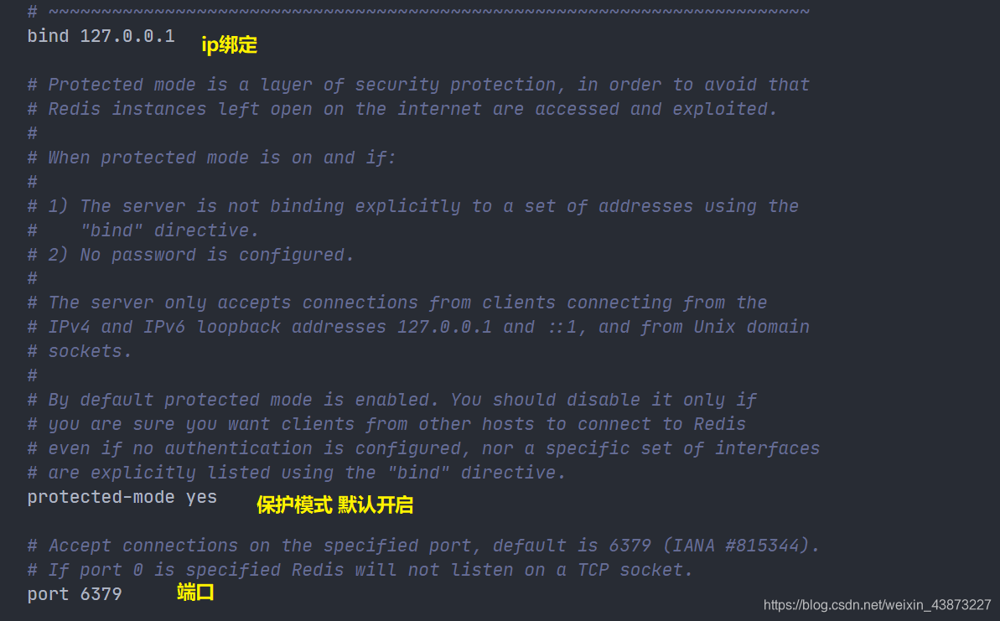
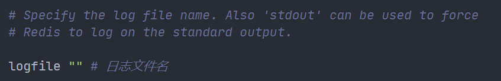
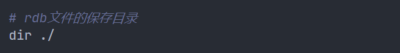

### Redis.conf

1. 容量单位不区分大小写，G和GB有区别
   
2. 可以使用 include 组合多个配置问题


1. 网络配置



1. 日志输出级别


1. 日志输出文件



1. 持久化规则

   > 由于Redis是基于内存的数据库，需要将数据由内存持久化到文件中
   >
   > 持久化方式：
   >
   > - RDB
   > - AOF


1. RDB文件相关
   



1. 关于主从复制，稍后再提


1. Security模块中进行密码设置


1. 客户端连接相关

   ```txt
   maxclients 10000  最大客户端数量
   maxmemory <bytes> 最大内存限制
   maxmemory-policy noeviction # 内存达到限制值的处理策略
   ```

   redis 中的**默认**的过期策略是 **volatile-lru** 。

   **设置方式**

   ```
   config set maxmemory-policy volatile-lru 
   ```

   ##### **maxmemory-policy 六种方式**

   **1、volatile-lru：**只对设置了过期时间的key进行LRU（默认值）

   **2、allkeys-lru ：** 删除lru算法的key

   **3、volatile-random：**随机删除即将过期key

   **4、allkeys-random：**随机删除

   **5、volatile-ttl ：** 删除即将过期的

   **6、noeviction ：** 永不过期，返回错误

2. AOF相关部分


