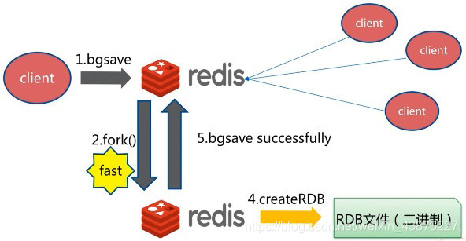

### 持久化——RDB

**RDB：Redis Databases**

#### 什么是RDB

在指定时间间隔后，将内存中的数据集快照写入数据库 ；在恢复时候，直接读取快照文件，进行数据的恢复 ；

默认情况下， Redis 将数据库快照保存在名字为 dump.rdb的二进制文件中。文件名可以在配置文件中进行自定义。

#### 工作原理

在进行 **`RDB`** 的时候，**`redis`** 的主线程是不会做 **`io`** 操作的，主线程会 **`fork`** 一个子线程来完成该操作；

1. Redis 调用forks。同时拥有父进程和子进程。
2. 子进程将数据集写入到一个临时 RDB 文件中。
3. 当子进程完成对新 RDB 文件的写入时，Redis 用新 RDB 文件替换原来的 RDB 文件，并删除旧的 RDB 文件。

这种工作方式使得 Redis 可以从写时复制（copy-on-write）机制中获益(因为是使用子进程进行写操作，而父进程依然可以接收来自客户端的请求。)

#### 触发机制

##### save

使用 `save` 命令，会立刻对当前内存中的数据进行持久化 ,但是会阻塞，也就是不接受其他操作了；

> 由于 `save` 命令是同步命令，会占用Redis的主进程。若Redis数据非常多时，`save`命令执行速度会非常慢，阻塞所有客户端的请求。

##### flushall命令

`flushall` 命令也会触发持久化 ；

##### 触发持久化规则

满足配置条件中的触发条件 ；

> 你可以通过配置文件对 Redis 进行设置， 让它在“ N 秒内数据集至少有 M 个改动”这一条件被满足时， 自动进行数据集保存操作。
>
> 

##### bgsave

`bgsave` 是异步进行，进行持久化的时候，`redis` 还可以将继续响应客户端请求 ；

1. 重新启动 `redis` ，也会触发，记进行加载持久化文件 ；

可以通过 `lastsave` 获取上一次 `save` 的时间 ；

**bgsave和save对比**

| 命令   | save               | bgsave                             |
| ------ | ------------------ | ---------------------------------- |
| IO类型 | 同步               | 异步                               |
| 阻塞？ | 是                 | 是（阻塞发生在fock()，通常非常快） |
| 复杂度 | O(n)               | O(n)                               |
| 优点   | 不会消耗额外的内存 | 不阻塞客户端命令                   |
| 缺点   | 阻塞客户端命令     | 需要fock子进程，消耗内存           |

#### 缺点

- 从子线程的工作方式，我们也可以看出，最后一次持久化操作以后的数据面临着丢失的风险；(如果子进程最后一次持久化操作失败，例如断电宕机，则导致整个持久化操作失败，临时文件不会覆盖原文件。)
- 耗时、耗性能。RDB 需要经常fork子进程来保存数据集到硬盘上，当数据集比较大的时候，fork的过程是非常耗时的，可能会导致Redis在一些毫秒级内不能响应客户端的请求。如果数据集巨大并且CPU性能不是很好的情况下，这种情况会持续1秒，AOF也需要fork，但是你可以调节重写日志文件的频率来提高数据集的耐久度。
- 不可控、丢失数据。如果你希望在redis意外停止工作（例如电源中断）的情况下丢失的数据最少的话，那么RDB不适合你。虽然你可以配置不同的save时间点(例如每隔5分钟并且对数据集有100个写的操作)，是Redis要完整的保存整个数据集是一个比较繁重的工作，你通常会每隔5分钟或者更久做一次完整的保存，万一在Redis意外宕机，你可能会丢失几分钟的数据。

#### 优点

- RDB是一个非常紧凑的文件，它保存了某个时间点得数据集，非常适用于数据集的备份，比如你可以在每个小时报保存一下过去24小时内的数据，同时每天保存过去30天的数据，这样即使出了问题你也可以根据需求恢复到不同版本的数据集。
- RDB是一个紧凑的单一文件，很方便传送到另一个远端数据中心或者亚马逊的S3（可能加密），非常适用于灾难恢复。
- RDB在保存RDB文件时父进程唯一需要做的就是fork出一个子进程，接下来的工作全部由子进程来做，父进程不需要再做其他IO操作，所以RDB持久化方式可以最大化redis的性能。
- 与AOF相比，在恢复大的数据集的时候，RDB方式会更快一些。

