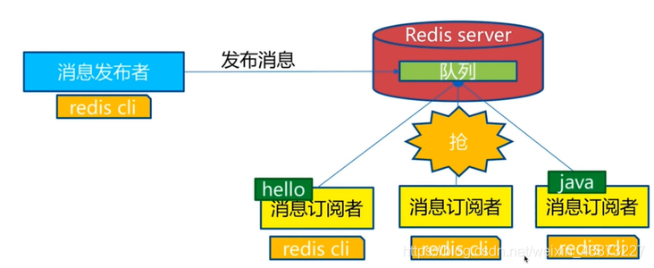
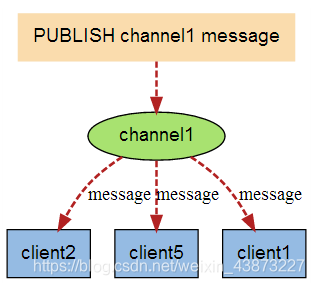
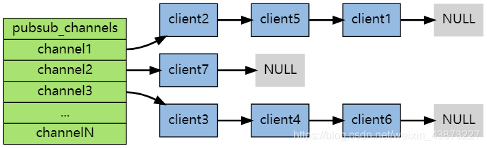

### Redis发布与订阅

Redis 发布订阅(pub/sub)是一种消息通信模式：发送者(pub)发送消息，订阅者(sub)接收消息。



下图展示了频道 channel1 ， 以及订阅这个频道的三个客户端 —— client2 、 client5 和 client1 之间的关系：


当有新消息通过 PUBLISH 命令发送给频道 channel1 时， 这个消息就会被发送给订阅它的三个客户端：



#### 命令

| 命令                                     | 描述                               |
| ---------------------------------------- | ---------------------------------- |
| `PSUBSCRIBE pattern [pattern..]`         | 订阅一个或多个符合给定模式的频道。 |
| `PUNSUBSCRIBE pattern [pattern..]`       | 退订一个或多个符合给定模式的频道。 |
| `PUBSUB subcommand [argument[argument]]` | 查看订阅与发布系统状态。           |
| `PUBLISH channel message`                | 向指定频道发布消息                 |
| `SUBSCRIBE channel [channel..]`          | 订阅给定的一个或多个频道。         |
| `SUBSCRIBE channel [channel..]`          | 退订一个或多个频道                 |

#### 示例

```shell
------------订阅端----------------------
127.0.0.1:6379> SUBSCRIBE sakura # 订阅sakura频道
Reading messages... (press Ctrl-C to quit) # 等待接收消息
1) "subscribe" # 订阅成功的消息
2) "sakura"
3) (integer) 1
1) "message" # 接收到来自sakura频道的消息 "hello world"
2) "sakura"
3) "hello world"
1) "message" # 接收到来自sakura频道的消息 "hello i am sakura"
2) "sakura"
3) "hello i am sakura"

--------------消息发布端-------------------
127.0.0.1:6379> PUBLISH sakura "hello world" # 发布消息到sakura频道
(integer) 1
127.0.0.1:6379> PUBLISH sakura "hello i am sakura" # 发布消息
(integer) 1

-----------------查看活跃的频道------------
127.0.0.1:6379> PUBSUB channels
1) "sakura"
```

#### 原理

每个 Redis 服务器进程都维持着一个表示服务器状态的 redis.h/redisServer 结构， 结构的 pubsub_channels 属性是一个字典， 这个字典就用于保存订阅频道的信息，其中，字典的键为正在被订阅的频道， 而字典的值则是一个链表， 链表中保存了所有订阅这个频道的客户端。



客户端订阅，就被链接到对应频道的链表的尾部，退订则就是将客户端节点从链表中移除。

#### 缺点

1，如果一个客户端订阅了频道，但自己读取消息的速度却不够快的话，那么不断积压的消息会使redis输出缓冲区的体积变得越来越大，这可能使得redis本身的速度变慢，甚至直接崩溃。
2，这和数据传输可靠性有关，如果在订阅方断线，那么他将会丢失所有在短线期间发布者发布的消息。

#### 应用

1. 消息订阅：公众号订阅，微博关注等等（起始更多是使用消息队列来进行实现）
2. 多人在线聊天室。

