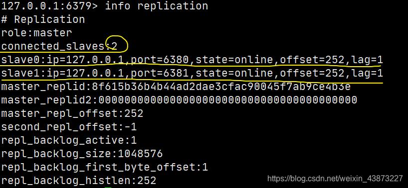

### 主从复制

#### 概念

主从复制，是指将一台Redis服务器的数据，复制到其他的Redis服务器。前者称为主节点（Master/Leader）,后者称为从节点（Slave/Follower），数据的复制是单向的！只能由主节点复制到从节点（主节点以写为主、从节点以读为主）。

默认情况下，每台Redis服务器都是主节点，一个主节点可以有0个或者多个从节点，但每个从节点只能由一个主节点。

#### 作用

1. 数据冗余：主从复制实现了数据的热备份，是持久化之外的一种数据冗余的方式。
2. 故障恢复：当主节点故障时，从节点可以暂时替代主节点提供服务，是一种服务冗余的方式
3. 负载均衡：在主从复制的基础上，配合读写分离，由主节点进行写操作，从节点进行读操作，分担服务器的负载；尤其是在多读少写的场景下，通过多个从节点分担负载，提高并发量。
4. 高可用基石：主从复制还是哨兵和集群能够实施的基础。

#### 为什么使用集群

1. 单台服务器难以负载大量的请求
2. 单台服务器故障率高，系统崩坏概率大
3. 单台服务器内存容量有限。

#### 环境配置

我们在讲解配置文件的时候，注意到有一个`replication`模块 (见Redis.conf中第8条)

查看当前库的信息：`info replication`

```shell
127.0.0.1:6379> info replication
# Replication
role:master # 角色
connected_slaves:0 # 从机数量
master_replid:3b54deef5b7b7b7f7dd8acefa23be48879b4fcff
master_replid2:0000000000000000000000000000000000000000
master_repl_offset:0
second_repl_offset:-1
repl_backlog_active:0
repl_backlog_size:1048576
repl_backlog_first_byte_offset:0
repl_backlog_histlen:0
```

既然需要启动多个服务，就需要多个配置文件。每个配置文件对应修改以下信息：

- 端口号
- pid文件名
- 日志文件名
- rdb文件名

启动单机多服务集群：


#### 一主二从配置

此时每个redis都是主节点，此时我们只需配置我们想要的从机即可。


使用`SLAVEOF host port`就可以为从机配置主机了。


然后主机上也能看到从机的状态：



我们这里是使用命令搭建，是暂时的，真实开发中应该在从机的配置文件中进行配置。


#### 使用规则

1. 从机只能读，不能写，主机可读可写但是多用于写。

   ```shell
   127.0.0.1:6381> set name sakura # 从机6381写入失败
   (error) READONLY You can't write against a read only replica.
   
   127.0.0.1:6380> set name sakura # 从机6380写入失败
   (error) READONLY You can't write against a read only replica.
   
   127.0.0.1:6379> set name sakura
   OK
   127.0.0.1:6379> get name
   "sakura"
   ```

2. 当主机断电宕机后，默认情况下从机的角色不会发生变化 ，集群中只是失去了写操作，当主机恢复以后，又会连接上从机恢复原状。

3. 当从机断电宕机后，若不是使用配置文件配置的从机，再次启动后作为主机是无法获取之前主机的数据的，若此时重新配置称为从机，又可以获取到主机的所有数据。这里就要提到一个同步原理。

4. 第二条中提到，默认情况下，主机故障后，不会出现新的主机，有两种方式可以产生新的主机：

   - 从机手动执行命令`slaveof no one`,这样执行以后从机会独立出来成为一个主机
   - 使用哨兵模式（自动选举）

#### 同步复制原理

##### 全量同步

Redis全量复制一般发生在Slave初始化阶段，这时Slave需要将Master上的所有数据都复制一份。

具体步骤如下：

- 从服务器连接主服务器，发送SYNC命令；
- 主服务器接收到SYNC命名后，开始执行BGSAVE命令生成RDB文件并使用缓冲区记录此后执行的所有写命令；
- 主服务器BGSAVE执行完后，向所有从服务器发送快照文件，并在发送期间继续记录被执行的写命令；
- 从服务器收到快照文件后丢弃所有旧数据，载入收到的快照；
- 主服务器快照发送完毕后开始向从服务器发送缓冲区中的写命令；
- 从服务器完成对快照的载入，开始接收命令请求，并执行来自主服务器缓冲区的写命令；


##### 增量同步

Redis增量复制是指Slave初始化后开始正常工作时，主服务器发生的写操作同步到从服务器的过程。

增量复制的过程主要：

- 主服务器每执行一个写命令就会向从服务器发送相同的写命令，从服务器接收并执行收到的写命令。

