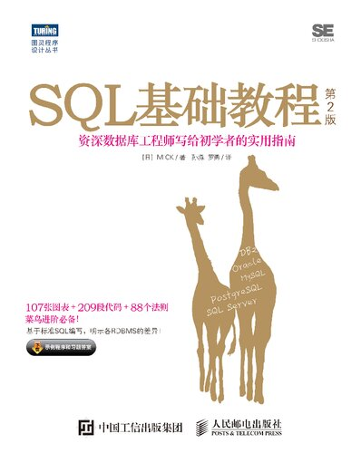
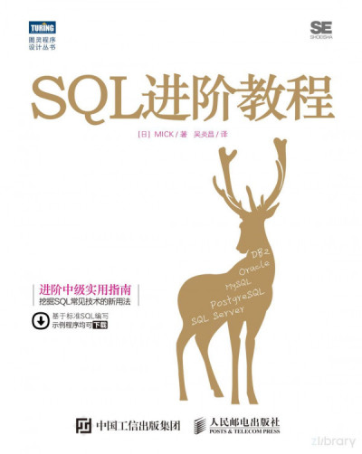

> **原文地址**：https://www.cnblogs.com/xjnotxj/p/12372807.html
>
> **参考书籍**：
>
> 《SQL基础教程》
>
> 
>
> 《SQL进阶教程》
>
> 

> 写在前面：本文主要注重 SQL 的理论、主流覆盖的功能范围及其基本语法/用法。至于详细的 SQL 语法/用法，因为每家 DBMS 都有些许不同，我会在以后专门介绍某款DBMS（例如 PostgreSQL）的时候写到。

# 第01章 DBMS与SQL

------

## 1、DBMS 是什么 ?

`数据库管理系统`（Database Management System, `DBMS`) 是用来管理数据库的计算机系统。

本文采用 `PostgreSQL` 为 `DBMS`。

## 2、为什么要用 DBMS ?

问：为什么不用 文本文件 或者 excel（+VBA）?

答：DBMS 的好处有：

- 多人共享
- 海量存储
- 可编程
- 容灾机制
- ……

## 3、DBMS 分类

### （1）层次数据库（Hierarchical Database, HDB)

### （2）关系数据库（Relational Database, RDB)

1969年诞生，形式为行列二维表，类似 excel，包括：

- SQL（Structured Query Language，结构化查询语言）
- `关系数据库管理系统`（Relational Database Management System，`RDBMS`）

> 如无特殊说明，本文所提到的 DBMS 都是指 RDBMS。

### （3）面向对象数据库（Object Oriented Database, OODB)

### （4）XML 数据库（XML Database, XMLDB)

### （5）键值存储系统（Key- Value Store, KVS)

## 4、DBMS 常见架构

C/S 结构。

## 5、搭建 DBMS 环境

参考我的文章 [《PostgreSQL 安装 & 用户配置》](https://www.cnblogs.com/xjnotxj/p/11198255.html)

## 6、SQL

### （1）SQL 介绍

`SQL`（Structured Query Language : 结构化查询语言）是一种特定目的编程语言，用于管理关系数据库管理系统（RDBMS）。

### （2）SQL 历史

1986 年，ANSI 首次制定了 SQL 的标准，之后又进行了数次修订。

1987 年成为国际标准化组织（ISO）标准。称为 **标准SQL**。

> 原则上，本书介绍的都是 标准SQL 的书写方式.

1986年，ANSI X3.135-1986，ISO/IEC 9075:1986，SQL-86

1989年，ANSI X3.135-1989，ISO/IEC 9075:1989，SQL-89

1992年，ANSI X3.135-1992，ISO/IEC 9075:1992，SQL-92（SQL2）

1999年，ISO/IEC 9075:1999，SQL:1999（SQL3）

2003年，ISO/IEC 9075:2003，SQL:2003

2008年，ISO/IEC 9075:2008，SQL:2008

2011年，ISO/IEC 9075:2011，SQL:2011

2016年，ISO/IEC 9075:2016，SQL:2016

> 截止目前，最新的为 SQL:2016。

### （3）SQL 分类

1、`DDL`（Data Definition Language，`数据定义语言`）

CREATE： 创建数据库和表等对象

DROP： 删除数据库和表等对象

ALTER： 修改数据库和表等对象的结构

2、`DML`（Data Manipulation Language，`数据操纵语言`）

SELECT：查询表中的数据

INSERT：向表中插入新数据

UPDATE：更新表中的数据

DELETE：删除表中的数据

3、`DCL`（Data Control Language，`数据控制语言`）

COMMIT： 确认对数据库中的数据进行的变更

ROLLBACK： 取消对数据库中的数据进行的变更

GRANT： 赋予用户操作权限

REVOKE： 取消用户的操作权限

总结：实际使用的 SQL 语句当中有 **90% 属于 DML**。

注意：**不同的数据库产品划分可能不尽相同**。例如在 Oracle 中，把 TRUINCATE 定义为 DDL，而不是 DML。而事务只对 DML 有效，因此，Oracle 中的 TRUNCATE 不能使用 ROLLBACK。（执行 TRUNCATE 的同时会默认执行 COMMIT 操作。）

### （4）SQL 注释

- 单行注释 —— `--` 之后
- 多行注释 —— `/*`和`*/`之间

### （5）SQL 书写建议

1、关键字大写（虽然 SQL 不区分关键字的大小写。）

2、前置逗号

```sql
SELECT col_1
, col_2
, col_3
, col_4
FROM tbl_A;
```

好处：方便选中和快速添删。

> 虽然分号或句号是表示语句结束的终止符，但是逗号是一种**连接符**，用于连接要素，从这一点来说，逗号的作用与 AND 或 OR 等是一样的。

