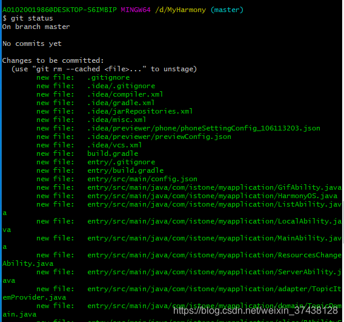
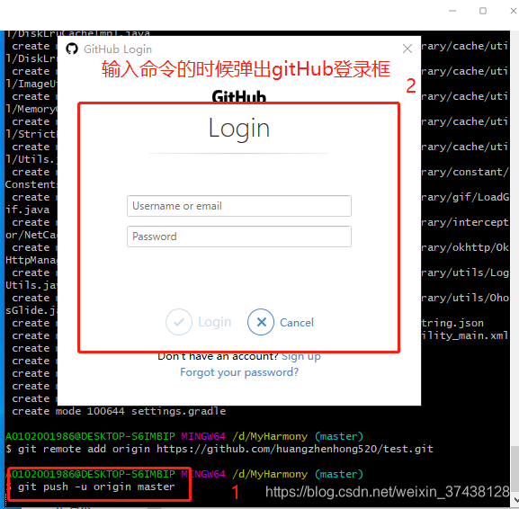
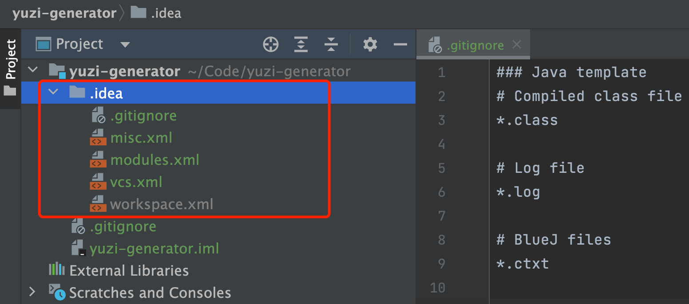
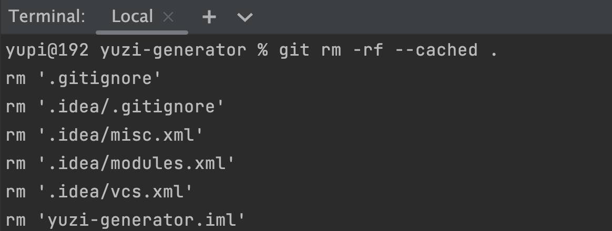
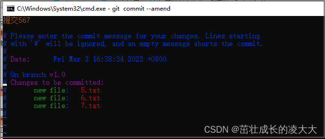

## GitHub上传自己的项目

> 原文地址：https://blog.csdn.net/weixin_37438128/article/details/118487040

首先在GitHub上创建一个仓库

这一步需要你在电脑上下载一个Git , 这里最好下载最新版本的Git，这里附上我下载的Git2.6.2的网址：https://git-scm.com/downloads，安装时如果没有特殊需求，一直下一步就可以了，安装完成之后，就可以接着下一步了;

提交代码到github上

1.在电脑磁盘中找到你的项目，右击选择git Base Here,进入命令行操作


 2.输入git init，

> git init

在当前项目的目录中生成本地的git管理（会发现在当前目录下多了一个.git文件夹）


3.输入git add . 

> git add . 

这个是将项目上所有的文件添加到本地仓库中的意思，如果想添加某个特定的文件，只需把.换成这个特定的文件名即可。


4. 用git status 可以查看当前仓库的提交状态(这一步可以忽略，只是查看提交到本地的代码是否成功);

> git status



5.输入git commit -m "first commit"；

> git commit -m "first commit

双引号内部表示你对这次提交的注释，双引号里面的内容可以根据个人的需要改。


6. 输入**git remote add origin** https://github.com/huangzhenhong520/test.git，将本地的仓库关联到github上。

> git remote add origin https://github.com/huangzhenhong520/test.git
>
> 查看远程仓库地址：
> git remote -v
>
> 修改远程仓库地址：
> 方式一  直接修改：  git remote set-url origin xxxxx.git
> 方式二 先删后加：   git remote rm origin
> 							     git remote add origin xxxxx.git


7. 输入git push -u origin main，把代码上传到github仓库main分支

> git push -u origin main

> ```bash
> git push -u origin main
> ```
>
> 等价于：
>
> ```bash
> git push --set-upstream origin main
> ```
>
> 执行后，Git 记录 `main` 分支的上游为 `origin/main`，之后你可以直接运行：
>
> ```bash
> git push  # 直接推送到 origin/main
> git pull  # 直接从 origin/main 拉取
> ```
>
> 如果没有使用 `-u`，每次推送都需要指定远程和分支：
>
> ```bash
> git push origin main
> ```
>
> 但如果已经设置了上游分支，就可以省略 `origin main` 直接用 `git push`。

 

输入gitHub的登录名和登录密码，点击login，会再次弹框填写github的登录名，点击ok，再弹框填写github的密码，点击ok


 

到这就结束了，还有问题请留言

## 配置git代理

git config --global http.proxy http://127.0.0.1:7890 
git config --global https.proxy https://127.0.0.1:7890 

git config --global --unset http.proxy 
git config --global --unset https.proxy

## 取消git add操作

有些文件已经添加到了 .gitignore 文件中，在 IDEA 中显示的还是绿色（已被 Git 托管）状态。如下图：



这是因为这些文件已经被 Git 跟踪。而 .gitignore 文件仅影响未跟踪的文件，如果文件已经被 Git 跟踪，那么 .gitignore 文件对它们没有影响。

所以我们需要打开终端，在项目根目录下执行如下命令，取消 Git 跟踪：

```shell
git rm -rf --cached .
```

执行效果如图：



可以看到文件变成了红色（未被 Git 托管）或黄色（被忽略）状态：


## git回滚代码--快速上手

**摘要**：使用Git回退命令reset回退代码到某次commit。

  需求背景：
需要回滚提交的代码的场景常常是如下三个：

- 提交代码到错误Git分支；
- 提交的代码不需要上线了，而同一分支有需要上线的代码；
- 提交了不需要提交的代码。

  解决办法：使用Git回滚命令`reset`。

  Git回滚命令有如下三个使用方式，请因地制宜，切换到指定分支后，根据自己的情况选择合适的那个：

```bash
git reset --hard HEAD^ 回退到上个版本。
git reset --hard HEAD~n 回退到前n次提交之前，若n=3，则可以回退到3次提交之前。
git reset --hard commit_sha 回滚到指定commit的sha码，推荐使用这种方式。
```

  **示例** 在终端切换到项目所在目录之后，基于下图中的commit SHA进行代码回滚：

```bash
git reset --hard 05ac0bfb2929d9cbwiener75e52ecb011950fb
```


拷贝SHA码

  hard是强制执行的意思，执行上述某条命令后，本地文件就会被修改，回滚到指定commit SHA。如果再执行如下命令，则会强推到远程仓库，进而修改远程仓库的文件：

```bash
git push origin HEAD --force
```

  开发过程中，总是遇到不小心提交不能提交的代码，有了reset必杀技，再也不用担心错误提交代码了。至此，大功告成。

## git回滚代码--详细理解

###  1. 代码撤销

  目前大家都在使用`git`，在项目开发中，总会遇到提交的代码有问题，想要撤销回滚的操作，关于撤销回滚代码单独给大家介绍一下。
  正常的提交代码如果要提交到远程仓库有下边3步命令：

```xml
     git add . ------------> git commit -m 说明 -------------> git push
   (添加到暂存区)              （提交到本地仓库）             （推送到远程仓库）
```

  在`git`里，撤销代码的命令主要为`git reset`，但是有`git reset --soft`、`git reset --hard`、`git reset --mixed`3种模式。这三种命令主要是针对已提交仓库之后的代码的回滚，基本后边都是要带上提交日志版本号回滚的。3种模式代表的不同含义如下：

- `--soft`:该命令表示撤销代码到暂存区之后，`commit`之前，代码在本地不会改变。
- `--mixed`:该命令表示撤销代码到暂存区和`commit`之前，代码在本地不会改变。
- `--hard`:该命令表示回退代码到某个版本下，代码在本地会改变到指定版本下，谨慎操作。
  下边要说的内容，简单如下图所示：
  

**再次强调：`--hard`命令，在使用时千万注意，带上它会把代码直接回滚没了。就算是本地新写的都给清掉了。**

### 2. 不同模式下的撤销

  下边围绕上边的提交步骤和撤销的模式分别解释下撤销后的现象。在说撤销之前，先熟悉两个命令`git status`、`git log`。
  首先`git status`通过这个命令，能够看到当前代码在哪个分支下、工作区的代码情况。

  如上图，在代码工作区中输入`git status`之后，能够看到当前代码处在`v1.0`分支下，当前工作区中有1个文件`5.txt`还没有提交到暂存区。
  `git log`命令是查看的代码提交的记录，能够看到提交信息及版本号(SHA码)。如下图：

  当然我这篇讲的命令执行位置，都是需要在`git`项目工作空间里执行，一般都是在项目根路径下执行。
  代码撤销这块，我主要想到有下边这几种撤销，`提交暂存区的撤销（add撤销）`、`提交本地仓库撤销（commit撤销）`、`推送远程仓库撤销（git push之后的撤销）`。具体如下：

#### 2.1 add撤销

  当代码通过`git add .`提交到暂存区，如果想要从暂存区撤回来，主要有以下几个方法。

##### 2.1.1 `git reset`撤销

  如果想将提交到暂存区的代码，直接撤回来，最方便的是输入`git reset`命令。该命令或者输入`git reset HEAD`效果一样。此步骤会将代码撤销到执行`git add .`前的状态，如下图所示：


##### 2.1.2 `git restore`撤销

  当然还有一个命令是`git`推荐的，但是感觉不如`git reset`方便。即上面图中绿色文字上边的一行里，`git restore --staged`命令。

```
git restore --staged .
```

或者：

```
git restore --staged 文件名
```

##### 2.1.3 `git reset --mixed`撤销

 &emsp；最前边说了撤销的三种模式，其中`--mixed`模式，如果想撤销刚提交到暂存区的代码，也可以如下操作：

```
git reset --mixed
```

  但是那三种模式`--soft`、`--mixed`、`--hard`主要用来基于已commit的代码**版本号**回滚代码的，用在这里有点大材小用。**另外只有`--mixed`可以不用写版本号完成撤销操作**，其他两个不写版本号（除了用HEAD^）都无效果。
  **提个问题：使用`--soft`能够回退`git add .`前的代码吗？使用`--hard`可以回滚吗？另外回滚会有什么现象？**

#### 2.2 commit撤销

  当代码经过`git commit -m 备注说明`提交本地仓库之后，想要代码回滚，有以下几种方法来回退不同状态的代码。主要使用`--soft`、`--mixed`模式。关于后边追加版本号的方法，下边只在`--soft`模式下介绍。

##### 2.2.1 撤销到暂存区

  只是将代码撤销到暂存区之后，还未添加到本地仓库的话，只能使用`--soft`模式。使用该模式需要加版本号，写法主要有以下几种。

###### 2.2.1.1 `git reset --soft HEAD^`写法

  `HEAD^`表示撤销到上一个版本号，其中一个`^`表示上一次，`^^`表示上上次，以此类推。另外，需要注意，非`windows`系统下正常输入`git reset --soft HEAD^`，即可将代码撤销到`git add .`之后的状态（暂存区状态）。但是`windows`系统下需要输入`git reset --soft HEAD^^`才可以。

  这是因为在`windows`系统下cmd控制台中换行符默认是`^`，而不是`\` ，如果输入少了，会提示more？，意思是问你下一行是否需要再输入，而`^`符号就被当做换行符而被git命令忽略掉了。

  因此，如果在`windows`下是撤销2次`commit`,需要输入4个`^`才可以。

```
解释：当每次commit之后，都会有提交的记录版本号（通过输入git log命令查看）,通过HEAD^只能撤销一次，
拼接多个就会撤销多个。
```

###### 2.2.1.2 `git reset --soft HEAD~`写法

  `git reset --soft HEAD~1`命令，其中`1`表示撤销上一次提交，如果是再前一次`~2`即可。
   此命令不分`windows`系统和非`windows`的问题，可以优先使用这个。

###### 2.2.1.3 `git reset --soft 版本号`写法

   如果想撤销的版本在很久之前，无法用数字或多个`^`来锁定，这种情况下，可以通过使用`git log`查看历次提交记录，然后根据版本号来撤销，`git reset --soft 版本号`。

  也可以看自己需要使用`--mixed` 、`--hard`（谨慎）来回退不同模式的代码。
  如下图所示，是查看的日志情况：

```sql
D:\workspaces\testproject>git log
commit 15047ee4229c4c0255a62816290c2a41068e8327 (HEAD -> master)
Author: lingsf <944916889@qq.com>
Date:   Tue Jan 3 20:16:53 2023 +0800

    提交9文件

commit 09f0fd5e00d863ccab839824c0ac11f2c82dabf2
Author: lingsf <944916889@qq.com>
Date:   Tue Jan 3 20:04:43 2023 +0800

    提交8文件

commit 9e10843e96f7cd5a138f405231f06c61e83c4429
Author: lingsf <944916889@qq.com>
Date:   Tue Jan 3 19:48:54 2023 +0800

    提交7文件

commit 05fd4925cf0e4341a404d5c5596470d6053d7319
Author: lingsf <944916889@qq.com>
Date:   Tue Jan 3 16:40:48 2023 +0800
```

   回退到`提交7文件`这一版本：

```sql
D:\workspaces\testproject>git reset --soft 9e10843e96f7cd5a138f405231f06c61e83c4429

D:\workspaces\testproject>git log
commit 9e10843e96f7cd5a138f405231f06c61e83c4429 (HEAD -> master)
Author: lingsf <944916889@qq.com>
Date:   Tue Jan 3 19:48:54 2023 +0800

    提交7文件
```

##### 2.2.2 撤销到暂存区之前 — `git reset --mixed`

  假如你想撤销到暂存区之前(即 `git add .`之前)，只需要将`--soft`修改为`--mixed`即可。其他的用法和上边一致。

#### 2.3 commit之后修改注释

  其实很多时候，我们撤销代码可能只是因为注释写的不完善，想重新修改。如果只是想修改下`commit`后的注释，可以在`commit`之后，还没有推送远程分支之前，使用`git commit --amend`命令，进入vim编辑空间，输入`i`进入编辑模式，修改最上边的注释文字，修改完之后点击`esc`键，再输入`:wq`保存退出即可。如下图：


  当然，如果已推送到远程分支上，虽然也能通过这个命令修改日志内容，但是修改完再提交就是新的日志记录，远程上仍然会有旧的注释。
  另外，还有假如说我们在本地提交了两次`commit`填写了两次说明，那也仅仅只能修改最后一次。

#### 2.4 已推送远程仓库后的撤销

   推送到远程仓库和提交本地仓库没有什么区别，仍然使用三种模式`--soft`、`--mixed`、`--hard`进行撤销即可。因为撤销其实不管你用什么模式，都是撤销的我们本地代码，与远程无关，至于你撤销完代码之后，是合并回原分支，还是新拉分支，代码是不会影响远程分支的。
  使用`--hard`（谨慎）来回退不同模式的代码。
  另外，已经推送到远程分支的代码记录，是无法撤销的，只能是撤销回来本地的改完再提交回去，但是无法撤销以前的提交记录。

### 3. 实际操作

#### 3.1 场景一：线上分支被覆盖，加了新的功能。

  有一次我们一个线上项目新增后续租金存量需求，研发直接在线上主分支开发的。但是新开发的功能因为测试和其他问题没法直接上线。后来线上提出了几个bug，需要进行修改。因为线上分支已经加了后续租金存量的代码，这种情况下如果想回滚会线上分支，可以采取以下步骤。

##### 3.1.1 拉出新的临时分支

  先基于目前的分支（包含了存量后续租金需求），拉出一个新的临时分支。

##### 3.1.2 通过提交记录找到回滚位置

  基于提交说明（此处就体现了要正确写代码提交备注的重要性），找到代码首次提交后续租金存量的需求点，记录下在它之前的版本号。如下：

  经过分析，需要回滚到`19f5a4a3`这次，才能够回滚到线上分支那个状态。

##### 3.1.3 基于`--hard`回退代码

  基于上图右侧的版本号`19f5a4a3b87f0478a9ed061de5fa0e756a36c295`，点击复制，然后在这个新拉的临时分支里，输入`git reset --hard 19f5a4a3b87f0478a9ed061de5fa0e756a36c295`即可完成这个分支的代码回滚，经过测试没有问题之后，再将该分支合并或者改名为新的线上主分支。

#### 3.2 场景二：本地代码已经写了部分功能，但是还没有提交

  本地如果在主分支上新增功能，主要是加了很多开发的东西，还未提交，这时候可能线上加急解决一个问题，需要修改一下，但是自己新加的代码还没有完成，还要去改以前的分支，这时候应该这么做。

##### 3.2.1 基于现在代码新拉分支

  代码不要提交仓库，如果提交了的话，就按照前边的步骤（不能使用–hard）回滚回来，然后先使用`git checkout -b 新分支名`,拉出一个分支。在这个分支上将代码至少提交到本地仓库。

##### 3.2.2 切回原来的分支

  当新分支代码已提交，再切回主分支的时候，这个分支上就还是线上分支，加急修改要求的问题即可。

### 4. 总结

  代码撤销是应用比较频繁的一个功能，一般最常用的就是`git reset` 和`git reset --amend`修改注释两个命令。在使用过程中，一定注意`--hard`，多加练习就知道其中的区别了。

## 解决github文件夹出现箭头


因为这个文件夹里面有.git隐藏文件，github就将他视为一个子系统模块了。

解决办法就是：

1、删除文件夹里面的.git文件夹

2、执行git rm --cached [文件夹名]

3、执行git add [文件夹名]

4、执行git commit -m "msg"

5、执行git push origin [branch_name]  （如果不是第一次push,直接git push就可以）


执行完上述操作后箭头消失

## 解决main has no tracked branch


解决办法：执行下面的命令

```bash
bashgit branch --set-upstream-to=origin/分支名
```

## 解决 refusing to merge unrelated histories

### 问题

1、本地初始化了git仓库，放了一些文件进去并进行了add操作和commit提交操作；

```bash
$git add -A
$git commit -m "start 2018-06-06"
```

2、github创建了git仓库并建立了README文件；


3、本地仓库添加了github上的git仓库作为远程仓库，起名origin；

```bash
$git remote add origin https://github.com/tielemao/TielemaoMarkdown
```


4、问题来了，本地仓库在想做同步远程仓库到本地为之后本地仓库推送到远程仓库做准备时报错了，错误如下：

`fatal: refusing to merge unrelated histories`
（拒绝合并不相关的历史）

### 解决

出现这个问题的最主要原因还是在于本地仓库和远程仓库实际上是独立的两个仓库。假如我之前是直接clone的方式在本地建立起远程github仓库的克隆本地仓库就不会有这问题了。

查阅了一下资料，发现可以在pull命令后紧接着使用`--allow-unrelated-history`选项来解决问题（该选项可以合并两个独立启动仓库的历史）。

命令：

```bash
$git pull origin master --allow-unrelated-histories
```

以上是将远程仓库的文件拉取到本地仓库了。
紧接着将本地仓库的提交推送到远程github仓库上，使用的命令是：

```bash
$ git push <远程主机名> <本地分支名>:<远程分支名>
也就是
$git push origin master:master
提交成功。
```


### pull

`git pull` 命令基本上就是 `git fetch` 和 `git merge` 命令的组合体，Git 从指定的远程仓库中抓取内容，然后马上尝试将其合并进你所在的分支中。

从远程仓库中获得数据，可以执行：

```console
$ git fetch [remote-name]
```

这个命令会访问远程仓库，从中拉取所有你还没有的数据。 执行完成后，你将会拥有那个远程仓库中所有分支的引用，可以随时合并或查看。

但是注意的是 `git fetch` 并不会自动合并或修改你当前的工作。 当准备好时你必须手动将其合并入你的工作。

如果你使用 `clone` 命令克隆了一个仓库，命令会自动将其添加为远程仓库并默认以 “origin” 为简写。 所以，`git fetch origin` 会抓取克隆（或上一次抓取）后新推送的所有工作。

由于fetch命令后还要再做一步merge命令的操作，所以使用 `git pull` 命令来自动的抓取然后合并远程分支到当前分支。 （相当于一次执行fetch加merge命令）这可能会是一个更简单或更舒服的工作流程。

## git创建新分支，并将本地代码提交到新分支上

###  一、clone Repository

clone Github 上的Repository，如下：

```bash
git clone git@github.com:FBing/design-patterns.git
```

### 二、管理分支

#### 1、查看分支

##### A、查看本地分支

使用 `git branch`命令，如下：

```bashit branch
* master
```

*标识的是你当前所在的分支。

##### B、查看远程分支

命令如下：

 ```bash 
git branch -r
 ```

##### C、查看所有分支

命令如下：

```bash
git branch -a
```

#### 2、本地创建新的分支

命令如下：

```bash
git branch [branch name]
```

例如：

```bash
git branch gh-dev
```

#### 3、切换到新的分支

命令如下：

```bash
git checkout [branch name]
```

例如：

```bash
git checkout gh-dev
```

#### 4、创建+切换分支

创建分支的同时切换到该分支上，命令如下：

```bash
git checkout -b [branch name]
```

git checkout -b [branch name] 的效果相当于以下两步操作：

```bash
git branch [branch name]
git checkout [branch name]
```

#### 5、将新分支推送到github

命令如下：

```bash
git push origin [branch name]
```

例如：

```bash
git push origin gh-dev
```

#### 6、删除本地分支

命令如下：

```bash
git branch -d [branch name]
```

例如：

```bash
git branch -d gh-dev
```

#### 7、删除github远程分支

命令如下：

```bash
git push origin :[branch name]
```

分支名前的冒号代表删除。
例如：

```bash
git push origin :gh-dev
```

### 三、git提交本地代码到新分支

#### 1、切换到新的分支

命令如下：

```bash
git checkout [branch name]
```

例如：

```bash
git checkout gh-dev
```

#### 2、添加本地需要提交代码

命令如下：

```bash
git add .
```

#### 3、提交本地代码

命令如下：

```bash
git commit -m "add my code to new branchB"
```

#### 4、push 到git仓库

命令如下：

```bash
git push origin [branch name]
```

例如：

```bash
git push origin gh-dev
```

