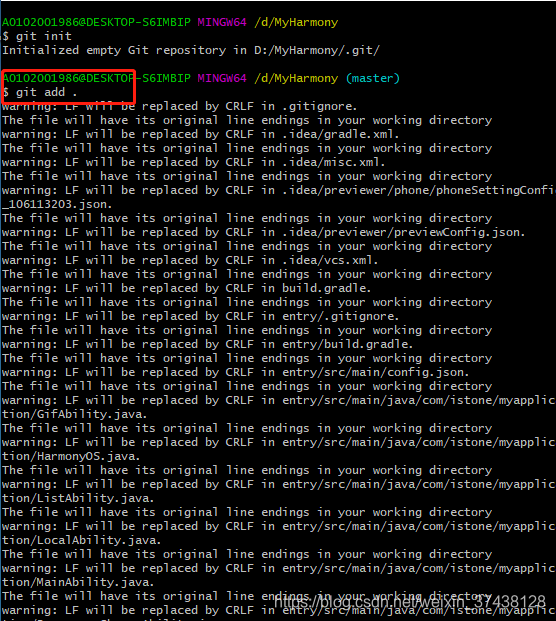
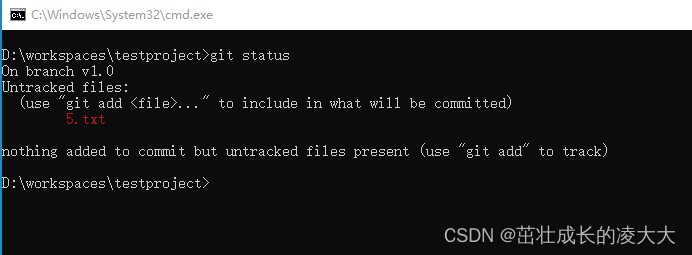
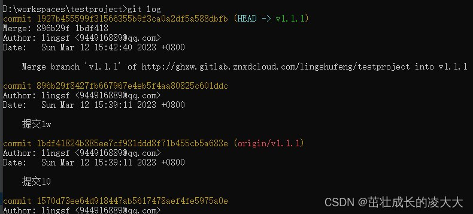
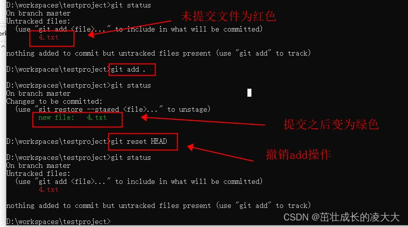
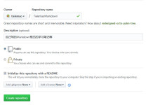

# 什么是版本控制 

## 什么是版本控制

版本控制（Revision control）是一种在开发的过程中用于管理我们对文件、目录或工程等内容的修改历史，方便查看更改历史记录，备份以便恢复以前的版本的软件工程技术。

- 实现跨区域多人协同开发
- 追踪和记载一个或者多个文件的历史记录
- 组织和保护你的源代码和文档
- 统计工作量
- 并行开发、提高开发效率
- 跟踪记录整个软件的开发过程
- 减轻开发人员的负担，节省时间，同时降低人为错误

简单说就是用于管理多人协同开发项目的技术。

没有进行版本控制或者版本控制本身缺乏正确的流程管理，在软件开发过程中将会引入很多问题，如软件代码的一致性、软件内容的冗余、软件过程的事物性、软件开发过程中的并发性、软件源代码的安全性，以及软件的整合等问题。

无论是工作还是学习，或者是自己做笔记，都经历过这样一个阶段！我们就迫切需要一个版本控制工具！


多人开发就必须要使用版本控制！

## 常见的版本控制工具

我们学习的东西，一定是当下最流行的！

主流的版本控制器有如下这些：

- **Git**
- **SVN**（Subversion）
- **CVS**（Concurrent Versions System）
- **VSS**（Micorosoft Visual SourceSafe）
- **TFS**（Team Foundation Server）
- Visual Studio Online

版本控制产品非常的多（Perforce、Rational ClearCase、RCS（GNU Revision Control System）、Serena Dimention、SVK、BitKeeper、Monotone、Bazaar、Mercurial、SourceGear Vault），现在影响力最大且使用最广泛的是Git与SVN

## 版本控制分类

**1、本地版本控制**

记录文件每次的更新，可以对每个版本做一个快照，或是记录补丁文件，适合个人用，如RCS。


**2、集中版本控制 SVN**

所有的版本数据都保存在服务器上，协同开发者从服务器上同步更新或上传自己的修改


所有的版本数据都存在服务器上，用户的本地只有自己以前所同步的版本，如果不连网的话，用户就看不到历史版本，也无法切换版本验证问题，或在不同分支工作。而且，所有数据都保存在单一的服务器上，有很大的风险这个服务器会损坏，这样就会丢失所有的数据，当然可以定期备份。代表产品：SVN、CVS、VSS

**3、分布式版本控制 Git**

每个人都拥有全部的代码！安全隐患！

所有版本信息仓库全部同步到本地的每个用户，这样就可以在本地查看所有版本历史，可以离线在本地提交，只需在连网时push到相应的服务器或其他用户那里。由于每个用户那里保存的都是所有的版本数据，只要有一个用户的设备没有问题就可以恢复所有的数据，但这增加了本地存储空间的占用。

不会因为服务器损坏或者网络问题，造成不能工作的情况！


## Git与SVN的主要区别

SVN是集中式版本控制系统，版本库是集中放在中央服务器的，而工作的时候，用的都是自己的电脑，所以首先要从中央服务器得到最新的版本，然后工作，完成工作后，需要把自己做完的活推送到中央服务器。集中式版本控制系统是必须联网才能工作，对网络带宽要求较高。


Git是分布式版本控制系统，没有中央服务器，每个人的电脑就是一个完整的版本库，工作的时候不需要联网了，因为版本都在自己电脑上。协同的方法是这样的：比如说自己在电脑上改了文件A，其他人也在电脑上改了文件A，这时，你们两之间只需把各自的修改推送给对方，就可以互相看到对方的修改了。Git可以直接看到更新了哪些代码和文件！

**Git是目前世界上最先进的分布式版本控制系统。**

聊聊Git的历史

同生活中的许多伟大事物一样，Git 诞生于一个极富纷争大举创新的年代。

Linux 内核开源项目有着为数众广的参与者。绝大多数的 Linux 内核维护工作都花在了提交补丁和保存归档的繁琐事务上(1991－2002年间)。到 2002 年，整个项目组开始启用一个专有的分布式版本控制系统 BitKeeper 来管理和维护代码。

Linux社区中存在很多的大佬！破解研究 BitKeeper ！

到了 2005 年，开发 BitKeeper 的商业公司同 Linux 内核开源社区的合作关系结束，他们收回了 Linux 内核社区免费使用 BitKeeper 的权力。这就迫使 Linux 开源社区(特别是 Linux 的缔造者 Linus Torvalds)基于使用 BitKeeper 时的经验教训，开发出自己的版本系统。（2周左右！） 也就是后来的 Git！

**Git是目前世界上最先进的分布式版本控制系统。**

Git是免费、开源的，最初Git是为辅助 Linux 内核开发的，来替代 BitKeeper！


Linux和Git之父李纳斯·托沃兹（Linus Benedic Torvalds）1969、芬兰

# Git环境配置

## 软件下载

打开 [git官网] https://git-scm.com/，下载git对应操作系统的版本。

所有东西下载慢的话就可以去找镜像！

官网下载太慢，我们可以使用淘宝镜像下载：http://npm.taobao.org/mirrors/git-for-windows/


下载对应的版本即可安装！

安装：无脑下一步即可！安装完毕就可以使用了！

## 启动Git

安装成功后在开始菜单中会有Git项，菜单下有3个程序：任意文件夹下右键也可以看到对应的程序！


**Git Bash：**Unix与Linux风格的命令行，使用最多，推荐最多

**Git CMD：**Windows风格的命令行

**Git GUI**：图形界面的Git，不建议初学者使用，尽量先熟悉常用命令

## 常用的Linux命令

平时一定要多使用这些基础的命令！

1）、cd : 改变目录。

2）、cd . . 回退到上一个目录，直接cd进入默认目录

3）、pwd : 显示当前所在的目录路径。

4）、ls(ll): 都是列出当前目录中的所有文件，只不过ll(两个ll)列出的内容更为详细。

5）、touch : 新建一个文件 如 touch index.js 就会在当前目录下新建一个index.js文件。

6）、rm: 删除一个文件, rm index.js 就会把index.js文件删除。

7）、mkdir: 新建一个目录,就是新建一个文件夹。

8）、rm -r : 删除一个文件夹, rm -r src 删除src目录

```bash
rm -rf /  切勿在Linux中尝试！删除电脑中全部文件！
```

9）、mv 移动文件, ` mv index.html src `     

​		index.html 是我们要移动的文件, src 是目标文件夹,当然, 这样写,必须保证文件和目标文件夹在同一目录下。

10）、reset 重新初始化终端/清屏。

11）、clear 清屏。

12）、history 查看命令历史。

13）、help 帮助。

14）、exit 退出。

15）、#表示注释

## Git配置 -- git config

所有的配置文件，其实都保存在本地！

查看配置 git config -l


查看不同级别的配置文件：

```bash
#查看系统config
git config --system --list

#查看当前用户（global）配置
git config --global  --list

#查看当前仓库配置信息
git config --local  --list
```

**Git相关的配置文件：**

1）、Git\etc\gitconfig ：Git 安装目录下的 gitconfig --system 系统级

2）、C:\Users\Administrator\ .gitconfig 只适用于当前登录用户的配置 --global 全局


这里可以直接编辑配置文件，通过命令设置后会响应到这里。

## 设置用户名与邮箱（用户标识，必要）

当你安装Git后首先要做的事情是设置你的用户名称和e-mail地址。这是非常重要的，因为每次Git提交都会使用该信息。它被永远的嵌入到了你的提交中：

```bash
git config --global user.name "kuangshen"  #名称

git config --global user.email 24736743@qq.com   #邮箱
```

只需要做一次这个设置，如果你传递了--global 选项，因为Git将总是会使用该信息来处理你在系统中所做的一切操作。如果你希望在一个特定的项目中使用不同的名称或e-mail地址，你可以在该项目中运行该命令而不要--global选项。总之--global为全局配置，不加为某个项目的特定配置。


# Git基本理论（重要）

## 三个区域(本地)

Git**本地**有三个工作区域：工作目录（Working Directory）、暂存区(Stage/Index)、资源库(Repository或Git Directory)。如果在加上远程的git仓库(Remote Directory)就可以分为四个工作区域。文件在这四个区域之间的转换关系如下：


- Workspace：工作区，就是你平时存放项目代码的地方
- Index / Stage：暂存区，用于临时存放你的改动，事实上它只是一个文件，保存即将提交到文件列表信息
- Repository：仓库区（或本地仓库），就是安全存放数据的位置，这里面有你提交到所有版本的数据。其中HEAD指向最新放入仓库的版本
- Remote：远程仓库，托管代码的服务器，可以简单的认为是你项目组中的一台电脑用于远程数据交换

本地的三个区域确切的说应该是git仓库中HEAD指向的版本：


- Directory：使用Git管理的一个目录，也就是一个仓库，包含我们的工作空间和Git的管理空间。
- WorkSpace：需要通过Git进行版本控制的目录和文件，这些目录和文件组成了工作空间。
- .git：存放Git管理信息的目录，初始化仓库的时候自动创建。
- Index/Stage：暂存区，或者叫待提交更新区，在提交进入repo之前，我们可以把所有的更新放在暂存区。
- Local Repo：本地仓库，一个存放在本地的版本库；HEAD会只是当前的开发分支（branch）。
- Stash：隐藏，是一个工作状态保存栈，用于保存/恢复WorkSpace中的临时状态。

## 工作流程

git的工作流程一般是这样的：

１、在工作目录中添加、修改文件；

２、将需要进行版本管理的文件放入暂存区域；

３、将暂存区域的文件提交到git仓库。

因此，git管理的文件有三种状态：已修改（modified）,已暂存（staged）,已提交(committed)


# Git项目搭建

## 创建工作目录与常用指令

工作目录（WorkSpace)一般就是你希望Git帮助你管理的文件夹，可以是你项目的目录，也可以是一个空目录，建议不要有中文。

日常使用只要记住下图6个命令：


## 本地仓库搭建

创建本地仓库的方法有两种：一种是创建全新的仓库，另一种是克隆远程仓库。

1、创建全新的仓库，需要用GIT管理的项目的根目录执行：

```
# 在当前目录新建一个Git代码库

$ git init
```

2、执行后可以看到，仅仅在项目目录多出了一个.git目录，关于版本等的所有信息都在这个目录里面。

## 克隆远程仓库

1、另一种方式是克隆远程目录，由于是将远程服务器上的仓库完全镜像一份至本地！

```
# 克隆一个项目和它的整个代码历史(版本信息)

$ git clone [url]  # https://gitee.com/kuangstudy/openclass.git
```

2、去 gitee 或者 github 上克隆一个测试！

# Git文件操作

## 文件的四种状态

版本控制就是对文件的版本控制，要对文件进行修改、提交等操作，首先要知道文件当前在什么状态，不然可能会提交了现在还不想提交的文件，或者要提交的文件没提交上。

- Untracked: 未跟踪, 此文件在文件夹中, 但并没有加入到git库, 不参与版本控制. 通过git add 状态变为Staged.
- Unmodify: 文件已经入库, 未修改, 即版本库中的文件快照内容与文件夹中完全一致. 这种类型的文件有两种去处, 如果它被修改, 就变为Modified。 如果使用git rm移出版本库, 则成为Untracked文件
- Modified: 文件已修改, 仅仅是修改, 并没有进行其他的操作. 这个文件也有两个去处, 通过git add可进入暂存staged状态, 使用git checkout 则丢弃修改过, 返回到unmodify状态, 这个git checkout即从库中取出文件, 覆盖当前修改 !
- Staged: 暂存状态. 执行git commit则将修改同步到库中, 这时库中的文件和本地文件又变为一致, 文件为Unmodify状态. 执行git reset HEAD filename取消暂存, 文件状态为Modified

## 查看文件状态

上面说文件有4种状态，通过如下命令可以查看到文件的状态：

```
#查看指定文件状态
git status [filename]

#查看所有文件状态
git status

# git add .                  添加所有文件到暂存区

# git commit -m "消息内容"    提交暂存区中的内容到本地仓库 -m 提交信息
```

## 忽略文件

有些时候我们不想把某些文件纳入版本控制中，比如数据库文件，临时文件，设计文件等

在主目录下建立".gitignore"文件，此文件有如下规则：

1. 忽略文件中的空行或以井号（#）开始的行将会被忽略。
2. 可以使用Linux通配符。例如：星号（*）代表任意多个字符，问号（？）代表一个字符，方括号（[abc]）代表可选字符范围，大括号（{string1,string2,...}）代表可选的字符串等。
3. 如果名称的最前面有一个感叹号（!），表示例外规则，将不被忽略。
4. 如果名称的最前面是一个路径分隔符（/），表示要忽略的文件在此目录下，而子目录中的文件不忽略。
5. 如果名称的最后面是一个路径分隔符（/），表示要忽略的是此目录下该名称的子目录，而非文件（默认文件或目录都忽略）。

```
#为注释

*.txt        #忽略所有 .txt结尾的文件,这样的话上传就不会被选中！

!lib.txt     #但lib.txt除外

/temp        #仅忽略项目根目录下的TODO文件,不包括其它目录temp

build/       #忽略build/目录下的所有文件

doc/*.txt    #会忽略 doc/notes.txt 但不包括 doc/server/arch.txt
```

# 使用码云

**github 是有墙的，比较慢，在国内的话，我们一般使用 gitee ，公司中有时候会搭建自己的gitlab服务器**

这个其实可以作为大家未来找工作的一个重要信息！

1、注册登录码云，完善个人信息


2、设置本机绑定SSH公钥，实现免密码登录！（免密码登录，这一步挺重要的，码云是远程仓库，我们是平时工作在本地仓库！)

```
# 进入 C:\Users\Administrator\.ssh 目录


# 生成公钥


ssh-keygen
```


3、将公钥信息public key 添加到码云账户中即可！


4、使用码云创建一个自己的仓库！


许可证：开源是否可以随意转载，开源但是不能商业使用，不能转载，... 限制！


克隆到本地！


IDEA中集成Git

1、新建项目，绑定git。


注意观察idea中的变化


2、修改文件，使用IDEA操作git。

- 添加到暂存区
- commit 提交
- push到远程仓库

3、提交测试


这些都是单个人的操作！

学习的方式最重要！学会学习！我上课的更多时候都是在教大家去学习一种理念和思想（学习方式）

有道无术、术尚可求。有术无道、止于术！

真正的教学，授人以渔！

# 说明：GIT分支

分支在GIT中相对较难，分支就是科幻电影里面的平行宇宙，如果两个平行宇宙互不干扰，那对现在的你也没啥影响。不过，在某个时间点，两个平行宇宙合并了，我们就需要处理一些问题了！


git分支中常用指令：

```
# 列出所有本地分支
git branch

# 列出所有远程分支
git branch -r

# 新建一个分支，但依然停留在当前分支

git branch [branch-name]

# 新建一个分支，并切换到该分支
git checkout -b [branch]

# 合并指定分支到当前分支
$ git merge [branch]

# 删除分支
$ git branch -d [branch-name]

# 删除远程分支
$ git push origin --delete [branch-name]

$ git branch -dr [remote/branch]
```

IDEA中操作


如果同一个文件在合并分支时都被修改了则会引起冲突：解决的办法是我们可以修改冲突文件后重新提交！选择要保留他的代码还是你的代码！

master主分支应该非常稳定，用来发布新版本，一般情况下不允许在上面工作，工作一般情况下在新建的dev分支上工作，工作完后，比如上要发布，或者说dev分支代码稳定后可以合并到主分支master上来。

每一篇博文都是学习所用，大部分都是网上摘录的，在此谢谢那些大佬的博文帮助，非常感谢！！！s

# 补充：Git操作

## GitHub上传自己的项目

> 原文地址：https://blog.csdn.net/weixin_37438128/article/details/118487040

首先在GitHub上创建一个仓库

这一步需要你在电脑上下载一个Git , 这里最好下载最新版本的Git，这里附上我下载的Git2.6.2的网址：https://git-scm.com/downloads，安装时如果没有特殊需求，一直下一步就可以了，安装完成之后，就可以接着下一步了;

提交代码到github上

1.在电脑磁盘中找到你的项目，右击选择git Base Here,进入命令行操作


 2.输入git init，

> git init

在当前项目的目录中生成本地的git管理（会发现在当前目录下多了一个.git文件夹）


3.输入git add . 

> git add . 

这个是将项目上所有的文件添加到本地仓库中的意思，如果想添加某个特定的文件，只需把.换成这个特定的文件名即可。



4. 用git status 可以查看当前仓库的提交状态(这一步可以忽略，只是查看提交到本地的代码是否成功);

> git status


5.输入git commit -m "first commit"；

> git commit -m "first commit

双引号内部表示你对这次提交的注释，双引号里面的内容可以根据个人的需要改。


6. 输入**git remote add origin** https://github.com/huangzhenhong520/test.git，将本地的仓库关联到github上。

> git remote add origin https://github.com/huangzhenhong520/test.git
>
> 查看远程仓库地址：
> git remote -v
>
> 修改远程仓库地址：
> 方式一  直接修改：  git remote set-url origin xxxxx.git
> 方式二 先删后加：   git remote rm origin
> 							     git remote add origin xxxxx.git


7. 输入git push -u origin main，把代码上传到github仓库main分支

> git push -u origin main

> ```bash
> git push -u origin main
> ```
>
> 等价于：
>
> ```bash
> git push --set-upstream origin main
> ```
>
> 执行后，Git 记录 `main` 分支的上游为 `origin/main`，之后你可以直接运行：
>
> ```bash
> git push  # 直接推送到 origin/main
> git pull  # 直接从 origin/main 拉取
> ```
>
> 如果没有使用 `-u`，每次推送都需要指定远程和分支：
>
> ```bash
> git push origin main
> ```
>
> 但如果已经设置了上游分支，就可以省略 `origin main` 直接用 `git push`。

 

输入gitHub的登录名和登录密码，点击login，会再次弹框填写github的登录名，点击ok，再弹框填写github的密码，点击ok


 

到这就结束了，还有问题请留言

## 配置git代理

git config --global http.proxy http://127.0.0.1:7890 
git config --global https.proxy https://127.0.0.1:7890 

git config --global --unset http.proxy 
git config --global --unset https.proxy

## 取消git add操作

有些文件已经添加到了 .gitignore 文件中，在 IDEA 中显示的还是绿色（已被 Git 托管）状态。如下图：


这是因为这些文件已经被 Git 跟踪。而 .gitignore 文件仅影响未跟踪的文件，如果文件已经被 Git 跟踪，那么 .gitignore 文件对它们没有影响。

所以我们需要打开终端，在项目根目录下执行如下命令，取消 Git 跟踪：

```shell
git rm -rf --cached .
```

执行效果如图：


可以看到文件变成了红色（未被 Git 托管）或黄色（被忽略）状态：


## git回滚代码--快速上手

**摘要**：使用Git回退命令reset回退代码到某次commit。

  需求背景：
需要回滚提交的代码的场景常常是如下三个：

- 提交代码到错误Git分支；
- 提交的代码不需要上线了，而同一分支有需要上线的代码；
- 提交了不需要提交的代码。

  解决办法：使用Git回滚命令`reset`。

  Git回滚命令有如下三个使用方式，请因地制宜，切换到指定分支后，根据自己的情况选择合适的那个：

```bash
git reset --hard HEAD^ 回退到上个版本。
git reset --hard HEAD~n 回退到前n次提交之前，若n=3，则可以回退到3次提交之前。
git reset --hard commit_sha 回滚到指定commit的sha码，推荐使用这种方式。
```

  **示例** 在终端切换到项目所在目录之后，基于下图中的commit SHA进行代码回滚：

```bash
git reset --hard 05ac0bfb2929d9cbwiener75e52ecb011950fb
```


拷贝SHA码

  hard是强制执行的意思，执行上述某条命令后，本地文件就会被修改，回滚到指定commit SHA。如果再执行如下命令，则会强推到远程仓库，进而修改远程仓库的文件：

```bash
git push origin HEAD --force
```

  开发过程中，总是遇到不小心提交不能提交的代码，有了reset必杀技，再也不用担心错误提交代码了。至此，大功告成。

## git回滚代码--详细理解

###  1. 代码撤销

  目前大家都在使用`git`，在项目开发中，总会遇到提交的代码有问题，想要撤销回滚的操作，关于撤销回滚代码单独给大家介绍一下。
  正常的提交代码如果要提交到远程仓库有下边3步命令：

```xml
     git add . ------------> git commit -m 说明 -------------> git push
   (添加到暂存区)              （提交到本地仓库）             （推送到远程仓库）
```

  在`git`里，撤销代码的命令主要为`git reset`，但是有`git reset --soft`、`git reset --hard`、`git reset --mixed`3种模式。这三种命令主要是针对已提交仓库之后的代码的回滚，基本后边都是要带上提交日志版本号回滚的。3种模式代表的不同含义如下：

- `--soft`:该命令表示撤销代码到暂存区之后，`commit`之前，代码在本地不会改变。
- `--mixed`:该命令表示撤销代码到暂存区和`commit`之前，代码在本地不会改变。
- `--hard`:该命令表示回退代码到某个版本下，代码在本地会改变到指定版本下，谨慎操作。
  下边要说的内容，简单如下图所示：
  

**再次强调：`--hard`命令，在使用时千万注意，带上它会把代码直接回滚没了。就算是本地新写的都给清掉了。**

### 2. 不同模式下的撤销

  下边围绕上边的提交步骤和撤销的模式分别解释下撤销后的现象。在说撤销之前，先熟悉两个命令`git status`、`git log`。
  首先`git status`通过这个命令，能够看到当前代码在哪个分支下、工作区的代码情况。

  如上图，在代码工作区中输入`git status`之后，能够看到当前代码处在`v1.0`分支下，当前工作区中有1个文件`5.txt`还没有提交到暂存区。
  `git log`命令是查看的代码提交的记录，能够看到提交信息及版本号(SHA码)。如下图：

  当然我这篇讲的命令执行位置，都是需要在`git`项目工作空间里执行，一般都是在项目根路径下执行。
  代码撤销这块，我主要想到有下边这几种撤销，`提交暂存区的撤销（add撤销）`、`提交本地仓库撤销（commit撤销）`、`推送远程仓库撤销（git push之后的撤销）`。具体如下：

#### 2.1 add撤销

  当代码通过`git add .`提交到暂存区，如果想要从暂存区撤回来，主要有以下几个方法。

##### 2.1.1 `git reset`撤销

  如果想将提交到暂存区的代码，直接撤回来，最方便的是输入`git reset`命令。该命令或者输入`git reset HEAD`效果一样。此步骤会将代码撤销到执行`git add .`前的状态，如下图所示：


##### 2.1.2 `git restore`撤销

  当然还有一个命令是`git`推荐的，但是感觉不如`git reset`方便。即上面图中绿色文字上边的一行里，`git restore --staged`命令。

```
git restore --staged .
```

或者：

```
git restore --staged 文件名
```

##### 2.1.3 `git reset --mixed`撤销

 &emsp；最前边说了撤销的三种模式，其中`--mixed`模式，如果想撤销刚提交到暂存区的代码，也可以如下操作：

```
git reset --mixed
```

  但是那三种模式`--soft`、`--mixed`、`--hard`主要用来基于已commit的代码**版本号**回滚代码的，用在这里有点大材小用。**另外只有`--mixed`可以不用写版本号完成撤销操作**，其他两个不写版本号（除了用HEAD^）都无效果。
  **提个问题：使用`--soft`能够回退`git add .`前的代码吗？使用`--hard`可以回滚吗？另外回滚会有什么现象？**

#### 2.2 commit撤销

  当代码经过`git commit -m 备注说明`提交本地仓库之后，想要代码回滚，有以下几种方法来回退不同状态的代码。主要使用`--soft`、`--mixed`模式。关于后边追加版本号的方法，下边只在`--soft`模式下介绍。

##### 2.2.1 撤销到暂存区

  只是将代码撤销到暂存区之后，还未添加到本地仓库的话，只能使用`--soft`模式。使用该模式需要加版本号，写法主要有以下几种。

###### 2.2.1.1 `git reset --soft HEAD^`写法

  `HEAD^`表示撤销到上一个版本号，其中一个`^`表示上一次，`^^`表示上上次，以此类推。另外，需要注意，非`windows`系统下正常输入`git reset --soft HEAD^`，即可将代码撤销到`git add .`之后的状态（暂存区状态）。但是`windows`系统下需要输入`git reset --soft HEAD^^`才可以。

  这是因为在`windows`系统下cmd控制台中换行符默认是`^`，而不是`\` ，如果输入少了，会提示more？，意思是问你下一行是否需要再输入，而`^`符号就被当做换行符而被git命令忽略掉了。

  因此，如果在`windows`下是撤销2次`commit`,需要输入4个`^`才可以。

```
解释：当每次commit之后，都会有提交的记录版本号（通过输入git log命令查看）,通过HEAD^只能撤销一次，
拼接多个就会撤销多个。
```

###### 2.2.1.2 `git reset --soft HEAD~`写法

  `git reset --soft HEAD~1`命令，其中`1`表示撤销上一次提交，如果是再前一次`~2`即可。
   此命令不分`windows`系统和非`windows`的问题，可以优先使用这个。

###### 2.2.1.3 `git reset --soft 版本号`写法

   如果想撤销的版本在很久之前，无法用数字或多个`^`来锁定，这种情况下，可以通过使用`git log`查看历次提交记录，然后根据版本号来撤销，`git reset --soft 版本号`。

  也可以看自己需要使用`--mixed` 、`--hard`（谨慎）来回退不同模式的代码。
  如下图所示，是查看的日志情况：

```sql
D:\workspaces\testproject>git log
commit 15047ee4229c4c0255a62816290c2a41068e8327 (HEAD -> master)
Author: lingsf <944916889@qq.com>
Date:   Tue Jan 3 20:16:53 2023 +0800

    提交9文件

commit 09f0fd5e00d863ccab839824c0ac11f2c82dabf2
Author: lingsf <944916889@qq.com>
Date:   Tue Jan 3 20:04:43 2023 +0800

    提交8文件

commit 9e10843e96f7cd5a138f405231f06c61e83c4429
Author: lingsf <944916889@qq.com>
Date:   Tue Jan 3 19:48:54 2023 +0800

    提交7文件

commit 05fd4925cf0e4341a404d5c5596470d6053d7319
Author: lingsf <944916889@qq.com>
Date:   Tue Jan 3 16:40:48 2023 +0800
```

   回退到`提交7文件`这一版本：

```sql
D:\workspaces\testproject>git reset --soft 9e10843e96f7cd5a138f405231f06c61e83c4429

D:\workspaces\testproject>git log
commit 9e10843e96f7cd5a138f405231f06c61e83c4429 (HEAD -> master)
Author: lingsf <944916889@qq.com>
Date:   Tue Jan 3 19:48:54 2023 +0800

    提交7文件
```

##### 2.2.2 撤销到暂存区之前 — `git reset --mixed`

  假如你想撤销到暂存区之前(即 `git add .`之前)，只需要将`--soft`修改为`--mixed`即可。其他的用法和上边一致。

#### 2.3 commit之后修改注释

  其实很多时候，我们撤销代码可能只是因为注释写的不完善，想重新修改。如果只是想修改下`commit`后的注释，可以在`commit`之后，还没有推送远程分支之前，使用`git commit --amend`命令，进入vim编辑空间，输入`i`进入编辑模式，修改最上边的注释文字，修改完之后点击`esc`键，再输入`:wq`保存退出即可。如下图：


  当然，如果已推送到远程分支上，虽然也能通过这个命令修改日志内容，但是修改完再提交就是新的日志记录，远程上仍然会有旧的注释。
  另外，还有假如说我们在本地提交了两次`commit`填写了两次说明，那也仅仅只能修改最后一次。

#### 2.4 已推送远程仓库后的撤销

   推送到远程仓库和提交本地仓库没有什么区别，仍然使用三种模式`--soft`、`--mixed`、`--hard`进行撤销即可。因为撤销其实不管你用什么模式，都是撤销的我们本地代码，与远程无关，至于你撤销完代码之后，是合并回原分支，还是新拉分支，代码是不会影响远程分支的。
  使用`--hard`（谨慎）来回退不同模式的代码。
  另外，已经推送到远程分支的代码记录，是无法撤销的，只能是撤销回来本地的改完再提交回去，但是无法撤销以前的提交记录。

### 3. 实际操作

#### 3.1 场景一：线上分支被覆盖，加了新的功能。

  有一次我们一个线上项目新增后续租金存量需求，研发直接在线上主分支开发的。但是新开发的功能因为测试和其他问题没法直接上线。后来线上提出了几个bug，需要进行修改。因为线上分支已经加了后续租金存量的代码，这种情况下如果想回滚会线上分支，可以采取以下步骤。

##### 3.1.1 拉出新的临时分支

  先基于目前的分支（包含了存量后续租金需求），拉出一个新的临时分支。

##### 3.1.2 通过提交记录找到回滚位置

  基于提交说明（此处就体现了要正确写代码提交备注的重要性），找到代码首次提交后续租金存量的需求点，记录下在它之前的版本号。如下：

  经过分析，需要回滚到`19f5a4a3`这次，才能够回滚到线上分支那个状态。

##### 3.1.3 基于`--hard`回退代码

  基于上图右侧的版本号`19f5a4a3b87f0478a9ed061de5fa0e756a36c295`，点击复制，然后在这个新拉的临时分支里，输入`git reset --hard 19f5a4a3b87f0478a9ed061de5fa0e756a36c295`即可完成这个分支的代码回滚，经过测试没有问题之后，再将该分支合并或者改名为新的线上主分支。

#### 3.2 场景二：本地代码已经写了部分功能，但是还没有提交

  本地如果在主分支上新增功能，主要是加了很多开发的东西，还未提交，这时候可能线上加急解决一个问题，需要修改一下，但是自己新加的代码还没有完成，还要去改以前的分支，这时候应该这么做。

##### 3.2.1 基于现在代码新拉分支

  代码不要提交仓库，如果提交了的话，就按照前边的步骤（不能使用–hard）回滚回来，然后先使用`git checkout -b 新分支名`,拉出一个分支。在这个分支上将代码至少提交到本地仓库。

##### 3.2.2 切回原来的分支

  当新分支代码已提交，再切回主分支的时候，这个分支上就还是线上分支，加急修改要求的问题即可。

### 4. 总结

  代码撤销是应用比较频繁的一个功能，一般最常用的就是`git reset` 和`git reset --amend`修改注释两个命令。在使用过程中，一定注意`--hard`，多加练习就知道其中的区别了。

## 解决github文件夹出现箭头


因为这个文件夹里面有.git隐藏文件，github就将他视为一个子系统模块了。

解决办法就是：

1、删除文件夹里面的.git文件夹

2、执行git rm --cached [文件夹名]

3、执行git add [文件夹名]

4、执行git commit -m "msg"

5、执行git push origin [branch_name]  （如果不是第一次push,直接git push就可以）


执行完上述操作后箭头消失

## 解决main has no tracked branch


解决办法：执行下面的命令

```bash
bashgit branch --set-upstream-to=origin/分支名
```

## 解决 refusing to merge unrelated histories

### 问题

1、本地初始化了git仓库，放了一些文件进去并进行了add操作和commit提交操作；

```bash
$git add -A
$git commit -m "start 2018-06-06"
```

2、github创建了git仓库并建立了README文件；



3、本地仓库添加了github上的git仓库作为远程仓库，起名origin；

```bash
$git remote add origin https://github.com/tielemao/TielemaoMarkdown
```


4、问题来了，本地仓库在想做同步远程仓库到本地为之后本地仓库推送到远程仓库做准备时报错了，错误如下：

`fatal: refusing to merge unrelated histories`
（拒绝合并不相关的历史）

### 解决

出现这个问题的最主要原因还是在于本地仓库和远程仓库实际上是独立的两个仓库。假如我之前是直接clone的方式在本地建立起远程github仓库的克隆本地仓库就不会有这问题了。

查阅了一下资料，发现可以在pull命令后紧接着使用`--allow-unrelated-history`选项来解决问题（该选项可以合并两个独立启动仓库的历史）。

命令：

```bash
$git pull origin master --allow-unrelated-histories
```

以上是将远程仓库的文件拉取到本地仓库了。
紧接着将本地仓库的提交推送到远程github仓库上，使用的命令是：

```bash
$ git push <远程主机名> <本地分支名>:<远程分支名>
也就是
$git push origin master:master
提交成功。
```


### pull

`git pull` 命令基本上就是 `git fetch` 和 `git merge` 命令的组合体，Git 从指定的远程仓库中抓取内容，然后马上尝试将其合并进你所在的分支中。

从远程仓库中获得数据，可以执行：

```console
$ git fetch [remote-name]
```

这个命令会访问远程仓库，从中拉取所有你还没有的数据。 执行完成后，你将会拥有那个远程仓库中所有分支的引用，可以随时合并或查看。

但是注意的是 `git fetch` 并不会自动合并或修改你当前的工作。 当准备好时你必须手动将其合并入你的工作。

如果你使用 `clone` 命令克隆了一个仓库，命令会自动将其添加为远程仓库并默认以 “origin” 为简写。 所以，`git fetch origin` 会抓取克隆（或上一次抓取）后新推送的所有工作。

由于fetch命令后还要再做一步merge命令的操作，所以使用 `git pull` 命令来自动的抓取然后合并远程分支到当前分支。 （相当于一次执行fetch加merge命令）这可能会是一个更简单或更舒服的工作流程。
