## 解决maven依赖冲突

###  一、前言

**什么是依赖冲突**

依赖冲突是指项目依赖的某一个jar包，有多个不同的版本，因而造成了包版本冲突。

**依赖冲突的原因**

我们在maven项目的pom中 一般会引用许许多多的`dependency`。例如，项目A有这样的依赖关系：

```xml
A -> C -> X(1.0)
B -> D -> X(2.0)
```

X是A的`传递性依赖`，但是两条依赖路径上有两个版本的X,那么哪个X会被Maven解析使用呢? 两个版本都被解析显然是不对的，因为那会造成依赖重复，因此必须选择一个。

至于怎么选肯定有它的规则（下面会讲），这里我们先假设最终引用的`X(1.0)`版本，这样会不会有问题呢？

**当然会有的**

1、你想如果B引用X(2.0)的新创建的类，但因为最终被解析的是X(1.0)，所以就会出现很典型的`NoClassDefFoundError` 或`ClassNotFoundException`依赖冲突报错。

2、如果B引用X(2.0)的新创建的方法，但因为最终被解析的是X(1.0)，所以就会抛出 `NoSuchMethodError`系统异常。

但换种角度，如果最终解析的是X(2.0)，就没问题了吗？

**那也不一定**

1、如果X(2.0)删掉了X(1.0)的一些类，但A已经引用了，同样也会报NoClassDefFoundError或者ClassNotFoundException错误。

2、如果X(2.0)删掉了X(1.0)的一些方法，但A已经引用了，同样也会报NoSuchMethodError错误。

所以说具体问题还需具体分析，到底采用哪个版本还需要看实际项目。也可能我们需要升级对应的A或者B的版本才能解决问题。

如果有两个版本的X,Maven是依据什么原则来选择解析哪个X呢?

### 二、maven依赖原则

maven依赖主要有两大原则

#### 1、路径最近者优先

相同jar不同版本，根据依赖的路径长短来决定引入哪个依赖。

举例

```
依赖链路一：A -> B -> C -> X(1.0)
依赖链路二：F -> D -> X(2.0)
```

该例中X(1.0)的路径长度为3,而X(2.0)的路径长度为2,因此X(2.0)会被解析使用。依赖调解第一原则不能解决所有问题，比如这样的依赖关系：

```
A -> B -> Y(1.0)
c -> D -> Y(2.0)
```

Y(1.0)和Y(2.0)的依赖路径长度是一样的，都为2。Maven定义了依赖调解的第二原则：

#### 2、第一声明者优先

在依赖路径长度相等的前提下，在POM中依赖声明的顺序决定了谁会被解析使用，顺序最前的那个依赖优胜。该例中，如果A的依赖声明在C之前，那么Y (1.0)就会被解析使用.

`注意` 子pom内声明的优先于父pom中的依赖。

### 三、如何排除依赖

我们先来解释下什么是传递性依赖

#### 1、什么是传递性依赖

比如当我们项目中，引用了A的依赖,A的依赖通常又会引入B的jar包，B可能还会引入C的jar包。

这样，当你在pom.xml文件中添加了A的依赖，Maven会自动的帮你把所有相关的依赖都添加进来。

这里随便举一个例子，比如我们为了实现导入导出功能我们可能会引入poi

```xml
  <dependency>
     <groupId>org.apache.poi</groupId>
     <artifactId>poi-ooxml</artifactId>
     <version>3.10.1</version>
  </dependency>
```

当你引入它的时候，它其实还会映入其它jar包

```xml
  <dependencies>
    <dependency>
       <groupId>org.apache.poi</groupId>
       <artifactId>poi</artifactId>
       <version>3.10.1</version>
    </dependency>
    <dependency>
      <groupId>org.apache.poi</groupId>
      <artifactId>poi-ooxml-schemas</artifactId>
      <version>3.10.1</version>
    </dependency>
    <dependency>
        <groupId>dom4j</groupId>
        <artifactId>dom4j</artifactId>
        <version>1.6.1</version>
    </dependency>
 </dependencies>
```

就这样一层层的，Maven会自动的帮你把所有相关的依赖都添加进来。传递性依赖会给项目引入很多依赖，简化项目依赖管理，但是也会带来问题。

最明显的就是容易发生依赖冲突。

#### 2、如何排除依赖

关键字:`exclusions`

exclusions可以包含一个或者多exclusion子元素，因此可以排除一个或者多个传递性依赖。

需要注意的是，声明exclusion的时候只需要`groupld`和`artifactld`,而不需要要version元素。

示例

```xml
   <dependency>
        <groupId>org.apache.poi</groupId>
        <artifactId>poi-ooxml</artifactId>
        <version>3.10.1</version>
            <!--排除poi依赖-->
        <exclusions>
            <exclusion>
                <artifactId>poi</artifactId>
                <groupId>org.apache.poi</groupId>
             </exclusion>
        </exclusions>
   </dependency>
```

### 四、实例演示如何解决依赖冲突

我们先来复现因为依赖冲突导致项目报错的。

#### 1、制造依赖冲突

在当前项目中，我即引用了org.apache.poi，又引用了com.alibaba的easyexcel。

pom文件如下:

```xml
   <dependency>
        <groupId>org.apache.poi</groupId>
        <artifactId>poi-ooxml</artifactId>
        <version>3.10.1</version>
   </dependency>
   <dependency>
        <groupId>com.alibaba</groupId>
        <artifactId>easyexcel</artifactId>
        <version>2.2.8</version>
   </dependency>
```

然后在项目中添加如下代码:

```java
@SpringBootApplication
public class MainApplication {

	public static void main(String[] args) {
		SpringApplication.run(MainApplication.class, args);
		test();

	}
	public static void test() {
		//1.获取文件地址
		String fileName = "/excel/test.xlsx";
		//2、调用easyExcel里面的方法实现写操作
		EasyExcel.write(fileName, UserDto.class).sheet("某某报表").doWrite(new ArrayList<>());
	}
}	
```

我们发现在SpringBoot启动的时候就报`NoClassDefFoundError`异常了。

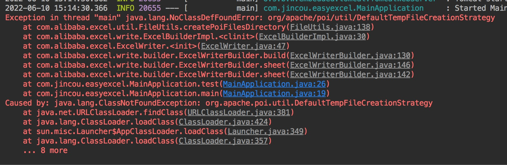

这就是依赖冲突导致的异常报错。

为什么会这样呢，我们可以通过idea看下,打开maven菜单，点击`show dependencies`。

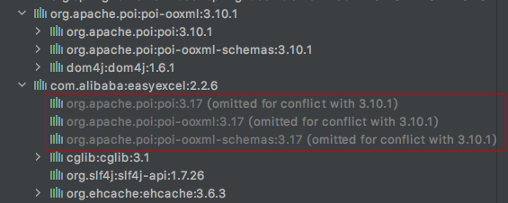

看到这里你大概就已经明白，因为我当前的easyexcel引入的poi是**3.17**版本的，但是因为根据maven依赖原则，实际引入的poi版本确实是**3.10.1**版本的。

而DefaultTempFileCreationStrategy这个类在**3.10.1**这个版本并没有，只有**3.17**版本才有，所以报了这个错误，这么一解释是不是都通了。

然后我们再来思考一个问题，上面这个案例我们一眼就知道是最终应用哪个依赖里的哪个版本，但如果你的项目中依赖许许多多的jar，肉眼排查就没那么方便了，这里推荐一个

Maven管理插件

#### 2、Maven Helper插件分析jar包冲突

选择并下载插件

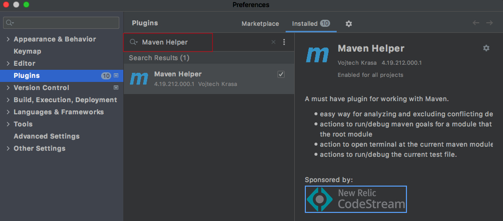

在pom文件中看到 **dependency analyzer**标志，说明maven helper插件就安装成功了。


点击**dependency analyzer**之后就会进入到下面的页面


从图中可以看出有哪些jar存在冲突，存在冲突的情况下最终采用了哪个依赖的版本。**标红的就是冲突版本，白色的是当前的解析版本**。

如果我们想保留标红的版本，那我们可以标白区域右击选择排除(`Exclude`)

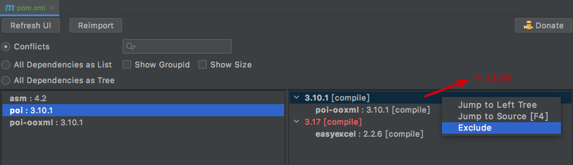

然后我们再来看pom文件,发现在org.apache.poi中已经移除了poi了。

```xml
   <dependency>
       <groupId>org.apache.poi</groupId>
       <artifactId>poi-ooxml</artifactId>
       <version>3.10.1</version>
       <exclusions>
          <exclusion>
             <artifactId>poi</artifactId>
             <groupId>org.apache.poi</groupId>
           </exclusion>
       </exclusions>
    </dependency>
    <dependency>
       <groupId>com.alibaba</groupId>
       <artifactId>easyexcel</artifactId>
       <version>2.2.6</version>
    </dependency>
```

我们再来看最终引用的poi版本是哪个？


我们发现最终的版本最终已经变成3.17版本，现在再启动就不会报错了，成功解决依赖冲突问题。

### 五、总结

一般我们在解决依赖冲突的时候，都会选择保留jar高的版本，因为大部分jar在升级的时候都会做到向下兼容，所以只要保留高的版本就不会有什么问题。

但是有些包，版本变化大没法去做向下兼容，高版本删了低版本的某些类或者某些方法，那么这个时候就不能一股脑的去选择高版本，但也不能选择低版本。

就比如下面这个案例

```
依赖链路一：A -> B -> C -> X(1.0)
依赖链路二：F -> D -> X(2.0)
```

`X(2.0)` 没有对 `X(1.0)` 做向下兼容也就是说可能存在排除哪个都不行，那怎么办我们只能考虑升级A的版本或者降低F的版本。比如A升级到`A(2.0)`,使它依赖的X版本

变成`X(2.0)`这样的话就解决依赖冲突。

但话有说回来 A升级到`A(2.0)` 可能会影响许许多多的地方，比如自己项目中代码是否需要改变，或者因为 A升级到`A(2.0)` 导致 B和C的版本有所改变，这些影响点都需要我

们去考虑的。所以说为什么说一个大型项目稳定后，pom文件的升级是件繁琐的事情，那是因为考虑的东西是在太多了，稍有不慎就会因为依赖冲突而导致系统报错。

## maven换源

在setings.xml中找到 <mirrors>  </mirrors>标签，标签中添加mirror子节点，内容如下：

```xml
    <mirror>
      <id>aliyunmaven</id>
      <mirrorOf>*</mirrorOf>
      <name>阿里云公共仓库</name>
      <url>https://maven.aliyun.com/repository/public</url>
    </mirror>
```

## 定义Maven父子模块（父子工程）

### 工程结构：

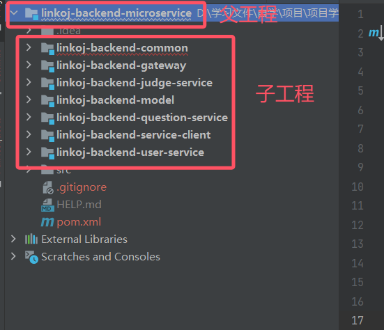

### 父工程pom文件：

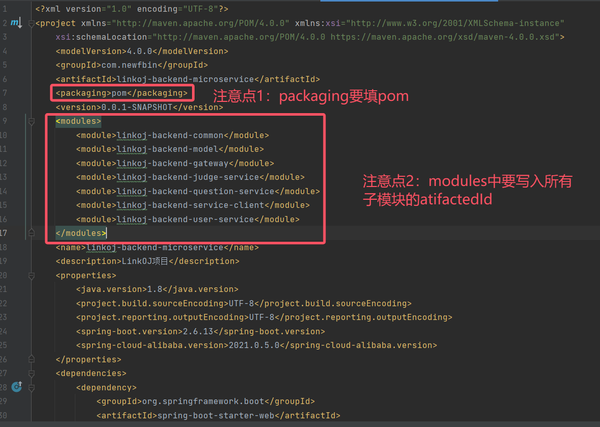

### 子工程pom文件

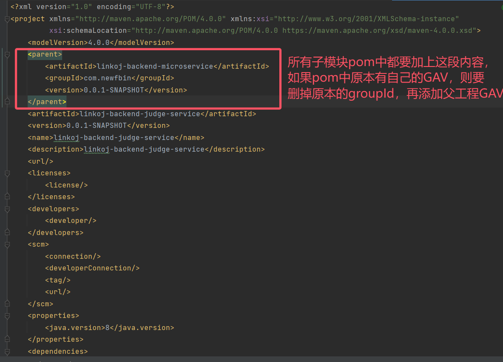

### 子工程相互依赖：

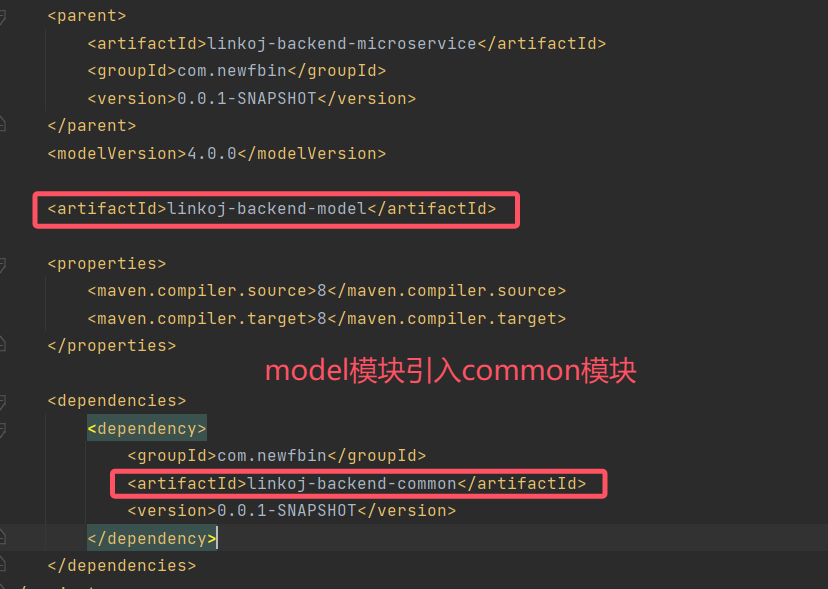

## maven打包的jar包提示“没有主清单属性”

使用maven的`package`命令打包得到的jar包，在运行时出现下面问题：

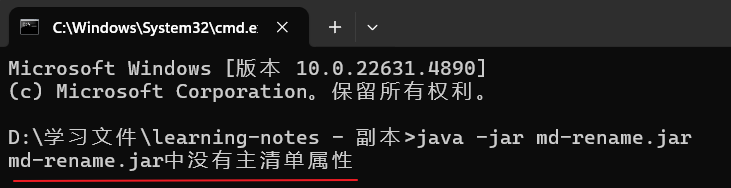

原因是没有为项目配置主类

**解决办法**：

在pom.xml中添加下面两个配置中的一个

简洁，推荐

```xml
<build>
    <plugins>
        <plugin>
            <groupId>org.springframework.boot</groupId>
            <artifactId>spring-boot-maven-plugin</artifactId>
            <executions>
                <execution>
                    <goals>
                        <goal>repackage</goal>
                    </goals>
                </execution>
            </executions>
        </plugin>
    </plugins>
</build>
```

```xml
<build>
    <finalName>DeleteMarkdownInAssets</finalName><!-- 导出jar的名字,可修改 -->
    <plugins>
        <plugin>
            <groupId>org.apache.maven.plugins</groupId>
            <artifactId>maven-shade-plugin</artifactId>
            <version>3.2.0</version>
            <executions>
                <execution>
                    <phase>package</phase>
                    <goals>
                        <goal>shade</goal>
                    </goals>
                    <configuration>
                        <transformers>
                            <transformer
implementation="org.apache.maven.plugins.shade.resource.ManifestResourceTransformer">
                                <!-- 修改为自己主类的位置： -->
                                <mainClass>com.newfbin.DeleteMarkdownInAssets</mainClass>
                            </transformer>
                        </transformers>
                    </configuration>
                </execution>
            </executions>
        </plugin>
    </plugins>
</build>
```

## 把jar包安装到本地maven仓库

### （不推荐：麻烦）方法一：执行mvn install命令行安装

```shell
mvn install:install-file -Dfile=jar包所在位置 -DgroupId=在pom中的groupId -DartifactId=在pom中的artifactId -Dversion=在pom中的version -Dpackaging=jar 
```

示例：

```shell
mvn install:install-file -Dfile=d:\demo.jar -DgroupId=com.zhengqing -DartifactId=maven-demo -Dversion=0.0.1.release -Dpackaging=jar 
```

### ( 推荐：安装 jar 包到maven本地仓库 )  方法二：复制到maven本地仓库

#### 原理

拿下面的依赖举例：

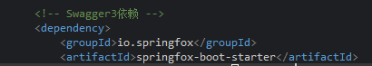

groupId是`io.springfox`，artifactId是`springfox-boot-starter`

那么想要找到该jar包，只需要进入到本地maven仓库

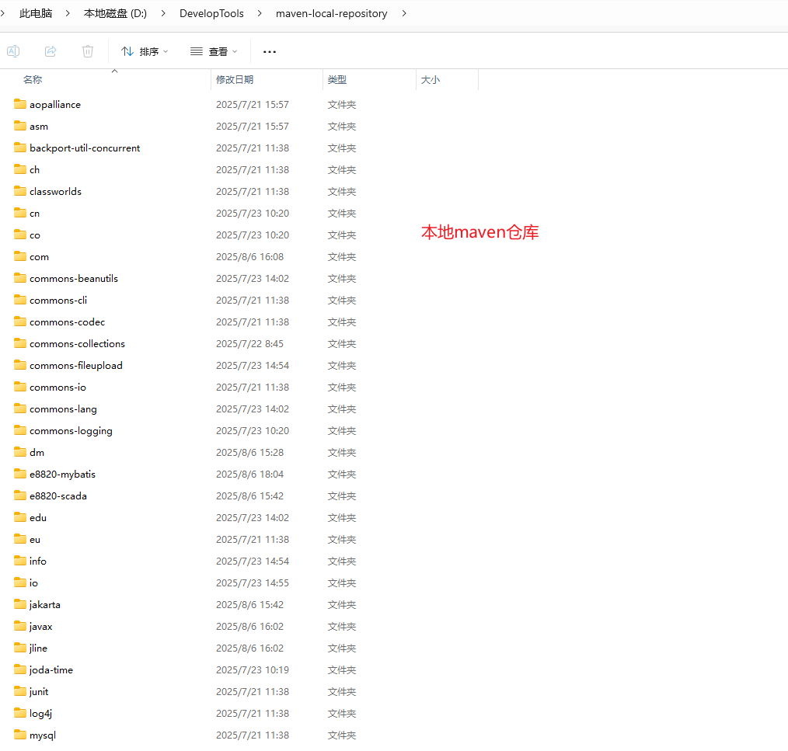

依次进入`io/springfox/springfox-boot-starter/版本号`，就可以看到该依赖对应的jar包。

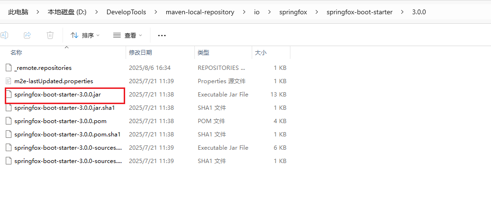

同理，可以直接在本地maven仓库创建对应的目录，再将jar包复制进去

#### 举例

根据GAV依次创建对应的文件夹，再将jar包复制进去就可以了。其余的文件maven会自动生成。

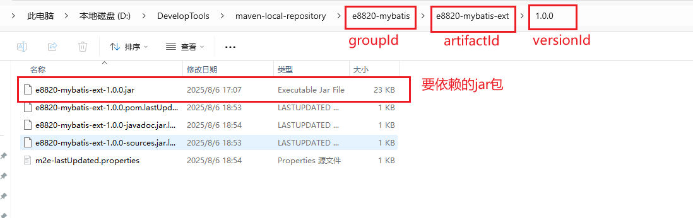

### ( 推荐：安装项目到maven本地仓库 )  方法三：右键项目直接执行mvn install

如果要把下面的项目打包为jar包引入到maven仓库中：

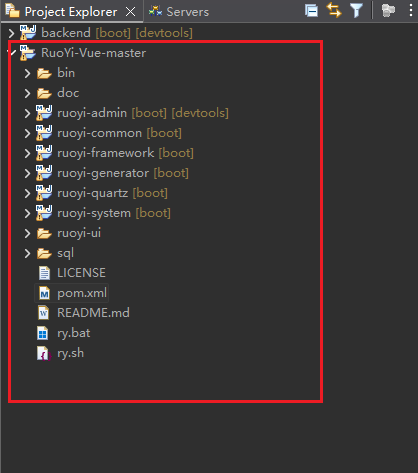

（以Eclipse举例，Idea应该也有类似的功能）首先右键根目录，接着点击Run as

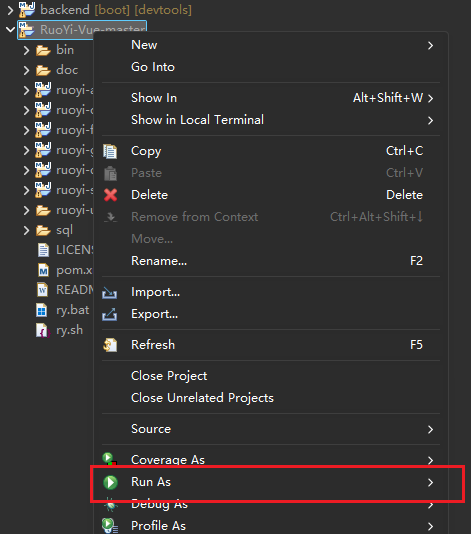

点击maven install

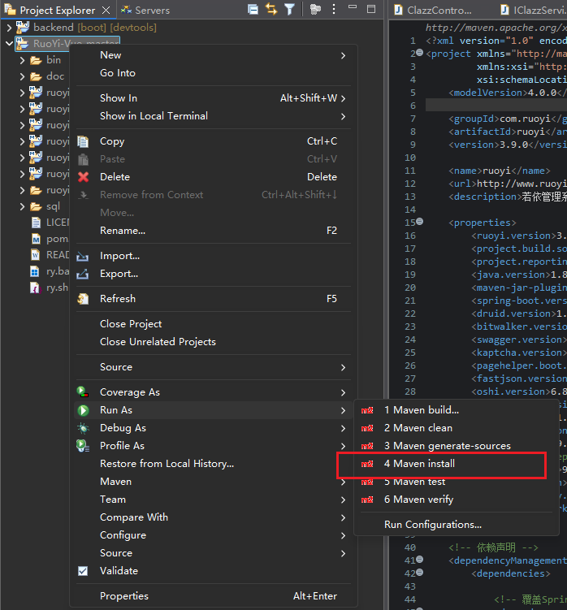

接着Elipse会自动执行 build 和 insall命令，并将执行结果输出到控制台

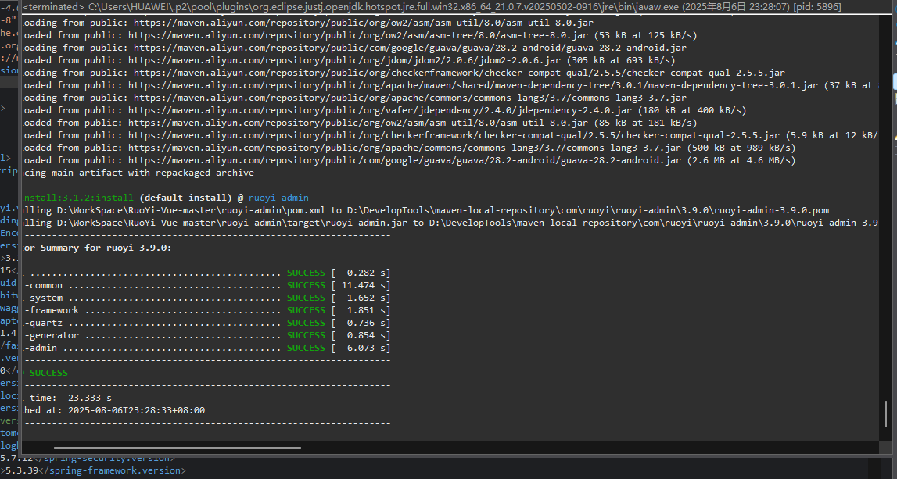

项目在本地maven仓库的安装位置就是项目pom文件中的 GAV信息：

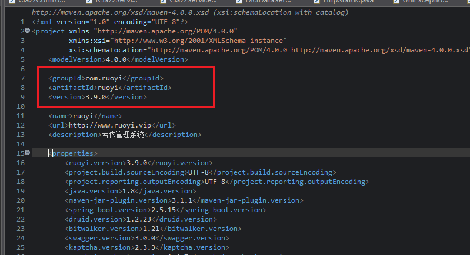

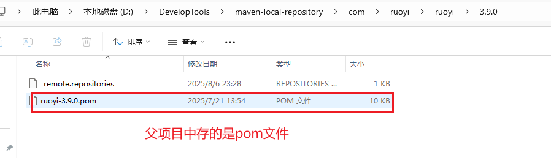

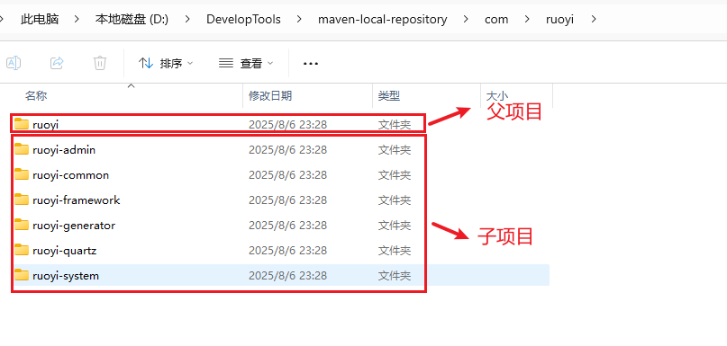

每个子项目都会存放一个jar包：

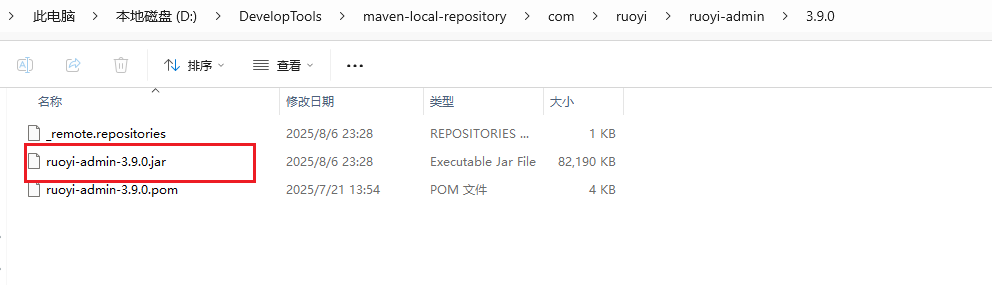


## 【Maven】解决 Since Maven 3.8.1 http repositories are blocked. 问题

> 原文地址：https://www.cnblogs.com/sxdcgaq8080/p/18155761

找到maven的settings.xml文件

在文件中找到 `maven-default-http-blocker`

将原本的 `maven-default-http-blocker`注释掉，并添加如下配置

```xml
    <mirrors>
        <mirror>
            <id>maven-default-http-blocker</id>
            <mirrorOf>dummy</mirrorOf>
            <name>Dummy mirror to override default blockingmirror that blocks http</name>
            <url>http://0.0.0.0/</url>
            <blocked>false</blocked>
        </mirror>
    </mirrors>
```

修改后的效果如下：


修改完成后，重启idea，接着重新导入一下jar包就好了


> （如果不行的话，还需要执行 mvn clean），接着再重启，再重新导入jar包
>
> 
