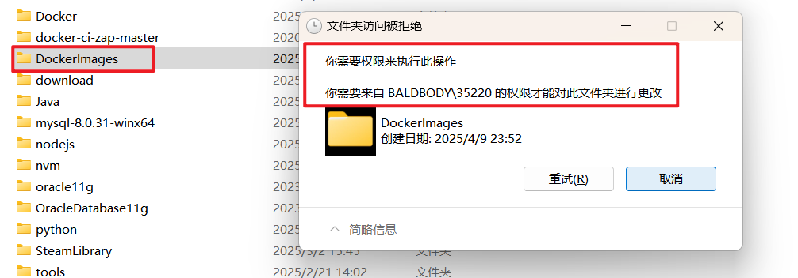

## docker命令汇总


## docker配置代理

> docker可以配置镜像源，docker镜像源的弊端是不能使用docker search，docker pull命令也不能拉取不常见的镜像，比如awvs。
> 因此想要解决上述弊端，只能配置代理。

docker 的代理设置是一件比较麻烦的事情，很容易出问题，但是弄懂了也还是比较清楚。

首先， docker pull / docker push 和 docker build /docker run 使用代理的方式不一样！
docker pull /push 的代理被 systemd 接管，所以需要设置 systemd…

### docker pull  push 镜像设置代理

如果没有设置过docker的镜像源，可以忽略这一步。如果设置过镜像源，在/etc/docker/daemon.json中加上官方默认镜像源：

```json
"https://registry-1.docker.io/v2/"
```


首先执行

```shell
sudo mkdir -p /etc/systemd/system/docker.service.d
sudo vim /etc/systemd/system/docker.service.d/http-proxy.conf
```

执行完上述命令后会进入 http-proxy.conf 文件中，接下来在 http-proxy.conf 文件中加入以下配置

> 注意：需要将7890改为自己所使用的代理工具的端口

```properties
[Service]
Environment="HTTP_PROXY=http://127.0.0.1:7890"
Environment="HTTPS_PROXY=http://127.0.0.1:7890"
```

保存上述文件后执行

```shell
sudo systemctl daemon-reload
sudo systemctl restart docker
```

可以通过sudo systemctl show --property=Environment docker看到设置的环境变量。
然后docker pull 和 docker push 就会使用代理啦

### build 镜像时使用代理（暂时没用该方法也能build）

在 build 时添加 --build-arg 参数来设置生成镜像时使用的环境变量

```shell
docker build --build-arg http_proxy=http://172.17.0.1:7890 --build-arg https_proxy=http://172.17.0.1:7890 -t image_name 
```

这里需要注意的是 `ip` 地址用了默认虚拟网卡`docker0 `的地址`172.17.0.1`，因为build的时候network参数默认为bridge，即docker内部会使用这个网段，因为要访问到宿主机的代理只能这样访问；
另外，也可以设置参数`--network=host `来直接和宿主机共用网络，就能直接使用`127.0.0.1`来访问到宿主机了

### 设置 docker 全局代理（暂未尝试）

设置方法参考官方文档： https://docs.docker.com/network/proxy/

注意新版和旧版本(17.07以前)设置方法不一样，比旧版更简单而且不需要重启服务,网上文章基本都是针对旧版本的,可能未来又变化了,所以多看官方文档~
以及这种设置方法只对 build 和 run 的容易有用， docker pull 要按照上面的方法设置。

```shell
vim ~/.docker/config.json
```

```json
{
 "proxies":
 {
   "default":
   {
     "httpProxy": "http://172.17.0.1:7890",
     "httpsProxy": "http://172.17.0.1:7890",
     "noProxy": "localhost,127.0.0.1,.daocloud.io"
   }
 }
}
```

这样设置后，`build`和`run`都会将`http_proxy`和`https_proxy` `ftp_proxy`变量设置成对应的代理地址，如果你在容器里面不想使用这个代理了，需要`export http_proxy=` 和 `export https_proxy=` 将两个变量设置为空

**注意**:

- 仅支持 `http` `https` `ftp` 协议，不支持 `socks5` 协议（2022.3.24，未来不一定，官方文档为准），可以使用polipo创建一个`http`代理服务，参考https://neucrack.com/p/275

- 这里使用了`172.17.0.1`(docker 虚拟网卡地址), 而不是`127.0.0.1`, 这是因为这是从容器内部的角度来看的, 容器内部要使用代理,默认情况下只能访问这个虚拟网卡的地址, `127.0.0.1`是容器内部, 如果代理在宿主机, 要使用 虚拟网卡的地址才能访问到.

- 这个文件一旦存在, docker就会使用这里面的代理, 包括创建的容器都会使用它。 所以不需要代理了, 需要关闭代理, 就是把文件重命名一下就好了, 这点用起来确实挺麻烦，也许未来会优化体验吧。

- 注意， 一个容器一旦生成， 这些环境变量（`http_proxy` `https_proxy` `ftp_proxy` `no_proxy`）就会被继承到容器中， 就算把`config.json`删除， 这个容器依然使用创建时的环境变量，可以手动在容器内重新设置这些环境变量， 这点也挺容易让人头疼的， 一定要注意。

  > 比如 有个镜像叫 `imageA`, 现在设置`~/.docker/config.json`也就是有代理， 然后`docker run`创建容器 `A`, 然后再重命名`config.json`， 创建容器`B`， 然后会发现无论现在怎么修改`config.json`， 容器`A B`都会使用它被创建时的代理设置，即容器`A`使用代理， 容器`B`不使用代理

### 容器使用宿主机的代理的几种方法总结（暂未尝试）

和 `build` 时类似，只需要在 生成容器时（`run -e http_proxy=...`） 或者 容器中 设置环境变量`http_proxy`和`https_proxy`变量即可，同样需要注意容易使用的网络类型是`bridge`还是`host`，根据类别设置正确的代理 `ip` 地址

- 方法一： 直接在容器内使用（推荐

```shell
export ALL_PROXY='socks5://172.17.0.1:1080'
```

这里ip地址使用的是宿主机的`ip`

- 方法二： 与宿主机共享网络时直接在容器内使用

创建容器时使用`--network=host`参数

然后在docker内设置代理，比如全局代理

```shell
export ALL_PROXY='socks5://127.0.0.1:1080'
```

这样就可以使用宿主机的代理了

但是要注意， 如果是用`--network=host`，这样的话使用 -p 参数映射端口就没用了， 即所有端口都是开放和宿主机共享的

- 方法三： 映射代理端口后直接在容器内使用

`docker run`时带参数`-p`映射代理的端口到容器， 在容器里面使用即可，比如：

```shell
docker run  -p 1080:1080 .....export ALL_PROXY='socks5://127.0.0.1:1080'
```

- 方法四： docker配置全局代理，以在生成容器时自动设置代理变量

设置 docker 全局代理，比如设置了`http://172.17.0.1:8123`， 容器内全都会走这个代理，除了配置文件中的白名单里面的地址以外

**注意**： 全局代理和 `--network=host` 参数只能用一个，不然就容易混乱

## Docker的redis容器报错：MISCONF Redis is configured to save RDB snapshots...

**报错原因**:

从Redis层面来分析错误的直接原因是： Redis被配置为保存[数据库](https://cloud.tencent.com/product/tencentdb-catalog?from_column=20065&from=20065)快照，但它目前不能持久化到硬盘。用来修改集合数据的命令不能用。请查看Redis日志的详细错误信息。 

也就是说，Redis无法将缓存中的数据写入本地磁盘。

**解决办法**：

```bash
#docker 进入redis容器中,其中"f0dd"为redis容器的id开始四位
[root@iZ2zeca7jric8sx4f3n7spZ ~]# docker exec -it f0dd /bin/bash

#进入客户端(redis client)
root@f0dd1681b64f:/data# redis-cli

#写入一个键值
127.0.0.1:6379> set name newfbin
#报错信息
(error) MISCONF Redis is configured to save RDB snapshots, but it is currently not able to persist on disk. Commands that may modify the data set are disabled, because this instance is configured to report errors during writes if RDB snapshotting fails (stop-writes-on-bgsave-error option). Please check the Redis logs for details about the RDB error.
#解决命令
127.0.0.1:6379> config set stop-writes-on-bgsave-error no
OK
#验证错误是否解决
127.0.0.1:6379> set name newfbin
OK
```

## 容器退出码

### 什么是容器退出码

当容器终止时，容器引擎使用退出码来报告容器终止的原因。如果您是 Kubernetes 用户，容器故障是 pod 异常最常见的原因之一，了解容器退出码可以帮助您在排查时找到 pod 故障的根本原因。

以下是容器使用的最常见的退出码：

| 退出码 | 名称                 | 含义                                                      |
| ------ | -------------------- | --------------------------------------------------------- |
| 0      | 正常退出             | 开发者用来表明容器是正常退出                              |
| 1      | 应用错误             | 容器因应用程序错误或镜像规范中的错误引用而停止            |
| 125    | 容器未能运行         | docker run 命令没有执行成功                               |
| 126    | 命令调用错误         | 无法调用镜像中指定的命令                                  |
| 127    | 找不到文件或目录     | 找不到镜像中指定的文件或目录                              |
| 128    | 退出时使用的参数无效 | 退出是用无效的退出码触发的（有效代码是 0-255 之间的整数） |
| 134    | 异常终止 (SIGABRT)   | 容器使用 abort() 函数自行中止                             |
| 137    | 立即终止 (SIGKILL)   | 容器被操作系统通过 SIGKILL 信号终止                       |
| 139    | 分段错误 (SIGSEGV)   | 容器试图访问未分配给它的内存并被终止                      |
| 143    | 优雅终止 (SIGTERM)   | 容器收到即将终止的警告，然后终止                          |
| 255    | 退出状态超出范围     | 容器退出，返回可接受范围之外的退出代码，表示错误原因未知  |

下面我们将解释如何在宿主机和 Kubernetes 中对失败的容器进行故障排除，并提供有关上面列出的所有退出代码的更多详细信息。

### 容器生命周期

为了更好地理解容器故障的原因，让我们先讨论容器的生命周期。以 Docker 为例 —— 在任何给定时间，Docker 容器都会处于以下几种状态之一：

- Created：Docker 容器已创建但尚未启动（这是运行 `docker create` 后但实际运行容器之前的状态）
- Up：Docker 容器当前正在运行。这意味着容器管理的操作系统进程正在运行。当您使用命令 `docker start` 或 `docker run` 时会发生这种情况，使用 `docker start` 或 `docker run` 可能会发生这种情况。
- Paused：容器进程正在运行，但 Docker 暂停了容器。通常，当您运行 `docker pause` 命令时会发生这种情况
- Exited：Docker 容器已经被终止，通常是因为容器的进程被杀死了

当一个容器达到 Exited 状态时，Docker 会在日志中报告一个退出码，告诉你容器发生了什么导致它退出。

### 了解容器退出码

下面我们将更详细地介绍每个退出码。

#### 退出码 0：正常退出

退出代码 0 由开发人员在任务完成后故意停止容器时触发。从技术上讲，退出代码 0 意味着前台进程未附加到特定容器。

##### 如果容器以退出码 0 终止怎么办？

1. 检查容器日志，确定哪个库导致容器退出；
2. 查看现有库的代码，并确定它触发退出码 0 的原因，以及它是否正常运行。

#### 退出码 1：应用错误

退出代码 1 表示容器由于以下原因之一停止：

1. 应用程序错误：这可能是容器运行的代码中的简单编程错误，例如“除以零”，也可能是与运行时环境相关的高级错误，例如 Java、Python 等；
2. 无效引用：这意味着镜像规范引用了容器镜像中不存在的文件。

##### 如果容器以退出码 1 终止怎么办？

1. 检查容器日志以查看是否找不到映像规范中列出的文件之一。如果这是问题所在，请更正镜像以指向正确的路径和文件名。
2. 如果您找不到不正确的文件引用，请检查容器日志以查找应用程序错误，并调试导致错误的库。

#### 退出码 125：容器未能运行

退出码 125 表示该命令用于运行容器。例如 `docker run` 在 shell 中被调用但没有成功执行。以下是可能发生这种情况的常见原因：

1. 命令中使用了未定义的 flag，例如 `docker run --abcd`；
2. 镜像中用户的定义命令在本机权限不足；
3. 容器引擎与宿主机操作系统或硬件不兼容。

##### 如果容器以退出码 125 终止怎么办？

1. 检查运行容器的命令语法是否正确；
2. 检查运行容器的用户，或者镜像中执行命令的上下文，是否有足够的权限在宿主机上创建容器；
3. 如果您的容器引擎提供了运行容器的 option，请尝试它们。例如，在 Docker 中，尝试 `docker start` 而不是 `docker run`；
4. 测试您是否能够使用相同的用户名或上下文在主机上运行其他容器。如果不能，重新安装容器引擎，或者解决容器引擎和主机设置之间的底层兼容性问题。

#### 退出码 126：命令调用错误

退出码 126 表示无法调用容器镜像中使用的命令。这通常是用于运行容器的持续集成脚本中缺少依赖项或错误的原因。

##### 如果容器以退出码 126 终止怎么办？

1. 检查容器日志，查看无法调用哪个命令；
2. 尝试在没有命令的情况下运行容器以确保隔离问题；
3. 对命令进行故障排除以确保您使用正确的语法，并且所有依赖项都可用；
4. 更正容器规范并重试运行容器。

#### 退出码 127：找不到文件或目录

退出码 127 表示容器中指定的命令引用了不存在的文件或目录。

##### 如果容器以退出码 127 终止怎么办？

与退出码 126 相同，识别失败的命令，并确保容器镜像中引用的文件名或文件路径真实有效。

#### 退出码 128：退出时使用的参数无效

退出码 128 表示容器内的代码触发了退出命令，但没有提供有效的退出码。 Linux `exit` 命令只允许 0-255 之间的整数，因此如果进程以退出码 3.5 退出，则日志将报告退出代码 128。

##### 如果容器以退出码 128 终止怎么办？

1. 检查容器日志以确定哪个库导致容器退出。
2. 确定有问题的库在哪里使用了 `exit` 命令，并更正它以提供有效的退出代码。

#### 退出码 134：异常终止 (SIGABRT)

退出码 134 表示容器自身异常终止，关闭进程并刷新打开的流。此操作是不可逆的，类似 `SIGKILL`（请参阅下面的退出码 137）。进程可以通过执行以下操作之一来触发 `SIGABRT`：

- 调用 `libc` 库中的 `abort()` 函数；
- 调用 `assert()` 宏，用于调试。如果断言为假，则该过程中止。

##### 如果容器以退出码 134 终止怎么办？

1. 检查容器日志，查看哪个库触发了 `SIGABRT` 信号；
2. 检查中止进程是否是预期内的（例如，因为库处于调试模式），如果不是，则对库进行故障排除，并修改以避免中止容器。

#### 退出码 137：立即终止 (SIGKILL)

退出码 137 表示容器已收到来自主机操作系统的 `SIGKILL` 信号。该信号指示进程立即终止，没有宽限期。可能的原因是：

- 当通过容器引擎杀死容器时触发，例如使用 `docker kill` 命令时；
- 由 Linux 用户向进程发送 `kill -9` 命令触发；
- 在尝试终止容器并等待 30 秒的宽限期后由 Kubernetes 触发（默认情况下）；
- 由主机自动触发，通常是由于内存不足。在这种情况下，`docker inspect` 命令将指示 `OOMKilled` 错误。

##### 如果容器以退出码 137 终止怎么办？

1. 检查主机上的日志，查看在容器终止之前发生了什么，以及在接收到 `SIGKILL` 之前是否之前收到过 `SIGTERM` 信号（优雅终止）；
2. 如果之前有 `SIGTERM` 信号，请检查您的容器进程是否处理 `SIGTERM` 并能够正常终止；
3. 如果没有 `SIGTERM` 并且容器报告了 `OOMKilled` 错误，则排查主机上的内存问题。

#### 退出码 139：分段错误 (SIGSEGV)

退出码 139 表示容器收到了来自操作系统的 `SIGSEGV` 信号。这表示分段错误 —— 内存违规，由容器试图访问它无权访问的内存位置引起。`SIGSEGV` 错误有三个常见原因：

- 编码错误：容器进程没有正确初始化，或者它试图通过指向先前释放的内存的指针来访问内存
- 二进制文件和库之间不兼容：容器进程运行的二进制文件与共享库不兼容，因此可能会尝试访问不适当的内存地址
- 硬件不兼容或配置错误：如果您在多个库中看到多个分段错误，则主机上的内存子系统可能存在问题或系统配置问题

##### 如果容器以退出码 139 终止怎么办？

1. 检查容器进程是否处理 `SIGSEGV`。在 Linux 和 Windows 上，您都可以处理容器对分段错误的响应。例如，容器可以收集和报告堆栈跟踪；
2. 如果您需要对 `SIGSEGV` 进行进一步的故障排除，您可能需要将操作系统设置为即使在发生分段错误后也允许程序运行，以便进行调查和调试。然后，尝试故意造成分段错误并调试导致问题的库；
3. 如果您无法复现问题，请检查主机上的内存子系统并排除内存配置故障。

#### 退出码 143：优雅终止 (SIGTERM)

退出码 143 表示容器收到来自操作系统的 `SIGTERM` 信号，该信号要求容器正常终止，并且容器成功正常终止（否则您将看到退出码 137）。该退出码可能的原因是：

- 容器引擎停止容器时触发，例如使用 `docker stop` 或 `docker-compose down` 命令时；
- 由 Kubernetes 将 Pod 设置为 Terminating 状态触发，并给容器 30 秒的时间以正常关闭。

##### 如果容器以退出码 143 终止怎么办？

检查主机日志，查看操作系统发送 `SIGTERM` 信号的上下文。如果您使用的是 Kubernetes，请检查 kubelet 日志，查看 pod 是否以及何时关闭。

一般来说，退出码 143 不需要故障排除。这意味着容器在主机指示后正确关闭。

#### 退出码 255：退出状态超出范围

当您看到退出码 255 时，意味着容器的 entrypoint 以该状态停止。这意味着容器停止了，但不知道是什么原因。

##### 如果容器以退出码 255 终止怎么办？

1. 如果容器在虚拟机中运行，首先尝试删除虚拟机上配置的 overlay 网络并重新创建它们。
2. 如果这不能解决问题，请尝试删除并重新创建虚拟机，然后在其上重新运行容器。
3. 如果上述操作失败，则 bash 进入容器并检查有关 entrypoint 进程及其失败原因的日志或其他线索。

### 哪些 Kubernetes 错误与容器退出代码有关？

每当 pod 中容器发生故障，或者 Kubernetes 指示 pod 出于任何原因终止时，容器将关闭并记录退出代码。识别退出代码可以帮助您了解 pod 异常的根本原因。

您可以使用以下命令查看 pod 错误：`kubectl describe pod [name]`

结果将如下所示：

```yaml
Containers:
kubedns:
Container ID: ...
Image: ...
Image ID: ...
Ports: ...
Host Ports: ...
Args: ...
State: Running
   Started: Fri, 15 Oct 2021 12:06:01 +0800
Last State: Terminated
   Reason: Error
   Exit Code: 255
   Started: Fri, 15 Oct 2021 11:43:42 +0800
   Finished: Fri, 15 Oct 2021 12:05:17 +0800
Ready: True
Restart Count: 1
```

使用`kubectl`提供的退出代码解决问题：

- **如果退出代码为 0**：容器正常退出，无需排查
- **如果退出代码在 1-128 之间**：容器因内部错误而终止，例如镜像规范中缺少或无效的命令
- **如果退出代码在 129-255 之间**：容器因操作信号而停止，例如 SIGKILL 或 SIGINT
- **如果退出代码是** `exit(-1)`或 0-255 范围之外的另一个值，`kubectl`将其转换为 0-255 范围内的值。

请参阅上面的相关部分，了解如何对每个退出代码的容器进行故障排除。

## Windows 下 Docker镜像文件夹无法删除

Docker镜像位置默认在C盘，先更新到`D:\DockerImages\DockerDesktopWSL` ，再更新到 `D:\Docker\DockerDesktopWSL` 后

`D:\DockerImages\DockerDesktopWSL` 这个文件夹已经没用了，但是文件夹和其中的文件删除不掉

如下图所示：



下面这篇文章提到了这个问题，

https://blog.yowko.com/remove-windowsfilter/