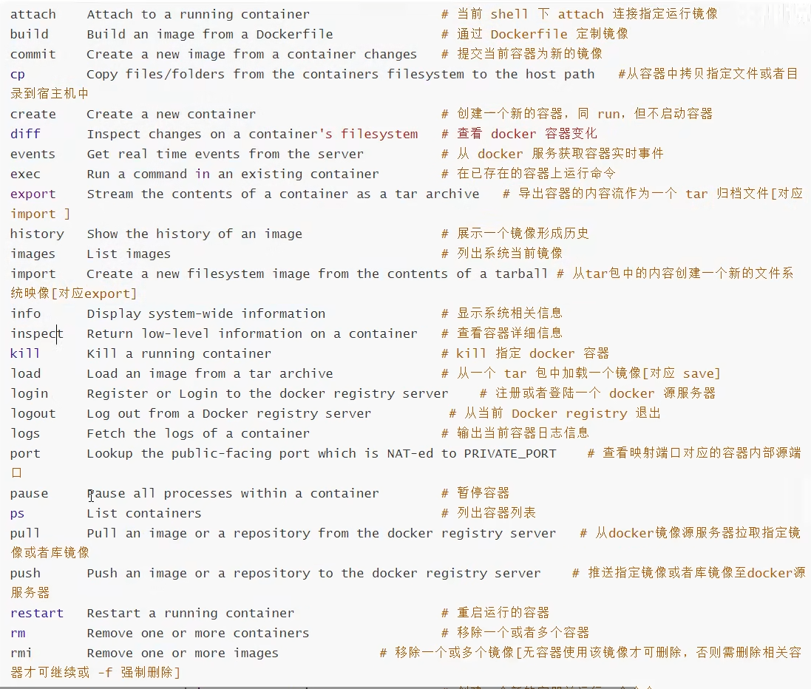
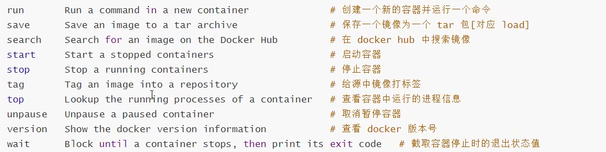
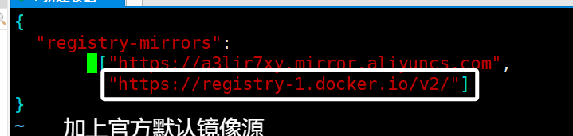

## docker命令汇总





## docker配置代理

> docker可以配置镜像源，docker镜像源的弊端是不能使用docker search，docker pull命令也不能拉取不常见的镜像，比如awvs。
> 因此想要解决上述弊端，只能配置代理。

docker 的代理设置是一件比较麻烦的事情，很容易出问题，但是弄懂了也还是比较清楚。

首先， docker pull / docker push 和 docker build /docker run 使用代理的方式不一样！
docker pull /push 的代理被 systemd 接管，所以需要设置 systemd…

### docker pull  push 镜像设置代理

如果没有设置过docker的镜像源，可以忽略这一步。如果设置过镜像源，在/etc/docker/daemon.json中加上官方默认镜像源：

```json
"https://registry-1.docker.io/v2/"
```



首先执行

```shell
sudo mkdir -p /etc/systemd/system/docker.service.d
sudo vim /etc/systemd/system/docker.service.d/http-proxy.conf
```

执行完上述命令后会进入 http-proxy.conf 文件中，接下来在 http-proxy.conf 文件中加入以下配置

> 注意：需要将7890改为自己所使用的代理工具的端口

```properties
[Service]
Environment="HTTP_PROXY=http://127.0.0.1:7890"
Environment="HTTPS_PROXY=http://127.0.0.1:7890"
```

保存上述文件后执行

```shell
sudo systemctl daemon-reload
sudo systemctl restart docker
```

可以通过sudo systemctl show --property=Environment docker看到设置的环境变量。
然后docker pull 和 docker push 就会使用代理啦

### build 镜像时使用代理（暂时没用该方法也能build）

在 build 时添加 --build-arg 参数来设置生成镜像时使用的环境变量

```shell
docker build --build-arg http_proxy=http://172.17.0.1:7890 --build-arg https_proxy=http://172.17.0.1:7890 -t image_name 
```

这里需要注意的是 `ip` 地址用了默认虚拟网卡`docker0 `的地址`172.17.0.1`，因为build的时候network参数默认为bridge，即docker内部会使用这个网段，因为要访问到宿主机的代理只能这样访问；
另外，也可以设置参数`--network=host `来直接和宿主机共用网络，就能直接使用`127.0.0.1`来访问到宿主机了

### 设置 docker 全局代理（暂未尝试）

设置方法参考官方文档： https://docs.docker.com/network/proxy/

注意新版和旧版本(17.07以前)设置方法不一样，比旧版更简单而且不需要重启服务,网上文章基本都是针对旧版本的,可能未来又变化了,所以多看官方文档~
以及这种设置方法只对 build 和 run 的容易有用， docker pull 要按照上面的方法设置。

```shell
vim ~/.docker/config.json
```

```json
{
 "proxies":
 {
   "default":
   {
     "httpProxy": "http://172.17.0.1:7890",
     "httpsProxy": "http://172.17.0.1:7890",
     "noProxy": "localhost,127.0.0.1,.daocloud.io"
   }
 }
}
```

这样设置后，`build`和`run`都会将`http_proxy`和`https_proxy` `ftp_proxy`变量设置成对应的代理地址，如果你在容器里面不想使用这个代理了，需要`export http_proxy=` 和 `export https_proxy=` 将两个变量设置为空

**注意**:

- 仅支持 `http` `https` `ftp` 协议，不支持 `socks5` 协议（2022.3.24，未来不一定，官方文档为准），可以使用polipo创建一个`http`代理服务，参考https://neucrack.com/p/275

- 这里使用了`172.17.0.1`(docker 虚拟网卡地址), 而不是`127.0.0.1`, 这是因为这是从容器内部的角度来看的, 容器内部要使用代理,默认情况下只能访问这个虚拟网卡的地址, `127.0.0.1`是容器内部, 如果代理在宿主机, 要使用 虚拟网卡的地址才能访问到.

- 这个文件一旦存在, docker就会使用这里面的代理, 包括创建的容器都会使用它。 所以不需要代理了, 需要关闭代理, 就是把文件重命名一下就好了, 这点用起来确实挺麻烦，也许未来会优化体验吧。

- 注意， 一个容器一旦生成， 这些环境变量（`http_proxy` `https_proxy` `ftp_proxy` `no_proxy`）就会被继承到容器中， 就算把`config.json`删除， 这个容器依然使用创建时的环境变量，可以手动在容器内重新设置这些环境变量， 这点也挺容易让人头疼的， 一定要注意。

  > 比如 有个镜像叫 `imageA`, 现在设置`~/.docker/config.json`也就是有代理， 然后`docker run`创建容器 `A`, 然后再重命名`config.json`， 创建容器`B`， 然后会发现无论现在怎么修改`config.json`， 容器`A B`都会使用它被创建时的代理设置，即容器`A`使用代理， 容器`B`不使用代理

### 容器使用宿主机的代理的几种方法总结（暂未尝试）

和 `build` 时类似，只需要在 生成容器时（`run -e http_proxy=...`） 或者 容器中 设置环境变量`http_proxy`和`https_proxy`变量即可，同样需要注意容易使用的网络类型是`bridge`还是`host`，根据类别设置正确的代理 `ip` 地址

- 方法一： 直接在容器内使用（推荐

```shell
export ALL_PROXY='socks5://172.17.0.1:1080'
```

这里ip地址使用的是宿主机的`ip`

- 方法二： 与宿主机共享网络时直接在容器内使用

创建容器时使用`--network=host`参数

然后在docker内设置代理，比如全局代理

```shell
export ALL_PROXY='socks5://127.0.0.1:1080'
```

这样就可以使用宿主机的代理了

但是要注意， 如果是用`--network=host`，这样的话使用 -p 参数映射端口就没用了， 即所有端口都是开放和宿主机共享的

- 方法三： 映射代理端口后直接在容器内使用

`docker run`时带参数`-p`映射代理的端口到容器， 在容器里面使用即可，比如：

```shell
docker run  -p 1080:1080 .....export ALL_PROXY='socks5://127.0.0.1:1080'
```

- 方法四： docker配置全局代理，以在生成容器时自动设置代理变量

设置 docker 全局代理，比如设置了`http://172.17.0.1:8123`， 容器内全都会走这个代理，除了配置文件中的白名单里面的地址以外

**注意**： 全局代理和 `--network=host` 参数只能用一个，不然就容易混乱