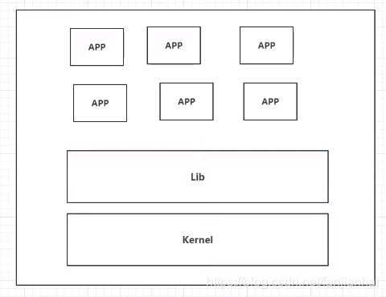
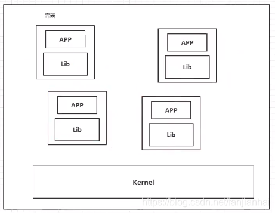
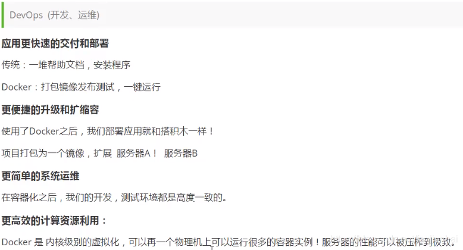
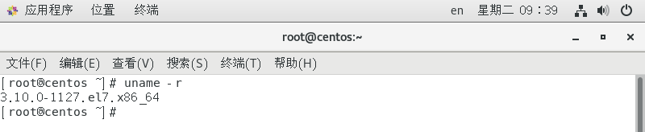

# Docker入门

## 1. Docker 为什么会出现


## 2. Docker的历史


## 3. [Docker最新超详细版教程通俗易懂](https://www.bilibili.com/video/BV1og4y1q7M4)


- Docker是基于Go语言开发的！开源项目
- [官网](https://www.docker.com/)
- [官方文档](https://docs.docker.com/)**Docker文档是超详细的**
- [仓库地址](https://hub.docker.com/)

## 4. 虚拟化技术和容器化技术对比

### 4.1. 虚拟化技术的缺点

- 资源占用十分多
- 冗余步骤多
- 启动很慢



### 4.2. 容器化技术



- 比较Docker和虚拟化技术的不同
  - 传统虚拟机， 虚拟出一条硬件，运行一个完整的操作系统，然后在这个系统上安装和运行软件
  - 容器内的应用直接运行在宿主机的内部，容器是没有自己的内核的，也没有虚拟硬件，所以轻便
  - 每个容器间是相互隔离的，每个容器内都有一个属于自己的文件系统，互不影响
- 应用更快速的交互和部署
  - 传统：一堆帮助文档，安装程序
  - Docker： 打包镜像发布测试，一键运行
- 更便捷的升级和扩缩容
- 更简的系统运维
- 更高效的计算资源利用

### 4.3. DevOps



### 4.4. 名词解释

- **镜像（image）**
  - Docker镜像就好比是一个模板，可以通过这个模板来创建容器服务，tomcat镜像 ===> run ===> tomcat01容器， 通过这个镜像可以创建多个容器（最终服务运行或者项目运行就是在容器中的）
- **容器（container）**
  - Docker利用容器技术，独立运行一个或者一组应用， 通过镜像来创建的
  - 启动，停止，删除，基本命令！
  - 就目前可以把这个容器理解为一个建议的linux系统
- **仓库（repository）**
  - 存放镜像的地方
  - Docker Hub（默认是国外的）
  - 阿里云，都有容器服务（配置镜像加速！）

## 5. 安装docker

>  通过查看官方文档安装:
>
>  在docker官网往下翻找到Docker Engine, 点击inastall
>
>  
>
>  点击左侧的CentOS，接下来就可以根据官网进行操作
>
>  

### 一、安装前必读

在安装 Docker 之前，先说一下配置，我这里是Centos7 Linux 内核：官方建议 3.10 以上，3.8以上貌似也可。

注意：本文的命令使用的是 root 用户登录执行，不是 root 的话所有命令前面要加 `sudo`

**1.查看当前的内核版本**

```bash
uname -r
```




我这里是3.10 ，满足条件。

**2.使用 root 权限更新 yum 包（生产环境中此步操作需慎重，看自己情况，学习的话随便搞）**

```bash
yum -y update
```

这个命令不是必须执行的，看个人情况，后面出现不兼容的情况的话就必须update了

```bash
注意 
yum -y update：升级所有包同时也升级软件和系统内核； 
yum -y upgrade：只升级所有包，不升级软件和系统内核
```

**3.卸载旧版本（如果之前安装过的话）**

```bash
#卸载Docker
systemctl stop docker.socket
systemctl stop docker
                  
yum -y remove docker-ce docker-ce-cli containerd.io                 
                  
rm -rf /var/lib/docker 

#卸载旧版本
yum remove docker \
                  docker-client \
                  docker-client-latest \
                  docker-common \
                  docker-latest \
                  docker-latest-logrotate \
                  docker-logrotate \
                  docker-engine
```


### 二、安装Docker的详细步骤

**1.安装需要的gcc环境和软件包， yum-util 提供yum-config-manager功能，另两个是devicemapper驱动依赖**

```bash
#安装gcc环境
yum -y install gcc
yum -y install gcc-c++

#安装软件包
yum install -y yum-utils
# 看情况执行下面这一句
yum install -y yum-utils device-mapper-persistent-data lvm2
```

**2.设置 yum 源**

设置一个yum源，下面两个都可用

```bash
# 中央仓库
yum-config-manager --add-repo http://download.docker.com/linux/centos/docker-ce.repo
# 阿里仓库(推荐)
yum-config-manager --add-repo http://mirrors.aliyun.com/docker-ce/linux/centos/docker-ce.repo
```

**3.更新yum软件包索引**

```shell
yum makecache fast
```

**4.安装DockerCE**

```shell
yum -y install docker-ce docker-ce-cli containerd.io
```

**5.启动Docker**

```shell
#启动Docker
systemctl start docker
#设置开机自启动
systemctl enable docker
```

**6.测试命令**

```shell
docker version

docker run hello-world

docker images
```

## 6. 配置阿里云镜像加速

1. 登录阿里云服务器，找到`容器镜像服务`

   

2. 设置Registry登录密码

3. 找到镜像加速器

   

4. 配置使用

```bash
sudo mkdir -p /etc/docker
sudo tee /etc/docker/daemon.json <<-'EOF'
{
  "registry-mirrors": ["https://a3lir7xy.mirror.aliyuncs.com"]
}
EOF
sudo systemctl daemon-reload
sudo systemctl restart docker 
```

## 7. 底层原理

- HelloWorld镜像

  

  


- 底层原理

  Docker Engine是一个客户端-服务器应用程序，具有以下主要组件:

  - 一个服务器，它是一种长期运行的程序，称为守护进程(dockerd命令)
  - 一个REST API，它指定程序可以用来与守护进程对话并指示它做什么的接口。

  Docker是一个**Client Server结构的系统**，Docker守护进程运行在主机上，然后通过Socket连接从客户 端访问，守护进程从客户端接受命令并管理运行在主机上的容器。**容器，是一个运行时环境就是我们所说的集装箱。**

  

- 为什么Docker比Vm快

  - docker有着比虚拟机更少的抽象层。**由于docker不需要Hypervisor实现硬件资源虚拟化,**运行在docker容器上的程序直接使用的都是实际物理机的硬件资源**。因此在CPU、内存利用率上docker将会在效率上有明显优势。**
  - **docker利用的是宿主机的内核,而不需要Guest OS**。因此,当新建一个 容器时,docker不需要和虚拟机一样重新加载一个操作系统内核。仍而避免引寻、加载操作系统内核返个比较费时费资源的过程,当新建一个虚拟机时,虚拟机软件需要加载GuestOS,返个新建过程是分钟级别的。**而docker由于直接利用宿主机的操作系统,则省略了返个过程,因此新建一个docker容器只需要几秒钟。**

  

  

  

