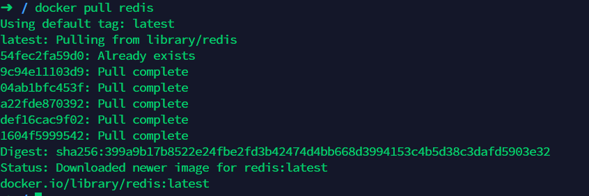
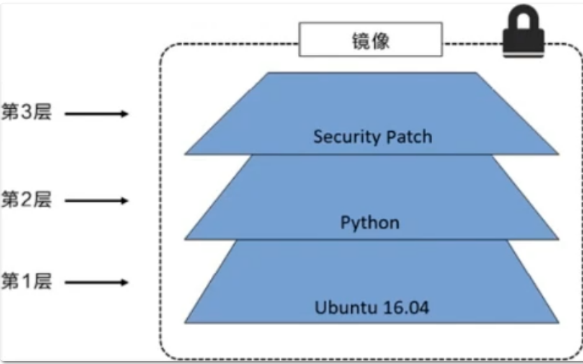
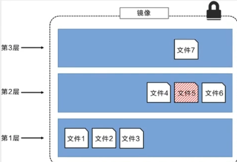
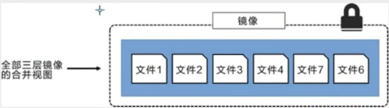

# Docker原理

## 镜像原理之联合文件系统


## 分层理解

> 分层的镜像

我们可以去下载一个镜像，注意观察下载的日志输出，可以看到是一层层的在下载



思考：为什么Docker镜像要采用这种分层的结构呢？

最大的好处，我觉得莫过于资源共享了！比如有多个镜像都从相同的Base镜像构建而来，那么宿主机只需在磁盘上保留一份base镜像，同时内存中也只需要加载一份base镜像，这样就可以为所有的容器服务了，而且镜像的每一层都可以被共享。

查看镜像分层的方式可以通过docker image inspect 命令

```bash
➜  / docker image inspect redis          
[
    {
        "Id": "sha256:f9b9909726890b00d2098081642edf32e5211b7ab53563929a47f250bcdc1d7c",
        "RepoTags": [
            "redis:latest"
        ],
        "RepoDigests": [
            "redis@sha256:399a9b17b8522e24fbe2fd3b42474d4bb668d3994153c4b5d38c3dafd5903e32"
        ],
        "Parent": "",
        "Comment": "",
        "Created": "2020-05-02T01:40:19.112130797Z",
        "Container": "d30c0bcea88561bc5139821227d2199bb027eeba9083f90c701891b4affce3bc",
        "ContainerConfig": {
            "Hostname": "d30c0bcea885",
            "Domainname": "",
            "User": "",
            "AttachStdin": false,
            "AttachStdout": false,
            "AttachStderr": false,
            "ExposedPorts": {
                "6379/tcp": {}
            },
            "Tty": false,
            "OpenStdin": false,
            "StdinOnce": false,
            "Env": [
                "PATH=/usr/local/sbin:/usr/local/bin:/usr/sbin:/usr/bin:/sbin:/bin",
                "GOSU_VERSION=1.12",
                "REDIS_VERSION=6.0.1",
                "REDIS_DOWNLOAD_URL=http://download.redis.io/releases/redis-6.0.1.tar.gz",
                "REDIS_DOWNLOAD_SHA=b8756e430479edc162ba9c44dc89ac394316cd482f2dc6b91bcd5fe12593f273"
            ],
            "Cmd": [
                "/bin/sh",
                "-c",
                "#(nop) ",
                "CMD [\"redis-server\"]"
            ],
            "ArgsEscaped": true,
            "Image": "sha256:704c602fa36f41a6d2d08e49bd2319ccd6915418f545c838416318b3c29811e0",
            "Volumes": {
                "/data": {}
            },
            "WorkingDir": "/data",
            "Entrypoint": [
                "docker-entrypoint.sh"
            ],
            "OnBuild": null,
            "Labels": {}
        },
        "DockerVersion": "18.09.7",
        "Author": "",
        "Config": {
            "Hostname": "",
            "Domainname": "",
            "User": "",
            "AttachStdin": false,
            "AttachStdout": false,
            "AttachStderr": false,
            "ExposedPorts": {
                "6379/tcp": {}
            },
            "Tty": false,
            "OpenStdin": false,
            "StdinOnce": false,
            "Env": [
                "PATH=/usr/local/sbin:/usr/local/bin:/usr/sbin:/usr/bin:/sbin:/bin",
                "GOSU_VERSION=1.12",
                "REDIS_VERSION=6.0.1",
                "REDIS_DOWNLOAD_URL=http://download.redis.io/releases/redis-6.0.1.tar.gz",
                "REDIS_DOWNLOAD_SHA=b8756e430479edc162ba9c44dc89ac394316cd482f2dc6b91bcd5fe12593f273"
            ],
            "Cmd": [
                "redis-server"
            ],
            "ArgsEscaped": true,
            "Image": "sha256:704c602fa36f41a6d2d08e49bd2319ccd6915418f545c838416318b3c29811e0",
            "Volumes": {
                "/data": {}
            },
            "WorkingDir": "/data",
            "Entrypoint": [
                "docker-entrypoint.sh"
            ],
            "OnBuild": null,
            "Labels": null
        },
        "Architecture": "amd64",
        "Os": "linux",
        "Size": 104101893,
        "VirtualSize": 104101893,
        "GraphDriver": {
            "Data": {
                "LowerDir": "/var/lib/docker/overlay2/adea96bbe6518657dc2d4c6331a807eea70567144abda686588ef6c3bb0d778a/diff:/var/lib/docker/overlay2/66abd822d34dc6446e6bebe73721dfd1dc497c2c8063c43ffb8cf8140e2caeb6/diff:/var/lib/docker/overlay2/d19d24fb6a24801c5fa639c1d979d19f3f17196b3c6dde96d3b69cd2ad07ba8a/diff:/var/lib/docker/overlay2/a1e95aae5e09ca6df4f71b542c86c677b884f5280c1d3e3a1111b13644b221f9/diff:/var/lib/docker/overlay2/cd90f7a9cd0227c1db29ea992e889e4e6af057d9ab2835dd18a67a019c18bab4/diff",
                "MergedDir": "/var/lib/docker/overlay2/afa1de233453b60686a3847854624ef191d7bc317fb01e015b4f06671139fb11/merged",
                "UpperDir": "/var/lib/docker/overlay2/afa1de233453b60686a3847854624ef191d7bc317fb01e015b4f06671139fb11/diff",
                "WorkDir": "/var/lib/docker/overlay2/afa1de233453b60686a3847854624ef191d7bc317fb01e015b4f06671139fb11/work"
            },
            "Name": "overlay2"
        },
        "RootFS": {
            "Type": "layers",
            "Layers": [
                "sha256:c2adabaecedbda0af72b153c6499a0555f3a769d52370469d8f6bd6328af9b13",
                "sha256:744315296a49be711c312dfa1b3a80516116f78c437367ff0bc678da1123e990",
                "sha256:379ef5d5cb402a5538413d7285b21aa58a560882d15f1f553f7868dc4b66afa8",
                "sha256:d00fd460effb7b066760f97447c071492d471c5176d05b8af1751806a1f905f8",
                "sha256:4d0c196331523cfed7bf5bafd616ecb3855256838d850b6f3d5fba911f6c4123",
                "sha256:98b4a6242af2536383425ba2d6de033a510e049d9ca07ff501b95052da76e894"
            ]
        },
        "Metadata": {
            "LastTagTime": "0001-01-01T00:00:00Z"
        }
    }
]
```

理解：

所有的 Docker镜像都起始于一个基础镜像层，当进行修改或追加新的内容时，就会在当前镜像层之上，创建新的镜像层。

举一个简单的例子，假如基于 Ubuntu Linux16.04创建一个新的镜像，这就是新镜像的第一层；如果在该镜像中添加 Python包，
就会在基础镜像层之上创建第二个镜像层；如果继续添加一个安全补丁，就会创健第三个镜像层该像当前已经包含3个镜像层，如下图所示（这只是一个用于演示的很简单的例子）。

在添加额外的镜像层的同时，镜像始终保持是当前所有镜像的组合，理解这一点.

 

在添加额外的镜像层的同时，镜像始终保持是当前所有镜像的组合，理解这一点非常重要。下图中举了一个简单的例子，每个镜像层包含3个文件，而镜像包含了来自两个镜像层的6个文件。

 

 

上图中的镜像层跟之前图中的略有区別，主要目的是便于展示文件
下图中展示了一个稍微复杂的三层镜像，在外部看来整个镜像只有6个文件，这是因为最上层中的文件7是文件5的一个更新版。

 

这种情況下，上层镜像层中的文件覆盖了底层镜像层中的文件。这样就使得文件的更新版本作为一个新镜像层添加到镜像当中

Docker通过存储引擎（新版本采用快照机制）的方式来实现镜像层堆栈，并保证多镜像层对外展示为统一的文件系统

Linux上可用的存储引撃有AUFS、 Overlay2、 Device Mapper、Btrfs以及ZFS。顾名思义，每种存储引擎都基于 Linux中对应的
件系统或者块设备技术，井且每种存储引擎都有其独有的性能特点。

Docker在 Windows上仅支持 windowsfilter 一种存储引擎，该引擎基于NTFS文件系统之上实现了分层和CoW [1]。

下图展示了与系统显示相同的三层镜像。所有镜像层堆并合井，对外提供统一的视图。


> 特点

Docker 镜像都是只读的，当容器启动时，一个新的可写层加载到镜像的顶部！

这一层就是我们通常说的容器层，容器之下的都叫镜像层！


## commit镜像

```bash
docker commit 提交容器成为一个新的副本

# 命令和git原理类似
docker commit -m="描述信息" -a="作者" 容器id 目标镜像名:[版本TAG]
```

实战测试

```bash
# 1、启动一个默认的tomcat
## 注意事项：在这一步不要使用 /bin/bash参数。不然tomcat不会跑起来
[root@iz2zeak7sgj6i7hrb2g862z ~]# docker run -d -p 8080:8080 tomcat
de57d0ace5716d27d0e3a7341503d07ed4695ffc266aef78e0a855b270c4064e

# 2、发现这个默认的tomcat 是没有webapps应用，官方的镜像默认webapps下面是没有文件的！
#docker exec -it 容器id /bin/bash
[root@iz2zeak7sgj6i7hrb2g862z ~]# docker exec -it de57d0ace571 /bin/bash
root@de57d0ace571:/usr/local/tomcat# 

# 3、从webapps.dist拷贝文件进去webapp
root@de57d0ace571:/usr/local/tomcat# cp -r webapps.dist/* webapps
root@de57d0ace571:/usr/local/tomcat# cd webapps
root@de57d0ace571:/usr/local/tomcat/webapps# ls
ROOT  docs  examples  host-manager  manager

# 4、将操作过的容器通过commit提交为一个镜像！我们以后就使用我们修改过的镜像即可，而不需要每次都重新拷贝webapps.dist下的文件到webapps了，这就是我们自己的一个修改的镜像。
docker commit -m="描述信息" -a="作者" 容器id 目标镜像名:[TAG]
docker commit -a="kuangshen" -m="add webapps app" 容器id tomcat02:1.0

[root@iz2zeak7sgj6i7hrb2g862z ~]# docker commit -a="csp提交的" -m="add webapps app" de57d0ace571 tomcat02.1.0
sha256:d5f28a0bb0d0b6522fdcb56f100d11298377b2b7c51b9a9e621379b01cf1487e

[root@iz2zeak7sgj6i7hrb2g862z ~]# docker images
REPOSITORY            TAG                 IMAGE ID            CREATED             SIZE
tomcat02.1.0          latest              d5f28a0bb0d0        14 seconds ago      652MB
tomcat                latest              1b6b1fe7261e        5 days ago          647MB
nginx                 latest              9beeba249f3e        5 days ago          127MB
mysql                 5.7                 b84d68d0a7db        5 days ago          448MB
elasticsearch         7.6.2               f29a1ee41030        8 weeks ago         791MB
portainer/portainer   latest              2869fc110bf7        2 months ago        78.6MB
centos                latest              470671670cac        4 months ago        237MB
hello-world           latest              bf756fb1ae65        4 months ago        13.3kB
```


 

 

