# 容器数据卷

## 1. docker的理解回顾

将应用和环境打包成一个镜像！

数据？如果数据都在容器中，那么我们容器删除，数据就会丢失！==需求：数据可以持久化==

MySQL，容器删了，删库跑路！==需求：MySQL数据可以存储在本地！==

容器之间可以有一个数据共享技术！Docker容器中产生的数据，同步到本地！

这就是卷技术，目录的挂载，将我们容器内的目录挂载到linux目录上面！

**总结： **容器的持久化和同步操作！容器间数据也是可以共享的！

## 2. 使用数据卷

> 方式一：直接使用命令来挂载 -v

```shell
docker run -it -v 主机目录：容器目录

#主机中若不存在/home/ceshi目录，将会新建该目录
[root@iZ2zeg4ytp0whqtmxbsqiiZ home]# docker run -it -v /home/ceshi:/home centos /bin/bash
```

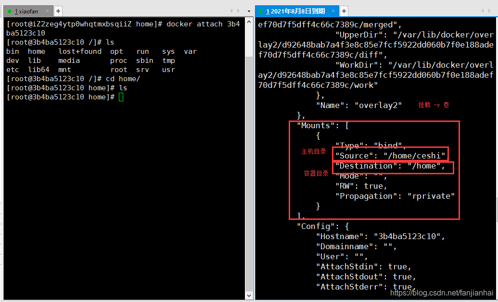

**测试文件的同步**（在主机上改动，观察容器变化）

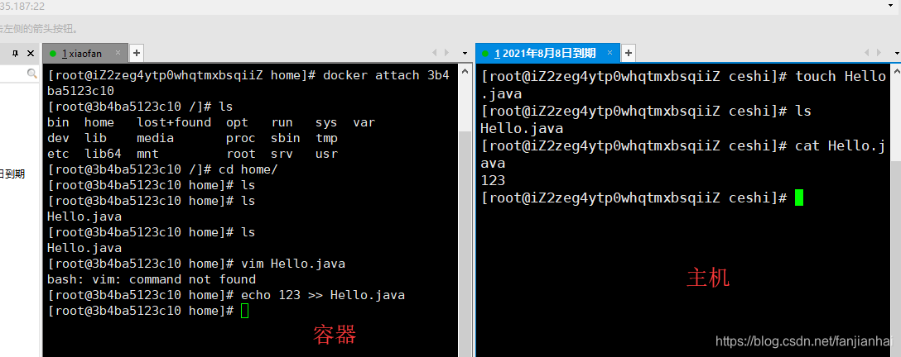

**再来测试**（测试通过）

1. 停止容器
2. 主机上修改文件
3. 启动容器
4. 容器内的数据依旧是同步的！

## 3. 实战：安装MySQL

思考：MySQL的数据持久化的问题！

```shell
# 获取镜像
[root@iZ2zeg4ytp0whqtmxbsqiiZ home]# docker pull mysql:5.7

# 运行容器， 需要做数据挂载！ # 安装启动mysql，需要配置密码（注意）
# 官方测试， docker run --name some-mysql -e MYSQL_ROOT_PASSWORD=my-secret-pw -d mysql:tag

# 启动我们的
-d      # 后台运行
-p      # 端口隐射
-v      # 卷挂载
-e      # 环境配置
--name  # 容器的名字
[root@iZ2zeg4ytp0whqtmxbsqiiZ home]# docker run -d -p 3344:3306 -v /home/mysql/conf:/etc/mysql/conf.d -v /home/mysql/data:/var/lib/mysql -e MYSQL_ROOT_PASSWORD=123456 --name mysql01 mysql:8.0
9552bf4eb2b69a2ccd344b5ba5965da4d97b19f2e1a78626ac1f2f8d276fc2ba

# 启动成功之后，我们在本地使用navicat链接测试一下
# navicat链接到服务器的3344 --- 3344 和 容器的3306映射，这个时候我们就可以连接上mysql喽！

# 在本地测试创建一个数据库，查看下我们的路径是否ok！
```

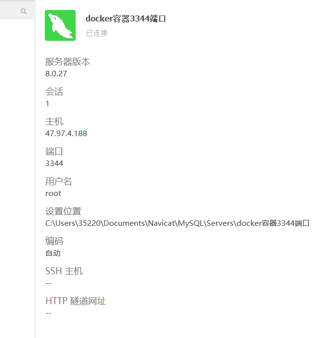

在本地新建test数据库，能够看到数据库test文件夹被同步到服务器和容器内部 

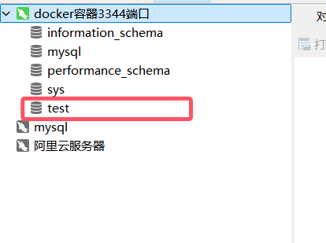

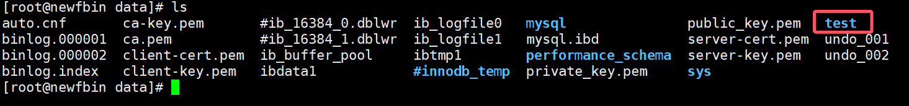

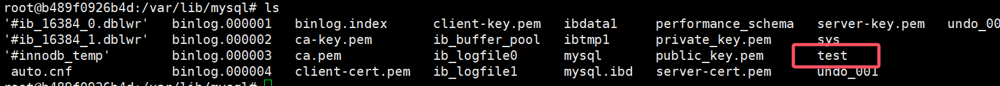

## 4. 匿名和具名挂载

```shell
# 匿名挂载
-v 容器内路径
docker run -d -P --name nginx01 -v /etc/nginx nginx     # -P 随机指定端口

# 查看所有volume的情况
[root@iZ2zeg4ytp0whqtmxbsqiiZ ~]# docker volume ls
DRIVER              VOLUME NAME
local               561b81a03506f31d45ada3f9fb7bd8d7c9b5e0f826c877221a17e45d4c80e096
local               36083fb6ca083005094cbd49572a0bffeec6daadfbc5ce772909bb00be760882

# 这里发现，这种情况就是匿名挂载，我们在-v 后面只写了容器内的路径，没有写容器外的路径！

# 具名挂载
[root@iZ2zeg4ytp0whqtmxbsqiiZ ~]# docker run -d -P --name nginx02 -v juming-nginx:/etc/nginx nginx
26da1ec7d4994c76e80134d24d82403a254a4e1d84ec65d5f286000105c3da17

[root@iZ2zeg4ytp0whqtmxbsqiiZ ~]# docker volume ls
DRIVER              VOLUME NAME
local               561b81a03506f31d45ada3f9fb7bd8d7c9b5e0f826c877221a17e45d4c80e096
local               36083fb6ca083005094cbd49572a0bffeec6daadfbc5ce772909bb00be760882
local               juming-nginx

# 通过-v 卷名：容器内的路径
# 查看一下这个卷
# docker volume inspect juming-nginx

[root@iZ2zeg4ytp0whqtmxbsqiiZ ~]# docker volume inspect juming-nginx
[
  {
      "CreatedAt": "2020-08-12T18:15:21+08:00",
      "Driver": "local",
      "Labels": null,
      "Mountpoint": "/var/lib/docker/volumes/juming-nginx/_data",
      "Name": "juming-nginx",
      "Options": null,
      "Scope": "local"
  }
]
```

所有docker容器内的卷，没有指定目录的情况下都是在`/var/lib/docker/volumes/xxxxx/_data`

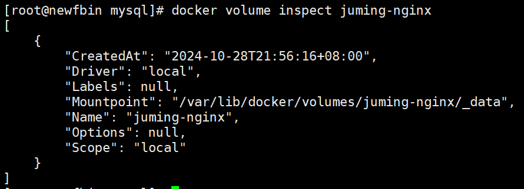

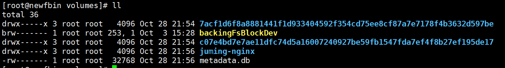

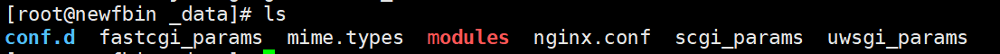

我们通过具名挂载可以方便的找到我们的一个卷，大多数情况下使用的是`具名挂载`

```shell
# 如何确定是具名挂载还是匿名挂载，还是指定路径挂载！
-v  容器内路径                   # 匿名挂载
-v  卷名:容器内路径               # 具名挂载
-v /主机路径:容器内路径            # 指定路径挂载
```

> 关于指定路径挂载：
>
> 如果使用指定路径挂载，使用docker volume ls命令后不会显示被指定路径挂载的卷。
> 指定路径挂载这种方式不会创建 Docker 中的命名卷，只是绑定了宿主机上的一个目录。
> 但是被指定路径挂载的卷仍然可以通过docker inspect 容器名 查看容器的挂载情况

拓展

```shell
# 通过 -v 容器内容路径 ro rw 改变读写权限
ro  readonly    # 只读
rw  readwrite   # 可读可写

docker run -d -P --name nginx02 -v juming-nginx:/etc/nginx:ro nginx
docker run -d -P --name nginx02 -v juming-nginx:/etc/nginx:rw nginx

# ro 只要看到ro就说明这个路径只能通过宿主机来操作，容器内容无法操作
# rw 默认权限是rw
```

## 5.数据卷容器

多个mysql同步数据！

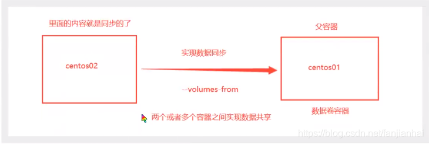

```
# 启动3个容器，通过我们刚才自己写的镜像启动
```

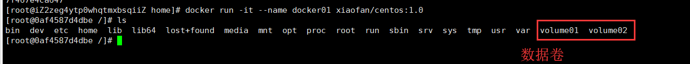

> docker 02的volume01和volume02将自动挂载到docker01的两个对应的卷上。
>
> 其它目录不会和docker01的同步

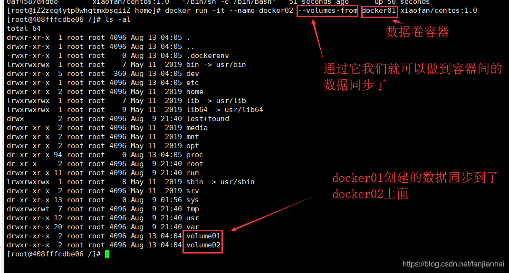

多个mysql实现数据共享

```shell
[root@iZ2zeg4ytp0whqtmxbsqiiZ home]# docker run -d -p 3344:3306 -v /etc/mysql/conf.d -v /var/lib/mysql -e MYSQL_ROOT_PASSWORD=123456 --name mysql01 mysql:8.0

[root@iZ2zeg4ytp0whqtmxbsqiiZ home]# docker run -d -p 3344:3306 -e MYSQL_ROOT_PASSWORD=123456 --name mysql02 --volumes-from mysql01 mysql:8.0

# mysql02的/etc/mysql/conf.d 和 /var/lib/mysql 两个目录将自动挂载到mysql01两个对应的卷上
```

**结论**

容器之间配置信息的传递， 数据卷容器的生命周期一直持续到没有容器使用为止。

但是一旦你持久化到了本地，这个时候，本地的数据是不会删除的！

