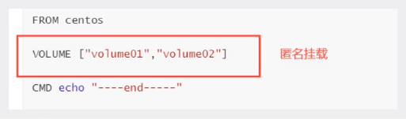

# DockerFile

## 初识DockerFile

DockerFile就是用来构建docker镜像的构建文件！命令脚本！先体验一下！

通过这个脚本可以生成镜像，镜像是一层一层的。脚本中一个个的命令，每个命令都是一层！

```dockerfile
# 创建一个dockerfile文件， 名字可以随机，建议Dockerfile
# 文件的内容： 指令（大写） 参数

FROM centos

VOLUME ["volume01", "volume02"] #匿名挂载

CMD echo "----end----"
CMD /bin/bash

# 这里的每一个命令都是镜像的一层！
```


```
# 启动自己的容器
```


这个卷和外部一定有一个同步的目录！



```
docker inspect 容器id
```


测试一下刚才的文件是否同步到主机上了！

这种方式我们未来使用的十分多， 因为我们通常会构建自己的镜像！

假设构建镜像时候没有挂载卷，要手动镜像挂载 -v 卷名:容器内路径！

## DockerFile

dockerFile是用来构建docker镜像的文件！命令参数脚本！

```shell
构建步骤
1. 编写一个dockerFile文件
2.docker build 构建成为一个镜像
3. docker run 运行镜像
4. docker push 发布镜像（DockerHub、阿里云镜像）
```

查看一下官方是怎么做的？


很多官方镜像都像是基础包，很多功能都不具备，我们通常会自己搭建自己的镜像！

官方既然可以制作镜像，能我们一样可以！

## DockerFile的构建过程

**基础知识：**

1. 每个保留关键字（指令）都是必须大写字母
2. 执行从上到下顺序执行
3. `#` 表示注释
4. 每个指令都会创建提交一个新的镜像层，并提交！


dockerFile是面向开发的， 我们以后要发布项目， 做镜像， 就需要编写dockefile文件， 这个文件十分简单！

Docker镜像逐渐成为企业的交互标准，必须要掌握！

步骤：开发，部署， 运维..... 缺一不可！

**DockerFile**： 构建文件， 定义了一切的步骤，源代码

**DockerImages**： 通过DockerFile构建生成的镜像， 最终发布和运行的产品！

**Docker容器**：容器就是镜像运行起来提供服务器

## DockerFile指令说明


```dockerfile
FROM            # 基础镜像，一切从这里开始构建
MAINTAINER      # 镜像是谁写的， 姓名+邮箱
RUN             # 镜像构建的时候需要运行的命令
ADD             # 步骤， tomcat镜像， 这个tomcat压缩包！添加内容
WORKDIR         # 镜像的工作目录
VOLUME          # 挂载的目录
EXPOSE          # 保留端口配置
CMD             # 指定这个容器启动的时候要运行的命令，只有最后一个会生效可被替代
ENTRYPOINT      # 指定这个容器启动的时候要运行的命令， 可以追加命令
ONBUILD         # 当构建一个被继承DockerFile 这个时候就会运行 ONBUILD 的指令，触发指令
COPY            # 类似ADD, 将我们文件拷贝到镜像中
ENV             # 构建的时候设置环境变量！
```

## 创建一个自己的centos

```dockerfile
# 1. 编写Dockerfile的文件
[root@iZ2zeg4ytp0whqtmxbsqiiZ dockerfile]# cat mydockerfile-centos 
FROM centos
MAINTAINER xiaofan<594042358@qq.com>

ENV MYPATH /usr/local
WORKDIR $MYPATH     # 镜像的工作目录

# 使用yum安装东西之前，先把yum源更换为阿里云
RUN cd /etc/yum.repos.d/ && mkdir backup && mv *repo backup/
RUN curl -o /etc/yum.repos.d/CentOS-Base.repo http://mirrors.aliyun.com/repo/Centos-8.repo
RUN sed -i -e "s|mirrors.cloud.aliyuncs.com|mirrors.aliyun.com|g " /etc/yum.repos.d/CentOS-*
RUN sed -i -e "s|releasever|releasever-stream|g" /etc/yum.repos.d/CentOS-*
RUN yum clean all && yum makecache
# 使用yum安装工具
RUN yum -y install vim
RUN yum -y install net-tools

EXPOSE 80

CMD echo $MYPATH
CMD echo "---end---"
CMD /bin/bash

# 2. 通过这个文件构建镜像
# 命令 docker build -f dockerfile文件路径 -t 镜像名:[tag] .   （ .表示当前目录 ）

[root@iZ2zeg4ytp0whqtmxbsqiiZ dockerfile]# docker build -f mydockerfile-centos -t mycentos:0.1 .

Successfully built d2d9f0ea8cb2
Successfully tagged mycentos:0.1
```


我们可以列出本地进行的变更历史


## CMD 和ENTRYPOINT区别

```dockerfile
CMD         # 指定这个容器启动的时候要运行的命令，只有最后一个会生效可被替代
ENTRYPOINT      # 指定这个容器启动的时候要运行的命令， 可以追加命令
```

### 测试CMD

```dockerfile
# 1. 编写dockerfile文件
[root@iZ2zeg4ytp0whqtmxbsqiiZ dockerfile]# vim dockerfile-cmd-test 
FROM centos
CMD ["ls", "-a"]

# 2. 构建镜像
[root@iZ2zeg4ytp0whqtmxbsqiiZ dockerfile]# docker build -f dockerfile-cmd-test -t cmdtest .

# 3. run运行， 发现我们的ls -a 命令生效
[root@iZ2zeg4ytp0whqtmxbsqiiZ dockerfile]# docker run ebe6a52bb125
.
..
.dockerenv
bin
dev
etc
home
lib
lib64

# 想追加一个命令 -l 变成 ls -al
[root@iZ2zeg4ytp0whqtmxbsqiiZ dockerfile]# docker run ebe6a52bb125 -l
docker: Error response from daemon: OCI runtime create failed: container_linux.go:349: starting container process caused "exec: \"-l\": executable file not found in $PATH": unknown.
[root@iZ2zeg4ytp0whqtmxbsqiiZ dockerfile]# docker run ebe6a52bb125 ls -l

# cmd的情况下 -l替换了CMD["ls", "-a"]命令， -l不是命令，所以报错了
```

### 测试ENTRYPOINT

```dockerfile
# 1. 编写dockerfile文件
[root@iZ2zeg4ytp0whqtmxbsqiiZ dockerfile]# vim dockerfile-entrypoint-test 
FROM centos
ENTRYPOINT ["ls", "-a"]

# 2. 构建文件
[root@iZ2zeg4ytp0whqtmxbsqiiZ dockerfile]# docker build -f dockerfile-entrypoint-test -t entrypoint-test .

# 3. run运行 发现我们的ls -a 命令同样生效
[root@iZ2zeg4ytp0whqtmxbsqiiZ dockerfile]# docker run entrypoint-test
.
..
.dockerenv
bin
dev
etc
home
lib

# 4. 我们的追加命令， 是直接拼接到ENTRYPOINT命令的后面的！
[root@iZ2zeg4ytp0whqtmxbsqiiZ dockerfile]# docker run entrypoint-test -l
total 56
drwxr-xr-x  1 root root 4096 Aug 13 07:52 .
drwxr-xr-x  1 root root 4096 Aug 13 07:52 ..
-rwxr-xr-x  1 root root    0 Aug 13 07:52 .dockerenv
lrwxrwxrwx  1 root root    7 May 11  2019 bin -> usr/bin
drwxr-xr-x  5 root root  340 Aug 13 07:52 dev
drwxr-xr-x  1 root root 4096 Aug 13 07:52 etc
drwxr-xr-x  2 root root 4096 May 11  2019 home
lrwxrwxrwx  1 root root    7 May 11  2019 lib -> usr/lib
lrwxrwxrwx  1 root root    9 May 11  2019 lib64 -> usr/lib64
drwx------  2 root root 4096 Aug  9 21:40 lost+found
```


