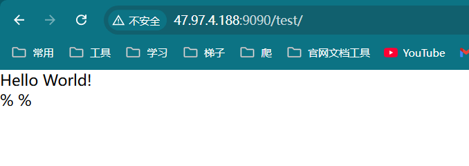
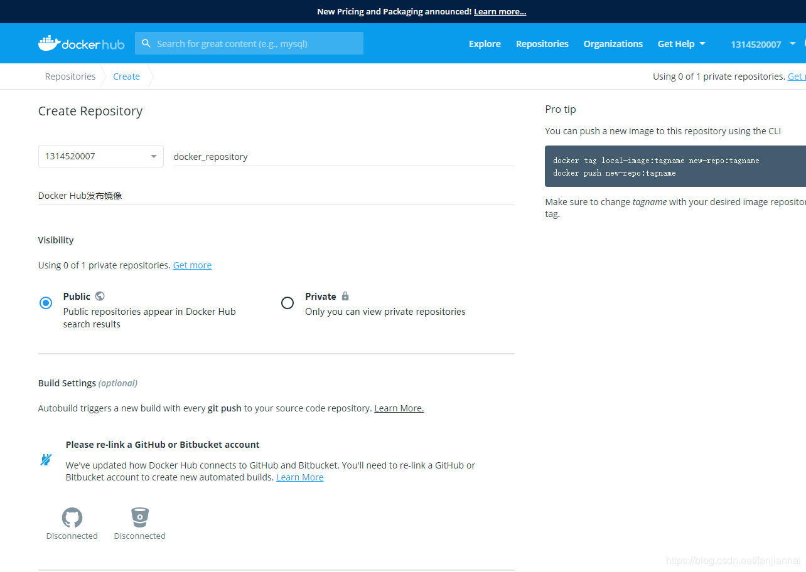

# Dockerfile制作tomcat镜像

## Dockerfile制作tomcat镜像

1. 准备镜像文件 tomcat压缩包，jdk的压缩包！


2. 编写Dockerfile文件，官方命名`Dockerfile`, build会自动寻找这个文件，就不需要-f指定了！

```dockerfile
[root@iZ2zeg4ytp0whqtmxbsqiiZ tomcat]# cat Dockerfile 
FROM centos

MAINTAINER newfbin<fubinniu@gmail.com>

# COPY readme.txt /usr/local/readme.txt

ADD jdk-8u141-linux-x64.tar.gz /usr/local
ADD apache-tomcat-9.0.96.tar.gz /usr/local

RUN cd /etc/yum.repos.d/ && mkdir backup && mv *repo backup/
RUN curl -o /etc/yum.repos.d/CentOS-Base.repo http://mirrors.aliyun.com/repo/Centos-8.repo
RUN sed -i -e "s|mirrors.cloud.aliyuncs.com|mirrors.aliyun.com|g " /etc/yum.repos.d/CentOS-*
RUN sed -i -e "s|releasever|releasever-stream|g" /etc/yum.repos.d/CentOS-*
RUN yum clean all && yum makecache
RUN yum -y install vim
RUN yum -y install net-tools

ENV MYPATH /usr/local
WORKDIR $MYPATH

ENV JAVA_HOME /usr/local/jdk1.8.0_141
ENV CLASSPATH $JAVA_HOME/lib/dt.jar:$JAVA_HOME/lib/tools.jar
ENV CATALINA_HOME /usr/local/apache-tomcat-9.0.96
ENV CATALINA_BASH /usr/local/apache-tomcat-9.0.96
ENV PATH $PATH:$JAVA_HOME/bin:$CATALINA_HOME/lib:$CATALINA_HOME/bin

EXPOSE 8080

CMD /usr/local/apache-tomcat-9.0.96/bin/startup.sh && tail -F /usr/local/apache-tomcat-9.0.96/bin/logs/catalina.out
```

3. 构建镜像

```shell
# docker build -t diytomcat .
```

4. 启动镜像

```bash
#  docker run -d -p 9090:8080 --name newfbintomcat01 -v /home/newfbin/build/tomcat/test:/usr/local/apache-tomcat-9.0.96/webapps/test -v /home/newfbin/build/tomcat/tomcatlogs/:/usr/local/apache-tomcat-9.0.96/logs diytomcat
```

5. 访问测试


6. 发布项目（由于做了卷挂载， 我们直接在本地编写项目就可以发布了）

**在本地编写web.xml和index.jsp进行测试**


编写web.xml

```xml
<?xml version="1.0" encoding="UTF-8"?>
<web-app version="2.4" 
    xmlns="http://java.sun.com/xml/ns/j2ee" 
    xmlns:xsi="http://www.w3.org/2001/XMLSchema-instance"
    xsi:schemaLocation="http://java.sun.com/xml/ns/j2ee 
        http://java.sun.com/xml/ns/j2ee/web-app_2_4.xsd">
        
</web-app>
```

编写index.jsp

```jsp
<%@ page language="java" contentType="text/html; charset=UTF-8"
    pageEncoding="UTF-8"%>
<!DOCTYPE html>
<html>
<head>
<meta charset="utf-8">
<title>hello. xiaofan</title>
</head>
<body>
Hello World!<br/>
<%
System.out.println("-----my test web logs------");
%>
</body>
</html>
```

发现：项目部署成功， 可以直接访问ok！

我们以后开发的步骤：需要掌握Dockerfile的编写！ 我们之后的一切都是使用docker进行来发布运行的！



## 发布自己的镜像到Docker Hub

> Docker Hub

1. [地址](https://hub.docker.com/) 注册自己的账号！

   

2. 确定这个账号可以登录


1. 在我们的服务器上提交自己的镜像

```shell
# push到我们的服务器上
[root@iZ2zeg4ytp0whqtmxbsqiiZ ~]# docker push diytomcat
The push refers to repository [docker.io/library/diytomcat]
2eaca873a720: Preparing 
1b38cc4085a8: Preparing 
088ebb58d264: Preparing 
c06785a2723d: Preparing 
291f6e44771a: Preparing 
denied: requested access to the resource is denied  # 拒绝

# push镜像的问题？
The push refers to repository [docker.io/1314520007/diytomcat]
An image does not exist locally with the tag: 1314520007/diytomcat

# 解决，增加一个tag
docker tag diytomcat newfbin/diytomcat:1.0
```


自制的镜像被上传到docker hub：


## 发布到阿里云镜像服务上

1. 登录阿里云
2. 找到容器镜像服务
3. 创建命名空间 


4. 创建容器镜像


5. 点击仓库名称，参考官方文档即可


阿里云仓库镜像信息：


## 总结


