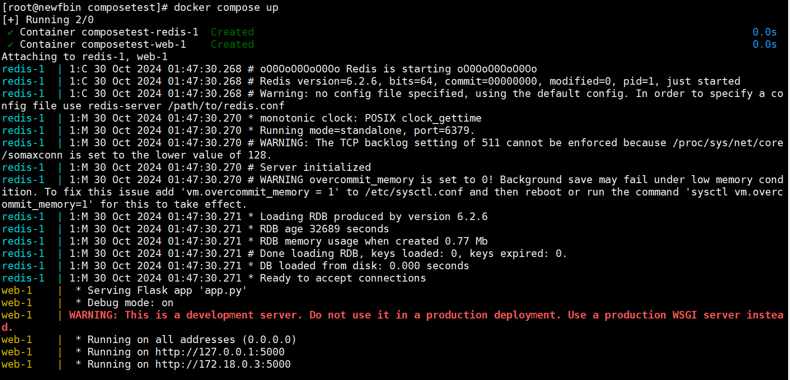
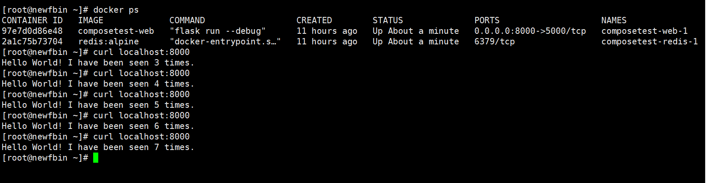
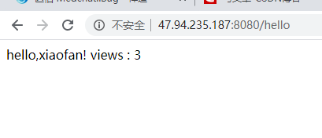

# Docker Compose

## 简介

过去使用Docker，都是通过docker run 命令启动容器，

现在使用docker compose ，可以通过编写 yaml 配置文件，可以通过compose 一键启动或者停止所有服务。

> 假如在微服务中，有100个微服务，微服务之间还有依赖关系，使用Docker手动管理这些微服务就极为不现实。
>
> Docker Compose 能轻松高效的管理容器，定义运行多个容器。

> 官方介绍

1. 定义运行多个容器
2. YAML file配置文件
3. single command。命令有哪些？

Compose is a tool for defining and running multi-container Docker applications. With Compose, you use a YAML file to configure your application’s services. Then, with a single command, you create and start all the services from your configuration. To learn more about all the features of Compose, see [the list of features](https://docs.docker.com/compose/#features).

4. 所有的环境都可以使用compose。

Compose works in all environments: production, staging, development, testing, as well as CI workflows. You can learn more about each case in [Common Use Cases](https://docs.docker.com/compose/#common-use-cases).

**三步骤：**

Using Compose is basically a three-step process:

1. Define your app’s environment with a 

   ```
   Dockerfile
   ```

    so it can be reproduced anywhere.

   - Dockerfile保证我们的项目再任何地方可以运行

2. Define the services that make up your app in 

   ```
   docker-compose.yml
   ```

    so they can be run together in an isolated environment.

   - services 什么是服务。

3. Run 

   ```
   docker-compose up
   ```

    and Compose starts and runs your entire app.

   - 启动项目

**作用：批量容器编排**

> 我自己的理解

Compose是Docker官方的开源项目，需要安装！

`Dockerfile`让程序在任何地方运行。web服务、redis、mysql、nginx... 多个容器。 run

Compose

```yml
version: '2.0'
services:
  web:
    build: .
    ports:
    - "5000:5000"
    volumes:
    - .:/code
    - logvolume01:/var/log
    links:
    - redis
  redis:
    image: redis
volumes:
  logvolume01: {}
```

docker-compose up 100个服务

Compose：重要概念

- 服务services， 容器、应用（web、redis、mysql...）
- 项目project。 一组关联的容器

## 安装

1. 下载

```shell
# 官网提供 （没有下载成功）
curl -L "https://github.com/docker/compose/releases/download/1.26.2/docker-compose-$(uname -s)-$(uname -m)" -o /usr/local/bin/docker-compose

# 国内地址
curl -L https://get.daocloud.io/docker/compose/releases/download/1.25.5/docker-compose-`uname -s`-`uname -m` > /usr/local/bin/docker-compose
```

1. 授权

```
chmod +x /usr/local/bin/docker-compose
```


## Compose初体验(快速回顾Compose流程)

地址：https://docs.docker.com/compose/gettingstarted/

python应用。 计数器。redis！

1. 应用app.py

2. Dockerfile 应用打包为镜像

   ```dockerfile
   # syntax=docker/dockerfile:1
   FROM python:3.10-alpine
   WORKDIR /code
   ENV FLASK_APP=app.py
   ENV FLASK_RUN_HOST=0.0.0.0
   RUN apk add --no-cache gcc musl-dev linux-headers
   COPY requirements.txt requirements.txt
   RUN pip install -r requirements.txt
   EXPOSE 5000
   COPY . .
   CMD ["flask", "run", "--debug"]
   ```

3. Docker-compose yaml文件（定义整个服务，需要的环境 web、redis） 完整的上线服务！

   ```yaml
   services:
     web:
       build: .
       ports:
         - "8000:5000"
     redis:
       image: "redis:alpine"
   ```

4. 启动compose 项目 （docker compose up）



 


compose项目启动成功后，可以看到自动下载好了需要的两个镜像


通过docker ps命令查看已经启动的容器，可以看到容器名为 : 文件名 _ 服务名 _ num
这样命名是因为未来一定会有多个服务器组成集群。每个服务器上都会有这个容器，num就是容器的副本数量。
例如如果有四台服务器，那么就会有4个redis副本。


**网络规则：**

查看网络可以看到，compose项目自动创建了一个网络，
项目中的服务都在同一个网络下，服务之间可以通过域名访问。

> 根据前面学习过的Docker网络知识可以知道，同一网络下的容器可以通过容器名相互ping通


**关于官网案例的细节：**

官网代码中给出的是host = 'redis'
而一般我们写配置文件，或者写代码，会写host = localhost 或 host = xxxx.xxxx.xxxx.xxxx 
host = ’redis' 这个写法说明代码是通过服务名来访问服务的，而不是通过服务的ip


流程：

1. 创建网络
2. 执行Docker compose.yaml
3. 启动服务


## yaml规则

docker-compose.yaml 核心！

https://docs.docker.com/compose/compose-file/#compose-file-structure-and-examples


```yaml
# yaml文件共有三层

# 第一层：版本
version:''

# 第二层：服务
services: 
	服务1：web
		# 服务配置
		images
		build
		networks
		...
	服务2：redis
		...
# 第三层：其它配置：网络、卷、全局规则
volumes:
networks:
configs:
	
```

### 第一层：Version

...

### 第二层：Services


**重点1：depends_on**

> depends_on规定了服务的启动顺序
>
> services下一共有三个服务：web, redis,  db
> 根据depends_on，启动的顺序是：db 、 redis 、 web


**重点2：deploy**

> 在多个服务器下可以定义副本：replcates 


### 第三层：其它配置

看官网文档来理解学习

...

## 开源项目：博客

https://docs.docker.com/compose/wordpress/

下载程序、安装数据库、配置....

compose应用 => 一键启动

1. 下载项目（docker-compse.yaml）
2. 如果需要文件。Dockerfile
3. 文件准备齐全，一键启动项目即可


## 实战：自己编写微服务上线

1. 编写项目微服务

2. Dockerfile构建镜像

   ```dockerfile
   FROM java:8
   
   COPY *.jar /app.jar
   
   CMD ["--server.port=8080"]
   
   EXPOSE 8080
   
   ENTRYPOINT ["java", "-jar", "/app.jar"]
   ```

3. docker-compose.yml编排项目

   ```yml
   version '3.8'
   services:
     xiaofanapp:
       build: .
       image: xiaofanapp
       depends_on:
         - redis
       ports:
         - "8080:8080"
   
     redis:
       image: "library/redis:alpine"
   ```

4. 丢到服务器运行 docker compose up

将jar包、yml、Dockerfile丢到服务器


```shell
docker compose down         # 关闭容器
docker compose up --build   # 重新构建
```




**总结：**

**工程、服务、容器**

项目 compose： 三层

- 工程 Project
- 服务
- 容器 运行实例！ docker k8s 容器

