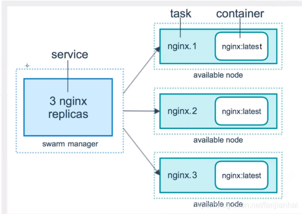
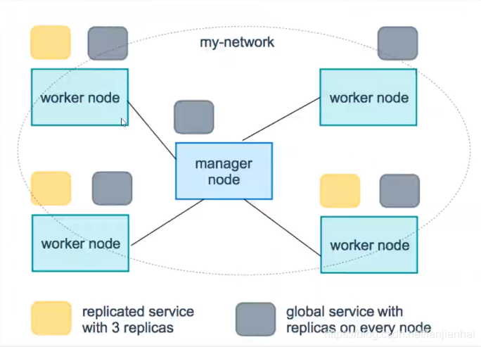

# Docker Swarm

集群

## 购买服务器

1. 登录阿里云账号，进入控制台，创建实例

   ```
   4台服务器2G
   ```


到此，我们的服务器购买成功！

## 四台机器安装docker

和我们单机安装一样

技巧： xshell直接同步操作，省时间！

- [Docker的安装](https://blog.csdn.net/fanjianhai/article/details/107860159)

## Swarm集群搭建

> 当前服务器集群情况：
>
> 四台已经安装了docker的服务器
>
> 

- [工作机制](https://docs.docker.com/engine/swarm/how-swarm-mode-works/nodes/)

  

  **在docker1中操作：**

```shell
docker swarm init --help

ip addr # 获取自己的ip（用内网的不要流量）
[root@iZ7xvgjfyuyme06vx3jm7sZ ~]# ip addr
1: lo: <LOOPBACK,UP,LOWER_UP> mtu 65536 qdisc noqueue state UNKNOWN group default qlen 1000
    link/loopback 00:00:00:00:00:00 brd 00:00:00:00:00:00
    inet 127.0.0.1/8 scope host lo
       valid_lft forever preferred_lft forever
2: eth0: <BROADCAST,MULTICAST,UP,LOWER_UP> mtu 1500 qdisc pfifo_fast state UP group default qlen 1000
    link/ether 00:16:3e:01:02:cd brd ff:ff:ff:ff:ff:ff
    inet 172.18.52.163/20 brd 172.18.63.255 scope global dynamic eth0
       valid_lft 315358649sec preferred_lft 315358649sec
3: docker0: <NO-CARRIER,BROADCAST,MULTICAST,UP> mtu 1500 qdisc noqueue state DOWN group default 
    link/ether 02:42:6e:e4:0f:af brd ff:ff:ff:ff:ff:ff
    inet 172.17.0.1/16 brd 172.17.255.255 scope global docker0
       valid_lft forever preferred_lft forever


[root@iZ7xvgjfyuyme06vx3jm7sZ ~]# docker swarm init --advertise-addr 172.18.52.163
Swarm initialized: current node (k0vbw0k23vguodxdjqvfinr7e) is now a manager.

To add a worker to this swarm, run the following command:

    docker swarm join --token SWMTKN-1-4gn7p2nfv39qiebg50waqk1fi63saswbep9i8sfxtl9yg8ec4m-70jnjukxy7xdt1h20ynwmvtbk 172.18.52.163:2377

To add a manager to this swarm, run 'docker swarm join-token manager' and follow the instructions.
```

初始化结点`docker swarm init`

`docker swarm join `加入一个结点！


**在docker2中操作：** 

```shell
# 生成令牌（可以在任何一个管理节点生成令牌）
docker swarm join-token manager
docker swarm join-token worker
[root@iZ2ze58v8acnlxsnjoulk6Z ~]# docker swarm join --token SWMTKN-1-3vovnwb5pkkno2i3u2a42yrxc1dk51zxvto5hrm4asgn37syfn-0xkrprkuyyhrx7cidg381pdir 172.16.250.97:2377
This node joined a swarm as a worker.
```


**把后面的结点都搭建进去**

> docker3

在docker1中执行`docker swarm join-token worker`,生成加入工作节点的令牌。如下图：


将生成的命令复制到docker3中执行，docker3便加入到工作节点中。

> docker4

在docker1中执行`docker swarm join-token manager`,生成加入管理节点的令牌。如下图：


将生成的命令复制到docker4中执行，docker4便加入到管理节点中。

> docker1查看
>
> 其中rZ结尾的机器先加入到了工作节点，又退出工作节点，再加入到了管理节点。所以该机器有两个，其中一个状态为Down


目前的状态是”双主双从“，是一种不太科学的状态，正常状态应该为至少三个主节点

**总结步骤**

1. 生成主节点init
2. 加入（管理者，worker）

## 测试Raft协议

Raft协议：保证大多数结点存活才可以使用，只要>1, 集群至少大于3台！

双主双从：假设一个主结点挂了！另外一个主节点不可以使用

实验：

1、将docker1机器停止。dockers1宕机！双主，另外一个主结点也不能使用了！

> docker4操作。发现错误提示。说明两个主节点时，一个主节点宕机，另一个主节点将不能使用


2.可以将其他结点离开`docker swarm leave`


3.worker就是工作的，manager管理结点操作！ 现在将docker3也设置为管理节点，目前共3台结点设置为管理结点。


4.Docker swarm集群增加节点](https://www.cnblogs.com/zoujiaojiao/p/10886262.html)

Raft协议：保证大多数结点存活，才可以使用，高可用！

举例： 至少要保证3个主节点。 >= 2台管理结点存活！

## 体验：创建服务、动态扩容服务、动态更新服务

弹性、扩缩容！集群！     

以后告别 docker run！

docker-compose up！启动一个项目。单机！

集群： swarm `docker-service`

k8s service

容器 => 服务！

容器 => 服务！ => 副本！

redis => 10个副本！（同时开启10个redis容器）

> 假设现在有一个nginx集群。
>
> 在不使用动态扩缩容时，向集群中加入了一个web，需要在每个nginx中配置这个web	
>
> 


体验：创建服务、动态扩容服务、动态更新服务


灰度发布（金丝雀发布）

[编程浪子的博客](https://www.cnblogs.com/apanly/)


**docker service创建服务：**


```shell
docker run 容器启动！ 不具有扩缩容器
docker service 服务！ 具有扩缩容器，滚动更新！
```

**查看服务**


动态扩缩容

```shell
# docker service 扩展副本数量
# 这三个nginx容器将随机分配的这四个docker服务器上
[root@iZ2ze58v8acnlxsnjoulk5Z ~]# docker service update --replicas 3 my-nginx
1/3: running   [==================================================>] 
1/3: running   [==================================================>] 
2/3: running   [==================================================>] 
3/3: running   [==================================================>] 
verify: Service converged 

# docker service scale 扩缩副本数量
[root@iZ2ze58v8acnlxsnjoulk5Z ~]# docker service scale my-nginx=5
my-nginx scaled to 5
overall progress: 3 out of 5 tasks 
overall progress: 3 out of 5 tasks 
overall progress: 3 out of 5 tasks 
overall progress: 5 out of 5 tasks 
1/5: running   [==================================================>] 
2/5: running   [==================================================>] 
3/5: running   [==================================================>] 
4/5: running   [==================================================>] 
5/5: running   [==================================================>] 
verify: Service converged 


[root@iZ2ze58v8acnlxsnjoulk5Z ~]# docker service scale my-nginx=1
my-nginx scaled to 1
overall progress: 1 out of 1 tasks 
1/1: running   [==================================================>] 
verify: Service converged 
```

移除服务：`docker service rm 服务名`

docker swarm其实并不难

只要会搭建集群、会启动服务、动态管理容器就可以了！

## Docker Swarm概念的总结

**swarm**

集群的管理和编号，docker可以初始化一个swarm集群，其他结点可以加入。（管理，工作者）

**Node**

就是一个docker结点，多个结点就组成了一个网络集群（管理、工作者）

**Service**

任务，可以在**管理结点或者工作结点**来运行。核心，用户访问。

**Task**

容器内的命令、细节任务！

yml文件中**replicas:4** 就对应 Service中的4个**Task**


> service



**Swarm内部原理**

命令 -> 管理 -> api -> 调度 -> 工作结点（创建Task容器维护创建！）


> 服务副本和全局服务



调整service以什么方式运行

```shell
--mode string                        
Service mode (replicated or global) (default "replicated")

docker service create --mode replicated --name mytom tomcat:7 默认的
docker service create --mode global  --name haha alpine ping www.baidu.com
```

拓展： 网络模式 "PublishMode":"ingress"

Swarm:

Overlay:

ingress:特殊的Overlay网络！负载均衡的功能！ipvs vip！

```
[root@iZ2ze58v8acnlxsnjoulk5Z ~]# docker network ls
NETWORK ID          NAME                DRIVER              SCOPE
74cecd37149f        bridge              bridge              local
168d35c86dd5        docker_gwbridge     bridge              local
2b8f4eb9c2e5        host                host                local
dmddfc14n7r3        ingress             overlay             swarm
8e0f5f648e69        none                null                local


[root@iZ2ze58v8acnlxsnjoulk5Z ~]# docker network inspect ingress
[
    {
        "Name": "ingress",
        "Id": "dmddfc14n7r3vms5vgw0k5eay",
        "Created": "2020-08-17T10:29:07.002315919+08:00",
        "Scope": "swarm",
        "Driver": "overlay",
        "EnableIPv6": false,
        "IPAM": {
            "Driver": "default",
            "Options": null,
            "Config": [
                {
                    "Subnet": "10.0.0.0/24",
                    "Gateway": "10.0.0.1"
                }
            ]
        },
        "Internal": false,
        "Attachable": false,
        "Ingress": true,
        "ConfigFrom": {
            "Network": ""
        },
        "ConfigOnly": false,
        "Containers": {
            "ingress-sbox": {
                "Name": "ingress-endpoint",
                "EndpointID": "9d6ec47ec8309eb209f4ff714fbe728abe9d88f9f1cc7e96e9da5ebd95adb1c4",
                "MacAddress": "02:42:0a:00:00:02",
                "IPv4Address": "10.0.0.2/24",
                "IPv6Address": ""
            }
        },
        "Options": {
            "com.docker.network.driver.overlay.vxlanid_list": "4096"
        },
        "Labels": {},
        "Peers": [
            {
                "Name": "cea454a89163",
                "IP": "172.16.250.96"
            },
            {
                "Name": "899a05b64e09",
                "IP": "172.16.250.99"
            },
            {
                "Name": "81d65a0e8c03",
                "IP": "172.16.250.97"
            },
            {
                "Name": "36b31096f7e2",
                "IP": "172.16.250.98"
            }
        ]
    }
]
```

## 其他命令学习方式

- Docker Stack

```shell
docker compose 单机部署项目
docker stack 集群部署

# 单机
docker-compose up -d wordpress.yaml
# 集群
docker stack deploy wordpress.yaml
```

- Docker Secret

```shell
安全！配置密码！证书！

[root@iZ2ze58v8acnlxsnjoulk5Z ~]# docker secret --help

Usage:  docker secret COMMAND

Manage Docker secrets

Commands:
  create      Create a secret from a file or STDIN as content
  inspect     Display detailed information on one or more secrets
  ls          List secrets
  rm          Remove one or more secrets
```

- Docker Config

```shell
配置！
[root@iZ2ze58v8acnlxsnjoulk5Z ~]# docker config --help

Usage:  docker config COMMAND

Manage Docker configs

Commands:
  create      Create a config from a file or STDIN
  inspect     Display detailed information on one or more configs
  ls          List configs
  rm          Remove one or more configs
```

## 拓展到k8s

**云原生时代**

Go语言！必须掌握！ Java Go！

并发语言！

B语言，C语言的创始人。Unix创始人V8引擎创始人联合创立了Go语言

go`指针`


