#  Docker入门

## 1. Docker 为什么会出现

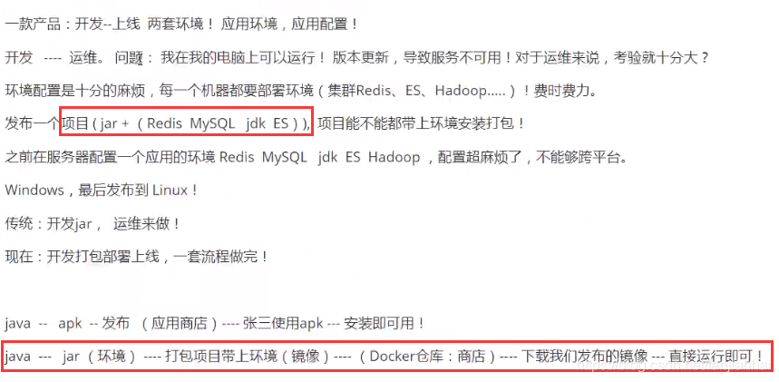


## 2. Docker的历史

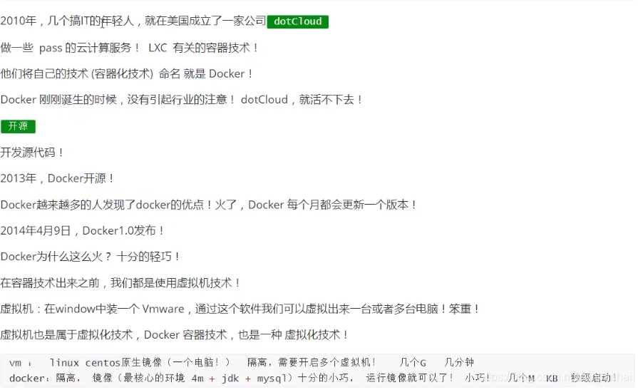

## 3. [Docker最新超详细版教程通俗易懂](https://www.bilibili.com/video/BV1og4y1q7M4)

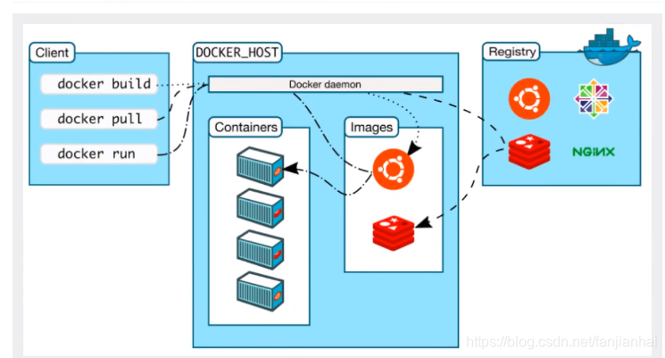

- Docker是基于Go语言开发的！开源项目
- [官网](https://www.docker.com/)
- [官方文档](https://docs.docker.com/)**Docker文档是超详细的**
- [仓库地址](https://hub.docker.com/)

## 4. 虚拟化技术和容器化技术对比

### 4.1. 虚拟化技术的缺点

- 资源占用十分多
- 冗余步骤多
- 启动很慢

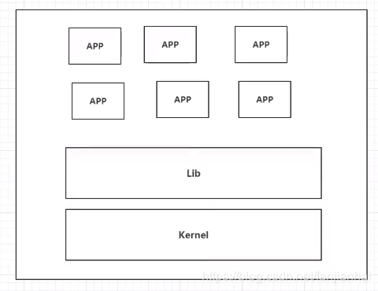

### 4.2. 容器化技术

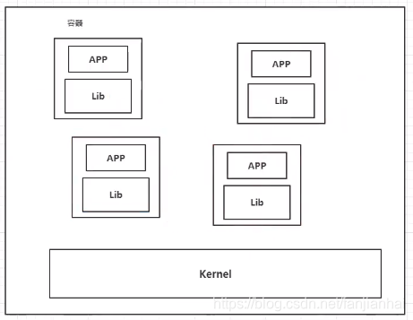

- 比较Docker和虚拟化技术的不同
  - 传统虚拟机， 虚拟出一条硬件，运行一个完整的操作系统，然后在这个系统上安装和运行软件
  - 容器内的应用直接运行在宿主机的内部，容器是没有自己的内核的，也没有虚拟硬件，所以轻便
  - 每个容器间是相互隔离的，每个容器内都有一个属于自己的文件系统，互不影响
- 应用更快速的交互和部署
  - 传统：一堆帮助文档，安装程序
  - Docker： 打包镜像发布测试，一键运行
- 更便捷的升级和扩缩容
- 更简的系统运维
- 更高效的计算资源利用

### 4.3. DevOps

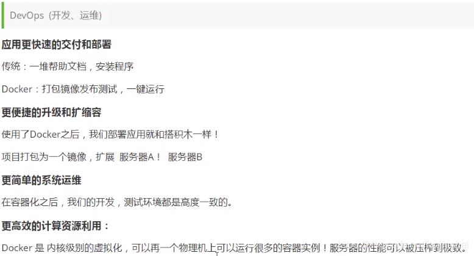

### 4.4. 名词解释

- **镜像（image）**
  - Docker镜像就好比是一个模板，可以通过这个模板来创建容器服务，tomcat镜像 ===> run ===> tomcat01容器， 通过这个镜像可以创建多个容器（最终服务运行或者项目运行就是在容器中的）
- **容器（container）**
  - Docker利用容器技术，独立运行一个或者一组应用， 通过镜像来创建的
  - 启动，停止，删除，基本命令！
  - 就目前可以把这个容器理解为一个建议的linux系统
- **仓库（repository）**
  - 存放镜像的地方
  - Docker Hub（默认是国外的）
  - 阿里云，都有容器服务（配置镜像加速！）

## 5. 安装docker

>  通过查看官方文档安装:
>
>  在docker官网往下翻找到Docker Engine, 点击inastall
>
>  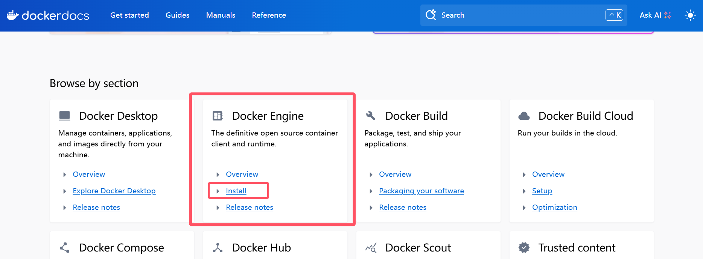
>
>  点击左侧的CentOS，接下来就可以根据官网进行操作
>
>  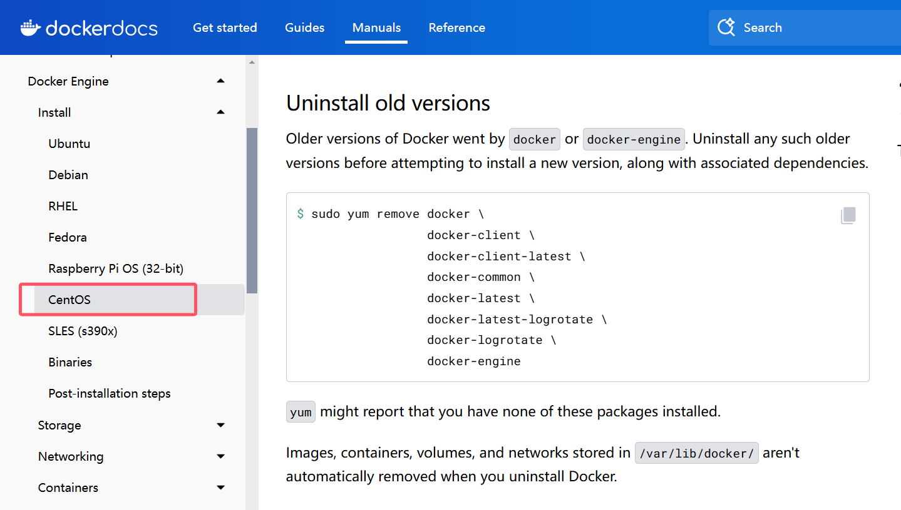

### 一、安装前必读

在安装 Docker 之前，先说一下配置，我这里是Centos7 Linux 内核：官方建议 3.10 以上，3.8以上貌似也可。

注意：本文的命令使用的是 root 用户登录执行，不是 root 的话所有命令前面要加 `sudo`

**1.查看当前的内核版本**

```bash
uname -r
```

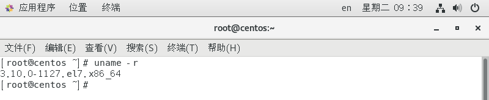


我这里是3.10 ，满足条件。

**2.使用 root 权限更新 yum 包（生产环境中此步操作需慎重，看自己情况，学习的话随便搞）**

```bash
yum -y update
```

这个命令不是必须执行的，看个人情况，后面出现不兼容的情况的话就必须update了

```bash
注意 
yum -y update：升级所有包同时也升级软件和系统内核； 
yum -y upgrade：只升级所有包，不升级软件和系统内核
```

**3.卸载旧版本（如果之前安装过的话）**

```bash
#卸载Docker
systemctl stop docker.socket
systemctl stop docker
                  
yum -y remove docker-ce docker-ce-cli containerd.io                 
                  
rm -rf /var/lib/docker 

#卸载旧版本
yum remove docker \
                  docker-client \
                  docker-client-latest \
                  docker-common \
                  docker-latest \
                  docker-latest-logrotate \
                  docker-logrotate \
                  docker-engine
```


### 二、安装Docker的详细步骤

**1.安装需要的gcc环境和软件包， yum-util 提供yum-config-manager功能，另两个是devicemapper驱动依赖**

```bash
#安装gcc环境
yum -y install gcc
yum -y install gcc-c++

#安装软件包
yum install -y yum-utils
# 看情况执行下面这一句
yum install -y yum-utils device-mapper-persistent-data lvm2
```

**2.设置 yum 源**

设置一个yum源，下面两个都可用

```bash
# 中央仓库
yum-config-manager --add-repo http://download.docker.com/linux/centos/docker-ce.repo
# 阿里仓库(推荐)
yum-config-manager --add-repo http://mirrors.aliyun.com/docker-ce/linux/centos/docker-ce.repo
```

**3.更新yum软件包索引**

```shell
yum makecache fast
```

**4.安装DockerCE**

```shell
yum -y install docker-ce docker-ce-cli containerd.io
```

**5.启动Docker**

```shell
#启动Docker
systemctl start docker
#设置开机自启动
systemctl enable docker
```

**6.测试命令**

```shell
docker version

docker run hello-world

docker images
```

## 6. 配置阿里云镜像加速

1. 登录阿里云服务器，找到`容器镜像服务`

   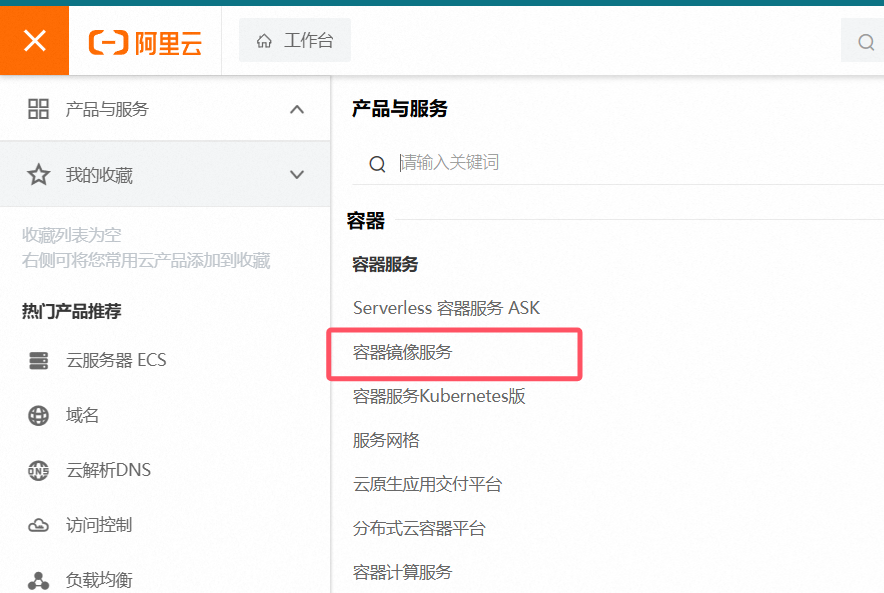

2. 设置Registry登录密码

3. 找到镜像加速器

   

4. 配置使用

```bash
sudo mkdir -p /etc/docker
sudo tee /etc/docker/daemon.json <<-'EOF'
{
  "registry-mirrors": ["https://a3lir7xy.mirror.aliyuncs.com"]
}
EOF
sudo systemctl daemon-reload
sudo systemctl restart docker 
```

## 7. 底层原理

- HelloWorld镜像

  

  


- 底层原理

  Docker Engine是一个客户端-服务器应用程序，具有以下主要组件:

  - 一个服务器，它是一种长期运行的程序，称为守护进程(dockerd命令)
  - 一个REST API，它指定程序可以用来与守护进程对话并指示它做什么的接口。

  Docker是一个**Client Server结构的系统**，Docker守护进程运行在主机上，然后通过Socket连接从客户 端访问，守护进程从客户端接受命令并管理运行在主机上的容器。**容器，是一个运行时环境就是我们所说的集装箱。**

  

- 为什么Docker比Vm快

  - docker有着比虚拟机更少的抽象层。**由于docker不需要Hypervisor实现硬件资源虚拟化,**运行在docker容器上的程序直接使用的都是实际物理机的硬件资源**。因此在CPU、内存利用率上docker将会在效率上有明显优势。**
  - **docker利用的是宿主机的内核,而不需要Guest OS**。因此,当新建一个 容器时,docker不需要和虚拟机一样重新加载一个操作系统内核。仍而避免引寻、加载操作系统内核返个比较费时费资源的过程,当新建一个虚拟机时,虚拟机软件需要加载GuestOS,返个新建过程是分钟级别的。**而docker由于直接利用宿主机的操作系统,则省略了返个过程,因此新建一个docker容器只需要几秒钟。**

  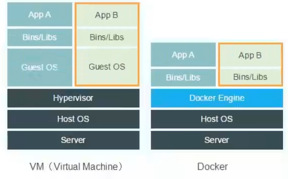

  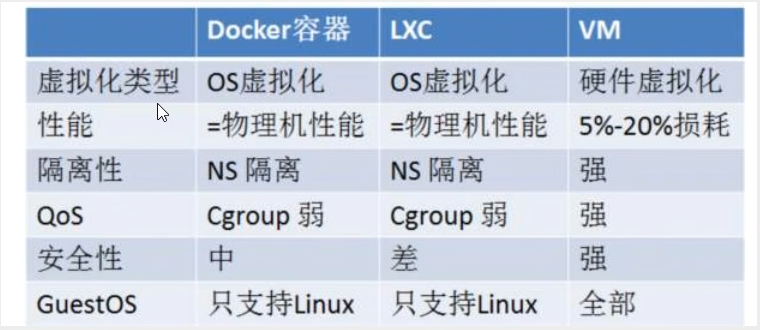

  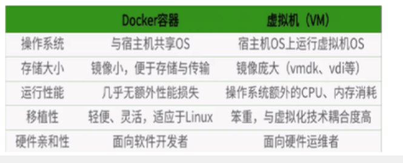

# Docker基本命令


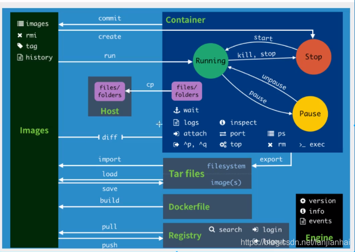

## 帮助命令

```bash
docker version  # docker版本信息
docker info     # 系统级别的信息，包括镜像和容器的数量
docker 命令 --help 
```

- [**帮助文档**](https://docs.docker.com/engine/reference/commandline/docker/)

## 镜像命令

### 查看所有本地主机上的镜像

`docker images` 

```bash
[root@iZ2zeg4ytp0whqtmxbsqiiZ ~]# docker images
REPOSITORY          TAG                 IMAGE ID            CREATED             SIZE
hello-world         latest              bf756fb1ae65        7 months ago        13.3kB

# 解释
REPOSITORY      # 镜像的仓库
TAG             # 镜像的标签
IMAGE ID        # 镜像的ID
CREATED         # 镜像的创建时间
SIZE            # 镜像的大小

# 可选项
--all , -a      # 列出所有镜像
--quiet , -q    # 只显示镜像的id
```

### 查找镜像

`docker search` 

```bash
[root@iZ2zeg4ytp0whqtmxbsqiiZ ~]# docker search mysql
NAME                              DESCRIPTION                                     STARS               OFFICIAL         AUTOMATED
mysql                             MySQL is a widely used, open-source relation…   9822                [OK]                
mariadb                           MariaDB is a community-developed fork of MyS…   3586                [OK]                
mysql/mysql-server                Optimized MySQL Server Docker images. Create…   719                                     [OK]

# 可选项
--filter=STARS=3000     # 搜素出来的镜像就是STARS大于3000的

[root@iZ2zeg4ytp0whqtmxbsqiiZ ~]# docker search mysql --filter=STARS=3000
NAME                DESCRIPTION                                     STARS               OFFICIAL            AUTOMATED
mysql               MySQL is a widely used, open-source relation…   9822                [OK]                
mariadb             MariaDB is a community-developed fork of MyS…   3586                [OK]     
```

### 下载镜像

`docker pull` 

```bash
# 下载镜像，docker pull 镜像名[:tag]
[root@iZ2zeg4ytp0whqtmxbsqiiZ ~]# docker pull mysql
Using default tag: latest           # 如果不写tag，默认就是latest
latest: Pulling from library/mysql
bf5952930446: Pull complete         # 分层下载，dockerimages的核心，联合文件系统
8254623a9871: Pull complete 
938e3e06dac4: Pull complete 
ea28ebf28884: Pull complete 
f3cef38785c2: Pull complete 
894f9792565a: Pull complete 
1d8a57523420: Pull complete 
6c676912929f: Pull complete 
ff39fdb566b4: Pull complete 
fff872988aba: Pull complete 
4d34e365ae68: Pull complete 
7886ee20621e: Pull complete 
Digest: sha256:c358e72e100ab493a0304bda35e6f239db2ec8c9bb836d8a427ac34307d074ed     # 签名
Status: Downloaded newer image for mysql:latest
docker.io/library/mysql:latest      # 真实地址

# 等价于
docker pull mysql
docker pull docker.io/library/mysql:latest

# 指定版本下载
[root@iZ2zeg4ytp0whqtmxbsqiiZ ~]# docker pull mysql:5.7
5.7: Pulling from library/mysql
bf5952930446: Already exists 
8254623a9871: Already exists 
938e3e06dac4: Already exists 
ea28ebf28884: Already exists 
f3cef38785c2: Already exists 
894f9792565a: Already exists 
1d8a57523420: Already exists 
5f09bf1d31c1: Pull complete 
1b6ff254abe7: Pull complete 
74310a0bf42d: Pull complete 
d398726627fd: Pull complete 
Digest: sha256:da58f943b94721d46e87d5de208dc07302a8b13e638cd1d24285d222376d6d84
Status: Downloaded newer image for mysql:5.7
docker.io/library/mysql:5.7

# 查看本地镜像
[root@iZ2zeg4ytp0whqtmxbsqiiZ ~]# docker images
REPOSITORY          TAG                 IMAGE ID            CREATED             SIZE
mysql               5.7                 718a6da099d8        6 days ago          448MB
mysql               latest              0d64f46acfd1        6 days ago          544MB
hello-world         latest              bf756fb1ae65        7 months ago        13.3kB
```

### 删除镜像

`docker rmi` 

```bash
[root@iZ2zeg4ytp0whqtmxbsqiiZ ~]# docker rmi -f 镜像ID                        # 删除指定镜像
[root@iZ2zeg4ytp0whqtmxbsqiiZ ~]# docker rmi -f 镜像ID1 镜像ID2 镜像ID3   # 删除多个镜像
[root@iZ2zeg4ytp0whqtmxbsqiiZ ~]#  docker rmi -f $(docker images -aq)           # 删除所有镜像
```

## 容器命令

**说明： 我们有了镜像才可创建容器，linux，下载一个centos镜像来测试学习**

```bash
docker pull centos
```

### 新建容器并启动

`docker run [可选参数] image`

```bash
# 参数说明
--name=“Name”   容器名字    tomcat01    tomcat02    用来区分容器
-d      后台方式运行
-it     使用交互方式运行，进入容器查看内容
-p      指定容器的端口     -p 8080:8080 # 大写P小写P有区别，此处是小写P
    -p  ip:主机端口：容器端口
    -p  主机端口：容器端口（常用）
    -p  容器端口
    容器端口
-P      随机指定端口


# 测试，启动并进入容器
[root@iZ2zeg4ytp0whqtmxbsqiiZ ~]# docker run -it centos /bin/bash
[root@74e82b7980e7 /]# ls   # 查看容器内的centos，基础版本，很多命令是不完善的
bin  etc   lib    lost+found  mnt  proc  run   srv  tmp  var
dev  home  lib64  media       opt  root  sbin  sys  usr

# 从容器中退回主机 
[root@77969f5dcbf9 /]# exit
exit
[root@iZ2zeg4ytp0whqtmxbsqiiZ /]# ls
bin   dev  fanfan  lib    lost+found  mnt  proc  run   srv  tmp  var
boot  etc  home    lib64  media       opt  root  sbin  sys  usr
```

### 列出所有的运行的容器

`docker ps`

```bash
docker ps 	# 列出当前正在运行的容器
-a      	# 列出正在运行的容器包括历史容器
-n=?    	# 显示最近创建的容器
-q      	# 只显示当前容器的编号

[root@iZ2zeg4ytp0whqtmxbsqiiZ /]# docker ps
CONTAINER ID        IMAGE               COMMAND             CREATED             STATUS              PORTS               NAMES
[root@iZ2zeg4ytp0whqtmxbsqiiZ /]# docker ps -a
CONTAINER ID        IMAGE               COMMAND             CREATED             STATUS                     PORTS               NAMES
77969f5dcbf9        centos              "/bin/bash"         5 minutes ago       Exited (0) 5 minutes ago                       xenodochial_bose
74e82b7980e7        centos              "/bin/bash"         16 minutes ago      Exited (0) 6 minutes ago                       silly_cori
a57250395804        bf756fb1ae65        "/hello"            7 hours ago         Exited (0) 7 hours ago                         elated_nash
392d674f4f18        bf756fb1ae65        "/hello"            8 hours ago         Exited (0) 8 hours ago                         distracted_mcnulty
571d1bc0e8e8        bf756fb1ae65        "/hello"            23 hours ago        Exited (0) 23 hours ago                        magical_burnell

[root@iZ2zeg4ytp0whqtmxbsqiiZ /]# docker ps -aq
77969f5dcbf9
74e82b7980e7
a57250395804
392d674f4f18
571d1bc0e8e8
```

### 退出容器

```bash
exit            # 直接退出容器并关闭
Ctrl + P + Q    # 容器不关闭退出
```

### 删除容器

```bash
docker rm 容器id                     # 删除指定容器,不能删除正在运行的容器，如果要强制删除，使用docker rm -f
docker rm -f $(docker ps -aq)       # 删除所有容器
docker ps -a -q|xargs docker rm -f  # 删除所有的容器(管道方式)
```

### 启动和停止容器的操作

```bash
docker start 容器id           # 启动容器
docker restart 容器id         # 重启容器
docker stop 容器id            # 停止当前正在运行的容器
docker kill 容器id            # 强制停止当前的容器
```

## 常用的其他命令

### **后台启动容器**

```bash
# 命令 docker run -d 镜像名
[root@iZ2zeg4ytp0whqtmxbsqiiZ /]# docker run -d centos

# 问题: 使用docker ps查看镜像进程，找不到centos，centos没有在运行

# 常见的坑， docker 容器使用后台运行， 就必须要有一个前台进程，docker容器发现没有前台应用，就会自动停止
# 例如nginx， 容器启动后，发现没有前台应用使用后台nginx容器，容器就会立即停止
```

### **查看日志**

```bash
docker logs -tf --tail number 容器id

[root@iZ2zeg4ytp0whqtmxbsqiiZ /]# docker logs -tf --tail 1 8d1621e09bff
2020-08-11T10:53:15.987702897Z [root@8d1621e09bff /]# exit      # 日志输出

# 自己编写一段shell脚本
[root@iZ2zeg4ytp0whqtmxbsqiiZ /]# docker run -d centos /bin/sh -c "while true;do echo xiaofan;sleep 1;done"
a0d580a21251da97bc050763cf2d5692a455c228fa2a711c3609872008e654c2

[root@iZ2zeg4ytp0whqtmxbsqiiZ /]# docker ps
CONTAINER ID        IMAGE               COMMAND                  CREATED             STATUS              PORTS               NAMES
a0d580a21251        centos              "/bin/sh -c 'while t…"   3 seconds ago       Up 1 second                             lucid_black

# 显示日志
-ft                 # 显示日志
--tail number       # 显示日志条数
[root@iZ2zeg4ytp0whqtmxbsqiiZ /]# docker logs -tf --tail 10 a0d580a21251
```

### **查看容器中进程信息ps**

```bash
# 命令 docker top 容器id
[root@iZ2zeg4ytp0whqtmxbsqiiZ /]# docker top df358bc06b17
UID                 PID                 PPID                C                   STIME               TTY     
root                28498               28482               0                    19:38               ?      
```

### **查看镜像的元数据**

> `docker inspect` 命令用于获取 Docker 对象的详细信息，通常是关于容器、镜像、网络、卷等。它以 JSON 格式返回数据，包含对象的所有元数据，包括运行状态、配置信息、网络设置等。

```bash
# 命令
docker inspect 容器id

[root@iZ2zeg4ytp0whqtmxbsqiiZ /]# docker inspect df358bc06b17
[
    {
        "Id": "df358bc06b17ef44f215d35d9f46336b28981853069a3739edfc6bd400f99bf3",
        "Created": "2020-08-11T11:38:34.935048603Z",
        "Path": "/bin/bash",
        "Args": [],
        "State": {
            "Status": "running",
            "Running": true,
            "Paused": false,
            "Restarting": false,
            "OOMKilled": false,
            "Dead": false,
            "Pid": 28498,
            "ExitCode": 0,
            "Error": "",
            "StartedAt": "2020-08-11T11:38:35.216616071Z",
            "FinishedAt": "0001-01-01T00:00:00Z"
        },
        "Image": "sha256:0d120b6ccaa8c5e149176798b3501d4dd1885f961922497cd0abef155c869566",
        "ResolvConfPath": "/var/lib/docker/containers/df358bc06b17ef44f215d35d9f46336b28981853069a3739edfc6bd400f99bf3/resolv.conf",
        "HostnamePath": "/var/lib/docker/containers/df358bc06b17ef44f215d35d9f46336b28981853069a3739edfc6bd400f99bf3/hostname",
        "HostsPath": "/var/lib/docker/containers/df358bc06b17ef44f215d35d9f46336b28981853069a3739edfc6bd400f99bf3/hosts",
        "LogPath": "/var/lib/docker/containers/df358bc06b17ef44f215d35d9f46336b28981853069a3739edfc6bd400f99bf3/df358bc06b17ef44f215d35d9f46336b28981853069a3739edfc6bd400f99bf3-json.log",
        "Name": "/hungry_heisenberg",
        "RestartCount": 0,
        "Driver": "overlay2",
        "Platform": "linux",
        "MountLabel": "",
        "ProcessLabel": "",
        "AppArmorProfile": "",
        "ExecIDs": null,
        "HostConfig": {
            "Binds": null,
            "ContainerIDFile": "",
            "LogConfig": {
                "Type": "json-file",
                "Config": {}
            },
            "NetworkMode": "default",
            "PortBindings": {},
            "RestartPolicy": {
                "Name": "no",
                "MaximumRetryCount": 0
            },
            "AutoRemove": false,
            "VolumeDriver": "",
            "VolumesFrom": null,
            "CapAdd": null,
            "CapDrop": null,
            "Capabilities": null,
            "Dns": [],
            "DnsOptions": [],
            "DnsSearch": [],
            "ExtraHosts": null,
            "GroupAdd": null,
            "IpcMode": "private",
            "Cgroup": "",
            "Links": null,
            "OomScoreAdj": 0,
            "PidMode": "",
            "Privileged": false,
            "PublishAllPorts": false,
            "ReadonlyRootfs": false,
            "SecurityOpt": null,
            "UTSMode": "",
            "UsernsMode": "",
            "ShmSize": 67108864,
            "Runtime": "runc",
            "ConsoleSize": [
                0,
                0
            ],
            "Isolation": "",
            "CpuShares": 0,
            "Memory": 0,
            "NanoCpus": 0,
            "CgroupParent": "",
            "BlkioWeight": 0,
            "BlkioWeightDevice": [],
            "BlkioDeviceReadBps": null,
            "BlkioDeviceWriteBps": null,
            "BlkioDeviceReadIOps": null,
            "BlkioDeviceWriteIOps": null,
            "CpuPeriod": 0,
            "CpuQuota": 0,
            "CpuRealtimePeriod": 0,
            "CpuRealtimeRuntime": 0,
            "CpusetCpus": "",
            "CpusetMems": "",
            "Devices": [],
            "DeviceCgroupRules": null,
            "DeviceRequests": null,
            "KernelMemory": 0,
            "KernelMemoryTCP": 0,
            "MemoryReservation": 0,
            "MemorySwap": 0,
            "MemorySwappiness": null,
            "OomKillDisable": false,
            "PidsLimit": null,
            "Ulimits": null,
            "CpuCount": 0,
            "CpuPercent": 0,
            "IOMaximumIOps": 0,
            "IOMaximumBandwidth": 0,
            "MaskedPaths": [
                "/proc/asound",
                "/proc/acpi",
                "/proc/kcore",
                "/proc/keys",
                "/proc/latency_stats",
                "/proc/timer_list",
                "/proc/timer_stats",
                "/proc/sched_debug",
                "/proc/scsi",
                "/sys/firmware"
            ],
            "ReadonlyPaths": [
                "/proc/bus",
                "/proc/fs",
                "/proc/irq",
                "/proc/sys",
                "/proc/sysrq-trigger"
            ]
        },
        "GraphDriver": {
            "Data": {
                "LowerDir": "/var/lib/docker/overlay2/5af8a2aadbdba9e1e066331ff4bce56398617710a22ef906f9ce4d58bde2d360-init/diff:/var/lib/docker/overlay2/62926d498bd9d1a6684bb2f9920fb77a2f88896098e66ef93c4b74fcb19f29b6/diff",
                "MergedDir": "/var/lib/docker/overlay2/5af8a2aadbdba9e1e066331ff4bce56398617710a22ef906f9ce4d58bde2d360/merged",
                "UpperDir": "/var/lib/docker/overlay2/5af8a2aadbdba9e1e066331ff4bce56398617710a22ef906f9ce4d58bde2d360/diff",
                "WorkDir": "/var/lib/docker/overlay2/5af8a2aadbdba9e1e066331ff4bce56398617710a22ef906f9ce4d58bde2d360/work"
            },
            "Name": "overlay2"
        },
        "Mounts": [],
        "Config": {
            "Hostname": "df358bc06b17",
            "Domainname": "",
            "User": "",
            "AttachStdin": true,
            "AttachStdout": true,
            "AttachStderr": true,
            "Tty": true,
            "OpenStdin": true,
            "StdinOnce": true,
            "Env": [
                "PATH=/usr/local/sbin:/usr/local/bin:/usr/sbin:/usr/bin:/sbin:/bin"
            ],
            "Cmd": [
                "/bin/bash"
            ],
            "Image": "centos",
            "Volumes": null,
            "WorkingDir": "",
            "Entrypoint": null,
            "OnBuild": null,
            "Labels": {
                "org.label-schema.build-date": "20200809",
                "org.label-schema.license": "GPLv2",
                "org.label-schema.name": "CentOS Base Image",
                "org.label-schema.schema-version": "1.0",
                "org.label-schema.vendor": "CentOS"
            }
        },
        "NetworkSettings": {
            "Bridge": "",
            "SandboxID": "4822f9ac2058e8415ebefbfa73f05424fe20cc8280a5720ad3708fa6e80cdb08",
            "HairpinMode": false,
            "LinkLocalIPv6Address": "",
            "LinkLocalIPv6PrefixLen": 0,
            "Ports": {},
            "SandboxKey": "/var/run/docker/netns/4822f9ac2058",
            "SecondaryIPAddresses": null,
            "SecondaryIPv6Addresses": null,
            "EndpointID": "5fd269c0a28227241e40cd30658e3ffe8ad6cc3e6514917c867d89d36a31d605",
            "Gateway": "172.17.0.1",
            "GlobalIPv6Address": "",
            "GlobalIPv6PrefixLen": 0,
            "IPAddress": "172.17.0.2",
            "IPPrefixLen": 16,
            "IPv6Gateway": "",
            "MacAddress": "02:42:ac:11:00:02",
            "Networks": {
                "bridge": {
                    "IPAMConfig": null,
                    "Links": null,
                    "Aliases": null,
                    "NetworkID": "30d6017888627cb565618b1639fecf8fc97e1ae4df5a9fd5ddb046d8fb02b565",
                    "EndpointID": "5fd269c0a28227241e40cd30658e3ffe8ad6cc3e6514917c867d89d36a31d605",
                    "Gateway": "172.17.0.1",
                    "IPAddress": "172.17.0.2",
                    "IPPrefixLen": 16,
                    "IPv6Gateway": "",
                    "GlobalIPv6Address": "",
                    "GlobalIPv6PrefixLen": 0,
                    "MacAddress": "02:42:ac:11:00:02",
                    "DriverOpts": null
                }
            }
        }
    }
]
[root@iZ2zeg4ytp0whqtmxbsqiiZ /]# 
```

### **进入当前正在运行的容器**

```bash
# 我们通常容器使用后台方式运行的， 需要进入容器，修改一些配置

# 命令
docker exec -it 容器id /bin/bash

# 测试
[root@iZ2zeg4ytp0whqtmxbsqiiZ /]# docker exec -it df358bc06b17 /bin/bash
[root@df358bc06b17 /]# ls       
bin  etc   lib    lost+found  mnt  proc  run   srv  tmp  var
dev  home  lib64  media       opt  root  sbin  sys  usr
[root@df358bc06b17 /]# ps -ef
UID        PID  PPID  C STIME TTY          TIME CMD
root         1     0  0 Aug11 pts/0    00:00:00 /bin/bash
root        29     0  0 01:06 pts/1    00:00:00 /bin/bash
root        43    29  0 01:06 pts/1    00:00:00 ps -ef

# 方式二
docker attach 容器id

# docker exec       # 进入容器后开启一个新的终端，可以在里面操作
# docker attach     # 进入容器正在执行的终端，不会启动新的进程
```

### **从容器中拷贝文件到主机**

```bash
docker cp 容器id：容器内路径 目的地主机路径

[root@iZ2zeg4ytp0whqtmxbsqiiZ /]# docker cp 7af535f807e0:/home/Test.java /home
```

# Docker部署软件实战

## 1.Docker部署软件实战

### Docker安装Nginx

```bash
# 1. 搜索镜像 search 建议去docker hub搜索，可以看到帮助文档
# 2. 下载镜像 pull
# 3. 运行测试
[root@iZ2zeg4ytp0whqtmxbsqiiZ home]# docker images
REPOSITORY          TAG                 IMAGE ID            CREATED             SIZE
centos              latest              0d120b6ccaa8        32 hours ago        215MB
nginx               latest              08393e824c32        7 days ago          132MB

# -d 后台运行
# -name 给容器命名
# -p 宿主机端口：容器内部端口
[root@iZ2zeg4ytp0whqtmxbsqiiZ home]# docker run -d --name nginx01 -p 3344:80 nginx  # 后台方式启动启动镜像
fe9dc33a83294b1b240b1ebb0db9cb16bda880737db2c8a5c0a512fc819850e0
[root@iZ2zeg4ytp0whqtmxbsqiiZ home]# docker ps
CONTAINER ID        IMAGE               COMMAND                  CREATED             STATUS              PORTS                  NAMES
fe9dc33a8329        nginx               "/docker-entrypoint.…"   4 seconds ago       Up 4 seconds        0.0.0.0:3344->80/tcp   nginx01
[root@iZ2zeg4ytp0whqtmxbsqiiZ home]# curl localhost:3344    # 本地访问测试

# 进入容器
[root@iZ2zeg4ytp0whqtmxbsqiiZ home]# docker exec -it nginx01 /bin/bash
root@fe9dc33a8329:/# whereis nginx
nginx: /usr/sbin/nginx /usr/lib/nginx /etc/nginx /usr/share/nginx
root@fe9dc33a8329:/# cd /etc/nginx/
root@fe9dc33a8329:/etc/nginx# ls
conf.d      koi-utf  mime.types  nginx.conf   uwsgi_params
fastcgi_params  koi-win  modules     scgi_params  win-utf
```

**端口暴露概念**

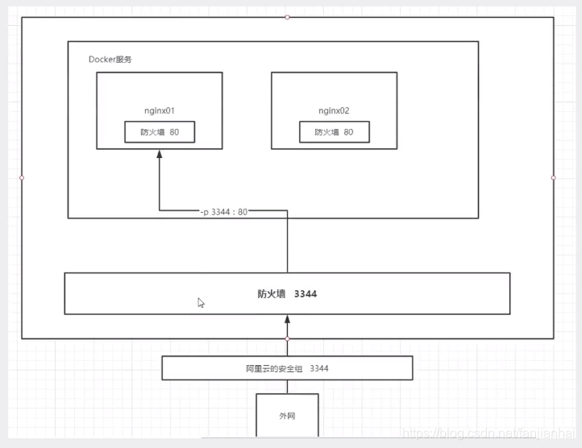

## 2. Docker安装Tomcat

```shell
# 官方的使用
docker run -it --rm tomcat:9.0

# 我们之前的启动都是后台的，停止了容器之后， 容器还是可以查到，docker run -it --rm 一般用来测试，用完就删

# 下载再启动
docker pull tomcat

# 启动运行
docker run -d -p 3344:8080 --name tomcat01 tomcat

# 测试访问没有问题

# 进入容器
docker exec -it tomcat01 /bin/bash

# 发现问题：1.linux命令少了， 2. webapps下内容为空，阿里云净吸纳过默认是最小的镜像，所有不必要的都剔除了，保证最小可运行环境即可
```

## 3. Docker部署es

```bash
# es 暴露的端口很多
# es 十分的耗内存
# es 的数据一般需要放置到安全目录！ 挂载
# --net somenetwork 网络配置

# 启动elasticsearch
docker run -d --name elasticsearch --net somenetwork -p 9200:9200 -p 9300:9300 -e "discovery.type=single-node" elasticsearch:7.6.2

[root@iZ2zeg4ytp0whqtmxbsqiiZ home]# docker run -d --name elasticsearch -p 9200:9200 -p 9300:9300 -e "discovery.type=single-node" elasticsearch:7.6.2
a920894a940b354d3c867079efada13d96cf9138712c76c8dea58fabd9c7e96f

# 启动了linux就卡主了，docker stats 查看cpu状态

# 测试一下es成功了
[root@iZ2zeg4ytp0whqtmxbsqiiZ home]# curl localhost:9200
{
  "name" : "a920894a940b",
  "cluster_name" : "docker-cluster",
  "cluster_uuid" : "bxE1TJMEThKgwmk7Aa3fHQ",
  "version" : {
    "number" : "7.6.2",
    "build_flavor" : "default",
    "build_type" : "docker",
    "build_hash" : "ef48eb35cf30adf4db14086e8aabd07ef6fb113f",
    "build_date" : "2020-03-26T06:34:37.794943Z",
    "build_snapshot" : false,
    "lucene_version" : "8.4.0",
    "minimum_wire_compatibility_version" : "6.8.0",
    "minimum_index_compatibility_version" : "6.0.0-beta1"
  },
  "tagline" : "You Know, for Search"
}


# 增加内存限制，修改配置文件 -e 环境配置修改
docker run -d --name elasticsearch -p 9200:9200 -p 9300:9300 -e "discovery.type=single-node" -e ES_JAVA_OPTS="-Xms64m -Xmx512m" elasticsearch:7.6.2
```

## 4.Docker可视化(不推荐使用)

> portainer是docker的可视化工具，可是尝试下载体验一下，平时不推荐使用。

- portainer（先用这个）

```bash
docker run -d -p 8088:9000 --restart=always -v /var/run/docker.sock:/var/run/docker.sock --privileged=true portainer/portainer

# 测试
[root@iZ2zeg4ytp0whqtmxbsqiiZ home]# curl localhost:8088
<!DOCTYPE html
><html lang="en" ng-app="portainer">

# 外网访问 http://ip:8088
```

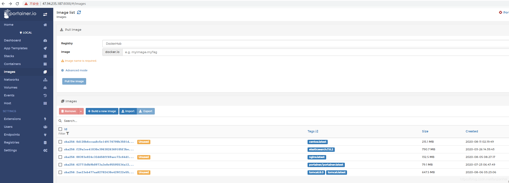

- Rancher(CI/CD再用)

  > Rancher也是docker的可视化工具，在未来做CI/CD (持 续集成/持续部署的时候会用)

# Docker原理

## 镜像原理之联合文件系统

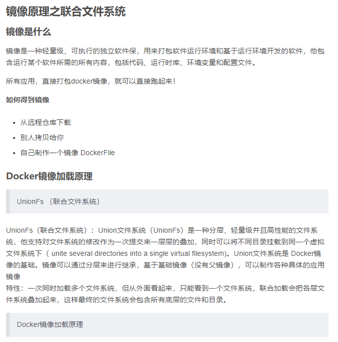

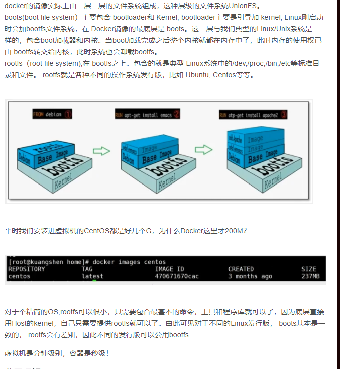

## 分层理解

> 分层的镜像

我们可以去下载一个镜像，注意观察下载的日志输出，可以看到是一层层的在下载

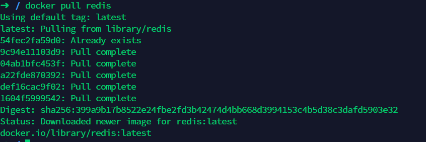

思考：为什么Docker镜像要采用这种分层的结构呢？

最大的好处，我觉得莫过于资源共享了！比如有多个镜像都从相同的Base镜像构建而来，那么宿主机只需在磁盘上保留一份base镜像，同时内存中也只需要加载一份base镜像，这样就可以为所有的容器服务了，而且镜像的每一层都可以被共享。

查看镜像分层的方式可以通过docker image inspect 命令

```bash
➜  / docker image inspect redis          
[
    {
        "Id": "sha256:f9b9909726890b00d2098081642edf32e5211b7ab53563929a47f250bcdc1d7c",
        "RepoTags": [
            "redis:latest"
        ],
        "RepoDigests": [
            "redis@sha256:399a9b17b8522e24fbe2fd3b42474d4bb668d3994153c4b5d38c3dafd5903e32"
        ],
        "Parent": "",
        "Comment": "",
        "Created": "2020-05-02T01:40:19.112130797Z",
        "Container": "d30c0bcea88561bc5139821227d2199bb027eeba9083f90c701891b4affce3bc",
        "ContainerConfig": {
            "Hostname": "d30c0bcea885",
            "Domainname": "",
            "User": "",
            "AttachStdin": false,
            "AttachStdout": false,
            "AttachStderr": false,
            "ExposedPorts": {
                "6379/tcp": {}
            },
            "Tty": false,
            "OpenStdin": false,
            "StdinOnce": false,
            "Env": [
                "PATH=/usr/local/sbin:/usr/local/bin:/usr/sbin:/usr/bin:/sbin:/bin",
                "GOSU_VERSION=1.12",
                "REDIS_VERSION=6.0.1",
                "REDIS_DOWNLOAD_URL=http://download.redis.io/releases/redis-6.0.1.tar.gz",
                "REDIS_DOWNLOAD_SHA=b8756e430479edc162ba9c44dc89ac394316cd482f2dc6b91bcd5fe12593f273"
            ],
            "Cmd": [
                "/bin/sh",
                "-c",
                "#(nop) ",
                "CMD [\"redis-server\"]"
            ],
            "ArgsEscaped": true,
            "Image": "sha256:704c602fa36f41a6d2d08e49bd2319ccd6915418f545c838416318b3c29811e0",
            "Volumes": {
                "/data": {}
            },
            "WorkingDir": "/data",
            "Entrypoint": [
                "docker-entrypoint.sh"
            ],
            "OnBuild": null,
            "Labels": {}
        },
        "DockerVersion": "18.09.7",
        "Author": "",
        "Config": {
            "Hostname": "",
            "Domainname": "",
            "User": "",
            "AttachStdin": false,
            "AttachStdout": false,
            "AttachStderr": false,
            "ExposedPorts": {
                "6379/tcp": {}
            },
            "Tty": false,
            "OpenStdin": false,
            "StdinOnce": false,
            "Env": [
                "PATH=/usr/local/sbin:/usr/local/bin:/usr/sbin:/usr/bin:/sbin:/bin",
                "GOSU_VERSION=1.12",
                "REDIS_VERSION=6.0.1",
                "REDIS_DOWNLOAD_URL=http://download.redis.io/releases/redis-6.0.1.tar.gz",
                "REDIS_DOWNLOAD_SHA=b8756e430479edc162ba9c44dc89ac394316cd482f2dc6b91bcd5fe12593f273"
            ],
            "Cmd": [
                "redis-server"
            ],
            "ArgsEscaped": true,
            "Image": "sha256:704c602fa36f41a6d2d08e49bd2319ccd6915418f545c838416318b3c29811e0",
            "Volumes": {
                "/data": {}
            },
            "WorkingDir": "/data",
            "Entrypoint": [
                "docker-entrypoint.sh"
            ],
            "OnBuild": null,
            "Labels": null
        },
        "Architecture": "amd64",
        "Os": "linux",
        "Size": 104101893,
        "VirtualSize": 104101893,
        "GraphDriver": {
            "Data": {
                "LowerDir": "/var/lib/docker/overlay2/adea96bbe6518657dc2d4c6331a807eea70567144abda686588ef6c3bb0d778a/diff:/var/lib/docker/overlay2/66abd822d34dc6446e6bebe73721dfd1dc497c2c8063c43ffb8cf8140e2caeb6/diff:/var/lib/docker/overlay2/d19d24fb6a24801c5fa639c1d979d19f3f17196b3c6dde96d3b69cd2ad07ba8a/diff:/var/lib/docker/overlay2/a1e95aae5e09ca6df4f71b542c86c677b884f5280c1d3e3a1111b13644b221f9/diff:/var/lib/docker/overlay2/cd90f7a9cd0227c1db29ea992e889e4e6af057d9ab2835dd18a67a019c18bab4/diff",
                "MergedDir": "/var/lib/docker/overlay2/afa1de233453b60686a3847854624ef191d7bc317fb01e015b4f06671139fb11/merged",
                "UpperDir": "/var/lib/docker/overlay2/afa1de233453b60686a3847854624ef191d7bc317fb01e015b4f06671139fb11/diff",
                "WorkDir": "/var/lib/docker/overlay2/afa1de233453b60686a3847854624ef191d7bc317fb01e015b4f06671139fb11/work"
            },
            "Name": "overlay2"
        },
        "RootFS": {
            "Type": "layers",
            "Layers": [
                "sha256:c2adabaecedbda0af72b153c6499a0555f3a769d52370469d8f6bd6328af9b13",
                "sha256:744315296a49be711c312dfa1b3a80516116f78c437367ff0bc678da1123e990",
                "sha256:379ef5d5cb402a5538413d7285b21aa58a560882d15f1f553f7868dc4b66afa8",
                "sha256:d00fd460effb7b066760f97447c071492d471c5176d05b8af1751806a1f905f8",
                "sha256:4d0c196331523cfed7bf5bafd616ecb3855256838d850b6f3d5fba911f6c4123",
                "sha256:98b4a6242af2536383425ba2d6de033a510e049d9ca07ff501b95052da76e894"
            ]
        },
        "Metadata": {
            "LastTagTime": "0001-01-01T00:00:00Z"
        }
    }
]
```

理解：

所有的 Docker镜像都起始于一个基础镜像层，当进行修改或追加新的内容时，就会在当前镜像层之上，创建新的镜像层。

举一个简单的例子，假如基于 Ubuntu Linux16.04创建一个新的镜像，这就是新镜像的第一层；如果在该镜像中添加 Python包，
就会在基础镜像层之上创建第二个镜像层；如果继续添加一个安全补丁，就会创健第三个镜像层该像当前已经包含3个镜像层，如下图所示（这只是一个用于演示的很简单的例子）。

在添加额外的镜像层的同时，镜像始终保持是当前所有镜像的组合，理解这一点.

 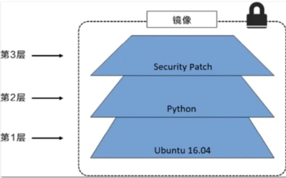

在添加额外的镜像层的同时，镜像始终保持是当前所有镜像的组合，理解这一点非常重要。下图中举了一个简单的例子，每个镜像层包含3个文件，而镜像包含了来自两个镜像层的6个文件。

 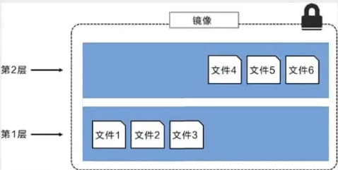

 

上图中的镜像层跟之前图中的略有区別，主要目的是便于展示文件
下图中展示了一个稍微复杂的三层镜像，在外部看来整个镜像只有6个文件，这是因为最上层中的文件7是文件5的一个更新版。

 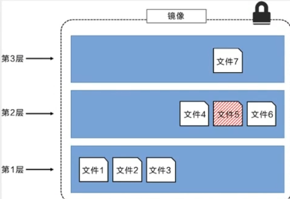

这种情況下，上层镜像层中的文件覆盖了底层镜像层中的文件。这样就使得文件的更新版本作为一个新镜像层添加到镜像当中

Docker通过存储引擎（新版本采用快照机制）的方式来实现镜像层堆栈，并保证多镜像层对外展示为统一的文件系统

Linux上可用的存储引撃有AUFS、 Overlay2、 Device Mapper、Btrfs以及ZFS。顾名思义，每种存储引擎都基于 Linux中对应的
件系统或者块设备技术，井且每种存储引擎都有其独有的性能特点。

Docker在 Windows上仅支持 windowsfilter 一种存储引擎，该引擎基于NTFS文件系统之上实现了分层和CoW [1]。

下图展示了与系统显示相同的三层镜像。所有镜像层堆并合井，对外提供统一的视图。
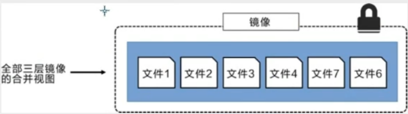

> 特点

Docker 镜像都是只读的，当容器启动时，一个新的可写层加载到镜像的顶部！

这一层就是我们通常说的容器层，容器之下的都叫镜像层！


## commit镜像

```bash
docker commit 提交容器成为一个新的副本

# 命令和git原理类似
docker commit -m="描述信息" -a="作者" 容器id 目标镜像名:[版本TAG]
```

实战测试

```bash
# 1、启动一个默认的tomcat
## 注意事项：在这一步不要使用 /bin/bash参数。不然tomcat不会跑起来
[root@iz2zeak7sgj6i7hrb2g862z ~]# docker run -d -p 8080:8080 tomcat
de57d0ace5716d27d0e3a7341503d07ed4695ffc266aef78e0a855b270c4064e

# 2、发现这个默认的tomcat 是没有webapps应用，官方的镜像默认webapps下面是没有文件的！
#docker exec -it 容器id /bin/bash
[root@iz2zeak7sgj6i7hrb2g862z ~]# docker exec -it de57d0ace571 /bin/bash
root@de57d0ace571:/usr/local/tomcat# 

# 3、从webapps.dist拷贝文件进去webapp
root@de57d0ace571:/usr/local/tomcat# cp -r webapps.dist/* webapps
root@de57d0ace571:/usr/local/tomcat# cd webapps
root@de57d0ace571:/usr/local/tomcat/webapps# ls
ROOT  docs  examples  host-manager  manager

# 4、将操作过的容器通过commit提交为一个镜像！我们以后就使用我们修改过的镜像即可，而不需要每次都重新拷贝webapps.dist下的文件到webapps了，这就是我们自己的一个修改的镜像。
docker commit -m="描述信息" -a="作者" 容器id 目标镜像名:[TAG]
docker commit -a="kuangshen" -m="add webapps app" 容器id tomcat02:1.0

[root@iz2zeak7sgj6i7hrb2g862z ~]# docker commit -a="csp提交的" -m="add webapps app" de57d0ace571 tomcat02.1.0
sha256:d5f28a0bb0d0b6522fdcb56f100d11298377b2b7c51b9a9e621379b01cf1487e

[root@iz2zeak7sgj6i7hrb2g862z ~]# docker images
REPOSITORY            TAG                 IMAGE ID            CREATED             SIZE
tomcat02.1.0          latest              d5f28a0bb0d0        14 seconds ago      652MB
tomcat                latest              1b6b1fe7261e        5 days ago          647MB
nginx                 latest              9beeba249f3e        5 days ago          127MB
mysql                 5.7                 b84d68d0a7db        5 days ago          448MB
elasticsearch         7.6.2               f29a1ee41030        8 weeks ago         791MB
portainer/portainer   latest              2869fc110bf7        2 months ago        78.6MB
centos                latest              470671670cac        4 months ago        237MB
hello-world           latest              bf756fb1ae65        4 months ago        13.3kB
```


 

 

# 容器数据卷

## 1. docker的理解回顾

将应用和环境打包成一个镜像！

数据？如果数据都在容器中，那么我们容器删除，数据就会丢失！==需求：数据可以持久化==

MySQL，容器删了，删库跑路！==需求：MySQL数据可以存储在本地！==

容器之间可以有一个数据共享技术！Docker容器中产生的数据，同步到本地！

这就是卷技术，目录的挂载，将我们容器内的目录挂载到linux目录上面！

**总结： **容器的持久化和同步操作！容器间数据也是可以共享的！

## 2. 使用数据卷

> 方式一：直接使用命令来挂载 -v

```shell
docker run -it -v 主机目录：容器目录

#主机中若不存在/home/ceshi目录，将会新建该目录
[root@iZ2zeg4ytp0whqtmxbsqiiZ home]# docker run -it -v /home/ceshi:/home centos /bin/bash
```


**测试文件的同步**（在主机上改动，观察容器变化）


**再来测试**（测试通过）

1. 停止容器
2. 主机上修改文件
3. 启动容器
4. 容器内的数据依旧是同步的！

## 3. 实战：安装MySQL

思考：MySQL的数据持久化的问题！

```shell
# 获取镜像
[root@iZ2zeg4ytp0whqtmxbsqiiZ home]# docker pull mysql:5.7

# 运行容器， 需要做数据挂载！ # 安装启动mysql，需要配置密码（注意）
# 官方测试， docker run --name some-mysql -e MYSQL_ROOT_PASSWORD=my-secret-pw -d mysql:tag

# 启动我们的
-d      # 后台运行
-p      # 端口隐射
-v      # 卷挂载
-e      # 环境配置
--name  # 容器的名字
[root@iZ2zeg4ytp0whqtmxbsqiiZ home]# docker run -d -p 3344:3306 -v /home/mysql/conf:/etc/mysql/conf.d -v /home/mysql/data:/var/lib/mysql -e MYSQL_ROOT_PASSWORD=123456 --name mysql01 mysql:8.0
9552bf4eb2b69a2ccd344b5ba5965da4d97b19f2e1a78626ac1f2f8d276fc2ba

# 启动成功之后，我们在本地使用navicat链接测试一下
# navicat链接到服务器的3344 --- 3344 和 容器的3306映射，这个时候我们就可以连接上mysql喽！

# 在本地测试创建一个数据库，查看下我们的路径是否ok！
```

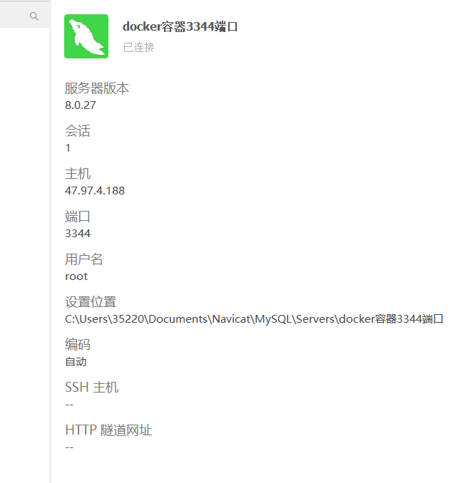

在本地新建test数据库，能够看到数据库test文件夹被同步到服务器和容器内部 

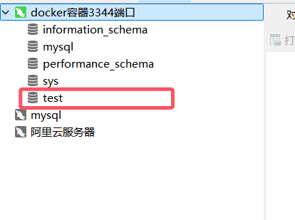


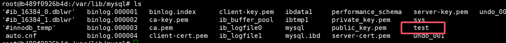

## 4. 匿名和具名挂载

```shell
# 匿名挂载
-v 容器内路径
docker run -d -P --name nginx01 -v /etc/nginx nginx     # -P 随机指定端口

# 查看所有volume的情况
[root@iZ2zeg4ytp0whqtmxbsqiiZ ~]# docker volume ls
DRIVER              VOLUME NAME
local               561b81a03506f31d45ada3f9fb7bd8d7c9b5e0f826c877221a17e45d4c80e096
local               36083fb6ca083005094cbd49572a0bffeec6daadfbc5ce772909bb00be760882

# 这里发现，这种情况就是匿名挂载，我们在-v 后面只写了容器内的路径，没有写容器外的路径！

# 具名挂载
[root@iZ2zeg4ytp0whqtmxbsqiiZ ~]# docker run -d -P --name nginx02 -v juming-nginx:/etc/nginx nginx
26da1ec7d4994c76e80134d24d82403a254a4e1d84ec65d5f286000105c3da17

[root@iZ2zeg4ytp0whqtmxbsqiiZ ~]# docker volume ls
DRIVER              VOLUME NAME
local               561b81a03506f31d45ada3f9fb7bd8d7c9b5e0f826c877221a17e45d4c80e096
local               36083fb6ca083005094cbd49572a0bffeec6daadfbc5ce772909bb00be760882
local               juming-nginx

# 通过-v 卷名：容器内的路径
# 查看一下这个卷
# docker volume inspect juming-nginx

[root@iZ2zeg4ytp0whqtmxbsqiiZ ~]# docker volume inspect juming-nginx
[
  {
      "CreatedAt": "2020-08-12T18:15:21+08:00",
      "Driver": "local",
      "Labels": null,
      "Mountpoint": "/var/lib/docker/volumes/juming-nginx/_data",
      "Name": "juming-nginx",
      "Options": null,
      "Scope": "local"
  }
]
```

所有docker容器内的卷，没有指定目录的情况下都是在`/var/lib/docker/volumes/xxxxx/_data`

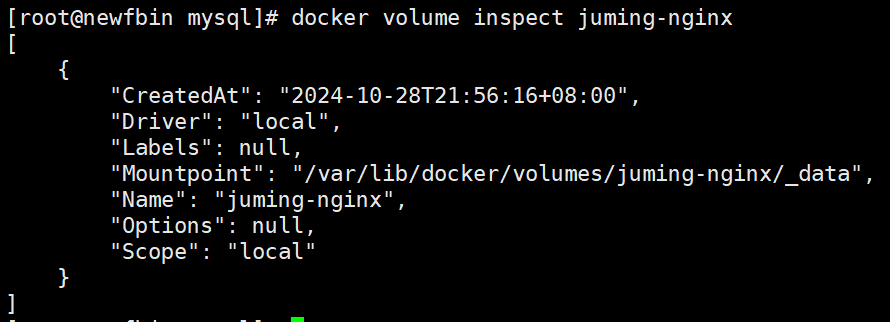

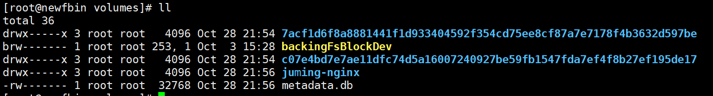

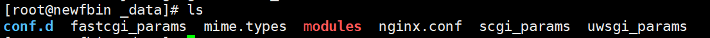

我们通过具名挂载可以方便的找到我们的一个卷，大多数情况下使用的是`具名挂载`

```shell
# 如何确定是具名挂载还是匿名挂载，还是指定路径挂载！
-v  容器内路径                   # 匿名挂载
-v  卷名:容器内路径               # 具名挂载
-v /主机路径:容器内路径            # 指定路径挂载
```

> 关于指定路径挂载：
>
> 如果使用指定路径挂载，使用docker volume ls命令后不会显示被指定路径挂载的卷。
> 指定路径挂载这种方式不会创建 Docker 中的命名卷，只是绑定了宿主机上的一个目录。
> 但是被指定路径挂载的卷仍然可以通过docker inspect 容器名 查看容器的挂载情况

拓展

```shell
# 通过 -v 容器内容路径 ro rw 改变读写权限
ro  readonly    # 只读
rw  readwrite   # 可读可写

docker run -d -P --name nginx02 -v juming-nginx:/etc/nginx:ro nginx
docker run -d -P --name nginx02 -v juming-nginx:/etc/nginx:rw nginx

# ro 只要看到ro就说明这个路径只能通过宿主机来操作，容器内容无法操作
# rw 默认权限是rw
```

## 5.数据卷容器

多个mysql同步数据！


```
# 启动3个容器，通过我们刚才自己写的镜像启动
```

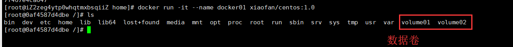

> docker 02的volume01和volume02将自动挂载到docker01的两个对应的卷上。
>
> 其它目录不会和docker01的同步

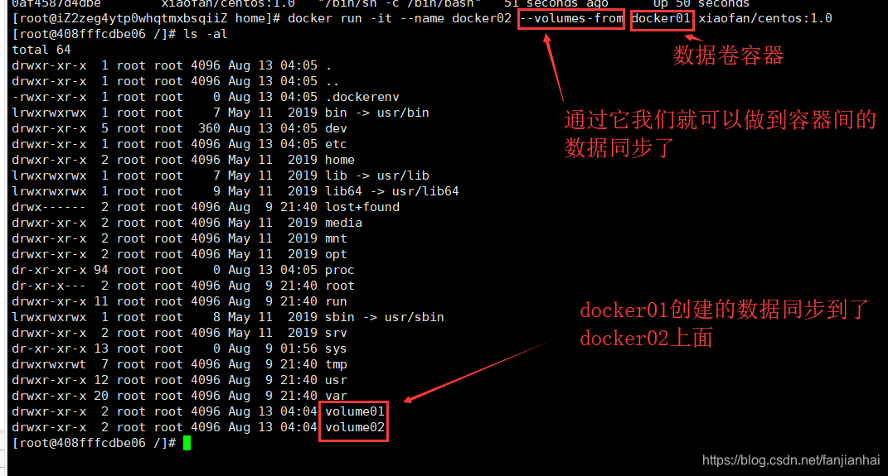

多个mysql实现数据共享

```shell
[root@iZ2zeg4ytp0whqtmxbsqiiZ home]# docker run -d -p 3344:3306 -v /etc/mysql/conf.d -v /var/lib/mysql -e MYSQL_ROOT_PASSWORD=123456 --name mysql01 mysql:8.0

[root@iZ2zeg4ytp0whqtmxbsqiiZ home]# docker run -d -p 3344:3306 -e MYSQL_ROOT_PASSWORD=123456 --name mysql02 --volumes-from mysql01 mysql:8.0

# mysql02的/etc/mysql/conf.d 和 /var/lib/mysql 两个目录将自动挂载到mysql01两个对应的卷上
```

**结论**

容器之间配置信息的传递， 数据卷容器的生命周期一直持续到没有容器使用为止。

但是一旦你持久化到了本地，这个时候，本地的数据是不会删除的！

# DockerFile

## 初识DockerFile

DockerFile就是用来构建docker镜像的构建文件！命令脚本！先体验一下！

通过这个脚本可以生成镜像，镜像是一层一层的。脚本中一个个的命令，每个命令都是一层！

```dockerfile
# 创建一个dockerfile文件， 名字可以随机，建议Dockerfile
# 文件的内容： 指令（大写） 参数

FROM centos

VOLUME ["volume01", "volume02"] #匿名挂载

CMD echo "----end----"
CMD /bin/bash

# 这里的每一个命令都是镜像的一层！
```

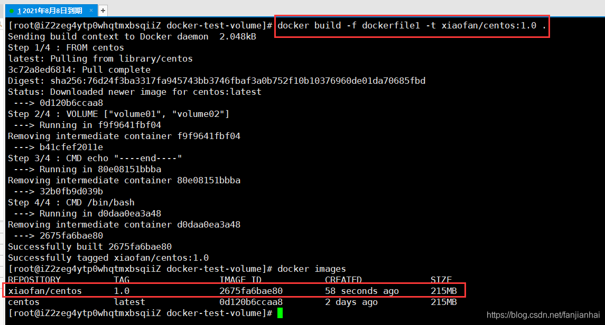

```
# 启动自己的容器
```

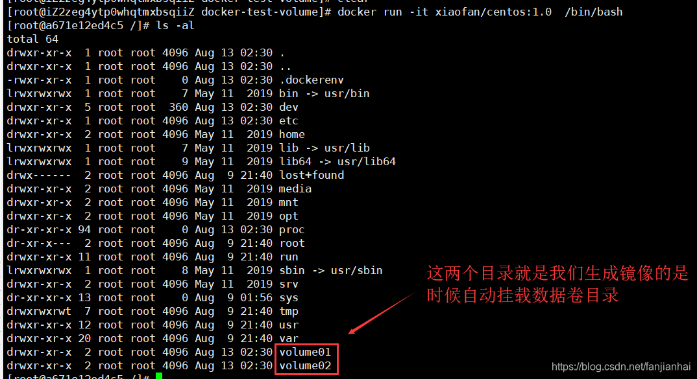

这个卷和外部一定有一个同步的目录！

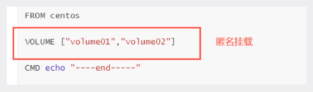

```
docker inspect 容器id
```

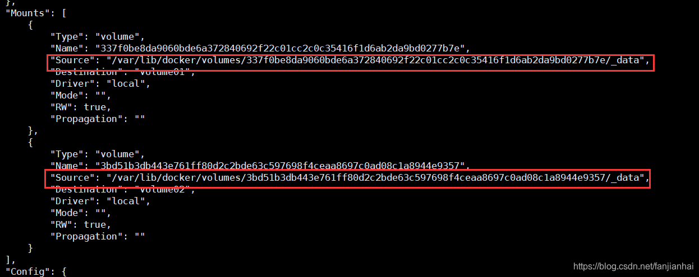

测试一下刚才的文件是否同步到主机上了！

这种方式我们未来使用的十分多， 因为我们通常会构建自己的镜像！

假设构建镜像时候没有挂载卷，要手动镜像挂载 -v 卷名:容器内路径！

## DockerFile

dockerFile是用来构建docker镜像的文件！命令参数脚本！

```shell
构建步骤
1. 编写一个dockerFile文件
2.docker build 构建成为一个镜像
3. docker run 运行镜像
4. docker push 发布镜像（DockerHub、阿里云镜像）
```

查看一下官方是怎么做的？

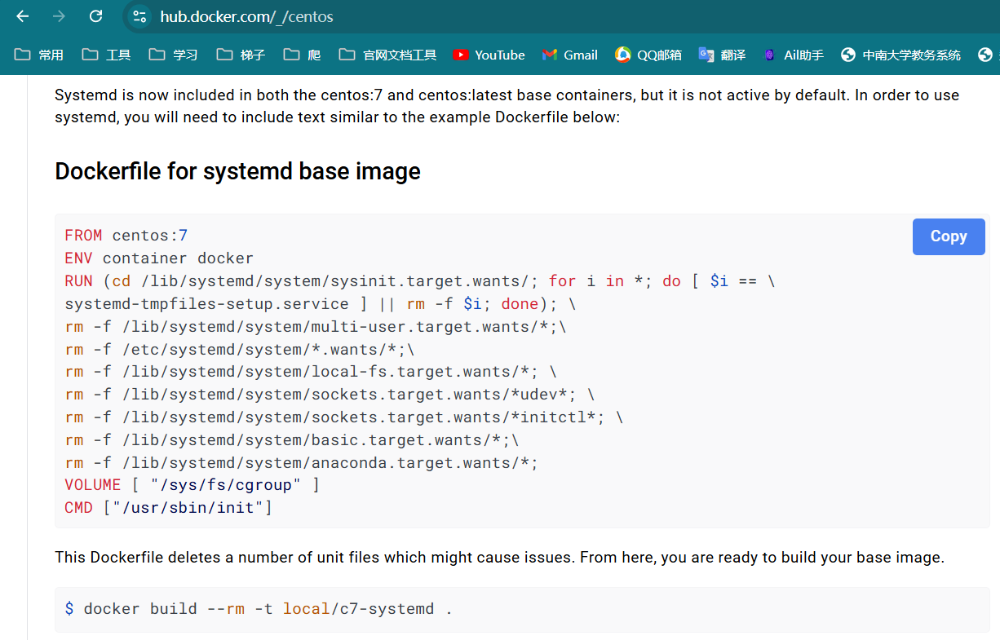

很多官方镜像都像是基础包，很多功能都不具备，我们通常会自己搭建自己的镜像！

官方既然可以制作镜像，能我们一样可以！

## DockerFile的构建过程

**基础知识：**

1. 每个保留关键字（指令）都是必须大写字母
2. 执行从上到下顺序执行
3. `#` 表示注释
4. 每个指令都会创建提交一个新的镜像层，并提交！


dockerFile是面向开发的， 我们以后要发布项目， 做镜像， 就需要编写dockefile文件， 这个文件十分简单！

Docker镜像逐渐成为企业的交互标准，必须要掌握！

步骤：开发，部署， 运维..... 缺一不可！

**DockerFile**： 构建文件， 定义了一切的步骤，源代码

**DockerImages**： 通过DockerFile构建生成的镜像， 最终发布和运行的产品！

**Docker容器**：容器就是镜像运行起来提供服务器

## DockerFile指令说明


```dockerfile
FROM            # 基础镜像，一切从这里开始构建
MAINTAINER      # 镜像是谁写的， 姓名+邮箱
RUN             # 镜像构建的时候需要运行的命令
ADD             # 步骤， tomcat镜像， 这个tomcat压缩包！添加内容
WORKDIR         # 镜像的工作目录
VOLUME          # 挂载的目录
EXPOSE          # 保留端口配置
CMD             # 指定这个容器启动的时候要运行的命令，只有最后一个会生效可被替代
ENTRYPOINT      # 指定这个容器启动的时候要运行的命令， 可以追加命令
ONBUILD         # 当构建一个被继承DockerFile 这个时候就会运行 ONBUILD 的指令，触发指令
COPY            # 类似ADD, 将我们文件拷贝到镜像中
ENV             # 构建的时候设置环境变量！
```

## 创建一个自己的centos

```dockerfile
# 1. 编写Dockerfile的文件
[root@iZ2zeg4ytp0whqtmxbsqiiZ dockerfile]# cat mydockerfile-centos 
FROM centos
MAINTAINER xiaofan<594042358@qq.com>

ENV MYPATH /usr/local
WORKDIR $MYPATH     # 镜像的工作目录

# 使用yum安装东西之前，先把yum源更换为阿里云
RUN cd /etc/yum.repos.d/ && mkdir backup && mv *repo backup/
RUN curl -o /etc/yum.repos.d/CentOS-Base.repo http://mirrors.aliyun.com/repo/Centos-8.repo
RUN sed -i -e "s|mirrors.cloud.aliyuncs.com|mirrors.aliyun.com|g " /etc/yum.repos.d/CentOS-*
RUN sed -i -e "s|releasever|releasever-stream|g" /etc/yum.repos.d/CentOS-*
RUN yum clean all && yum makecache
# 使用yum安装工具
RUN yum -y install vim
RUN yum -y install net-tools

EXPOSE 80

CMD echo $MYPATH
CMD echo "---end---"
CMD /bin/bash

# 2. 通过这个文件构建镜像
# 命令 docker build -f dockerfile文件路径 -t 镜像名:[tag] .   （ .表示当前目录 ）

[root@iZ2zeg4ytp0whqtmxbsqiiZ dockerfile]# docker build -f mydockerfile-centos -t mycentos:0.1 .

Successfully built d2d9f0ea8cb2
Successfully tagged mycentos:0.1
```


我们可以列出本地进行的变更历史

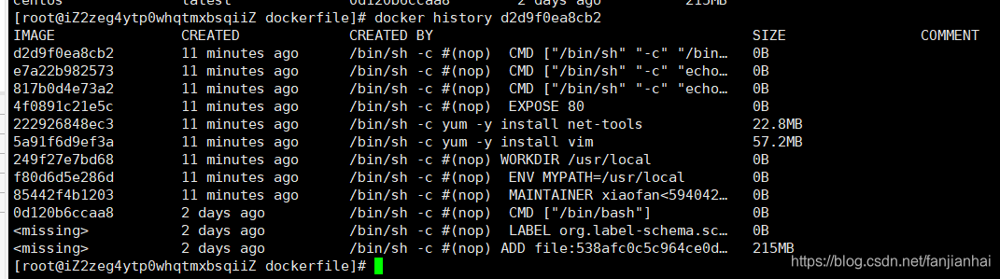

## CMD 和ENTRYPOINT区别

```dockerfile
CMD         # 指定这个容器启动的时候要运行的命令，只有最后一个会生效可被替代
ENTRYPOINT      # 指定这个容器启动的时候要运行的命令， 可以追加命令
```

### 测试CMD

```dockerfile
# 1. 编写dockerfile文件
[root@iZ2zeg4ytp0whqtmxbsqiiZ dockerfile]# vim dockerfile-cmd-test 
FROM centos
CMD ["ls", "-a"]

# 2. 构建镜像
[root@iZ2zeg4ytp0whqtmxbsqiiZ dockerfile]# docker build -f dockerfile-cmd-test -t cmdtest .

# 3. run运行， 发现我们的ls -a 命令生效
[root@iZ2zeg4ytp0whqtmxbsqiiZ dockerfile]# docker run ebe6a52bb125
.
..
.dockerenv
bin
dev
etc
home
lib
lib64

# 想追加一个命令 -l 变成 ls -al
[root@iZ2zeg4ytp0whqtmxbsqiiZ dockerfile]# docker run ebe6a52bb125 -l
docker: Error response from daemon: OCI runtime create failed: container_linux.go:349: starting container process caused "exec: \"-l\": executable file not found in $PATH": unknown.
[root@iZ2zeg4ytp0whqtmxbsqiiZ dockerfile]# docker run ebe6a52bb125 ls -l

# cmd的情况下 -l替换了CMD["ls", "-a"]命令， -l不是命令，所以报错了
```

### 测试ENTRYPOINT

```dockerfile
# 1. 编写dockerfile文件
[root@iZ2zeg4ytp0whqtmxbsqiiZ dockerfile]# vim dockerfile-entrypoint-test 
FROM centos
ENTRYPOINT ["ls", "-a"]

# 2. 构建文件
[root@iZ2zeg4ytp0whqtmxbsqiiZ dockerfile]# docker build -f dockerfile-entrypoint-test -t entrypoint-test .

# 3. run运行 发现我们的ls -a 命令同样生效
[root@iZ2zeg4ytp0whqtmxbsqiiZ dockerfile]# docker run entrypoint-test
.
..
.dockerenv
bin
dev
etc
home
lib

# 4. 我们的追加命令， 是直接拼接到ENTRYPOINT命令的后面的！
[root@iZ2zeg4ytp0whqtmxbsqiiZ dockerfile]# docker run entrypoint-test -l
total 56
drwxr-xr-x  1 root root 4096 Aug 13 07:52 .
drwxr-xr-x  1 root root 4096 Aug 13 07:52 ..
-rwxr-xr-x  1 root root    0 Aug 13 07:52 .dockerenv
lrwxrwxrwx  1 root root    7 May 11  2019 bin -> usr/bin
drwxr-xr-x  5 root root  340 Aug 13 07:52 dev
drwxr-xr-x  1 root root 4096 Aug 13 07:52 etc
drwxr-xr-x  2 root root 4096 May 11  2019 home
lrwxrwxrwx  1 root root    7 May 11  2019 lib -> usr/lib
lrwxrwxrwx  1 root root    9 May 11  2019 lib64 -> usr/lib64
drwx------  2 root root 4096 Aug  9 21:40 lost+found
```


# Dockerfile制作tomcat镜像

## Dockerfile制作tomcat镜像

1. 准备镜像文件 tomcat压缩包，jdk的压缩包！

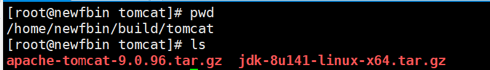

2. 编写Dockerfile文件，官方命名`Dockerfile`, build会自动寻找这个文件，就不需要-f指定了！

```dockerfile
[root@iZ2zeg4ytp0whqtmxbsqiiZ tomcat]# cat Dockerfile 
FROM centos

MAINTAINER newfbin<fubinniu@gmail.com>

# COPY readme.txt /usr/local/readme.txt

ADD jdk-8u141-linux-x64.tar.gz /usr/local
ADD apache-tomcat-9.0.96.tar.gz /usr/local

RUN cd /etc/yum.repos.d/ && mkdir backup && mv *repo backup/
RUN curl -o /etc/yum.repos.d/CentOS-Base.repo http://mirrors.aliyun.com/repo/Centos-8.repo
RUN sed -i -e "s|mirrors.cloud.aliyuncs.com|mirrors.aliyun.com|g " /etc/yum.repos.d/CentOS-*
RUN sed -i -e "s|releasever|releasever-stream|g" /etc/yum.repos.d/CentOS-*
RUN yum clean all && yum makecache
RUN yum -y install vim
RUN yum -y install net-tools

ENV MYPATH /usr/local
WORKDIR $MYPATH

ENV JAVA_HOME /usr/local/jdk1.8.0_141
ENV CLASSPATH $JAVA_HOME/lib/dt.jar:$JAVA_HOME/lib/tools.jar
ENV CATALINA_HOME /usr/local/apache-tomcat-9.0.96
ENV CATALINA_BASH /usr/local/apache-tomcat-9.0.96
ENV PATH $PATH:$JAVA_HOME/bin:$CATALINA_HOME/lib:$CATALINA_HOME/bin

EXPOSE 8080

CMD /usr/local/apache-tomcat-9.0.96/bin/startup.sh && tail -F /usr/local/apache-tomcat-9.0.96/bin/logs/catalina.out
```

3. 构建镜像

```shell
# docker build -t diytomcat .
```

4. 启动镜像

```bash
#  docker run -d -p 9090:8080 --name newfbintomcat01 -v /home/newfbin/build/tomcat/test:/usr/local/apache-tomcat-9.0.96/webapps/test -v /home/newfbin/build/tomcat/tomcatlogs/:/usr/local/apache-tomcat-9.0.96/logs diytomcat
```

5. 访问测试

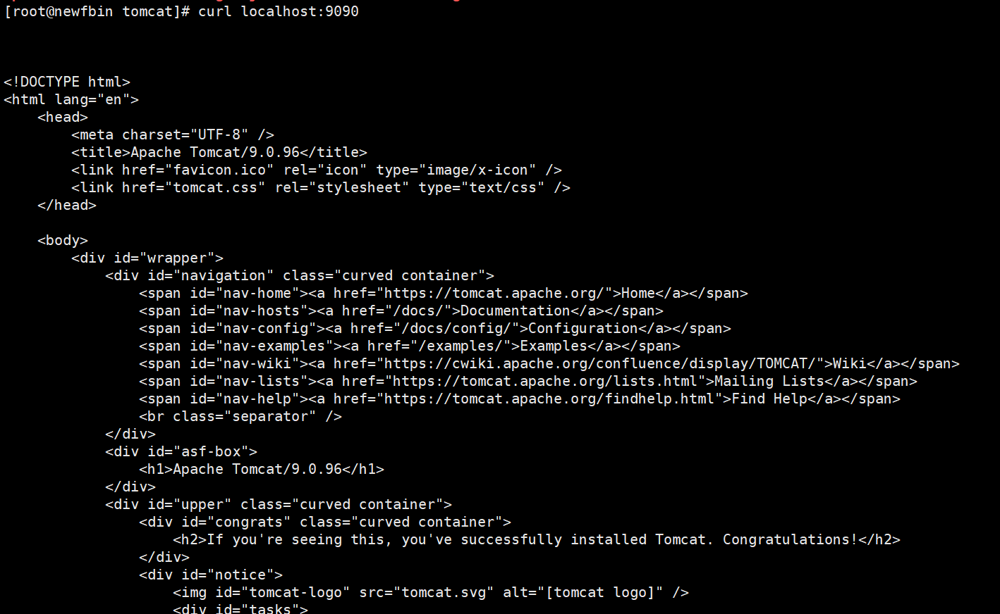

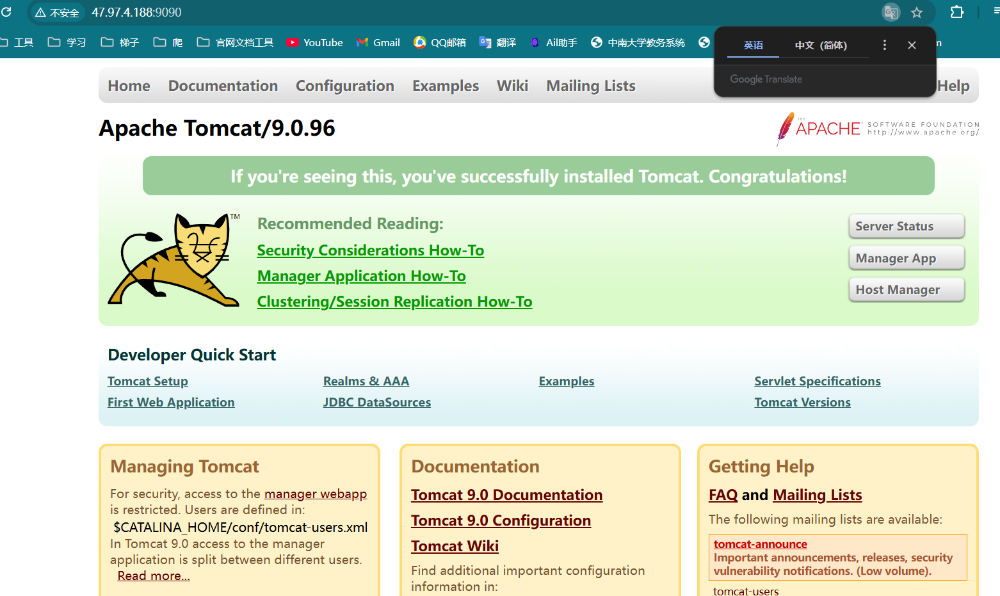

6. 发布项目（由于做了卷挂载， 我们直接在本地编写项目就可以发布了）

**在本地编写web.xml和index.jsp进行测试**


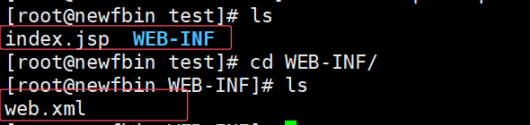

编写web.xml

```xml
<?xml version="1.0" encoding="UTF-8"?>
<web-app version="2.4" 
    xmlns="http://java.sun.com/xml/ns/j2ee" 
    xmlns:xsi="http://www.w3.org/2001/XMLSchema-instance"
    xsi:schemaLocation="http://java.sun.com/xml/ns/j2ee 
        http://java.sun.com/xml/ns/j2ee/web-app_2_4.xsd">
        
</web-app>
```

编写index.jsp

```jsp
<%@ page language="java" contentType="text/html; charset=UTF-8"
    pageEncoding="UTF-8"%>
<!DOCTYPE html>
<html>
<head>
<meta charset="utf-8">
<title>hello. xiaofan</title>
</head>
<body>
Hello World!<br/>
<%
System.out.println("-----my test web logs------");
%>
</body>
</html>
```

发现：项目部署成功， 可以直接访问ok！

我们以后开发的步骤：需要掌握Dockerfile的编写！ 我们之后的一切都是使用docker进行来发布运行的！


## 发布自己的镜像到Docker Hub

> Docker Hub

1. [地址](https://hub.docker.com/) 注册自己的账号！

   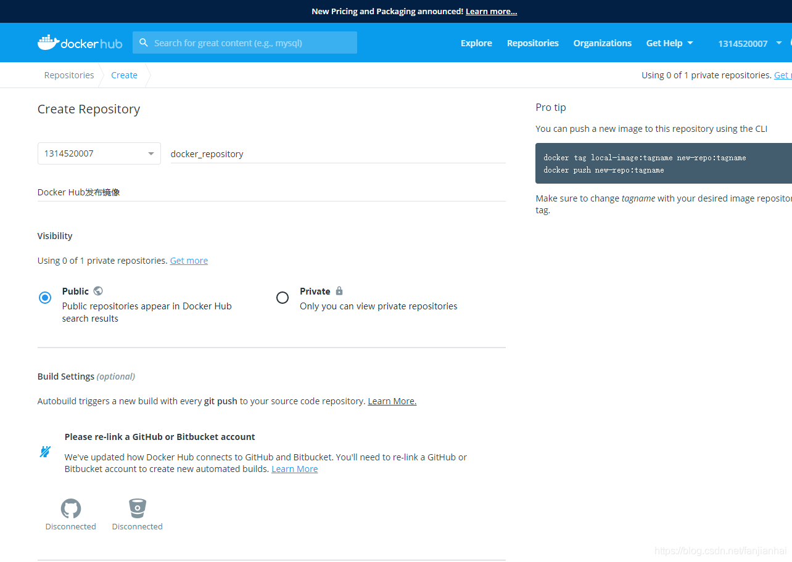

2. 确定这个账号可以登录

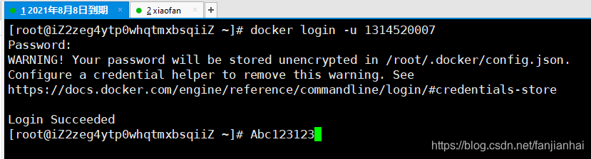

1. 在我们的服务器上提交自己的镜像

```shell
# push到我们的服务器上
[root@iZ2zeg4ytp0whqtmxbsqiiZ ~]# docker push diytomcat
The push refers to repository [docker.io/library/diytomcat]
2eaca873a720: Preparing 
1b38cc4085a8: Preparing 
088ebb58d264: Preparing 
c06785a2723d: Preparing 
291f6e44771a: Preparing 
denied: requested access to the resource is denied  # 拒绝

# push镜像的问题？
The push refers to repository [docker.io/1314520007/diytomcat]
An image does not exist locally with the tag: 1314520007/diytomcat

# 解决，增加一个tag
docker tag diytomcat newfbin/diytomcat:1.0
```

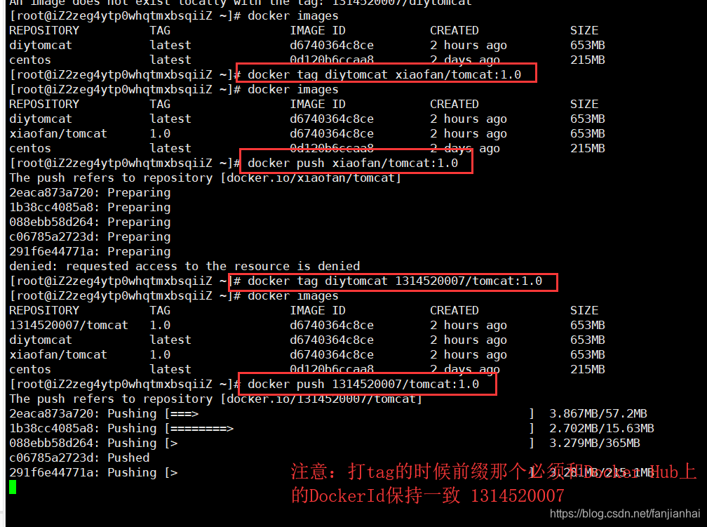

自制的镜像被上传到docker hub：

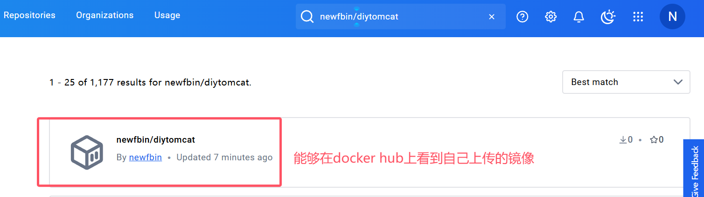

## 发布到阿里云镜像服务上

1. 登录阿里云
2. 找到容器镜像服务
3. 创建命名空间 


4. 创建容器镜像

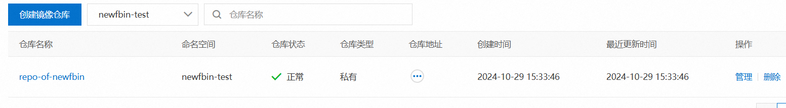

5. 点击仓库名称，参考官方文档即可

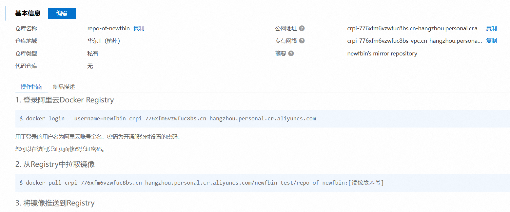

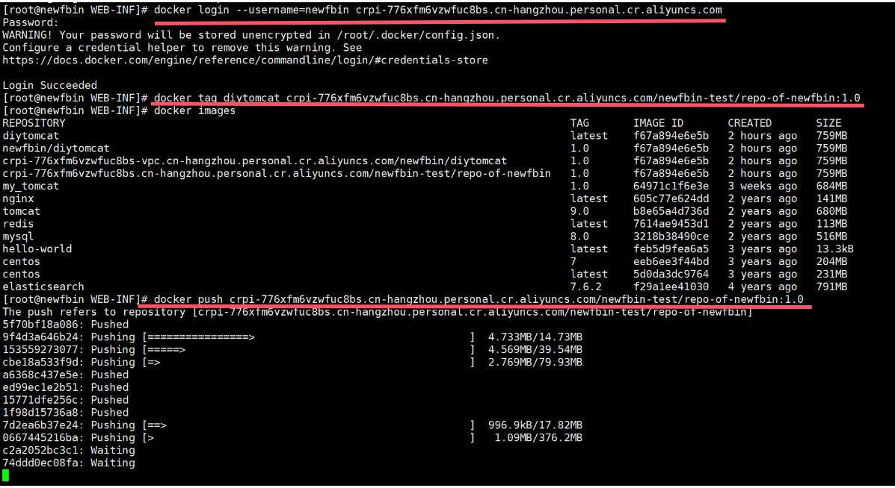

阿里云仓库镜像信息：


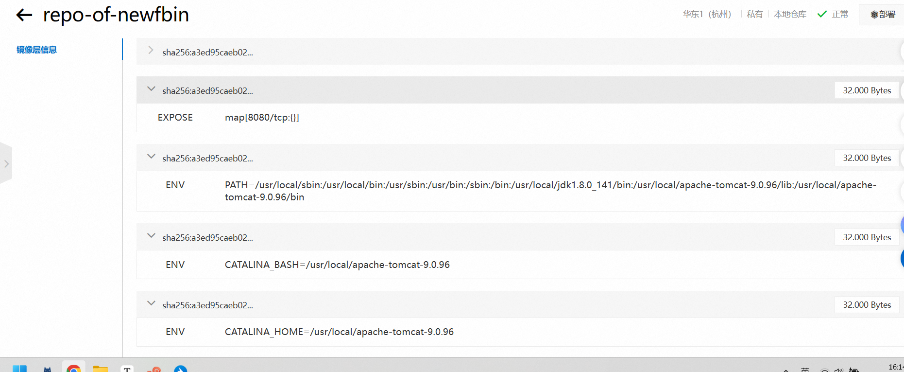

## 总结


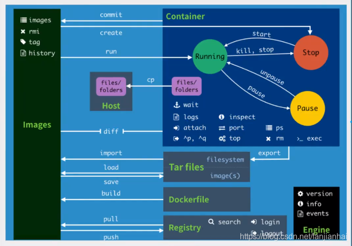

# Docker网络

> 相关命令： docker network

## 理解Docker0

> 测试

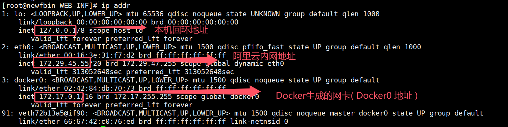

三个网络

```shell
# 问题： docker是如何处理容器网络访问的？

# [root@iZ2zeg4ytp0whqtmxbsqiiZ ~]# docker run -d -P --name tomcat01 tomcat

# 查看容器内部的网络地址 ip addr
[root@iZ2zeg4ytp0whqtmxbsqiiZ ~]# docker exec -it tomcat01 ip addr， 发现容器启动的时候得到一个eth0@if115 ip地址，docker分配的！
1: lo: <LOOPBACK,UP,LOWER_UP> mtu 65536 qdisc noqueue state UNKNOWN group default qlen 1000
    link/loopback 00:00:00:00:00:00 brd 00:00:00:00:00:00
    inet 127.0.0.1/8 scope host lo
       valid_lft forever preferred_lft forever
114: eth0@if115: <BROADCAST,MULTICAST,UP,LOWER_UP> mtu 1500 qdisc noqueue state UP group default 
    link/ether 02:42:ac:11:00:02 brd ff:ff:ff:ff:ff:ff link-netnsid 0
    inet 172.17.0.2/16 brd 172.17.255.255 scope global eth0
       valid_lft forever preferred_lft forever

# 思考： linux 能不能ping通容器？
[root@iZ2zeg4ytp0whqtmxbsqiiZ ~]# ping 172.17.0.2
PING 172.17.0.2 (172.17.0.2) 56(84) bytes of data.
64 bytes from 172.17.0.2: icmp_seq=1 ttl=64 time=0.077 ms
64 bytes from 172.17.0.2: icmp_seq=2 ttl=64 time=0.069 ms
64 bytes from 172.17.0.2: icmp_seq=3 ttl=64 time=0.075 ms

# linux 可以 ping 通docker容器内部！
```

> 原理

1. 我们没启动一个docker容器， docker就会给docker容器分配一个ip， 我们只要安装了docker，就会有一个网卡 docker0桥接模式，使用的技术是veth-pair技术！

再次测试 ip addr

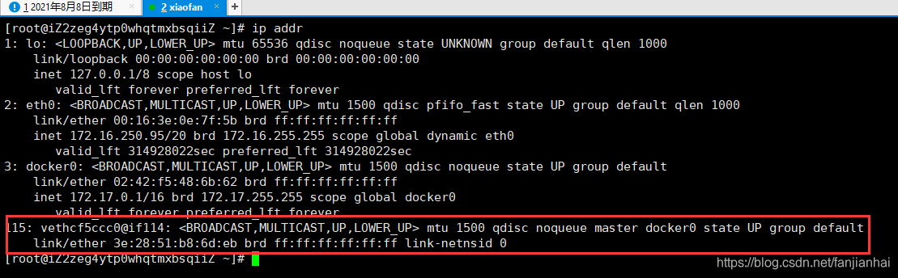

1. 再启动一个容器测试， 发现又多了一对网卡

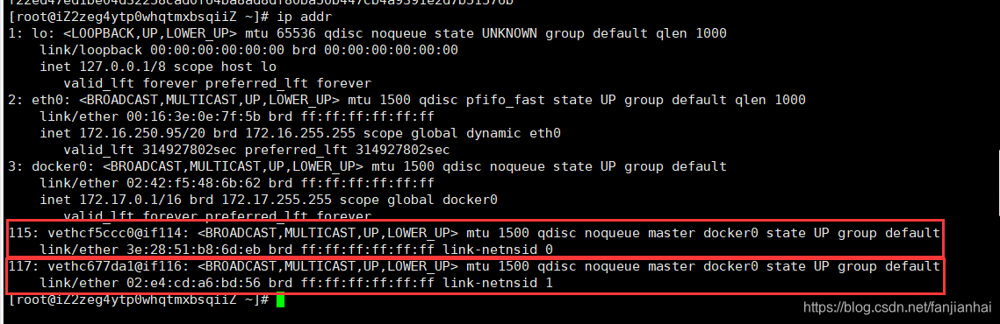

```
# 我们发现这个容器带来网卡，都是一对对的
# veth-pair 就是一对的虚拟设备接口，他们都是成对出现的，一端连着协议，一端彼此相连
# 正因为有这个特性，veth-pair充当一个桥梁， 连接各种虚拟网络设备
# OpenStac， Docker容器之间的链接，OVS的链接， 都是使用veth-pair技术
```

1. 我们测试一下tomcat01和tomcat02之间是否可以ping通！

   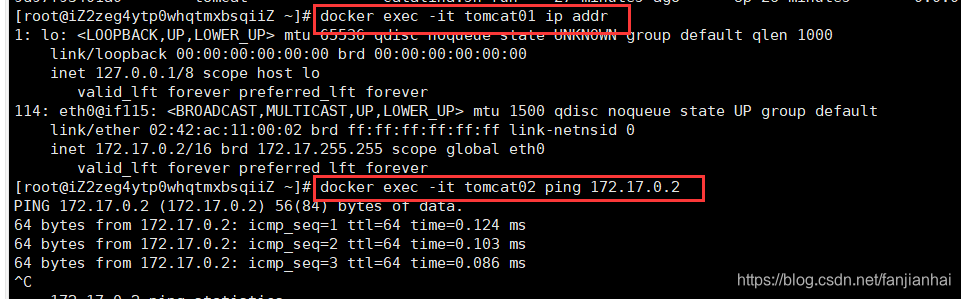

结论：容器与容器之间是可以相互ping通的！

绘制一个网络模型图

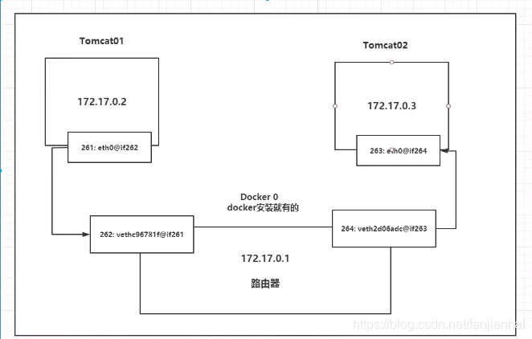

结论：tomcat01和tomcat02是共用的一个路由器，docker0

所有容器不指定网络的情况下，都是docker0路由的，doucker会给我们的容器分配一个默认的可用IP

> 小结

Docker使用的是Linux的桥接，宿主机中是一个Docker容器的网桥docker0.

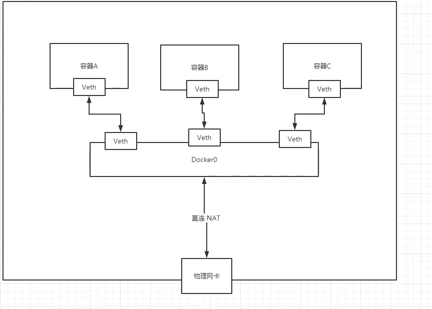                                	

Docker中的所有的网络接口都是虚拟的，虚拟的转发效率高！（内网传递文件！）

只要容器删除，对应的网桥一对就没有了！

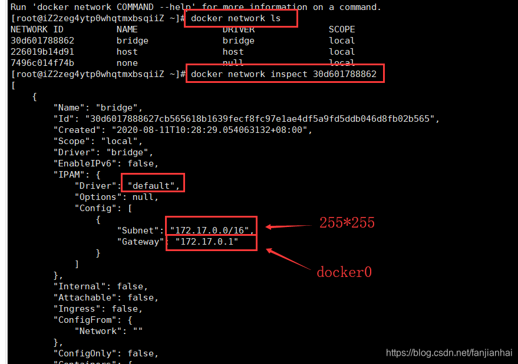

## -- link

> 思考一个场景，我们编写了一个微服务，database url =ip； 项目不重启，数据库ip换掉了，我们希望可以处理这个问题，可以按名字来进行访问容器
>
> 简言之：希望通过名字来访问ip

```shell
[root@iZ2zeg4ytp0whqtmxbsqiiZ ~]# docker exec -it tomcat02 ping tomcat01
ping: tomcat01: Name or service not known

# 如何可以解决呢？
# 通过--link可以解决网络连通问题
[root@iZ2zeg4ytp0whqtmxbsqiiZ ~]# docker run -d -P  --name tomcat03 --link tomcat02 tomcat
3a2bcaba804c5980d94d168457c436fbd139820be2ee77246888f1744e6bb473
[root@iZ2zeg4ytp0whqtmxbsqiiZ ~]# docker ps
CONTAINER ID        IMAGE               COMMAND             CREATED             STATUS              PORTS                     NAMES
3a2bcaba804c        tomcat              "catalina.sh run"   4 seconds ago       Up 3 seconds        0.0.0.0:32772->8080/tcp   tomcat03
f22ed47ed1be        tomcat              "catalina.sh run"   57 minutes ago      Up 57 minutes       0.0.0.0:32771->8080/tcp   tomcat02
9d97f93401a0        tomcat              "catalina.sh run"   About an hour ago   Up About an hour    0.0.0.0:32770->8080/tcp   tomcat01
[root@iZ2zeg4ytp0whqtmxbsqiiZ ~]# docker exec -it tomcat03 ping tomcat02
PING tomcat02 (172.17.0.3) 56(84) bytes of data.
64 bytes from tomcat02 (172.17.0.3): icmp_seq=1 ttl=64 time=0.129 ms
64 bytes from tomcat02 (172.17.0.3): icmp_seq=2 ttl=64 time=0.100 ms
64 bytes from tomcat02 (172.17.0.3): icmp_seq=3 ttl=64 time=0.110 ms
64 bytes from tomcat02 (172.17.0.3): icmp_seq=4 ttl=64 time=0.107 ms

# 反向可以ping通吗？
[root@iZ2zeg4ytp0whqtmxbsqiiZ ~]# docker exec -it tomcat02 ping tomcat03
ping: tomcat03: Name or service not known
```

探究：inspect！

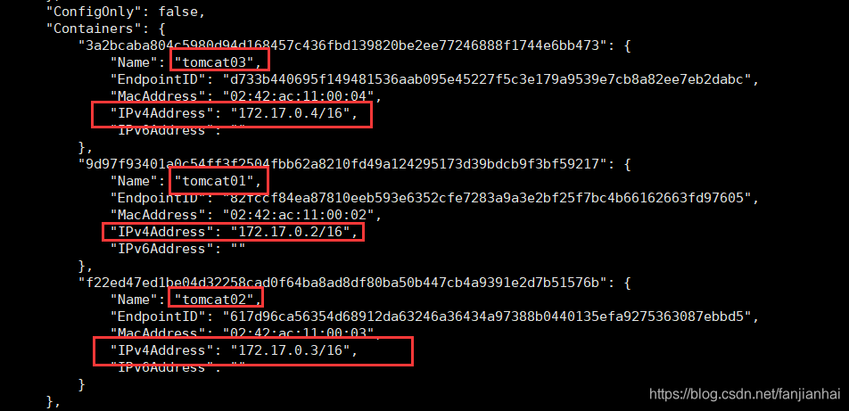

通过查看tomcat03的 /etc/hosts文件可以看到，其实这个tomcat03就是在本地配置了tomcat02的配置？

```shell
[root@iZ2zeg4ytp0whqtmxbsqiiZ ~]# docker exec -it tomcat03 cat /etc/hosts
127.0.0.1   localhost
::1 localhost ip6-localhost ip6-loopback
fe00::0 ip6-localnet
ff00::0 ip6-mcastprefix
ff02::1 ip6-allnodes
ff02::2 ip6-allrouters
172.17.0.3  tomcat02 f22ed47ed1be # --link通过修改这里，实现通过访问tomcat02这个名字来访问172.17.0.3这个ip
172.17.0.4  3a2bcaba804c
```

本质探究：--link 就是我们在hosts配置中增加了一个172.17.0.3 tomcat02 f22ed47ed1be

我们现在玩Docker已经不建议使用--link了！

自定义网络！不使用Docker0！

Docker0的问题：它不支持容器名链接访问！

## 自定义网络

> 查看所有的docker网络

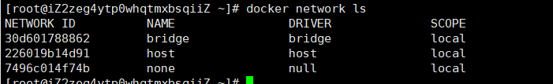

**网络模式**

bridge： 桥接模式，桥接 docker 默认，自己创建的也是用brdge模式

none： 不配置网络

host： 和宿主机共享网络

container：容器网络连通！（用的少， 局限很大）

**测试**

```shell
# 我们直接启动的命令默认有一个 --net bridge，而这个就是我们的docker0
docker run -d -P --name tomcat01 tomcat 			 # 原本的启动方式
docker run -d -P --name tomcat01 --net bridge tomcat # 该启动方式等价于上面的启动方法，并且两种方式都会会走docker0网络

# docker0特点，默认，容器名不能访问， --link可以打通连接！
# 我们可以自定义一个网络！
# --driver bridge
# --subnet 192.168.0.0/16 可以支持255*255个网络 192.168.0.2 ~ 192.168.255.254
# --gateway 192.168.0.1
[root@iZ2zeg4ytp0whqtmxbsqiiZ ~]# docker network create --driver bridge --subnet 192.168.0.0/16 --gateway 192.168.0.1 mynet
26a5afdf4805d7ee0a660b82244929a4226470d99a179355558dca35a2b983ec
[root@iZ2zeg4ytp0whqtmxbsqiiZ ~]# docker network ls
NETWORK ID          NAME                DRIVER              SCOPE
30d601788862        bridge              bridge              local
226019b14d91        host                host                local
26a5afdf4805        mynet               bridge              local
7496c014f74b        none                null                local
```

我们自己创建的网络就ok了！

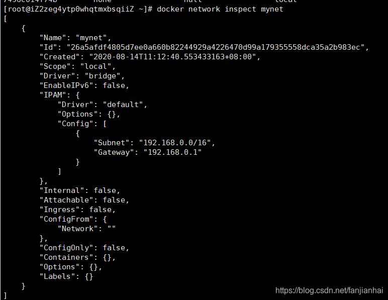

在自己创建的网络里面启动两个容器

```shell
[root@iZ2zeg4ytp0whqtmxbsqiiZ ~]# docker run -d -P --name tomcat-net-01 --net mynet tomcat
0e85ebe6279fd23379d39b27b5f47c1e18f23ba7838637802973bf6449e22f5c
[root@iZ2zeg4ytp0whqtmxbsqiiZ ~]# docker run -d -P --name tomcat-net-02 --net mynet tomcat
c6e462809ccdcebb51a4078b1ac8fdec33f1112e9e416406b606d0c9fb6f21b5
[root@iZ2zeg4ytp0whqtmxbsqiiZ ~]# docker network inspect mynet
[
    {
        "Name": "mynet",
        "Id": "26a5afdf4805d7ee0a660b82244929a4226470d99a179355558dca35a2b983ec",
        "Created": "2020-08-14T11:12:40.553433163+08:00",
        "Scope": "local",
        "Driver": "bridge",
        "EnableIPv6": false,
        "IPAM": {
            "Driver": "default",
            "Options": {},
            "Config": [
                {
                    "Subnet": "192.168.0.0/16",
                    "Gateway": "192.168.0.1"
                }
            ]
        },
        "Internal": false,
        "Attachable": false,
        "Ingress": false,
        "ConfigFrom": {
            "Network": ""
        },
        "ConfigOnly": false,
        "Containers": {
            "0e85ebe6279fd23379d39b27b5f47c1e18f23ba7838637802973bf6449e22f5c": {
                "Name": "tomcat-net-01",
                "EndpointID": "576ce5c0f5860a5aab5e487a805da9d72f41a409c460f983c0bd341dd75d83ac",
                "MacAddress": "02:42:c0:a8:00:02",
                "IPv4Address": "192.168.0.2/16",
                "IPv6Address": ""
            },
            "c6e462809ccdcebb51a4078b1ac8fdec33f1112e9e416406b606d0c9fb6f21b5": {
                "Name": "tomcat-net-02",
                "EndpointID": "81ecbc4fe26e49855fe374f2d7c00d517b11107cc91a174d383ff6be37d25a30",
                "MacAddress": "02:42:c0:a8:00:03",
                "IPv4Address": "192.168.0.3/16",
                "IPv6Address": ""
            }
        },
        "Options": {},
        "Labels": {}
    }
]

# 再次ping连接
# ping ip地址，能够ping通
[root@iZ2zeg4ytp0whqtmxbsqiiZ ~]# docker exec -it tomcat-net-01 ping 192.168.0.3
PING 192.168.0.3 (192.168.0.3) 56(84) bytes of data.
64 bytes from 192.168.0.3: icmp_seq=1 ttl=64 time=0.113 ms
64 bytes from 192.168.0.3: icmp_seq=2 ttl=64 time=0.093 ms
^C
--- 192.168.0.3 ping statistics ---
2 packets transmitted, 2 received, 0% packet loss, time 999ms
rtt min/avg/max/mdev = 0.093/0.103/0.113/0.010 ms
# ping 容器名字，也可以ping通
[root@iZ2zeg4ytp0whqtmxbsqiiZ ~]# docker exec -it tomcat-net-01 ping tomcat-net-02
PING tomcat-net-02 (192.168.0.3) 56(84) bytes of data.
64 bytes from tomcat-net-02.mynet (192.168.0.3): icmp_seq=1 ttl=64 time=0.068 ms
64 bytes from tomcat-net-02.mynet (192.168.0.3): icmp_seq=2 ttl=64 time=0.096 ms
64 bytes from tomcat-net-02.mynet (192.168.0.3): icmp_seq=3 ttl=64 time=0.094 ms
```

我们自定义的网络docker都已经帮我们维护好了对应的关系，推荐我们平时这样使用网络

好处： 

redis - 不同的集群使用不同的网络，保证集群时安全和健康的

mysql - 不同的集群使用不同的网络，保证集群时安全和健康的

## 网络连通

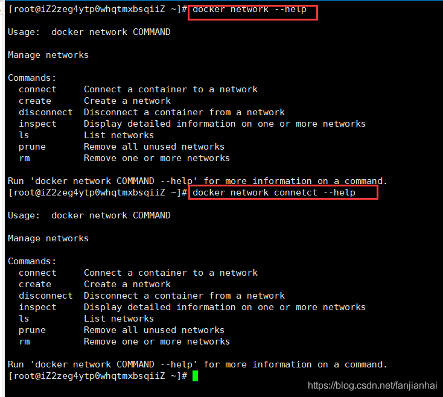

测试打通tomcat01 和mynet

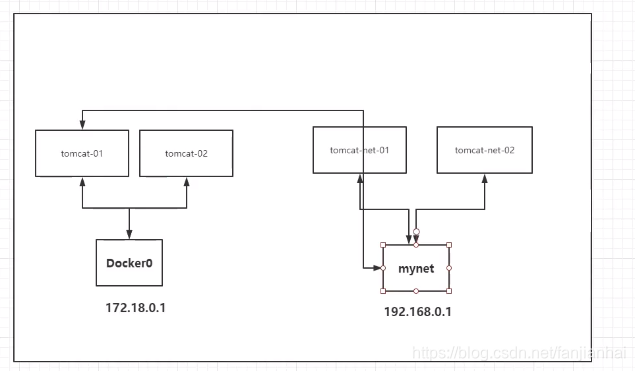

```shell
[root@iZ2zeg4ytp0whqtmxbsqiiZ ~]# docker network connect  mynet tomcat01

# 连通之后就是将tomcat01 放到了 mynet网路下
# 一个容器两个ip地址：
# 就好像阿里云服务器，公网ip，私网ip
```

tomcat01加入到了mynet中。
现在tomcat01就可以直接ping mynet下的其它容器了。

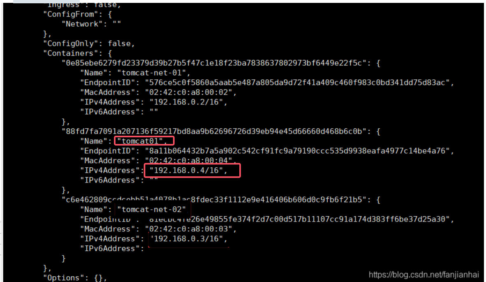

原本的docker0网络中也有tomcat01
说明tomcat01现在有两个ip，一个ip在mynet中，一个ip在docker0中

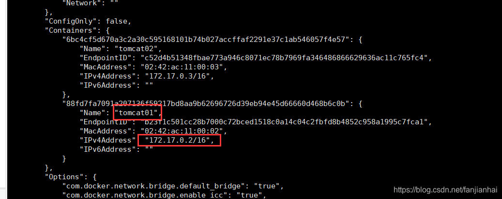

```shell
# tomcat01连通ok
[root@iZ2zeg4ytp0whqtmxbsqiiZ ~]# docker exec -it tomcat01 ping tomcat-net-01
PING tomcat-net-01 (192.168.0.2) 56(84) bytes of data.
64 bytes from tomcat-net-01.mynet (192.168.0.2): icmp_seq=1 ttl=64 time=0.100 ms
64 bytes from tomcat-net-01.mynet (192.168.0.2): icmp_seq=2 ttl=64 time=0.085 ms
^C
--- tomcat-net-01 ping statistics ---
2 packets transmitted, 2 received, 0% packet loss, time 1000ms
rtt min/avg/max/mdev = 0.085/0.092/0.100/0.012 ms
# tomcat02依旧无法连通，没有connect
[root@iZ2zeg4ytp0whqtmxbsqiiZ ~]# docker exec -it tomcat02 ping tomcat-net-01
ping: tomcat-net-01: Name or service not known
```

结论：假设要跨网络 操作别人，就要使用docker network connect连通.....!

## 实战：部署redis

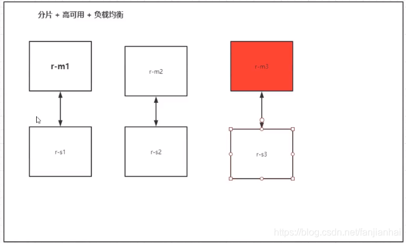

```shell
# 创建网卡
docker network create redis --subnet 172.38.0.0/16

# 通过脚本创建六个redis配置
for port in $(seq 1 6); \
do \
mkdir -p /mydata/redis/node-${port}/conf
touch /mydata/redis/node-${port}/conf/redis.conf
cat << EOF >/mydata/redis/node-${port}/conf/redis.conf
port 6379
bind 0.0.0.0
cluster-enabled yes
cluster-config-file nodes.conf
cluster-node-timeout 5000
cluster-announce-ip 172.38.0.1${port}
cluster-announce-port 6379
cluster-announce-bus-port 16379
appendonly yes
EOF
done
# 创建结点1
# 6379是redis的服务端口，16379是redis的集群端口（服务端口 + 10000）
docker run -p 6371:6379 -p 16371:16379 --name redis-1 \
-v /mydata/redis/node-1/data:/data \
-v /mydata/redis/node-1/conf/redis.conf:/etc/redis/redis.conf \
-d --net redis --ip 172.38.0.11 redis:5.0.9-alpine3.11 redis-server /etc/redis/redis.conf

#创建结点2
docker run -p 6372:6379 -p 16372:16379 --name redis-2 \
-v /mydata/redis/node-2/data:/data \
-v /mydata/redis/node-2/conf/redis.conf:/etc/redis/redis.conf \
-d --net redis --ip 172.38.0.12 redis:5.0.9-alpine3.11 redis-server /etc/redis/redis.conf
#创建结点3
docker run -p 6373:6379 -p 16373:16379 --name redis-3 \
-v /mydata/redis/node-3/data:/data \
-v /mydata/redis/node-3/conf/redis.conf:/etc/redis/redis.conf \
-d --net redis --ip 172.38.0.13 redis:5.0.9-alpine3.11 redis-server /etc/redis/redis.conf
#创建结点4
docker run -p 6374:6379 -p 16374:16379 --name redis-4 \
-v /mydata/redis/node-4/data:/data \
-v /mydata/redis/node-4/conf/redis.conf:/etc/redis/redis.conf \
-d --net redis --ip 172.38.0.14 redis:5.0.9-alpine3.11 redis-server /etc/redis/redis.conf
#创建结点5
docker run -p 6375:6379 -p 16375:16379 --name redis-5 \
-v /mydata/redis/node-5/data:/data \
-v /mydata/redis/node-5/conf/redis.conf:/etc/redis/redis.conf \
-d --net redis --ip 172.38.0.15 redis:5.0.9-alpine3.11 redis-server /etc/redis/redis.conf
#创建结点6
docker run -p 6376:6379 -p 16376:16379 --name redis-6 \
-v /mydata/redis/node-6/data:/data \
-v /mydata/redis/node-6/conf/redis.conf:/etc/redis/redis.conf \
-d --net redis --ip 172.38.0.16 redis:5.0.9-alpine3.11 redis-server /etc/redis/redis.conf

# 创建集群
[root@iZ2zeg4ytp0whqtmxbsqiiZ ~]# docker exec -it redis-1 /bin/sh
/data # ls
appendonly.aof  nodes.conf
/data # redis-cli --cluster create 172.38.0.11:6379 172.38.0.12:6379 172.38.0.13:6379 172.38.0.14:6379 172.38.0.15:6379 172.38.0.16:6379 --cluster-replicas 1
>>> Performing hash slots allocation on 6 nodes...
Master[0] -> Slots 0 - 5460
Master[1] -> Slots 5461 - 10922
Master[2] -> Slots 10923 - 16383
Adding replica 172.38.0.15:6379 to 172.38.0.11:6379
Adding replica 172.38.0.16:6379 to 172.38.0.12:6379
Adding replica 172.38.0.14:6379 to 172.38.0.13:6379
M: 541b7d237b641ac2ffc94d17c6ab96b18b26a638 172.38.0.11:6379
   slots:[0-5460] (5461 slots) master
M: a89c1f1245b264e4a402a3cf99766bcb6138dbca 172.38.0.12:6379
   slots:[5461-10922] (5462 slots) master
M: 259e804d6df74e67a72e4206d7db691a300c775e 172.38.0.13:6379
   slots:[10923-16383] (5461 slots) master
S: 9b19170eea3ea1b92c58ad18c0b5522633a9e271 172.38.0.14:6379
   replicates 259e804d6df74e67a72e4206d7db691a300c775e
S: 061a9d38f22910aaf0ba1dbd21bf1d8f57bcb7d5 172.38.0.15:6379
   replicates 541b7d237b641ac2ffc94d17c6ab96b18b26a638
S: 7a16b9bbb0615ec95fc978fa62fc054df60536f0 172.38.0.16:6379
   replicates a89c1f1245b264e4a402a3cf99766bcb6138dbca
Can I set the above configuration? (type 'yes' to accept): yes
>>> Nodes configuration updated
>>> Assign a different config epoch to each node
>>> Sending CLUSTER MEET messages to join the cluster
Waiting for the cluster to join
...
>>> Performing Cluster Check (using node 172.38.0.11:6379)
M: 541b7d237b641ac2ffc94d17c6ab96b18b26a638 172.38.0.11:6379
   slots:[0-5460] (5461 slots) master
   1 additional replica(s)
M: a89c1f1245b264e4a402a3cf99766bcb6138dbca 172.38.0.12:6379
   slots:[5461-10922] (5462 slots) master
   1 additional replica(s)
S: 7a16b9bbb0615ec95fc978fa62fc054df60536f0 172.38.0.16:6379
   slots: (0 slots) slave
   replicates a89c1f1245b264e4a402a3cf99766bcb6138dbca
S: 061a9d38f22910aaf0ba1dbd21bf1d8f57bcb7d5 172.38.0.15:6379
   slots: (0 slots) slave
   replicates 541b7d237b641ac2ffc94d17c6ab96b18b26a638
M: 259e804d6df74e67a72e4206d7db691a300c775e 172.38.0.13:6379
   slots:[10923-16383] (5461 slots) master
   1 additional replica(s)
S: 9b19170eea3ea1b92c58ad18c0b5522633a9e271 172.38.0.14:6379
   slots: (0 slots) slave
   replicates 259e804d6df74e67a72e4206d7db691a300c775e
[OK] All nodes agree about slots configuration.
>>> Check for open slots...
>>> Check slots coverage...
[OK] All 16384 slots covered.
```

docker搭建redis集群完成！

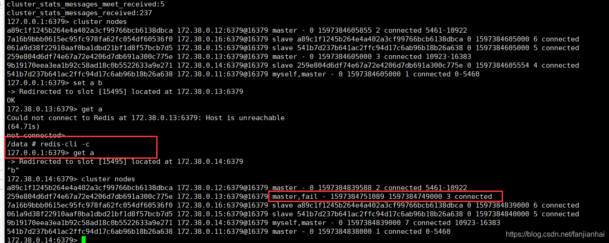

## SpringBoot微服务打包Docker镜像

1. 构建springboot项目

? [IDEA2020 Ultimate版本激活方案](https://tech.souyunku.com/?p=11599) `亲测有效`

1. 打包应用
2. 编写Dockerfile

```
FROM java:8

COPY *.jar /app.jar

CMD ["--server.port=8080"]

EXPOSE 8080

ENTRYPOINT ["java", "-jar", "/app.jar"]
```

1. 构建镜像
2. 发布运行！

```shell
# 把打好的jar包和Dockerfile上传到linux
[root@iZ2zeg4ytp0whqtmxbsqiiZ idea]# ll
total 16140
-rw-r--r-- 1 root root 16519871 Aug 14 17:38 demo-0.0.1-SNAPSHOT.jar
-rw-r--r-- 1 root root      122 Aug 14 17:38 Dockerfile

# 构建镜像，不要忘了最后有一个点
[root@iZ2zeg4ytp0whqtmxbsqiiZ idea]# docker build -t xiaofan666 .
Sending build context to Docker daemon  16.52MB
Step 1/5 : FROM java:8
8: Pulling from library/java
5040bd298390: Pull complete 
fce5728aad85: Pull complete 
76610ec20bf5: Pull complete 
60170fec2151: Pull complete 
e98f73de8f0d: Pull complete 
11f7af24ed9c: Pull complete 
49e2d6393f32: Pull complete 
bb9cdec9c7f3: Pull complete 
Digest: sha256:c1ff613e8ba25833d2e1940da0940c3824f03f802c449f3d1815a66b7f8c0e9d
Status: Downloaded newer image for java:8
 ---> d23bdf5b1b1b
Step 2/5 : COPY *.jar /app.jar
 ---> d4de8837ebf9
Step 3/5 : CMD ["--server.port=8080"]
 ---> Running in e3abc66303f0
Removing intermediate container e3abc66303f0
 ---> 131bb3917fea
Step 4/5 : EXPOSE 8080
 ---> Running in fa2f25977db7
Removing intermediate container fa2f25977db7
 ---> d98147377951
Step 5/5 : ENTRYPOINT ["java", "-jar", "/app.jar"]
 ---> Running in e1885e23773b
Removing intermediate container e1885e23773b
 ---> afb6b5f28a32
Successfully built afb6b5f28a32
Successfully tagged xiaofan666:latest

# 查看镜像
[root@iZ2zeg4ytp0whqtmxbsqiiZ idea]# docker images
REPOSITORY          TAG                 IMAGE ID            CREATED             SIZE
xiaofan666          latest              afb6b5f28a32        14 seconds ago      660MB
tomcat              latest              2ae23eb477aa        8 days ago          647MB
redis               5.0.9-alpine3.11    3661c84ee9d0        3 months ago        29.8MB
java                8                   d23bdf5b1b1b        3 years ago         643MB

# 运行容器
[root@iZ2zeg4ytp0whqtmxbsqiiZ idea]# docker run -d -P --name xiaofan-springboot-web xiaofan666
fd9a353a80bfd61f6930c16cd92204532bfd734e003f3f9983b5128a27b0375e
# 查看运行起来的容器端口（因为我们启动的时候没有指定）
[root@iZ2zeg4ytp0whqtmxbsqiiZ idea]# docker ps
CONTAINER ID        IMAGE               COMMAND                  CREATED             STATUS              PORTS                     NAMES
fd9a353a80bf        xiaofan666          "java -jar /app.jar …"   9 seconds ago       Up 8 seconds        0.0.0.0:32779->8080/tcp   xiaofan-springboot-web
# 本地访问1
[root@iZ2zeg4ytp0whqtmxbsqiiZ idea]# curl localhost:32779
{"timestamp":"2020-08-14T09:42:57.371+00:00","status":404,"error":"Not Found","message":"","path":"/"}
# 本地访问2
[root@iZ2zeg4ytp0whqtmxbsqiiZ idea]# [root@iZ2zeg4ytp0whqtmxbsqiiZ idea]# curl localhost:32779/hello
hello, xiaofan
# 远程访问（开启阿里云上的安全组哦）
```

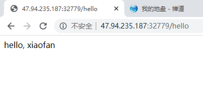

以后我们使用了Docker之后，给别人交互的就是一个镜像即可！

# Docker Compose

## 简介

过去使用Docker，都是通过docker run 命令启动容器，

现在使用docker compose ，可以通过编写 yaml 配置文件，可以通过compose 一键启动或者停止所有服务。

> 假如在微服务中，有100个微服务，微服务之间还有依赖关系，使用Docker手动管理这些微服务就极为不现实。
>
> Docker Compose 能轻松高效的管理容器，定义运行多个容器。

> 官方介绍

1. 定义运行多个容器
2. YAML file配置文件
3. single command。命令有哪些？

Compose is a tool for defining and running multi-container Docker applications. With Compose, you use a YAML file to configure your application’s services. Then, with a single command, you create and start all the services from your configuration. To learn more about all the features of Compose, see [the list of features](https://docs.docker.com/compose/#features).

4. 所有的环境都可以使用compose。

Compose works in all environments: production, staging, development, testing, as well as CI workflows. You can learn more about each case in [Common Use Cases](https://docs.docker.com/compose/#common-use-cases).

**三步骤：**

Using Compose is basically a three-step process:

1. Define your app’s environment with a 

   ```
   Dockerfile
   ```

    so it can be reproduced anywhere.

   - Dockerfile保证我们的项目再任何地方可以运行

2. Define the services that make up your app in 

   ```
   docker-compose.yml
   ```

    so they can be run together in an isolated environment.

   - services 什么是服务。

3. Run 

   ```
   docker-compose up
   ```

    and Compose starts and runs your entire app.

   - 启动项目

**作用：批量容器编排**

> 我自己的理解

Compose是Docker官方的开源项目，需要安装！

`Dockerfile`让程序在任何地方运行。web服务、redis、mysql、nginx... 多个容器。 run

Compose

```yml
version: '2.0'
services:
  web:
    build: .
    ports:
    - "5000:5000"
    volumes:
    - .:/code
    - logvolume01:/var/log
    links:
    - redis
  redis:
    image: redis
volumes:
  logvolume01: {}
```

docker-compose up 100个服务

Compose：重要概念

- 服务services， 容器、应用（web、redis、mysql...）
- 项目project。 一组关联的容器

## 安装

1. 下载

```shell
# 官网提供 （没有下载成功）
curl -L "https://github.com/docker/compose/releases/download/1.26.2/docker-compose-$(uname -s)-$(uname -m)" -o /usr/local/bin/docker-compose

# 国内地址
curl -L https://get.daocloud.io/docker/compose/releases/download/1.25.5/docker-compose-`uname -s`-`uname -m` > /usr/local/bin/docker-compose
```

1. 授权

```
chmod +x /usr/local/bin/docker-compose
```

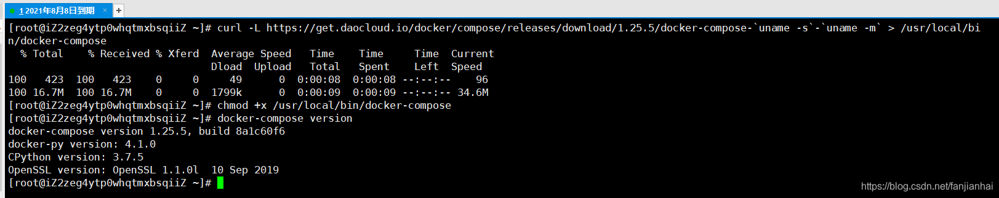

## Compose初体验(快速回顾Compose流程)

地址：https://docs.docker.com/compose/gettingstarted/

python应用。 计数器。redis！

1. 应用app.py

2. Dockerfile 应用打包为镜像

   ```dockerfile
   # syntax=docker/dockerfile:1
   FROM python:3.10-alpine
   WORKDIR /code
   ENV FLASK_APP=app.py
   ENV FLASK_RUN_HOST=0.0.0.0
   RUN apk add --no-cache gcc musl-dev linux-headers
   COPY requirements.txt requirements.txt
   RUN pip install -r requirements.txt
   EXPOSE 5000
   COPY . .
   CMD ["flask", "run", "--debug"]
   ```

3. Docker-compose yaml文件（定义整个服务，需要的环境 web、redis） 完整的上线服务！

   ```yaml
   services:
     web:
       build: .
       ports:
         - "8000:5000"
     redis:
       image: "redis:alpine"
   ```

4. 启动compose 项目 （docker compose up）

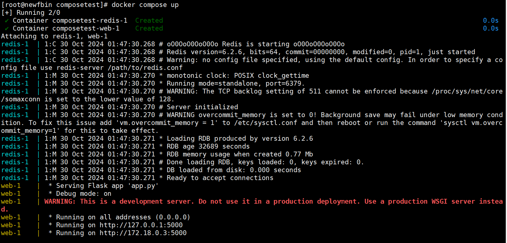

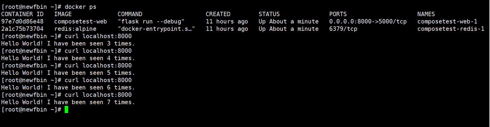 


compose项目启动成功后，可以看到自动下载好了需要的两个镜像

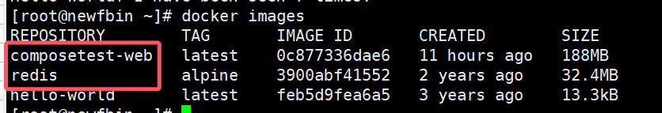

通过docker ps命令查看已经启动的容器，可以看到容器名为 : 文件名 _ 服务名 _ num
这样命名是因为未来一定会有多个服务器组成集群。每个服务器上都会有这个容器，num就是容器的副本数量。
例如如果有四台服务器，那么就会有4个redis副本。

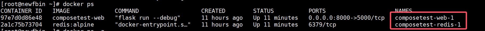

**网络规则：**

查看网络可以看到，compose项目自动创建了一个网络，
项目中的服务都在同一个网络下，服务之间可以通过域名访问。

> 根据前面学习过的Docker网络知识可以知道，同一网络下的容器可以通过容器名相互ping通

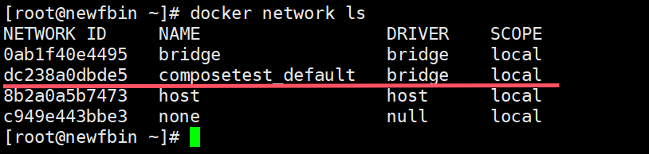

**关于官网案例的细节：**

官网代码中给出的是host = 'redis'
而一般我们写配置文件，或者写代码，会写host = localhost 或 host = xxxx.xxxx.xxxx.xxxx 
host = ’redis' 这个写法说明代码是通过服务名来访问服务的，而不是通过服务的ip

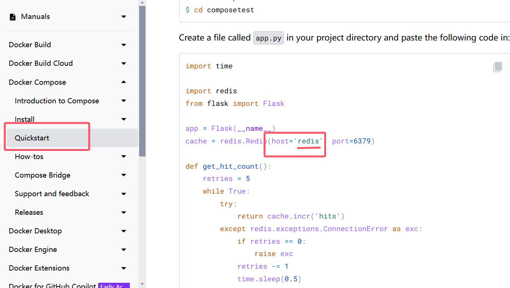

流程：

1. 创建网络
2. 执行Docker compose.yaml
3. 启动服务


## yaml规则

docker-compose.yaml 核心！

https://docs.docker.com/compose/compose-file/#compose-file-structure-and-examples

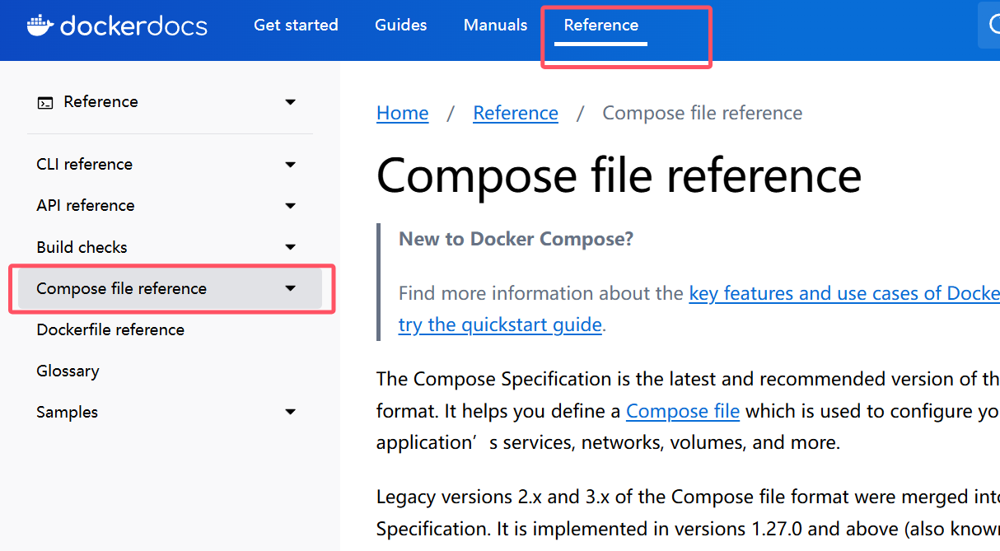

```yaml
# yaml文件共有三层

# 第一层：版本
version:''

# 第二层：服务
services: 
	服务1：web
		# 服务配置
		images
		build
		networks
		...
	服务2：redis
		...
# 第三层：其它配置：网络、卷、全局规则
volumes:
networks:
configs:
	
```

### 第一层：Version

...

### 第二层：Services

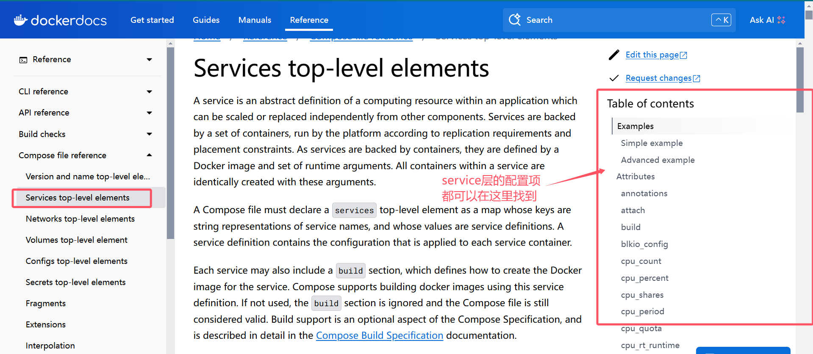

**重点1：depends_on**

> depends_on规定了服务的启动顺序
>
> services下一共有三个服务：web, redis,  db
> 根据depends_on，启动的顺序是：db 、 redis 、 web

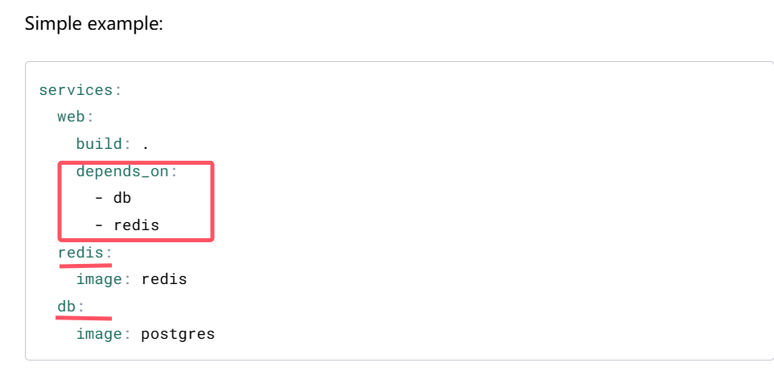

**重点2：deploy**

> 在多个服务器下可以定义副本：replcates 

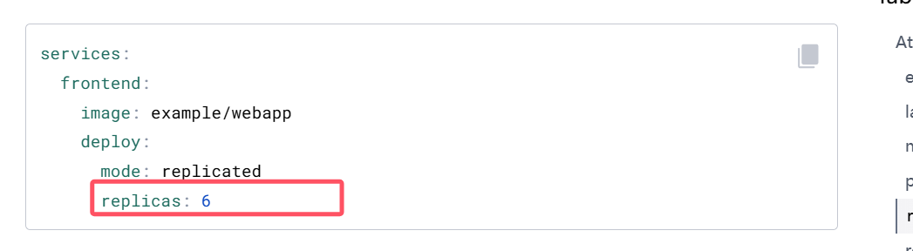

### 第三层：其它配置

看官网文档来理解学习

...

## 开源项目：博客

https://docs.docker.com/compose/wordpress/

下载程序、安装数据库、配置....

compose应用 => 一键启动

1. 下载项目（docker-compse.yaml）
2. 如果需要文件。Dockerfile
3. 文件准备齐全，一键启动项目即可


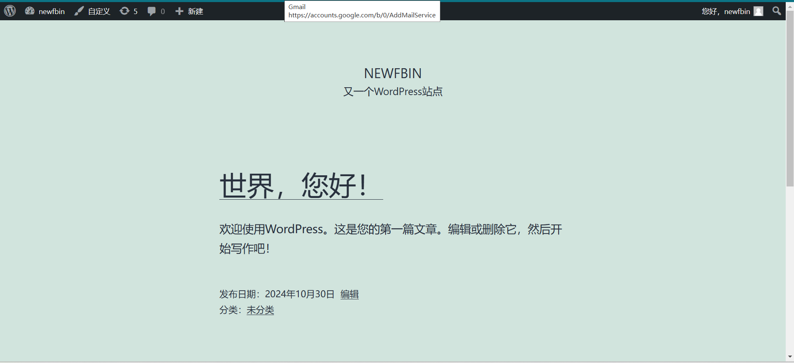

## 实战：自己编写微服务上线

1. 编写项目微服务

2. Dockerfile构建镜像

   ```dockerfile
   FROM java:8
   
   COPY *.jar /app.jar
   
   CMD ["--server.port=8080"]
   
   EXPOSE 8080
   
   ENTRYPOINT ["java", "-jar", "/app.jar"]
   ```

3. docker-compose.yml编排项目

   ```yml
   version '3.8'
   services:
     xiaofanapp:
       build: .
       image: xiaofanapp
       depends_on:
         - redis
       ports:
         - "8080:8080"
   
     redis:
       image: "library/redis:alpine"
   ```

4. 丢到服务器运行 docker compose up

将jar包、yml、Dockerfile丢到服务器

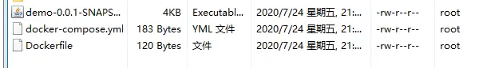

```shell
docker compose down         # 关闭容器
docker compose up --build   # 重新构建
```

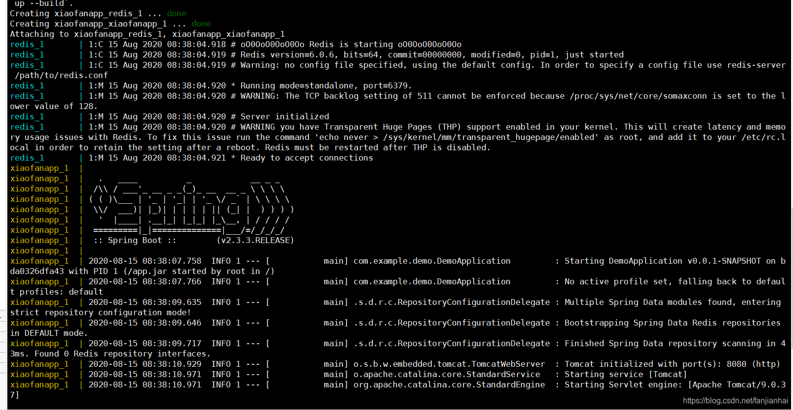

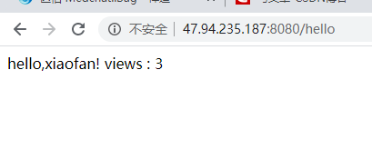

**总结：**

**工程、服务、容器**

项目 compose： 三层

- 工程 Project
- 服务
- 容器 运行实例！ docker k8s 容器

# Docker Swarm

集群

## 购买服务器

1. 登录阿里云账号，进入控制台，创建实例

   ```
   4台服务器2G
   ```

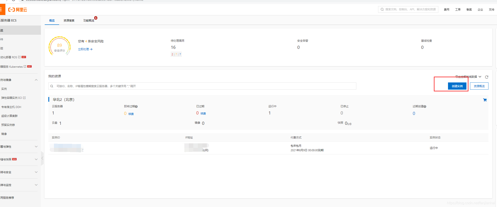

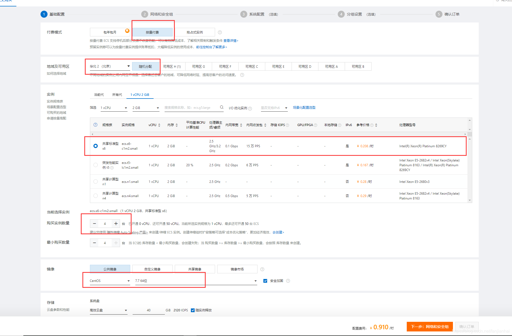

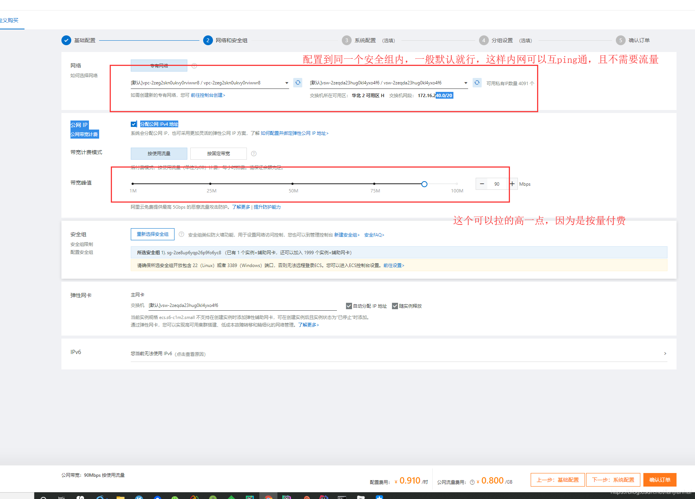


到此，我们的服务器购买成功！

## 四台机器安装docker

和我们单机安装一样

技巧： xshell直接同步操作，省时间！

- [Docker的安装](https://blog.csdn.net/fanjianhai/article/details/107860159)

## Swarm集群搭建

> 当前服务器集群情况：
>
> 四台已经安装了docker的服务器
>
> 

- [工作机制](https://docs.docker.com/engine/swarm/how-swarm-mode-works/nodes/)

  

  **在docker1中操作：**

```shell
docker swarm init --help

ip addr # 获取自己的ip（用内网的不要流量）
[root@iZ7xvgjfyuyme06vx3jm7sZ ~]# ip addr
1: lo: <LOOPBACK,UP,LOWER_UP> mtu 65536 qdisc noqueue state UNKNOWN group default qlen 1000
    link/loopback 00:00:00:00:00:00 brd 00:00:00:00:00:00
    inet 127.0.0.1/8 scope host lo
       valid_lft forever preferred_lft forever
2: eth0: <BROADCAST,MULTICAST,UP,LOWER_UP> mtu 1500 qdisc pfifo_fast state UP group default qlen 1000
    link/ether 00:16:3e:01:02:cd brd ff:ff:ff:ff:ff:ff
    inet 172.18.52.163/20 brd 172.18.63.255 scope global dynamic eth0
       valid_lft 315358649sec preferred_lft 315358649sec
3: docker0: <NO-CARRIER,BROADCAST,MULTICAST,UP> mtu 1500 qdisc noqueue state DOWN group default 
    link/ether 02:42:6e:e4:0f:af brd ff:ff:ff:ff:ff:ff
    inet 172.17.0.1/16 brd 172.17.255.255 scope global docker0
       valid_lft forever preferred_lft forever


[root@iZ7xvgjfyuyme06vx3jm7sZ ~]# docker swarm init --advertise-addr 172.18.52.163
Swarm initialized: current node (k0vbw0k23vguodxdjqvfinr7e) is now a manager.

To add a worker to this swarm, run the following command:

    docker swarm join --token SWMTKN-1-4gn7p2nfv39qiebg50waqk1fi63saswbep9i8sfxtl9yg8ec4m-70jnjukxy7xdt1h20ynwmvtbk 172.18.52.163:2377

To add a manager to this swarm, run 'docker swarm join-token manager' and follow the instructions.
```

初始化结点`docker swarm init`

`docker swarm join `加入一个结点！


**在docker2中操作：** 

```shell
# 生成令牌（可以在任何一个管理节点生成令牌）
docker swarm join-token manager
docker swarm join-token worker
[root@iZ2ze58v8acnlxsnjoulk6Z ~]# docker swarm join --token SWMTKN-1-3vovnwb5pkkno2i3u2a42yrxc1dk51zxvto5hrm4asgn37syfn-0xkrprkuyyhrx7cidg381pdir 172.16.250.97:2377
This node joined a swarm as a worker.
```

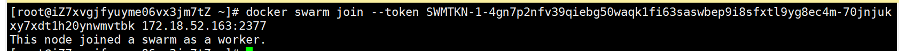

**把后面的结点都搭建进去**

> docker3

在docker1中执行`docker swarm join-token worker`,生成加入工作节点的令牌。如下图：

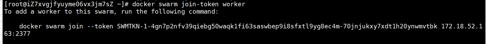

将生成的命令复制到docker3中执行，docker3便加入到工作节点中。

> docker4

在docker1中执行`docker swarm join-token manager`,生成加入管理节点的令牌。如下图：

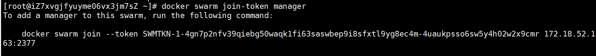

将生成的命令复制到docker4中执行，docker4便加入到管理节点中。

> docker1查看
>
> 其中rZ结尾的机器先加入到了工作节点，又退出工作节点，再加入到了管理节点。所以该机器有两个，其中一个状态为Down

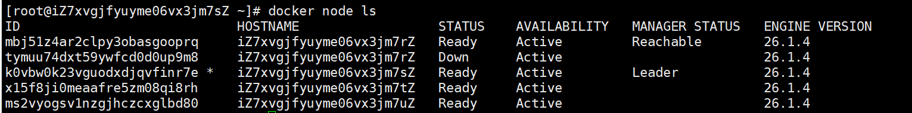

目前的状态是”双主双从“，是一种不太科学的状态，正常状态应该为至少三个主节点

**总结步骤**

1. 生成主节点init
2. 加入（管理者，worker）

## 测试Raft协议

Raft协议：保证大多数结点存活才可以使用，只要>1, 集群至少大于3台！

双主双从：假设一个主结点挂了！另外一个主节点不可以使用

实验：

1、将docker1机器停止。dockers1宕机！双主，另外一个主结点也不能使用了！

> docker4操作。发现错误提示。说明两个主节点时，一个主节点宕机，另一个主节点将不能使用

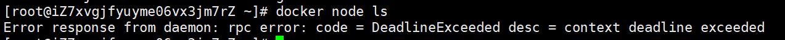

2.可以将其他结点离开`docker swarm leave`


3.worker就是工作的，manager管理结点操作！ 现在将docker3也设置为管理节点，目前共3台结点设置为管理结点。

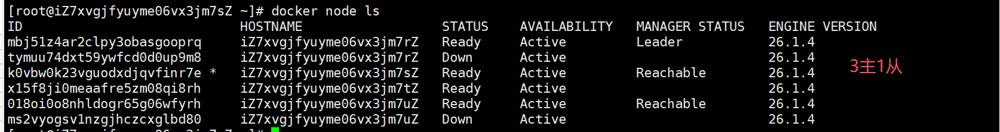

4.Docker swarm集群增加节点](https://www.cnblogs.com/zoujiaojiao/p/10886262.html)

Raft协议：保证大多数结点存活，才可以使用，高可用！

举例： 至少要保证3个主节点。 >= 2台管理结点存活！

## 体验：创建服务、动态扩容服务、动态更新服务

弹性、扩缩容！集群！     

以后告别 docker run！

docker-compose up！启动一个项目。单机！

集群： swarm `docker-service`

k8s service

容器 => 服务！

容器 => 服务！ => 副本！

redis => 10个副本！（同时开启10个redis容器）

> 假设现在有一个nginx集群。
>
> 在不使用动态扩缩容时，向集群中加入了一个web，需要在每个nginx中配置这个web	
>
> 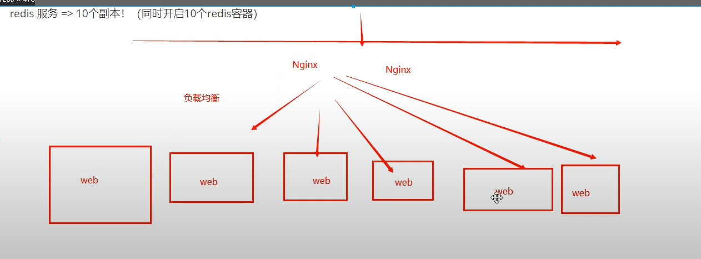


体验：创建服务、动态扩容服务、动态更新服务

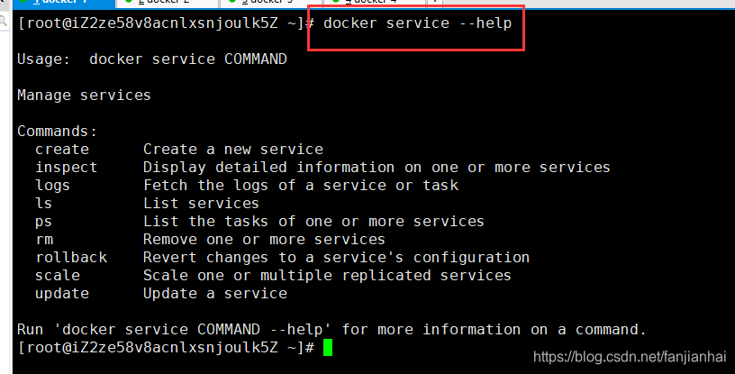

灰度发布（金丝雀发布）

[编程浪子的博客](https://www.cnblogs.com/apanly/)


**docker service创建服务：**


```shell
docker run 容器启动！ 不具有扩缩容器
docker service 服务！ 具有扩缩容器，滚动更新！
```

**查看服务**


动态扩缩容

```shell
# docker service 扩展副本数量
# 这三个nginx容器将随机分配的这四个docker服务器上
[root@iZ2ze58v8acnlxsnjoulk5Z ~]# docker service update --replicas 3 my-nginx
1/3: running   [==================================================>] 
1/3: running   [==================================================>] 
2/3: running   [==================================================>] 
3/3: running   [==================================================>] 
verify: Service converged 

# docker service scale 扩缩副本数量
[root@iZ2ze58v8acnlxsnjoulk5Z ~]# docker service scale my-nginx=5
my-nginx scaled to 5
overall progress: 3 out of 5 tasks 
overall progress: 3 out of 5 tasks 
overall progress: 3 out of 5 tasks 
overall progress: 5 out of 5 tasks 
1/5: running   [==================================================>] 
2/5: running   [==================================================>] 
3/5: running   [==================================================>] 
4/5: running   [==================================================>] 
5/5: running   [==================================================>] 
verify: Service converged 


[root@iZ2ze58v8acnlxsnjoulk5Z ~]# docker service scale my-nginx=1
my-nginx scaled to 1
overall progress: 1 out of 1 tasks 
1/1: running   [==================================================>] 
verify: Service converged 
```

移除服务：`docker service rm 服务名`

docker swarm其实并不难

只要会搭建集群、会启动服务、动态管理容器就可以了！

## Docker Swarm概念的总结

**swarm**

集群的管理和编号，docker可以初始化一个swarm集群，其他结点可以加入。（管理，工作者）

**Node**

就是一个docker结点，多个结点就组成了一个网络集群（管理、工作者）

**Service**

任务，可以在**管理结点或者工作结点**来运行。核心，用户访问。

**Task**

容器内的命令、细节任务！

yml文件中**replicas:4** 就对应 Service中的4个**Task**

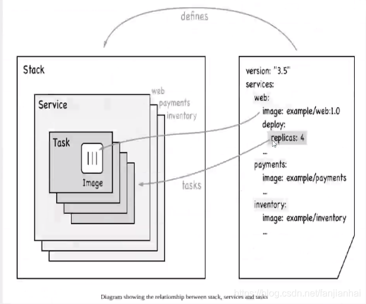

> service

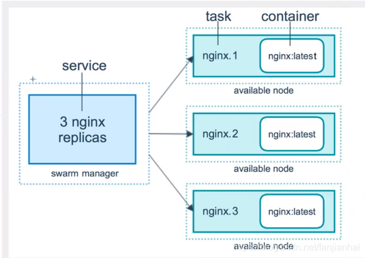

**Swarm内部原理**

命令 -> 管理 -> api -> 调度 -> 工作结点（创建Task容器维护创建！）

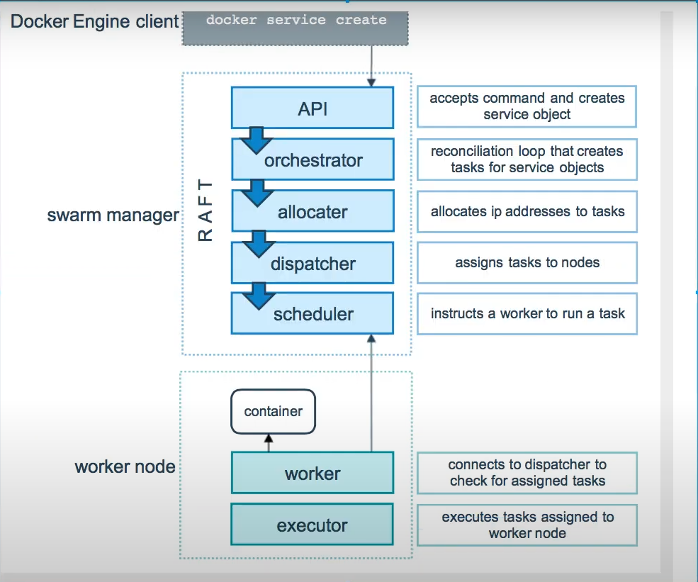

> 服务副本和全局服务

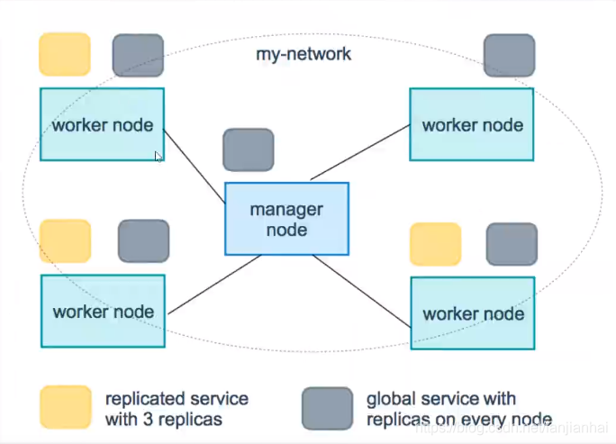

调整service以什么方式运行

```shell
--mode string                        
Service mode (replicated or global) (default "replicated")

docker service create --mode replicated --name mytom tomcat:7 默认的
docker service create --mode global  --name haha alpine ping www.baidu.com
```

拓展： 网络模式 "PublishMode":"ingress"

Swarm:

Overlay:

ingress:特殊的Overlay网络！负载均衡的功能！ipvs vip！

```
[root@iZ2ze58v8acnlxsnjoulk5Z ~]# docker network ls
NETWORK ID          NAME                DRIVER              SCOPE
74cecd37149f        bridge              bridge              local
168d35c86dd5        docker_gwbridge     bridge              local
2b8f4eb9c2e5        host                host                local
dmddfc14n7r3        ingress             overlay             swarm
8e0f5f648e69        none                null                local


[root@iZ2ze58v8acnlxsnjoulk5Z ~]# docker network inspect ingress
[
    {
        "Name": "ingress",
        "Id": "dmddfc14n7r3vms5vgw0k5eay",
        "Created": "2020-08-17T10:29:07.002315919+08:00",
        "Scope": "swarm",
        "Driver": "overlay",
        "EnableIPv6": false,
        "IPAM": {
            "Driver": "default",
            "Options": null,
            "Config": [
                {
                    "Subnet": "10.0.0.0/24",
                    "Gateway": "10.0.0.1"
                }
            ]
        },
        "Internal": false,
        "Attachable": false,
        "Ingress": true,
        "ConfigFrom": {
            "Network": ""
        },
        "ConfigOnly": false,
        "Containers": {
            "ingress-sbox": {
                "Name": "ingress-endpoint",
                "EndpointID": "9d6ec47ec8309eb209f4ff714fbe728abe9d88f9f1cc7e96e9da5ebd95adb1c4",
                "MacAddress": "02:42:0a:00:00:02",
                "IPv4Address": "10.0.0.2/24",
                "IPv6Address": ""
            }
        },
        "Options": {
            "com.docker.network.driver.overlay.vxlanid_list": "4096"
        },
        "Labels": {},
        "Peers": [
            {
                "Name": "cea454a89163",
                "IP": "172.16.250.96"
            },
            {
                "Name": "899a05b64e09",
                "IP": "172.16.250.99"
            },
            {
                "Name": "81d65a0e8c03",
                "IP": "172.16.250.97"
            },
            {
                "Name": "36b31096f7e2",
                "IP": "172.16.250.98"
            }
        ]
    }
]
```

## 其他命令学习方式

- Docker Stack

```shell
docker compose 单机部署项目
docker stack 集群部署

# 单机
docker-compose up -d wordpress.yaml
# 集群
docker stack deploy wordpress.yaml
```

- Docker Secret

```shell
安全！配置密码！证书！

[root@iZ2ze58v8acnlxsnjoulk5Z ~]# docker secret --help

Usage:  docker secret COMMAND

Manage Docker secrets

Commands:
  create      Create a secret from a file or STDIN as content
  inspect     Display detailed information on one or more secrets
  ls          List secrets
  rm          Remove one or more secrets
```

- Docker Config

```shell
配置！
[root@iZ2ze58v8acnlxsnjoulk5Z ~]# docker config --help

Usage:  docker config COMMAND

Manage Docker configs

Commands:
  create      Create a config from a file or STDIN
  inspect     Display detailed information on one or more configs
  ls          List configs
  rm          Remove one or more configs
```

## 拓展到k8s

**云原生时代**

Go语言！必须掌握！ Java Go！

并发语言！

B语言，C语言的创始人。Unix创始人V8引擎创始人联合创立了Go语言

go`指针`


