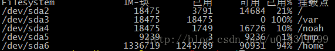
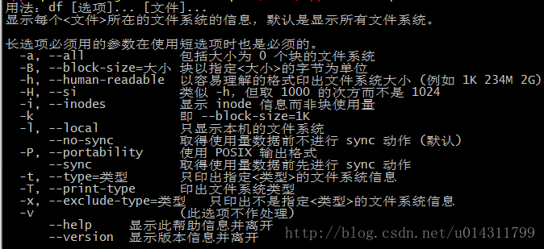
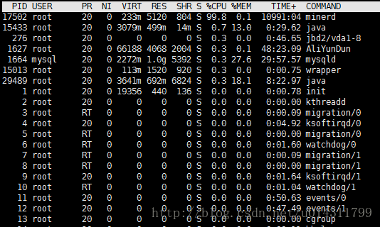
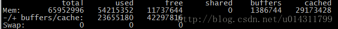
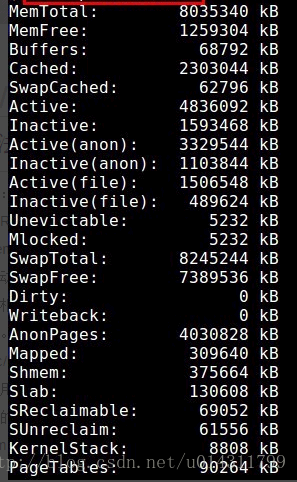
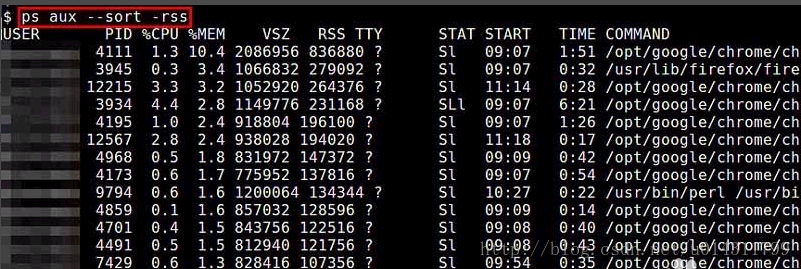
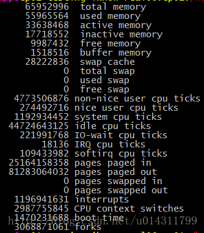

## 归档、压缩、解压缩

### tar命令

Linux tar（英文全拼：tape archive ）命令用于备份文件。

tar 是 Linux 和 Unix 系统中用于归档文件和目录的强大命令行工具。

tar 名字来自 "tape archive"（磁带归档），最初用于将文件打包到磁带设备中，但现在广泛用于在文件系统中打包和压缩文件。

**tar 通常用于将多个文件和目录打包成一个归档文件**，称为 "tarball"（通常带有 .tar 扩展名）。

**tar 本身不压缩文件，但可以与压缩工具（如 gzip 或 bzip2）结合使用，创建压缩的归档文件（如 .tar.gz 或 .tar.bz2）。**

#### 语法

```
tar [options] -f archive.tar [files...]
```

- `-f archive.tar`：指定归档文件的名称。
- `[files...]`：要打包的文件和目录。

#### options 参数

**基本操作选项**

- `-c`：创建一个新的归档文件。
- `-x`：解压归档文件。
- `-t`：列出归档文件的内容。
- `-r`：向现有归档文件中追加文件。
- `-u`：仅追加比归档文件中已有文件更新的文件。
- `-d`：找到归档文件中与文件系统不同步的差异。
- `-A`：将一个 `.tar` 文件追加到另一个 `.tar` 文件中。

**文件选择和排除**

- `-f <file>`：指定归档文件的名称（必须放在选项列表的最后）。
- `-C <directory>`：切换到指定目录进行操作。
- `--exclude=<pattern>`：排除匹配指定模式的文件。
- `--exclude-from=<file>`：从指定文件读取要排除的模式。
- `--exclude-caches`：排除目录中的缓存文件。
- `--exclude-backups`：排除以 `~` 结尾的备份文件。
- `--exclude-vcs`：排除版本控制系统生成的文件（如 `.git`、`.svn` 等）。

**压缩和解压选项**

- `-z`：使用 `gzip` 压缩归档文件。
- `-j`：使用 `bzip2` 压缩归档文件。
- `-J`：使用 `xz` 压缩归档文件。
- `--lzip`：使用 `lzip` 压缩归档文件。
- `--lzma`：使用 `lzma` 压缩归档文件。
- `--lzop`：使用 `lzop` 压缩归档文件。
- `--zstd`：使用 `zstd` 压缩归档文件。
- `-a`：自动选择压缩方式（基于归档文件的扩展名，如 `.tar.gz`、`.tar.bz2` 等）。
- `-I <command>`：使用指定的压缩程序进行压缩或解压。

**输出和交互选项**

- `-v`：显示详细操作过程（verbose）。
- `--progress`：显示进度条（与 `-v` 一起使用时）。
- `-w` 或 `--interactive`：在每次操作前询问用户确认。
- `--checkpoint`：在处理每个文件后显示一个检查点。
- `--checkpoint-action=<action>`：在检查点执行指定的动作，如 `echo`、`dot` 等。
- `--totals`：在操作结束后显示处理的总字节数。
- `--verbose`：详细显示处理的信息。
- `--quiet`：尽可能少的输出信息。

**文件和权限相关选项**

- `-p`：保留文件的原始权限（解压时）。
- `--same-owner`：尝试将解压的文件设为原始所有者（需超级用户权限）。
- `--no-same-owner`：不设置文件所有者。
- `--same-permissions`：保留文件的原始权限（与 `-p` 相同）。
- `--no-same-permissions`：不保留原始权限，使用当前用户的 umask 设置权限。
- `-m`：在解压时不恢复文件的修改时间，而使用当前时间。

**归档管理选项**

- `-k` 或 `--keep-old-files`：解压时保留已有文件，不覆盖。
- `--overwrite`：解压时强制覆盖已有文件。
- `--remove-files`：归档成功后删除原始文件。
- `--delete`：从归档文件中删除指定文件（仅限 `gnu tar`）。
- `--keep-newer-files`：解压时保留比归档中较新的文件。
- `--listed-incremental=<file>`：创建增量备份或从增量备份恢复。

**文件系统和设备选项**

- `-L <N>`：分割大于 `N` 字节的归档文件（对于磁带机）。
- `--tape-length=<number>`：指定磁带长度（对于磁带机）。
- `--multi-volume`：创建或恢复多卷归档文件。
- `-M`：与 `--multi-volume` 一起使用，处理多卷归档文件。
- `--use-compress-program=<prog>`：使用指定的压缩程序。

**其他实用选项**

- `--transform=<expression>`：重命名归档中的文件。
- `--strip-components=<number>`：解压时剥离指定数量的路径组件。
- `--ignore-failed-read`：忽略读取错误并继续操作。
- `--occurrence=<number>`：在归档中选择第 `number` 个出现的文件。
- `-S`：处理稀疏文件（仅归档实际使用的块）。
- `--no-recursion`：不递归进入目录。
- `-h` 或 `--dereference`：归档符号链接指向的文件而非链接本身。

**帮助和版本信息**

- `--help`：显示帮助信息。
- `--version`：显示 `tar` 的版本信息。

#### 实例

**1、创建归档文件：**将文件 file1、file2 和 directory 打包到一个名为 archive.tar 的归档文件中。

```
tar -cvf archive.tar file1 file2 directory
```

- `-c`: 创建新的归档文件
- `-v`: 显示详细输出，列出被添加到归档中的文件
- `-f`: 指定归档文件的名称

**2、解压归档文件：**解压名为 archive.tar 的归档文件，还原其中包含的文件和目录。

```
tar -xvf archive.tar
```

- `-x`: 解压归档文件
- `-v`: 显示详细输出，列出被解压的文件
- `-f`: 指定要解压的归档文件的名称

**3、压缩归档文件：**将名为 directory 的目录打包成一个归档文件，然后使用 gzip 进行压缩，生成名为 archive.tar.gz 的文件。

- `-c`: 创建新的归档文件
- `-z`: 使用 gzip 压缩归档文件
- `-v`: 显示详细输出，列出被添加到归档中的文件
- `-f`: 指定归档文件的名称

**4、列出归档文件中的内容：**列出名为 archive.tar 的归档文件中包含的所有文件和目录。

```
tar -tvf archive.tar
```

- `-t`: 列出归档文件中的内容
- `-v`: 显示详细输出，列出归档文件中的所有文件和目录
- `-f`: 指定要列出内容的归档文件的名称

**5、追加文件到已存在的归档中：**将名为 newfile 的文件添加到已存在的名为 archive.tar 的归档文件中。

```
tar -rvf archive.tar newfile
```

- `-r`: 向已存在的归档中追加文件
- `-v`: 显示详细输出，列出被添加到归档中的文件
- `-f`: 指定已存在的归档文件的名称

**6、创建一个经过 gzip 压缩的归档文件：**打包 directory 目录下的所有文件和子目录，并使用 gzip 压缩，生成名为 archive.tar.gz 的归档文件。

```
tar -zcvf archive.tar.gz directory
```

- `-z`: 表示要使用 gzip 进行压缩。
- `-c`: 表示创建新的归档文件。
- `-v`: 表示详细输出，列出被添加到归档中的文件。
- `-f archive.tar.gz`: 指定归档文件的名称为 `archive.tar.gz`。

**7、解压一个已经被 gzip 压缩的归档文件：**解压 example.tar.gz 文件，并在当前目录下恢复其中包含的文件和目录。

```
tar -zxvf example.tar.gz
```

- `-z`: 表示要使用 gzip 解压归档文件。
- `-x`: 表示解压操作。
- `-v`: 表示详细输出，列出被解压的文件。
- `-f example.tar.gz`: 指定要解压的归档文件的名称为 `example.tar.gz`。

#### 指定压缩格式

tar 可以结合不同的压缩程序来创建和解压压缩归档文件。

z : 使用 gzip 压缩。

```
tar -czvf archive.tar.gz directory
tar -xzvf archive.tar.gz
```

j: 使用 bzip2 压缩。

```
tar -cjvf archive.tar.bz2 directory
tar -xjvf archive.tar.bz2
```

J: 使用 xz 压缩。

```
tar -cJvf archive.tar.xz directory
tar -xJvf archive.tar.xz
```

### gzip/gunzip命令

Linux gzip 命令用于压缩文件。

gzip 是个使用广泛的压缩程序，文件经它压缩过后，其名称后面会多出 .gz 的扩展名。

gzip 使用 DEFLATE 压缩算法，通常比 [bzip2](https://www.runoob.com/linux/linux-comm-bzip2.html) 更快，但压缩比稍低。

#### gzip语法

```shell
gzip [options] [file...]
```

- `file...`：要压缩的文件。`gzip` 会将指定的文件压缩，并生成一个 `.gz` 后缀的压缩文件，同时删除原始文件。

**options 参数选项**：

- `-d`：解压缩 `.gz` 文件。相当于使用 `gunzip` 命令。
- `-k`：保留原始文件，不删除。
- `-r`：递归压缩目录下的所有文件。
- `-v`：显示详细的压缩或解压缩过程。
- `-l`：显示压缩文件的详细信息，如压缩率、原始大小等。
- `-1` 到 `-9`：指定压缩比。`-1` 是最快的压缩，压缩率最低；`-9` 是最慢的压缩，压缩率最高。默认是 `-6`。
- `-t`：测试压缩文件的完整性。

#### gzip实例

**压缩文件**

```
gzip example.txt
```

此命令会将 example.txt 压缩为 example.txt.gz，并删除原始文件 example.txt。

**保留原始文件**

如果希望在压缩后保留原始文件，可以使用 -k 选项：

```
gzip -k example.txt
```

此命令会保留原始的 example.txt 文件，并生成 example.txt.gz。

**解压缩文件**

要解压缩 .gz 文件，可以使用 -d 选项或直接使用 gunzip：

```
gzip -d example.txt.gz
```

或

```
gunzip example.txt.gz
```

这会将 example.txt.gz 解压缩为原始的 example.txt 文件。

**递归压缩目录**

你可以使用 -r 选项递归压缩整个目录：

```
gzip -r directory/
```

此命令会压缩 directory 目录下的所有文件，并保留目录结构。

**显示压缩文件信息**

使用 -l 选项可以查看 .gz 文件的详细信息：

```
gzip -l example.txt.gz
```

此命令会显示文件的原始大小、压缩后大小、压缩率等信息。

**测试压缩文件**

使用 -t 选项测试压缩文件的完整性：

```
gzip -t example.txt.gz
```

如果文件完整且无损坏，该命令将不会有输出；否则会提示错误。

gzip 主要用于压缩单个文件。如果需要压缩多个文件或整个目录，通常先用 tar 归档，再用 gzip 压缩。例如：

```
tar -cvzf archive.tar.gz directory/
```

Linux gunzip 命令用于解压文件。

gunzip 是个使用广泛的解压缩程序，它用于解开被 gzip 压缩过的文件，这些压缩文件预设最后的扩展名为 .gz。事实上 gunzip 就是 gzip 的硬连接，因此不论是压缩或解压缩，都可通过 gzip 指令单独完成。

#### gunzip语法

**参数**：

```
gunzip [选项] 压缩文件
```

- `-c`：将解压缩后的文件内容输出到标准输出（而不是写入文件）。
- `-d`：解压缩文件。这是默认的行为，可以省略。
- `-f`：强制解压缩，即使已存在同名的解压缩文件。
- `-h`：显示帮助信息。
- `-k`：保留原始的压缩文件。解压缩后的文件会保留在同一目录下，而不会删除原始文件。
- `-l`：显示压缩文件的详细信息，包括压缩前后的文件大小、压缩比等。
- `-n`：不覆盖已存在的解压缩文件。如果已存在同名文件，则不会进行解压缩操作。
- `-q`：静默模式，不显示解压缩进度和错误信息。
- `-r`：递归地解压缩指定目录下的所有文件。
- `-t`：测试压缩文件的完整性，而不进行实际的解压缩操作。
- `-v`：显示详细的解压缩信息，包括解压缩的文件名、压缩比等。
- `--help`：显示帮助信息。
- `--version`：显示 `gunzip` 命令的版本信息。

#### gunzip实例

1、解压缩文件：

```
gunzip example.txt.gz
```

这将解压缩名为 example.txt.gz 的文件，并生成一个名为 example.txt 的解压缩文件。

2、解压缩文件并保留原始文件：

```
gunzip -k example.txt.gz
```

这将解压缩 example.txt.gz 文件，并生成一个名为 example.txt 的解压缩文件，同时保留原始的 example.txt.gz 文件。

解压缩文件并将内容输出到标准输出：

```
gunzip -c example.txt.gz
```

这将解压缩 example.txt.gz 文件，并将解压缩后的内容输出到标准输出，而不是生成解压缩文件。

递归地解压缩目录下的所有文件：

```
gunzip -r directory
```

这将递归地解压缩指定目录 directory 下的所有以 gzip 格式压缩的文件。

需要注意的是，gunzip 命令只能解压缩 gzip 格式的文件，不能用于解压其他压缩格式，如 ZIP、RAR 等。如需解压其他格式的压缩文件，可以使用相应的工具，例如 unzip 命令用于解压缩 ZIP 文件。

#### gunzip和gzip关系

gunzip就是gzip -d，因为gunzip是gzip -d的符号链接。

**用法上的对比：**

1. 解压文件：

   - `gunzip file.gz` 和 `gzip -d file.gz` 都会将 `file.gz` 解压成 `file`。

2. 保留压缩文件：

   - 默认情况下，`gunzip` 和 `gzip -d` 都会删除原始的 `.gz` 文件。

   - 如果想保留压缩文件，可以使用 

     ```
     -c
     ```

      选项：

     - `gunzip -c file.gz > file` 或者 `gzip -dc file.gz > file` 都可以将解压后的内容输出到标准输出，并保留 `.gz` 文件。

3. 批量解压文件：

   - 两个命令都可以解压多个文件：`gunzip file1.gz file2.gz` 和 `gzip -d file1.gz file2.gz` 都会解压这两个文件。

## yum/apt/wget/curl使用方法和区别

> 一般来说著名的linux系统基本上分两大类：
> RedHat系列：Redhat、Centos、Fedora等
> Debian系列：Debian、Ubuntu等
>
> **RedHat 系列:**
> 常见的安装包格式 rpm包,安装rpm包的命令是“rpm -参数”
> 包管理工具 yum
> **支持tar包**
>
> **Debian系列:**
> 常见的安装包格式 deb包,安装deb包的命令是“dpkg -参数”
> 包管理工具 apt-get
> **支持tar包**

### yum语法及常用命令

yum（ Yellow dog Updater, Modified）是一个在 Fedora 和 RedHat 以及 SUSE 中的 Shell 前端软件包管理器。

**基于 RPM 包管理**，能够从指定的服务器自动下载 RPM 包并且安装，可以自动处理依赖性关系，并且一次安装所有依赖的软件包，无须繁琐地一次次下载、安装。

yum 提供了查找、安装、删除某一个、一组甚至全部软件包的命令，而且命令简洁而又好记。

#### yum 语法

```sh
yum [options] [command] [package ...]
```

- **options：**可选，选项包括-h（帮助），-y（当安装过程提示选择全部为 "yes"），-q（不显示安装的过程）等等。
- **command：**要进行的操作。
- **package：**安装的包名。

------

#### yum常用命令

- 1. 列出所有可更新的软件清单命令：yum check-update

- 2. 更新所有软件命令：yum update

- 3. 仅安装指定的软件命令：yum install <package_name>

- 4. 仅更新指定的软件命令：yum update <package_name>

- 5. 列出所有可安裝的软件清单命令：yum list

- 6. 删除软件包命令：yum remove <package_name>

- 7. 查找软件包命令：yum search < keyword >

- 8. 清除缓存命令:

  - yum clean packages: 清除缓存目录下的软件包
  - yum clean headers: 清除缓存目录下的 headers
  - yum clean oldheaders: 清除缓存目录下旧的 headers
  - yum clean, yum clean all (= yum clean packages; yum clean oldheaders) :清除缓存目录下的软件包及旧的 headers

### apt语法及常用命令

apt（Advanced Packaging Tool）是一个在 Debian 和 Ubuntu 中的 Shell 前端软件包管理器。

apt 命令提供了查找、安装、升级、删除某一个、一组甚至全部软件包的命令，而且命令简洁而又好记。

apt 命令执行需要超级管理员权限(root)。

#### apt 语法

```
  apt [options] [command] [package ...]
```

- **options：**可选，选项包括 -h（帮助），-y（当安装过程提示选择全部为"yes"），-q（不显示安装的过程）等等。
- **command：**要进行的操作。
- **package**：安装的包名。

------

#### apt 常用命令

- 列出所有可更新的软件清单命令：sudo apt update

- 升级软件包：sudo apt upgrade

  列出可更新的软件包及版本信息：apt list --upgradable

  升级软件包，升级前先删除需要更新软件包：sudo apt full-upgrade

- 安装指定的软件命令：sudo apt install <package_name>

  安装多个软件包：sudo apt install <package_1> <package_2> <package_3>

- 更新指定的软件命令：sudo apt update <package_name>

- 显示软件包具体信息,例如：版本号，安装大小，依赖关系等等：sudo apt show <package_name>

- 删除软件包命令：sudo apt remove <package_name>

- 清理不再使用的依赖和库文件: sudo apt autoremove

- 移除软件包及配置文件: sudo apt purge <package_name>

- 查找软件包命令： sudo apt search <keyword>

- 列出所有已安装的包：apt list --installed

- 列出所有已安装的包的版本信息：apt list --all-versions

#### apt与apt-get区别

*apt* 工具现在是基于 Debian 的 Linux 发行版的默认软件包管理实用程序，已经取代了 *apt-get* 和 *apt-cache*。大多数 *apt-get* 命令在每个新的 *apt* 命令中的编写方式都相同。除非项目或环境需要，否则普通 Linux 用户应该使用 *apt* 而不是 *apt-get*。

| **类别**                         | **apt-get**                                                  | **apt**                                                      |
| -------------------------------- | ------------------------------------------------------------ | ------------------------------------------------------------ |
| 它是什么？                       | 用于在基于 Debian 的 Linux 系统上管理软件包的 CLI 工具。     | 用于在基于 Debian 的 Linux 系统上管理软件包的 CLI 工具。     |
| 发布年份和 Debian 的初始发行版本 | 1998 年，Debian 2.0（Hamm）发行版。                          | 2014 年，Debian 8（Jessie）发行版。                          |
| 搜索功能                         | 不可以。用户必须改用 *apt-cache* 包管理命令进行搜索。        | 可以。                                                       |
| 依赖关系解析                     | 解析简单依赖关系。                                           | 通过安装推荐软件解析复杂依赖关系。                           |
| 文件系统上的包版本               | 使用 *apt-get upgrade* 时，旧版本的软件包会保留在文件系统上。 | 使用 *apt upgrade* 时，旧版本的软件包会从文件系统中删除。    |
| 操作的打印输出                   | 向用户打印每个 *apt-get* 命令的基本输出，没有太多细节。      | 向用户打印每个 *apt* 命令的详细输出，以获取有关操作的更多信息，包括任务进度条。 |

### wget语法及常用命令

> wget不是安装方式，它是一种下载工具，类似于迅雷。
> 通过HTTP、HTTPS、FTP三个最常见的TCP/IP协议下载，并可以使用HTTP代理，名字是World Wide Web”与“get”的结合。如果要下载一个软件,可以直接运行：wget 下载地址

####  wget命令的基本语法

`wget` 命令的基本语法如下：

```shell
wget [选项] [URL]
```

其中，`URL` 是要下载的文件的地址。

**常用的wget命令选项**

下面是一些常用的 `wget` 命令选项的说明：

- `-O 文件名`：将下载的文件保存为指定的文件名。
- `-P 目录`：将下载的文件保存到指定的目录。
- `-c`：继续下载中断的文件，支持断点续传。
- `-r`：递归下载，下载指定 URL 中的所有链接。
- `-np`：不递归下载上级目录。
- `-nH`：不创建主机目录，将文件保存在当前目录。
- `-b`：后台下载，将下载任务放到后台执行。
- `-q`：静默模式，减少输出信息。
- `-v`：详细模式，增加输出信息。
- `-h` 或 `--help`：显示帮助信息，列出可用的选项和参数。
- `-y`：在执行操作时自动回答 “yes”，省去用户确认步骤。

#### wget命令示例用法

下面是一些 `wget` 命令的示例用法：

**1. 下载文件**

下载指定 URL 的文件，并保存为指定的文件名：

```shell
wget -O myfile.zip http://example.com/file.zip 
```

**2. 断点续传下载**

继续下载中断的文件，支持断点续传：

```shell
wget -c http://example.com/file.zip
```

**3. 递归下载**

递归下载指定 URL 中的所有链接，并保存到指定的目录：

```shell
wget -r -np -nH --cut-dirs=2 http://example.com/dir/ -P /path/to/save
```

**4. 后台下载**

将下载任务放到后台执行：

```shell
wget -b http://example.com/file.zip
```

**5. 静默模式下载**

以静默模式下载文件，减少输出信息：

```shell
wget -q http://example.com/file.zip
```

**6. 自动确认下载**

在执行操作时自动回答 “yes”，省去用户确认步骤：

```shell
wget -y http://example.com/file.zip
```

可以通过 `man wget` 命令或 `wget --help` 命令来查看完整的选项和参数列表。

### curl语法及常用命令

1. **get请求**

   语法：`curl url_address`

   使用：`curl www.sina.com`

2. **post请求**

   1. 语法：`curl -d data url_address`

      使用：`curl -d "a=1" localhost:3000`

   2. 语法： `curl -X POST url_address -d data`，注：POST 一定要大写

      使用：`curl -X POST localhost:3000 -d "a=1"`

3. **put请求**

   语法：`curl -X PUT url_address -d data`，注：PUT 一定要大写

   使用：`curl -X PUT localhost:3000 -d "a=1"`

4. **delete请求**

   语法：`curl -X DELETE url_address`，注：DELETE 一定要大写

   使用：`curl -X DELETE localhost:3000?a=1`

## 查看Linux磁盘及内存占用情况

### 查看磁盘使用情况

df -k：以KB为单位显示磁盘使用量和占用率

df -m：以Mb为单位显示磁盘使用量和占用率

df –help：查看更多df命令及使用方法


### 查看内存占用情况：

#### 1.top



PID：当前运行进程的ID
USER：进程属主
PR：每个进程的优先级别
NInice：反应一个进程“优先级”状态的值，其取值范围是-20至19，一
　　　　共40个级别。这个值越小，表示进程”优先级”越高，而值越
　　　　大“优先级”越低。一般会把nice值叫做静态优先级
VIRT：进程占用的虚拟内存
RES：进程占用的物理内存
SHR：进程使用的共享内存
S：进程的状态。S表示休眠，R表示正在运行，Z表示僵死状态，N表示
　 该进程优先值为负数
%CPU：进程占用CPU的使用率
%MEM：进程使用的物理内存和总内存的百分比
TIME+：该进程启动后占用的总的CPU时间，即占用CPU使用时间的累加值。
COMMAND：进程启动命令名称

#### 2.free


total : 总计物理内存的大小。
used : 已使用多大。
free : 可用有多少。
Shared : 多个进程共享的内存总额。
Buffers/cached : 磁盘缓存的大小。
-/+ buffers/cached) :
used:已使用多大;
free:可用有多少。
**注意：**
（mem）的used/free与(-/+ buffers/cache) used/free的区别：
这两者的区别在于使用的角度来看，前者是从OS（Operating Sys）的角度来看，因为对于OS，buffers/cached 都是属于被使用，所以他的可用内存是11737644KB,已用内存是54215352KB,
后者所指的是从应用程序角度来看，对于应用程序来说，buffers/cached 是等于可用的，因为buffer/cached是为了提高文件读取的性能，当应用程序需在用到内存的时候，buffer/cached会很快地被回收。
所以从应用程序的角度来说，可用内存=系统free memory+buffers+cached。

#### 3.cat /proc/meminfo

查看RAM使用情况最简单的方法是通过命令：cat /proc/meminfo；
这个动态更新的虚拟文件实际上是许多其他内存相关工具(如：free / ps / top)等的组合显示。
/proc/meminfo列出了所有你想了解的内存的使用情况。
进程的内存使用信息也可以通过命令：cat /proc//statm 、 cat /proc//status 来查看。


#### 4.ps aux –sort -rss

ps aux: 列出目前所有的正在内存当中的程序。
a显示终端上地所有进程,包括其他用户地进程(有的进程没有终端)。
-a 显示所有终端机下执行的进程，除了阶段作业领导者之外。
u 　以用户为主的格式来显示进程状况。
x 　显示所有进程，不以终端机来区分。
a会包括其他用户(否则只有用户本身); x会包括其他终端;
aux就可以包括内存所有;


USER：该 process 属于那个使用者账号的
PID ：该 process 的号码
%CPU：该 process 使用掉的 CPU 资源百分比
%MEM：该 process 所占用的物理内存百分比
VSZ ：该 process 使用掉的虚拟内存量 (Kbytes)
RSS ：该 process 占用的固定的内存量 (Kbytes)
TTY ：该 process 是在那个终端机上面运作，若与终端机无关，则显示 ?，另外， tty1-tty6 是本机上面的登入者程序，若为 pts/0 等等的，则表示为由网络连接进主机的程序。
STAT：该程序目前的状态，主要的状态有
R ：该程序目前正在运作，或者是可被运作
S ：该程序目前正在睡眠当中 (可说是 idle 状态)，但可被某些讯号 (signal) 唤醒。
T ：该程序目前正在侦测或者是停止了
Z ：该程序应该已经终止，但是其父程序却无法正常的终止他，造成 zombie (疆尸) 程序的状态
START：该 process 被触发启动的时间
TIME ：该 process 实际使用 CPU 运作的时间
COMMAND：该程序的实际指令

#### 5.vmstat -s

vmstat命令显示实时的和平均的统计，覆盖CPU、内存、I/O等内容。例如内存情况，不仅显示物理内存，也统计虚拟内存。


#### 6.gnome-shell-system-monitor-applet

Gnome-shell系统监视器gnome-shell-system-monitor-applet,是一个Gnome-shell 面板小程序，此程序用户监视CPU占用百分比、内存使用和SWAP使用情况，如图通过顶部栏显示和关闭。
此程序下载地址：https://github.com/paradoxxxzero/gnome-shell-system-monitor-applet

和其他gnome-shell扩展小程序相比，安装可能有点困难，首先需要安装git-core核心。
在终端输入命令：
mkdir ~/git_projects
cd ~/git_projects
git clone git://github.com/paradoxxxzero/gnome-shell-system-monitor-applet.git
mkdir -p ~/.local/share/gnome-shell/extensions
cd ~/.local/share/gnome-shell/extensions
ln -s ~/git_projects/gnome-shell-system-monitor-applet/system-monitor@paradoxxx.zero.gmail.com
sudo cp ~/git_projects/gnome-shell-system-monitor-applet/org.gnome.shell.extensions.system-monitor.gschema.xml /usr/share/glib-2.0/schemas
cd /usr/share/glib-2.0/schemas
sudo glib-compile-schemas .
如果你使用的jhbuild编译的gnome-shell,可能会无法工作！

#### 7.相关知识

linux上进程有5种状态:

1. 运行(正在运行或在运行队列中等待)
2. 中断(休眠中, 受阻, 在等待某个条件的形成或接受到信号)
3. 不可中断(收到信号不唤醒和不可运行, 进程必须等待直到有中断发生)
4. 僵死(进程已终止, 但进程描述符存在, 直到父进程调用wait4()系统调用后释放)
5. 停止(进程收到SIGSTOP, SIGSTP, SIGTIN, SIGTOU信号后停止运行运行)

ps工具标识进程的5种状态码:
D 不可中断 uninterruptible sleep (usually IO)
R 运行 runnable (on run queue)
S 中断 sleeping
T 停止 traced or stopped
Z 僵死 a defunct (”zombie”) process
注: 其它状态还包括W(无驻留页), <(高优先级进程), N(低优先级进程), L(内存锁页).
使用ps格式输出来查看进程状态:
ps -eo user,stat..,cmd
user 用户名
uid 用户号
pid 进程号
ppid 父进程号
size 内存大小, Kbytes字节.
vsize 总虚拟内存大小, bytes字节(包含code+data+stack)
share 总共享页数
nice 进程优先级(缺省为0, 最大为-20)
priority(pri) 内核调度优先级
pmem 进程分享的物理内存数的百分比
trs 程序执行代码驻留大小
rss 进程使用的总物理内存数, Kbytes字节
time 进程执行起到现在总的CPU暂用时间
stat 进程状态
cmd(args) 执行命令的简单格式
例子:
查看当前系统进程的uid,pid,stat,pri, 以uid号排序.
ps -eo pid,stat,pri,uid –sort uid
查看当前系统进程的user,pid,stat,rss,args, 以rss排序.
ps -eo user,pid,stat,rss,args –sort rss

## 
