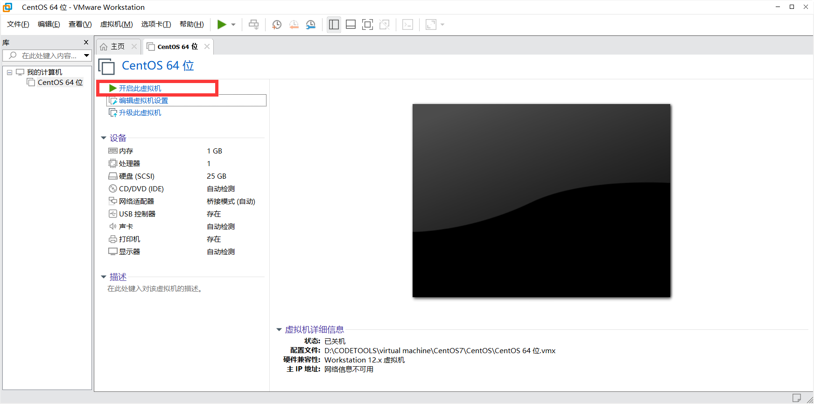
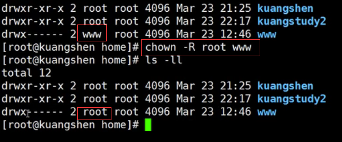
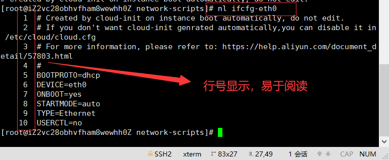
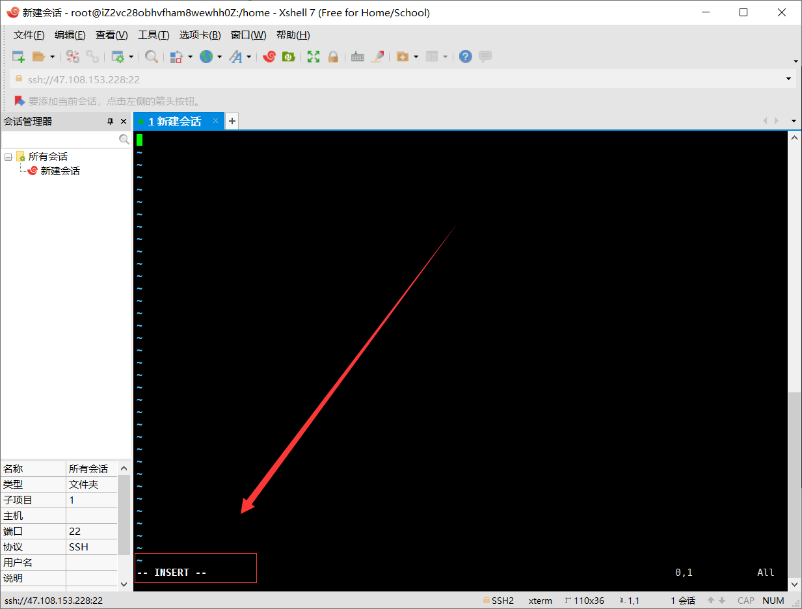
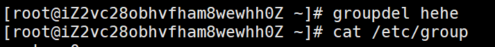
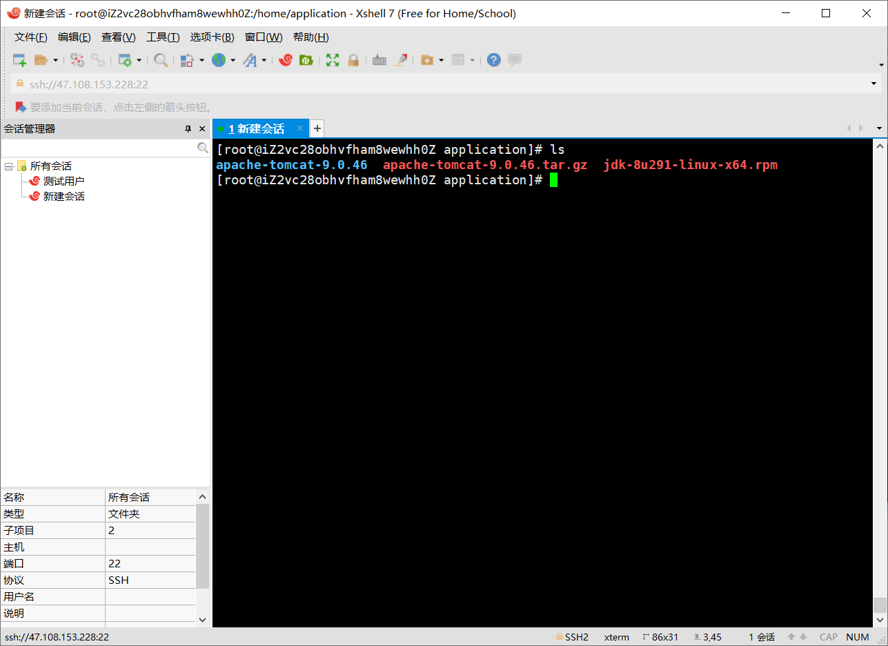

##  一、入门概述

本笔记以狂神说Linux学习视频以及资料为基础

b站up指路：https://space.bilibili.com/95256449

### 1-为什么要学Linux

在服务器端，在开发领域Linux是越来越受欢迎，很多程序员都觉得不懂点Linux都觉得不好意思，Linux在开源社区的地位依然岿然不动。尤其是作为一个后端程序员，是必须要掌握Linux的，因为这都成为了你找工作的基础门槛了，所以不得不学习！

### 2-Linux简介

Linux内核最初只是由芬兰人林纳斯.托瓦兹( Linus Torvalds )在赫尔辛基大学上学时出于个人爱好而编写的。

Linux是一套免费使用和自由传播的类Unix操作系统,是一个基于POSIX (可移植操作系统接口)和UNIX的多用户、多任务、支持多线程和多CPU的操作系统。

Linux能运行主要的UNIX工具软件、应用程序和网络协议。它支持32位和64位硬件。Linux 继承了Unix以网络为核心的设计思想，是一个性能稳定的多用户网络操作系统。

### 3-Linux发行版

发行版就是将Linux内核与应用软件做一个打包


目前市面上较知名的发行版有：Ubuntu、RedHat、CentOS、Debian、Fedora、SuSE、OpenSUSE、Arch Linux、SolusOS 等。


### 4-Linux 应用领域

今天各种场合都有使用各种 Linux 发行版，从嵌入式设备到超级计算机，并且在服务器领域确定了地位，通常服务器使用 LAMP（Linux + Apache + MySQL + PHP）或 LNMP（Linux + Nginx+ MySQL + PHP）组合。

目前 Linux 不仅在家庭与企业中使用，并且在政府中也很受欢迎。

- 巴西联邦政府由于支持 Linux 而世界闻名。
- 有新闻报道俄罗斯军队自己制造的 Linux 发布版的，做为 G.H.ost 项目已经取得成果。
- 印度的 Kerala 联邦计划在向全联邦的高中推广使用 Linux。
- 中华人民共和国为取得技术独立，在龙芯处理器中排他性地使用 Linux。
- 在西班牙的一些地区开发了自己的 Linux 发布版，并且在政府与教育领域广泛使用，如 Extremadura 地区的 gnuLinEx 和 Andalusia 地区的 Guadalinex。
- 葡萄牙同样使用自己的 Linux 发布版 Caixa Mágica，用于 Magalh?es 笔记本电脑和 e-escola 政府软件。
- 法国和德国同样开始逐步采用 Linux。

### 5-Linux vs Windows


## 二、环境搭建

Linux 的安装，安装步骤比较繁琐，现在其实云服务器挺普遍的，价格也便宜，如果直接不想搭建，也可以直接买一台学习用用！

### 1-安装CentOS（虚拟机安装，耗资源）

#### 1-1.自己安装，问题挺多也费时间

1. 可以通过镜像进行安装！

   这里是阿里云Centos7的镜像http://mirrors.aliyun.com/centos/7/isos/x86_64/

   

2. 然后手动安装，按照提示安装即可

   

3. 这一步一定注意，检查这里是否有网https://blog.csdn.net/qq_40722827/article/details/103219850

   

4. 这里就设置好密码和用户，这里的root密码就是root用户的密码，一定记住了

   

5. 然后等待安装完毕进入系统，进行登录root用户

   注意:密码是不回显的，也就是说你输入它不会有*号，永远是空白


1. 这里我们没有可视化界面需要安装可视化界面

   1. 输入以下命令，按下enter键

   ```
   yum groupinstall "X Window System"
   ```

    

   1. 检查已安装的软件以及安装后可以安装的软件。 使用以下命令，然后按“Enter”键，如下图所示：

      ```
      yum grouplist
      ```

      

   2. 安装所需的图形界面软件GNOME（GNOME Desktop），输入以下命令，并按Enter键，如下图所示：

      ```
      “yum groupinstall "GNOME Desktop”
      ```

       

      1. 等待程序安装，然后使用以下命令自查一下，installed那一栏有无GNOME

         ```
         yum grouplist 
         ```

         

      2. 重新启动系统以进入图形界面，如下图所示。解决个屁

      3. 重新安装，然后在此界面

         

      4. 直接安装了

#### 1-2.阿狂配好的centos，不想努力了

1. 首先解压

   

2. 然后使用vm虚拟机去打开

   

3. 启动即可

   

4. 搞定

   

   如果登录root用户，选择Not Listed ，用户名：root；密码：123456.

### 2-购买云服务器（推荐）

虚拟机安装后占用空间，也会有些卡顿，我们作为程序员其实可以选择购买一台自己的服务器，这样的话更加接近真实线上工作；

虚拟机安装后占用空间，也会有些卡顿，我们作为程序员其实可以选择购买一台自己的服务器，这样的话更加接近真实线上工作；

1. 阿里云购买服务器：https://www.aliyun.com/minisite/goods?userCode=0phtycgr

2. 购买完毕后，获取服务器的ip地址，重置服务器密码，就可以远程登录了

   - 获取公网IP地址

   - 修改登录密码

     

   - 查看或者修改端口

     

     

   

3. 下载xShell工具，进行远程连接使用！

   - 新建会话

     

   - 登录，用户名是root，密码是你刚刚设置的实例密码

     

   - 登录成功，这里以后就是我们的linux操作系统了

     

   - 之后可以使用xftp去执行文件传输操作

     

## 三、走进Linux系统

### 1-开机登录

开机会启动许多程序。它们在Windows叫做"服务"（service），在Linux就叫做"守护进程"（daemon）。

开机成功后，它会显示一个文本登录界面，这个界面就是我们经常看到的登录界面，在这个登录界面中会提示用户输入用户名，而用户输入的用户将作为参数传给login程序来验证用户的身份，密码是不显示的，输完回车即可！

一般来说，用户的登录方式有三种：

- 命令行登录
- ssh登录
- 图形界面登录

最高权限账户为 root，可以操作一切！

### 2-关机

在linux领域内大多用在服务器上，很少遇到关机的操作。毕竟服务器上跑一个服务是永无止境的，除非特殊情况下，不得已才会关机。

关机指令为：shutdown ；在关机之前记得sync，同步下数据

```bash
sync # 将数据由内存同步到硬盘中，一般在我们shutdown之前做。
 
shutdown # 关机指令，你可以man shutdown 来看一下帮助文档。例如你可以运行如下命令关机：
 
shutdown –h 10 # 这个命令告诉大家，计算机将在10分钟后关机
 
shutdown –h now # 立马关机
 
shutdown –h 20:25 # 系统会在今天20:25关机
 
shutdown –h +10 # 十分钟后关机
 
shutdown –r now # 系统立马重启
 
shutdown –r +10 # 系统十分钟后重启
 
reboot # 就是重启，等同于 shutdown –r now
 
halt # 关闭系统，等同于shutdown –h now 和 poweroff
```

最后总结一下，不管是重启系统还是关闭系统，首先要运行 **sync** 命令，把内存中的数据写到磁盘中。

Linux中没有输出就表示成功


但执行是成功的

### 3-系统目录结构

登录系统后，在当前命令窗口下输入命令：

```bash
ls /
```

你会看到如下图所示：


树状目录结构：（Linux的一切资源都挂载在这个 / 根节点下）


**以下是对这些目录的解释：**

- **/bin**：bin是Binary的缩写, 这个目录存放着最经常使用的命令。

- **/boot：** 这里存放的是启动Linux时使用的一些核心文件，包括一些连接文件以及镜像文件。（不要动）

- **/dev ：** dev是Device(设备)的缩写, 存放的是Linux的外部设备，在Linux中访问设备的方式和访问文件的方式是相同的。

- **/etc：** 这个目录用来存放所有的系统管理所需要的配置文件和子目录。（以后存放配置文件的地方，比如Redis、Tomcat配置等等）

- **/home**：用户的主目录，在Linux中，每个用户都有一个自己的目录，一般该目录名是以用户的账号命名的。

- **/opt**：这是给主机额外安装软件所摆放的目录。比如你安装一个ORACLE数据库则就可以放到这个目录下。默认是空的。

- **/lib**：这个目录里存放着系统最基本的动态连接共享库，其作用类似于Windows里的DLL文件。（不要动）

- **/lost+found**：这个目录一般情况下是空的，当系统非法关机后，这里就存放了一些文件。（存放突然关机的文件）

- **/media**：linux系统会自动识别一些设备，例如U盘、光驱等等，当识别后，linux会把识别的设备挂载到这个目录下。

- **/mnt**：系统提供该目录是为了让用户临时挂载别的文件系统的，我们可以将光驱挂载在/mnt/上，然后进入该目录就可以查看光驱里的内容了。（后面会把一些本地的文件挂载在这个目录下）

- **/proc**：这个目录是一个虚拟的目录，它是系统内存的映射，我们可以通过直接访问这个目录来获取系统信息。（不用管）

- **/root**：该目录为系统管理员，也称作超级权限者的用户主目录。

- **/sbin**：s就是Super User的意思，这里存放的是系统管理员使用的系统管理程序。

- **/srv**：该目录存放一些服务启动之后需要提取的数据。

- **/sys**：这是linux2.6内核的一个很大的变化。该目录下安装了2.6内核中新出现的一个文件系统 sysfs 。

- **/tmp**：这个目录是用来存放一些临时文件的。（用完即丢的文件可以放到这个目录下，如安装包等等）

- **/usr**：这是一个非常重要的目录，用户的很多应用程序和文件都放在这个目录下，类似于windows下的program files目录。

- **/usr/bin：** 系统用户使用的应用程序。

- **/usr/sbin：** 超级用户使用的比较高级的管理程序和系统守护程序。

- **/usr/src：** 内核源代码默认的放置目录。

- **/var**：这个目录中存放着在不断扩充着的东西，我们习惯将那些经常被修改的目录放在这个目录下。包括各种日志文件。

- **/run**：是一个临时文件系统，存储系统启动以来的信息。当系统重启时，这个目录下的文件应该被删掉或清除。

- /www：存放服务器网站相关的资源，环境以及项目等等。

  

## 四、常用命令（重点）

table键位可以自动补全

### 1-目录管理

cd …表示返回上级目录，cd 文件名称，表示进入

- 绝对路径：

  路径的写法，由根目录 / 写起，例如：/usr/share/doc 这个目录。

- 相对路径：

  路径的写法，不是由 / 写起，例如由 /usr/share/doc 要到 /usr/share/man 底下时，可以写成：cd ../man 这就是相对路径的写法啦！

```shell
接下来我们就来看几个常见的处理目录的命令吧：

ls: 列出目录

cd：切换目录

pwd：显示目前的目录

mkdir：创建一个新的目录

rmdir：删除一个空的目录

cp: 复制文件或目录

rm: 移除文件或目录

mv: 移动文件与目录，或修改文件与目录的名称

你可以使用 man [命令] 来查看各个命令的使用文档，如 ：man cp。
```

#### 1-1.ls（列出目录）

在Linux系统当中， ls 命令可能是最常被运行的。

**语法：**

```shell
[root@www ~]# ls [-aAdfFhilnrRSt] 目录名称
```

**选项与参数：**

- -a ：全部的文件，连同隐藏文件( 开头为 . 的文件) 一起列出来(常用)
- -l ：长数据串列出，包含文件的属性与权限等等数据；(常用)

将目录下的所有文件列出来(含属性与隐藏档)

```shell
[root@www ~]# ls -al ~ 同时al
```

**测试：**


#### 1-2.cd（切换目录）

cd是Change Directory的缩写，这是用来变换工作目录的命令。

**语法：**

```shell
cd [相对路径或绝对路径]
```

**测试：**


加了/就是绝对路径，../是相对路径


#### 1-3.pwd( 显示用户目前所在的目录 )

pwd 是 **Print Working Directory** 的缩写，也就是显示目前所在目录的命令。

**语法：**

```bash
[root@kuangshen kuangstudy]#pwd [-P]
```

选项与参数：**-P** ：显示出确实的路径，而非使用连接(link) 路径。

**测试：**


#### 1-4.mkdir（创建新目录）

如果想要创建新的目录的话，那么就使用mkdir (make directory)吧。

**语法：**

```bash
mkdir [-mp] 目录名称
```

**选项与参数：**

- -m ：配置文件的权限喔！直接配置，不需要看默认权限 (umask) 的脸色～
- -p ：帮助你直接将所需要的目录(包含上一级目录)递归创建起来！

**测试：**


#### 1-5.rmdir ( 删除空的目录 )

仅能删除空的目录，如果存在文件需要先删除文件，递归删除多个目录加上-p即可

**语法：**

```bash
 rmdir [-p] 目录名称
```

**选项与参数：**

**-p ：**连同上一级『空的』目录也一起删除（类比创建文件夹的时候）

**测试：**


#### 1-6.cp ( 复制文件或目录 )

**语法：**

```bash
[root@www ~]# cp [-adfilprsu] 来源档(source) 目标档(destination)
[root@www ~]# cp [options] source1 source2 source3 .... directory
cp 文件名 路径
```

选项与参数：

- **-a：**相当于 -pdr 的意思，至于 pdr 请参考下列说明；(常用)
- **-p：**连同文件的属性一起复制过去，而非使用默认属性(备份常用)；
- **-d：**若来源档为连结档的属性(link file)，则复制连结档属性而非文件本身；
- **-r：**递归持续复制，用于目录的复制行为；(常用)
- **-f：**为强制(force)的意思，若目标文件已经存在且无法开启，则移除后再尝试一次；
- **-i：**若目标档(destination)已经存在时，在覆盖时会先询问动作的进行(常用)
- **-l：**进行硬式连结(hard link)的连结档创建，而非复制文件本身。
- **-s：**复制成为符号连结档 (symbolic link)，亦即『捷径』文件；
- **-u：**若 destination 比 source 旧才升级 destination ！

**测试：**


#### 1-7.rm ( 移除文件或目录 )

**语法：**

```bash
rm [-fir] 文件或目录
```

**选项与参数：**

- -f ：就是 force 的意思，忽略不存在的文件，不会出现警告信息；
- -i ：互动模式，在删除前会询问使用者是否执行动作
- -r ：递归删除！最常用在目录的删除了！这是非常危险的选项！！！

**测试：**


#### 1-8.mv ( 移动文件与目录，或修改名称 )

**语法：**

```bash
[root@www ~]# mv [-fiu] source destination
[root@www ~]# mv [options] source1 source2 source3 .... directory
```

**选项与参数：**

- -f ：force 强制的意思，如果目标文件已经存在，不会询问而直接覆盖；
- -i ：若目标文件 (destination) 已经存在时，就会询问是否覆盖！
- -u ：若目标文件已经存在，且 source 比较新，才会升级 (update)

**测试：**


### 2-基本属性(重要)

#### 2-1.看懂文件属性

Linux系统是一种典型的多用户系统，不同的用户处于不同的地位，拥有不同的权限。为了保护系统的安全性，Linux系统对不同的用户访问同一文件（包括目录文件）的权限做了不同的规定。

在Linux中我们可以使用`ll`或者`ls –l`命令来显示一个文件的属性以及文件所属的用户和组，如：


实例中，文件的第一个属性用"d"表示。"d"在Linux中代表该文件是一个目录文件。

前面十个字母:

在Linux中第一个字母代表这个文件是目录、文件或链接文件等等：

- 当为[ d ]则是目录
- 当为[ - ]则是文件；
- 若是[ l ]则表示为链接文档 ( link file )；快捷方式？所以l开头必有一个箭头指向具体文件
- 若是[ b ]则表示为装置文件里面的可供储存的接口设备 ( 可随机存取装置 )；
- 若是[ c ]则表示为装置文件里面的串行端口设备，例如键盘、鼠标 ( 一次性读取装置 )。

第二到第十个字母，以三个为一组，且均为『rwx』 的三个参数的组合。

- [ r ]代表可读(read)、[ w ]代表可写(write)、[ x ]代表可执行(execute)。

要注意的是，这三个权限的位置不会改变，如果没有权限，就会出现减号[ - ]而已。

每个文件的属性由左边第一部分的10个字符来确定，如图：


3种不同级别的用户的权限，看图理解属主和属组


#### 2-2.修改文件属性

1. **chgrp：更改文件属组**

   ```bash
   chgrp [-R] 属组名 文件名
   ```

   -R：递归更改文件属组，就是在更改某个目录文件的属组时，如果加上-R的参数，那么该目录下的所有文件的属组都会更改。

   

2. **chown：更改文件属主，也可以同时更改文件属组**

   ```bash
   chown [–R] 属主名 文件名
   chown [-R] 属主名：属组名 文件名
   ```

   

3. **chmod：更改文件9个属性**

   ```bash
   chmod [-R] xyz 文件或目录
   ```

   Linux文件属性有两种设置方法，一种是数字，一种是符号。

   Linux文件的基本权限就有九个，分别是owner/group/others三种身份各有自己的read/write/execute权限。

   先复习一下刚刚上面提到的数据：文件的权限字符为：『-rwxrwxrwx』， 这九个权限是三个三个一组的！其中，我们可以使用数字来代表各个权限，各权限的分数对照表如下：

   ```bash
   r:4      w:2         x:1
   ```

   每种身份(owner/group/others)各自的三个权限(r/w/x)分数是需要累加的，例如当权限为：[ rwxrwx---] 分数则是：

   - owner = rwx = 4+2+1 = 7

   - group = rwx = 4+2+1 = 7

   - others= — = 0+0+0 = 0

     ```bash
     chmod 770 filename
     ```

总结：

现在给一个目录的权限，3组权限对应3个数字


#### 2-3.chmod详细使用方法

Linux chmod（英文全拼：change mode）命令是控制用户对文件的权限的命令

Linux/Unix 的文件调用权限分为三级 : 文件所有者（Owner）、用户组（Group）、其它用户（Other Users）。


只有文件所有者和超级用户可以修改文件或目录的权限。可以使用绝对模式（八进制数字模式），符号模式指定文件的权限。


**使用权限** : 所有使用者

##### 语法

```bash
chmod [-cfvR] [--help] [--version] mode file...
```

##### 参数说明

mode : 权限设定字串，格式如下 :

```bash
[ugoa...][[+-=][rwxX]...][,...]
```

其中：

- u 表示该文件的拥有者，g 表示与该文件的拥有者属于同一个群体(group)者，o 表示其他以外的人，a 表示这三者皆是。
- \+ 表示增加权限、- 表示取消权限、= 表示唯一设定权限。
- r 表示可读取，w 表示可写入，x 表示可执行，X 表示只有当该文件是个子目录或者该文件已经被设定过为可执行。

其他参数说明：

- -c : 若该文件权限确实已经更改，才显示其更改动作
- -f : 若该文件权限无法被更改也不要显示错误讯息
- -v : 显示权限变更的详细资料
- -R : 对目前目录下的所有文件与子目录进行相同的权限变更(即以递归的方式逐个变更)
- --help : 显示辅助说明
- --version : 显示版本

##### 符号模式

使用符号模式可以设置多个项目：who（用户类型），operator（操作符）和 permission（权限），每个项目的设置可以用逗号隔开。 命令 chmod 将修改 who 指定的用户类型对文件的访问权限，用户类型由一个或者多个字母在 who 的位置来说明，如 who 的符号模式表所示:

| who  | 用户类型 | 说明                   |
| :--- | :------- | :--------------------- |
| `u`  | user     | 文件所有者             |
| `g`  | group    | 文件所有者所在组       |
| `o`  | others   | 所有其他用户           |
| `a`  | all      | 所有用户, 相当于 *ugo* |

operator 的符号模式表:

| Operator | 说明                                                   |
| :------- | :----------------------------------------------------- |
| `+`      | 为指定的用户类型增加权限                               |
| `-`      | 去除指定用户类型的权限                                 |
| `=`      | 设置指定用户权限的设置，即将用户类型的所有权限重新设置 |

permission 的符号模式表:

| 模式 | 名字         | 说明                                                         |
| :--- | :----------- | :----------------------------------------------------------- |
| `r`  | 读           | 设置为可读权限                                               |
| `w`  | 写           | 设置为可写权限                                               |
| `x`  | 执行权限     | 设置为可执行权限                                             |
| `X`  | 特殊执行权限 | 只有当文件为目录文件，或者其他类型的用户有可执行权限时，才将文件权限设置可执行 |
| `s`  | setuid/gid   | 当文件被执行时，根据who参数指定的用户类型设置文件的setuid或者setgid权限 |
| `t`  | 粘贴位       | 设置粘贴位，只有超级用户可以设置该位，只有文件所有者u可以使用该位 |

##### 八进制语法

chmod命令可以使用八进制数来指定权限。文件或目录的权限位是由9个权限位来控制，每三位为一组，它们分别是文件所有者（User）的读、写、执行，用户组（Group）的读、写、执行以及其它用户（Other）的读、写、执行。历史上，文件权限被放在一个比特掩码中，掩码中指定的比特位设为1，用来说明一个类具有相应的优先级。

| #    | 权限           | rwx  | 二进制 |
| :--- | :------------- | :--- | :----- |
| 7    | 读 + 写 + 执行 | rwx  | 111    |
| 6    | 读 + 写        | rw-  | 110    |
| 5    | 读 + 执行      | r-x  | 101    |
| 4    | 只读           | r--  | 100    |
| 3    | 写 + 执行      | -wx  | 011    |
| 2    | 只写           | -w-  | 010    |
| 1    | 只执行         | --x  | 001    |
| 0    | 无             | ---  | 000    |

例如， 765 将这样解释：

- 所有者的权限用数字表达：属主的那三个权限位的数字加起来的总和。如 rwx ，也就是 4+2+1 ，应该是 7。
- 用户组的权限用数字表达：属组的那个权限位数字的相加的总和。如 rw- ，也就是 4+2+0 ，应该是 6。
- 其它用户的权限数字表达：其它用户权限位的数字相加的总和。如 r-x ，也就是 4+0+1 ，应该是 5。

##### 实例

将文件 file1.txt 设为所有人皆可读取 :

```bash
chmod ugo+r file1.txt
```

将文件 file1.txt 设为所有人皆可读取 :

```bash
chmod a+r file1.txt
```

将文件 file1.txt 与 file2.txt 设为该文件拥有者，与其所属同一个群体者可写入，但其他以外的人则不可写入 :

```bash
chmod ug+w,o-w file1.txt file2.txt
```

为 ex1.py 文件拥有者增加可执行权限:

```bash
chmod u+x ex1.py
```

将目前目录下的所有文件与子目录皆设为任何人可读取 :

```bash
chmod -R a+r *
```

此外chmod也可以用数字来表示权限如 :

```bash
chmod 777 file
```

语法为：

```bash
chmod abc file
```

其中a,b,c各为一个数字，分别表示User、Group、及Other的权限。

###### r=4，w=2，x=1

- 若要 rwx 属性则 4+2+1=7；
- 若要 rw- 属性则 4+2=6；
- 若要 r-x 属性则 4+1=5。

```bash
chmod a=rwx file
```

和

```bash
chmod 777 file
```

效果相同

```bash
chmod ug=rwx,o=x file
```

和

```bash
chmod 771 file
```

效果相同

若用 **chmod 4755 filename** 可使此程序具有 root 的权限。

##### 更多说明

| `命令`                                     | 说明                                                         |
| :----------------------------------------- | :----------------------------------------------------------- |
| `chmod a+r file`                           | 给file的所有用户增加读权限                                   |
| `chmod a-x file`                           | 删除file的所有用户的执行权限                                 |
| `chmod a+rw file`                          | 给file的所有用户增加读写权限                                 |
| `chmod +rwx file`                          | 给file的所有用户增加读写执行权限                             |
| `chmod u=rw,go= file`                      | 对file的所有者设置读写权限，清空该用户组和其他用户对file的所有权限（空格代表无权限） |
| `chmod -R u+r,go-r docs`                   | 对目录docs和其子目录层次结构中的所有文件给用户增加读权限，而对用户组和其他用户删除读权限 |
| `chmod 664 file`                           | 对file的所有者和用户组设置读写权限, 为其其他用户设置读权限   |
| `chmod 0755 file`                          | 相当于`u=rwx (4+2+1),go=rx (4+1 & 4+1)`。`0` 没有特殊模式。  |
| `chmod 4755 file`                          | `4`设置了设置用户ID位，剩下的相当于 u=rwx (4+2+1),go=rx (4+1 & 4+1)。 |
| `find path/ -type d -exec chmod a-x {} \;` | 删除可执行权限对path/以及其所有的目录（不包括文件）的所有用户，使用'-type f'匹配文件 |
| `find path/ -type d -exec chmod a+x {} \;` | 允许所有用户浏览或通过目录path/                              |

### 3-文件内容查看（重要）

Linux系统中使用以下命令来查看文件的内容：

- cat 由第一行开始显示文件内容
- tac 从最后一行开始显示，可以看出 tac 是 cat 的倒着写！
- nl 显示的时候，顺道输出行号！
- more 一页一页的显示文件内容
- less 与 more 类似，但是比 more 更好的是，他可以往前翻页！
- head 只看头几行
- tail 只看尾巴几行

你可以使用 *man [命令]*来查看各个命令的使用文档，如 ：man cp。

- 打开文件之后可以查找内容，语法如下：

```bash
/查找的内容（向下查找）
？查找的内容（向上查找）
n下一个
N上一个
```

咱们首先进入*/etc/sysconfig/network-scripts/*

ifconfig类似于windows系统的ipconfig

#### 3-1.cat

由第一行开始显示文件内容

- **语法：**

  ```bash
  cat [-AbEnTv]
  ```

- **选项与参数：**

  - -A ：相当于 -vET 的整合选项，可列出一些特殊字符而不是空白而已；
  - -b ：列出行号，仅针对非空白行做行号显示，空白行不标行号！
  - -E ：将结尾的断行字节 $ 显示出来；
  - -n ：列印出行号，连同空白行也会有行号，与 -b 的选项不同；
  - -T ：将 [tab] 按键以 ^I 显示出来；
  - -v ：列出一些看不出来的特殊字符

- 测试：

  

#### 3-2.tac

tac与cat命令刚好相反，文件内容从最后一行开始显示，可以看出 tac 是 cat 的倒着写！如：


#### 3-3.nl 显示行号

- **语法：**

  ```bash
  nl [-bnw] 文件
  ```

- **选项与参数：**

  - -b ：指定行号指定的方式，主要有两种：-b a ：表示不论是否为空行，也同样列出行号(类似 cat -n)；-b t ：如果有空行，空的那一行不要列出行号(默认值)；
  - -n ：列出行号表示的方法，主要有三种：-n ln ：行号在荧幕的最左方显示；-n rn ：行号在自己栏位的最右方显示，且不加 0 ；-n rz ：行号在自己栏位的最右方显示，且加 0 ；
  - -w ：行号栏位的占用的位数。

- **测试：**

  

#### 3-4.more 一页一页翻动

- 在 more 这个程序的运行过程中，你有几个按键可以按的：

  - 空白键 (space)：代表向下翻一页；
  - Enter ：代表向下翻『一行』；
  - /字串 ：代表在这个显示的内容当中，向下搜寻『字串』这个关键字；
  - :f ：立刻显示出档名以及目前显示的行数；
  - q ：代表立刻离开 more ，不再显示该文件内容。
  - b 或 [ctrl]-b ：代表往回翻页，不过这动作只对文件有用，对管线无用。

- 测试：

  

#### 3-5.less 一页一页翻动

- less运行时可以输入的命令有：
  - 空白键 ：向下翻动一页；
  - [pagedown]：向下翻动一页；
  - [pageup] ：向上翻动一页；
  - /字串 ：向下搜寻『字串』的功能；
  - ?字串 ：向上搜寻『字串』的功能；
  - n ：重复前一个搜寻 (与 / 或 ? 有关！)
  - N ：反向的重复前一个搜寻 (与 / 或 ? 有关！)
  - q ：离开 less 这个程序；

#### 3-6.head 取出文件前面几行

- 语法：

  ```bash
  head [-n number] 文件
  ```

- 选项与参数：

  - **-n** 后面接数字，代表显示几行的意思！

默认的情况中，显示前面 10 行！若要显示前 20 行，就得要这样：


#### 3-7.tail 取出文件后面几行（类比head）

- **语法：**

  ```bash
  tail [-n number] 文件
  ```

- 选项与参数：

  - -n ：后面接数字，代表显示几行的意思

## 五、软链接和硬链接

Linux的链接分为两种:硬链接、软链接!

- 硬链接：A—B ,假设B是A的硬链接,那么他们两个指向了同一个文件!允许一个文件拥有多个路径,用户可以通过这种机制建立硬链接到一些重要文件上,防止误删!

- 软链接：类似Window下的快捷方式,删除的源文件,快捷方式也访问不了!

- **相关命令：**

  1. 创建链接ln命令
  2. touch命令创建文件
  3. echo向窗口输入文本

- 示例：

### 创建硬链接和软链接

  

我们再使用ll命令查看文件属性

  

然后使用echo写入数据到f1，最后查看f1，f2，f3的相关数据

  

### 注意事项

#### 硬链接与文件复制的区别

- **硬链接**：不会复制文件内容，而是在文件系统中为文件创建一个额外的指向同一物理文件数据的目录项。文件内容存储在相同的物理位置。多个硬链接共享相同的文件数据，删除其中一个链接不会影响实际文件内容。所有硬链接指向相同的文件内容，修改其中任意一个链接的文件内容，其他硬链接也会显示相同的更改。只有当最后一个硬链接被删除时，文件内容才会从磁盘上真正移除。单独删除某个硬链接并不会影响其他硬链接的存在。
- **复制文件**：会在存储设备上创建一个独立的副本。即使内容相同，两个文件会占用两块不同的存储空间。删除或修改原文件和副本不会影响另一方，它们是独立的实体。

#### 硬链接与软链接的区别

- **硬链接（Hard Link）**

  - **指向方式**：硬链接直接指向文件的物理数据块（i-node），因此多个硬链接指向同一个文件的实际数据。

  - **文件系统限制**：硬链接只能在同一文件系统中创建，不能跨越不同的文件系统。

  - **删除影响**：如果删除一个硬链接，其他硬链接仍然存在，数据不会丢失。只有当所有硬链接都被删除后，数据才会被释放。

  - **文件属性**：硬链接与原文件共享相同的文件属性（如权限、所有者、时间戳等）。

- **软链接（Symbolic Link）**

  - **指向方式**：软链接是一种特殊类型的文件，它包含一个指向目标文件路径的路径名，而不是直接指向数据块。

  - **文件系统限制**：软链接可以跨越不同的文件系统，可以链接到任何文件或目录。

  - **删除影响**：如果删除目标文件，软链接会变成悬空链接（dangling link），即指向一个不存在的文件。

  - **文件属性**：软链接有自己独立的文件属性，与目标文件的属性不同。

## 六、Vim编辑器

### 1-什么是Vim编辑器

- Vim相当于vi的升级版

- Vim是从 vi 发展出来的一个文本编辑器。代码补完、编译及错误跳转等方便编程的功能特别丰富，在程序员中被广泛使用。

- 简单的来说， vi 是老式的字处理器，不过功能已经很齐全了，但是还是有可以进步的地方。

- vim 则可以说是程序开发者的一项很好用的工具。

- 所有的 Unix Like 系统都会内建 vi 文书编辑器，其他的文书编辑器则不一定会存在。

- 连 vim 的官方网站 (http://www.vim.org) 自己也说 vim 是一个程序开发工具而不是文字处理软件。

- vim 键盘图：

  

### 2-三种使用模式（重要）

基本上 vi/vim 共分为三种模式，分别是**命令模式（Command mode）**，**输入模式（Insert mode）**和**底线命令模式（Last line mode）**。这三种模式的作用分别是：

1. **命令模式：**

   用户刚刚启动 vi/vim，便进入了命令模式。

   此状态下敲击键盘动作会被Vim识别为命令，而非输入字符。比如我们此时按下i，并不会输入一个字符，i被当作了一个命令。

   以下是常用的几个命令：

   - **i** 切换到输入模式，以输入字符。
   - **x** 删除当前光标所在处的字符。
   - **:** 切换到底线命令模式，以在最底一行输入命令。

2. **输入模式：**

   在命令模式下按下i就进入了输入模式。

   在输入模式中，可以使用以下按键：

   - **字符按键以及Shift组合**，输入字符
   - **ENTER**，回车键，换行
   - **BACK SPACE**，退格键，删除光标前一个字符
   - **DEL**，删除键，删除光标后一个字符
   - **方向键**，在文本中移动光标
   - **HOME**/**END**，移动光标到行首/行尾
   - **Page Up**/**Page Down**，上/下翻页
   - **Insert**，切换光标为输入/替换模式，光标将变成竖线/下划线
   - **ESC**，退出输入模式，切换到命令模式

3. **底线命令模式**

   在命令模式下按下:（英文冒号）就进入了底线命令模式。

   底线命令模式可以输入单个或多个字符的命令，可用的命令非常多。

   在底线命令模式中，基本的命令有（已经省略了冒号）：

   - q 退出程序
   - w 保存文件

   按ESC键可随时退出底线命令模式。

   简单的说，我们可以将这三个模式想成底下的图标来表示：

   

### 3-测试

1. 使用vim peng命令进入命令模式

   

2. 在命令模式中按下i，进入输入模式

   

3. 输入一些字符后，按下esc可以退出输入模式，返回到命令模式

   

4. 再命令模式中输入：wq，进行保存并退出

   

5. 查看文件内容

   

6. 使用vim命令的注意点：

   

### 4-Vim 按键说明（需要时查）

**第一部分：一般模式可用的光标移动、复制粘贴、搜索替换等**

| 移动光标的方法     | 11                                                           |
| ------------------ | ------------------------------------------------------------ |
| h 或 向左箭头键(←) | 光标向左移动一个字符                                         |
| j 或 向下箭头键(↓) | 光标向下移动一个字符                                         |
| k 或 向上箭头键(↑) | 光标向上移动一个字符                                         |
| l 或 向右箭头键(→) | 光标向右移动一个字符                                         |
| [Ctrl] + [f]       | 屏幕『向下』移动一页，相当于 [Page Down]按键 (常用)          |
| [Ctrl] + [b]       | 屏幕『向上』移动一页，相当于 [Page Up] 按键 (常用)           |
| [Ctrl] + [d]       | 屏幕『向下』移动半页                                         |
| [Ctrl] + [u]       | 屏幕『向上』移动半页                                         |
| +                  | 光标移动到非空格符的下一行                                   |
| -                  | 光标移动到非空格符的上一行                                   |
| n< space>          | 那个 n 表示『数字』，例如 20 。按下数字后再按空格键，光标会向右移动这一行的 n 个字符。 |
| 0 或功能键[Home]   | 这是数字『 0 』：移动到这一行的最前面字符处 (常用)           |
| $ 或功能键[End]    | 移动到这一行的最后面字符处(常用)                             |
| H                  |                                                              |
| M                  | 光标移动到这个屏幕的中央那一行的第一个字符                   |
| L                  | 光标移动到这个屏幕的最下方那一行的第一个字符                 |
| G                  | 移动到这个档案的最后一行(常用)                               |
| nG                 | n 为数字。移动到这个档案的第                                 |
| gg                 | 移动到这个档案的第一行，相当于 输入 1 +  G (常用)            |
| n< Enter>          | n 为数字。光标向下移动 n 行(常用)                            |

| 搜索替换 |                                                              |
| -------- | ------------------------------------------------------------ |
| /word    | 向光标之下寻找一个名称为 word 的字符串。例如要在档案内搜寻 vbird 这个字符串，就输入 /vbird 即可！(常用) |
| ?word    | 向光标之上寻找一个字符串名称为 word 的字符串。               |
| n        | 这个 n 是英文按键。代表重复前一个搜寻的动作。举例来说， 如果刚刚我们执行 /vbird 去向下搜寻 vbird 这个字符串，则按下 n 后，会向下继续搜寻下一个名称为 vbird 的字符串。如果是执行 ?vbird 的话，那么按下 n 则会向上继续搜寻名称为 vbird 的字符串！ |
| N        | 这个 N 是英文按键。与 n 刚好相反，为『反向』进行前一个搜寻动作。例如 /vbird 后，按下 N 则表示『向上』搜寻 vbird 。 |

| 删除、复制与粘贴 |                                                              |
| ---------------- | ------------------------------------------------------------ |
| x, X             | 在一行字当中，x 为向后删除一个字符 (相当于 [del] 按键)， X 为向前删除一个字符(相当于 [backspace] 亦即是退格键) (常用) |
| nx               | n 为数字，连续向后删除 n 个字符。举例来说，我要连续删除 10 个字符， 『10x』。 |
| dd               | 删除游标所在的那一整行(常用)                                 |
| ndd              | n 为数字。删除光标所在的向下 n 行，例如 20dd 则是删除 20 行 (常用) |
| d1G              | 删除光标所在到第一行的所有数据                               |
| dG               | 删除光标所在到最后一行的所有数据                             |
| d$               | 删除游标所在处，到该行的最后一个字符                         |
| d0               | 那个是数字的 0 ，删除游标所在处，到该行的最前面一个字符      |
| yy               | 复制游标所在的那一行(常用)                                   |
| nyy              | n 为数字。复制光标所在的向下 n 行，例如 20yy 则是复制 20 行(常用) |
| y1G              | 复制游标所在行到第一行的所有数据                             |
| yG               | 复制游标所在行到最后一行的所有数据                           |
| y0               | 复制光标所在的那个字符到该行行首的所有数据                   |
| y$               | 复制光标所在的那个字符到该行行尾的所有数据                   |
| p, P             | p 为将已复制的数据在光标下一行贴上，P 则为贴在游标上一行！举例来说，我目前光标在第 20 行，且已经复制了 10 行数据。则按下 p 后， 那 10 行数据会贴在原本的 20 行之后，亦即由 21 行开始贴。但如果是按下 P 呢？那么原本的第 20 行会被推到变成 30 行。(常用) |
| J                | 将光标所在行与下一行的数据结合成同一行                       |
| c                | 重复删除多个数据，例如向下删除 10 行，[ 10cj ]               |
| u                | 复原前一个动作。(常用)                                       |
| [Ctrl]+r         | 重做上一个动作。(常用)                                       |

**第二部分：一般模式切换到编辑模式的可用的按钮说明**

| 进入输入或取代的编辑模式 |                                                              |
| ------------------------ | ------------------------------------------------------------ |
| i, I                     | 进入输入模式(Insert mode)：i 为『从目前光标所在处输入』， I 为『在目前所在行的第一个非空格符处开始输入』。(常用) |
| a, A                     | 进入输入模式(Insert mode)：a 为『从目前光标所在的下一个字符处开始输入』， A 为『从光标所在行的最后一个字符处开始输入』。(常用) |
| o, O                     | 进入输入模式(Insert mode)：这是英文字母 o 的大小写。o 为『在目前光标所在的下一行处输入新的一行』；O 为在目前光标所在处的上一行输入新的一行！(常用) |
| r, R                     | 进入取代模式(Replace mode)：r 只会取代光标所在的那一个字符一次；R会一直取代光标所在的文字，直到按下 ESC 为止；(常用) |
| [Esc]                    | 退出编辑模式，回到一般模式中(常用)                           |

**第三部分：一般模式切换到指令行模式的可用的按钮说明**

| 指令行的储存、离开等指令 |                                                              |
| ------------------------ | ------------------------------------------------------------ |
| :w                       | 将编辑的数据写入硬盘档案中(常用)                             |
| :w!                      | 若文件属性为『只读』时，强制写入该档案。不过，到底能不能写入， 还是跟你对该档案的档案权限有关！ |
| :q                       | 离开 vi (常用)                                               |
| :q!                      | 若曾修改过档案，又不想储存，使用 ! 为强制离开不储存档案。注意一下，那个惊叹号 (!) 在 vi 当中，常常具有『强制』的意思～ |
| :wq                      | 储存后离开，若为 :wq! 则为强制储存后离开 (常用)              |
| ZZ                       | 这是大写的 Z 喔！若档案没有更动，则不储存离开，若档案已经被更动过，则储存后离开！ |
| :w [filename]            | 将编辑的数据储存成另一个档案（类似另存新档）                 |
| :r [filename]            | 在编辑的数据中，读入另一个档案的数据。亦即将 『filename』 这个档案内容加到游标所在行后面 |
| :n1,n2 w [filename]      | 将 n1 到 n2 的内容储存成 filename 这个档案。                 |
| :! command               | 暂时离开 vi 到指令行模式下执行 command 的显示结果！例如 『:! ls /home』即可在 vi 当中看 /home 底下以 ls 输出的档案信息！ |
| :set nu                  | 显示行号，设定之后，会在每一行的前缀显示该行的行号           |
| :set nonu                | 与 set nu 相反，为取消行号！                                 |

## 七、账号管理

### 1-简介

- Linux系统是一个多用户多任务的分时操作系统，任何一个要使用系统资源的用户，都必须首先向系统管理员申请一个账号，然后以这个账号的身份进入系统。
- 用户的账号一方面可以帮助系统管理员对使用系统的用户进行跟踪，并控制他们对系统资源的访问；另一方面也可以帮助用户组织文件，并为用户提供安全性保护。
- 每个用户账号都拥有一个唯一的用户名和各自的口令。
- 用户在登录时键入正确的用户名和口令后，就能够进入系统和自己的主目录。
- 实现用户账号的管理，要完成的工作主要有如下几个方面：
  - 用户账号的添加、删除与修改。
  - 用户口令的管理。
  - 用户组的管理。

### 2-用户账号的管理

用户账号的管理工作主要涉及到用户账号的添加、修改和删除。

添加用户账号就是在系统中创建一个新账号，然后为新账号分配用户号、用户组、主目录和登录Shell等资源。

#### 2-1.添加账号 useradd

1. 语法

```bash
useradd 选项 用户名
```

1. 参数说明：
   - 选项 :
     - -c comment 指定一段注释性描述
     - -d 目录 指定用户主目录，如果此目录不存在，则同时使用-m选项，可以创建主目录
     - -g 用户组 指定用户所属的用户组
     - -G 用户组，用户组 指定用户所属的附加组
     - -m 使用者目录如不存在则自动建立
     - -s Shell文件 指定用户的登录Shell
     - -u 用户号 指定用户的用户号，如果同时有-o选项，则可以重复使用其他用户的标识号
   - 用户名 :
     - 指定新账号的登录名
2. 测试：


一切皆文件

增加用户账号就是在/etc/passwd文件中为新用户增加一条记录，同时更新其他系统文件如/etc/shadow, /etc/group等。

#### 2-2.删除用户

如果一个用户的账号不再使用，可以从系统中删除。

删除用户账号就是要将/etc/passwd等系统文件中的该用户记录删除，必要时还删除用户的主目录。

1. 语法：

   ```
   userdel 选项 用户名
   ```

   常用的选项是 **-r**，它的作用是把用户的主目录一起删除。

   此命令删除用户kuangshen在系统文件中（主要是/etc/passwd, /etc/shadow, /etc/group等）的记录，同时删除用户的主目录。

2. 测试：


#### 2-3.修改用户

修改用户账号就是根据实际情况更改用户的有关属性，如用户号、主目录、用户组、登录Shell等。

1. 语法

   ```
   usermod 对应修改的内容 修改哪个用户
   ```

   常用的选项包括-c, -d, -m, -g, -G, -s, -u以及-o等，这些选项的意义与useradd命令中的选项一样，可以为用户指定新的资源值。

2. 例如：

   ```bash
   # usermod -s /bin/ksh -d /home/z –g developer kuangshen
   ```

   此命令将用户kuangshen的登录Shell修改为ksh，主目录改为/home/z，用户组改为developer。

#### 2-4.Linux下如何切换用户

1. 切换用户的命令为：su username 【username是你的用户名哦】

   

2. 从普通用户切换到root用户，还可以使用命令：sudo su

3. 在终端输入exit或logout或使用快捷方式ctrl+d，可以退回到原来用户，其实ctrl+d也是执行的exit命令

4. 在切换用户时，如果想在切换用户之后使用新用户的工作环境，可以在su和username之间加-，例如：【su - root】

5. $表示普通用户，#表示超级用户，也就是root用户

注意：在阿里云买的服务器主机名可能是一个很乱的字符串，这个是可以修改的

- 使用命令：

  ```
  hostname 要修改的名字
  ```

  重启后修改成功！

### 3-用户口令(密码)的管理

用户管理的一项重要内容是用户口令的管理。用户账号刚创建时没有口令，但是被系统锁定，无法使用，必须为其指定口令后才可以使用，即使是指定空口令。

指定和修改用户口令的Shell命令是passwd。超级用户可以为自己和其他用户指定口令，普通用户只能用它修改自己的口令。

1. 语法：

   ```
   passwd 选项 用户名
   ```

2. 可使用的选项：

   - -l 锁定口令，即禁用账号。
   - -u 口令解锁。
   - -d 使账号无口令。
   - -f 强迫用户下次登录时修改口令。

3. 测试：

   - 超级用户root：

     

     此时可以使用其他的用户名和密码登录

### 4-用户组管理

- 每个用户都有一个用户组，系统可以对一个用户组中的所有用户进行集中管理。
- 不同Linux 系统对用户组的规定有所不同，如Linux下的用户属于与它同名的用户组，这个用户组在创建用户时同时创建。
- 用户组的管理涉及用户组的添加、删除和修改。组的增加、删除和修改实际上就是对/etc/group文件的更新。

#### 4-1.增加一个新的用户组

1. 语法：

   ```
   groupadd 选项 用户组
   ```

2. 可以使用的选项有：

   - **-g GID** 指定新用户组的组标识号（GID），就是自定义一个ID
   - **-o** 一般与-g选项同时使用，表示新用户组的GID可以与系统已有用户组的GID相同

3. 测试：

   创建完用户组后可以得到一个组的id ,这个id是可以指定的，如果不指定就是自增。这里咱们创建了一个自定义的9999的id的组

   

   然后查看

   

#### 4-2.删除用户组

1. 语法：

   ```
   groupdel 组名
   ```

2. 测试：

   执行代码

   

   查看hehe组不存在了

   

#### 4-3.修改用户组信息

1. 语法：

   ```
   groupmod 选项 组名
   ```

2. 可以使用的选项有：

   - -g Gid，改gid
   - -n newname，改名字

3. 测试：

   咱们修改yess的gid和name

   

   查看，修改成功！YADAZE！

   

#### 4-4.切换组

- 如果一个用户同时属于多个用户组，那么用户可以在用户组之间切换，以便具有其他用户组的权限。

- 用户可以在登录后，使用命令newgrp切换到其他用户组，这个命令的参数就是目的用户组。例如：

  ```bash
  newgrp root
  ```

- 这条命令将当前用户切换到root用户组，前提条件是root用户组确实是该用户的主组或附加组。

### 5-扩展（了解）

- 完成用户管理的工作有许多种方法，但是每一种方法实际上都是对有关的系统文件进行修改
- 与用户和用户组相关的信息都存放在一些系统文件中，这些文件包括/etc/passwd, /etc/shadow, /etc/group等
- 下面分别介绍这些文件的内容。

#### 5-1./etc/passwd

- **/etc/passwd文件是用户管理工作涉及的最重要的一个文件。**

- Linux系统中的每个用户都在/etc/passwd文件中有一个对应的记录行，它记录了这个用户的一些基本属性。

- 这个文件对所有用户都是可读的。它的内容类似下面的例子：

  

  从上面的例子我们可以看到，/etc/passwd中一行记录对应着一个用户，每行记录又被冒号(:)分隔为7个字段，其格式和具体含义如下：

  ```bash
  用户名:口令（密码，不可见所以为X）:用户标识号:组标识号:注释性描述:主目录:登录Shell
  ```

  1. **用户名**：是代表用户账号的字符串
     - 通常长度不超过8个字符，并且由大小写字母和/或数字组成。登录名中不能有冒号(😃，因为冒号在这里是分隔符。
     - 为了兼容起见，登录名中最好不要包含点字符(.)，并且不使用连字符(-)和加号(+)打头。
  2. **口令**：一些系统中，存放着加密后的用户口令字
     - 虽然这个字段存放的只是用户口令的加密串，不是明文，但是由于/etc/passwd文件对所有用户都可读，所以这仍是一个安全隐患。因此，现在许多Linux 系统（如SVR4）都使用了shadow技术，把**真正的加密后的用户口令字存放到/etc/shadow**文件中，而**在/etc/passwd文件的口令字段中只存放一个特殊的字符，例如“x”或者“\*”**。
  3. **用户标识号**：是一个整数，系统内部用它来标识用户
     - 一般情况下它与用户名是一一对应的。如果几个用户名对应的用户标识号是一样的，系统内部将把它们视为同一个用户，但是它们可以有不同的口令、不同的主目录以及不同的登录Shell等。
     - 通常用户标识号的取值范围是0～65 535。0是超级用户root的标识号，1～99由系统保留，作为管理账号，普通用户的标识号从100开始。在Linux系统中，这个界限是500。
  4. **组标识号**：字段记录的是用户所属的用户组
     - 它对应着/etc/group文件中的一条记录。
  5. **注释性描述**：字段记录着用户的一些个人情况，也就是注释
     - 例如用户的真实姓名、电话、地址等，这个字段并没有什么实际的用途。在不同的Linux 系统中，这个字段的格式并没有统一。在许多Linux系统中，这个字段存放的是一段任意的注释性描述文字，用作finger命令的输出。
  6. **主目录**：也就是用户的起始工作目录
     - 它是用户在登录到系统之后所处的目录。在大多数系统中，各用户的主目录都被组织在同一个特定的目录下，而用户主目录的名称就是该用户的登录名。各用户对自己的主目录有读、写、执行（搜索）权限，其他用户对此目录的访问权限则根据具体情况设置。
  7. **shell**：用户登录后，要启动一个进程，负责将用户的操作传给内核，这个进程是用户登录到系统后运行的命令解释器或某个特定的程序，即Shell。
     - Shell是用户与Linux系统之间的接口。Linux的Shell有许多种，每种都有不同的特点。常用的有sh(Bourne Shell), csh(C Shell), ksh(Korn Shell), tcsh(TENEX/TOPS-20 type C Shell), bash(Bourne Again Shell)等。
     - 系统管理员可以根据系统情况和用户习惯为用户指定某个Shell。如果不指定Shell，那么系统使用**sh为默认的登录Shell**，即这个**字段的值为/bin/sh**。
     - 用户的登录Shell也可以指定为某个特定的程序（此程序不是一个命令解释器）。
     - 利用这一特点，**我们可以限制用户只能运行指定的应用程序**，在该应用程序运行结束后，用户就自动退出了系统。有些Linux 系统要求只有那些在系统中登记了的程序才能出现在这个字段中。
  8. 系统中有一类用户称为伪用户（pseudo users）。
     - 这些用户在/etc/passwd文件中也占有一条记录，但是不能登录，因为它们的登录Shell为空。它们的存在主要是方便系统管理，满足相应的系统进程对文件属主的要求。

#### 5-2./etc/shadow

- **/etc/shadow中的记录行与/etc/passwd中的一一对应，它由pwconv命令根据/etc/passwd中的数据自动产生**

  - 它的文件格式与/etc/passwd类似，由若干个字段组成，字段之间用":"隔开。这些字段是：


  ```
登录名:加密口令:最后一次修改时间:最小时间间隔:最大时间间隔:警告时间:不活动时间:失效时间:标志
  ```

    1. "登录名：是与/etc/passwd文件中的登录名相一致的用户账号
    2. 口令：字段存放的是加密后的用户口令字，长度为13个字符。如果为空，则对应用户没有口令，登录时不需要口令；如果含有不属于集合 { ./0-9A-Za-z }中的字符，则对应的用户不能登录。
    3. 最后一次修改时间：表示的是从某个时刻起，到用户最后一次修改口令时的天数。时间起点对不同的系统可能不一样。例如在SCO Linux 中，这个时间起点是1970年1月1日。
    4. 最小时间间隔：指的是两次修改口令之间所需的最小天数。
    5. 最大时间间隔：指的是口令保持有效的最大天数。
    6. 警告时间：字段表示的是从系统开始警告用户到用户密码正式失效之间的天数。
    7. 不活动时间：表示的是用户没有登录活动但账号仍能保持有效的最大天数。
    8. 失效时间：字段给出的是一个绝对的天数，如果使用了这个字段，那么就给出相应账号的生存期。期满后，该账号就不再是一个合法的账号，也就不能再用来登录了。


#### 5-3./etc/group

- 用户组的所有信息都存放在/etc/group文件中。

- 将用户分组是Linux 系统中对用户进行管理及控制访问权限的一种手段。

- 每个用户都属于某个用户组；一个组中可以有多个用户，一个用户也可以属于不同的组。

- 当一个用户同时是多个组中的成员时，在/etc/passwd文件中记录的是用户所属的主组，也就是登录时所属的默认组，而其他组称为附加组。

- 用户要访问属于附加组的文件时，必须首先使用newgrp命令使自己成为所要访问的组中的成员。

- 用户组的所有信息都存放在/etc/group文件中。此文件的格式也类似于/etc/passwd文件，由冒号(:)隔开若干个字段，这些字段有：

  ```
  组名:口令:组标识号:组内用户列表
  ```

  1. 组名：是用户组的名称，由字母或数字构成。与/etc/passwd中的登录名一样，组名不应重复。
  2. 口令：字段存放的是用户组加密后的口令字。一般Linux 系统的用户组都没有口令，即这个字段一般为空，或者是*。
  3. 组标识号：与用户标识号类似，也是一个整数，被系统内部用来标识组。
  4. 组内用户列表：是属于这个组的所有用户的列表/b]，不同用户之间用逗号(,)分隔。这个用户组可能是用户的主组，也可能是附加组。

## 八、磁盘管理

### 1-概述

- Linux磁盘管理好坏直接关系到整个系统的性能问题。
- Linux磁盘管理常用命令为 df、du。
  - df ：列出文件系统的整体磁盘使用量
  - du：检查磁盘空间使用量

#### 1-1.df命令

1. df命令参数功能：**检查文件系统的磁盘空间占用情况**。可以利用该命令来获取硬盘被占用了多少空间，目前还剩下多少空间等信息。

2. 语法：

   ```bash
   df [-ahikHTm] [目录或文件名]
   ```

3. 选项与参数：

   - -a ：列出所有的文件系统，包括系统特有的 /proc 等文件系统；
   - -k ：以 KBytes 的容量显示各文件系统；
   - -m ：以 MBytes 的容量显示各文件系统；
   - -h ：以人们较易阅读的 GBytes, MBytes, KBytes 等格式自行显示；
   - -H ：以 M=1000K 取代 M=1024K 的进位方式；
   - -T ：显示文件系统类型, 连同该 partition 的 filesystem 名称 (例如 ext3) 也列出；
   - -i ：不用硬盘容量，而以 inode 的数量来显示

4. 测试：

   主要是列出磁盘的使用情况之类的信息

   

#### 1-2.du命令

1. Linux du命令也是查看使用空间的，但是与df命令不同的是Linux **du命令是对文件和目录磁盘使用的空间的查看**，还是和**df命令有一些区别**的，这里介绍Linux du命令。

2. 语法：

   ```bash
   du [-ahskm] 文件或目录名称
   ```

3. 选项与参数：

   - -a ：列出所有的文件与目录容量，因为默认仅统计目录底下的文件量而已。
   - -h ：以人们较易读的容量格式 (G/M) 显示；
   - -s ：列出总量而已，而不列出每个各别的目录占用容量；
   - -S ：不包括子目录下的总计，与 -s 有点差别。
   - -k ：以 KBytes 列出容量显示；
   - -m ：以 MBytes 列出容量显示；

4. 测试：

   查看home目录下的容量情况，加上-a看到子文件夹的情况

   

   与 df 不一样的是，du 这个命令其实会直接到文件系统内去搜寻所有的文件数据。

### 2-磁盘挂载与卸除

根文件系统之外的其他文件要想能够被访问，都必须通过==“关联”至根文件系统上的某个目录来实现==，此关联操作即为==“挂载”==，此目录即为“挂载点”,解除此关联关系的过程称之为“卸载”

Linux 的磁盘挂载使用mount命令，卸载使用umount命令。

#### 2-1.挂载

1. 磁盘挂载语法：

   ```bash
   mount [-t 文件系统] [-L Label名] [-o 额外选项] [-n]  装置文件名  挂载点
   ```

2. 测试：

   

#### 2-2.卸载

1. 磁盘卸载命令 umount 语法：

   ```
   umount [-fn] 装置文件名或挂载点
   ```

2. 选项与参数：

   - -f ：强制卸除！可用在类似网络文件系统 (NFS) 无法读取到的情况下；
   - -n ：不升级 /etc/mtab 情况下卸除。

## 九、进程管理

### 1-概念

1. 在Linux中，每一个程序都是有自己的一个进程，每一个进程都有一个id号！
2. 每一个进程呢，都会有一个父进程！
3. 进程可以有两种存在方式：前台!后台运行！
4. 一般的话服务都是后台运行的，基本的程序都是前台运行的！

### 2-命令

#### 2-1.ps

ps查看当前系统中正在执行的各种进程的信息!

ps -xx：

- -a，显示当前终端运行的所有的进程信息

- -u，以用户的信息显示进程

- -x，显示后台运行进程的参数

- 示例1：

  ```bash
  #查看mysql的进程
  ps -aux|grep mysql
  #查看redis的进程
  ps -aux|grep redis
  #查看java的进程
  ps -aux|grep java
  #注：
  #1.ps -aux：表示查看所有的进程
  #2.|：在Linux中|被叫做管道符   如：A|B，可以将A的结果给B执行
  #3.grep：查找文件中符合条件的字符串
  ```

- 示例2：

  ps -ef：可以查看父进程的信息

  ```bash
  ps -ef|grep mysql #查看父进程
  #进程树，这个比较清晰
  pstree -pu
  -p显示父id
  -u显示用户组
  ```

#### 2-2.kill

1. 结束进程：杀掉进程，等价于windows结束任务

2. 语法：

   ```bash
   kill -9 进程id
   ```

## 十、服务器环境搭建

- 安装软件一般有三种方式，下方全部演示：
  1. rpm安装
  2. 解压缩安装
  3. yum在线安装

### 1-jdk安装（rpm安装）

1. rpm下载地址http://www.oracle.com/technetwork/java/javase/downloads/index.html

   

2. 如果有安装openjdk 则卸载

   ```bash
   #1.检查是否处存在环境 java -version
   # 存在就卸载
   #2.rpm -qa|grep jdk  检测JDK版本信息
   # 卸载 -e --nodeps 强制删除
   #3.rpm -e --nodeps jdk1.8.0_121-1.8.0_121-fcs.x86_64
   #4.java -version
   -bash: /usr/bin/java: No such file or directory  # OK
   ```

3. 安装JDK

   1. 首先将下载的rpm包放到服务器中

      

   2. 然后使用命令安装

      ```bash
      #rpm -ivh jdk名称
      ```

      

   3. 其实rpm安装不用配，这里应该是解压版要配置。如果要配置环境变量，要去/etc/profile里边去操作。首先咱们看看系统里多出来了java的相关文件

      

   4. 在/etc/profile里边添加配置信息，与windows类似，添加如下：

      

   5. 让配置文件生效，使用source /etc/profile命令

### 2-尝试发布自己写的东西

1. 首先把一些需要的依赖以及数据库配置都给注释掉，然后裸跑，能跑起来就ok

2. 然后打包，也就是咱们能在电脑上跑的jar包

   

3. 将打好的包使用xftp上传到服务器中

4. 然后我们查看服务器开启了哪些端口

   

5. 然后看看我们的打包好的程序是不是在目前开启的端口上能跑的，如果没开，使用以下命令开端口：

   ```bash
   开端口命令：firewall-cmd --zone=public --add-port=要开的端口号/tcp --permanent
   ```

6. 开端口后记得重启防火墙，如下命令：

   ```bash
   重启防火墙：systemctl restart firewalld.service
   ```

7. 最后使用java -jar命令去执行jar包即可

### 3-Tomcat安装（解压缩安装）

1. 安装好了Java环境后我们可以测试下Tomcat！准备好Tomcat的安装包！

2. 使用`tar -vxzf`命令解压

   

3. 查看解压后状态

   

4. 然后我们运行Tomcat，在Linux中可执行文件为sh文件，进入tomcat的bin目录下查看，并运行startup.sh，可以看到tomcat启动成功

   

   此时防火墙8080端口开了，并且阿里云安全组也开放了就可以访问了

### 4-防火墙相关操作

```bash
# 查看firewall服务状态
systemctl status firewalld
 
# 开启、重启、关闭、firewalld.service服务
# 开启
service firewalld start
# 重启
service firewalld restart
# 关闭
service firewalld stop
 
# 查看防火墙规则
firewall-cmd --list-all    # 查看全部信息
firewall-cmd --list-ports  # 只看端口信息
 
# 开启端口
开端口命令：firewall-cmd --zone=public --add-port=80/tcp --permanent
重启防火墙：systemctl restart firewalld.service
 
命令含义：
--zone #作用域
--add-port=80/tcp  #添加端口，格式为：端口/通讯协议
--permanent   #永久生效，没有此参数重启后失效
```

域名解析后,如果端口是80 - http或者443-https可以直接访问，如果是9000 8080 ，就需要通过Apcahe或者Nginx做一下反向代理即可，配置文件即可，十分之简单，大家如果想要上线自己的网站，到目前为止，那么你可以如愿以偿了!

### 5-安装Docker（yum安装）

> 基于 CentOS 7 安装

1. 官网安装参考手册：https://docs.docker.com/install/linux/docker-ce/centos/

2. 确定你是CentOS7及以上版本，我们查看一下
   

3. 安装准备环境

   ```bash
   yum -y install 包名 #yum install 安装命令 -y 所有的提示为 y
   yum -y install gcc
   yum -y install gcc-c++
   ```

4. 然后我们去docker的官网，一步步往下做即可

   

5. 启动docker

   ```
   systemctl start docker
   ```

6. 测试docker

   ```bash
   docker version
    
   docker run hello-world
    
   docker images
   ```

   

## 十一、扩展Vmware

### 1-快照

保留当前系统信息为快照,随时可以恢复，以防未来系统被你玩坏，就好比游戏中的归档!
平时的话,我们每配置一个东西就可以拍摄一个快照 ，保留信息！


### 2-本地网络配置

需要保证Linux虚拟机和本机处在同一个网段！

1. 首先查询windows的ip

   

2. 然后Linux网段也要一致，比如

3. 然后我们在虚拟机中进入/etc/sysconfig/network-scripts/

   

4. 然后使用 `vim ifcfg-eno16777736` 命令，这里配置的是dhcp动态地址（桥接模式）

   

# 拓展

### 归档、压缩、解压缩

#### tar命令

Linux tar（英文全拼：tape archive ）命令用于备份文件。

tar 是 Linux 和 Unix 系统中用于归档文件和目录的强大命令行工具。

tar 名字来自 "tape archive"（磁带归档），最初用于将文件打包到磁带设备中，但现在广泛用于在文件系统中打包和压缩文件。

**tar 通常用于将多个文件和目录打包成一个归档文件**，称为 "tarball"（通常带有 .tar 扩展名）。

**tar 本身不压缩文件，但可以与压缩工具（如 gzip 或 bzip2）结合使用，创建压缩的归档文件（如 .tar.gz 或 .tar.bz2）。**

##### 语法

```
tar [options] -f archive.tar [files...]
```

- `-f archive.tar`：指定归档文件的名称。
- `[files...]`：要打包的文件和目录。

##### options 参数

**基本操作选项**

- `-c`：创建一个新的归档文件。
- `-x`：解压归档文件。
- `-t`：列出归档文件的内容。
- `-r`：向现有归档文件中追加文件。
- `-u`：仅追加比归档文件中已有文件更新的文件。
- `-d`：找到归档文件中与文件系统不同步的差异。
- `-A`：将一个 `.tar` 文件追加到另一个 `.tar` 文件中。

**文件选择和排除**

- `-f <file>`：指定归档文件的名称（必须放在选项列表的最后）。
- `-C <directory>`：切换到指定目录进行操作。
- `--exclude=<pattern>`：排除匹配指定模式的文件。
- `--exclude-from=<file>`：从指定文件读取要排除的模式。
- `--exclude-caches`：排除目录中的缓存文件。
- `--exclude-backups`：排除以 `~` 结尾的备份文件。
- `--exclude-vcs`：排除版本控制系统生成的文件（如 `.git`、`.svn` 等）。

**压缩和解压选项**

- `-z`：使用 `gzip` 压缩归档文件。
- `-j`：使用 `bzip2` 压缩归档文件。
- `-J`：使用 `xz` 压缩归档文件。
- `--lzip`：使用 `lzip` 压缩归档文件。
- `--lzma`：使用 `lzma` 压缩归档文件。
- `--lzop`：使用 `lzop` 压缩归档文件。
- `--zstd`：使用 `zstd` 压缩归档文件。
- `-a`：自动选择压缩方式（基于归档文件的扩展名，如 `.tar.gz`、`.tar.bz2` 等）。
- `-I <command>`：使用指定的压缩程序进行压缩或解压。

**输出和交互选项**

- `-v`：显示详细操作过程（verbose）。
- `--progress`：显示进度条（与 `-v` 一起使用时）。
- `-w` 或 `--interactive`：在每次操作前询问用户确认。
- `--checkpoint`：在处理每个文件后显示一个检查点。
- `--checkpoint-action=<action>`：在检查点执行指定的动作，如 `echo`、`dot` 等。
- `--totals`：在操作结束后显示处理的总字节数。
- `--verbose`：详细显示处理的信息。
- `--quiet`：尽可能少的输出信息。

**文件和权限相关选项**

- `-p`：保留文件的原始权限（解压时）。
- `--same-owner`：尝试将解压的文件设为原始所有者（需超级用户权限）。
- `--no-same-owner`：不设置文件所有者。
- `--same-permissions`：保留文件的原始权限（与 `-p` 相同）。
- `--no-same-permissions`：不保留原始权限，使用当前用户的 umask 设置权限。
- `-m`：在解压时不恢复文件的修改时间，而使用当前时间。

**归档管理选项**

- `-k` 或 `--keep-old-files`：解压时保留已有文件，不覆盖。
- `--overwrite`：解压时强制覆盖已有文件。
- `--remove-files`：归档成功后删除原始文件。
- `--delete`：从归档文件中删除指定文件（仅限 `gnu tar`）。
- `--keep-newer-files`：解压时保留比归档中较新的文件。
- `--listed-incremental=<file>`：创建增量备份或从增量备份恢复。

**文件系统和设备选项**

- `-L <N>`：分割大于 `N` 字节的归档文件（对于磁带机）。
- `--tape-length=<number>`：指定磁带长度（对于磁带机）。
- `--multi-volume`：创建或恢复多卷归档文件。
- `-M`：与 `--multi-volume` 一起使用，处理多卷归档文件。
- `--use-compress-program=<prog>`：使用指定的压缩程序。

**其他实用选项**

- `--transform=<expression>`：重命名归档中的文件。
- `--strip-components=<number>`：解压时剥离指定数量的路径组件。
- `--ignore-failed-read`：忽略读取错误并继续操作。
- `--occurrence=<number>`：在归档中选择第 `number` 个出现的文件。
- `-S`：处理稀疏文件（仅归档实际使用的块）。
- `--no-recursion`：不递归进入目录。
- `-h` 或 `--dereference`：归档符号链接指向的文件而非链接本身。

**帮助和版本信息**

- `--help`：显示帮助信息。
- `--version`：显示 `tar` 的版本信息。

##### 实例

**1、创建归档文件：**将文件 file1、file2 和 directory 打包到一个名为 archive.tar 的归档文件中。

```
tar -cvf archive.tar file1 file2 directory
```

- `-c`: 创建新的归档文件
- `-v`: 显示详细输出，列出被添加到归档中的文件
- `-f`: 指定归档文件的名称

**2、解压归档文件：**解压名为 archive.tar 的归档文件，还原其中包含的文件和目录。

```
tar -xvf archive.tar
```

- `-x`: 解压归档文件
- `-v`: 显示详细输出，列出被解压的文件
- `-f`: 指定要解压的归档文件的名称

**3、压缩归档文件：**将名为 directory 的目录打包成一个归档文件，然后使用 gzip 进行压缩，生成名为 archive.tar.gz 的文件。

- `-c`: 创建新的归档文件
- `-z`: 使用 gzip 压缩归档文件
- `-v`: 显示详细输出，列出被添加到归档中的文件
- `-f`: 指定归档文件的名称

**4、列出归档文件中的内容：**列出名为 archive.tar 的归档文件中包含的所有文件和目录。

```
tar -tvf archive.tar
```

- `-t`: 列出归档文件中的内容
- `-v`: 显示详细输出，列出归档文件中的所有文件和目录
- `-f`: 指定要列出内容的归档文件的名称

**5、追加文件到已存在的归档中：**将名为 newfile 的文件添加到已存在的名为 archive.tar 的归档文件中。

```
tar -rvf archive.tar newfile
```

- `-r`: 向已存在的归档中追加文件
- `-v`: 显示详细输出，列出被添加到归档中的文件
- `-f`: 指定已存在的归档文件的名称

**6、创建一个经过 gzip 压缩的归档文件：**打包 directory 目录下的所有文件和子目录，并使用 gzip 压缩，生成名为 archive.tar.gz 的归档文件。

```
tar -zcvf archive.tar.gz directory
```

- `-z`: 表示要使用 gzip 进行压缩。
- `-c`: 表示创建新的归档文件。
- `-v`: 表示详细输出，列出被添加到归档中的文件。
- `-f archive.tar.gz`: 指定归档文件的名称为 `archive.tar.gz`。

**7、解压一个已经被 gzip 压缩的归档文件：**解压 example.tar.gz 文件，并在当前目录下恢复其中包含的文件和目录。

```
tar -zxvf example.tar.gz
```

- `-z`: 表示要使用 gzip 解压归档文件。
- `-x`: 表示解压操作。
- `-v`: 表示详细输出，列出被解压的文件。
- `-f example.tar.gz`: 指定要解压的归档文件的名称为 `example.tar.gz`。

##### 指定压缩格式

tar 可以结合不同的压缩程序来创建和解压压缩归档文件。

z : 使用 gzip 压缩。

```
tar -czvf archive.tar.gz directory
tar -xzvf archive.tar.gz
```

j: 使用 bzip2 压缩。

```
tar -cjvf archive.tar.bz2 directory
tar -xjvf archive.tar.bz2
```

J: 使用 xz 压缩。

```
tar -cJvf archive.tar.xz directory
tar -xJvf archive.tar.xz
```

#### gzip/gunzip命令

Linux gzip 命令用于压缩文件。

gzip 是个使用广泛的压缩程序，文件经它压缩过后，其名称后面会多出 .gz 的扩展名。

gzip 使用 DEFLATE 压缩算法，通常比 [bzip2](https://www.runoob.com/linux/linux-comm-bzip2.html) 更快，但压缩比稍低。

##### gzip语法

```shell
gzip [options] [file...]
```

- `file...`：要压缩的文件。`gzip` 会将指定的文件压缩，并生成一个 `.gz` 后缀的压缩文件，同时删除原始文件。

**options 参数选项**：

- `-d`：解压缩 `.gz` 文件。相当于使用 `gunzip` 命令。
- `-k`：保留原始文件，不删除。
- `-r`：递归压缩目录下的所有文件。
- `-v`：显示详细的压缩或解压缩过程。
- `-l`：显示压缩文件的详细信息，如压缩率、原始大小等。
- `-1` 到 `-9`：指定压缩比。`-1` 是最快的压缩，压缩率最低；`-9` 是最慢的压缩，压缩率最高。默认是 `-6`。
- `-t`：测试压缩文件的完整性。

##### gzip实例

**压缩文件**

```
gzip example.txt
```

此命令会将 example.txt 压缩为 example.txt.gz，并删除原始文件 example.txt。

**保留原始文件**

如果希望在压缩后保留原始文件，可以使用 -k 选项：

```
gzip -k example.txt
```

此命令会保留原始的 example.txt 文件，并生成 example.txt.gz。

**解压缩文件**

要解压缩 .gz 文件，可以使用 -d 选项或直接使用 gunzip：

```
gzip -d example.txt.gz
```

或

```
gunzip example.txt.gz
```

这会将 example.txt.gz 解压缩为原始的 example.txt 文件。

**递归压缩目录**

你可以使用 -r 选项递归压缩整个目录：

```
gzip -r directory/
```

此命令会压缩 directory 目录下的所有文件，并保留目录结构。

**显示压缩文件信息**

使用 -l 选项可以查看 .gz 文件的详细信息：

```
gzip -l example.txt.gz
```

此命令会显示文件的原始大小、压缩后大小、压缩率等信息。

**测试压缩文件**

使用 -t 选项测试压缩文件的完整性：

```
gzip -t example.txt.gz
```

如果文件完整且无损坏，该命令将不会有输出；否则会提示错误。

gzip 主要用于压缩单个文件。如果需要压缩多个文件或整个目录，通常先用 tar 归档，再用 gzip 压缩。例如：

```
tar -cvzf archive.tar.gz directory/
```

Linux gunzip 命令用于解压文件。

gunzip 是个使用广泛的解压缩程序，它用于解开被 gzip 压缩过的文件，这些压缩文件预设最后的扩展名为 .gz。事实上 gunzip 就是 gzip 的硬连接，因此不论是压缩或解压缩，都可通过 gzip 指令单独完成。

##### gunzip语法

**参数**：

```
gunzip [选项] 压缩文件
```

- `-c`：将解压缩后的文件内容输出到标准输出（而不是写入文件）。
- `-d`：解压缩文件。这是默认的行为，可以省略。
- `-f`：强制解压缩，即使已存在同名的解压缩文件。
- `-h`：显示帮助信息。
- `-k`：保留原始的压缩文件。解压缩后的文件会保留在同一目录下，而不会删除原始文件。
- `-l`：显示压缩文件的详细信息，包括压缩前后的文件大小、压缩比等。
- `-n`：不覆盖已存在的解压缩文件。如果已存在同名文件，则不会进行解压缩操作。
- `-q`：静默模式，不显示解压缩进度和错误信息。
- `-r`：递归地解压缩指定目录下的所有文件。
- `-t`：测试压缩文件的完整性，而不进行实际的解压缩操作。
- `-v`：显示详细的解压缩信息，包括解压缩的文件名、压缩比等。
- `--help`：显示帮助信息。
- `--version`：显示 `gunzip` 命令的版本信息。

##### gunzip实例

1、解压缩文件：

```
gunzip example.txt.gz
```

这将解压缩名为 example.txt.gz 的文件，并生成一个名为 example.txt 的解压缩文件。

2、解压缩文件并保留原始文件：

```
gunzip -k example.txt.gz
```

这将解压缩 example.txt.gz 文件，并生成一个名为 example.txt 的解压缩文件，同时保留原始的 example.txt.gz 文件。

解压缩文件并将内容输出到标准输出：

```
gunzip -c example.txt.gz
```

这将解压缩 example.txt.gz 文件，并将解压缩后的内容输出到标准输出，而不是生成解压缩文件。

递归地解压缩目录下的所有文件：

```
gunzip -r directory
```

这将递归地解压缩指定目录 directory 下的所有以 gzip 格式压缩的文件。

需要注意的是，gunzip 命令只能解压缩 gzip 格式的文件，不能用于解压其他压缩格式，如 ZIP、RAR 等。如需解压其他格式的压缩文件，可以使用相应的工具，例如 unzip 命令用于解压缩 ZIP 文件。

##### gunzip和gzip关系

gunzip就是gzip -d，因为gunzip是gzip -d的符号链接。

**用法上的对比：**

1. 解压文件：

   - `gunzip file.gz` 和 `gzip -d file.gz` 都会将 `file.gz` 解压成 `file`。

2. 保留压缩文件：

   - 默认情况下，`gunzip` 和 `gzip -d` 都会删除原始的 `.gz` 文件。

   - 如果想保留压缩文件，可以使用 

     ```
     -c
     ```

      选项：

     - `gunzip -c file.gz > file` 或者 `gzip -dc file.gz > file` 都可以将解压后的内容输出到标准输出，并保留 `.gz` 文件。

3. 批量解压文件：

   - 两个命令都可以解压多个文件：`gunzip file1.gz file2.gz` 和 `gzip -d file1.gz file2.gz` 都会解压这两个文件。

### yum/apt/wget/curl使用方法和区别

> 一般来说著名的linux系统基本上分两大类：
> RedHat系列：Redhat、Centos、Fedora等
> Debian系列：Debian、Ubuntu等
>
> **RedHat 系列:**
> 常见的安装包格式 rpm包,安装rpm包的命令是“rpm -参数”
> 包管理工具 yum
> **支持tar包**
>
> **Debian系列:**
> 常见的安装包格式 deb包,安装deb包的命令是“dpkg -参数”
> 包管理工具 apt-get
> **支持tar包**

#### yum语法及常用命令

yum（ Yellow dog Updater, Modified）是一个在 Fedora 和 RedHat 以及 SUSE 中的 Shell 前端软件包管理器。

**基于 RPM 包管理**，能够从指定的服务器自动下载 RPM 包并且安装，可以自动处理依赖性关系，并且一次安装所有依赖的软件包，无须繁琐地一次次下载、安装。

yum 提供了查找、安装、删除某一个、一组甚至全部软件包的命令，而且命令简洁而又好记。

##### yum 语法

```sh
yum [options] [command] [package ...]
```

- **options：**可选，选项包括-h（帮助），-y（当安装过程提示选择全部为 "yes"），-q（不显示安装的过程）等等。
- **command：**要进行的操作。
- **package：**安装的包名。

------

##### yum常用命令

- 1. 列出所有可更新的软件清单命令：yum check-update

- 2. 更新所有软件命令：yum update

- 3. 仅安装指定的软件命令：yum install <package_name>

- 4. 仅更新指定的软件命令：yum update <package_name>

- 5. 列出所有可安裝的软件清单命令：yum list

- 6. 删除软件包命令：yum remove <package_name>

- 7. 查找软件包命令：yum search < keyword >

- 8. 清除缓存命令:

  - yum clean packages: 清除缓存目录下的软件包
  - yum clean headers: 清除缓存目录下的 headers
  - yum clean oldheaders: 清除缓存目录下旧的 headers
  - yum clean, yum clean all (= yum clean packages; yum clean oldheaders) :清除缓存目录下的软件包及旧的 headers

#### apt语法及常用命令

apt（Advanced Packaging Tool）是一个在 Debian 和 Ubuntu 中的 Shell 前端软件包管理器。

apt 命令提供了查找、安装、升级、删除某一个、一组甚至全部软件包的命令，而且命令简洁而又好记。

apt 命令执行需要超级管理员权限(root)。

##### apt 语法

```
  apt [options] [command] [package ...]
```

- **options：**可选，选项包括 -h（帮助），-y（当安装过程提示选择全部为"yes"），-q（不显示安装的过程）等等。
- **command：**要进行的操作。
- **package**：安装的包名。

------

##### apt 常用命令

- 列出所有可更新的软件清单命令：sudo apt update

- 升级软件包：sudo apt upgrade

  列出可更新的软件包及版本信息：apt list --upgradable

  升级软件包，升级前先删除需要更新软件包：sudo apt full-upgrade

- 安装指定的软件命令：sudo apt install <package_name>

  安装多个软件包：sudo apt install <package_1> <package_2> <package_3>

- 更新指定的软件命令：sudo apt update <package_name>

- 显示软件包具体信息,例如：版本号，安装大小，依赖关系等等：sudo apt show <package_name>

- 删除软件包命令：sudo apt remove <package_name>

- 清理不再使用的依赖和库文件: sudo apt autoremove

- 移除软件包及配置文件: sudo apt purge <package_name>

- 查找软件包命令： sudo apt search <keyword>

- 列出所有已安装的包：apt list --installed

- 列出所有已安装的包的版本信息：apt list --all-versions

##### apt与apt-get区别

*apt* 工具现在是基于 Debian 的 Linux 发行版的默认软件包管理实用程序，已经取代了 *apt-get* 和 *apt-cache*。大多数 *apt-get* 命令在每个新的 *apt* 命令中的编写方式都相同。除非项目或环境需要，否则普通 Linux 用户应该使用 *apt* 而不是 *apt-get*。

| **类别**                         | **apt-get**                                                  | **apt**                                                      |
| -------------------------------- | ------------------------------------------------------------ | ------------------------------------------------------------ |
| 它是什么？                       | 用于在基于 Debian 的 Linux 系统上管理软件包的 CLI 工具。     | 用于在基于 Debian 的 Linux 系统上管理软件包的 CLI 工具。     |
| 发布年份和 Debian 的初始发行版本 | 1998 年，Debian 2.0（Hamm）发行版。                          | 2014 年，Debian 8（Jessie）发行版。                          |
| 搜索功能                         | 不可以。用户必须改用 *apt-cache* 包管理命令进行搜索。        | 可以。                                                       |
| 依赖关系解析                     | 解析简单依赖关系。                                           | 通过安装推荐软件解析复杂依赖关系。                           |
| 文件系统上的包版本               | 使用 *apt-get upgrade* 时，旧版本的软件包会保留在文件系统上。 | 使用 *apt upgrade* 时，旧版本的软件包会从文件系统中删除。    |
| 操作的打印输出                   | 向用户打印每个 *apt-get* 命令的基本输出，没有太多细节。      | 向用户打印每个 *apt* 命令的详细输出，以获取有关操作的更多信息，包括任务进度条。 |

#### wget语法及常用命令

> wget不是安装方式，它是一种下载工具，类似于迅雷。
> 通过HTTP、HTTPS、FTP三个最常见的TCP/IP协议下载，并可以使用HTTP代理，名字是World Wide Web”与“get”的结合。如果要下载一个软件,可以直接运行：wget 下载地址

#####  wget命令的基本语法

`wget` 命令的基本语法如下：

```shell
wget [选项] [URL]
```

其中，`URL` 是要下载的文件的地址。

**常用的wget命令选项**

下面是一些常用的 `wget` 命令选项的说明：

- `-O 文件名`：将下载的文件保存为指定的文件名。
- `-P 目录`：将下载的文件保存到指定的目录。
- `-c`：继续下载中断的文件，支持断点续传。
- `-r`：递归下载，下载指定 URL 中的所有链接。
- `-np`：不递归下载上级目录。
- `-nH`：不创建主机目录，将文件保存在当前目录。
- `-b`：后台下载，将下载任务放到后台执行。
- `-q`：静默模式，减少输出信息。
- `-v`：详细模式，增加输出信息。
- `-h` 或 `--help`：显示帮助信息，列出可用的选项和参数。
- `-y`：在执行操作时自动回答 “yes”，省去用户确认步骤。

##### wget命令示例用法

下面是一些 `wget` 命令的示例用法：

**1. 下载文件**

下载指定 URL 的文件，并保存为指定的文件名：

```shell
wget -O myfile.zip http://example.com/file.zip 
```

**2. 断点续传下载**

继续下载中断的文件，支持断点续传：

```shell
wget -c http://example.com/file.zip
```

**3. 递归下载**

递归下载指定 URL 中的所有链接，并保存到指定的目录：

```shell
wget -r -np -nH --cut-dirs=2 http://example.com/dir/ -P /path/to/save
```

**4. 后台下载**

将下载任务放到后台执行：

```shell
wget -b http://example.com/file.zip
```

**5. 静默模式下载**

以静默模式下载文件，减少输出信息：

```shell
wget -q http://example.com/file.zip
```

**6. 自动确认下载**

在执行操作时自动回答 “yes”，省去用户确认步骤：

```shell
wget -y http://example.com/file.zip
```

可以通过 `man wget` 命令或 `wget --help` 命令来查看完整的选项和参数列表。

#### curl语法及常用命令

1. **get请求**

   语法：`curl url_address`

   使用：`curl www.sina.com`

2. **post请求**

   1. 语法：`curl -d data url_address`

      使用：`curl -d "a=1" localhost:3000`

   2. 语法： `curl -X POST url_address -d data`，注：POST 一定要大写

      使用：`curl -X POST localhost:3000 -d "a=1"`

3. **put请求**

   语法：`curl -X PUT url_address -d data`，注：PUT 一定要大写

   使用：`curl -X PUT localhost:3000 -d "a=1"`

4. **delete请求**

   语法：`curl -X DELETE url_address`，注：DELETE 一定要大写

   使用：`curl -X DELETE localhost:3000?a=1`