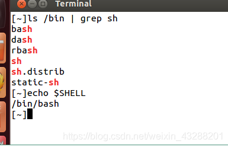
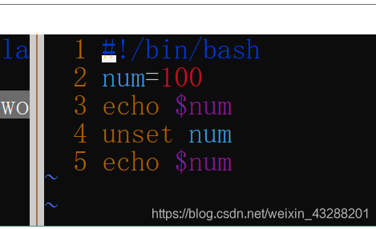
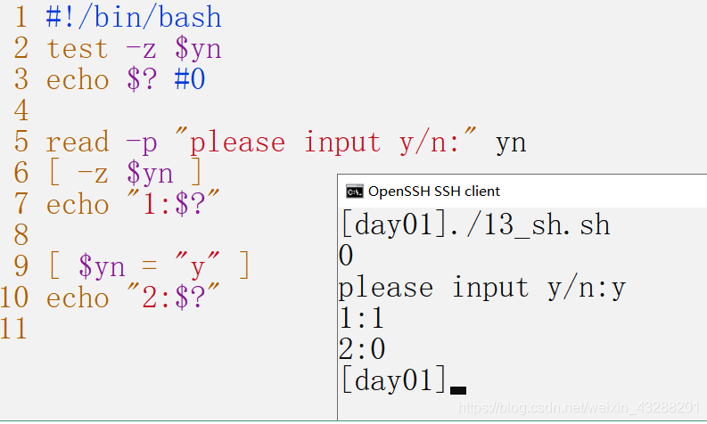

> 原文地址：https://blog.csdn.net/weixin_43288201/article/details/105643692

## 1、shell的概述

shell 是一种脚本语言

脚本：本质是一个文件，文件里面存放的是 特定格式的指令，系统可以使用脚本解析器 翻译或解析 指令 并执行（它不需要编译）

shell 既是应用程序 又是一种脚本语言（应用程序 解析 脚本语言）

### shell命令解析器

系统提供 shell命令解析器： sh ash bash

查看自己linux系统的默认解析：echo $SHELL


shell脚本是一种脚本语言，我们只需使用任意文本编辑器，按照语法编写相应程序，增加可执行权限，即可在安装shell命令解释器的环境下执行

## 2、脚本的调用形式

打开终端时系统自动调用：/etc/profile 或 ~/.bashrc

### /etc/profile

此文件为系统的每个用户设置环境信息,当用户第一次登录时,该文件被执行，系统的公共环境变量在这里设置

开机自启动的程序，一般也在这里设置

### ~/.bashrc

用户自己的家目录中的.bashrc

登录时会自动调用，打开任意终端时也会自动调用

这个文件一般设置与个人用户有关的环境变量，如交叉编译器的路径等等

用户手动调用：用户实现的脚本


### 三种执行方式

#### ./test.sh

`./test.sh` : 先按照 文件中 #! 指定的解析器解析。如果 #！指定的解析器不存在，才会使用系统默认的解析器

一定要写成 `./test.sh`，而不是 `test.sh`，运行其它二进制的程序也一样，直接写 test.sh，linux 系统会去 PATH 里寻找有没有叫 test.sh 的，而只有 /bin, /sbin, /usr/bin，/usr/sbin 等在 PATH 里，你的当前目录通常不在 PATH 里，所以写成 test.sh 是会找不到命令的，要用 ./test.sh 告诉系统说，就在当前目录找。

#### /bin/bash test.sh

这种运行方式是，直接运行解释器，其参数就是 shell 脚本的文件名。

与此类似的运行方式还有：

```bash
/bin/sh test.sh
/bin/php test.php
```

这种方式运行的脚本，不需要在第一行指定解释器信息，写了也没用。

#### . test.sh

在当前 shell 进程执行，脚本中的变量、函数会导入当前 shell，会修改当前 shell 的环境变量、函数。

#### 三者执行方式区别

我们指定解析器的时候（使用 ./test.sh 或 bash test.sh）时会创建一个子shell解析脚本，脚本中的变量仅在子 shell 有效，不影响当前 shell 的环境，需要可执行权限（`chmod +x`），常用于执行独立脚本。

而`. test.sh`会在当前 shell 进程执行，脚本中的变量、函数会导入当前 shell，会修改当前 shell 的环境变量、函数。不需要可执行权限（不需要`chmod +x`），常用于加载配置文件、环境变量。


## 3、shell语法初识

### 3.1、定义以开头：#!/bin/bash

#!用来声明脚本由什么shell解释，否则使用默认shell



### 3.2、单个"#"号代表注释当前行

#### 第一步：编写脚本文件


#### 第二步：加上可执行权限

**chmod +x test.sh**


#### 第三步：运行


## 4、变量

### 定义变量

变量名=变量值

如：num=10

### 引用变量

$变量名、${变量名}

变量名外面的花括号是可选的，加不加都行，加花括号是为了帮助解释器识别变量的边界，推荐给所有变量加上花括号，这是个好的编程习惯。

### 清除变量值

unset



运行结果：


### 从键盘获取值

read


运行结果：


### --------------------------------

### 案例：

在一行上显示和添加提示 需要加上-p


运行结果：


### 案例--读取多个值


运行结果：


### 案例--只读变量


运行结果：


### 查看环境变量：env


### 导出环境变量：source 

作用：（让其他shell脚本识别该变量，设为全局变量）

用法：source FileName

注：该命令通常用命令“.”来替代。

下面是名为06_sh.sh的文件：

```c
#!/bin/bash

export DATA=250
```

用source 是文件生效


使用 env可以查看到环境变量中已经有 DATA


可以在终端直接中读取：


在其他sh脚本读取：


运行结果：


### 注意事项：

1、变量名只能包含英文字母下划线，不能以数字开头

1_num=10 错误

num_1=20 正确

2、等号两边不能直接接空格符，若变量中本身就包含了空格，则整个字符串都要用双引号、或单引号括起来

3、双引号 单引号的区别

双引号：可以解析变量的值

单引号：不能解析变量的值


运行结果：


如果想在PATH变量中 追加一个路径写法如下：（重要！！！！）

```cpp
export PATH=$PATH:/需要添加的路径
```

## 5、变量--预设变量

### 无需定义的变量


案例


运行结果：


### 脚本变量的特殊用法


加-e转义 才起换行作用


()由子shell 完成


{}由当前的shell执行


## 6、变量--变量的扩展

### 6.1、判断变量是否存在


### 6.2、字符串

字符串是shell编程中最常用最有用的数据类型（除了数字和字符串，也没啥其它类型好用了），字符串可以用单引号，也可以用双引号，也可以不用引号。

#### 单 / 双引号

单引号中的转义字符，变量名都会被原封不动地输出。

双引号能够解析变量和转义字符。

#### 拼接字符串

```bash
your_name="runoob"
# 使用双引号拼接
greeting="hello, "$your_name" !"
greeting_1="hello, ${your_name} !"
echo $greeting  $greeting_1

# 使用单引号拼接
greeting_2='hello, '$your_name' !'
greeting_3='hello, ${your_name} !'
echo $greeting_2  $greeting_3

hello, runoob ! hello, runoob !
hello, runoob ! hello, ${your_name} !
```

#### 获取字符串长度

```bash
string="abcd"
echo ${#string}   # 输出 4
```

变量为字符串时，**${#string}** 等价于 **${#string[0]}**:

```bash
string="abcd"
echo ${#string[0]}   # 输出 4
```

#### 提取字符串

```bash
string="runoob is a great site"

# 从下标为1的位置提取4位
echo ${string:1:4} # 输出 unoo

# 从下标为1的位置提取
echo ${string:1} # 输出 unoob is a great site
```

#### 查找字符串

查找字符 **i** 或 **o** 的位置(哪个字母先出现就计算哪个)：

```bash
string="runoob is a great site"
echo `expr index "$string" io`  # 输出 4
```

#### 替换字符串


### 6.3、数组

数组中可以存放多个值。Bash Shell 只支持一维数组（不支持多维数组），初始化时不需要定义数组大小（与 PHP 类似）。

与大部分编程语言类似，数组元素的下标由 0 开始。

Shell 数组用括号来表示，元素用"空格"符号分割开，语法格式如下：

```bash
array_name=(value1 value2 ... valuen)
```

实例：

> 创建一个简单的数组 **my_array**

```bash
#!/bin/bash

my_array=(A B "C" D)
```

我们也可以使用数字下标来定义数组:

```bash
array_name[0]=value0
array_name[1]=value1
array_name[2]=value2
```

#### 读取数组

```bash
#!/bin/bash

my_array=(A B "C" D)

echo "第一个元素为: ${my_array[0]}"
echo "第二个元素为: ${my_array[1]}"
echo "第三个元素为: ${my_array[2]}"
echo "第四个元素为: ${my_array[3]}"

第一个元素为: A
第二个元素为: B
第三个元素为: C
第四个元素为: D
```

#### 关联数组

Bash 支持关联数组，可以使用任意的字符串、或者整数作为下标来访问数组元素。

关联数组使用 **[declare](https://www.runoob.com/linux/linux-comm-declare.html)** 命令来声明，语法格式如下：

```bash
declare -A array_name
```

**-A** 选项就是用于声明一个关联数组。

关联数组的键是唯一的。

以下实例我们创建一个关联数组 **site**，并在定义的同时赋值：

```bash
declare -A site=(["google"]="www.google.com" ["runoob"]="www.runoob.com" ["taobao"]="www.taobao.com")
```

我们也可以先声明一个关联数组，然后再设置键和值：

```bash
declare -A site
site["google"]="www.google.com"
site["runoob"]="www.runoob.com"
site["taobao"]="www.taobao.com"
```

访问关联数组元素可以使用指定的键，格式如下：

```bash
declare -A site
site["google"]="www.google.com"
site["runoob"]="www.runoob.com"
site["taobao"]="www.taobao.com"

echo ${site["runoob"]}

www.runoob.com
```

#### 获取数组中所有元素

使用 **@** 或 ***** 可以获取数组中的所有元素，例如：

```bash
#!/bin/bash

my_array[0]=A
my_array[1]=B
my_array[2]=C
my_array[3]=D

echo "数组的元素为: ${my_array[*]}"
echo "数组的元素为: ${my_array[@]}"

数组的元素为: A B C D
数组的元素为: A B C D

-------------------------------------------------------

declare -A site
site["google"]="www.google.com"
site["runoob"]="www.runoob.com"
site["taobao"]="www.taobao.com"

echo "数组的元素为: ${site[*]}"
echo "数组的元素为: ${site[@]}"

数组的元素为: www.google.com www.runoob.com www.taobao.com
数组的元素为: www.google.com www.runoob.com www.taobao.com
```

在数组前加一个感叹号 **!** 可以获取数组的所有键，例如：

```bash
declare -A site
site["google"]="www.google.com"
site["runoob"]="www.runoob.com"
site["taobao"]="www.taobao.com"

echo "数组的键为: ${!site[*]}"
echo "数组的键为: ${!site[@]}"

数组的键为: google runoob taobao
数组的键为: google runoob taobao
```


#### 获取数组的长度

获取数组长度的方法与获取字符串长度的方法相同，例如：

```bash
#!/bin/bash

my_array[0]=A
my_array[1]=B
my_array[2]=C
my_array[3]=D

echo "数组元素个数为: ${#my_array[*]}"
echo "数组元素个数为: ${#my_array[@]}"

数组元素个数为: 4
数组元素个数为: 4
```


## 7、运算符

### 7.1、条件运算符

下表列出了常用的算术运算符，假定变量 a 为 10，变量 b 为 20：

| 运算符 | 说明                                          | 举例                          |
| :----- | :-------------------------------------------- | :---------------------------- |
| +      | 加法                                          | `expr $a + $b` 结果为 30。    |
| -      | 减法                                          | `expr $a - $b` 结果为 -10。   |
| *      | 乘法                                          | `expr $a \* $b` 结果为  200。 |
| /      | 除法                                          | `expr $b / $a` 结果为 2。     |
| %      | 取余                                          | `expr $b % $a` 结果为 0。     |
| =      | 赋值                                          | a=$b 把变量 b 的值赋给 a。    |
| ==     | 相等。用于比较两个数字，相同则返回 true。     | [ $a == $b ] 返回 false。     |
| !=     | 不相等。用于比较两个数字，不相同则返回 true。 | [ $a != $b ] 返回 true。      |

**注意：**条件表达式要放在方括号之间，并且要有空格，例如: **[$a==$b]** 是错误的，必须写成 **[ $a == $b ]**。

实例：

```bash
#!/bin/bash

a=10
b=20

val=`expr $a + $b`
echo "a + b : $val"

val=`expr $a - $b`
echo "a - b : $val"

val=`expr $a \* $b`
echo "a * b : $val"

val=`expr $b / $a`
echo "b / a : $val"

val=`expr $b % $a`
echo "b % a : $val"

if [ $a == $b ]
then
   echo "a 等于 b"
fi
if [ $a != $b ]
then
   echo "a 不等于 b"
fi

a + b : 30
a - b : -10
a * b : 200
b / a : 2
b % a : 0
a 不等于 b
```


### 7.2、关系运算符

关系运算符只支持数字，不支持字符串，除非字符串的值是数字。

下表列出了常用的关系运算符，假定变量 a 为 10，变量 b 为 20：

| 运算符 | 说明                                                  | 举例                       |
| :----- | :---------------------------------------------------- | :------------------------- |
| -eq    | 检测两个数是否相等，相等返回 true。                   | [ $a -eq $b ] 返回 false。 |
| -ne    | 检测两个数是否不相等，不相等返回 true。               | [ $a -ne $b ] 返回 true。  |
| -gt    | 检测左边的数是否大于右边的，如果是，则返回 true。     | [ $a -gt $b ] 返回 false。 |
| -lt    | 检测左边的数是否小于右边的，如果是，则返回 true。     | [ $a -lt $b ] 返回 true。  |
| -ge    | 检测左边的数是否大于等于右边的，如果是，则返回 true。 | [ $a -ge $b ] 返回 false。 |
| -le    | 检测左边的数是否小于等于右边的，如果是，则返回 true。 | [ $a -le $b ] 返回 true。  |

实例：

```bash
#!/bin/bash

a=10
b=20

if [ $a -eq $b ]
then
   echo "$a -eq $b : a 等于 b"
else
   echo "$a -eq $b: a 不等于 b"
fi
if [ $a -ne $b ]
then
   echo "$a -ne $b: a 不等于 b"
else
   echo "$a -ne $b : a 等于 b"
fi
if [ $a -gt $b ]
then
   echo "$a -gt $b: a 大于 b"
else
   echo "$a -gt $b: a 不大于 b"
fi
if [ $a -lt $b ]
then
   echo "$a -lt $b: a 小于 b"
else
   echo "$a -lt $b: a 不小于 b"
fi
if [ $a -ge $b ]
then
   echo "$a -ge $b: a 大于或等于 b"
else
   echo "$a -ge $b: a 小于 b"
fi
if [ $a -le $b ]
then
   echo "$a -le $b: a 小于或等于 b"
else
   echo "$a -le $b: a 大于 b"
fi

10 -eq 20: a 不等于 b
10 -ne 20: a 不等于 b
10 -gt 20: a 不大于 b
10 -lt 20: a 小于 b
10 -ge 20: a 小于 b
10 -le 20: a 小于或等于 b
```


### 7.3、布尔运算符

下表列出了常用的布尔运算符，假定变量 a 为 10，变量 b 为 20：

| 运算符 | 说明                                                | 举例                                     |
| :----- | :-------------------------------------------------- | :--------------------------------------- |
| !      | 非运算，表达式为 true 则返回 false，否则返回 true。 | [ ! false ] 返回 true。                  |
| -o     | 或运算，有一个表达式为 true 则返回 true。           | [ $a -lt 20 -o $b -gt 100 ] 返回 true。  |
| -a     | 与运算，两个表达式都为 true 才返回 true。           | [ $a -lt 20 -a $b -gt 100 ] 返回 false。 |

实例：

```bash
#!/bin/bash

a=10
b=20

if [ $a != $b ]
then
   echo "$a != $b : a 不等于 b"
else
   echo "$a == $b: a 等于 b"
fi
if [ $a -lt 100 -a $b -gt 15 ]
then
   echo "$a 小于 100 且 $b 大于 15 : 返回 true"
else
   echo "$a 小于 100 且 $b 大于 15 : 返回 false"
fi
if [ $a -lt 100 -o $b -gt 100 ]
then
   echo "$a 小于 100 或 $b 大于 100 : 返回 true"
else
   echo "$a 小于 100 或 $b 大于 100 : 返回 false"
fi
if [ $a -lt 5 -o $b -gt 100 ]
then
   echo "$a 小于 5 或 $b 大于 100 : 返回 true"
else
   echo "$a 小于 5 或 $b 大于 100 : 返回 false"
fi

10 != 20 : a 不等于 b
10 小于 100 且 20 大于 15 : 返回 true
10 小于 100 或 20 大于 100 : 返回 true
10 小于 5 或 20 大于 100 : 返回 false
```


### 7.4、逻辑运算符

以下介绍 Shell 的逻辑运算符，假定变量 a 为 10，变量 b 为 20:

| 运算符 | 说明       | 举例                                       |
| :----- | :--------- | :----------------------------------------- |
| &&     | 逻辑的 AND | [[ $a -lt 100 && $b -gt 100 ]] 返回 false  |
| \|\|   | 逻辑的 OR  | [[ $a -lt 100 \|\| $b -gt 100 ]] 返回 true |

实例：

```bash
#!/bin/bash

a=10
b=20

if [[ $a -lt 100 && $b -gt 100 ]]
then
   echo "返回 true"
else
   echo "返回 false"
fi

if [[ $a -lt 100 || $b -gt 100 ]]
then
   echo "返回 true"
else
   echo "返回 false"
fi

返回 false
返回 true
```


### 7.5、字符串运算符

下表列出了常用的字符串运算符，假定变量 a 为 "abc"，变量 b 为 "efg"：

| 运算符 | 说明                                         | 举例                     |
| :----- | :------------------------------------------- | :----------------------- |
| =      | 检测两个字符串是否相等，相等返回 true。      | [ $a = $b ] 返回 false。 |
| !=     | 检测两个字符串是否不相等，不相等返回 true。  | [ $a != $b ] 返回 true。 |
| -z     | 检测字符串长度是否为0，为0返回 true。        | [ -z $a ] 返回 false。   |
| -n     | 检测字符串长度是否不为 0，不为 0 返回 true。 | [ -n "$a" ] 返回 true。  |
| $      | 检测字符串是否不为空，不为空返回 true。      | [ $a ] 返回 true。       |

```bash
#!/bin/bash

a="abc"
b="efg"

if [ $a = $b ]
then
   echo "$a = $b : a 等于 b"
else
   echo "$a = $b: a 不等于 b"
fi
if [ $a != $b ]
then
   echo "$a != $b : a 不等于 b"
else
   echo "$a != $b: a 等于 b"
fi
if [ -z $a ]
then
   echo "-z $a : 字符串长度为 0"
else
   echo "-z $a : 字符串长度不为 0"
fi
if [ -n "$a" ]
then
   echo "-n $a : 字符串长度不为 0"
else
   echo "-n $a : 字符串长度为 0"
fi
if [ $a ]
then
   echo "$a : 字符串不为空"
else
   echo "$a : 字符串为空"
fi

abc = efg: a 不等于 b
abc != efg : a 不等于 b
-z abc : 字符串长度不为 0
-n abc : 字符串长度不为 0
abc : 字符串不为空
```

### 7.6、文件测试运算符

文件测试运算符用于检测 Unix 文件的各种属性。

属性检测描述如下：

| 操作符  | 说明                                                         | 举例                      |
| :------ | :----------------------------------------------------------- | :------------------------ |
| -b file | 检测文件是否是块设备文件，如果是，则返回 true。              | [ -b $file ] 返回 false。 |
| -c file | 检测文件是否是字符设备文件，如果是，则返回 true。            | [ -c $file ] 返回 false。 |
| -d file | 检测文件是否是目录，如果是，则返回 true。                    | [ -d $file ] 返回 false。 |
| -f file | 检测文件是否是普通文件（既不是目录，也不是设备文件），如果是，则返回 true。 | [ -f $file ] 返回 true。  |
| -g file | 检测文件是否设置了 SGID 位，如果是，则返回 true。            | [ -g $file ] 返回 false。 |
| -k file | 检测文件是否设置了粘着位(Sticky Bit)，如果是，则返回 true。  | [ -k $file ] 返回 false。 |
| -p file | 检测文件是否是有名管道，如果是，则返回 true。                | [ -p $file ] 返回 false。 |
| -u file | 检测文件是否设置了 SUID 位，如果是，则返回 true。            | [ -u $file ] 返回 false。 |
| -r file | 检测文件是否可读，如果是，则返回 true。                      | [ -r $file ] 返回 true。  |
| -w file | 检测文件是否可写，如果是，则返回 true。                      | [ -w $file ] 返回 true。  |
| -x file | 检测文件是否可执行，如果是，则返回 true。                    | [ -x $file ] 返回 true。  |
| -s file | 检测文件是否为空（文件大小是否大于0），不为空返回 true。     | [ -s $file ] 返回 true。  |
| -e file | 检测文件（包括目录）是否存在，如果是，则返回 true。          | [ -e $file ] 返回 true。  |

其他检查符：

- **-S**: 判断某文件是否 socket。
- **-L**: 检测文件是否存在并且是一个符号链接。

实例：

> 变量 file 表示文件 **/var/www/runoob/test.sh**，它的大小为 100 字节，具有 **rwx** 权限。下面的代码，将检测该文件的各种属性：

```bash
#!/bin/bash

file="/var/www/runoob/test.sh"
if [ -r $file ]
then
   echo "文件可读"
else
   echo "文件不可读"
fi
if [ -w $file ]
then
   echo "文件可写"
else
   echo "文件不可写"
fi
if [ -x $file ]
then
   echo "文件可执行"
else
   echo "文件不可执行"
fi
if [ -f $file ]
then
   echo "文件为普通文件"
else
   echo "文件为特殊文件"
fi
if [ -d $file ]
then
   echo "文件是个目录"
else
   echo "文件不是个目录"
fi
if [ -s $file ]
then
   echo "文件不为空"
else
   echo "文件为空"
fi
if [ -e $file ]
then
   echo "文件存在"
else
   echo "文件不存在"
fi

文件可读
文件可写
文件可执行
文件为普通文件
文件不是个目录
文件不为空
文件存在
```


### 7.7、自增自减运算符

尽管 Shell 本身没有像 C、C++ 或 Java 那样的 ++ 和 -- 操作符，但可以通过其他方式实现相同的功能。以下是一些常见的方法：

#### 使用 let 命令

**let** 命令允许对整数进行算术运算。

```bash
#!/bin/bash

# 初始化变量
num=5

# 自增
let num++

# 自减
let num--

echo $num
```

#### 使用 $(( )) 进行算术运算

**$(( ))** 语法也是进行算术运算的一种方式。

```bash
#!/bin/bash

# 初始化变量
num=5

# 自增
num=$((num + 1))

# 自减
num=$((num - 1))

echo $num
```

#### 使用 expr 命令

**expr** 命令可以用于算术运算，但在现代脚本中不如 **let** 和 **$(( ))** 常用。

```bash
#!/bin/bash

# 初始化变量
num=5

# 自增
num=$(expr $num + 1)

# 自减
num=$(expr $num - 1)

echo $num
```

#### 使用 (( )) 进行算术运算

与 $(( )) 类似，(( )) 语法也可以用于算术运算。

```bash
#!/bin/bash

# 初始化变量
num=5

# 自增
((num++))

# 自减
((num--))

echo $num
```

实例

> 以下是一个完整的示例脚本，演示了自增和自减操作的使用：

```bash
#!/bin/bash

# 初始化变量
num=5

echo "初始值: $num"

# 自增
let num++
echo "自增后: $num"

# 自减
let num--
echo "自减后: $num"

# 使用 $(( ))
num=$((num + 1))
echo "使用 $(( )) 自增后: $num"

num=$((num - 1))
echo "使用 $(( )) 自减后: $num"

# 使用 expr
num=$(expr $num + 1)
echo "使用 expr 自增后: $num"

num=$(expr $num - 1)
echo "使用 expr 自减后: $num"

# 使用 (( ))
((num++))
echo "使用 (( )) 自增后: $num"

((num--))
echo "使用 (( )) 自减后: $num"

初始值: 5
自增后: 6
自减后: 5
使用 $(( )) 自增后: 6
使用 $(( )) 自减后: 5
使用 expr 自增后: 6
使用 expr 自减后: 5
使用 (( )) 自增后: 6
使用 (( )) 自减后: 5
```

### expr、let、$(())、(())的区别

| 命令 / 语法 | 类型           | 返回值             | 变量赋值方式                 | 表达式语法               | 浮点支持 | 备注                 |
| ----------- | -------------- | ------------------ | ---------------------------- | ------------------------ | -------- | -------------------- |
| `expr`      | 外部命令       | 计算结果（字符串） | `val=$(expr $a + $b)`        | 需要空格，需转义特殊字符 | ❌        | POSIX 兼容，性能低   |
| `$((...))`  | shell 算术扩展 | 计算结果（字符串） | `val=$((a + b))`             | 无需 `$` 和空格，更灵活  | ❌        | 推荐写法，高效       |
| `let`       | shell 内置命令 | 状态码（0 / 非 0） | `let val=a+b` 或直接修改变量 | 无需 `$`，支持 `+=` 等   | ❌        | 适合简单计算         |
| `((...))`   | shell 命令     | 状态码（0 / 非 0） | `((val=a+b))` 或直接修改     | 无需 `$`，用于条件判断   | ❌        | 常用于 `if`、`while` |

## 8、条件测试

test命令：用于测试字符串、文件状态和数字

test命令有两种格式:

test condition 或[ condition ]

使用方括号时，要注意在条件两边加上空格。


### [ ]和[[ ]]

在SHELL中，`[[]]`和`[]`都能对条件进行测试，不过它们在功能和语法上存在明显差异。

**语法地位不同**：

**`[]`**：它本质上是 shell 内建命令`test`的同义词。在使用时，每个部分都要以空格分隔，并且需要用引号对特殊字符进行处理。

```bash
if [ "$a" -eq "$b" ]; then
    echo "a等于b"
fi
```

**`[[]]`**：这是 bash shell 特有的关键字。它对语法进行了扩展，使用起来更加灵活，而且不需要对特殊字符加引号。

```bash
if [[ $a == $b ]]; then
    echo "a等于b"
fi
```


**引号处理不同**：

**`[]`**：必须用引号把变量引起来，以此避免变量为空或者包含空格时出现词法分析错误。

**`[[]]`**：能够自动处理变量扩展，就算变量为空也不会出错。


**模式匹配支持不同**：

**`[]`**：不支持模式匹配，仅能进行简单的字符串比较。

**`[[]]`**：可以使用`==`和`!=`操作符进行模式匹配。

```bash
[[ $str == hello* ]]  # 匹配以hello开头的字符串
```


**正则表达式支持不同**：

**`[]`**：不支持正则表达式。

**`[[]]`**：借助`=~`操作符可以使用正则表达式。

```bash
[[ $str =~ ^[0-9]+$ ]]  # 匹配纯数字字符串
```


**逻辑操作符用法不同**：

**`[]`**：要使用`-a`和`-o`作为逻辑操作符，而且需要对表达式进行分隔。

```bash
[ "$a" -gt 10 -a "$b" -lt 20 ]
```

**`[[]]`**：可以直接使用`&&`和`||`，并且支持更直观的表达式组合。

```bash
[[ $a -gt 10 && $b -lt 20 ]]
```


**文件路径拓展情况不同**：

**`[]`**：会进行文件名扩展（通配符展开）。

```bash
[ -f *.txt ]# 假如存在a.txt和b.txt,这段代码就会展开为[ -f a.txt b.txt ],由于[]只接受单个文件参数，多余的参数会导致语法错误
```

**`[[]]`**：不会进行文件名扩展。

```bash
[[ -f *.txt ]]  # 直接检查是否存在名为*.txt的文件
```


**适用范围**：

- **`[]`**：在所有 POSIX 兼容的 shell 中都能使用，具有良好的可移植性。
- **`[[]]`**：只能在 bash、zsh 等高级 shell 中使用，不具备 POSIX 兼容性。


### 8.1、文件测试


### 8.2、字符串测试





### 8.3、数值测试


### 8.4、符合语句测试

`&&`（逻辑与）和`||`（逻辑或）是常用的控制操作符，用于连接多个命令或条件，实现流程控制。它们的核心作用是根据前一个命令的**退出状态码**（0 表示成功，非 0 表示失败）来决定是否执行后续命令。


## 9、控制语句


### 9.1、if控制语句

```bash

格式一：

if [条件1]; then

    执行第一段程序

else

    执行第二段程序

fi

格式二：

if [条件1]; then

    执行第一段程序

elif [条件2]；then

执行第二段程序

else

    执行第三段程序

fi

```

案例：


案例：判断当前路径下有没有文件夹 有就进入创建文件 没有 就创建文件夹 再进入创建文件


运行结果：


案例：


运行结果：


### 9.2、case


### 9.3、for循环语句


案例：


案例：扫描当前文件


### 9.4、while


### 9.5、until


### 9.6、break continue


## 10、函数


所有函数在使用前必须定义，必须将函数放在脚本开始部分，直至shell解释器首次发现它时，才可以使用


### 案例：求最值


### 案例：函数分文件


fun.sh


24_sh.sh

