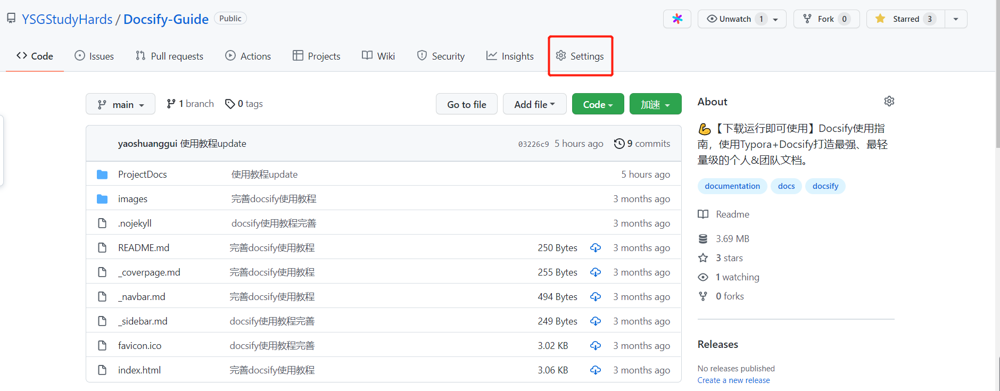
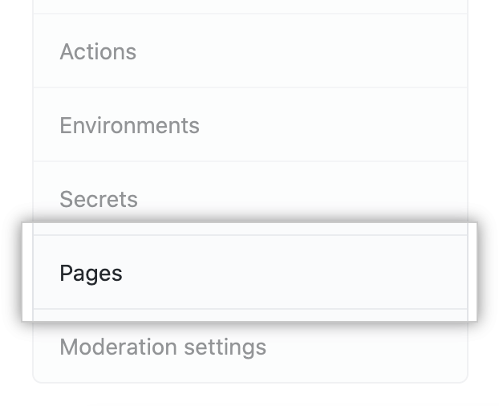
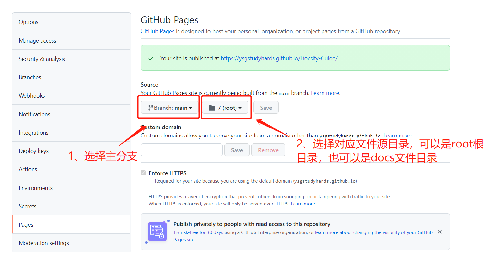
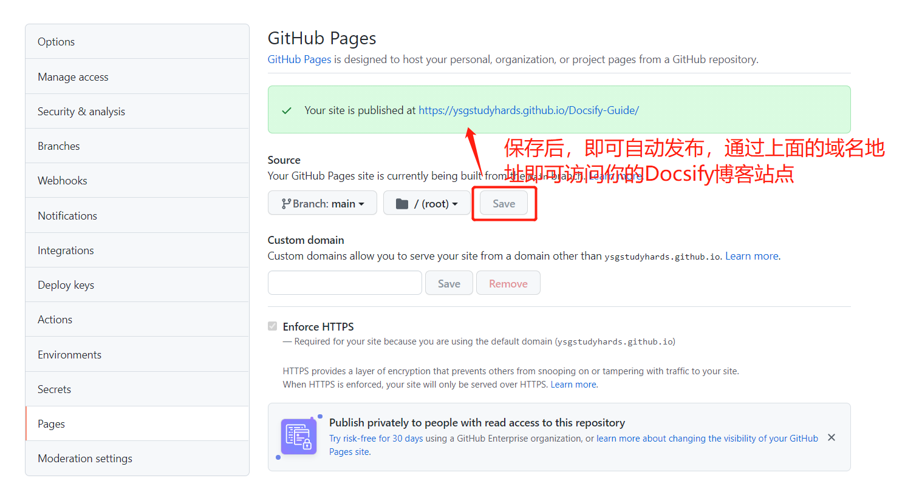
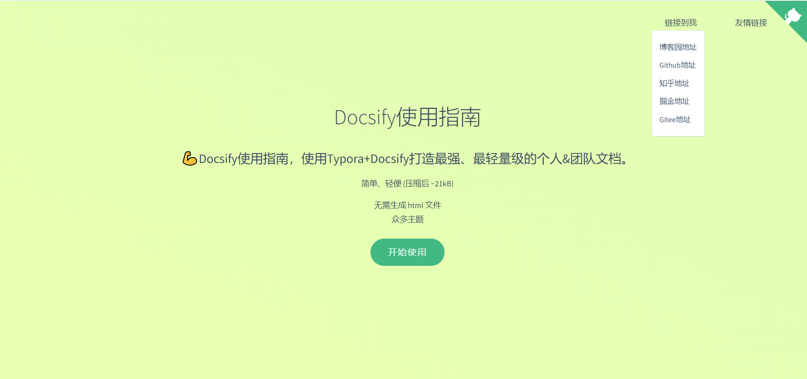

# docsify + GithubPage部署个人博客系统

##  前言

　　现如今网上有许多完善的博客平台，如博客园、掘金、思否、知乎等。有人会说为什么现在网上有这么多成熟的博客平台，你还要浪费时间搭建一个自己的博客平台呢？首先我相信每一个程序员都会想要拥有一个属于自己的博客系统，其次使用Docsify能够快速构建一个自己的博客文档系统，最后我们可以通过Github Pages免费托管我们的博客系统文档（连域名和服务器都省了）这样的一次难得的实战机会我们又怎么能够错过呢。废话不多说，接下来步入正题。

## Docsify使用配置指南

> [Docsify使用指南（打造最快捷、最轻量级的个人&团队文档）👉](https://www.cnblogs.com/Can-daydayup/p/15413267.html)

## 轻量&完善的Docsify模板

　　该模板为一个简洁，并且完善的Docsify模板基本上可以满足百分之八十多的团队需求，你可以按照文章中的Docsify环境配置教程把运行Docsify所需要的环境配置起来，通过命令即可查看效果（配置环境顺利的话只要十来分钟）。

> 模板源码地址：[Docsify-Guide👉](https://github.com/YSGStudyHards/Docsify-Guide)
>
> 模板预览地址：[https://ysgstudyhards.github.io/Docsify-Guide/#/👉](https://ysgstudyhards.github.io/Docsify-Guide/#/)

## 选择对应的存储库单击设置（Settings）

## 点击左侧的Pages

## 选择对应分支的发布源文件夹

## 保存发布即可访问

> Github Pages访问地址：https://ysgstudyhards.github.io/Docsify-Guide/

 