# 

# Cloudflare

## Cloudfalre 解析域名，并应用域名到Vercel上（似乎无法实现国内无代理访问）

### 前言

随着前端技术的发展，目前的项目部署服务已经几乎脱离了实际的服务器。市面上的各大平台都推出了他们自己的前端部署 Paas 服务，比较知名的有 Vercel、Neltify、Github Pages、Cloudflare Pages 等等。

不过受一些相关的政策或者其他因素影响，一些服务实际上是不对国内提供的，比如 Vercel 实际上在去年开始起就开始针对大陆ip进行了封锁。目前仍能够在国内比较顺畅的进行访问的有 Neltify、Github Pages 等。

这篇文章主要是为了解决 **使用 Vercel 部署项目后无法正常访问的问题**。

`vercel` 实际上是允许用户自定义域名的，也就是说你如果有自己的域名你可以同时绑定在一起，并且还有一个我们的 **赛博大善人Cloudflare** 可以帮助我们进行域名解析以及CDN服务。引用我在找资料的时候知乎大神的介绍：

> Cloudflare的主流服务是域名解析，简单来说就是当你输入`baidu.com`的时候告诉计算机它所指向的ip地址是什么。这也是一个可以白嫖的网站，因为基础版的域名解析也是免费的。虽然免费，功能却一样不少，甚至更安全更丰富。Cloudflare对域名解析的同时提供代理服务，隐藏真实的ip，保护站点免受不法攻击。
>
> 你的应用在`vercel`部署之后会自动生成一个以`vercel.app`为后缀的域名，也支持自定义域名。自定义域名可以通过Cloudflare进行域名解析并利用代理服务达到访问`vercel`的目的。

因此，我们可以配合Cloudflare的域名解析，和在国内服务商购买好的域名，我们就可以**将`vercel`部署的应用的自带域名代理到我们自己的域名**，这样就可以**在国内访问我们的`vercel`应用**了。并且将域名代理到 CF 之后还能享受到它提供的诸多服务，何乐而不为呢！

### 将腾讯云域名DNS解析转移到Cloudflare进行

#### 准备一个自己的域名

既然是要代理到原来的域名，所以得准备一个自己在国内服务商购买的域名。具体的流程应该都清楚的吧也就不多说了，在腾讯云里面你只用登录控制台然后搜“域名注册”四个字就会提示你怎么操作了。唯一的要求就是你要付钱，我建议便宜点就行。

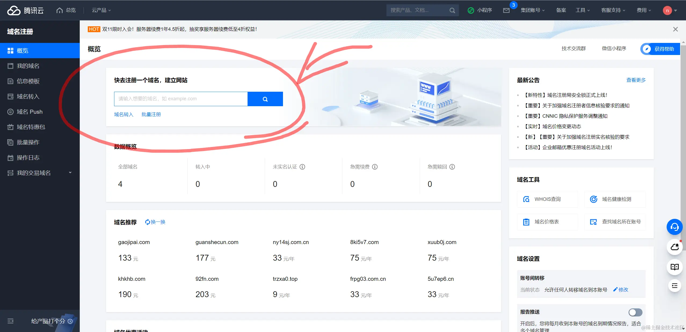

#### 登录Cloudflare控制台并添加站点

前往[www.cloudflare.com/zh-cn](https://link.juejin.cn/?target=https%3A%2F%2Fwww.cloudflare.com%2Fzh-cn)进行注册，有账号的直接登录。

进来之后看到如下页面，我之前加过一个站点所以会弹出来，没有的就可以不用管：

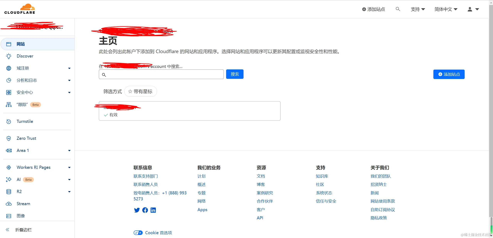

然后点击右侧的这个 **添加站点** 按钮就好了，进入下一步，输入你要加的域名（就是你之前在腾讯云上面买好的）然后点击继续：

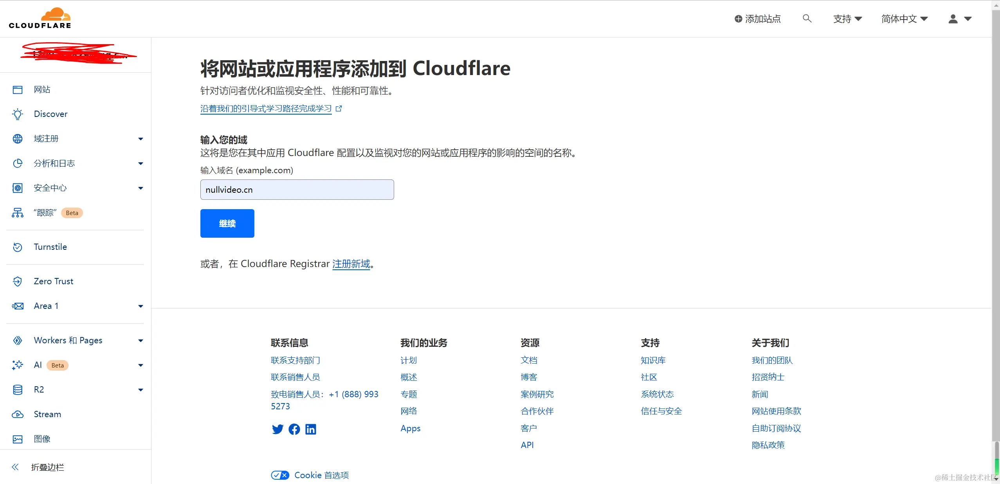

然后选择计划，一般无特殊需求直接白嫖然后点击继续：

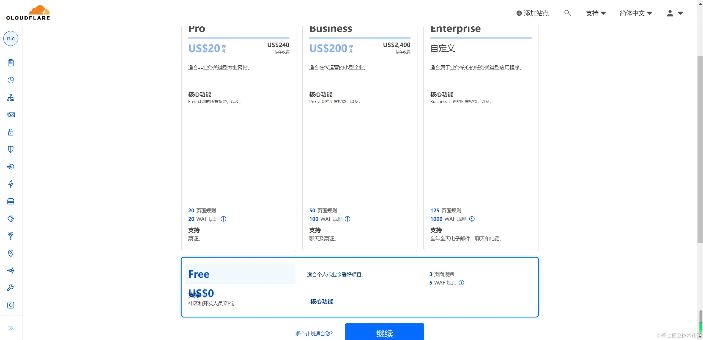

接下来 Cloudflare 会自动扫描你的部分dns记录。我这个域名是刚刚买的还没有进行一些解析的操作，所以是没有记录的。点击继续：

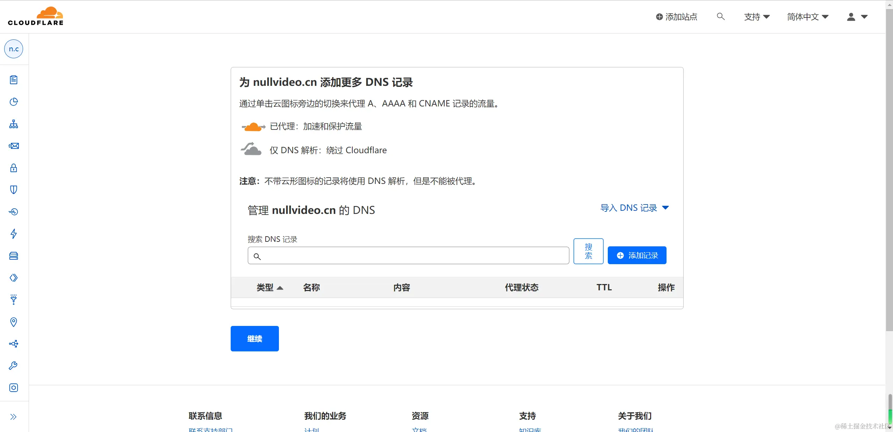

**然后最关键的点来了，Cloudflare会自动生成两条dns地址，就是下面两个云右边的字符串，你得拿着这两个地址去换掉腾讯云原本的解析**：

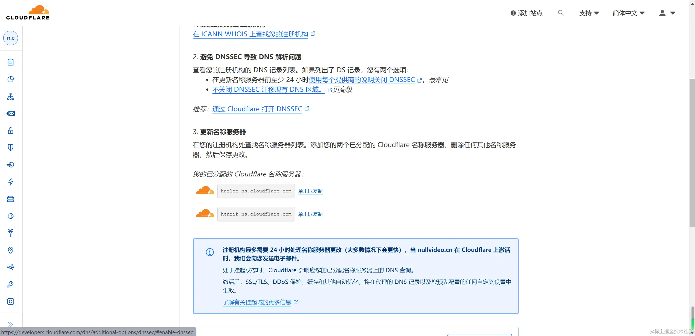

至此，Cloudflare部分的工作告一段落。**CF 对整个网页提供的功能绝对绝对不止这么点，剩下的功能等待你们自己去发掘啦～之后我或许会写一篇文章，总结一下我使用 CF 的各种心得。**

#### 在腾讯云域名管理控制台更改DNS服务器解析

接下来启动腾讯云域名管理后台[console.cloud.tencent.com/domain](https://link.juejin.cn/?target=https%3A%2F%2Fconsole.cloud.tencent.com%2Fdomain)。我这边有一个是已经解析到cloudflare所以DNS状态变成了其他，我现在要改的这个`nullvideo.cn`待会儿也会变成其他。

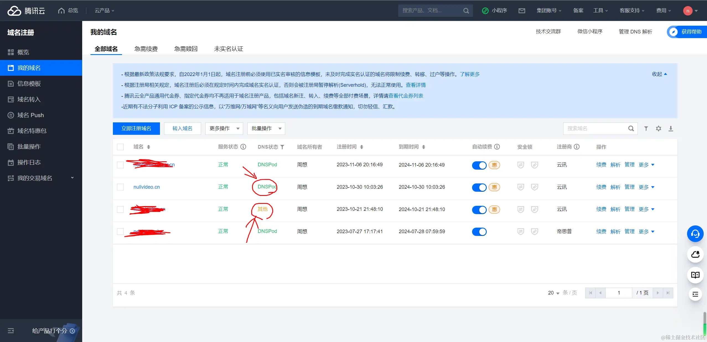

点击“解析”按钮右边的“管理”按钮，进入域名管理页，找到DNS解析部分：

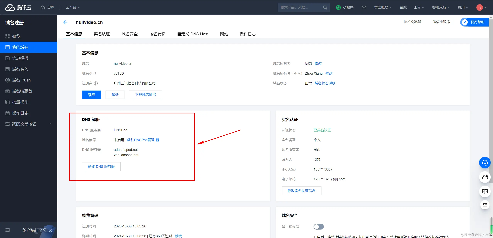

然后点击“修改DNS服务器”，把刚刚Cloudflare给我们的两个DNS地址黏贴到原本的DNS地址处：

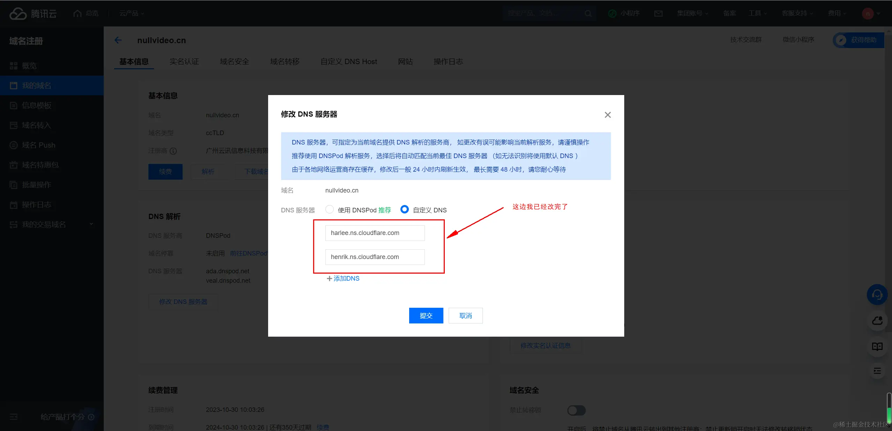

保存然后等待dns缓存刷新即可，这可能需要1-24小时因为每个域名体质不一样。

然后回到 Cloudflare 控制台就好了。至此，更换完成了。

### 在Vercel上为自己部署好的前端应用添加新的域名解析

#### 将自己的应用通过vercel进行部署

这个就不在这里展开说了，你只要登录`vercel`的官网[vercel.com](https://link.juejin.cn/?target=https%3A%2F%2Fvercel.com)注册或者登录账号，然后自己跟着它的指示一步步来，最不济可以去查一查资料。。。反正这里不展开说了，默认大家都已经有一个部署好了的`vercel`应用了。

#### 去Cloudflare添加域名解析记录

在 Cloudflare 添加`CNAME`类型的解析，比如这个项目就是把`nullvideo.cn`重定向到`null-video.vercel.app`，并打开 proxy 服务。我在这边为了对应根路径访问和www访问，两个都加上了。

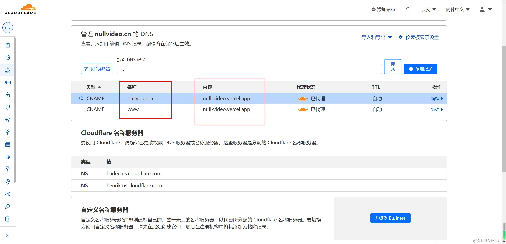

#### 对部署好的vercel应用添加除了自带域名的新域名解析

进入到部署好了的项目的主页，可以看到一个“Domain”的按钮，点击进入：

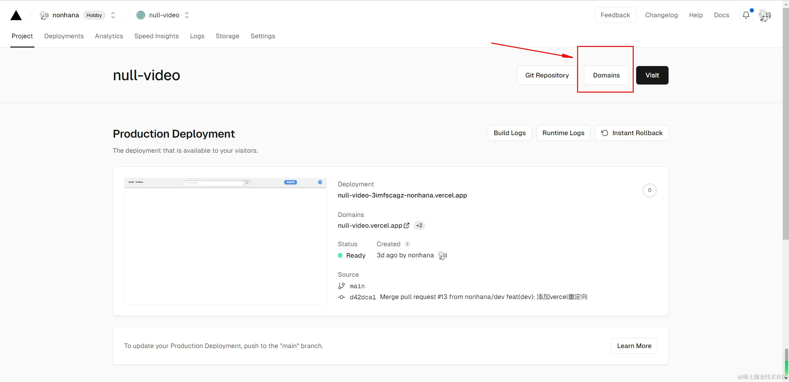

然后进入之后，输入你买好的域名然后点击Add：

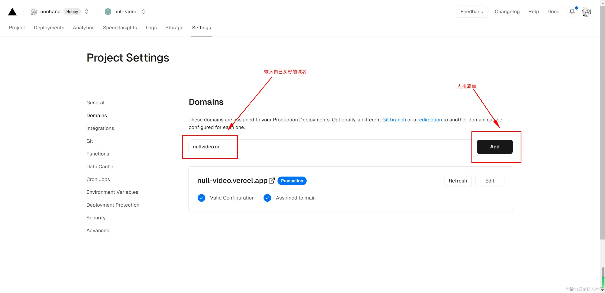

选择默认的方案，也就是把根域名和`www`解析一起加上。

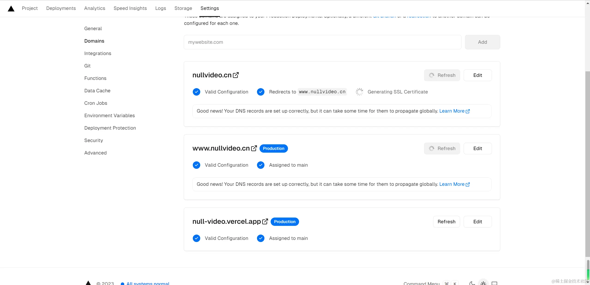

添加之后会进行校验，校验完成了之后就可以进行访问了。。。**看起来是这样，实际上还是有问题的！！！**

#### Vercel + Cloudflare = 重定向次数过多解决方案

你把域名解析添加好了，校验也通过了，然后你会直接点击访问：

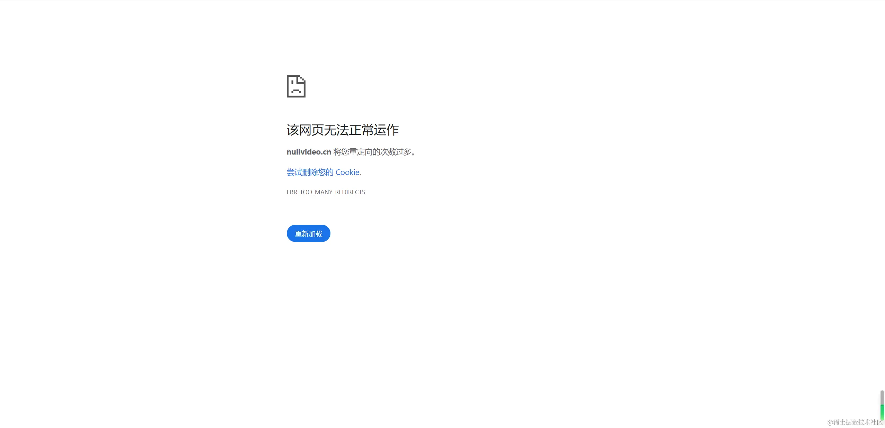

没错，你会遇到**重定向次数过多**的问题。

这其实是Cloudflare为添加的站点加密模式设置错误导致的。

进入 Cloudflare Dashboard，点击有问题的域名，打开左侧的 SSL/TLS 设置，在 Overview 中设置加密模式为完全或完全（严格）即可。

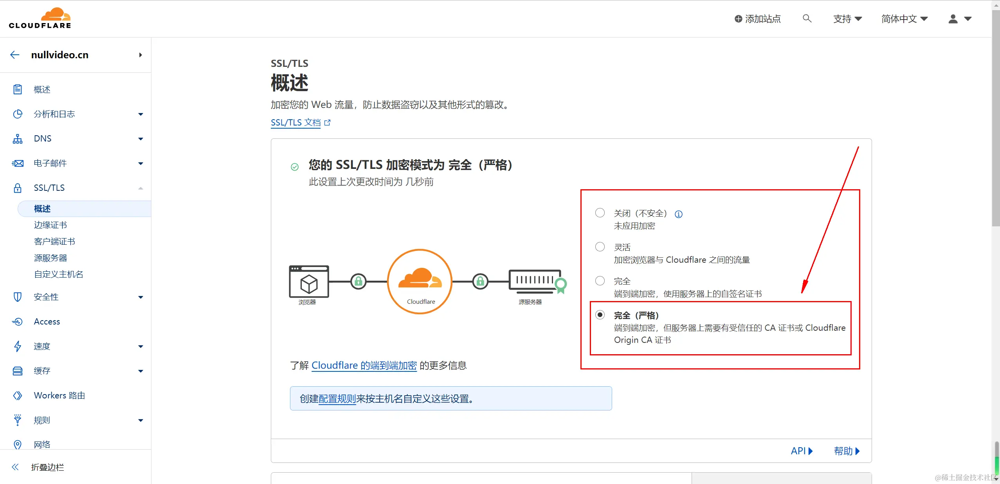

这样子之后你的`vercel`应用应该是可以正常的在国内进行访问了。

希望能给大家使用 `vercel` 部署前端应用带来一些小小的帮助！

# 腾讯云

## 腾讯云解析域名，并应用域名到Vercel上（可实现国内无代理访问）

首先在腾讯云中购买一个域名。

在Vercel中点击Add添加域名

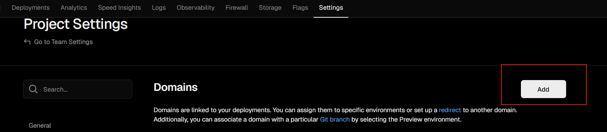

填写域名后点击Add Domain

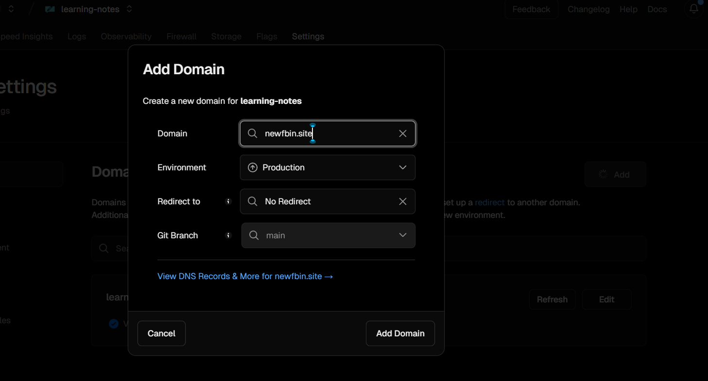

按照图片点击

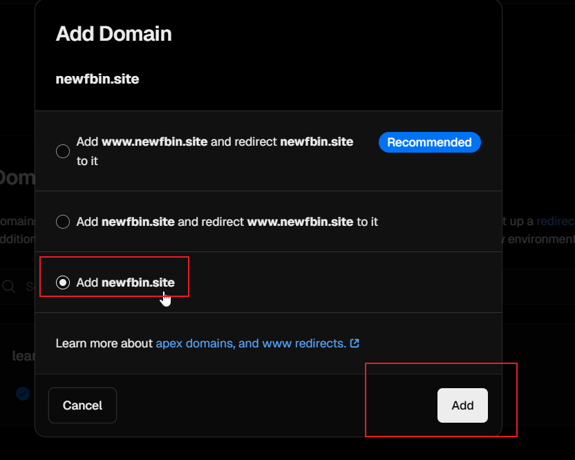

这一步需要选择 Configure Manually

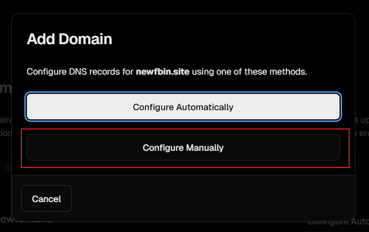

添加成功后会出现如下提示：

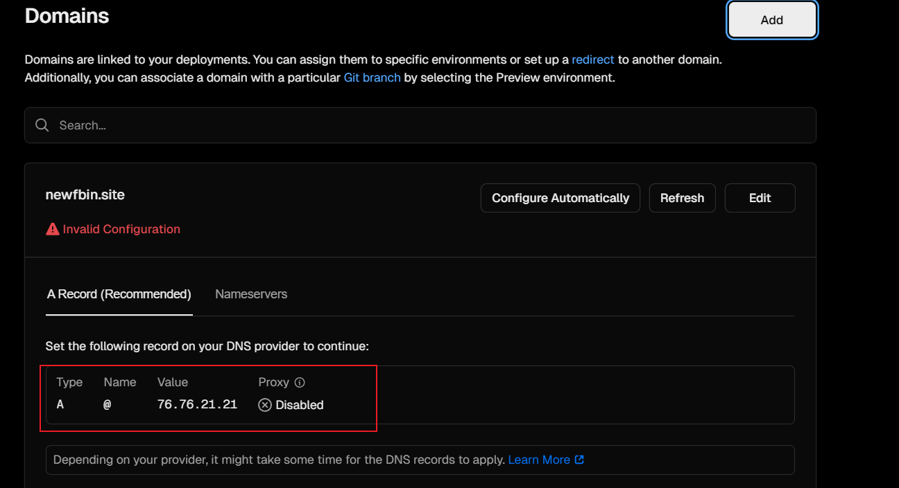

由于需要使用腾讯云作为 DNS provider，所以进入腾讯云的 云解析 DNS，点击域名右边的 “解析”

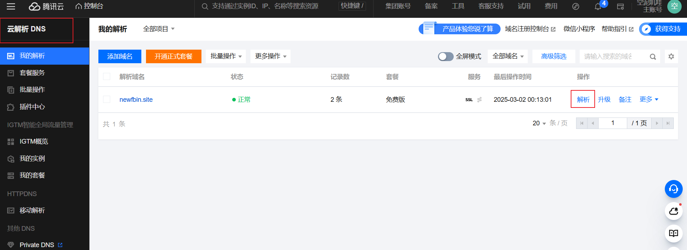

按照Vercel给的提示依次填入到腾讯云中

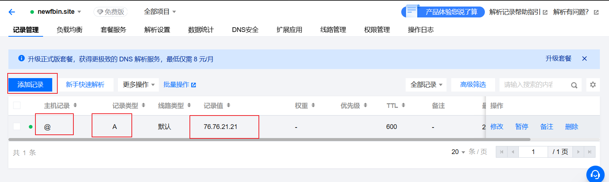

此时再回到Vercel中，可以看到域名已经被设置成功了

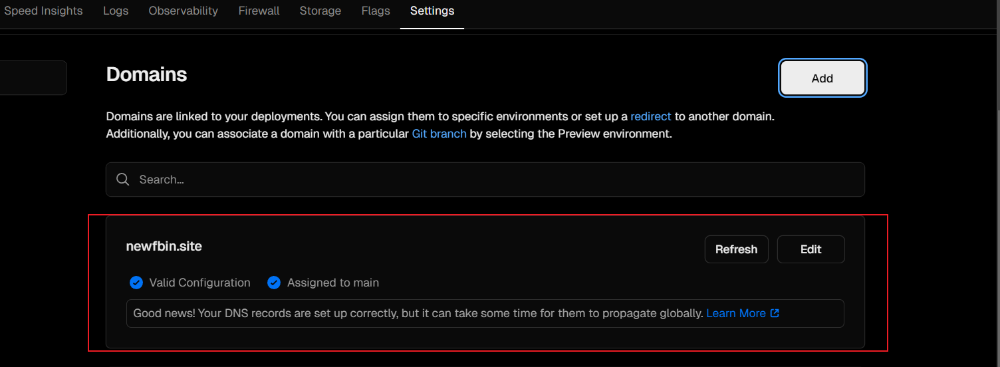

# 阿里云

## 阿里云解析域名，并应用域名到Vercel上（可实现国内无代理访问）

首先在阿里云中购买一个域名。

在Vercel中点击Add添加域名

填写域名后点击Add Domain

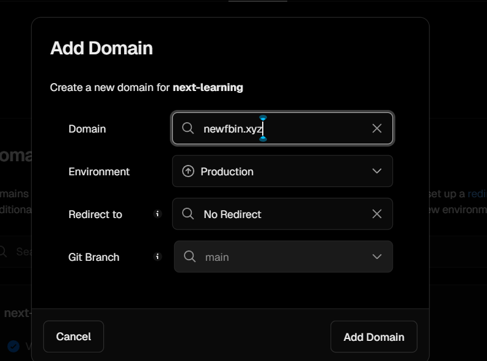

按照图片点击

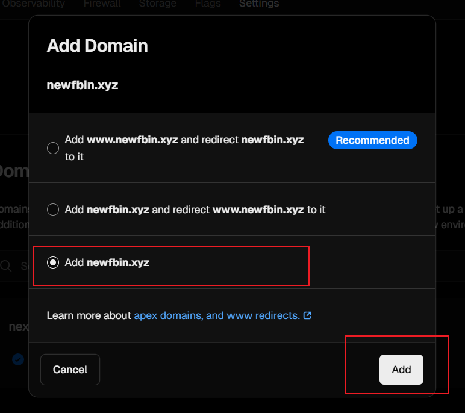

这一步需要选择 Configure Manually

添加成功后会出现如下提示：

由于需要使用阿里云作为 DNS provider，所以进入阿里云的 云解析 DNS，点击域名右边的 “解析”

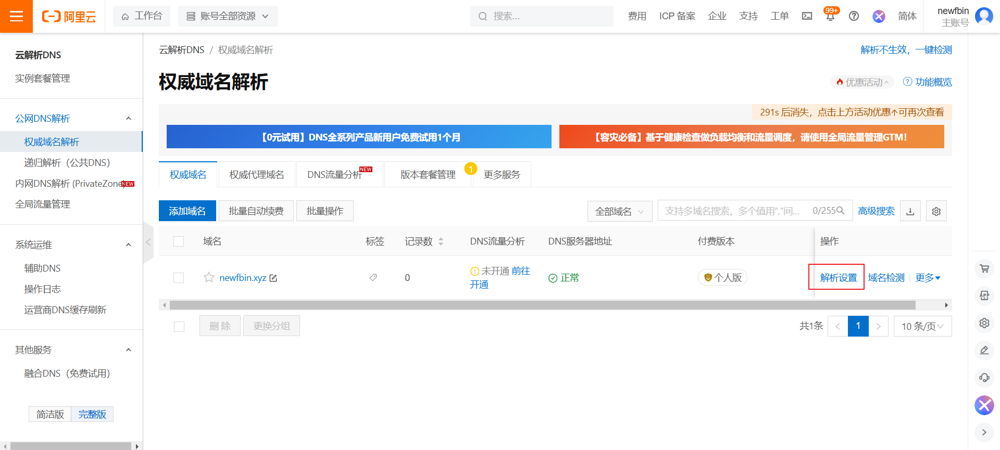

按照Vercel给的提示依次填入到阿里云中

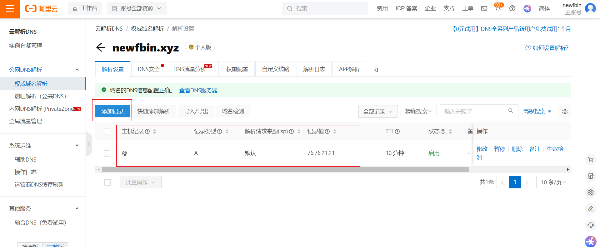

此时再回到Vercel中，可以看到域名已经被设置成功了

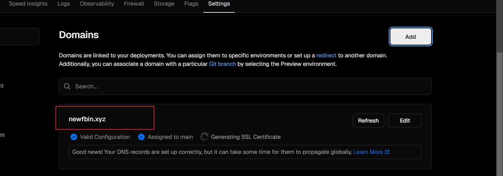

