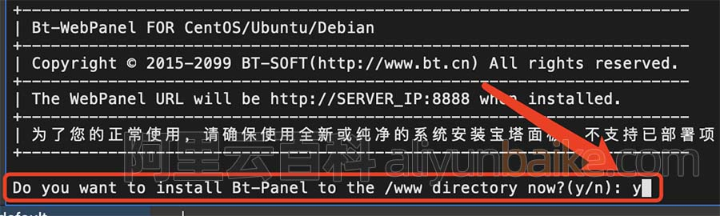
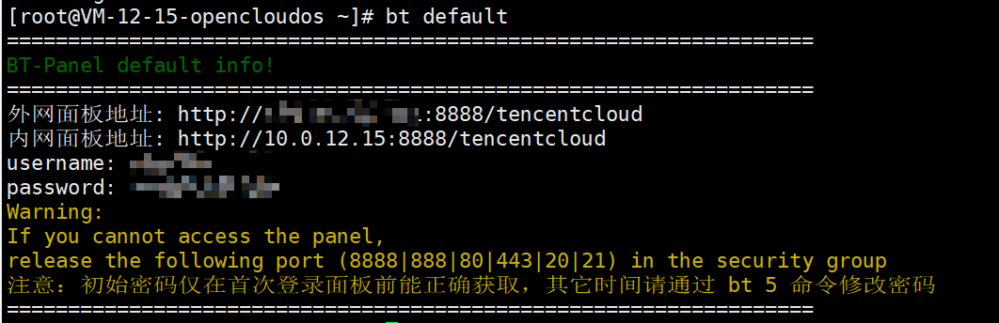
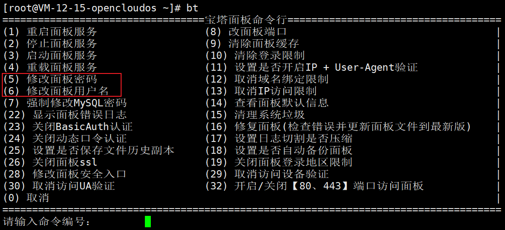
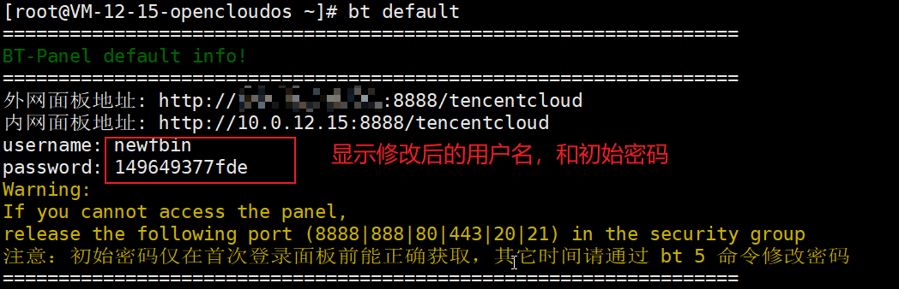
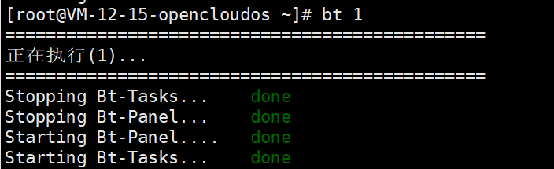
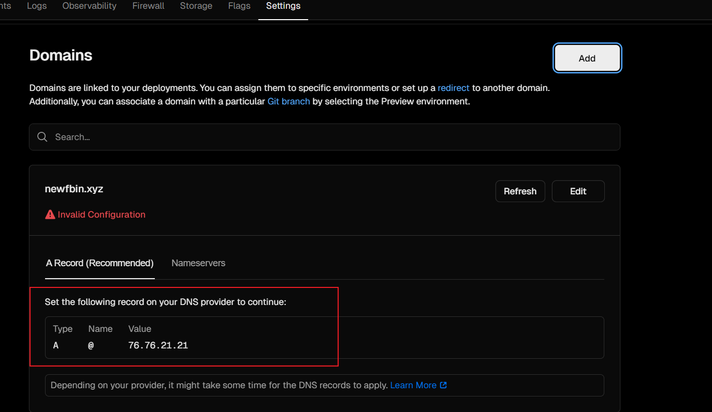
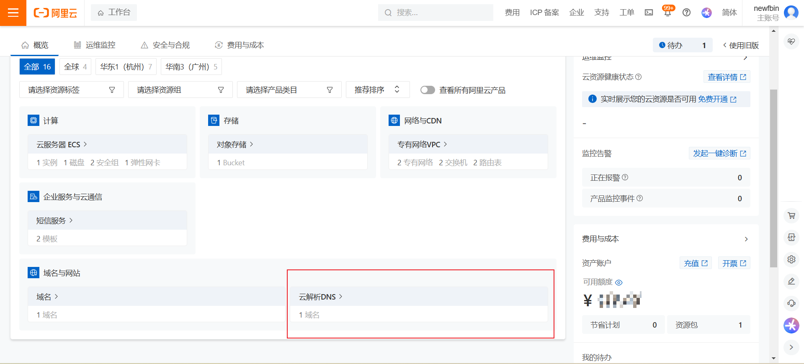

## 通用

### 域名解析的记录类型

在 Cloudflare 或其他 DNS 管理平台中，添加 DNS 记录时，需要选择记录类型。每种记录类型都有特定的用途和功能。以下所有 DNS 记录类型的详细解释：

---

#### 1. A 记录
- **全称**: Address Record
- **功能**: 将域名指向一个 IPv4 地址。
- **示例**: 
  - `example.com -> 192.0.2.1`

---

#### 2. AAAA 记录
- **全称**: IPv6 Address Record
- **功能**: 将域名指向一个 IPv6 地址。
- **示例**: 
  - `example.com -> 2001:db8::1`

---

#### 3. CAA 记录
- **全称**: Certification Authority Authorization
- **功能**: 指定哪些证书颁发机构（CA）可以为该域名颁发 SSL/TLS 证书。
- **示例**: 
  - 防止未经授权的 CA 为你的域名颁发证书。

---

#### 4. CERT 记录
- **全称**: Certificate Record
- **功能**: 存储公钥证书或其他加密证书信息。
- **用途**: 主要用于 DNSSEC 或其他加密场景。

---

#### 5. CNAME 记录
- **全称**: Canonical Name Record
- **功能**: 将一个域名指向另一个域名（别名）。
- **示例**: 
  - `www.example.com -> example.com`

---

#### 6. DNSKEY 记录
- **全称**: DNS Key Record
- **功能**: 用于 DNSSEC（域名系统安全扩展），存储公钥以验证 DNS 数据的完整性。
- **用途**: 帮助防止 DNS 欺骗攻击。

---

#### 7. DS 记录
- **全称**: Delegation Signer
- **功能**: 用于 DNSSEC 中，将子域名的信任链传递给父域名。
- **用途**: 在设置 DNSSEC 时，由父域名的管理员提供。

---

#### 8. HTTPS 记录
- **全称**: HTTPS Resource Record
- **功能**: 用于存储与 HTTPS 相关的加密信息，通常包含 HSTS（HTTP Strict Transport Security）策略。
- **用途**: 提高安全性，确保浏览器以加密方式访问网站。

---

#### 9. LOC 记录
- **全称**: Location Record
- **功能**: 指定域名的地理位置（经度、纬度、高度等）。
- **用途**: 主要用于地理定位服务。

---

#### 10. MX 记录
- **全称**: Mail Exchange Record
- **功能**: 指定处理该域名电子邮件的邮件服务器。
- **示例**: 
  - `example.com -> mail.example.com`

---

#### 11. NAPTR 记录
- **全称**: Naming Authority Pointer
- **功能**: 用于动态域名服务（如 ENUM），支持正则表达式匹配，通常用于电话号码映射或其他复杂查询。
- **用途**: 主要用于 VoIP 和电话服务。

---

#### 12. NS 记录
- **全称**: Name Server Record
- **功能**: 指定该域名的权威 DNS 服务器。
- **示例**: 
  - `example.com -> ns1.example.com, ns2.example.com`

---

#### 13. PTR 记录
- **全称**: Pointer Record
- **功能**: 用于反向 DNS 查找，将 IP 地址解析为域名。
- **示例**: 
  - `1.2.0.192.in-addr.arpa -> example.com`

---

#### 14. SMIMEA 记录
- **全称**: S/MIME Certificate Association
- **功能**: 存储与 S/MIME 证书相关的信息，用于加密电子邮件。
- **用途**: 提高电子邮件的安全性。

---

#### 15. SRV 记录
- **全称**: Service Record
- **功能**: 指定提供特定服务的服务器地址和端口。
- **示例**: 
  - `_sip._tcp.example.com -> sip.example.com:5060`

---

#### 16. SSHFP 记录
- **全称**: SSH Fingerprint
- **功能**: 存储 SSH 公钥的指纹，用于验证 SSH 服务器的身份。
- **用途**: 提高通过 SSH 连接的安全性。

---

#### 17. SVCB 记录
- **全称**: Service Binding
- **功能**: 提供服务的绑定信息，通常用于 HTTP/3 和 QUIC 协议。
- **用途**: 支持现代网络协议的服务发现。

---

#### 18. TLSA 记录
- **全称**: Transport Layer Security Association
- **功能**: 用于 DANE（DNS-Based Authentication of Named Entities），将 TLS 证书与域名绑定。
- **用途**: 提高 HTTPS 的安全性，防止中间人攻击。

---

#### 19. TXT 记录
- **全称**: Text Record
- **功能**: 存储任意文本信息，通常用于验证域名所有权、SPF（发件人策略框架）、DKIM（域名密钥识别邮件）等。
- **示例**: 
  - `v=spf1 include:_spf.example.com ~all`

---

#### 20. URI 记录
- **全称**: Uniform Resource Identifier Record
- **功能**: 存储与域名相关的 URI（统一资源标识符），通常用于应用层服务发现。
- **示例**: 
  - `_http._tcp.example.com -> http://example.com`

---

#### 总结
- **常见记录**: A、AAAA、CNAME、MX、TXT、NS。
- **安全相关**: CAA、CERT、DNSKEY、DS、TLSA、SSHFP。
- **高级功能**: SRV、SVCB、URI、NAPTR、LOC、SMIMEA。

根据你的实际需求选择合适的记录类型。例如：
- 如果你需要让域名指向一个服务器，使用 **A/AAAA** 或 **CNAME**。
- 如果你需要设置邮件服务，使用 **MX**。
- 如果你需要提高安全性，使用 **TLSA**、**SSHFP** 或 **DNSKEY**。

### 云服务器安装宝塔面板

登录到云服务器后，执行宝塔面板安装命令，阿里云服务器网使用的CentOS操作系统，命令如下：

```bash
yum install -y wget && wget -O install.sh https://download.bt.cn/install/install_6.0.sh && sh install.sh ed8484bec
```

执行宝塔Linux面板安装命令后，会提示如下：

> Do you want to install Bt-Panel to the /www directory now?(y/n): y

保持默认，回复个字母“y”，如下图：



然后回车，系统会自动安装，大约1分钟左右会自动安装完成。

### 腾讯云查看修改宝塔面板用户名密码

1.登录命令（可以得到外部链接、用户名、密码）

```bash
bt default
```



2.输入bt（获取命令提示）,按照提示选择要进行的操作



3.修改完用户名密码之后，再次输入`bt default`，可以看到修改后的用户名，但密码始终只显示初始密码



4.修改完账号密码后，执行 `bt 1`重启面板才能登录



5.如果提示多次登录失败，暂时禁止登录 请输入以下命令 清除登录限制:

```bash
rm -f /www/server/panel/data/*.login
```


## Cloudflare

### Cloudfalre 解析域名，并应用域名到Vercel上（无法实现国内直接访问）

#### 前言

随着前端技术的发展，目前的项目部署服务已经几乎脱离了实际的服务器。市面上的各大平台都推出了他们自己的前端部署 Paas 服务，比较知名的有 Vercel、Neltify、Github Pages、Cloudflare Pages 等等。

不过受一些相关的政策或者其他因素影响，一些服务实际上是不对国内提供的，比如 Vercel 实际上在去年开始起就开始针对大陆ip进行了封锁。目前仍能够在国内比较顺畅的进行访问的有 Neltify、Github Pages 等。

这篇文章主要是为了解决 **使用 Vercel 部署项目后无法正常访问的问题**。

`vercel` 实际上是允许用户自定义域名的，也就是说你如果有自己的域名你可以同时绑定在一起，并且还有一个我们的 **赛博大善人Cloudflare** 可以帮助我们进行域名解析以及CDN服务。引用我在找资料的时候知乎大神的介绍：

> Cloudflare的主流服务是域名解析，简单来说就是当你输入`baidu.com`的时候告诉计算机它所指向的ip地址是什么。这也是一个可以白嫖的网站，因为基础版的域名解析也是免费的。虽然免费，功能却一样不少，甚至更安全更丰富。Cloudflare对域名解析的同时提供代理服务，隐藏真实的ip，保护站点免受不法攻击。
>
> 你的应用在`vercel`部署之后会自动生成一个以`vercel.app`为后缀的域名，也支持自定义域名。自定义域名可以通过Cloudflare进行域名解析并利用代理服务达到访问`vercel`的目的。

因此，我们可以配合Cloudflare的域名解析，和在国内服务商购买好的域名，我们就可以**将`vercel`部署的应用的自带域名代理到我们自己的域名**，这样就可以**在国内访问我们的`vercel`应用**了。并且将域名代理到 CF 之后还能享受到它提供的诸多服务，何乐而不为呢！

#### 将腾讯云域名DNS解/析转移到Cloudflare进行

##### 准备一个自己的域名

既然是要代理到原来的域名，所以得准备一个自己在国内服务商购买的域名。具体的流程应该都清楚的吧也就不多说了，在腾讯云里面你只用登录控制台然后搜“域名注册”四个字就会提示你怎么操作了。唯一的要求就是你要付钱，我建议便宜点就行。


##### 登录Cloudflare控制台并添加站点

前往[www.cloudflare.com/zh-cn](https://link.juejin.cn/?target=https%3A%2F%2Fwww.cloudflare.com%2Fzh-cn)进行注册，有账号的直接登录。

进来之后看到如下页面，我之前加过一个站点所以会弹出来，没有的就可以不用管：


然后点击右侧的这个 **添加站点** 按钮就好了，进入下一步，输入你要加的域名（就是你之前在腾讯云上面买好的）然后点击继续：


然后选择计划，一般无特殊需求直接白嫖然后点击继续：


接下来 Cloudflare 会自动扫描你的部分dns记录。我这个域名是刚刚买的还没有进行一些解析的操作，所以是没有记录的。点击继续：


**然后最关键的点来了，Cloudflare会自动生成两条dns地址，就是下面两个云右边的字符串，你得拿着这两个地址去换掉腾讯云原本的解析**：


至此，Cloudflare部分的工作告一段落。**CF 对整个网页提供的功能绝对绝对不止这么点，剩下的功能等待你们自己去发掘啦～之后我或许会写一篇文章，总结一下我使用 CF 的各种心得。**

##### 在腾讯云域名管理控制台更改DNS服务器解析

接下来启动腾讯云域名管理后台[console.cloud.tencent.com/domain](https://link.juejin.cn/?target=https%3A%2F%2Fconsole.cloud.tencent.com%2Fdomain)。我这边有一个是已经解析到cloudflare所以DNS状态变成了其他，我现在要改的这个`nullvideo.cn`待会儿也会变成其他。


点击“解析”按钮右边的“管理”按钮，进入域名管理页，找到DNS解析部分：


然后点击“修改DNS服务器”，把刚刚Cloudflare给我们的两个DNS地址黏贴到原本的DNS地址处：


保存然后等待dns缓存刷新即可，这可能需要1-24小时因为每个域名体质不一样。

然后回到 Cloudflare 控制台就好了。至此，更换完成了。

#### 在Vercel上为自己部署好的前端应用添加新的域名解析

##### 将自己的应用通过vercel进行部署

这个就不在这里展开说了，你只要登录`vercel`的官网[vercel.com](https://link.juejin.cn/?target=https%3A%2F%2Fvercel.com)注册或者登录账号，然后自己跟着它的指示一步步来，最不济可以去查一查资料。。。反正这里不展开说了，默认大家都已经有一个部署好了的`vercel`应用了。

##### 去Cloudflare添加域名解析记录

在 Cloudflare 添加`CNAME`类型的解析，比如这个项目就是把`nullvideo.cn`重定向到`null-video.vercel.app`，并打开 proxy 服务。我在这边为了对应根路径访问和www访问，两个都加上了。


##### 对部署好的vercel应用添加除了自带域名的新域名解析

进入到部署好了的项目的主页，可以看到一个“Domain”的按钮，点击进入：


然后进入之后，输入你买好的域名然后点击Add：


选择默认的方案，也就是把根域名和`www`解析一起加上。


添加之后会进行校验，校验完成了之后就可以进行访问了。。。**看起来是这样，实际上还是有问题的！！！**

##### Vercel + Cloudflare = 重定向次数过多解决方案

你把域名解析添加好了，校验也通过了，然后你会直接点击访问：


没错，你会遇到**重定向次数过多**的问题。

这其实是Cloudflare为添加的站点加密模式设置错误导致的。

进入 Cloudflare Dashboard，点击有问题的域名，打开左侧的 SSL/TLS 设置，在 Overview 中设置加密模式为完全或完全（严格）即可。


这样子之后你的`vercel`应用应该是可以正常的在国内进行访问了。

希望能给大家使用 `vercel` 部署前端应用带来一些小小的帮助！

## 腾讯云

### 腾讯云解析域名，并应用域名到Vercel上（可实现国内无代理访问）

首先在腾讯云中购买一个域名。

在Vercel中点击Add添加域名


填写域名后点击Add Domain


按照图片点击


这一步需要选择 Configure Manually


添加成功后会出现如下提示：


由于需要使用腾讯云作为 DNS provider，所以进入腾讯云的 云解析 DNS，点击域名右边的 “解析”


按照Vercel给的提示依次填入到腾讯云中


此时再回到Vercel中，可以看到域名已经被设置成功了


## 阿里云

### 阿里云解析域名，并应用域名到Vercel上（可实现国内无代理访问）

首先在阿里云中购买一个域名。

在Vercel中点击Add添加域名


填写域名后点击Add Domain


按照图片点击


这一步需要选择 Configure Manually


添加成功后会出现如下提示：



由于需要使用阿里云作为 DNS provider，所以进入阿里云的 云解析 DNS，点击域名右边的 “解析”




按照Vercel给的提示依次填入到阿里云中


此时再回到Vercel中，可以看到域名已经被设置成功了


