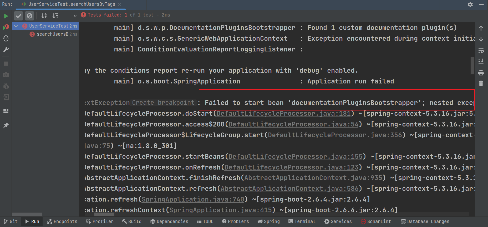
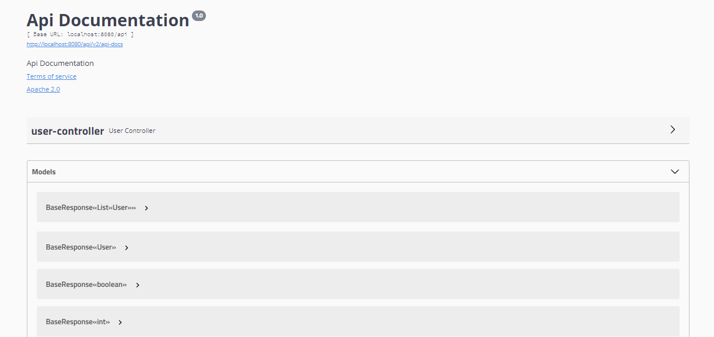
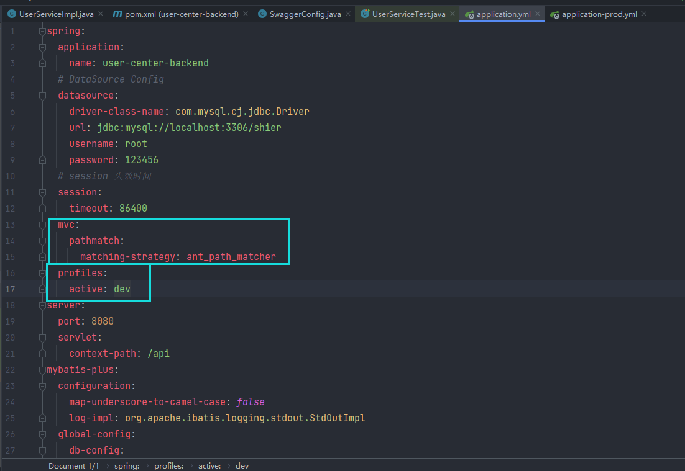
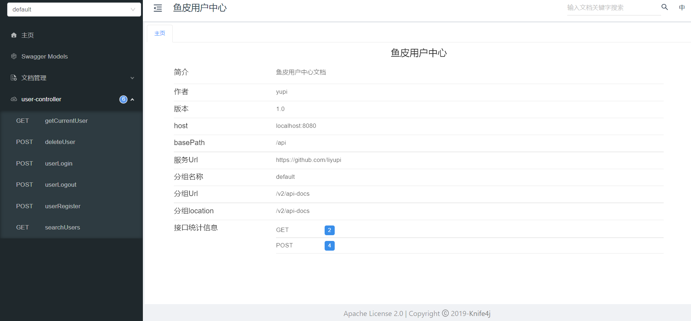
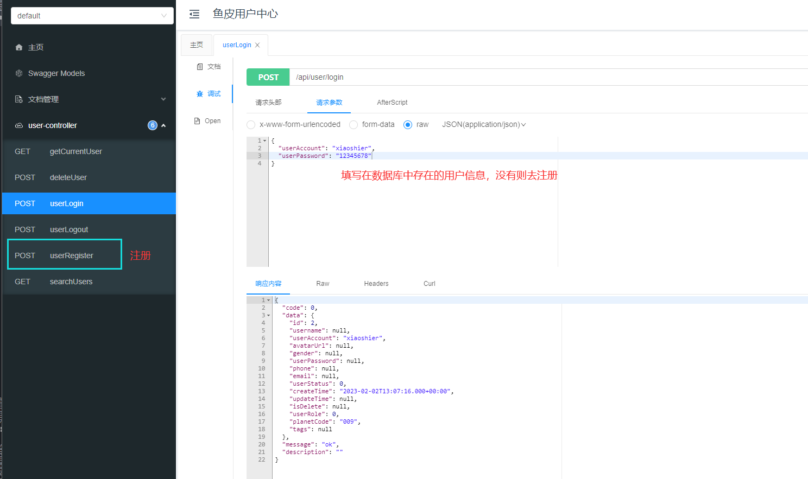
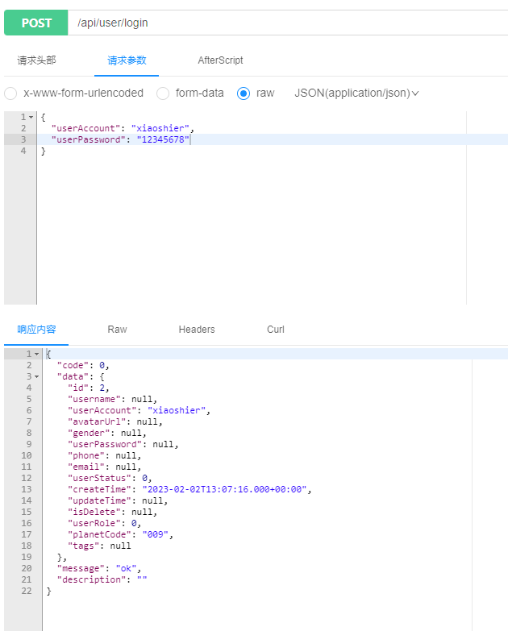
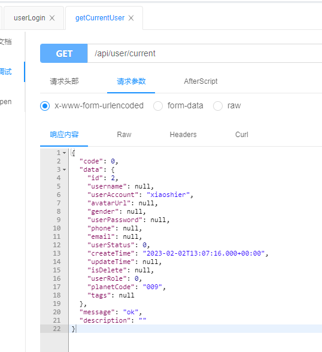
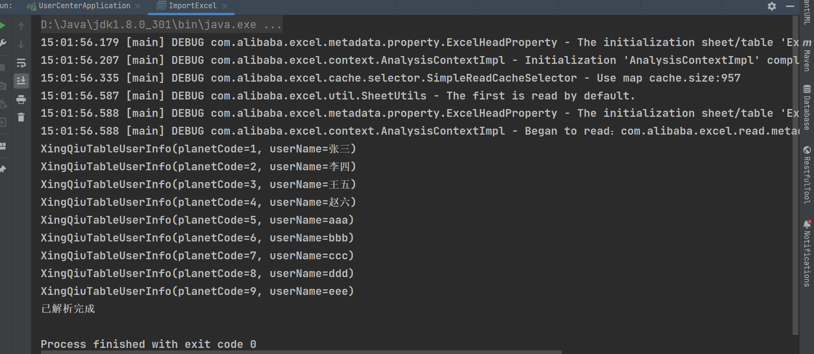
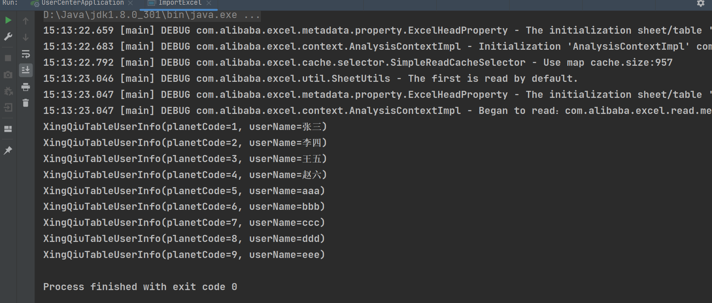
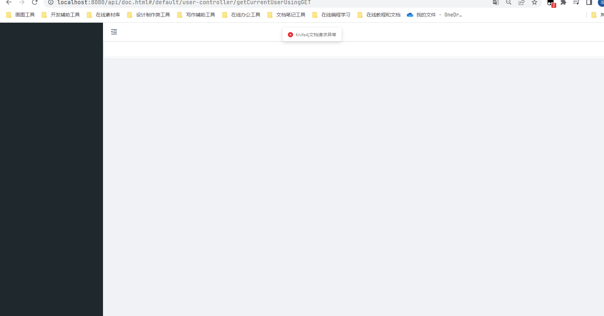

# 03 整合Swagger文档+导入用户信息

直播回访：[从 0 到 1 开发找伙伴系统（3）](https://t.zsxq.com/033rz3Rju) （Swagger + Knife4j 接口文档整合）

## 鱼皮笔记

### 本期目标计划：


1. Java 后端整合 Swagger + Knife4j 接口文档 10 min √
2. 存量用户信息导入及同步（爬虫） 30 min - 40 min
3. 前后端联调：搜索页面、用户信息页、用户信息修改页 30 - 40 min
4. 标签内容整理 15 min
5. 部分细节优化  todo


### 后端整合 Swagger + Knife4j 接口文档


什么是接口文档？写接口信息的文档，每条接口包括：


+ 请求参数
+ 响应参数 
  - 错误码
+ 接口地址
+ 接口名称
+ 请求类型
+ 请求格式
+ 备注


**who 谁用？一般是后端或者负责人来提供，后端和前端都要使用**


**为什么需要接口文档？**


+ 有个书面内容（背书或者归档），便于大家参考和查阅，便于 **沉淀和维护** ，拒绝口口相传
+ 接口文档便于前端和后端开发对接，前后端联调的 **介质** 。后端 => 接口文档 <= 前端
+ 好的接口文档支持在线调试、在线测试，可以作为工具提高我们的开发测试效率


**怎么做接口文档？**


+ 手写（比如腾讯文档、Markdown 笔记）
+ 自动化接口文档生成：自动根据项目代码生成完整的文档或在线调试的网页。Swagger，Postman（侧重接口管理）（国外）；apifox、apipost、eolink（国产）


**接口文档有哪些技巧？**


Swagger 原理：


1. 引入依赖（Swagger 或 Knife4j：https://doc.xiaominfo.com/knife4j/documentation/get_start.html）
2. 自定义 Swagger 配置类
3. 定义需要生成接口文档的代码位置（Controller）
4. 千万注意：线上环境不要把接口暴露出去！！！可以通过在 SwaggerConfig 配置文件开头加上 `@Profile({"dev", "test"})` 限定配置仅在部分环境开启
5. 启动即可
6. 可以通过在 controller 方法上添加 [[@Api、@ApiImplicitParam(name ](/Api、@ApiImplicitParam(name ) ](/Api、[@ApiImplicitParam(name ](/ApiImplicitParam(name ) ) = "name",value = "姓名",required = true)    [[@ApiOperation(value ](/ApiOperation(value ) ](/ApiOperation(value ) = "向客人问好") 等注解来自定义生成的接口描述信息 


如果 springboot version >= 2.6，需要添加如下配置：


```yaml
spring:
  mvc:
  	pathmatch:
      matching-strategy: ANT_PATH_MATCHER
```


todo 怎么隐藏


### 存量用户信息导入及同步


1. 把所有星球用户的信息导入
2. 把写了自我介绍的同学的标签信息导入


FeHelper 前端辅助插件，推荐安装


**看上了网页信息，怎么抓到？**


1. 分析原网站是怎么获取这些数据的？哪个接口？


按 F 12 打开控制台，查看网络请求，复制 curl 代码便于查看和执行：


```bash
curl "https://api.zsxq.com/v2/hashtags/48844541281228/topics?count=20" ^
  -H "authority: api.zsxq.com" ^
  -H "accept: application/json, text/plain, */*" ^
  -H "accept-language: zh-CN,zh;q=0.9" ^
  -H "cache-control: no-cache" ^
  -H "origin: https://wx.zsxq.com" ^
  -H "pragma: no-cache" ^
  -H "referer: https://wx.zsxq.com/" ^
  --compressed
```


2. **用程序去调用接口** （java okhttp httpclient / python 都可以）
3. 处理（清洗）一下数据，之后就可以写到数据库里


**流程**


1. 从 excel 中导入全量用户数据，**判重** 。 easy excel：[https://alibaba-easyexcel.github.io/index.html](https://alibaba-easyexcel.github.io/index.html)
2. 抓取写了自我介绍的同学信息，提取出用户昵称、用户唯一 id、自我介绍信息
3. 从自我介绍中提取信息，然后写入到数据库中


**EasyExcel**


两种读对象的方式：


1. 确定表头：建立对象，和表头形成映射关系
2. 不确定表头：每一行数据映射为 Map<String, Object>


两种读取模式：


1. 监听器：先创建监听器、在读取文件时绑定监听器。单独抽离处理逻辑，代码清晰易于维护；一条一条处理，适用于数据量大的场景。
2. 同步读：无需创建监听器，一次性获取完整数据。方便简单，但是数据量大时会有等待时常，也可能内存溢出。


## 后端整合 Swagger + Knife4j


### Swagger


> 鱼皮这里因为springboot版本和swagger版本的问题，并没有去具体实现swagger接口实现的效果，其实就差一步就行了，但鱼皮去整合knife4j去了。也没什么问题，我这里自己弄了一下swagger的页面展示。
>
> 
>
> (如果容易犯迷糊的，可以直接看下面knife4j，是按鱼皮的直播来的。)
>
> 
>
> 首先是依赖的引入。使用的是swagger2.9.2版本。


#### 第一步引入依赖


```xml
      <!-- swagger 接口文档 -->
        <dependency>
            <groupId>io.springfox</groupId>
            <artifactId>springfox-swagger2</artifactId>
            <version>2.9.2</version>
        </dependency>
        <dependency>
            <groupId>io.springfox</groupId>
            <artifactId>springfox-swagger-ui</artifactId>
            <version>2.9.2</version>
        </dependency>
```


#### 第二步设置Swagger配置类


> 然后是config文件的新建。（我这里代码掉过一次，所以和鱼皮的不一样，没有webmvcConfig文件）


```java
package com.yupi.usercenter.config;

import org.springframework.context.annotation.Bean;
import org.springframework.context.annotation.Configuration;
import springfox.documentation.builders.ApiInfoBuilder;
import springfox.documentation.builders.PathSelectors;
import springfox.documentation.builders.RequestHandlerSelectors;
import springfox.documentation.service.ApiInfo;
import springfox.documentation.service.Contact;
import springfox.documentation.spi.DocumentationType;
import springfox.documentation.spring.web.plugins.Docket;
import springfox.documentation.swagger2.annotations.EnableSwagger2;

/**
 * @author Shier
 * @date 2023/02/02
 * 自定义 Swagger 接口文档的配置
 */
@Configuration // 配置类
@EnableSwagger2 // 开启 swagger2 的自动配置
public class SwaggerConfig {
    @Bean
    public Docket docket() {
        // 创建一个 swagger 的 bean 实例
        return new Docket(DocumentationType.SWAGGER_2)
                // 配置接口信息
                .select() // 设置扫描接口
                // 配置如何扫描接口
                .apis(RequestHandlerSelectors
                                //.any() // 扫描全部的接口，默认
                                //.none() // 全部不扫描
                                .basePackage("com.yupi.usercenter.controller") // 扫描指定包下的接口，最为常用
                        //.withClassAnnotation(RestController.class) // 扫描带有指定注解的类下所有接口
                        //.withMethodAnnotation(PostMapping.class) // 扫描带有只当注解的方法接口

                ).paths(PathSelectors.any() // 满足条件的路径，该断言总为true
                        //.none() // 不满足条件的路径，该断言总为false（可用于生成环境屏蔽 swagger）
                        //.ant("/user/**") // 满足字符串表达式路径
                        //.regex("") // 符合正则的路径
                ).build();
    }

    // 基本信息设置
    private ApiInfo apiInfo() {
        Contact contact = new Contact("shier", // 作者姓名
                "https://blog.csdn.net/qq_56098191?spm=1000.2115.3001.5343", // 作者网址
                "2927527234@qq.com"); // 作者邮箱
        return new ApiInfoBuilder().title("鱼泡伙伴匹配系统-接口文档") // 标题
                .description("你若盛开，清风徐来") // 描述
                .termsOfServiceUrl("https://github.com/kongshier") // 跳转连接
                .version("1.0") // 版本
                .license("Swagger-的使用(详细教程)").licenseUrl("https://blog.csdn.net/qq_56098191?spm=1000.2115.3001.5343").contact(contact).build();
    }
}
```


如果你的springboot版本是大于等于2.6以上，大概率会出现一下报错：  



在application.yaml配置文件中添加如下配置：


```yaml
spring:
  mvc:
    pathmatch:
      matching-strategy: ANT_PATH_MATCHER
```

.png)


> 最后运行此地址URL：[http://localhost:8080/api/swagger-ui.html](http://localhost:8080/api/swagger-ui.html)



### Knife4j


#### 第一步：在用户中心系统的pom.xml中引入[Knife4j的依赖包](https://search.maven.org/search?q=a:knife4j)


```xml
<!--引入Knife4j的官方start包,Swagger2基于Springfox2.10.5项目-->
<dependency>
    <groupId>com.github.xiaoymin</groupId>
    <!--使用Swagger2-->
    <artifactId>knife4j-spring-boot-starter</artifactId>
    <version>2.0.9</version>
</dependency>
```


#### 第二步：在config目录（没有就新建）下创建Knife4j配置依赖，代码如下：


```java
package com.yupi.usercenter.config;

import org.springframework.context.annotation.Bean;
import org.springframework.context.annotation.Configuration;
import org.springframework.context.annotation.Profile;
import springfox.documentation.builders.ApiInfoBuilder;
import springfox.documentation.builders.PathSelectors;
import springfox.documentation.builders.RequestHandlerSelectors;
import springfox.documentation.service.ApiInfo;
import springfox.documentation.service.Contact;
import springfox.documentation.spi.DocumentationType;
import springfox.documentation.spring.web.plugins.Docket;
import springfox.documentation.swagger2.annotations.EnableSwagger2WebMvc;

/**
 * @author Shier
 * @date 2023/02/02
 * 自定义 Swagger 接口文档的配置
 */

/**
 * @author: shayu
 * @date: 2022/11/20
 * @ClassName: yupao-backend01
 * @Description: 自定义 Swagger 接口文档的配置
 */
@Configuration
@EnableSwagger2WebMvc
@Profile({"dev", "test"})   //版本控制访问
public class SwaggerConfig {

    @Bean(value = "defaultApi2")
    public Docket defaultApi2() {
        return new Docket(DocumentationType.SWAGGER_2)
                .apiInfo(apiInfo())
                .select()
                // 这里一定要标注你控制器的位置
                .apis(RequestHandlerSelectors.basePackage("com.yupi.usercenter.controller"))
                .paths(PathSelectors.any())
                .build();
    }

    /**
     * api 信息
     * @return
     */
    private ApiInfo apiInfo() {
        return new ApiInfoBuilder()
                .title("鱼皮用户中心")
                .description("鱼皮用户中心接口文档")
                .termsOfServiceUrl("https://github.com/kongshier")
                .contact(new Contact("shier", "https://blog.csdn.net/qq_56098191?spm=1000.2115.3001.5343","2927527234@qq.com"))
                .version("1.0")
                .build();
    }
}
```


需要配置，不然会和Swagger一样的报错


```yaml
mvc:
  pathmatch:
    matching-strategy: ant_path_matcher
profiles:
  active: dev
```




> 可以通过在 controller 方法上添加 [@Api、@ApiImplicitParam(name ](/Api、@ApiImplicitParam(name ) = "name",value = "姓名",required = true) [@ApiOperation(value ](/ApiOperation(value ) = "向客人问好") 等注解来自定义生成的接口描述信息。 
>
> 
>
> 千万注意：线上环境不要把接口暴露出去！！！可以通过在 SwaggerConfig 配置文件开头加上 @Profile({"dev", "test"}) 限定配置仅在部分环境开启


去application.yml中修改默认配置，并在swaggerConfig中加上@Profile注解


> 访问这个路径：[http://localhost:8080/api/doc.html](http://localhost:8080/api/doc.html)


显示如下  



#### 第三步：测试knife4j


首先需要登录




成功获取响应内容




现在再测试下获取登录用户信息



## 存量用户信息导入及同步


### 分析原网站是怎么获取这些数据的？哪个接口？


1. 按 F12 打开控 制台，查看网络请求，复制 curl 代码便于查看和执行：


```bash
curl "https://api.zsxq.com/v2/hashtags/48844541281228/topics?count=20" ^
  -H "authority: api.zsxq.com" ^
  -H "accept: application/json, text/plain, */*" ^
  -H "accept-language: zh-CN,zh;q=0.9" ^
  -H "cache-control: no-cache" ^
  -H "origin: https://wx.zsxq.com" ^
  -H "pragma: no-cache" ^
  -H "referer: https://wx.zsxq.com/" ^
  --compressed
```


2. **用程序去调用接口** （java okhttp httpclient / python 都可以）
3. 处理（清洗）一下数据，之后就可以写到数据库里


### 具体实现流程


#### 第一步


从 excel 中导入全量用户数据，**判重**  
这里使用了easyexcel   官网： [https://easyexcel.opensource.alibaba.com/docs/current/](https://easyexcel.opensource.alibaba.com/docs/current/)  
在pom.xml里引入依赖


```xml
<!-- https://mvnrepository.com/artifact/com.alibaba/easyexcel -->
<dependency>
    <groupId>com.alibaba</groupId>
    <artifactId>easyexcel</artifactId>
    <version>3.1.1</version>
</dependency>
```


#### 第二步


现在开始写读表格的程序


> 首先这是一次性的代码，我们先创建一个once目录，再创建XingQiuTableUserInfo.java文件，这个文件作用就是将表格和对象相关联起来


```java
package com.yupi.usercenter.once;

import com.alibaba.excel.annotation.ExcelProperty;
import lombok.Data;

/**
 * 星球表格用户信息
 */
@Data
public class XingQiuTableUserInfo {
    /**
     * 星球编号
     */
    @ExcelProperty("成员编号")
    private String planetCode;

    /**
     * 用户昵称
     */
    @ExcelProperty("成员昵称")
    private String userName;
}
```


创建一个监听器


```java
package com.yupi.usercenter.once;

import com.alibaba.excel.context.AnalysisContext;
import com.alibaba.excel.read.listener.ReadListener;
import lombok.extern.slf4j.Slf4j;

@Slf4j
public class TableListener implements ReadListener<XingQiuTableUserInfo> {
    /**
     * 这个每一条数据解析都会来调用
     *
     * @param data    one row value. Is is same as {@link AnalysisContext#readRowHolder()}
     * @param context
     */
    @Override
    public void invoke(XingQiuTableUserInfo data, AnalysisContext context) {
        System.out.println(data);
    }

    /**
     * 所有数据解析完成了 都会来调用
     *
     * @param context
     */
    @Override
    public void doAfterAllAnalysed(AnalysisContext context) {
        System.out.println("已解析完成");
    }
}
```


> 最后我们要使用，先创建一个ImportExcel类作为实现类，先使用官方文档的方法一。即第一种读取方式：监听器：先创建监听器、在读取文件时绑定监听器。单独抽离处理逻辑，
>
> 
>
> 代码清晰易于维护；一条一条处理，适用于数据量大的场景。[https://www.yuque.com/kcsshier/wcitgt/ur1t74fwshpi1i98](https://www.yuque.com/kcsshier/wcitgt/ur1t74fwshpi1i98)
>
> 
>
> 同时我们也需要创建一个假数据的excel表格来进行测试，我这边提供一个 自己写的假数据：[testExcel.xlsx]([https://www.yuque.com/kcsshier/wcitgt/ur1t74fwshpi1i98?singleDoc#6edd](https://www.yuque.com/kcsshier/wcitgt/ur1t74fwshpi1i98?singleDoc#6edd) 《testExcel》)


#### 第三步-导入excel


```java
package com.yupi.usercenter.once;

import com.alibaba.excel.EasyExcel;

/**
 * 导入Excel
 */
public class ImportExcel {
    public static void main(String[] args) {
        //写法1
        String fileName = "F:\\code\\星球项目\\用户中心\\user-center-backend-master\\src\\main\\resources\\testExcel.xlsx";
        // 这里 需要指定读用哪个class去读，然后读取第一个sheet 文件流会自动关闭
        // 这里每次会读取100条数据 然后返回过来 直接调用使用数据就行
        EasyExcel.read(fileName,XingQiuTableUserInfo.class,new TableListener()).sheet().doRead();
    }
}
```


测试运行  



试一下第二种方法：同步读：无需创建监听器，一次性获取完整数据。方便简单，但是数据量大时会有等待时常，也可能内存溢出。在ImportExcel里创建两个方法，为了以后调用


方便，修改代码如下


```java
package com.yupi.usercenter.demo;
import com.alibaba.excel.EasyExcel;
import java.util.List;

/**
 * @author: shier
 * @date: 2023/02/02
 * 导入Excel，读取数据
 */
public class ImportExcel {
    /**
     * 读取数据
     */
    public static void main(String[] args) {
        // 写法1：JDK8+ ,不用额外写一个DemoDataListener
        // since: 3.0.0-beta1
        //Excel数据文件放在自己电脑上，能够找到的路径
        String fileName = "E:\\Projects\\PartnerSystem\\testExcel.xlsx";
        // readByListener(fileName);
        synchronousRead(fileName);
    }

    /**
     * 监听器读取
     * @param fileName
     */
    public static void readByListener(String fileName) {
        // 这里 需要指定读用哪个class去读，然后读取第一个sheet 文件流会自动关闭
        // 这里每次会读取100条数据 然后返回过来 直接调用使用数据就行
        EasyExcel.read(fileName, XingQiuTableUserInfo.class, new TableListener()).sheet().doRead();
    }

    /**
     * 同步读
     * 同步的返回，不推荐使用，如果数据量大会把数据放到内存里面
     */
    public static void synchronousRead(String fileName) {
        // 这里 需要指定读用哪个class去读，然后读取第一个sheet 同步读取会自动finish
        List<XingQiuTableUserInfo> list = EasyExcel.read(fileName).head(XingQiuTableUserInfo.class).sheet().doReadSync();
        for (XingQiuTableUserInfo xingQiuTableUserInfo : list) {
            System.out.println(xingQiuTableUserInfo);
        }
    }
}
```





先配置为prod，再运行，发现访问失败





**由于球友们的昵称太过于“抽象”，无法做到通过成员昵称去导入星球用户信息到数据库中！**


```java
package com.yupi.usercenter.demo;

import com.alibaba.excel.EasyExcel;
import org.apache.commons.lang3.StringUtils;

import java.util.List;
import java.util.Map;
import java.util.stream.Collectors;

/**
 * 导入星球用户到数据库
 */
public class ImportXingQiuUser {

    public static void main(String[] args) {
        //Excel数据文件放在自己电脑上，能够找到的路径
        String fileName = "E:\\Projects\\PartnerSystem\\testExcel.xlsx";
        // 这里 需要指定读用哪个class去读，然后读取第一个sheet 同步读取会自动finish
        List<XingQiuTableUserInfo> userInfoList =
                EasyExcel.read(fileName).head(XingQiuTableUserInfo.class).sheet().doReadSync();

        System.out.println("总数 = " + userInfoList.size());
        // 判断是否有重复
        Map<String, List<XingQiuTableUserInfo>> listMap =
                userInfoList.stream()
                        .filter(userInfo -> StringUtils.isNotEmpty(userInfo.getUserName()))
                        .collect(Collectors.groupingBy(XingQiuTableUserInfo::getUserName));

        for (Map.Entry<String, List<XingQiuTableUserInfo>> stringListEntry : listMap.entrySet()) {
            if (stringListEntry.getValue().size() > 1) {
                System.out.println("username = " + stringListEntry.getKey());
                System.out.println("1");
            }
        }
        System.out.println("不重复昵称数 = " + listMap.keySet().size());
    }
}
```


# 拓展

## GSON入门

见 Java后端/08-02 中的拓展的第3

## Gson的TypeToken与泛型擦除

见 Java后端/08-02 中的拓展的第4

## UseRoute和UseRouter的区别

见 前端/04-03 中拓展的第1

## 爬虫思路

**手机端抖音爬虫思路：**

手机上下载一个抓包软件,或者在电脑上安装一个模拟器，再配上Chaos/Charles proxyman什么的抓包工具，获取到请求信息，分析出来获取信息的接口。

爬虫最重要的一个点是限制频率，爬虫的频率不要太高。

