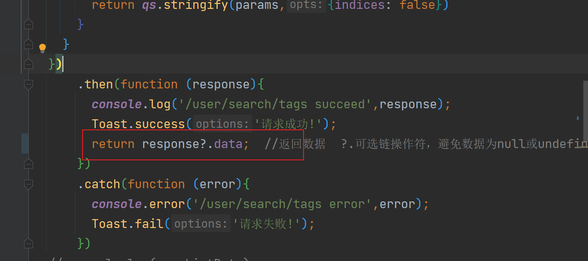
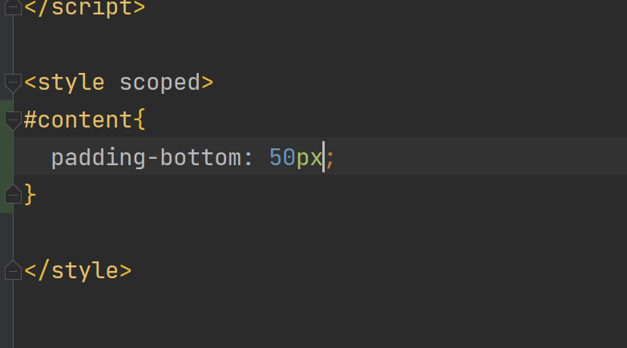
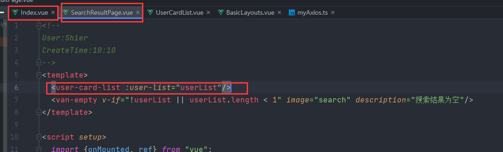
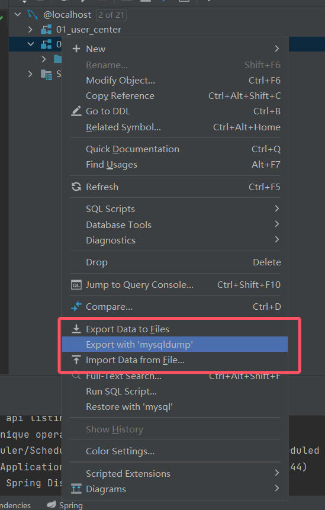
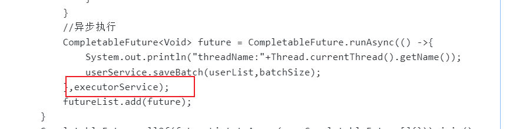
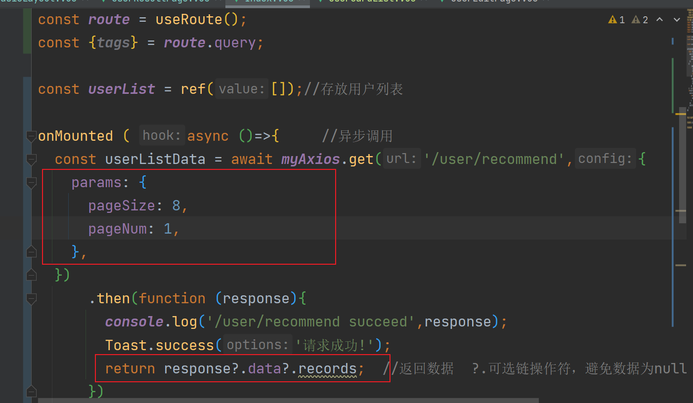

# 06 主页开发+ 一次性任务+批量导入数据

在线回放：[https://meeting.tencent.com/v2/cloud-record/share?...](https://meeting.tencent.com/v2/cloud-record/share?id=65c1d5f7-8465-4c70-99bb-eb3e148ceb0c&from=3)（访问密码：wr5M）

# 鱼皮笔记

### 1.开发主页（默认推荐和自己兴趣相当的用户）


### 2.优化主页的性能（缓存 + 定时任务 + 分布式锁）


# 开发主页


最简单：直接 list 列表  
模拟 1000 万个用户，再去查询


#### 导入数据


1. 用可视化界面：适合一次性导入、数据量可控
2. 写程序：for 循环，建议分批，不要一把梭哈（可以用接口来控制）**要保证可控、幂等，注意线上环境和测试环境是有区别的**导入 1000 万条，for i 1000w
3. 执行 SQL 语句：适用于小数据量


#### 编写一次性任务


for 循环插入数据的问题：


1. 建立和释放数据库链接（批量查询解决）
2. for 循环是绝对线性的（并发）


并发要注意执行的先后顺序无所谓，不要用到非并发类的集合  
   private ExecutorService executorService = new ThreadPoolExecutor(16, 1000, 10000, TimeUnit.MINUTES, new ArrayBlockingQueue<>(10000));


```plain
// CPU 密集型：分配的核心线程数 = CPU - 1
// IO 密集型：分配的核心线程数可以大于 CPU 核数
```


数据库慢？预先把数据查出来，放到一个更快读取的地方，不用再查数据库了。（缓存）  
预加载缓存，定时更新缓存。（定时任务）  
多个机器都要执行任务么？（分布式锁：控制同一时间只有一台机器去执行定时任务，其他机器不用重复执行了）


# 开发页面


### 1.启动前后端项目


进入搜索页面选择数据库里存在的标签搜索，发现搜索为空，这是因为我们取了两次响应的data，自然搜不到，`SearchResultPage.vue`修改如下代码：





刷新页面，成功展现数据库里被筛选的数据


### 2.编写主页（直接list列表）


在后端controller层编写接口去实现显示推荐页面的功能


```java
    /**
     * 推荐页面
     * @param request
     * @return
     */
    @GetMapping("/recommend")
    public BaseResponse<List<User>> recommendUsers(HttpServletRequest request){
        QueryWrapper<User> queryWrapper = new QueryWrapper<>();
        List<User> userList = userService.list(queryWrapper);
        List<User> list = userList.stream().map(user -> userService.getSafetyUser(user)).collect(Collectors.toList());
        return ResultUtils.success(list);
    }
```


> 重启后端


前端就先复制搜索结果的代码，在修改一个一些不需要的即可


```vue
<!--
User:Shier
CreateTime:14:47
-->
<template>
  <van-card
      v-for="user in userList"
      :desc="user.profile"
      :title="`${user.username} (${user.planetCode})`"
      :thumb="user.avatarUrl"
  >
    <template #tags>
      <van-tag plain type="danger" v-for="tag in tags" style="margin-right: 8px; margin-top: 8px">
        {{ tag }}
      </van-tag>
    </template>
    <template #footer>
      <van-button size="mini">联系我</van-button>
    </template>
  </van-card>
  <van-empty v-if="!userList || userList.length < 1" image="search" description="数据为空"/>
</template>

<script setup>
  import {onMounted, ref} from "vue";
  import {useRoute} from "vue-router";
  import {showFailToast, showSuccessToast} from "vant/lib/vant.es";
  import myAxios from "../plugins/myAxios.ts";

  import qs from 'qs'

  const route = useRoute();
  const {tags} = route.query;

  const userList = ref([]); //用户列表

  onMounted(async () => {
    // 为给定 ID 的 user 创建请求
    const userListData = await myAxios.get('/user/recommend', {
      withCredentials: false,
      params: {},
    })
        .then(function (response) {
          console.log('/user/recommend succeed', response);
          showSuccessToast('请求成功');
          return response?.data;
        })
        .catch(function (error) {
          console.log('/user/recommend error', error);
          showFailToast('请求失败')
        });
    if (userListData) {
      userListData.forEach(user => {
        if (user.tags) {
          user.tags = JSON.parse(user.tags);
        }
      })
      userList.value = userListData;
    }
  })

</script>

<style scoped>

</style>
```


刷新页面，成功显示


但是页面显示还有一定问题，下面有一块不显示，在前端修改样式  
`basicLayout.vue`里面添加以下样式





我们发现有几个页面都用到了列表组件，所以我们提取出公共组件，来减少代码的编写  
在公共组件包里添加`UserCardList`，并复制主页里面的模板修改为如下


```vue
<template>
  <van-card
      v-for="user in userList"
      :desc="user.profile"
      :title="`${user.username} (${user.planetCode})`"
      :thumb="user.avatarUrl"
  >
    <template #tags>
      <van-tag plain type="danger" v-for="tag in user.tags" style="margin-right: 8px; margin-top: 8px" >
        {{ tag }}
      </van-tag>
    </template>
    <template #footer>
      <van-button size="mini">联系我</van-button>
    </template>
  </van-card>
</template>

<script setup lang="ts">
import {UserType} from "../models/user";

interface UserCardListProps{
  userList: UserType[];
}
// 给父组件设置默认值，保证数据不为空
const props= withDefaults(defineProps<UserCardListProps>(),{
  //@ts-ignore
  userList: [] as UserType[]
});

</script>
<style scoped>
  /* 标签颜色*/
  .van-tag--danger.van-tag--plain {
    color: #002fff;
  }
</style>
```


然后在`Index`、`SearchResultPage`引入`UserCardList`





> 测试一下，主页和用户结果页面应该显示正常


### 3.模拟1000万用户，再次进行查询

我们需要插入数据，有以下方法：  
1.用可视化界面：适合一次性导入、数据量可控  
由于编码，主键以及某些字段的问题（id，createtime等），演示插入失败，这里不推荐  



2.写程序：for 循环，建议分批，不要一把梭哈,这里演示了两种插入数据的方法  
首先创建测试方法文件InsertUsersTest，编写批量查询解决

> 并发执行，这里的线程可自定义或者用idea默认的，两种方法的区别是，自定义可以跑满线程，而默认的只能跑CPU核数-1，代码区别：就是在异步执行处加上自定义的线程名

```java
@SpringBootTest
public class InsertUserTest {
    @Resource
    private UserService userService;

    //线程设置
    private ExecutorService executorService = new ThreadPoolExecutor(16, 1000, 10000, TimeUnit.MINUTES, new ArrayBlockingQueue<>(10000));

    /**
     * 循环插入用户  耗时：7260ms
     * 批量插入用户   1000  耗时： 4751ms
     */
    //@Test
    public void doInsertUser() {
        StopWatch stopWatch = new StopWatch();
        stopWatch.start();
        final int INSERT_NUM = 1000;
        List<User> userList = new ArrayList<>();
        for (int i = 0; i < INSERT_NUM; i++) {
            User user = new User();
            user.setUserName("假数据");
            user.setUserAccount("FakeAccount");
            user.setUserAvatar("https://i.ytimg.com/vi/ucPl4gJuev0/maxresdefault.jpg");
            user.setUserPassword("12345678");
            user.setUserRole("user");
            user.setTags("[]");
            userList.add(user);
        }
        userService.saveBatch(userList, 100);
        stopWatch.stop();
        System.out.println(stopWatch.getLastTaskTimeMillis());

    }

    /**
     * 并发批量插入用户   100000  耗时： 26830ms
     */
    //@Test
    public void doConcurrencyInsertUser() {
        StopWatch stopWatch = new StopWatch();
        stopWatch.start();
        final int INSERT_NUM = 100000;
        // 分十组
        int j = 0;
        //批量插入数据的大小
        int batchSize = 5000;
        List<CompletableFuture<Void>> futureList = new ArrayList<>();
        // i 要根据数据量和插入批量来计算需要循环的次数。（鱼皮这里直接取了个值，会有问题,我这里随便写的）
        for (int i = 0; i < INSERT_NUM / batchSize; i++) {
            List<User> userList = new ArrayList<>();
            //确定每个线程要处理的列表
            while (true) {
                j++;
                User user = new User();
                user.setUserName("假数据");
                user.setUserAccount("FakeAccount");
                user.setUserAvatar("https://i.ytimg.com/vi/ucPl4gJuev0/maxresdefault.jpg");
                user.setUserPassword("12345678");
                user.setUserRole("user");
                user.setTags("[]");
                userList.add(user);
                if (j % batchSize == 0) {
                    break;
                }
            }
            //异步执行 使用CompletableFuture开启异步任务
            CompletableFuture<Void> future = CompletableFuture.runAsync(() -> {
                System.out.println("ThreadName：" + Thread.currentThread().getName());
                userService.saveBatch(userList, batchSize);
                //executorService是用于执行异步任务的线程池。
            }, executorService);
            futureList.add(future);
        }
        //allOf方法用于等待多个异步任务的完成
        //join() 方法会阻塞当前线程，直到所有异步任务都完成。如果任务有异常，它会抛出异常。
        CompletableFuture.allOf(futureList.toArray(new CompletableFuture[]{})).join();

        stopWatch.stop();
        System.out.println(stopWatch.getLastTaskTimeMillis());
    }
}


```


若使用默认线程池，删去



现在启动前后端，查看主页，发现搜查不出，这是因为数据太多需要分页，修改后端接口方法

```java
    /**
     * 推荐页面
     * @param request
     * @return
     */
    @GetMapping("/recommend")
    public BaseResponse<Page<User>> recommendUsers(long pageSize,long pageNum, HttpServletRequest request){
        QueryWrapper<User> queryWrapper = new QueryWrapper<>();
        Page<User> userList = userService.page(new Page<>(pageNum, pageSize), queryWrapper);
        return ResultUtils.success(userList);
    }
```

> 同时还要引入mybatis的分页插件配置，直接复制文档到config目录
>
> 主要不要忘了把扫包的路径改为自己的

```java
package com.yupi.usercenter.config;

import com.baomidou.mybatisplus.annotation.DbType;
import com.baomidou.mybatisplus.extension.plugins.MybatisPlusInterceptor;
import com.baomidou.mybatisplus.extension.plugins.inner.PaginationInnerInterceptor;
import org.mybatis.spring.annotation.MapperScan;
import org.springframework.context.annotation.Bean;
import org.springframework.context.annotation.Configuration;

@Configuration
@MapperScan("com.yupi.usercenter.mapper")
public class MybatisPlusConfig {

    /**
     * 新的分页插件,一缓和二缓遵循mybatis的规则,需要设置 MybatisConfiguration#useDeprecatedExecutor = false 避免缓存出现问题(该属性会在旧插件移除后一同移除)
     */
    @Bean
    public MybatisPlusInterceptor mybatisPlusInterceptor() {
        MybatisPlusInterceptor interceptor = new MybatisPlusInterceptor();
        interceptor.addInnerInterceptor(new PaginationInnerInterceptor(DbType.H2));
        return interceptor;
    }
}
```


现在去修改前端主页




刷新页面，成功展现8条数据


## 第六期完结🎉🎉🎉🎉🎉🎉


> 更新: 2023-02-10 10:04:36  
> 原文: <https://www.yuque.com/shierkcs/catstudy/cquggn9uqxqrs249>