# 09 后端队伍开发

<font style="color:rgb(51, 51, 51);">在线回放：</font>[https://meeting.tencent.com/v2/cloud-record/share?...](https://meeting.tencent.com/v2/cloud-record/share?id=ce65608f-752f-448f-864a-3fd7d6e34cd2&from=3)<font style="color:rgb(51, 51, 51);">（访问密码：beMk）</font>

# 鱼皮笔记

### 组队功能


理解为王者荣耀


#### 理想的应用场景


> 我要跟别人一起参加竞赛或者做项目，可以发起队伍或者加入别人的队伍


#### 需求分析


+ 用户可以 **创建** 一个队伍，设置队伍的人数、队伍名称（标题）、描述、超时时间 P0  
  聊天？
+ 队长、剩余的人数
+ 公开 或 private 或加密
+ **用户创建队伍最多 5 个**
+ 展示队伍列表，根据名称搜索队伍 P0，信息流中不展示已过期的队伍
+ 修改队伍信息 P0 ~ P1
+ 用户可以加入队伍（其他人、未满、未过期），允许加入多个队伍，但是要有个上限 P0
+ 是否需要队长同意？筛选审批？
+ 用户可以退出队伍（如果队长退出，权限转移给第二早加入的用户 —— 先来后到） P1
+ 队长可以解散队伍 P0

---

分享队伍 =》 邀请其他用户加入队伍 P1  
业务流程：


1. 生成分享链接（分享二维码）
2. 用户访问链接，可以点击加入


队伍人满后发送消息通知 P1


#### 系统（接口）设计


##### 1、创建队伍

用户可以 **创建** 一个队伍，设置队伍的人数、队伍名称（标题）、描述、超时时间 P0  
队长、剩余的人数  
聊天？  
公开 或 private 或加密  
信息流中不展示已过期的队伍


1. 请求参数是否为空？
2. 是否登录，未登录不允许创建
3. 校验信息 
   1. 队伍人数 > 1 且 <= 20
   2. 队伍标题 <= 20
   3. 描述 <= 512
   4. status 是否公开（int）不传默认为 0（公开）
   5. 如果 status 是加密状态，一定要有密码，且密码 <= 32
   6. 超时时间 > 当前时间
   7. 校验用户最多创建 5 个队伍
4. 插入队伍信息到队伍表
5. 插入用户 => 队伍关系到关系表


##### 2、查询队伍列表


分页展示队伍列表，根据名称、最大人数等搜索队伍 P0，信息流中不展示已过期的队伍


1. 从请求参数中取出队伍名称等查询条件，如果存在则作为查询条件
2. 不展示已过期的队伍（根据过期时间筛选）
3. 可以通过某个**关键词**同时对名称和描述查询
4. **只有管理员才能查看加密还有非公开的房间**
5. 关联查询已加入队伍的用户信息
6. **关联查询已加入队伍的用户信息（可能会很耗费性能，建议大家用自己写 SQL 的方式实现）**


**实现方式**  
1）自己写 SQL


```plain
// 1. 自己写 SQL
// 查询队伍和创建人的信息
// select * from team t left join user u on t.userId = u.id
// 查询队伍和已加入队伍成员的信息
// select *
// from team t
//         left join user_team ut on t.id = ut.teamId
//         left join user u on ut.userId = u.id;
```


##### 3. 修改队伍信息


1. 判断请求参数是否为空
2. 查询队伍是否存在
3. 只有管理员或者队伍的创建者可以修改
4. 如果用户传入的新值和老值一致，就不用 update 了（可自行实现，降低数据库使用次数）
5. **如果队伍状态改为加密，必须要有密码**
6. 更新成功


##### 4. 用户可以加入队伍


其他人、未满、未过期，允许加入多个队伍，但是要有个上限 P0


1. 用户最多加入 5 个队伍
2. 队伍必须存在，只能加入未满、未过期的队伍
3. 不能加入自己的队伍，不能重复加入已加入的队伍（幂等性）
4. 禁止加入私有的队伍
5. 如果加入的队伍是加密的，必须密码匹配才可以
6. 新增队伍 - 用户关联信息


**注意，一定要加上事务注解！！！！**


##### 5. 用户可以退出队伍


请求参数：队伍 id


1. 校验请求参数
2. 校验队伍是否存在
3. 校验我是否已加入队伍
4. 如果队伍 
   1. 只剩一人，队伍解散
   2. 还有其他人 
      1. 如果是队长退出队伍，权限转移给第二早加入的用户 —— 先来后到只用取 id 最小的 2 条数据
      2. 非队长，自己退出队伍


##### 6. 队长可以解散队伍


请求参数：队伍 id  
业务流程：


1. 校验请求参数
2. 校验队伍是否存在
3. 校验你是不是队伍的队长
4. 移除所有加入队伍的关联信息
5. 删除队伍


##### 7. 获取当前用户已加入的队伍


##### 8. 获取当前用户创建的队伍


复用 listTeam 方法，只新增查询条件，不做修改（开闭原则）

---

#### 事务注解

[@Transactional(rollbackFor ](/Transactional(rollbackFor ) = Exception.class)   
要么数据操作都成功，要么都失败


### 数据库表设计

队伍表 team  
字段：


+ id 主键 bigint（最简单、连续，放 url 上比较简短，但缺点是爬虫）
+ name 队伍名称
+ description 描述
+ maxNum 最大人数
+ expireTime 过期时间
+ userId 创建人 id
+ status 0 - 公开，1 - 私有，2 - 加密
+ password 密码
+ createTime 创建时间
+ updateTime 更新时间
+ isDelete 是否删除


```sql
-- 队伍表
create table team
(
    id          bigint auto_increment comment 'id' primary key,
    name        varchar(256)                       not null comment '队伍名称',
    description varchar(1024)                      null comment '队伍描述',
    maxNum      int      default 1                 not null comment '最大人数',
    expireTime  datetime                           null comment '过期时间',
    userId      bigint comment '队长id',
    status      int      default 0                 not null comment '队伍状态: 0-公开 1-私有 2-加密',
    password    varchar(512)                       null comment '队伍密码',
    createTime  datetime default CURRENT_TIMESTAMP null comment '创建时间',
    updateTime  datetime default CURRENT_TIMESTAMP null on update CURRENT_TIMESTAMP comment '修改时间',
    idDelete    tinyint  default 0                 not null comment '是否删除'
) comment '队伍';
```


用户 - 队伍表 user_team  
字段：


+ id 主键
+ userId 用户 id
+ teamId 队伍 id
+ joinTime 加入时间
+ createTime 创建时间
+ updateTime 更新时间
+ isDelete 是否删除


```sql
create table user_team
(
    id         bigint auto_increment comment 'id' primary key,
    userId     bigint comment '用户id',
    teamId     bigint comment '队伍id',
    joinTime   datetime                           null comment '加入时间',
    createTime datetime default CURRENT_TIMESTAMP null comment '创建时间',
    updateTime datetime default CURRENT_TIMESTAMP null on update CURRENT_TIMESTAMP,
    isDelete   tinyint  default 0                 not null comment '是否删除'
) comment '用户队伍关系';
```


两个关系：


1. 用户加了哪些队伍？
2. 队伍有哪些用户？


方式：


1. 建立用户 - 队伍关系表 teamId userId（便于修改，查询性能高一点，可以选择这个，不用全表遍历）
2. 用户表补充已加入的队伍字段，队伍表补充已加入的用户字段（便于查询，不用写多对多的代码，可以直接根据队伍查用户、根据用户查队伍）


#### 为什么需要请求参数包装类？


1. 请求参数名称 / 类型和实体类不一样
2. 有一些参数用不到，如果要自动生成接口文档，会增加理解成本
3. 对个实体类映射到同一个对象


#### 为什么需要包装类？


可能有些字段需要隐藏，不能返回给前端  
或者有些字段某些方法是不关心的


#### 实现


库表设计 5 - 10min  
增删改查 5 - 10 min  
业务逻辑开发（P0）30 min


# 一、数据库建表


复制下列ddl建表语句，到idea里面建表


```sql
-- 队伍表
create table team
(
    id          bigint auto_increment comment 'id' primary key,
    name        varchar(256)       not null comment '队伍名称',
    description varchar(1024) null comment '描述',
    maxNum      int      default 1 not null comment '最大人数',
    expireTime  datetime null comment '过期时间',
    userId      bigint comment '用户id（队长 id）',,
    status      int      default 0 not null comment '0 - 公开，1 - 私有，2 - 加密',
    password    varchar(512) null comment '密码',
    createTime  datetime default CURRENT_TIMESTAMP null comment '创建时间',
    updateTime  datetime default CURRENT_TIMESTAMP null on update CURRENT_TIMESTAMP,
    isDelete    tinyint  default 0 not null comment '是否删除'
) comment '队伍';

-- 用户队伍关系
create table user_team
(
    id         bigint auto_increment comment 'id'
        primary key,
    userId     bigint comment '用户id',
    teamId     bigint comment '队伍id',
    joinTime   datetime null comment '加入时间',
    createTime datetime default CURRENT_TIMESTAMP null comment '创建时间',
    updateTime datetime default CURRENT_TIMESTAMP null on update CURRENT_TIMESTAMP,
    isDelete   tinyint  default 0 not null comment '是否删除'
) comment '用户队伍关系';
```


显示的表格如下（tag表以前建过，这期好像鱼皮忘记了，暂时不要删）:  
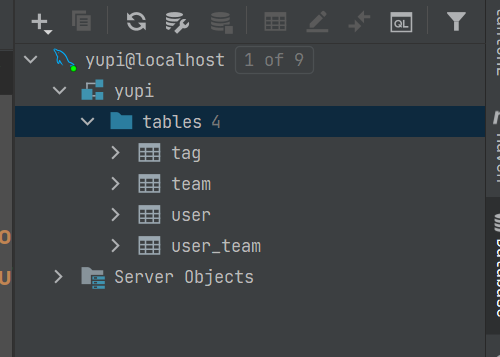  
使用MybatisX-Generator生成domain，service和mapper文件，然后把生成的文件都移到对应的目录里面，别忘了把mapper.xml里的路径改成自己对应的。


> 如果直接将生成的文件拉到对应的文件，就会自动修改mapper.xml的路径


PS：别忘了在team和user_team类中的is_delete字段添加@TableLogic注解，实现逻辑删除  
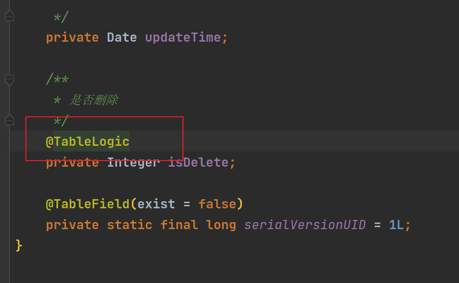


# 二、编写接口（TeamController）


### 1.复制UserController并重命名为TeamController修改整理为：


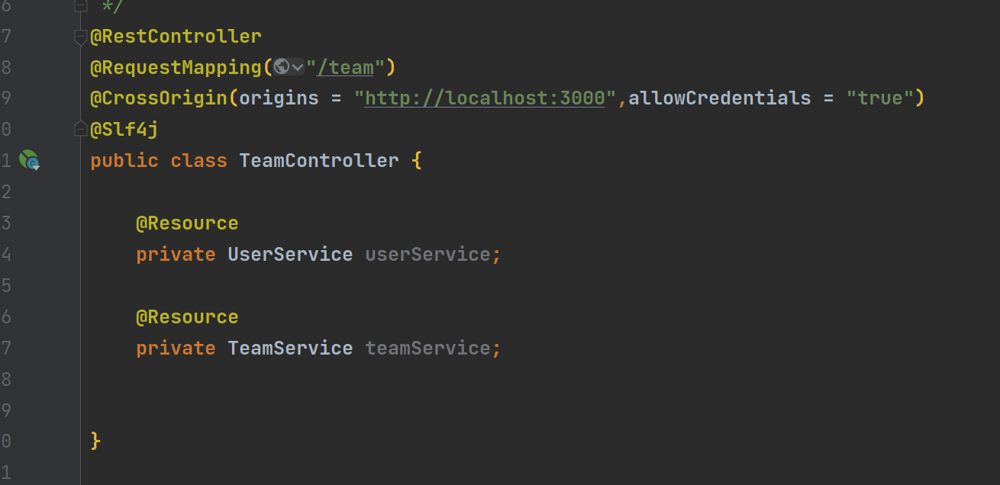


### 2.编写具体的接口


```java
    @PostMapping("/add")
    public BaseResponse<Long> addTeam(@RequestBody Team team) {
        if (team == null) {
            throw new BusinessException(ErrorCode.PARAMS_ERROR);
        }
        boolean save = teamService.save(team);
        if (!save) {
            throw new BusinessException(ErrorCode.SYSTEM_ERROR, "插入失败");
        }
        return ResultUtils.success(team.getId());
    }

    @PostMapping("/delete")
    public BaseResponse<Boolean> deleteTeam(@RequestBody long id) {
        if (id <= 0) {
            throw new BusinessException(ErrorCode.PARAMS_ERROR);
        }
        boolean result = teamService.removeById(id);
        if (!result) {
            throw new BusinessException(ErrorCode.SYSTEM_ERROR, "删除失败");
        }
        return ResultUtils.success(true);
    }

    @PostMapping("/update")
    public BaseResponse<Boolean> updateTeam(@RequestBody Team team) {
        if (team == null) {
            throw new BusinessException(ErrorCode.PARAMS_ERROR);
        }
        boolean result = teamService.updateById(team);
        if (!result) {
            throw new BusinessException(ErrorCode.SYSTEM_ERROR, "更新失败");
        }
        return ResultUtils.success(true);
    }

    @GetMapping("/get")
    public BaseResponse<Team> getTeamById(@RequestBody long id) {
        if (id <= 0) {
            throw new BusinessException(ErrorCode.PARAMS_ERROR);
        }
        Team team = teamService.getById(id);
        if (team == null) {
            throw new BusinessException(ErrorCode.NULL_ERROR);
        }
        return ResultUtils.success(team);
    }
```


#### 这边我们需要新建请求参数包装类和包装类，原因如下：


##### 为什么需要请求参数包装类？


1. 请求参数名称 / 类型和实体类不一样
2. 有一些参数用不到，如果要自动生成接口文档，会增加理解成本
3. 对个实体类映射到同一个对象


##### 为什么需要包装类？

可能有些字段需要隐藏，不能返回给前端  
或者有些字段某些方法是不关心的


在model包里新建一个dto包，写一个包装类TeamQuery


```java
@Data
public class TeamQuery {
    /**
     * id
     */
    private Long id;

    /**
     * 队伍名称
     */
    private String name;

    /**
     * 描述
     */
    private String description;

    /**
     * 最大人数
     */
    private Integer maxNum;

    /**
     * 用户id
     */
    private Long userId;

    /**
     * 0 - 公开，1 - 私有，2 - 加密
     */
    private Integer status;
}
```


在common包下新建分页请求参数包装类


```java
@Data
public class PageRequest implements Serializable {

    private static final long serialVersionUID = -4162304142710323660L;

    /**
     * 页面大小
     */
    protected int pageSize;

    /**
     * 当前是第几页
     */
    protected int pageNum;
}
```


同时在TeamQuery上继承这个分页请求，后面接口会用上


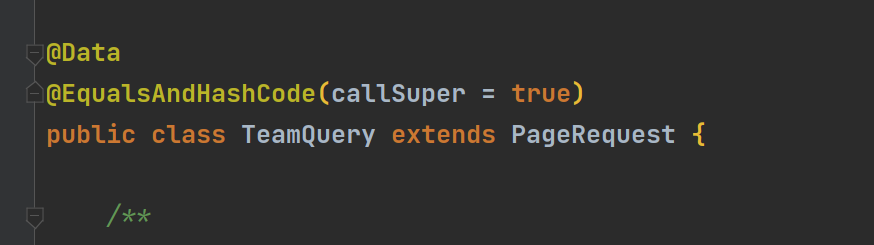


#### 继续编写接口


```java
@GetMapping("/list")
    public BaseResponse<List<Team>> listTeams(TeamQuery teamQuery){
        if (teamQuery == null){
            throw new BusinessException(ErrorCode.PARAMS_ERROR);
        }
        Team team = new Team();
        BeanUtils.copyProperties(team,teamQuery);
        QueryWrapper<Team> queryWrapper = new QueryWrapper<>(team);
        List<Team> teamList = teamService.list(queryWrapper);
        return ResultUtils.success(teamList);
    }

    @GetMapping("/list/page")
    public BaseResponse<Page<Team>> listTeamsByPage(TeamQuery teamQuery){
        if (teamQuery == null){
            throw new BusinessException(ErrorCode.PARAMS_ERROR);
        }
        Team team = new Team();
        BeanUtils.copyProperties(team,teamQuery);
        Page<Team> page = new Page<>(teamQuery.getPageNum(),teamQuery.getPageSize());
        QueryWrapper<Team> queryWrapper = new QueryWrapper<>(team);
        Page<Team> resultPage = teamService.page(page, queryWrapper);
        return ResultUtils.success(resultPage);
    }
```


> 踩坑处：注意Page导入的是mybatisplus，而不是springboot自带的那个


#### 利用knife4j测试接口


首先插入10条数据  
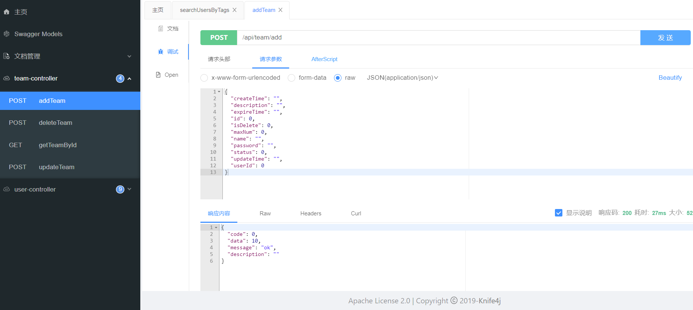


list展现队伍信息，确实是有10条  
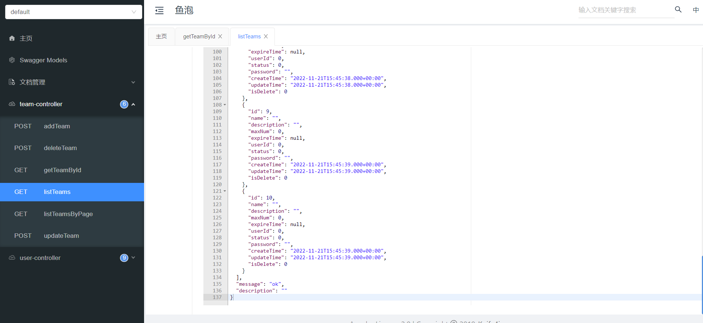  
分页查询：设置每页只显示两条  
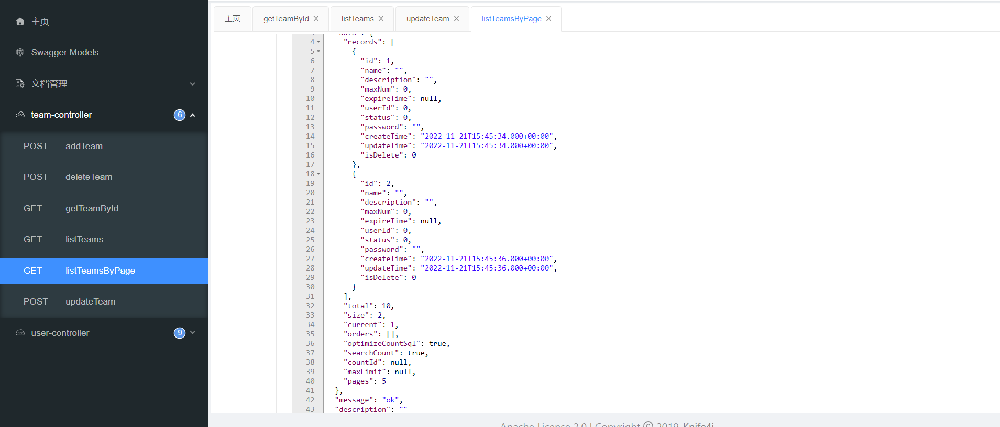  
分页查询：设置每页只显示两条（第二页）  
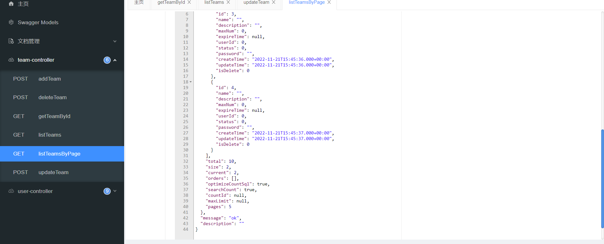  
删除队伍信息  
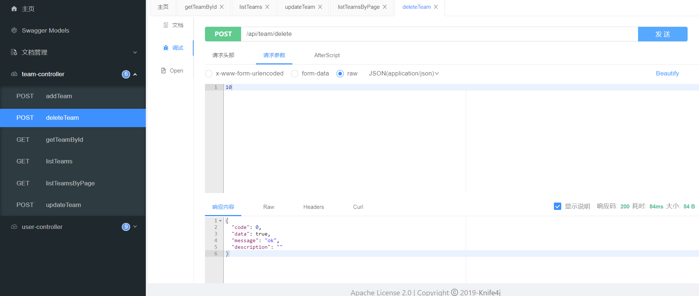


### 3.细化接口（根据具体的需求）


#### 1.这边我们会运用到队伍的状态,即公开，私有等，所以我们提前写一个队伍状态枚举类


```java
/**
 * 队伍状态枚举
 */
public enum TeamStatusEnum {
    PUBLIC(0,"公开"),
    PRIVATE(1,"私有"),
    SECRET(2,"加密");

    private int value;
    private String text;

    public static TeamStatusEnum getEnumByValue(Integer value){
        if (value == null){
            return null;
        }
        TeamStatusEnum[] values = TeamStatusEnum.values();
        for (TeamStatusEnum teamStatusEnum: values){
            if (teamStatusEnum.getValue()==value){
                return teamStatusEnum;
            }
        }
        return null;
    }

    TeamStatusEnum(int value, String text) {
        this.value = value;
        this.text = text;
    }

    public int getValue() {
        return value;
    }

    public void setValue(int value) {
        this.value = value;
    }

    public String getText() {
        return text;
    }

    public void setText(String text) {
        this.text = text;
    }
}
```


#### 2.正式开始细化接口

在TeamService里写入  
long addTeam(Team team, User loginUser); 并在TeamServiceImpl实现这个方法  
TeamServiceImpl里代码整理如下：


```java
@Service
public class TeamServiceImpl extends ServiceImpl<TeamMapper, Team>
        implements TeamService {

    @Resource
    private UserTeamService userTeamService;

    @Override
    @Transactional(rollbackFor = Exception.class)
    public long addTeam(Team team, User loginUser) {
        //1.请求参数是否为空
        if (team == null) {
            throw new BusinessException(ErrorCode.PARAMS_ERROR);
        }
        //2.是否登录，未登录不允许创建
        if (loginUser == null) {
            throw new BusinessException(ErrorCode.NO_AUTH);
        }
        final long userId = loginUser.getId();
        //3.检验信息
        //(1).队伍人数>1且<=20
        int maxNum = Optional.ofNullable(team.getMaxNum()).orElse(0);//如果为空，直接赋值为0
        if (maxNum < 1 || maxNum > 20) {
            throw new BusinessException(ErrorCode.PARAMS_ERROR, "队伍人数不满足要求");
        }
        //(2).队伍标题 <=20
        String name = team.getName();
        if (StringUtils.isBlank(name) || name.length() > 20) {
            throw new BusinessException(ErrorCode.PARAMS_ERROR, "队伍标题不满足要求");
        }
        // 3. 描述<= 512
        String description = team.getDescription();
        if (StringUtils.isNotBlank(description) && description.length() > 512) {
            throw new BusinessException(ErrorCode.PARAMS_ERROR, "队伍描述过长");
        }
        //4.status 是否公开，不传默认为0
        int status = Optional.ofNullable(team.getStatus()).orElse(0);
        TeamStatusEnum statusEnum = TeamStatusEnum.getEnumByValue(status);
        if (statusEnum == null) {
            throw new BusinessException(ErrorCode.PARAMS_ERROR, "队伍状态不满足要求");
        }

        //5.如果status是加密状态，一定要密码 且密码<=32
        String password = team.getPassword();
        if (TeamStatusEnum.SECRET.equals(statusEnum)) {
            if (StringUtils.isBlank(password) || password.length() > 32) {
                throw new BusinessException(ErrorCode.PARAMS_ERROR, "密码设置不正确");
            }
        }
        //6.超出时间 > 当前时间
        Date expireTime = team.getExpireTime();
        if (new Date().after(expireTime)) {
            throw new BusinessException(ErrorCode.PARAMS_ERROR, "超出时间 > 当前时间");
        }

        //7.校验用户最多创建5个队伍
        //todo 有bug。可能同时创建100个队伍
        QueryWrapper<Team> queryWrapper = new QueryWrapper<>();
        queryWrapper.eq("userId", userId);
        long hasTeamNum = this.count(queryWrapper);
        if (hasTeamNum >= 5) {
            throw new BusinessException(ErrorCode.PARAMS_ERROR, "用户最多创建5个队伍");
        }
        //8.插入队伍消息到队伍表
        team.setId(null);
        team.setUserId(userId);
        boolean result = this.save(team);
        Long teamId = team.getId();
        if (!result || team == null) {	
            throw new BusinessException(ErrorCode.PARAMS_ERROR, "创建队伍失败");
        }
        //9. 插入用户 ==> 队伍关系 到关系表
        UserTeam userTeam = new UserTeam();
        userTeam.setTeamId(userId);
        userTeam.setTeamId(teamId);
        userTeam.setJoinTime(new Date());
        result = userTeamService.save(userTeam);
        if (!result) {
            throw new BusinessException(ErrorCode.PARAMS_ERROR, "创建队伍失败");
        }
        return teamId;
    }
```


#### 3.优化完成控制层


这里我们因为完善了业务层，所以在controller层可以简便下代码，我们需要新建一个队伍添加请求封装类（便于前端知道该输入哪些参数）   新的请求封装类位于model包里的request包


```java
@Data
public class TeamAddRequest {

    private static final long serialVersionUID = -4162304142710323660L;

    /**
     * 队伍名称
     */
    private String name;

    /**
     * 描述
     */
    private String description;

    /**
     * 最大人数
     */
    private Integer maxNum;

    /**
     * 过期时间
     */
    private Date expireTime;

    /**
     * 用户id
     */
    private Long userId;

    /**
     * 0 - 公开，1 - 私有，2 - 加密
     */
    private Integer status;

    /**
     * 密码
     */
    private String password;
}
```


修改的addTeam接口如下：


```java
    @PostMapping("/add")
    public BaseResponse<Long> addTeam(@RequestBody TeamAddRequest teamAddRequest, HttpServletRequest request) {
        if (teamAddRequest == null) {
            throw new BusinessException(ErrorCode.PARAMS_ERROR);
        }
        User loginUser = userService.getLoginUser(request);
        Team team = new Team();
        BeanUtils.copyProperties(teamAddRequest,team);
        long teamId = teamService.addTeam(team, loginUser);
        return ResultUtils.success(teamId);
    }
```


**注意 ：BeanUtils.copyProperties(teamAddRequest,team);  两个参数的位置原来写错了，现在需要调换**  
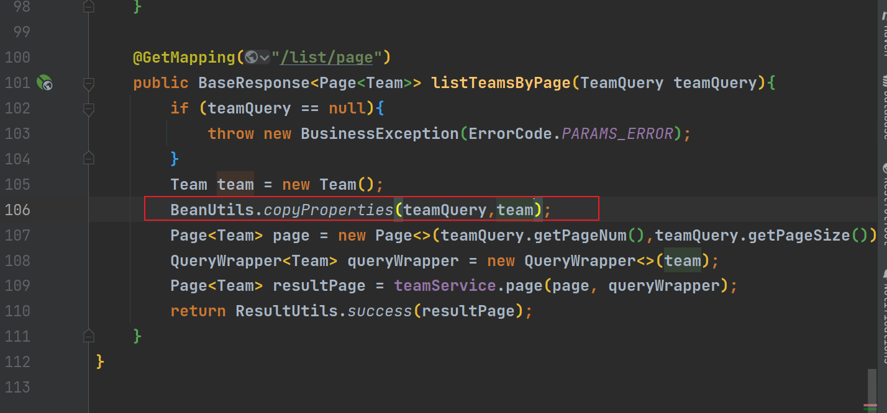


#### 4.测试

启动项目，好像刚刚的请求参数封装类没起作用（这里跟鱼皮的一样），只能自己删除再输入  
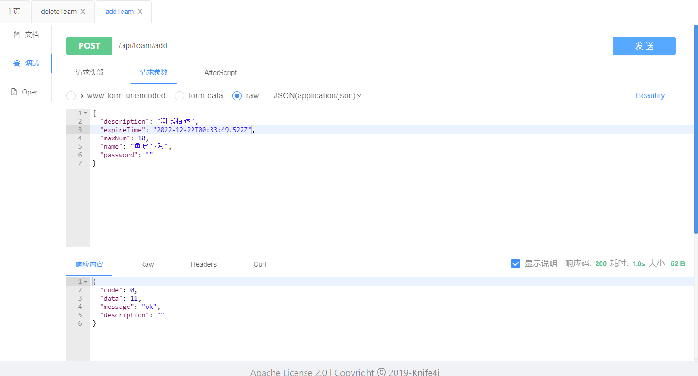  
成功的插入  
ps：这里过期时间的获取可从控制台输入一下代码来实现，单单的输入年月日会导致数据库里的时间增加8小时（应该是时区的问题）  
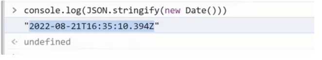  
多次发送添加请求，当插入5次之后，再插入会报错  
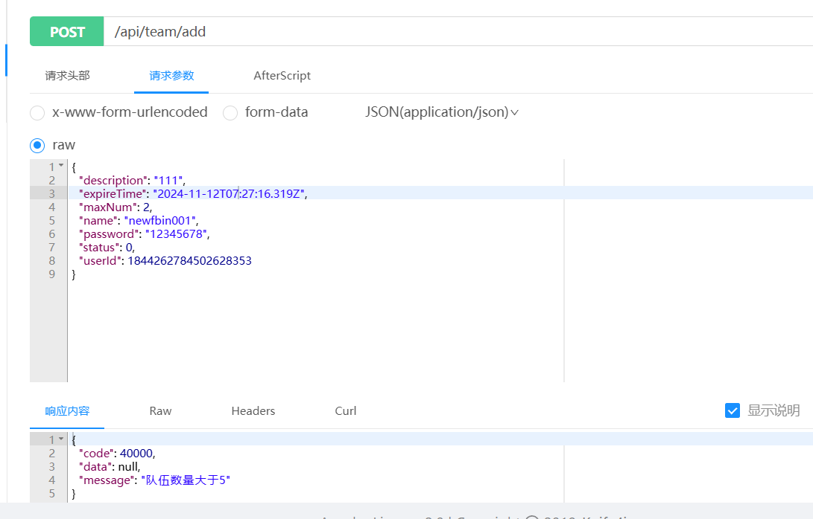  
测试事务是否起作用  
注意要在方法上添加如下注解  


首先数据库的数据删至4条，别忘了把对应的用户表关系也删除，保持一致  
修改`TeamServiceImpl`，目的是骗过编译器，直接创建队伍失败


  
稍微修改下参数，发送，确实报用户关系失败  
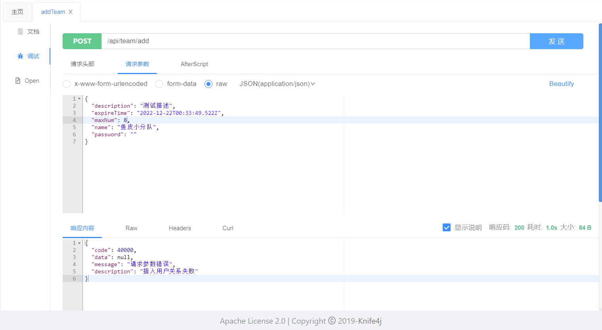  
数据库里也没用增加数据，证实了事务起作用，最后别忘了把刚刚增加的代码所删除（骗过编译器)


## 第九期完结🎉🎉🎉🎉🎉🎉🎉🎉🎉


> 更新: 2023-02-10 10:06:15  
> 原文: <https://www.yuque.com/shierkcs/catstudy/qu9ownwhsfcfw57c>