# 10 队伍的增删改查+入队

在线回放：[https://meeting.tencent.com/v2/cloud-record/share?...](https://meeting.tencent.com/v2/cloud-record/share?id=83a15e95-1284-42a6-aa06-f7a710fc38bd&from=3)（访问密码：aehQ）

## 鱼皮笔记


##### 1、 查询队伍列表


分页展示队伍列表，根据名称、最大人数等搜索队伍 P0，信息流中不展示已过期的队伍


1. 从请求参数中取出队伍名称等查询条件，如果存在则作为查询条件
2. 不展示已过期的队伍（根据过期时间筛选）
3. 可以通过某个**关键词**同时对名称和描述查询
4. **只有管理员才能查看加密还有非公开的房间**
5. 关联查询已加入队伍的用户信息
6. **关联查询已加入队伍的用户信息（可能会很耗费性能，建议大家用自己写 SQL 的方式实现）**


**实现方式**  
自己写 SQL


```plain
// 1. 自己写 SQL
// 查询队伍和创建人的信息
// select * from team t left join user u on t.userId = u.id
// 查询队伍和已加入队伍成员的信息
// select *
// from team t
//         left join user_team ut on t.id = ut.teamId
//         left join user u on ut.userId = u.id;
```


##### 2、 修改队伍信息


1. 判断请求参数是否为空
2. 查询队伍是否存在
3. 只有管理员或者队伍的创建者可以修改
4. 如果用户传入的新值和老值一致，就不用 update 了（可自行实现，降低数据库使用次数）
5. **如果队伍状态改为加密，必须要有密码**
6. 更新成功


##### 3、 用户可以加入队伍


其他人、未满、未过期，允许加入多个队伍，但是要有个上限 P0


1. 用户最多加入 5 个队伍
2. 队伍必须存在，只能加入未满、未过期的队伍
3. 不能加入自己的队伍，不能重复加入已加入的队伍（幂等性）
4. 禁止加入私有的队伍
5. 如果加入的队伍是加密的，必须密码匹配才可以
6. 新增队伍 - 用户关联信息


**注意，一定要加上事务注解！！！！**


## 完善查询，更新，加入队伍接口


### 1.为了保护数据不被暴露，所以我们要新建封装类

在model包新建vo包，并创建TeamUserVO（队伍和用户信息封装类），UserVO类（用户封装类），这两个类是返回给前端看


```java
/**
 * 队伍和用户信息封装类（脱敏）
 *
 * @author yupi
 */
@Data
public class TeamUserVO implements Serializable {

    private static final long serialVersionUID = 163478861968488713L;
    /**
     * id
     */
    private Long id;

    /**
     * 队伍名称
     */
    private String name;

    /**
     * 描述
     */
    private String description;

    /**
     * 最大人数
     */
    private Integer maxNum;

    /**
     * 过期时间
     */
    private Date expireTime;

    /**
     * 用户id
     */
    private Long userId;

    /**
     * 0 - 公开，1 - 私有，2 - 加密
     */
    private Integer status;

    /**
     * 创建时间
     */
    private Date createTime;

    /**
     * 更新时间
     */
    private Date updateTime;

    /**
     * 创建人用户信息
     */
    private UserVO createUser;

    /**
     * 已加入的用户数
     */
    private Integer hasJoinNum;

    /**
     * 是否已加入队伍
     */
    private boolean hasJoin = false;
}
```


```java
/**
 * 用户包装类（脱敏）
 */
@Data
public class UserVO implements Serializable {
    
    /**
     * id
     */
    private long id;

    /**
     * 用户昵称
     */
    private String username;

    /**
     * 账号
     */
    private String userAccount;

    /**
     * 用户头像
     */
    private String avatarUrl;

    /**
     * 性别
     */
    private Integer gender;

    /**
     * 电话
     */
    private String phone;

    /**
     * 邮箱
     */
    private String email;

    /**
     * 标签列表 json
     */
    private String tags;

    /**
     * 状态 0 - 正常
     */
    private Integer userStatus;

    /**
     * 创建时间
     */
    private Date createTime;

    /**
     * 
     */
    private Date updateTime;

    /**
     * 用户角色 0 - 普通用户 1 - 管理员
     */
    private Integer userRole;

    /**
     * 星球编号
     */
    private String planetCode;

    private static final long serialVersionUID = 1L;
}
```


**我这边嫌麻烦就直接根据后序直播内容把所要添加的参数全部写入了（你也可以根据直播顺序一步步添加）**


### 2.在TeamService里编写查询队伍方法并在TeamServiceImpl里实现

在编写的过程中发现TeamQuery中缺少一个字段，现在补上  
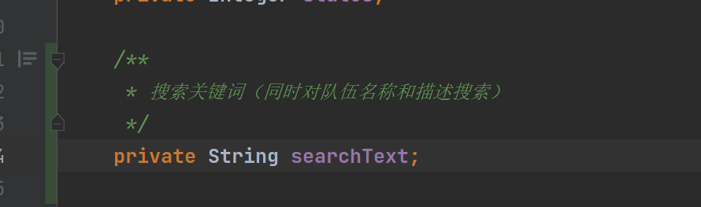


#### 1.首先在TeamService里面实现listTeams方法并实现


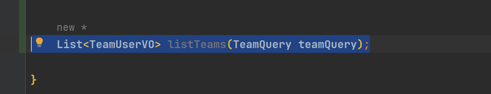


#### 2.编写业务层，其中只有管理员才能查看加密还有非公开的房间，所以我们需要从请求中获得是否为管理员

所以我们这边提前修改listTeams方法（鱼皮是在写的过程中发现要获得是否为管理员，才去修改）  
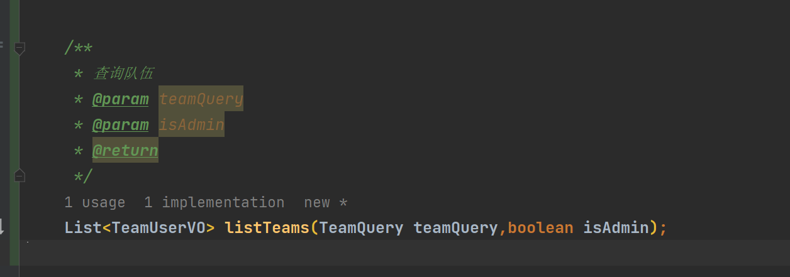  
完整的编写过程这里就不一一展现了（大家可以观看直播了解具体过程，在编写过程中会发现问题，然后添加参数和类等等），这里要改的地方有点多（中间过程也没有测试）所以不写过程了。查询队伍imlp整理如下：


```java
    @Override
    public List<TeamUserVO> listTeams(TeamQuery teamQuery, boolean isAdmin) {
        QueryWrapper<Team> queryWrapper = new QueryWrapper<>();
        //组合查询条件
        if (teamQuery != null) {
            Long id = teamQuery.getId();
            if (id != null && id > 0) {
                queryWrapper.eq("id", id);
            }
            String searchText = teamQuery.getSearchText();
            if (StringUtils.isNotBlank(searchText)) {
                queryWrapper.and(qw -> qw.like("name", searchText).or().like("expireTime", searchText));
            }
            String name = teamQuery.getName();
            if (StringUtils.isNotBlank(name)) {
                queryWrapper.like("name", name);
            }
            String description = teamQuery.getDescription();
            if (StringUtils.isNotBlank(description)) {
                queryWrapper.like("description", description);
            }
            Integer maxNum = teamQuery.getMaxNum();
            //查询最大人数相等
            if (maxNum != null && maxNum > 0) {
                queryWrapper.eq("maxMum", maxNum);
            }
            Long userId = teamQuery.getUserId();
            //根据创建人来查询
            if (userId != null && userId > 0) {
                queryWrapper.eq("userId", userId);
            }
            //根据状态来查询
            Integer status = teamQuery.getStatus();
            TeamStatusEnum statusEnum = TeamStatusEnum.getEnumByValue(status);
            if (statusEnum == null) {
                statusEnum = TeamStatusEnum.PUBLIC;
            }
            if (!isAdmin && !statusEnum.equals(TeamStatusEnum.PUBLIC)) {
                throw new BusinessException(ErrorCode.NO_AUTH);
            }
            queryWrapper.eq("status", statusEnum.getValue());
        }

        //不展示已过期的队伍
        //expireTime is null or expireTime > now()
        queryWrapper.and(qw -> qw.gt("expireTime", new Date()).or().isNull("expireTime"));

        List<Team> teamList = this.list(queryWrapper);
        if (CollectionUtils.isEmpty(teamList)) {
                return new ArrayList<>();
        }
        List<TeamUserVO> teamUserVOList = new ArrayList<>();
        //关联查询创建人的用户信息
        for (Team team : teamList) {
            Long userId = team.getUserId();
            if (userId == null) {
                continue;
            }
            User user = userService.getById(userId);
            TeamUserVO teamUserVO = new TeamUserVO();
            BeanUtils.copyProperties(team, teamUserVO);
            //脱敏用户信息
            if (user!=null){
                UserVO userVO = new UserVO();
                BeanUtils.copyProperties(user, userVO);
                teamUserVO.setCreateUser(userVO);
            }
            teamUserVOList.add(teamUserVO);
        }
        return teamUserVOList;
    }
```


请求接口修改整理为：


```java
    @GetMapping("/list")
    public BaseResponse<List<TeamUserVO>> listTeams(TeamQuery teamQuery,HttpServletRequest request){
        if (teamQuery == null){
            throw new BusinessException(ErrorCode.PARAMS_ERROR); 
        }
        boolean isAdmin = userService.isAdmin(request);
        List<TeamUserVO> teamList = teamService.listTeams(teamQuery,isAdmin);
        return ResultUtils.success(teamList);
    }
```


#### 3.测试，打开knife4j接口，直接不带参数发送（等于查询全部）

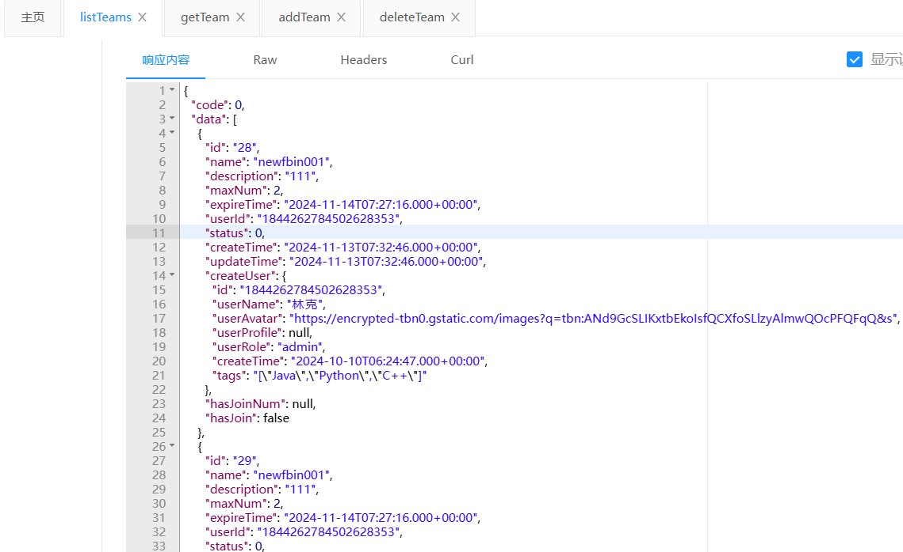  
修改用户过期时间再次测试，观察是否查询不到此队伍（我这里修改了编号为30的队伍)  
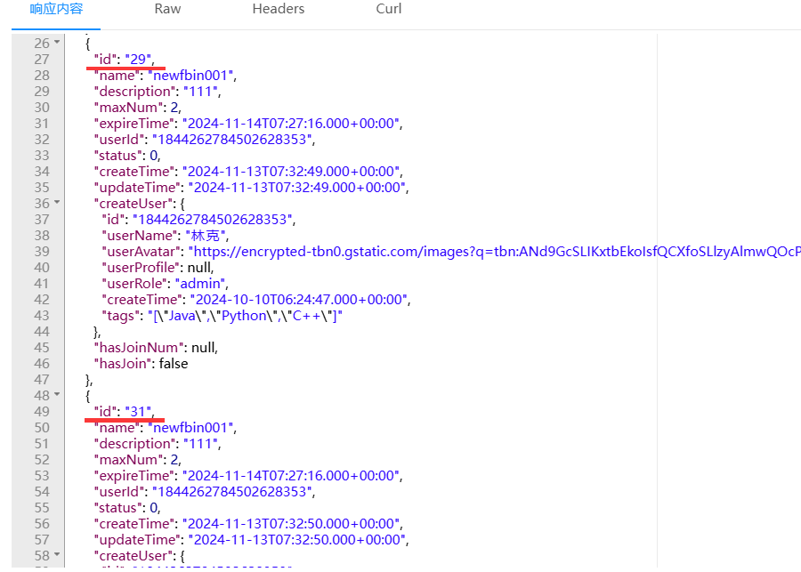  
结果正确，过期的30组队伍未被查询出！  
查询队伍功能完成


### 3.在TeamService里编写修改队伍信息方法并在TeamServiceImpl里实现


#### 1.同样在请求包里封装一个用户登录请求体


```java
/**
 * 用户登录请求体
 *
 * @author shaosao
 */
@Data
public class TeamUpdateRequest implements Serializable {

    private static final long serialVersionUID = -6043915331807008592L;

    /**
     * id
     */
    private Long id;

    /**
     * 队伍名称
     */
    private String name;

    /**
     * 描述
     */
    private String description;

    /**
     * 过期时间
     */
    private Date expireTime;

    /**
     * 0 - 公开，1 - 私有，2 - 加密
     */
    private Integer status;

    /**
     * 密码
     */
    private String password;
}
```


#### 2.在TeamService里面实现updateTeam方法并实现

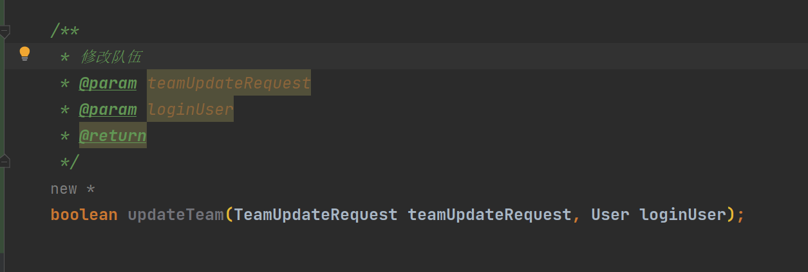  
修改接口更改为

```java
    @PostMapping("/update")
    public BaseResponse<Boolean> updateTeam(@RequestBody TeamUpdateRequest teamUpdateRequest,HttpServletRequest request) {
        if (teamUpdateRequest == null) {
            throw new BusinessException(ErrorCode.PARAMS_ERROR);
        }
        User loginUser = userService.getLoginUser(request);
        boolean result = teamService.updateTeam(teamUpdateRequest,loginUser);
        if (!result) {
            throw new BusinessException(ErrorCode.SYSTEM_ERROR, "更新失败");
        }
        return ResultUtils.success(true);
    }
```


#### 3.最后编写实现类


```java
    @Override
    public boolean updateTeam(TeamUpdateRequest teamUpdateRequest, User loginUser) {
        //1. 判断请求参数是否为空
        if(teamUpdateRequest == null){
            throw new BusinessException(ErrorCode.PARAMS_ERROR);
        }
        //2. 查询队伍是否存在
        Long id = teamUpdateRequest.getId();
        if(id == null || id <= 0){
            throw new BusinessException(ErrorCode.PARAMS_ERROR, "队伍id错误");
        }
        Team team = getById(id);
        if(team == null){
            throw new BusinessException(ErrorCode.PARAMS_ERROR,"队伍不存在");
        }

        //3. 只有管理员或者队伍的创建者可以修改
        if(!teamUpdateRequest.getId().equals(loginUser.getId()) && !StringUtils.equals(loginUser.getUserRole(), "admin")){
            System.out.println("" + !teamUpdateRequest.getId().equals(loginUser.getId()) + !StringUtils.equals(loginUser.getUserRole(), "admin"));
            throw new BusinessException(ErrorCode.NO_AUTH_ERROR);
        }

        //4. 如果用户传入的新值和老值一致，就不用 update 了（可自行实现，降低数据库使用次数）
        //5. 如果队伍状态改为加密，必须要有密码
        TeamStatusEnum statusEnum = TeamStatusEnum.getTeamStatusByValue(teamUpdateRequest.getStatus());
        if(statusEnum.equals(TeamStatusEnum.SECRET)){
            if(StringUtils.isBlank(teamUpdateRequest.getPassword())){
                throw new BusinessException(ErrorCode.PARAMS_ERROR,"加密房间必须设置密码");
            }
        }

        //6. 更新成功
        Team updateTeam = new Team();
        BeanUtils.copyProperties(teamUpdateRequest, updateTeam);
        boolean result = updateById(updateTeam);

        return result;
    }
```


#### 4.测试，我这里更新了第30组的信息，查看数据库核验是否修改成功

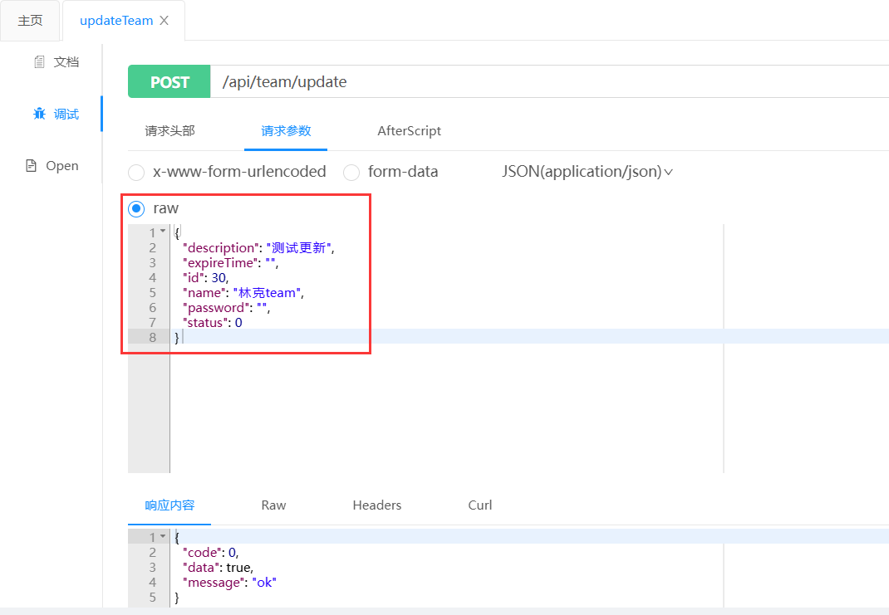  

更新成功

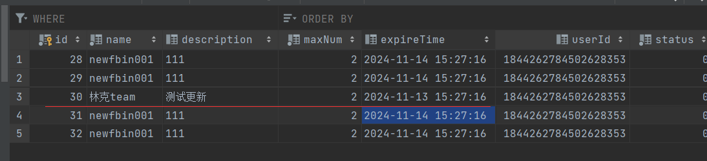


### 4.在TeamService里编写用户加入队伍方法并在TeamServiceImpl里实现


#### 1.同样在请求包里封装一个用户加入队伍请求体


```java
/**
 * 用户加入队伍请求体
 *
 * @author shaosao
 */
@Data
public class TeamJoinRequest implements Serializable {

    private static final long serialVersionUID = -24663018187059425L;

    /**
     * id
     */
    private Long teamId;

    /**
     * 密码
     */
    private String password;
}
```


#### 2.在TeamService里面实现joinTeam方法并实现


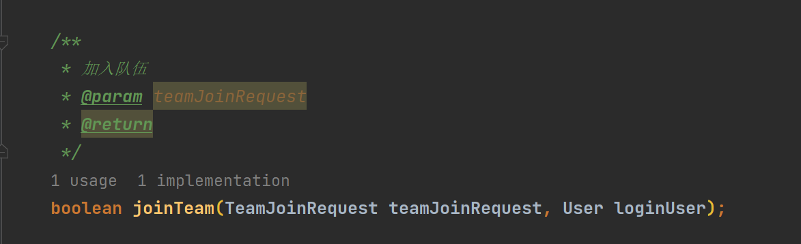


#### 3.编写用户加入队伍接口


```java
    @PostMapping("/join")
    public BaseResponse<Boolean> joinTeam(@RequestBody TeamJoinRequest teamJoinRequest,HttpServletRequest request){
        if (teamJoinRequest==null){
            throw new BusinessException(ErrorCode.PARAMS_ERROR);
        }
        User loginUser = userService.getLoginUser(request);
        boolean result = teamService.joinTeam(teamJoinRequest, loginUser);
        return ResultUtils.success(result);
    }
```


```java
 @Override
    public boolean joinTeam(TeamJoinRequest teamJoinRequest, User loginUser) {
        if (teamJoinRequest == null) {
            throw new BusinessException(ErrorCode.PARAMS_ERROR);
        }
        Long teamId = teamJoinRequest.getTeamId();
        if (teamId == null || teamId <= 0) {
            throw new BusinessException(ErrorCode.PARAMS_ERROR);
        }
        Team team = this.getById(teamId);
        if (team == null) {
            throw new BusinessException(ErrorCode.PARAMS_ERROR, "队伍不存在");
        }
        Date expireTime = team.getExpireTime();
        if (expireTime != null && expireTime.before(new Date())) {
            throw new BusinessException(ErrorCode.PARAMS_ERROR, "队伍已过期");
        }
        Integer status = team.getStatus();
        TeamStatusEnum teamStatusEnum = TeamStatusEnum.getEnumByValue(status);
        if (teamStatusEnum.PRIVATE.equals(teamStatusEnum)) {
            throw new BusinessException(ErrorCode.PARAMS_ERROR, "禁止加入私有队伍");
        }
        String password = teamJoinRequest.getPassword();
        if (teamStatusEnum.SECRET.equals(teamStatusEnum)) {
            if (StringUtils.isBlank(password) || !password.equals(team.getPassword())) {
                throw new BusinessException(ErrorCode.PARAMS_ERROR, "密码错误");
            }
        }
        //该用户已加入的队伍数量 数据库查询所以放到下面，减少查询时间
        Long userId = loginUser.getId();
        QueryWrapper<UserTeam> userTeamQueryWrapper = new QueryWrapper<>();
        userTeamQueryWrapper.eq("userId", userId);
        long hasJoinNum = userTeamService.count(userTeamQueryWrapper);
        if (hasJoinNum > 5) {
            throw new BusinessException(ErrorCode.PARAMS_ERROR, "最多创建和加入5个队伍");
        }
        //不能重复加入已加入的队伍
        userTeamQueryWrapper = new QueryWrapper<>();
        userTeamQueryWrapper.eq("userId", userId);
        userTeamQueryWrapper.eq("teamId", teamId);
        long hasUserJoinTeam = userTeamService.count(userTeamQueryWrapper);
        if (hasUserJoinTeam > 0) {
            throw new BusinessException(ErrorCode.PARAMS_ERROR, "用户已加入该队伍");
        }
        //已加入队伍的人数
        userTeamQueryWrapper = new QueryWrapper<>();
        userTeamQueryWrapper.eq("teamId", teamId);
        long teamHasJoinNum = userTeamService.count(userTeamQueryWrapper);
        if (teamHasJoinNum >= team.getMaxNum()) {
            throw new BusinessException(ErrorCode.PARAMS_ERROR, "队伍已满");
        }
        //修改队伍信息
        UserTeam userTeam = new UserTeam();
        userTeam.setUserId(userId);
        userTeam.setTeamId(teamId);
        userTeam.setJoinTime(new Date());
        return userTeamService.save(userTeam);
    }
```


PS：下面红框代码尽量放在下面，因为它是sql查询，会浪费大量时间，放在下面可以在通过上面的校验再查询，尽可能的减少查询次数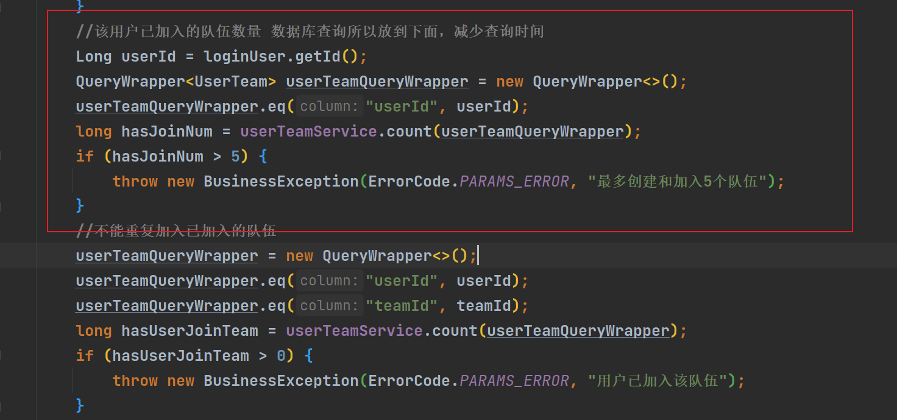


#### 4.测试：开两个knife4j后台


**踩坑处：我这里嫌麻烦直接新登录了一个原来注册的用户，结果它是管理员，后面测试更新的时候，修改成功（还以是bug，查bug好久。。。。）,所以最好新建一个用户**  
在完成注册和登录之后，先加一个私有队伍，成功显示报错（禁止加入私有队伍）  
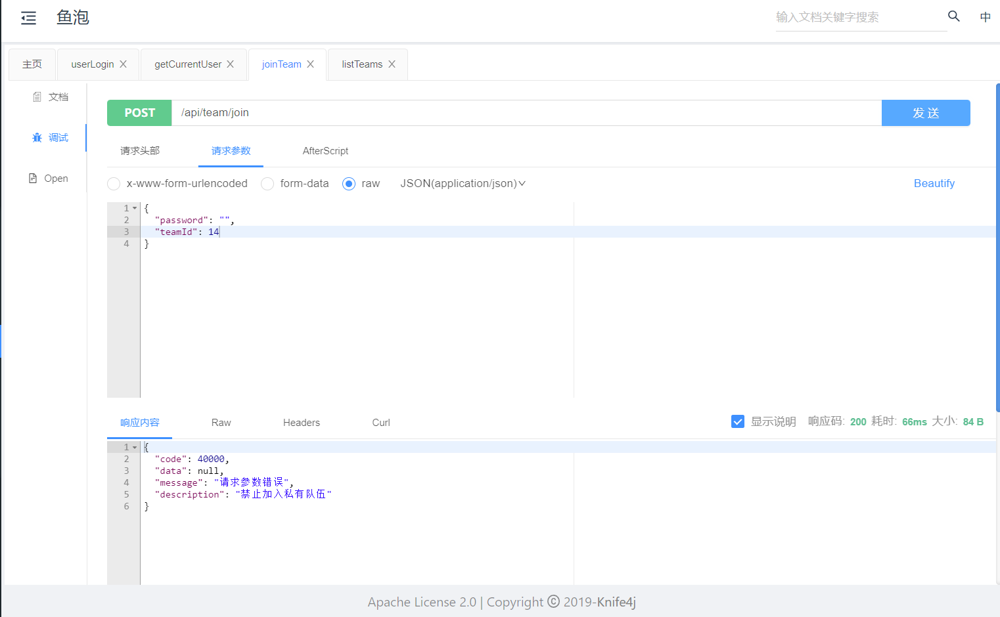  
加入一个公开队伍，成功！  
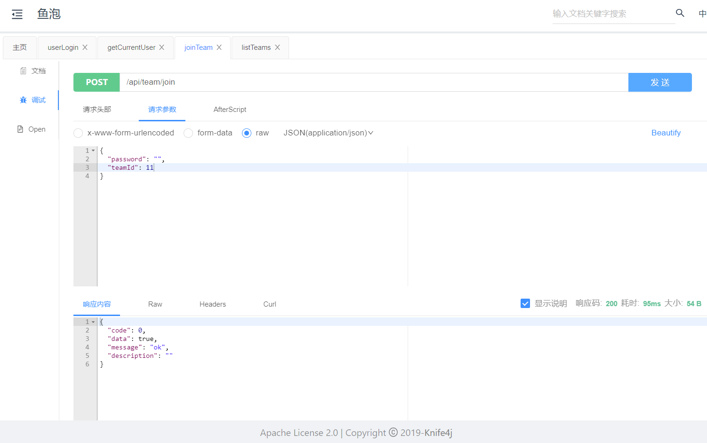  
数据库里的用户队伍关系表也更新成功  
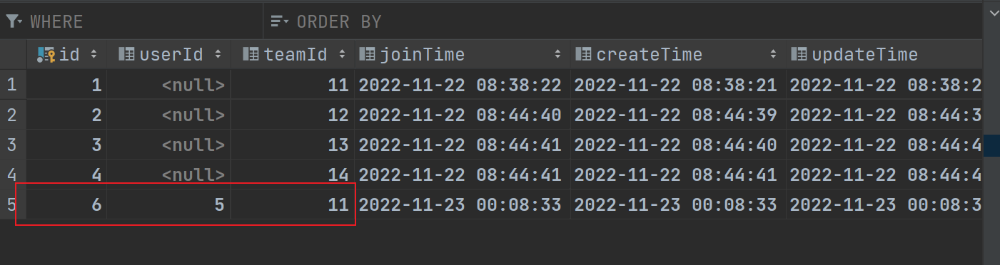  
测试修改队伍功能，先使用新注册的用户，结果正常显示无权限  
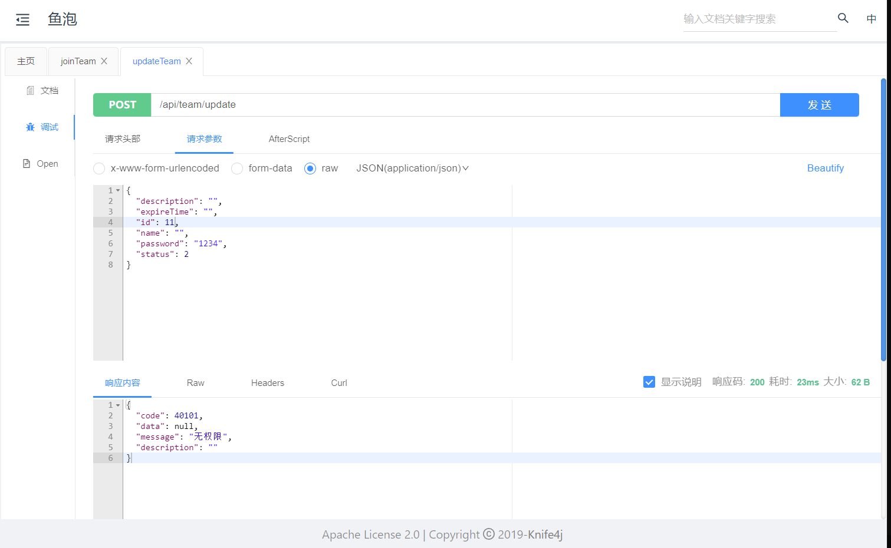  
换创建用户的更新  
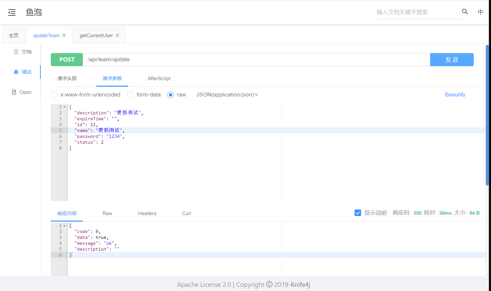


成功修改，数据库也更新  
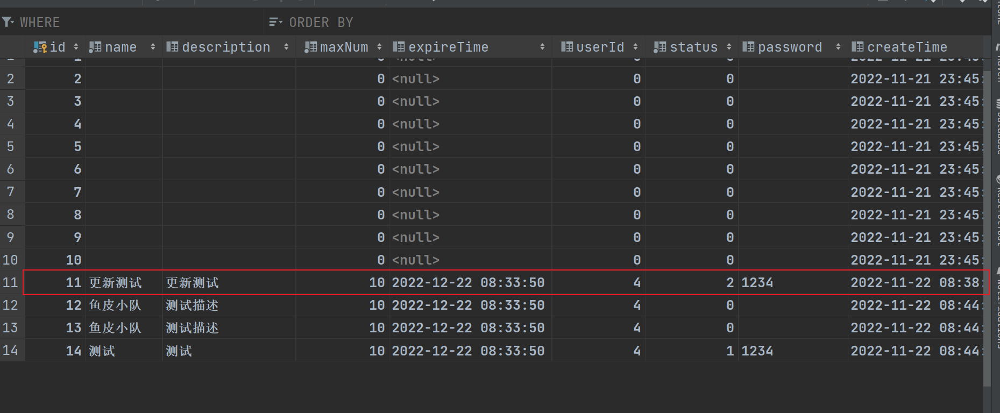  
**但是这里有个bug，如果不带参数，就会显示为空，即我们不能实现选择更新，就是说不能单独修改一处（只能跟前端统一要求)或者去修改这个bug**


更换加入队伍的用户，再次加入（不带密码），正常显示密码错误  
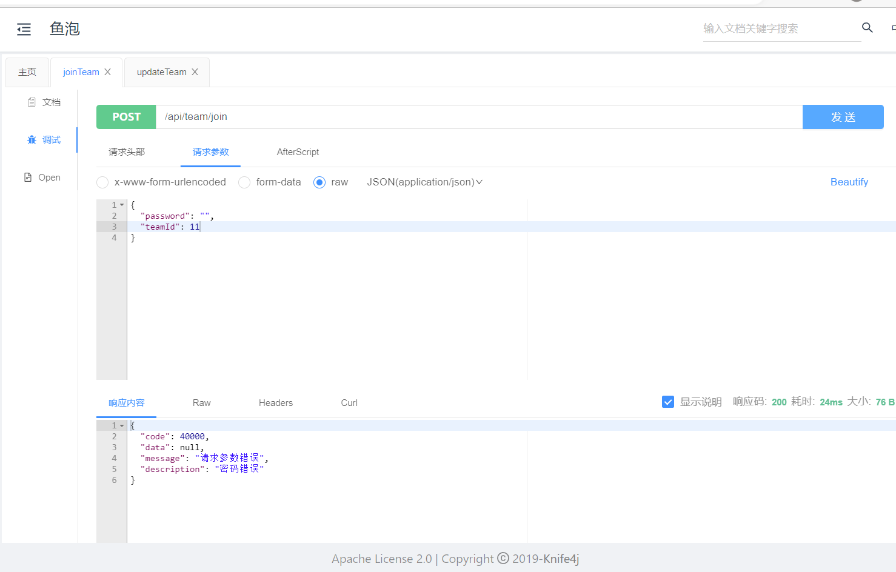


带密码加入，因为我们已经加入，显示不能重复加入已加入的队伍  
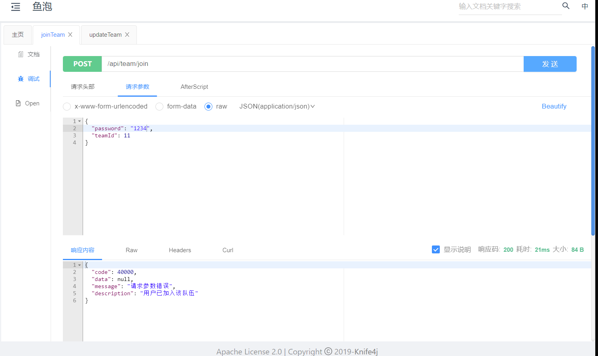  
为了测试加密队伍功能是否能够正常实现，我们使用创建账户更新另一个队伍（这里我是13），需要新账户为加入的，更改为需要密码加入  
更换为新注册用户，不带密码加入，报错正常  
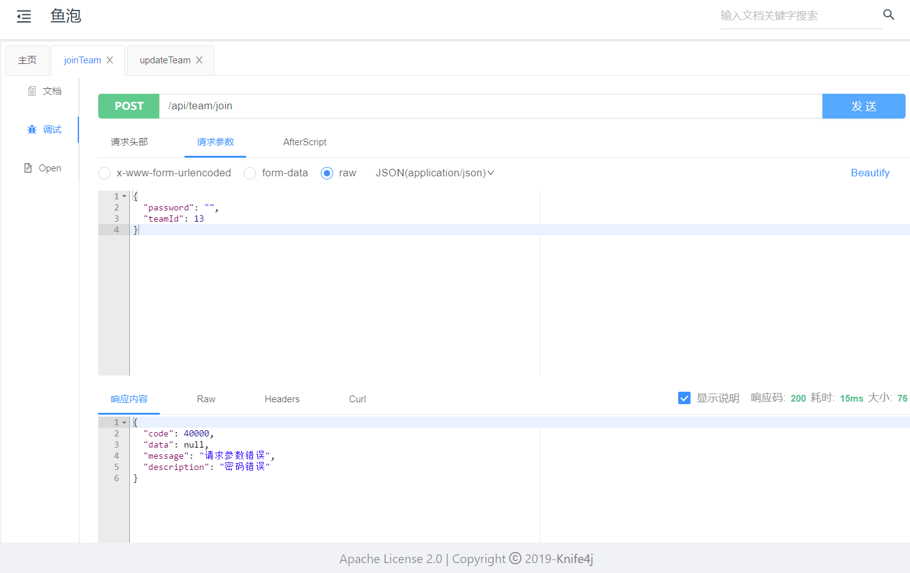  
带入密码加入，成功加入  
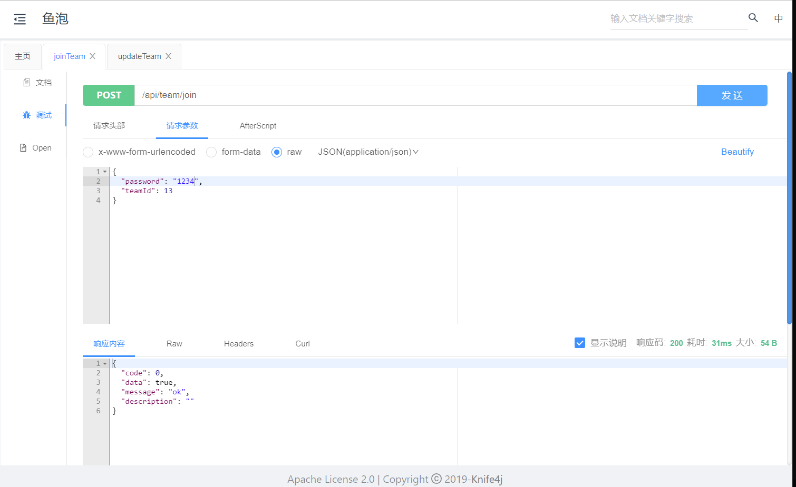  
数据库里的用户队伍关系表也更新成功  
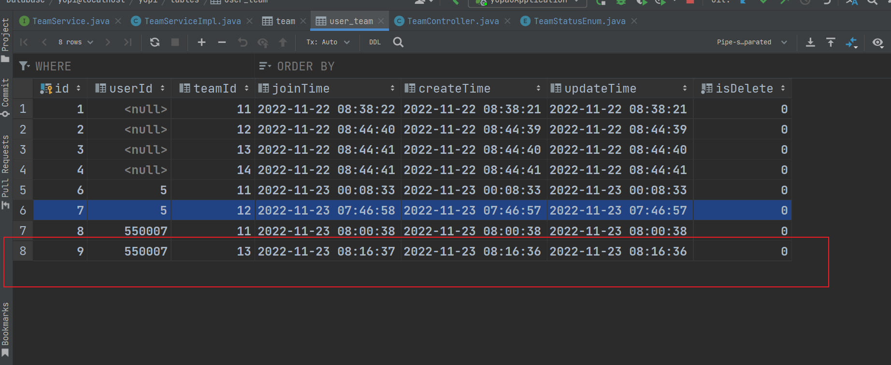


## 第十期完结🎉🎉🎉🎉🎉🎉🎉🎉🎉🎉


> 更新: 2023-02-10 10:06:37  
> 原文: <https://www.yuque.com/shierkcs/catstudy/qxidpwdpzncd1fw1>