# 11 用户退出队伍+ 前端队伍界面

在线回放：[https://meeting.tencent.com/v2/cloud-record/share?...](https://meeting.tencent.com/v2/cloud-record/share?id=2f096a64-d837-4bbd-9d67-9a37019e4eec&from=3) (访问密码：QPXd)

## 鱼皮笔记


### 接上期的接口设计


##### 5. 用户可以退出队伍


请求参数：队伍 id


1. 校验请求参数
2. 校验队伍是否存在
3. 校验我是否已加入队伍
4. 如果队伍 
   1. 只剩一人，队伍解散
   2. 还有其他人 
      1. 如果是队长退出队伍，权限转移给第二早加入的用户 —— 先来后到只用取 id 最小的 2 条数据
      2. 非队长，自己退出队伍


##### 6. 队长可以解散队伍


请求参数：队伍 id  
业务流程：


1. 校验请求参数
2. 校验队伍是否存在
3. 校验你是不是队伍的队长
4. 移除所有加入队伍的关联信息
5. 删除队伍


##### 7. 获取当前用户已加入的队伍


##### 8. 获取当前用户创建的队伍


复用 listTeam 方法，只新增查询条件，不做修改（开闭原则）

---

### 事务注解


[@Transactional(rollbackFor ](/Transactional(rollbackFor ) = Exception.class)   
要么数据操作都成功，要么都失败


## 一、接口设计


### 1.用户可以退出队伍


#### (1). 新建退出请求体


```java
	@Data
    public class TeamQuitRequest implements Serializable {
        private static final long serialVersionUID = -2038884913144640407L;
        /**
        *  id
        */
        private Long teamId;
    }
```


#### (2).新建quit请求接口


```java
@PostMapping("/quit")
    public BaseResponse<Boolean> quitTeam(@RequestBody TeamQuitRequest teamQuitRequest,HttpServletRequest request){
        if (teamQuitRequest == null){
        throw new BusinessException(ErrorCode.PARAMS_ERROR);
    }
    User loginUser = userService.getLoginUser(request);
    boolean result = teamService.quitTeam(teamQuitRequest, loginUser);
    return ResultUtils.success(result);
}
```


#### (3).在TeamService是写入quitTeam方法


```java
/**
* 退出队伍
* @param teamQuitRequest
* @param loginUser
* @return
*/
boolean quitTeam(TeamQuitRequest teamQuitRequest, User loginUser);
```


#### (4).在TeamServiceImpl里实现quitTeam方法


```java
	@Override
    @Transactional(rollbackFor = Exception.class)
    public boolean quitTeam(TeamQuitRequest teamQuitRequest, User loginUser) {
    if (teamQuitRequest == null) {
        throw new BusinessException(ErrorCode.PARAMS_ERROR);
    }
    Long teamId = teamQuitRequest.getTeamId();
    if (teamId == null || teamId <= 0) {
        throw new BusinessException(ErrorCode.PARAMS_ERROR);
    }
    Team team = this.getById(teamId);
    if (team == null) {
        throw new BusinessException(ErrorCode.NULL_ERROR, "队伍不存在");
    }
    long userId = loginUser.getId();
    UserTeam queryUserTeam = new UserTeam();
    queryUserTeam.setTeamId(teamId);
    queryUserTeam.setUserId(userId);
    QueryWrapper<UserTeam> queryWrapper = new QueryWrapper<>(queryUserTeam);
    long count = userTeamService.count(queryWrapper);
    if (count == 0) {
        throw new BusinessException(ErrorCode.PARAMS_ERROR, "未加入队伍");
    }
    long teamHasJoinNum = this.countTeamUserByTeamId(teamId);
    //队伍只剩下一个人，解散
    if (teamHasJoinNum == 1) {
        //删除队伍
        this.removeById(teamId);
    } else {
        //队伍至少还剩下两人
        //是队长
        if (team.getUserId() == userId) {
            //把队伍转移给最早加入的用户
            //1.查询已加入队伍的所有用户和加入时间
            QueryWrapper<UserTeam> userTeamQueryWrapper = new QueryWrapper<>();
            userTeamQueryWrapper.eq("teamId", teamId);
            userTeamQueryWrapper.last("order by id asc limit 2");
            List<UserTeam> userTeamList = userTeamService.list(userTeamQueryWrapper);
            if (CollectionUtils.isEmpty(userTeamList) || userTeamList.size() <= 1) {
                throw new BusinessException(ErrorCode.SYSTEM_ERROR);
            }
            UserTeam nextUserTeam = userTeamList.get(1);
            Long nextTeamLeaderId = nextUserTeam.getUserId();
            //更新当前队伍的队长
            Team updateTeam = new Team();
            updateTeam.setId(teamId);
            updateTeam.setUserId(nextTeamLeaderId);
            boolean result = this.updateById(updateTeam);
            if (!result) {
                throw new BusinessException(ErrorCode.SYSTEM_ERROR, "更新队伍队长失败");
            }
        }
    }
    //移除关系
    return userTeamService.remove(queryWrapper);
}
```


这里我们由于多次需要获得队伍当前人数，所以封装了countTeamUserByTeamId方法


```java
/**
* 获取某队伍当前人数
*
* @param teamId
* @return
*/
private long countTeamUserByTeamId(long teamId) {
    QueryWrapper<UserTeam> userTeamQueryWrapper = new QueryWrapper<>();
    userTeamQueryWrapper.eq("teamId", teamId);
    return userTeamService.count(userTeamQueryWrapper);
}
```


同时在joinTeam方法里修改代码  


#### (5).测试(详细)

我这里是队伍32，有了两个用户，其中1844262784502628353是创建者，1846048964118347777是队员（为了方便可复制得到）  


现在1844262784502628353 （创建者）退出队伍  
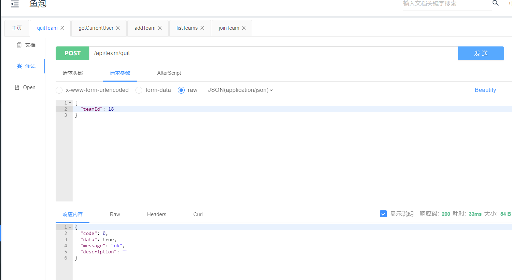


的确，1844262784502628353 已经不存在队伍32之中了  


房主的确顺位给了1846048964118347777


现在登录1846048964118347777的账号，并退出队伍


可以看到队伍32被删除  
到此为止退出功能基本实现


### 2.在TeamService里编写删除队伍方法并在TeamServiceImpl里实现


#### (1).修改delete接口


```java
@PostMapping("/delete")
    public BaseResponse<Boolean> deleteTeam(@RequestBody long id,HttpServletRequest request) {
    if (id <= 0) {
    	throw new BusinessException(ErrorCode.PARAMS_ERROR);
	}
    User loginUser = userService.getLoginUser(request);
    boolean result = teamService.deleteTeam(id,loginUser);
    if (!result) {
        throw new BusinessException(ErrorCode.SYSTEM_ERROR, "删除失败");
    }
    return ResultUtils.success(true);
}
```


#### (2).在TeamService里面写入deleteTeam方法


```java
/**
* 删除队伍
* @param id
* @param loginUser
* @return
*/
boolean deleteTeam(long id, User loginUser);
```


#### (3).在TeamServiceImpl里实现deleteTeam方法


跟上面一样，我们需要根据id获取队伍信息，这个代码我们重复的写，所以提取出来


```java
/**
* 根据 id 获取队伍信息
*
* @param teamId
* @return
*/
private Team getTeamById(Long teamId) {
    if (teamId == null || teamId <= 0) {
    throw new BusinessException(ErrorCode.PARAMS_ERROR);
}
Team team = this.getById(teamId);
if (team == null) {
    throw new BusinessException(ErrorCode.NULL_ERROR, "队伍不存在");
}
return team;
}
```


在Error_Code里添加一个禁止操作  
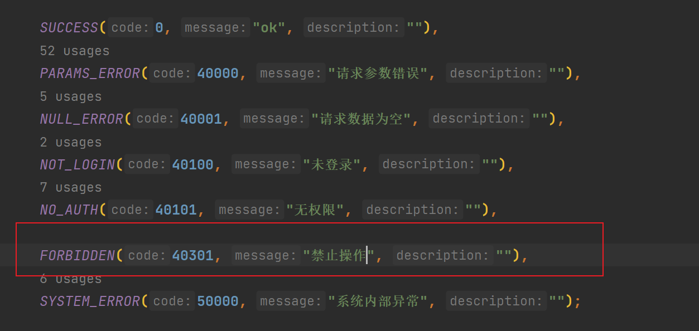


```java
@Override
@Transactional(rollbackFor = Exception.class)
public boolean deleteTeam(long id, User loginUser) {
    // 校验队伍是否存在
    Team team = getTeamById(id);
    long teamId = team.getId();
    // 校验你是不是队伍的队长
    if (!team.getUserId().equals(loginUser.getId())){
        throw new BusinessException(ErrorCode.NO_AUTH,"无访问权限");
    }
    // 移除所有加入队伍的关联信息
    QueryWrapper<UserTeam> userTeamQueryWrapper = new QueryWrapper<>();
    userTeamQueryWrapper.eq("teamId", teamId);
    boolean result = userTeamService.remove(userTeamQueryWrapper);
    if (!result){
        throw new BusinessException(ErrorCode.SYSTEM_ERROR,"删除队伍关联信息失败");
    }
    // 删除队伍
    return this.removeById(teamId);
}
```


注意在操作多个数据库时，在方法上要加上[@Transactional(rollbackFor ](/Transactional(rollbackFor ) = Exception.class)注解，表示要么数据操作都成功，要么都失败。 


> **踩坑处：这里踩了大坑在校验是不是队长时，按照鱼皮的写了，运行发现报错无权限，debug发现两者的id也是一样的，最后在球友的帮助下，发现是类型的问题，打印出两者的类型是Long封装类，判断两者需要使用equals，而不是==（好像是不支持==），我这里修改为equals成功实现，建议大家先按鱼皮的写，如果报错，就可以替换下！**


#### (4).测试

我这里重新创建了20队伍用来测试删除队伍，然后在knife4j里直接删除队伍20  
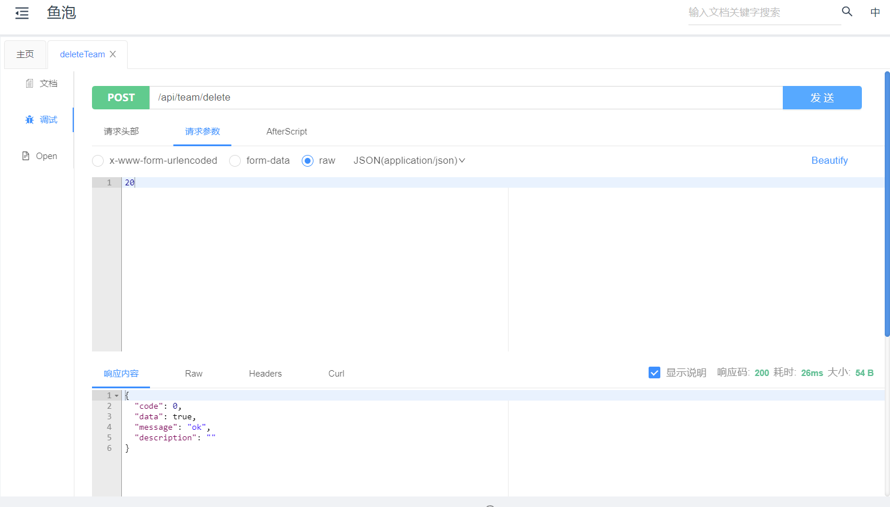  
查看数据库  
  
  
成功删除，删除队伍功能基本完成


## 二、前端设计


### 1.新建一个TeamAddPage，并在路由里添加这个页面

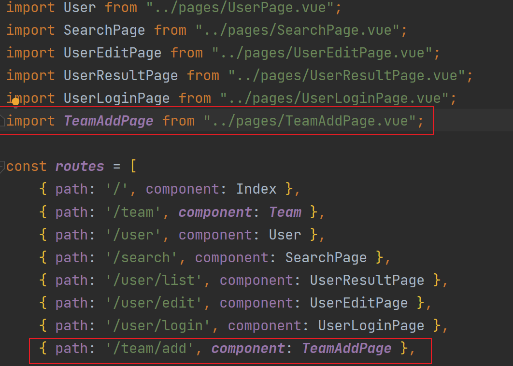  
在TeamPage里写一个按钮跳转到TeamAddPage  
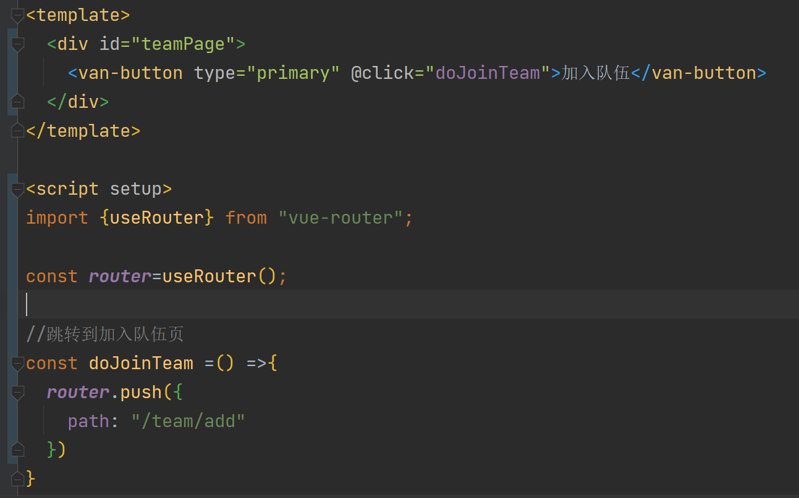


### 2.现在正式设计TeamAddPage页面，主要是在vant组件库里选择合适的组件粘贴


#### (1).队伍名和描述名

我们可以发现队伍名和描述名类似于用户登录页面的表单组件，所以拿来即用（修改下参数）  
这个主要是运用了表单，单元格，输入框这三个组件，其中描述使用了高度自适应  


**参数我们可以从后台获得（knife4j接口文档）**  


#### (2).过期时间


我们选择vant里的DatePicker 日期选择和from中的时间选择器


这里的min-date 我们不能直接new Date(),因为这会导致页面一直渲染，从而页面加载不出来，我能得在建一个常量min-date，同时这个日期默认不显示，我们要在JS里展示日期选择器，确当按钮函数

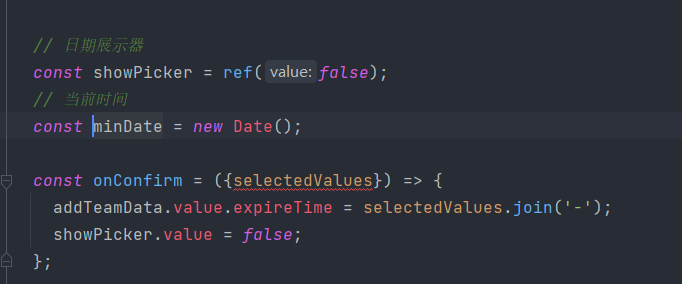

> 踩坑： 由于这里官方文档修改了，在这里我们前后端都要加上一个时间格式化

前端时间格式化：

```plain
下载一个moment格式化工具 npm i moment
```


后端时间格式化


在expireTime属性加上一个格式化注解，并给定格式

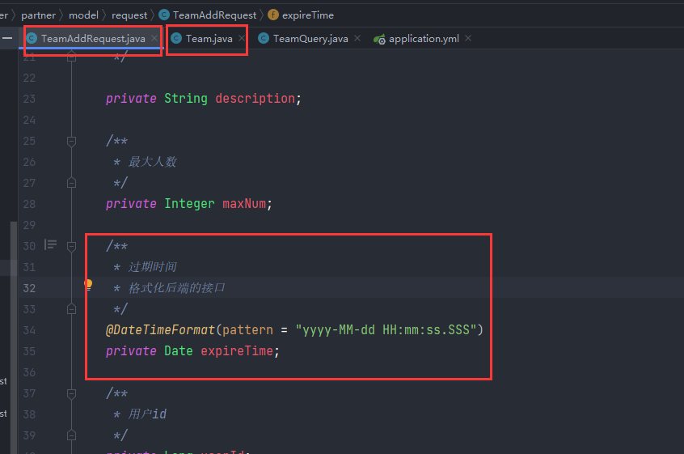

#### (3).最大人数

这里我们选择Stepper步进器里的限制输入范围  


#### (4).队伍状态（当只有选择加密队伍时，才会跳出密码框）


这里我们选择表单类型里的单选框，和field输入框。  
**注意一定要在判断状态时，把类型转为Number，因为通过打印可得，状态是字符串类型的。**  
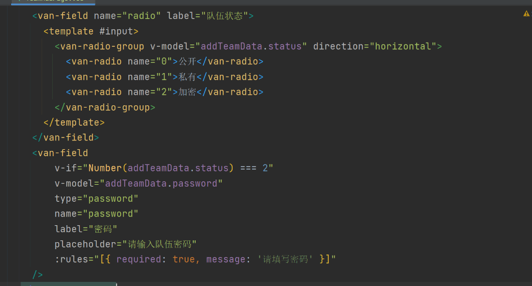


#### (5).提交按钮


native-type="submit"属性， 点击自动获取van-field name中的值组成的对象。  
关键是提交所传的的状态也要转换成Number，同时创建成功后跳转到队伍页面


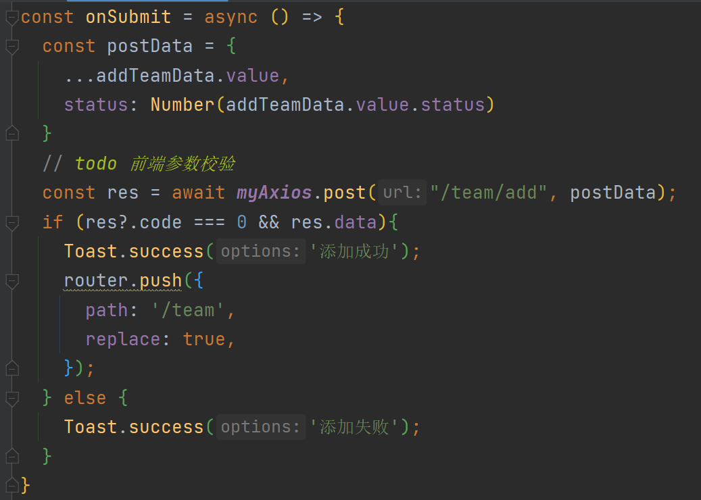


AddTeamPage页面完整代码如下：


```vue
<!--
User:Shier
CreateTime:19:54
-->
<template>
  <div id="teamAddPage">
    <van-form @submit="onSubmit">
      <van-cell-group inset>
        <van-field
            v-model="addTeamData.name"
            name="name"
            label="队伍名称"
            placeholder="请输入队伍名称"
            :rules="[{ required: true, message: '请输入队伍名称' }]"
        />
        <van-field
            v-model="addTeamData.description"
            rows="4"
            autosize
            label="队伍描述"
            type="textarea"
            placeholder="请输入队伍描述"
        />
        <!--过期时间-->
        <van-field
            is-link
            readonly
            name="datePicker"
            label="时间选择"
		   :placeholder="addTeamData.expireTime?addTeamData.expireTime:'点击选择队伍过期时间'"
            @click="showPicker = true"
        />
        <van-popup v-model:show="showPicker" position="bottom">
          <van-date-picker
              @confirm="onConfirm"
              @cancel="showPicker = false"
              type="datetime"
              title="请选择关闭队伍加入的时间"
              :min-date="minDate"/>
        </van-popup>

        <van-field name="stepper" label="最大人数">
          <template #input>
            <van-stepper v-model="addTeamData.maxNum" max="10" min="3"/>
          </template>
        </van-field>

        <van-field name="radio" label="队伍状态">
          <template #input>
            <van-radio-group v-model="addTeamData.status" direction="horizontal">
              <van-radio name="0">公开</van-radio>
              <van-radio name="1">私有</van-radio>
              <van-radio name="2">加密</van-radio>
            </van-radio-group>
          </template>
        </van-field>

        <van-field
            v-if="Number(addTeamData.status) === 2"
            v-model="addTeamData.password"
            type="password"
            name="password"
            label="密码"
            placeholder="请输入队伍密码"
            :rules="[{ required: true, message: '请填写密码' }]"
        />
      </van-cell-group>
      <div style="margin: 16px;">
        <van-button round block type="primary" native-type="submit">
          提交
        </van-button>
      </div>
    </van-form>
  </div>
</template>

<script setup lang="ts">

  import {useRouter} from "vue-router";
  import {ref} from "vue";
  import myAxios from "../plugins/myAxios";
  import moment from 'moment';
  import {showFailToast, showSuccessToast} from "vant/lib/vant.es";

  const router = useRouter();


  // 日期展示器
  const showPicker = ref(false);
  // 当前时间
  const minDate = new Date();

  const onConfirm = ({selectedValues}) => {
    addTeamData.value.expireTime = selectedValues.join('-');
    showPicker.value = false;
  };

  const initFormData = {
    "name": "",
    "description": "",
    "expireTime": null,
    "maxNum": 5,
    "password": "",
    "status": 0,
  }

  // 需要用户填写的表单数据 对象扩展
  const addTeamData = ref({...initFormData})

  // 提交
  const onSubmit = async () => {
    const postData = {
      ...addTeamData.value,
      status: Number(addTeamData.value.status),
      expireTime: moment(addTeamData.value.expireTime).format("YYYY-MM-DD HH:mm:ss")
    }
    const res = await myAxios.post("/team/add", postData);
    if (res?.code === 0 && res.data) {
      showSuccessToast('添加成功');
      router.push({
        path: '/team',
        replace: true,
      });
    } else {
      showFailToast('添加失败');
    }
  }
</script>

<style scoped>
  #teamPage {

  }
</style>
```


#### (6).启动前后端项目，测试

前端页面显示如下  
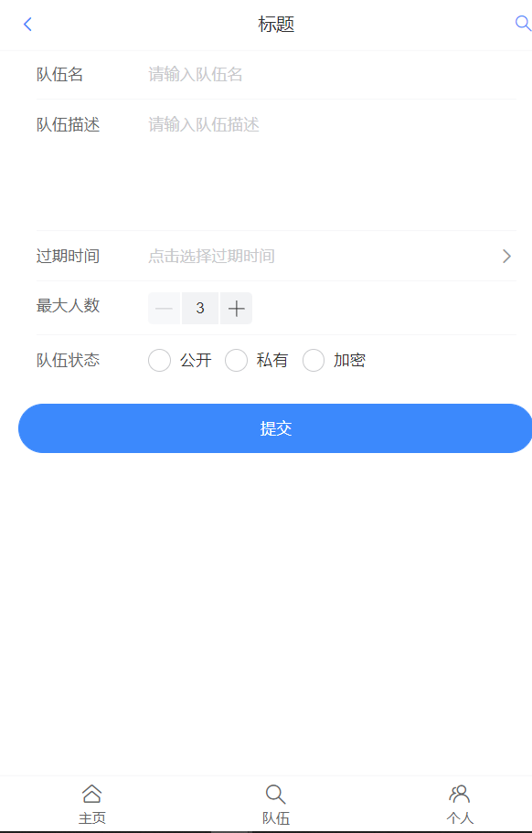  
输入数据，提交。我这边已经添加队伍了（忘记截图了)，如果正确的话，成功跳转  
数据库成功加入数据  


### 3.设计队伍列表


#### 1.我们首先要定义队伍类型（team.d.ts）


```typescript
import {UserType} from "./user";

/**
 * 队伍类别
 */
export type TeamType = {
    id: number;
    name: string;
    description: string;
    expireTime?: Date;//表示可有可无
    maxNum: number;
    password?: string,
    // todo 定义枚举值类型，更规范
    status: number;
    createTime: Date;
    updateTime: Date;
    createUser?: UserType;
    hasJoinNum?: number;
};
```


#### 2.创建一个队伍卡片列表组件（类似于用户卡片列表）


#### (1).复制用户卡片列表，将userlist改为teamlist，UserCardList改为TeamCardList，UserType改为TeamType


```vue
<template>
  <van-card
      v-for="user in props.teamList"
      :desc="user.profile"
      :title="`${user.username} (${user.planetCode})`"
      :thumb="user.avatarUrl"
  >
    <template #tags>
      <van-tag plain type="danger" v-for="tag in user.tags" style="margin-right: 8px; margin-top: 8px" >
        {{ tag }}
      </van-tag>
    </template>
    <template #footer>
      <van-button size="mini">联系我</van-button>
    </template>
  </van-card>
</template>

<script setup lang="ts">

import {TeamType} from "../models/team";

interface TeamCardListProps{
  teamList: TeamType[];
}

const props= withDefaults(defineProps<TeamCardListProps>(),{
  //@ts-ignore
  teamList: [] as TeamType[]
});

</script>

<style scoped>

</style>
```


#### (2).然后我们将此组件挂载在TeamPage页面


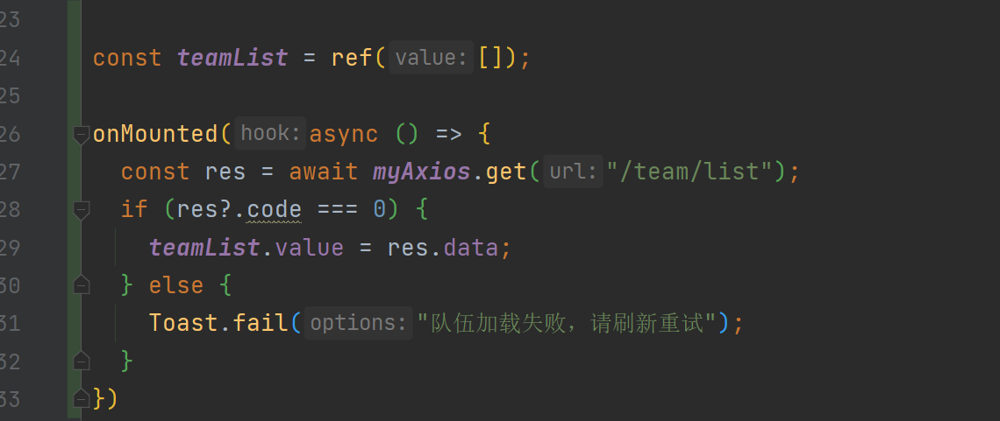


注意：引入team-card-list时，编译器可能不会帮你把引入的类型自动带上，需自己添加


将team-card-list里的原来的用户参数换成队伍的，测试一下


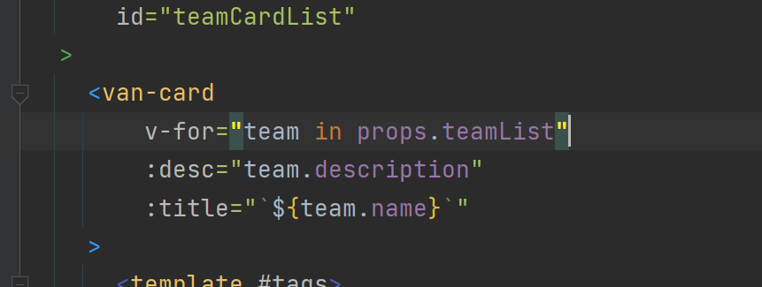


刷新页面，成功加载出组件（就是很丑，展示不齐全）  
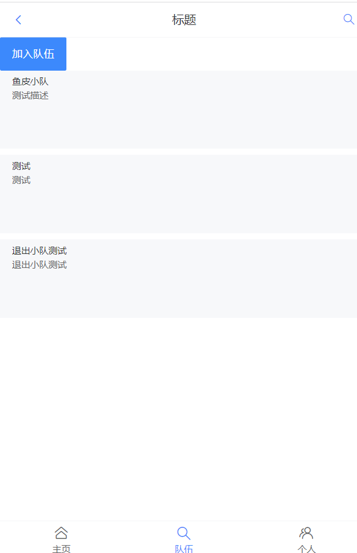


#### (3).现在我们要完善teamcardlist组件

添加队伍状态，最大人数等以及实现加入队伍功能  
我们下方要涉及到队伍的状态，我们先创建队伍状态常量 team.ts  
  
完整代码如下：

```vue
<template>
  <van-card
      v-for="team in props.teamList"
      :desc="team.description"
      :title="team.name"
      :thumb="avatar"
  >
    <template #tags>
      <van-space wrap style="margin-top: 5px">
        <van-tag plain type="danger">{{ teamStatusEnum[team.status] }}</van-tag>
      </van-space>
    </template>

    <template #bottom>
      <div>{{ '最大人数' + team.maxNum }}</div>
      <div v-if="team.expireTime">{{ '过期时间' + team.expireTime }}</div>
      <div>{{ '创建时间' + team.createTime }}</div>
    </template>

    <template #footer>
      <van-button size="small" type="primary" plain @click="doJoinTeam(team.id)">加入队伍</van-button>
    </template>
  </van-card>
</template>

<script setup lang="ts">

import {defineProps} from "vue";
import {TeamType} from "../models/team";
import avatar from "../assets/avatar.jpeg"
import {teamStatusEnum} from "../constants/team";
import myAxios from "../plugins/myAxios.js";
import {showFailToast, showSuccessToast} from "vant";

interface TeamCardListProps {
  teamList: TeamType[];
}

//props能够得到父组件传递过来的属性比如teamList
const props = defineProps<TeamCardListProps>();

const doJoinTeam = async (id : number) => {
  const res = await myAxios.post("/team/join",{
    id:id,
  })
  console.log(id);
  if(res?.code === 0){
    showSuccessToast("加入成功");
  }else{
    showFailToast( res.message ? res.message : "");
  }
}
</script>

<style scoped>

</style>
```


注意：1.这里thumb我们引入了图片（显示更美观），可以把自己心仪的图片放入assets里并引入  

2. 加入队伍里面失败，写的形式是模板字符串，可自行了解  
3. 引入样式，原来的图片过于宽，要指定高度关闭自适应，这里我们使用样式穿透，不然不起作用，**如果我们给部分组件引入的样式不起作用，都可以使用样式穿透！**


#### (4).测试

使用newfbin002登录，再加入队伍，加入成功
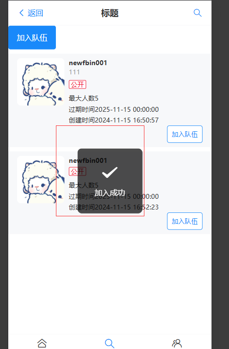


## 第十一期🎉🎉🎉🎉🎉🎉🎉🎉🎉🎉🎉


> 更新: 2023-02-10 10:06:52  
> 原文: <https://www.yuque.com/shierkcs/catstudy/uyq3aex2vvk5722u>