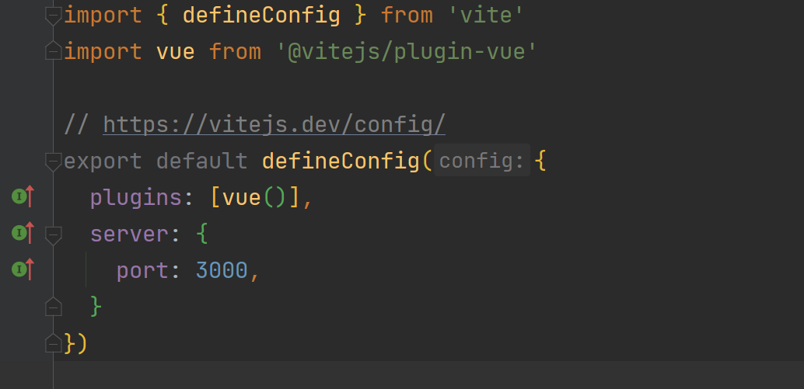
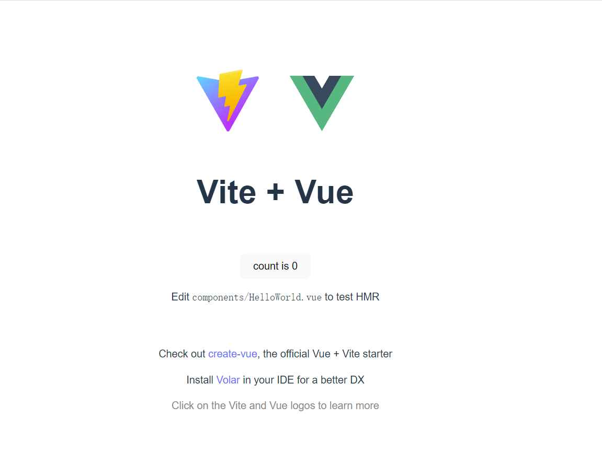
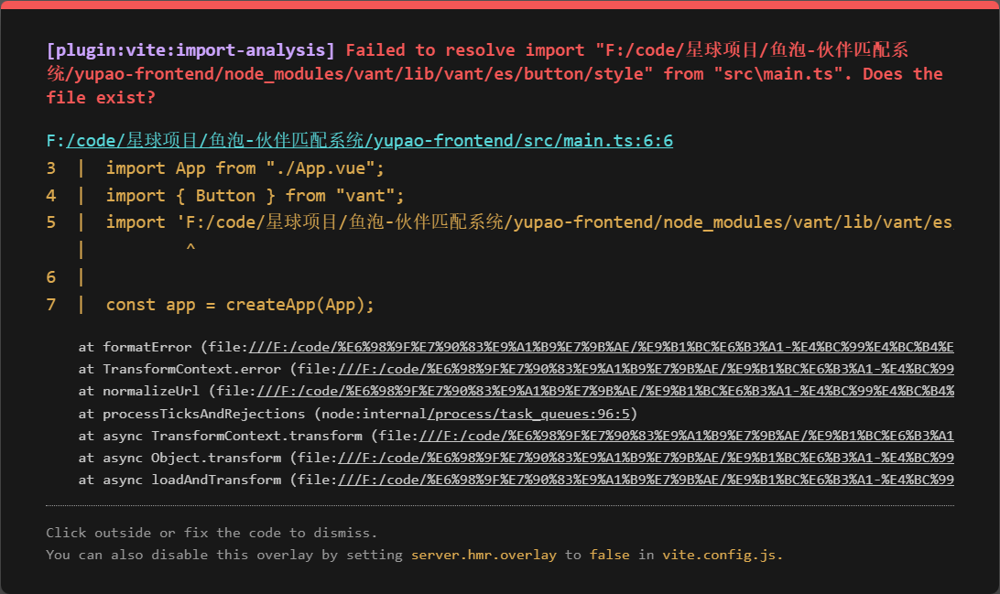
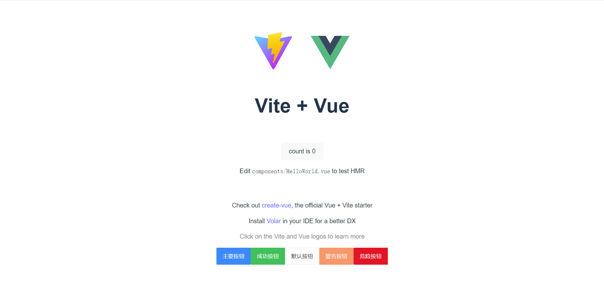

# 01 项目介绍+前后端初始化

直播回放：[从 0 到 1 开发找伙伴系统（1）](https://t.zsxq.com/03EAIU7mQ)（项目介绍和前后端初始化）

## 鱼皮的笔记

介绍：帮助大家找到志同道合的伙伴，移动端 H5 网页（尽量兼容 PC 端）


### 需求分析


1. 用户去添加标签，标签的分类（要有哪些标签、怎么把标签进行分类）学习方向 java / c++，工作 / 大学
2. 主动搜索：允许用户根据标签去搜索其他用户 
   1. Redis 缓存
3. 组队 
   1. 创建队伍
   2. 加入队伍
   3. 根据标签查询队伍
   4. 邀请其他人
4. 允许用户去修改标签
5. 推荐 
   1. 相似度计算算法 + 本地分布式计算


## 技术栈

### 前端

1. Vue 3
2. Vant UI 组件库
3. Vite 脚手架
4. Axios 请求库

### 后端

1. Java SpringBoot 2.7.x 框架
2. MySQL 数据库
3. MyBatis-Plus
4. MyBatis X 自动生成
5. Redis 缓存（Spring Data Redis 等多种实现方式）
6. Redisson 分布式锁
7. Easy Excel 数据导入
8. Spring Scheduler 定时任务
9. Swagger + Knife4j 接口文档
10. Gson：JSON 序列化库
11. 相似度匹配算法

## 项目大纲

1. 项目简介和计划
2. 需求分析
3. 技术选型（各技术作用讲解）
4. 前端项目初始化
5. 脚手架
6. 组件 / 类库引入
7. 前端页面设计及通用布局开发
8. 后端数据库表设计
9. 按标签搜索用户功能
10. 前端开发
11. 后端开发
12. 性能分析
13. 接口调试
14. Swagger + Knife4j 接口文档整合
15. 后端分布式登录改造（Session 共享）
16. 用户登录功能开发
17. 修改个人信息功能开发
18. 主页开发（抽象通用列表组件）
19. 批量导入数据功能
20. 几种方案介绍及对比
21. 测试及性能优化（并发编程）
22. 主页性能优化
23. 缓存和分布式缓存讲解
24. Redis 讲解
25. 缓存开发和注意事项
26. 缓存预热设计与实现
27. 定时任务介绍和实现
28. 锁 / 分布式锁介绍
29. 分布式锁注意事项讲解
30. Redisson 分布式锁实战
31. 控制定时任务执行的几种方案介绍及对比
32. 组队功能
33. 需求分析
34. 系统设计
35. 多个接口开发及测试
36. 前端多页面开发
37. 权限控制
38. 随机匹配功能
39. 匹配算法介绍及实现
40. 性能优化及测试
41. 项目优化及完善
42. 免备案方式上线前后端


### 第一期计划


1. 前端项目初始化 15 min
2. 前端主页 + 组件概览 15 min
3. 数据库表设计 15 min 
   1. 标签表
   2. 用户表
4. 初始化后端项目
5. 开发后端 - 根据标签搜索用户 30 min
6. 开发前端 - 根据标签搜索用户 20 min


## 项目开始


### 一、前端项目初始化


用脚手架初始化项目

+ Vue CLI [https://cli.vuejs.org/zh/](https://cli.vuejs.org/zh/)
+ **Vite 脚手架** ：[https://vitejs.cn/guide/#scaffolding-your-first-vite-project](https://vitejs.cn/guide/#scaffolding-your-first-vite-project)

整合组件库 Vant：

+ 安装 Vant
+ 按需引入 npm i vite-plugin-style-import[@1.4.1 ](/1.4.1) -D

开发页面经验：

1. 多参考
2. 从整体到局部
3. 先想清楚页面要做成什么样子，再写代码

#### 1.在需要创建项目的目录输入cmd来初始化搭建项目


```plain
yarn create vite
```


执行命令会出现的错误：


根据官方文档换了一个命令执行


```plain
npm create vite@latest
```


第一个输入项目的名称  
第二个选择脚手架类型  ------vue  
第三个选择语言            ------ts  
初始化总截图  


#### 2. 初始化完善


用webstorm或者vscode打开刚创建的项目（这里我选择了webstorm）


1. 首先在终端中输入yarn或者`npm install`导入依赖、导入需要的包模块
2. 在package.json中点击dev启动


         我这边发现端口不是3000，为了后续方便，可以修改vite.config.ts文件  
  
又发现打开的网页界面也不一致（算了，走一步是一步）  



3. 整合组件库


```plain
# 通过 npm 安装
npm i vite-plugin-style-import@1.4.1 -D

# 通过 yarn 安装
yarn add vite-plugin-style-import@1.4.1 -D
```


这里推荐npm方式，yarn大概率会像鱼皮那样报错，安装失败  
安装完成后，在 **vite.config.js** 文件中配置插件：按需引入模块


```javascript
import vue from '@vitejs/plugin-vue';
import styleImport, { VantResolve } from 'vite-plugin-style-import';

export default {
  plugins: [
    vue(),
    styleImport({
      resolves: [VantResolve()],
    }),
  ],
};
```


整理如下：


```javascript
import { defineConfig } from 'vite'
import vue from '@vitejs/plugin-vue'
import styleImport, { VantResolve } from 'vite-plugin-style-import';

// https://vitejs.dev/config/
export default defineConfig({
  plugins: [
    vue(),
    styleImport({
      resolves: [VantResolve()],
    }),
  ]
  server: {
    port: 3000,
  }
})
```


通过npm安装vant


```plain
# Vue 3 项目，安装最新版 Vant
npm i vant
```


接着引入组件在main.ts文件里


```javascript
import { createApp } from 'vue';
import { Button } from 'vant';

const app = createApp();
app.use(Button);
```


整理如下


```javascript
import { createApp } from 'vue'
import './style.css'
import App from './App.vue'
import { Button } from 'vant';

const app = createApp(App);
app.use(Button);
app.mount('#app');
```


现在可以测试一下引入是否成功


```html
<van-button type="primary">主要按钮</van-button>
<van-button type="success">成功按钮</van-button>
<van-button type="default">默认按钮</van-button>
<van-button type="warning">警告按钮</van-button>
<van-button type="danger">危险按钮</van-button>
```


在App.vue里面


```vue
<template>
  <div>
    <a href="https://vitejs.dev" target="_blank">
      
    </a>
    <a href="https://vuejs.org/" target="_blank">
      
    </a>
  </div>
  <HelloWorld msg="Vite + Vue" />
  <van-button type="primary">主要按钮</van-button>
  <van-button type="success">成功按钮</van-button>
  <van-button type="default">默认按钮</van-button>
  <van-button type="warning">警告按钮</van-button>
  <van-button type="danger">危险按钮</van-button>
</template>
```


运行，启动项目访问，我这里出现了报错  
  
发现是依赖引入路径的问题，百度！  
修改vite.config.ts代码，增加如下代码


```javascript
export default defineConfig({
  plugins: [
    vue(),
    styleImport({
      resolves: [VantResolve()],
      //增加的代码
      libs: [
        {
          libraryName: 'vant',
          esModule: true,
          resolveStyle: name => `../es/${name}/style`
        }
     ]
    }),
  ],
  server: {
    port: 3000,
  }
})
```


再次启动项目，不报错，在底部成功出现了按键  



### 二、前端主页 + 组件概览


**设计**：  
导航条：展示当前页面名称  
主页搜索框 => 搜索页 => 搜索结果页（标签筛选页）  
内容  
tab 栏：


+ 主页（推荐页 + **广告** ） 
  - 搜索框
  - banner
  - 推荐信息流
+ 队伍页
+ 用户页（消息 - 暂时考虑发邮件）


**开发**：  
很多页面要复用组件 / 样式，重复写很麻烦、不利于维护，所以抽象一个通用的布局（Layout）  
组件化


#### 1. 删除App.vue中无用的代码，只剩下框架；删除components中的hello文件，建立layouts文件夹（复用，通用布局）


#### 2.搭建基本框架


复制navbar模块的代码如下，插入到layouts目录下的BasicLayouts.vue文件中


```javascript
<van-nav-bar
  title="标题"
  left-text="返回"
  right-text="按钮"
  left-arrow
  @click-left="onClickLeft"
  @click-right="onClickRight"
/>


import { Toast } from 'vant';

export default {
  setup() {
    const onClickLeft = () => history.back();
    const onClickRight = () => Toast('按钮');
    return {
      onClickLeft,
      onClickRight,
    };
  },
};


<van-nav-bar title="标题" left-text="返回" left-arrow>
  <template #right>
    <van-icon name="search" size="18" />
  </template>
</van-nav-bar>
```


整理可得


```vue
<template>
  <van-nav-bar
      title="标题"
      left-arrow
      @click-left="onClickLeft"
      @click-right="onClickRight"
  >
  <template #right>
    <van-icon name="search" size="18" />
  </template>
  </van-nav-bar>
</template>

<script setup>
  const onClickLeft = () => alert('左');
  const onClickRight = () => alert('右');
</script>

<style scoped>

</style>
```


在其中


> 更新: 2023-04-10 18:25:57  
> 原文: <https://www.yuque.com/shierkcs/catstudy/zf61dnmp52c8nxtr>