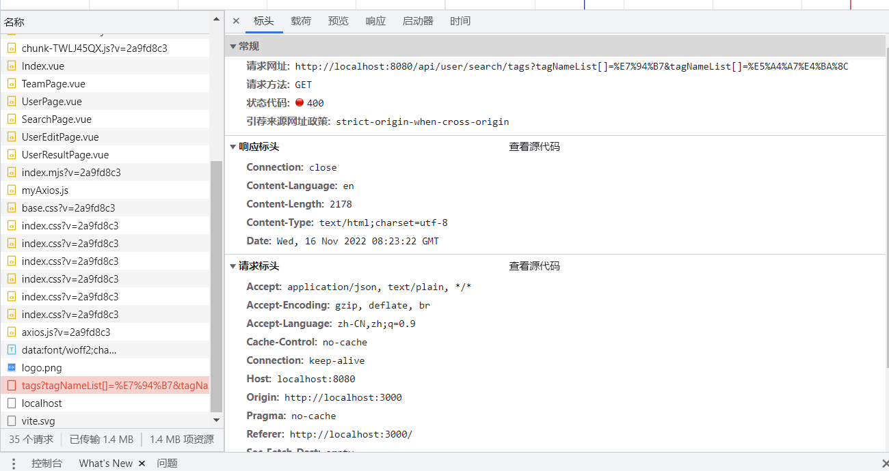

# 04 搜索界面+分布式登录

直播回访：[从 0 到 1 开发找伙伴系统（4）](https://t.zsxq.com/03Eu3VNJ2)（页面开发和分布式）

## 伙伴匹配系统第四期
### 本期目标计划


1. 页面和功能开发 
    1. 搜索页面 √
    2. 用户信息
    3. 用户修改页面
2. 改造用户中心，把单机登录改为分布式 session 登录 √
3. 标签的整理、细节的优化


### 2.前端页面跳转传值


1. query => url searchParams，url 后附加参数，传递的值长度有限
2. vuex（全局状态管理），搜索页将关键词塞到状态中，搜索结果页从状态取值


### 3.todo 待优化


前端：动态展示页面标题、微调格式


## 一、页面和功能开发


### 1.搜索页面


#### （1）新建UserResultPage.vue，创建页面，同时别忘了在路由里引入这个页面


#### （2）优化SearchPage页面，添加一个搜索按钮，来实现点击提交选中的标签到UserResultPage页面


```javascript
  <div style="padding: 16px">
    <van-button block type="primary" @click="doSearchResult">搜索</van-button>
  </div>

import {useRouter} from 'vue-router';
const router = useRouter();

const doSearchResult = () => {
  router.push({
    path: '/user/list',
    query: {
      tags: activeIds.value
    }
  })
}
```


> ps：千万别忘了引入useRouter和定义router常量，我这边没引入但是不报错（比较迷惑人）
>


显示如下：  


点击搜索按钮，可观察到路径跳转会带有参数


#### （3）完善UserResultPage页面，来显示用户的信息，依旧从vant的组件库寻找合适的组件


因为用户信息中要包括个人简介，而我们用户中心的数据中并未包含这一字段，现在去添加  
具体操作就不演示了，修改表之后DDL语句改变如下  
  
修改数据库之后还并未对后端对应数据库的内容做相应的增加。偷个懒，等下次修改后端时再修改  
进入前端的用户对象的规范，也添加这一字段  
  
现在正式进入修改页面环节，在vant文档中复制商品卡片组件  


复制到UserResultPage页面并修改如下：


```vue
<!--
User:Shier
CreateTime:10:10
-->

<template>
  <van-card
      v-for="user in userList"
      :desc="`个人简介：${user.profile}`"
      :title="`${user.username} (${user.planetCode})`"
      :thumb="user.avatarUrl"
  >
    <template #tags>
      <van-tag plain type="danger" v-for="tag in tags" style="margin-right: 8px; margin-top: 10px" >
        {{tag}}
      </van-tag>
    </template>
    <template #footer>
      <van-button size="mini">联系我</van-button>
    </template>
  </van-card>
</template>

<script setup >
  import {ref} from "vue";
  import {useRoute} from "vue-router";

  const route = useRoute();
  const {tags} = route.query;

  const mockUser = {
    id: 2767,
    username: '猫十二懿',
    userAccount: 'shier',
    avatarUrl: 'https://img1.baidu.com/it/u=467212011,1034521901&fm=253&fmt=auto&app=120&f=JPEG?w=500&h=500',
    gender: 0,
    profile: '千里不辞行路远。个人对一些猫比较感兴趣，喜欢撸猫😎',
    phone: '121311313',
    email: '23432@qq.com',
    planetCode: '2767',
    userRole: '管理员',
    createTime: new Date(),
    tags: ['java', '前端', '实习', '后端', '开学'],
  };

  const userList = ref({mockUser});

</script>

<style scoped>

</style>
```


启动，在search路径下选择标签点击搜索，成功跳转到UserResultPage页面，显示如下：


#### (4).前端页面已开发完成，现在开发后端，和前端进行对接


对接后端接口，在controller层编写代码


```java
    //根据标签查询用户
    @GetMapping("/search/tags")
    public BaseResponse<List<User>> searchUsersByTags(@RequestParam(required = false) List<String> tagNameList){
        if (CollectionUtils.isEmpty(tagNameList)){
            return ResultUtils.error(ErrorCode.PARAMS_ERROR);
        }
        List<User> userList = userService.searchUsersByTags(tagNameList);
        return ResultUtils.success(userList);
    }
```


debug启动项目，去knife4j接口操作，确保已经登录，传两个参数，回后端看看是否获取参数  


> banner.txt 修改项目其中时的信息 [选择一些好看的图案](https://www.bootschool.net/ascii-art)
>
>  
>
> 
>


> 接口文档链接： [http://localhost:8080/api/doc.html#/home](http://localhost:8080/api/doc.html#/home)
>


  
带空参数请求  


> 是我们自己写的报错（请求参数错误)成功！现在回前端对接后端
>


#### (5)开发前端接口


首先要在前端引入[axios](http://www.axios-js.com/) 终端输入


```plain
使用 npm:
 npm install axios
     
使用 bower:
 bower install axios

使用 yarn
    yarn add axios
```


在src目录下新建plugins包和myAxios.ts，复制axios文档中如下代码，并修改整理如下：  


```javascript
import axios from "axios";

// Set config defaults when creating the instance
const myAxios = axios.create({
    baseURL: 'http://localhost:8080/api',
});

// 添加请求拦截器
myAxios.interceptors.request.use(function (config) {
    console.log("我要发送请求了,",config)
    return config;
}, function (error) {
    // 对请求错误做些什么
    return Promise.reject(error);
});

// 添加响应拦截器
myAxios.interceptors.response.use(function (response) {
    // 对响应数据做点什么
    console.log("我收到你的响应了,",response)
    return response;
}, function (error) {
    // 对响应错误做点什么
    return Promise.reject(error);
});

export default myAxios;
```


在userSearchPage页面新增如下代码用来页面挂载 onMounted 钩子


```javascript
onMounted(() => {
    // 请求的url、参数
    myAxios.get('/user/search/tags',{
        params: {
            tagNameList: tags
        }
    })
    .then(function (response) {
        console.log('/user/search/tags succeed',response);
        Toast.success('请求成功');
    })
    .catch(function (error) {
        console.error('/user/search/tags error',error);
        Toast.fail('请求失败');
    })
})
```


  
跨域了，我们在后端解决这个问题  


**踩坑处：这边一开始不要带有参数请求，不然会一直显示跨域（也不知道是什么原因造成的，希望有大佬解答）**  
再次运行（刷新）  
发现路径后面带有的参数不合规范，带有[]。我们这边可以引入qs去用于参数序列化,处理发送请求的参数  
  


> **踩坑处：这边又踩了大坑，可能由于axios的版本问题，按照鱼皮的写，会报错：Uncaught (in promise) **  
**{message: 'options must be an object', name: 'AxiosError', code: 'ERR_BAD_OPTION_VALUE', stack: 'AxiosError: options must be an object\n at Objec…ji.com/static/js/chunk-libs.c096185b.js:42:41367)'}.............**
>


axios版本如果是比较新的，要按照上图所示写，再次刷新成功获取  


debug启动，打个断点，再次刷新，可以在后端观察到成功获取前端的参数


  
现在要将数据库对接上，不再使用假数据，首先往数据库里添加假数据（尽量详细)


> forEach函数会显示没有这个函数，写成userListData?.data.forEach编译不会报错但运行会报错，所以不要管编译报错，照着鱼皮的写。  
踩坑处：注意数据库里的逻辑删除是不是1（所以数据尽量多写点)，我这边由于没仔细看，“男”标签就两个，一个是被逻辑删除了，结果只显示一个，还以为循环出错，查了好久。。。
>


`SearchResultPage.vue` 完整代码如下


> 我没有使用 Toast.success。。。 不然会报错说Toast is not defined 的
>


```vue
<!--
User:Shier
CreateTime:10:10
-->
<template>
  <van-card
      v-for="user in userList"
      :desc="user.profile"
      :title="`${user.username} (${user.planetCode})`"
      :thumb="user.avatarUrl"
  >
    <template #tags>
      <van-tag plain type="danger" v-for="tag in tags" style="margin-right: 8px; margin-top: 8px">
        {{ tag }}
      </van-tag>
    </template>
    <template #footer>
      <van-button size="mini">联系我</van-button>
    </template>
  </van-card>
  <van-empty v-if="!userList || userList.length < 1" description="搜索结果为空"/>
</template>

<script setup>
  import {onMounted, ref} from "vue";
  import {useRoute} from "vue-router";
  import {Toast} from "vant";

  import myAxios from "../plugins/myAxios.js";

  import qs from 'qs'

  const route = useRoute();
  const {tags} = route.query;
    
  const userList = ref([]);//存放用户列表
    // 使用钩子函数
  onMounted(async () => {//异步调用
    // 为给定 ID 的 user 创建请求
    const userListData = await myAxios.get('/user/search/tags', {
      withCredentials: false,
      params: {
        tagNameList: tags
      },
      //序列化
      paramsSerializer: {
        serialize: params => qs.stringify(params, {indices: false}),
      },
    })
        .then(function (response) {
          console.log('/user/search/tags succeed', response);
          return response.data?.data; //返回数据  ?.可选链操作符，避免数据为null或undefined时报错
        })
        .catch(function (error) {
          console.log('/user/search/tags error', error);
          Toast.fail('请求失败');
        });
    if (userListData) {
      userListData.forEach(user => {
        if (user.tags) {
          user.tags = JSON.parse(user.tags);
        }
      })
      userList.value = userListData;
    }
  })
</script>

<style scoped>

</style>
```


显示如下：


## 二、改造用户中心，把单机登录改为分布式 session 登录
### 什么是分布式？
> AI 说：  
**分布式（Distributed）是指将计算、存储和处理任务分散到多台计算机或服务器上进行完成的一种计算模式**。传统的集中式系统中，所有的计算和数据处理都依赖于中央服务器，而分布式系统则将任务分解为多个子任务，并将其分配给不同的计算机节点来并行处理。
>
> 分布式计算有以下几个主要的作用：
>
> 1. 提高性能和可伸缩性：通过将任务分布到多个计算机上执行，分布式系统能够充分利用计算资源，提高系统的处理能力和性能，并且可以根据需要动态扩展系统规模。
> 2. 提高可靠性和容错性：分布式系统通过数据冗余和任务复制等方式，可以在个别计算机节点发生故障时继续正常运行，提高了系统的可靠性和容错性。
> 3. 实现共享资源：分布式系统能够将多个计算机节点的资源进行整合和共享，包括计算能力、存储空间、网络带宽等，从而提供更多的服务和功能。
>
> 分布式系统有广泛的应用领域，其中一些常见的分布式应用包括：
>
> 1. **分布式数据库系统：**将数据存储在多个服务器上，实现数据的分布式存储、管理和查询，提高了数据库的性能和可伸缩性。
> 2. **分布式文件系统：**将文件分散存储在多个服务器上，通过网络进行访问和共享，提供高性能和可靠的文件存储服务。
> 3. **分布式计算系统：**将计算任务分配给多台计算机节点并行执行，例如云计算平台、大规模并行计算等。
> 4. **分布式缓存系统：**将数据缓存在多个服务器上，加快数据的读取速度，降低网络负载，提高应用程序的性能。
> 5. **分布式消息队列系统：**通过消息队列实现不同计算节点之间的通信和协调，提高系统的吞吐量和响应性能。
> 6. **分布式搜索引擎：**将索引和搜索任务分布到多个服务器上，提供快速的搜索和检索功能。
>


**分布式登录：就比如是有两台服务器，在这两台服务器部署了一样的服务，然后前端请求是通过负载均衡进行请求服务，这时你是不知道请求会落到那个服务器上， 所以你就不能在 Seesion 来做存信息（不能只保存到本地上）。如果你请求了服务器A，然后登陆信息放在了服务器A，下一次你的请求如果到了服务器B，那此时服务器B就没有你上一次的登录信息了，所以要使用中间件，也就是redis（Redission Java客户端）做这个分布式登录，这样不管你请求那个服务器都会有你的登录信息。**


### Session 共享


种 session 的时候注意范围，cookie.domain  
比如两个域名：  
aaa.yupi.com  
bbb.yupi.com  
如果要共享 cookie，可以种一个更高层的公共域名，比如 yupi.com


### 为什么服务器 A 登录后，请求发到服务器 B，不认识该用户？


用户在 A 登录，所以 session（用户登录信息）存在了 A 上  
结果请求 B 时，B 没有用户信息，所以不认识。  


> 解决方案：**共享存储** ，而不是把数据放到单台服务器的内存中
>


如何共享存储？


1. Redis（基于内存的 K / V 数据库）此处选择 Redis，因为用户信息读取 / 是否登录的判断极其**频繁** ，Redis 基于内存，读写性能很高，简单的数据单机 qps 5w - 10w
2. MySQL
3. 文件服务器 ceph


### 安装redis和管理工具quickredis


Redis 5.0.14 下载：  
链接：[https://pan.baidu.com/s/1XcsAIrdeesQAyQU2lE3cOg](https://pan.baidu.com/s/1XcsAIrdeesQAyQU2lE3cOg)  
提取码：vkoi  
redis 管理工具 quick redis：[https://quick123.net/](https://quick123.net/)


### 在springboot里引入redis，能够操作redis


```xml
<!-- https://mvnrepository.com/artifact/org.springframework.boot/spring-boot-starter-data-redis -->
<dependency>
    <groupId>org.springframework.boot</groupId>
    <artifactId>spring-boot-starter-data-redis</artifactId>
    <version>2.6.4</version>
</dependency>
```


### 引入 spring-session 和 redis 的整合，使得自动将 session 存储到 redis 中：


```xml
<!-- https://mvnrepository.com/artifact/org.springframework.session/spring-session-data-redis -->
<dependency>
    <groupId>org.springframework.session</groupId>
    <artifactId>spring-session-data-redis</artifactId>
    <version>2.6.3</version>
</dependency>
```


> 修改 spring-session 存储配置 `spring.session.store-type` 默认是 none，表示存储在单台服务器  
store-type: redis，表示从 redis 读写 session ,
>


JWT 的优缺点：[https://zhuanlan.zhihu.com/p/108999941](https://zhuanlan.zhihu.com/p/108999941)


配置如下：  


### 测试session共享


为了模拟多服务器，我们需要打包项目，在另一个端口启动，这里是8081  
先打包，后在**target目录**下打开终端运行下面的代码


```plain
 java -jar .\user-center-backend-0.0.1-SNAPSHOT.jar --server.port=8081
```


运行，成功启动8080和8081端口的knife4j接口进行操作


先在8080端口登录并获取当前登录用户信息


[http://localhost:8080/api/doc.html#/home](http://localhost:8080/api/doc.html#/home)


在8081端口查看当前登录用户信息，也能查询到


[http://localhost:8081/api/doc.html#/home](http://localhost:8081/api/doc.html#/home)


使用QuickRedis查看session是否存入redis中  


## 第四期完结🎉🎉🎉🎉🎉


> 更新: 2023-08-08 20:19:05  
> 原文: <https://www.yuque.com/shierkcs/catstudy/fl5tihucn61toy0t>