# 05 修改用户消息+登录界面

直播回放：<font style="color:rgba(0, 0, 0, 0.85);"> https://www.aliyundrive.com/s/XoDNanXShjN 提取码: hv73 </font>

## 鱼皮笔记
1. 用户修改页面前端、后端开发和联调


## 一、后端修改用户信息接口


首先运行前后端，看看是否正常


### 1.在UserController里面添加更新用户信息接口


```java
    /**
     * 更新用户信息
     * @param user
     * @param request
     * @return
     */
    @PostMapping("/update")
    public BaseResponse<Integer> updateUser(@RequestBody User user, HttpServletRequest request) {
        // 1. 校验参数是否为空
        if (user == null) {
            throw new BusinessException(ErrorCode.PARAMS_ERROR);
        }
        User loginUser = userService.getCurrentUser(request);
        int result = userService.updateUser(user, loginUser);
        return ResultUtils.success(result);
    }
```


由于项目中多次用户鉴权，所以我们在service层编写isAdmin方法（包括复写）  
UserService


```java

    /**
     * 是否为管理员
     * @param request
     * @return
     */
    boolean isAdmin(HttpServletRequest request);

    /**
     * 是否为管理员
     * @param loginUser
     * @return
     */
    boolean isAdmin(User loginUser);

    /**
     * 获取当前用户
     * @param request
     * @return
     */
    User getCurrentUser(HttpServletRequest request);

    /**
     * 更新用户信息
     * @param user
     * @param loginUser
     * @return
     */
    int updateUser(User user, User loginUser);
```


同时在UserServiceImpl里面实现上述方法


```java
/**
     * 更新用户信息
     * @param user
     * @param loginUser
     * @return
     */
    @Override
    public int updateUser(User user, User loginUser) {
        Long userId = user.getId();
        if (userId <= 0) {
            throw new BusinessException(ErrorCode.PARAMS_ERROR);
        }
        // 2. 校验权限
        // 2.1 管理员可以更新任意信息、用户只能更新自己的信息
        if (!isAdmin(loginUser) && userId != loginUser.getId()) {
            throw new BusinessException(ErrorCode.NO_AUTH);
        }
        User oldUser = this.getById(user.getId());
        if (oldUser == null) {
            throw new BusinessException(ErrorCode.NULL_ERROR);
        }
        // 3. 触发更新
         return this.baseMapper.updateById(user);
    }

/**
     * 是否为管理员
     * @param request
     * @return
     */
    public boolean isAdmin(HttpServletRequest request) {
        User user = (User) request.getSession().getAttribute(UserConstant.USER_LOGIN_STATE);
        if (user == null || user.getUserRole() != UserConstant.ADMIN_ROLE) {
            return false;
        }
        return true;
    }

    /**
     * 是否为管理员
     * @param loginUser
     * @return
     */
    @Override
    public boolean isAdmin(User loginUser) {
        return loginUser.getUserRole() == ADMIN_ROLE;
    }

    /**
     * 获取当前用户
     * @param request
     * @return
     */
    @Override
    public User getCurrentUser(HttpServletRequest request) {
        if (request == null) {
            throw new BusinessException(ErrorCode.PARAMS_ERROR);
        }
        User user = (User) request.getSession().getAttribute(USER_LOGIN_STATE);
        if (user == null) {
            throw new BusinessException(ErrorCode.NOT_LOGIN);
        }
        return user;
    }
```


## 二、前端用户信息接口


> 我这里不能使用Toast.success() ，进行提示，看文档说使用showSuccessToast、showFailToast进行提示
>
>  
>
> 在引入的时候要注意要写成以下的源文件`"vant/lib/vant.es"`，才会成功
>


## 三、前端页面开发


### 1.现在pages包里新建一个登录页面UserLoginPage.vue


```vue
<template>
  <van-form @submit="onSubmit">
    <van-cell-group inset>
      <van-field
          v-model="userAccount"
          name="userAccount"
          label="账号"
          placeholder="请输入账号"
          :rules="[{ required: true, message: '请填写用户名' }]"
      />
      <van-field
          v-model="userPassword"
          type="password"
          name="userPassword"
          label="密码"
          placeholder="请输入密码"
          :rules="[{ required: true, message: '请填写密码' }]"
      />
    </van-cell-group>
    <div style="margin: 16px;">
      <van-button round block type="primary" native-type="submit">
        提交
      </van-button>
    </div>
  </van-form>
</template>

<script setup>

import myAxios from "../plugins/myAxios.ts";
import {Toast} from "vant";
import {ref} from "vue";
import {useRouter} from "vue-router";

const router = useRouter();

const userAccount = ref('');
const userPassword = ref('');

const onSubmit = async () => {
  // console.log("用户登录");
  const res = await myAxios.post("/user/login", {
    userAccount: userAccount.value,
    userPassword: userPassword.value
  });
  if (res.code == 0 && res.data != null) {
    Toast.success("登录成功");
    router.replace("/")
  } else {
    Toast.fail("登录失败");
  }
};

</script>

<style scoped>

</style>
```


别忘了在路由里面引入


```javascript
import UserLoginPage from "../pages/UserLoginPage.vue"; 

{ path: '/user/login', component: UserLoginPage },
```


这里需要我们在Myaxios.ts里把响应改成data，如下图：  
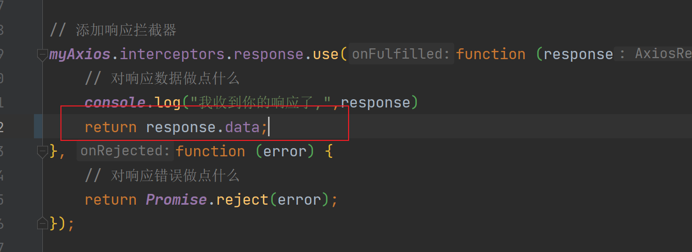


[http://localhost:3000/#/user/login](http://localhost:3000/#/user/login)


运行 ，输入数据，成功登录并跳转的主页，显示如下：  
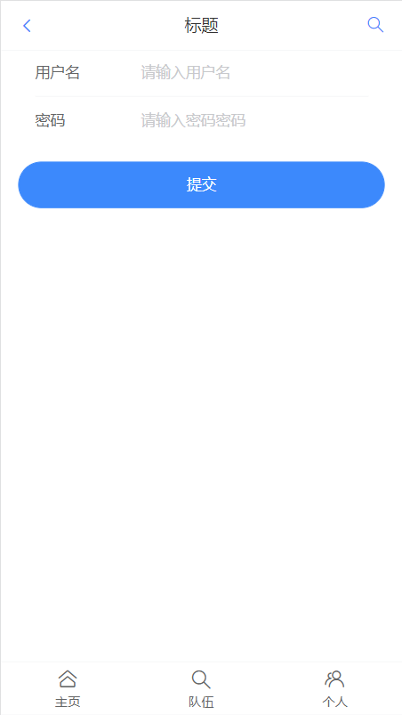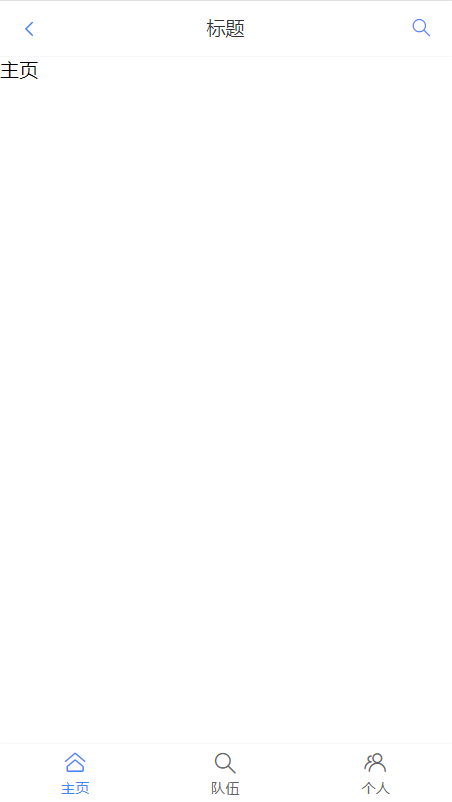


### 2.登录成功，现在就要去编写用户信息了（动态显示数据库里面的信息），原来是写死的


```javascript
import myAxios from "../plugins/myAxios.ts";
import {showFailToast,showSuccessToast} from "vant/lib/vant.es";

const user = ref();

onMounted(async ()=>{
    const res = await myAxios.get('/user/current');
    if (res.code === 0){
      user.value =res.data;
      showSuccessToast('获取用户信息成功');
    }else {
      showFailToast('获取用户信息成功');
    }
})
```


但是登录不会种下cookie，意味着后端不能获取登录用户信息，就不能动态展示用户信息页


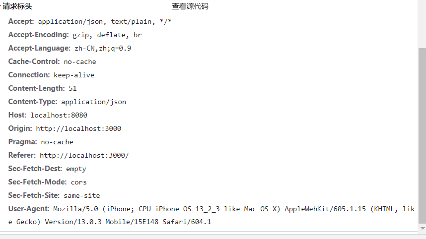  
在myAxios.ts中添加以下代码：（注意要在定义的变量，即myAxios之后粘贴)


```plain
myAxios.defaults.withCredentials = true; // 允许携带 cookie
```


在后端接口添加允许携带 cookie 的配置  
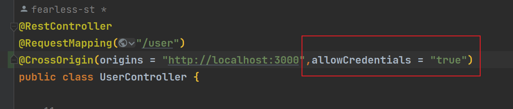  
同时后端设置 cookie 的作用域  
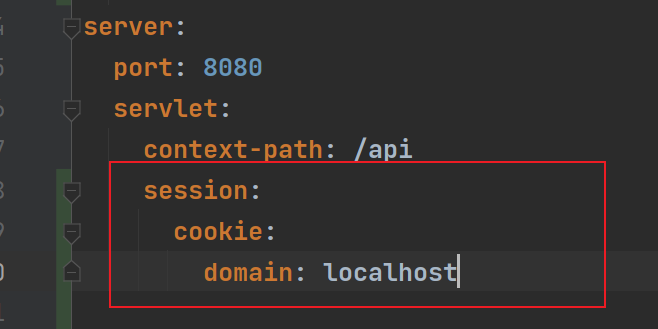


登录，再次点击个人，发现cookie已经带有了，只是页面还没有显示  
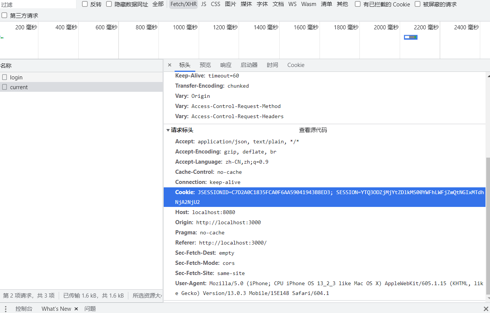


查看操作台报错，发现是createTime的字符转变导致的，直接删去，后面再处理  
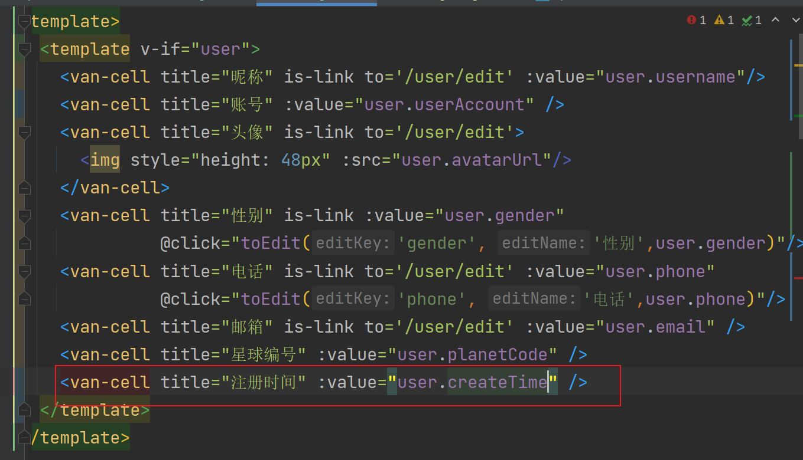


```vue
<!--
User:Shier
CreateTime:11:01
-->

<template>
  <template v-if="user">
    <van-cell title="昵称" is-link to="/user/edit" :value="user.username" @click="toEdit('username','昵称',user.username)"/>
    <van-cell title="账户" :value="user.userAccount" 
              @click="toEdit('userAccount','账户',user.userAccount)"/>
    <van-cell title="头像" is-link to="/user/edit" :value="user.avatarUrl" @click="toEdit('avatarUrl','头像',user.avatarUrl)">
      
    </van-cell>
    <van-cell title="性别" is-link to="/user/edit" :value="user.gender" @click="toEdit('gender','性别',user.gender)" />
    <van-cell title="电话" is-link to="/user/edit" :value="user.phone" @click="toEdit('phone','电话',user.phone)"/>
    <van-cell title="邮箱" is-link to="/user/edit" :value="user.email" @click="toEdit('email','邮箱',user.email)"/>
    <van-cell title="星球编号" :value="user.planetCode" />
    <van-cell title="注册时间" :value="user.createTime"  />
  </template>
</template>
<script setup lang="ts">
  import {useRouter} from "vue-router";
  import {onMounted, ref} from "vue";
  import myAxios from "../plugins/myAxios.ts";
  import {showFailToast, showSuccessToast} from "vant/lib/vant.es";

  const user = ref();
  // const user = {
  //   id: 1,
  //   username: '猫十二懿',
  //   userAccount: 'shier',
  //   avatarUrl: 'https://img1.baidu.com/it/u=467212011,1034521901&fm=253&fmt=auto&app=120&f=JPEG?w=500&h=500',
  //   gender: '男',
  //   phone: '121311313',
  //   email: '23432@qq.com',
  //   planetCode: '12322',
  //   createTime: new Date(),
  // };

  const router = useRouter()
  const toEdit = (editKey: String, editName: String, currentValue: String) => {
    router.push({
      path: 'user/edit',
      query: {
        editKey,
        editName,
        currentValue,
      }
    })
  }

  onMounted(async () => {
    const res = await myAxios.get('/user/current');
    if (res.code === 0) {
      user.value = res.data;
      showSuccessToast('获取用户信息成功');
    } else {
      showFailToast('获取用户信息成功');
    }
  })

</script>

<style scoped>

</style>
```


再次刷新，页面成功的显示  


### 3.完善修改用户信息


> 发现每个页面都要获取当前的用户信息，所以我们把这个方法提取出来  
在src目录下建立services包，并创建user.ts编写代码
>


```typescript
import myAxios from "../plugins/myAxios";
import {getCurrentUserState, setCurrentUserState} from "../states/user";

/**
 * 获取用户信息
 * @returns {Promise<null|any>}
 */
export const getCurrentUser = async () => {
    const user = getCurrentUserState();
    if (user) {
        return user;
    }
    //从远程处获取用户信息
    const res = await myAxios.get("/user/current");
    if (res.code == 0 ) {
        // setCurrentUserState(res.data);
        return res.data;
    }
    return null;
}
```


同时在src目录下建立states包，并创建user.ts编写代码（定义两个方法）


```typescript
import {UserType} from "../models/user";

let currentUser: UserType;

const setCurrentUserState = (user:UserType) =>{
    currentUser =user;
}

const getCurrentUserState = (): UserType =>{
    return currentUser;
}

export {
    setCurrentUserState,
    getCurrentUserState,
}
```


由于提取了获取用户信息的代码，所以用户页原来编写的代码需要修改为下图  
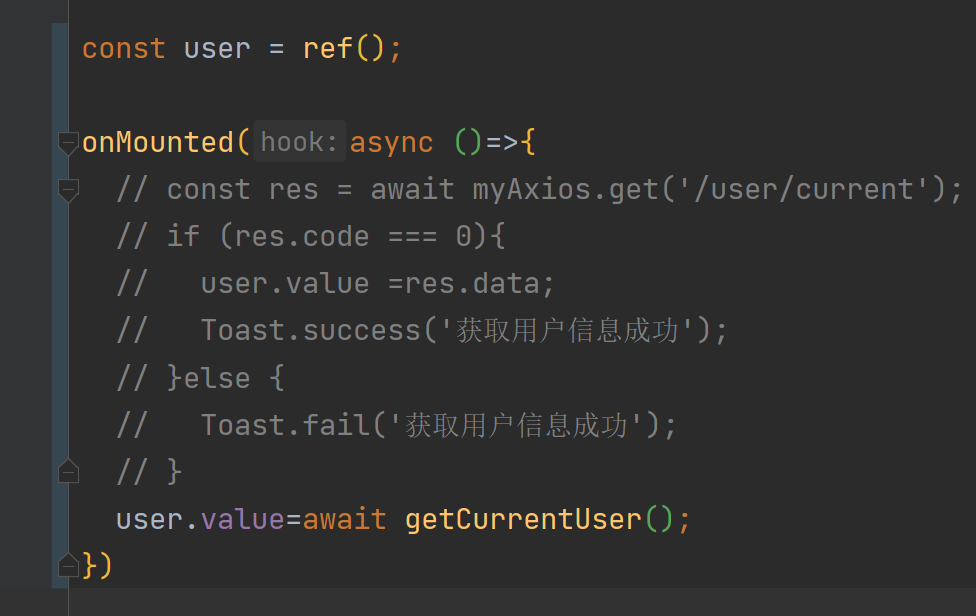


最后就是要编写用户修改页面了，发送修改用户信息请求。    `UserEditPage.vue`完整代码如下


```vue
<template>
  <van-form @submit="onSubmit">
      <van-field
          v-model="editUser.currentValue"
          :name="editUser.editKey"
          :label="editUser.editName"
          :placeholder="`请输入${editUser.editName}`"
      />
    <div style="margin: 16px;">
      <van-button round block type="primary" native-type="submit">
        提交
      </van-button>
    </div>
  </van-form>
</template>

<script setup lang="ts">
import {useRoute, useRouter} from "vue-router";
import {ref} from "vue";
import myAxios from "../plugins/myAxios";
  import {showSuccessToast,showFailToast} from "vant/lib/vant.es";
import {getCurrentUser} from "../services/user";

const route = useRoute();
const router =useRouter();

const editUser = ref({
  editKey: route.query.editKey,
  currentValue: route.query.currentValue,
  editName: route.query.editName,
})

// 不可以写在外面，否则页面不显示内容，还没有报错信息，原因未知
// const currentUser = await getCurrentUser();

const onSubmit = async () => {
  // 异步方法必须添加 await 才可以拿到数据, 否则拿到的是 promise 对象
  const currentUser = await getCurrentUser();
  console.log("-------UserEditPage", currentUser);
  const res = await myAxios.post("/user/update", {
    "id": currentUser.id,
    [editUser.value.editKey]: editUser.value.currentValue // 动态取值
  })
  console.log("修改用户信息", res);
  if (res.code === 0 && res.date > 0) {
      showSuccessToast('修改成功')
      router.back()
    }else {
      showFailToast('修改失败');
    }
};

</script>

<style scoped>

</style>
```


### 4.测试如下：其中会有报错，好像大多是由于ts造成的，但是都不会影响代码的运行实现


**注意踩坑处：**  
语法糖是支持写在外面的，但是这里面运用就不显示页面  
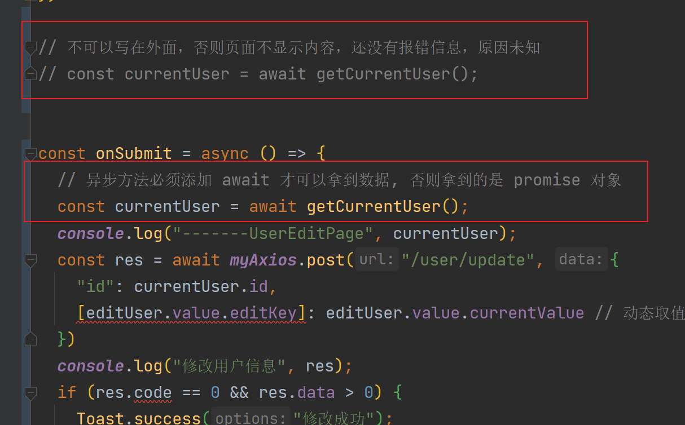


### 5.关于调用缓存去获取当前用户信息的问题


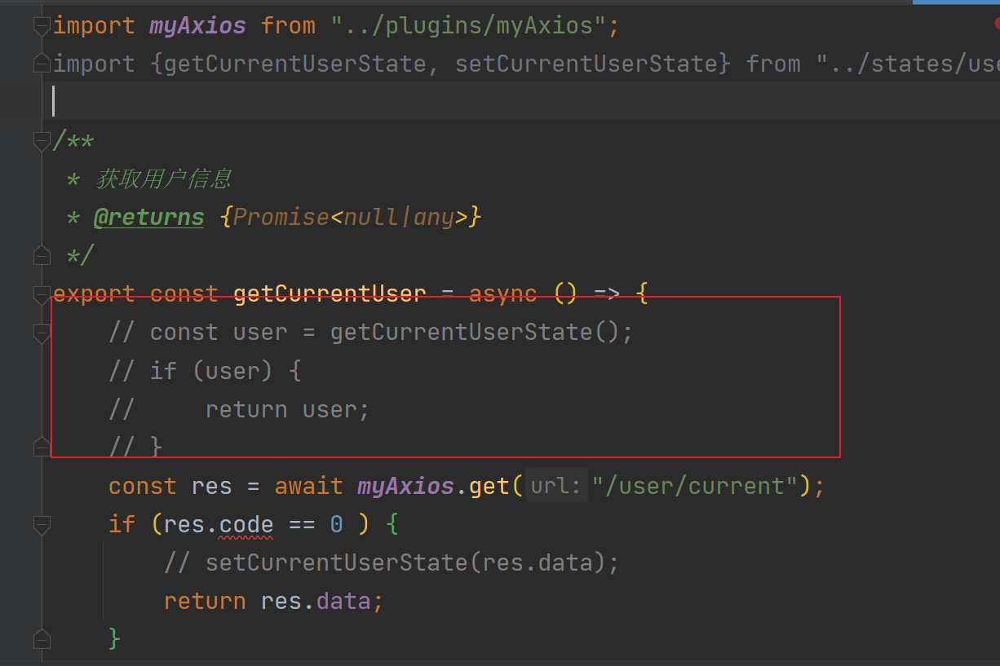


这边就很玄学，鱼皮使用了缓存，结果获取不到最新的用户信息，而我这边可以。。。  
**建议：在小系统（用户少）中尽量不要使用缓存，可以使用路由守卫，从远程获取**  
**踩坑处**：如果前端在用户页的信息中并未设定editKey的话，就无法修改信息（更新内容为空），这需要我们在后端去控制、筛选前端所传入的参数      后端会有类似以下报错  
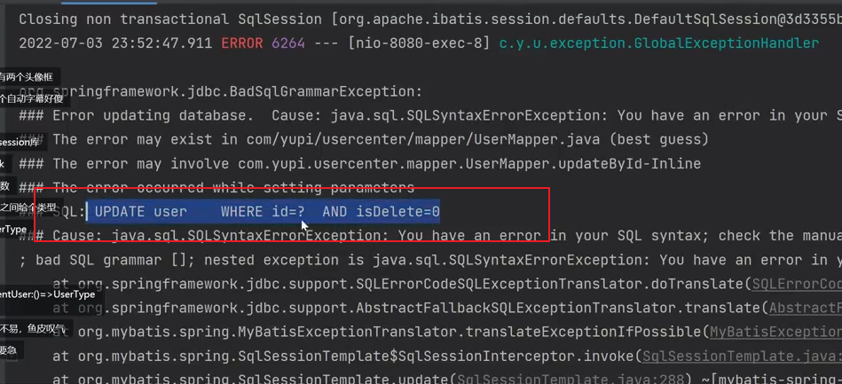


## 第五期完结🎉🎉🎉🎉🎉


> 更新: 2023-02-10 10:03:20  
> 原文: <https://www.yuque.com/shierkcs/catstudy/zo2h5fxbgki9yogt>