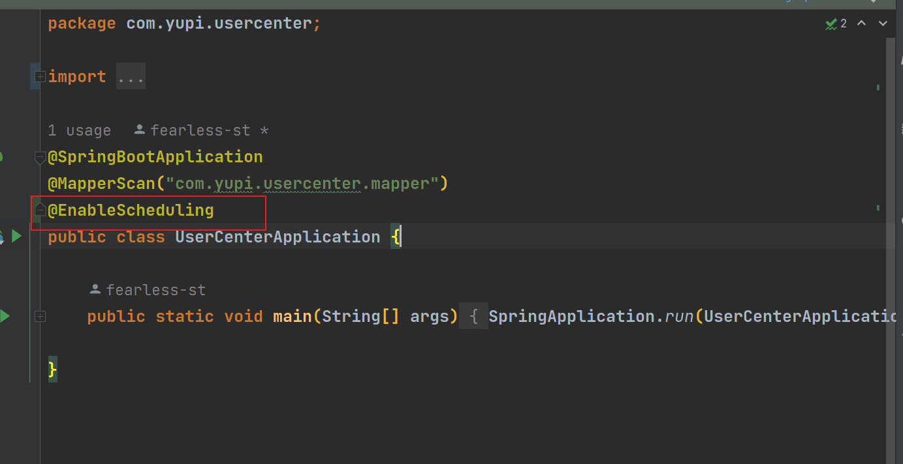
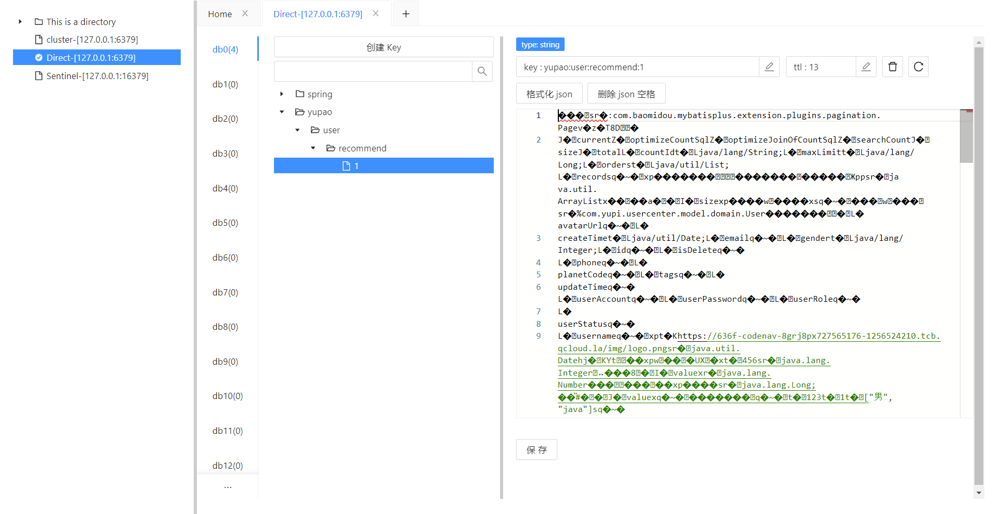

# 07 数据缓存+缓存预热+用户推荐

<font style="color:rgb(51, 51, 51);">在线回放：</font>[https://meeting.tencent.com/v2/cloud-record/share?...](https://meeting.tencent.com/v2/cloud-record/share?id=cbf47b3d-7215-4d4c-9808-8b832a0b1521&from=3)<font style="color:rgb(51, 51, 51);">（访问密码：4x4z）</font>

## 鱼皮笔记
### 1.数据查询慢怎么办？


用缓存：提前把数据取出来保存好（通常保存到读写更快的介质，比如内存），就可以更快地读写。


### 2.缓存的实现


+ Redis（分布式缓存）
+ memcached（分布式）
+ Etcd（云原生架构的一个分布式存储，**存储配置**，扩容能力）

---

+ ehcache（单机）
+ 本地缓存（Java 内存 Map）
+ Caffeine（Java 内存缓存，高性能）
+ Google Guava


#### Redis


> NoSQL 数据库  
key - value 存储系统（区别于 MySQL，他存储的是键值对）
>


#### Redis 数据结构🌟🌟🌟🌟🌟（面试高频考点）


String 字符串类型： name: "shier"  
List 列表：names: ["shier", "xiaoshier", "shier1"]，长度可变  
Set 集合：names: ["shier", "dogshier"]（值不能重复）  
Hash 哈希：nameAge: { "yupi": 1, "dogyupi": 2 }：  
Zset 集合：names: { yupi - 9, dogyupi - 12 }（适合做排行榜）Zset值会关联分数

---

bloomfilter（布隆过滤器，主要从大量的数据中快速过滤值，比如邮件黑名单拦截）  
geo（计算地理位置）  
hyperloglog（pv / uv）  
pub / sub（发布订阅，类似消息队列）  
BitMap （1001010101010101010101010101）


### 3.自定义序列化


```java
package com.yupi.yupao.config;

import org.springframework.context.annotation.Bean;
import org.springframework.context.annotation.Configuration;
import org.springframework.data.redis.connection.RedisConnectionFactory;
import org.springframework.data.redis.core.RedisTemplate;
import org.springframework.data.redis.serializer.RedisSerializer;

@Configuration
public class RedisTemplateConfig {

    @Bean
    public RedisTemplate<String, Object> redisTemplate(RedisConnectionFactory connectionFactory) {
        RedisTemplate<String, Object> redisTemplate = new RedisTemplate<>();
        redisTemplate.setConnectionFactory(connectionFactory);
        redisTemplate.setKeySerializer(RedisSerializer.string());
        return redisTemplate;
    }
}
```


引入一个库时，先写测试类


### 4.Java 里的实现方式


#### Spring Data Redis（推荐）


Spring Data：通用的数据访问框架，定义了一组 **增删改查** 的接口  
mysql、redis、jpa  
[spring-data-redis](https://mvnrepository.com/artifact/org.springframework.data/spring-data-redis)  
1）引入


```xml
<dependency>
    <groupId>org.springframework.boot</groupId>
    <artifactId>spring-boot-starter-data-redis</artifactId>
    <version>2.6.4</version>
</dependency>
```


2）配置 Redis 地址


```yaml
spring:
  # redis 配置
  redis:
    port: 6379
    host: localhost
    database: 0
```


#### Jedis


独立于 Spring 操作 Redis 的 Java 客户端  
要配合 Jedis Pool 使用


#### Lettuce


**高阶** 的操作 Redis 的 Java 客户端  
异步、连接池


#### Redisson


分布式操作 Redis 的 Java 客户端，让你像在使用本地的集合一样操作 Redis（分布式 Redis 数据网格）


#### JetCache


对比


1. 如果你用的是 Spring，并且没有过多的定制化要求，可以用 Spring Data Redis，最方便
2. 如果你用的不是 SPring，并且追求简单，并且没有过高的性能要求，可以用 Jedis + Jedis Pool
3. 如果你的项目不是 Spring，并且追求高性能、高定制化，可以用 Lettuce，支持异步、连接池

---

+ 如果你的项目是分布式的，需要用到一些分布式的特性（比如分布式锁、分布式集合），推荐用 redisson


### 5.设计缓存 key


不同用户看到的数据不同  
systemId:moduleId:func:options（不要和别人冲突）  
yupao:user:recommed:userId  
**redis 内存不能无限增加，一定要设置过期时间！！！**


### 6.缓存预热


问题：第一个用户访问还是很慢（加入第一个老板），也能一定程度上保护数据库  
缓存预热的优点：


1. 解决上面的问题，可以让用户始终访问很快


缺点：


1. 增加开发成本（你要额外的开发、设计）
2. 预热的时机和时间如果错了，有可能你缓存的数据不对或者太老
3. 需要占用额外空间


#### 怎么缓存预热？


1. 定时
2. 模拟触发（手动触发）


#### 实现


用定时任务，每天刷新所有用户的推荐列表  
注意点：


1. 缓存预热的意义（新增少、总用户多）
2. 缓存的空间不能太大，要预留给其他缓存空间
3. 缓存数据的周期（此处每天一次）


分析优缺点的时候，要打开思路，从整个项目从 0 到 1 的链路上去分析


### 7.定时任务实现


1. **Spring Scheduler（spring boot 默认整合了）**
2. Quartz（独立于 Spring 存在的定时任务框架）
3. XXL-Job 之类的分布式任务调度平台（界面 + sdk）


第一种方式：


1. 主类开启 [@EnableScheduling ](/EnableScheduling ) 
2. 给要定时执行的方法添加 [@Scheduling ](/Scheduling ) 注解，指定 cron 表达式或者执行频率 


不要去背 cron 表达式！！！！！


+ [https://cron.qqe2.com/](https://cron.qqe2.com/)
+ [https://www.matools.com/crontab/](https://www.matools.com/crontab/)


## 一、测试redis


因为java自带的redistemplate只能查询字符串类型，不够全面，所以我们需要自定义序列化，在config包里创建如下配置类


```java
package com.shier.usercenter.config;

import org.springframework.context.annotation.Bean;
import org.springframework.context.annotation.Configuration;
import org.springframework.data.redis.connection.RedisConnectionFactory;
import org.springframework.data.redis.core.RedisTemplate;
import org.springframework.data.redis.serializer.GenericJackson2JsonRedisSerializer;
import org.springframework.data.redis.serializer.RedisSerializer;

/**
 * @author Shier
 * 自定义Redis序列化
 */
@Configuration
public class RedisTemplateConfig {

    @Bean
    public RedisTemplate<String, Object> redisTemplate(RedisConnectionFactory connectionFactory) {
        // 创建RedisTemplate对象
        RedisTemplate<String, Object> redisTemplate = new RedisTemplate<>();
        //设置连接工厂
        redisTemplate.setConnectionFactory(connectionFactory);
        //设置Key的序列化
        redisTemplate.setKeySerializer(RedisSerializer.string());

        //创建Json序列化工具
        GenericJackson2JsonRedisSerializer jsonRedisSerializer = new GenericJackson2JsonRedisSerializer();
        //设置Value的序列化
        redisTemplate.setValueSerializer(jsonRedisSerializer);

        return redisTemplate;
    }
}
```


在测试包里创建测试类RedisTest，测试代码如下


```java
@SpringBootTest
public class RedisTest {
    //
    @Resource
    private RedisTemplate redisTemplate;
    @Test
    void test(){
        ValueOperations valueOperations = redisTemplate.opsForValue();
        //增
        valueOperations.set("yupiString","dog");
        valueOperations.set("yupiInt",1);
        valueOperations.set("yupiDouble",2.0);
        User user = new User();
        user.setId(1L);
        user.setUsername("yupi");
        valueOperations.set("yupiUser",user);
        //查
        Object yupi = valueOperations.get("yupiString");
        Assertions.assertTrue("dog".equals((String)yupi));
        yupi = valueOperations.get("yupiInt");
        Assertions.assertTrue(1==((Integer)yupi));
        yupi = valueOperations.get("yupiDouble");
        Assertions.assertTrue(2.0==((Double)yupi));
        System.out.println(valueOperations.get("yupiUser"));
//        valueOperations.set("yupiString","dog");
//        redisTemplate.delete("yupiString");
    }
}
```


redis中可查询到缓存的数据  


## 二、根据用户开发个性推荐页


### 1.修改推荐页面的接口，整理如下：


```java
   /**
     * 推荐页面
     * @param request
     * @return
     */
    @GetMapping("/recommend")
    public BaseResponse<Page<User>> recommendUsers(long pageSize,long pageNum, HttpServletRequest request){
        User loginUser = userService.getLoginUser(request);
        String redisKey = String.format("partner:user:recommend:%s", loginUser.getId());
        ValueOperations<String,Object> valueOperations = redisTemplate.opsForValue();
        //如果有缓存，直接读缓存
        Page<User> userPage= (Page<User>)valueOperations.get(redisKey);
        if (userPage!=null){
            return ResultUtils.success(userPage);
        }
        //无缓存，查数据库
        QueryWrapper<User> queryWrapper = new QueryWrapper<>();
        userPage = userService.page(new Page<>(pageNum, pageSize), queryWrapper);
        //写缓存
        try {
          valueOperations.set(redisKey,userPage,30000, TimeUnit.MILLISECONDS);
        }catch (Exception e){
            log.error("redis set key error",e);
        }
        return ResultUtils.success(userPage);
    }
```


刷新页面，有了缓存之后查询速度变快，只有20多毫秒


如果页面没有显示用户列表，则取修改前端如图所示，改为true


### 2.定时任务


> 但是还存在一个问题：第一个用户访问还是很慢（加入第一个老板），要实现缓存预热这里我们使用了定时的方法
>


新建一个job包，写入下面代码实现定时预热缓存


```java
@Slf4j
@Component // 加载成bean
public class PreCacheJob {
    @Resource
    private UserService userService;

    @Resource
    private RedisTemplate<String,Object> redisTemplate;

    //重点用户  
    private List<Long> mainUserList = Arrays.asList(1l);

    //每天执行，预热推荐用户 秒-分-时-日-月-年
    @Scheduled(cron = "0 24 18 * * *")
    public void doCacheRecommendUser(){
        for (Long userId: mainUserList){
            QueryWrapper<User> queryWrapper = new QueryWrapper<>();
            Page<User> userPage = userService.page(new Page<>(1, 20), queryWrapper);
            String redisKey = String.format("yupao:user:recommend:%s", userId);
            ValueOperations<String,Object> valueOperations = redisTemplate.opsForValue();
            //写缓存
            try {
                valueOperations.set(redisKey,userPage,30000, TimeUnit.MILLISECONDS);
            }catch (Exception e){
                log.error("redis set key error",e);
            }
        }
    }
}
```


注意:要在UserCenterApplication添加@EnableScheduling注解，允许定时任务





删去redis里的缓存，设定一个时间，启动项目（前后端），等待时间到来，发现redis里面已经有了缓存


  
刷新页面依旧很快！只有20毫秒


## 第七期完结🎉🎉🎉🎉🎉🎉🎉


> 更新: 2023-02-10 10:05:16  
> 原文: <https://www.yuque.com/shierkcs/catstudy/qpctxhy6civ4334q>