# 12 匹配用户+退出、解散队伍

在线回放：[https://meeting.tencent.com/v2/cloud-record/share?...](https://meeting.tencent.com/v2/cloud-record/share?id=91e7942d-ab8e-489f-ad39-c0ac22072099&from=3)  (访问密码：HfrN)

## 鱼皮笔记
### 前端开发


1. 开发前端的功能 
    1. 搜索队伍 √
    2. 更新队伍（仅队伍的创始人可见） √
    3. 查看个人已加入队伍 √
    4. 查看个人创建的队伍 √
    5. 解散队伍 √
    6. 退出队伍 √
2. 随机匹配 30 - 40 min
3. 完成之前的遗留问题 todo


### 前端不同页面怎么传递数据？


1. **url querystring（xxx?id=1）** 比较适用于页面跳转
2. **url（/team/:id，xxx/1）**
3. hash (/team#1)
4. localStorage
5. **context（全局变量，同页面或整个项目要访问公共变量）**


### 随机匹配


为了帮大家更快地发现和自己兴趣相同的朋友  
匹配 1 个还是匹配多个？  
答：匹配多个，并且按照匹配的相似度从高到低排序  
怎么匹配？（根据什么匹配）  
答：标签 tags  
还可以根据 user_team 匹配加入相同队伍的用户  
本质：找到有相似标签的用户  
举例：  
用户 A：[Java, 大一, 男]  
用户 B：[Java, 大二, 男]  
用户 C：[Python, 大二, 女]  
用户 D：[Java, 大一, 女]


#### 1. 怎么匹配


1. 找到有共同标签最多的用户（TopN）
2. 共同标签越多，分数越高，越排在前面
3. 如果没有匹配的用户，随机推荐几个（降级方案）


编辑距离算法：[https://blog.csdn.net/DBC_121/article/details/104198838](https://blog.csdn.net/DBC_121/article/details/104198838)  
最小编辑距离：字符串 1 通过最少多少次增删改字符的操作可以变成字符串 2  
余弦相似度算法：[https://blog.csdn.net/m0_55613022/article/details/125683937](https://blog.csdn.net/m0_55613022/article/details/125683937)（如果需要带权重计算，比如学什么方向最重要，性别相对次要）


#### 2. 怎么对所有用户匹配，取 TOP


直接取出所有用户，依次和当前用户计算分数，取 TOP N（54 秒）  
优化方法：


1. 切忌不要在数据量大的时候循环输出日志（取消掉日志后 20 秒）
2. Map 存了所有的分数信息，占用内存解决：维护一个固定长度的有序集合（sortedSet），只保留分数最高的几个用户（时间换空间）e.g.【3, 4, 5, 6, 7】取 TOP 5，id 为 1 的用户就不用放进去了
3. 细节：剔除自己 √
4. 尽量只查需要的数据： 
    1. 过滤掉标签为空的用户 √
    2. 根据部分标签取用户（前提是能区分出来哪个标签比较重要）
    3. 只查需要的数据（比如 id 和 tags） √（7.0s）
5. 提前查？（定时任务） 
    1. 提前把所有用户给缓存（不适用于经常更新的数据）
    2. 提前运算出来结果，缓存（针对一些重点用户，提前缓存）


大数据推荐，比如说有几亿个商品，难道要查出来所有的商品？  
难道要对所有的数据计算一遍相似度？  
检索 => 召回 => 粗排 => 精排 => 重排序等等  
检索：尽可能多地查符合要求的数据（比如按记录查）  
召回：查询可能要用到的数据（不做运算）  
粗排：粗略排序，简单地运算（运算相对轻量）  
精排：精细排序，确定固定排位


### 分表学习建议


mycat、sharding sphere 框架  
一致性 hash


### 队伍操作权限控制


加入队伍： 仅非队伍创建人、且未加入队伍的人可见  
更新队伍：仅创建人可见  
解散队伍：仅创建人可见  
退出队伍：创建人不可见，仅已加入队伍的人可见  
加载骨架屏特效 ✔  
解决：van-skeleton 组件  
仅加入队伍和创建队伍的人能看到队伍操作按钮（listTeam 接口要能获取我加入的队伍状态） ✔  
方案 1：前端查询我加入了哪些队伍列表，然后判断每个队伍 id 是否在列表中（前端要多发一次请求）  
方案 2：在后端去做上述事情（推荐）  
前端导航栏死【标题】问题 ✔  
解决：使用 router.beforeEach，根据要跳转页面的 url 路径 匹配 config/routes 配置的 title 字段。


## 一、前端页面开发


### 1.搜索框


```plain
  我们选择vant组件库里的基础搜索框，复制到TeamPage页面，同时还有查询为空时，显示的无结果页面（用户页面以写过）
```


  
因为，我们一次性挂载本质性也是搜索队伍，所以我们把代码提取出来


```javascript
/**
 * 搜索队伍
 * @param val
 * @returns {Promise<void>}
 */
const listTeam = async (val = '') => {
  const res = await myAxios.get("/team/list", {
    params: {
      searchText: val,
      pageNum: 1,
    },
  });
  if (res?.code === 0) {
    teamList.value = res.data;
  } else {
    Toast.fail('加载队伍失败，请刷新重试');
  }
}
```


挂载和搜索框修改为下图所示：（PS：搜索直接回车就可行）  
  
测试  
搜索一个队伍，和查询一个不存在的队伍  
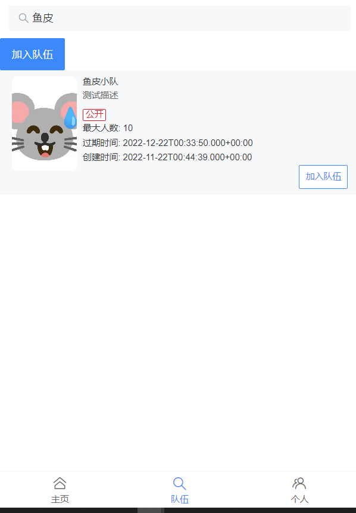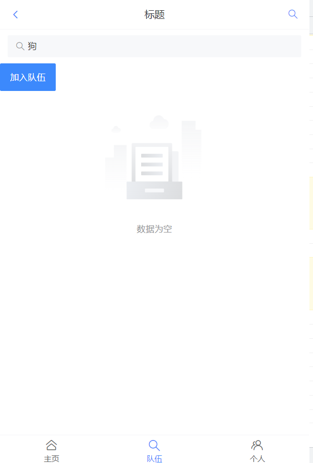


### 2.更新页面


分析：我们的更新页面和新建队伍页面类似，所以我们直接复制TeamAddPage,创建TeamUpdateTeam页面


#### (1).完善TeamCardList


我们首先在队伍页面，创建一个按钮来跳转到更新页面，但是只有当前用户是队伍创建者才可以看到次按钮，我们可以直接写在TeamCardList组件里  
按钮添加  
  
由于需要判断当前用户是否为队伍创建者，我们要获取当前用户（调用以前写的方法）  
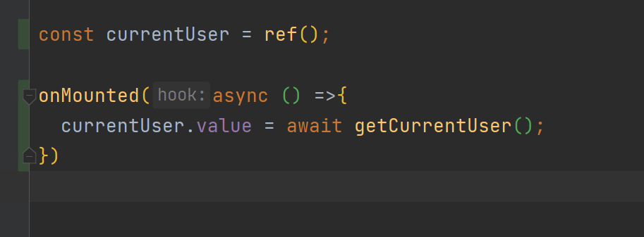  
写跳转按钮的逻辑  
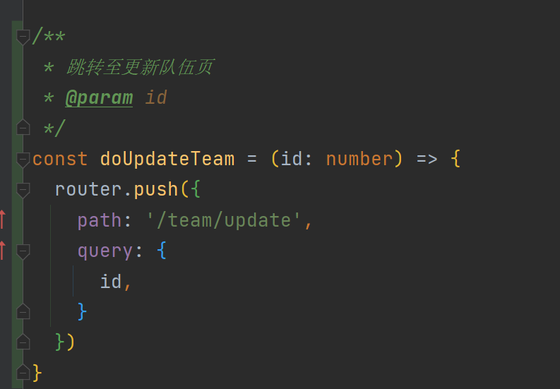  
PS：别忘了引入useRouter  
完整代码如下：


```vue
<template>
  <div
      id="teamCardList"
  >
    <van-card
        v-for="team in props.teamList"
        :thumb="mouse"
        :desc="team.description"
        :title="`${team.name}`"
    >
      <template #tags>
        <van-tag plain type="danger" style="margin-right: 8px; margin-top: 8px">
          {{
            teamStatusEnum[team.status]
          }}
        </van-tag>
      </template>
      <template #bottom>
        <div>
          {{ '最大人数: ' + team.maxNum }}
        </div>
        <div v-if="team.expireTime">
          {{ '过期时间: ' + team.expireTime }}
        </div>
        <div>
          {{ '创建时间: ' + team.createTime }}
        </div>
      </template>
      <template #footer>
        <van-button size="small" type="primary"  plain @click="doJoinTeam(team.id)">加入队伍</van-button>
        <van-button v-if="team.userId === currentUser?.id" size="small" plain
                    @click="doUpdateTeam(team.id)">更新队伍
        </van-button>
      </template>
    </van-card>
  </div>

</template>

<script setup lang="ts">
import {TeamType} from "../models/team";
import {teamStatusEnum} from "../constants/team";
import mouse from '../assets/mouse.jpg';
import myAxios from "../plugins/myAxios";
import {Toast} from "vant";

import {useRouter} from "vue-router";
import {onMounted, ref} from "vue";
import {getCurrentUser} from "../services/user";

interface TeamCardListProps {
  teamList: TeamType[];
}

const props = withDefaults(defineProps<TeamCardListProps>(), {
  // @ts-ignore
  teamList: [] as TeamType[],
});

const router = useRouter();

/**
 * 加入队伍
 */
const doJoinTeam = async (id:number) => {
  const res = await myAxios.post('/team/join', {
    teamId: id,

  });
  if (res?.code === 0) {
    Toast.success('加入成功');
  } else {
    Toast.fail('加入失败' + (res.description ? `，${res.description}` : ''));
  }
}

/**
 * 跳转至更新队伍页
 * @param id
 */
const doUpdateTeam = (id: number) => {
  router.push({
    path: '/team/update',
    query: {
      id,
    }
  })
}

const currentUser = ref();

onMounted(async () =>{
  currentUser.value = await getCurrentUser();
})

</script>

<style scoped>
#teamCardList :deep(.van-image__img) {
  height: 128px;
  object-fit: unset;
}
</style>
```


#### (2).修改TeamUpdateTeam


删除不能修改的组件（最大人数）和固定显示的参数（initFormData），修改提交逻辑（由于是复制得来的，千万别忘了，不然就是增加队伍了）  
关键是获取之前队伍的信息。引入Route，来获取上个页面传来的参数  
定义变量id  


挂载获取之前队伍的信息


完整代码如下：


```vue
<template>
  <div id="teamAddPage">
    <van-form @submit="onSubmit">
      <van-cell-group inset>
        <van-field
            v-model="addTeamData.name"
            name="name"
            label="队伍名"
            placeholder="请输入队伍名"
            :rules="[{ required: true, message: '请输入队伍名' }]"
        />
        <van-field
            v-model="addTeamData.description"
            rows="4"
            autosize
            label="队伍描述"
            type="textarea"
            placeholder="请输入队伍描述"
        />
        <van-field
            is-link
            readonly
            name="datetimePicker"
            label="过期时间"
            :placeholder="addTeamData.expireTime ?? '点击选择过期时间'"
            @click="showPicker = true"
        />
        <van-popup v-model:show="showPicker" position="bottom">
          <van-datetime-picker
              v-model="addTeamData.expireTime"
              @confirm="showPicker = false"
              type="datetime"
              title="请选择过期时间"
              :min-date="minDate"
          />
        </van-popup>
        <van-field name="radio" label="队伍状态">
          <template #input>
            <van-radio-group v-model="addTeamData.status" direction="horizontal">
              <van-radio name="0">公开</van-radio>
              <van-radio name="1">私有</van-radio>
              <van-radio name="2">加密</van-radio>
            </van-radio-group>
          </template>
        </van-field>
        <van-field
            v-if="Number(addTeamData.status) === 2"
            v-model="addTeamData.password"
            type="password"
            name="password"
            label="密码"
            placeholder="请输入队伍密码"
            :rules="[{ required: true, message: '请填写密码' }]"
        />
      </van-cell-group>
      <div style="margin: 16px;">
        <van-button round block type="primary" native-type="submit">
          提交
        </van-button>
      </div>
    </van-form>
  </div>
</template>

<script setup lang="ts">

import {useRoute, useRouter} from "vue-router";
import myAxios from "../plugins/myAxios";
import {Toast} from "vant";
import {onMounted, ref} from "vue";
import {TeamType} from "../models/team";

const router = useRouter();
const route = useRoute();
// 展示日期选择器
const showPicker = ref(false);

const minDate = new Date();

// 需要用户填写的表单数据
const addTeamData = ref({})

const id = route.query.id;

//获取之前队伍的信息
onMounted(async () => {
  if (id <= 0) {
    Toast.fail("队伍加载失败");
    return;
  }
  const res = await myAxios.get("/team/get", {
    params: {
      id: id,
    }
  });
  if (res?.code === 0) {
    addTeamData.value = res.data;
  } else {
    Toast.fail("队伍加载失败，请刷新重试");
  }
})

// 提交
const onSubmit = async () => {
  const postData = {
    ...addTeamData.value,
    status: Number(addTeamData.value.status)
  }
  const res = await myAxios.post("/team/update", postData);
  if (res?.code === 0 && res.data) {
    Toast.success('更新成功');
    router.push({
      path: '/team',
      replace: true,
    });
  } else {
    Toast.success('更新失败');
  }
}
</script>

<style scoped>
#teamPage {
}
</style>
```


> **踩坑处：后端update接口要将@RequestBody删去**  
**否则会报Required request body is missing的错误（我这边是这样的）**
>


#### (3).测试：点击更新队伍修改参数


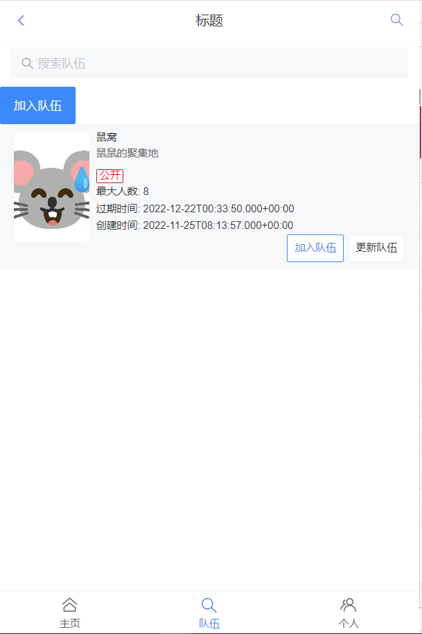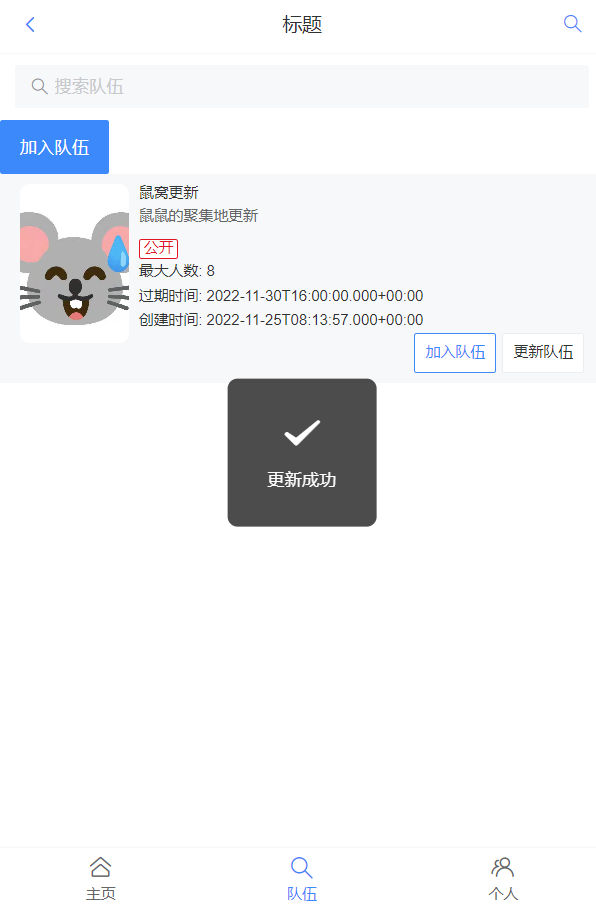


### 3.查看个人已加入队伍


#### (1).编写后端接口


复用 listTeam 方法，只新增查询条件，不做修改（开闭原则）  
获取当前用户已加入的队伍


```java
    /**
     * 获取我创建的队伍
     *
     * @param teamQuery
     * @param request
     * @return
     */
    @GetMapping("/list/my/create")
    public BaseResponse<List<TeamUserVO>> listMyCreateTeams(TeamQuery teamQuery, HttpServletRequest request) {
        if (teamQuery == null) {
            throw new BusinessException(ErrorCode.PARAMS_ERROR);
        }
        User loginUser = userService.getLoginUser(request);
        teamQuery.setUserId(loginUser.getId());
        List<TeamUserVO> teamList = teamService.listTeams(teamQuery, true);
        return ResultUtils.success(teamList);
    }
```


我们查询加入的队伍需要用到id的列表，所以在Teamquery里增加idList字段  
  
获取我加入的队伍


```java
    /**
     * 获取我加入的队伍
     *
     * @param teamQuery
     * @param request
     * @return
     */
    @GetMapping("/list/my/join")
    public BaseResponse<List<TeamUserVO>> listMyJoinTeams(TeamQuery teamQuery, HttpServletRequest request) {
        if (teamQuery == null) {
            throw new BusinessException(ErrorCode.PARAMS_ERROR);
        }
        User loginUser = userService.getLoginUser(request);
        QueryWrapper<UserTeam> queryWrapper = new QueryWrapper<>();
        queryWrapper.eq("userId", loginUser.getId());
        List<UserTeam> userTeamList = userTeamService.list(queryWrapper);
        // 取出不重复的队伍 id
        // teamId userId
        Map<Long, List<UserTeam>> listMap = userTeamList.stream()
                .collect(Collectors.groupingBy(UserTeam::getTeamId));
        List<Long> idList = new ArrayList<>(listMap.keySet());
        teamQuery.setIdList(idList);
        List<TeamUserVO> teamList = teamService.listTeams(teamQuery, true);
        return ResultUtils.success(teamList);
    }
```


修改下listTeam方法，加一层校验  
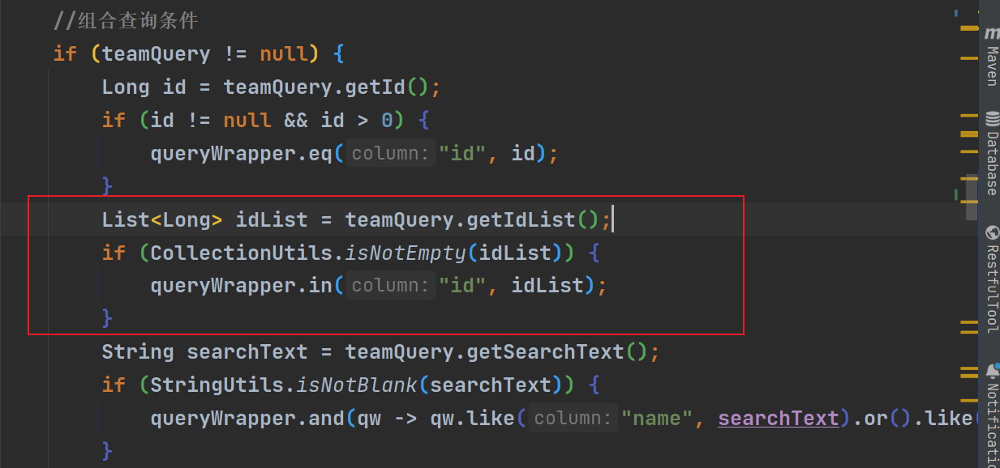


#### (2).后端测试


自行准备下适合测试测数据（原来的数据都是被逻辑删除）  
我这里在数据库里面设置14,24号队伍，其中24的创建者为4,14队伍创建者是550007，4加入了14队伍  
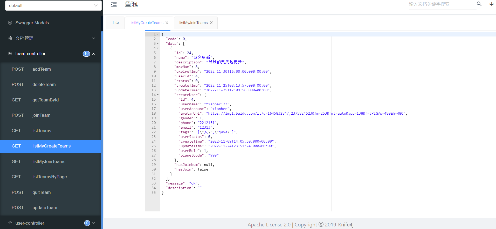


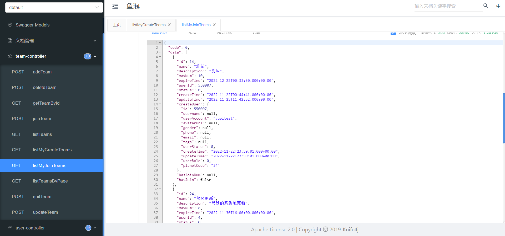


#### (3).创建前端页面


我们复制一份UserPage，命名为UserUpdatePage，修改UserPage（我们只需要当前用户，修改信息，我创建的队伍，我加入的队伍）  
修改UserPage如下：


```vue
<template>
  <template v-if="user">
    <van-cell title="当前用户" :value="user?.username" />
    <van-cell title="修改信息" is-link to="/user/update" />
    <van-cell title="我创建的队伍" is-link to="/user/team/create" />
    <van-cell title="我加入的队伍" is-link to="/user/team/join" />
  </template>
</template>

<script setup lang="ts">
import {useRouter} from "vue-router";
import {onMounted, ref} from "vue";
import myAxios from "../plugins/myAxios.js";
import {Toast} from "vant";
import {getCurrentUser} from "../services/user";

const user = ref();

onMounted(async ()=>{
  user.value=await getCurrentUser();
})

const router = useRouter();

const toEdit = (editKey: string, editName: string, currentValue: string) => {
  router.push({
    path: '/user/edit',
    query: {
      editKey,
      editName,
      currentValue,
    }
  })
}
</script>

<style scoped>

</style>
```


创建页面：查询加入队伍页面和查询创建队伍页面（复制TeamPage页面，形式相同）   PS:别忘了在路由里面添加这两个页面  
因为我们把原来的用户页面改为用户更新页面，路由里也要修改  
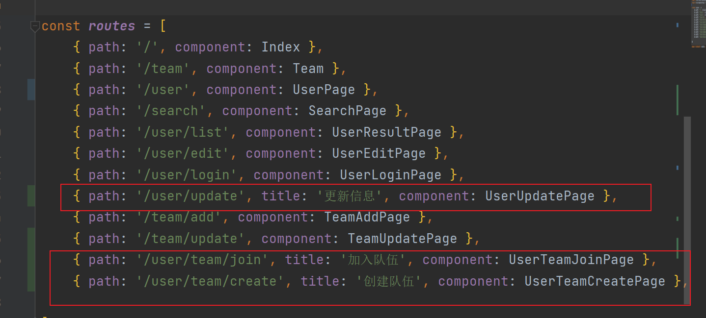


查询加入队伍页面


```vue
<template>
  <div id="teamPage">
    <van-search v-model="searchText" placeholder="搜索队伍" @search="onSearch" />
    <team-card-list :teamList="teamList" />
    <van-empty v-if="teamList?.length < 1" description="数据为空"/>
  </div>
</template>

<script setup lang="ts">

import {useRouter} from "vue-router";
import TeamCardList from "../components/TeamCardList.vue";
import {onMounted, ref} from "vue";
import myAxios from "../plugins/myAxios";
import {Toast} from "vant";

const router = useRouter();
const searchText = ref('');

const teamList = ref([]);

/**
 * 搜索队伍
 * @param val
 * @returns {Promise<void>}
 */
const listTeam = async (val = '') => {
  const res = await myAxios.get("/team/list/my/join", {
    params: {
      searchText: val,
      pageNum: 1,
    },
  });
  if (res?.code === 0) {
    teamList.value = res.data;
  } else {
    Toast.fail('加载队伍失败，请刷新重试');
  }
}


// 页面加载时只触发一次
onMounted( () => {
  listTeam();
})

const onSearch = (val) => {
  listTeam(val);
};

</script>

<style scoped>
#teamPage {

}
</style>
```


查询创建队伍页面


```vue
<template>
  <div id="teamPage">
    <van-search v-model="searchText" placeholder="搜索队伍" @search="onSearch" />
    <van-button type="primary" @click="doJoinTeam">创建队伍</van-button>
    <team-card-list :teamList="teamList" />
    <van-empty v-if="teamList?.length < 1" description="数据为空"/>
  </div>
</template>

<script setup lang="ts">

import {useRouter} from "vue-router";
import TeamCardList from "../components/TeamCardList.vue";
import {onMounted, ref} from "vue";
import myAxios from "../plugins/myAxios";
import {Toast} from "vant";

const router = useRouter();
const searchText = ref('');

// 跳转到加入队伍页
const doJoinTeam = () => {
  router.push({
    path: "/team/add"
  })
}

const teamList = ref([]);

/**
 * 搜索队伍
 * @param val
 * @returns {Promise<void>}
 */
const listTeam = async (val = '') => {
  const res = await myAxios.get("/team/list/my/create", {
    params: {
      searchText: val,
      pageNum: 1,
    },
  });
  if (res?.code === 0) {
    teamList.value = res.data;
  } else {
    Toast.fail('加载队伍失败，请刷新重试');
  }
}

// 页面加载时只触发一次
onMounted( () => {
  listTeam();
})

const onSearch = (val) => {
  listTeam(val);
};

</script>

<style scoped>
#teamPage {

}
</style>
```


#### (4).测试


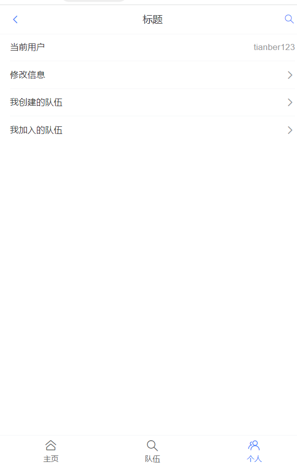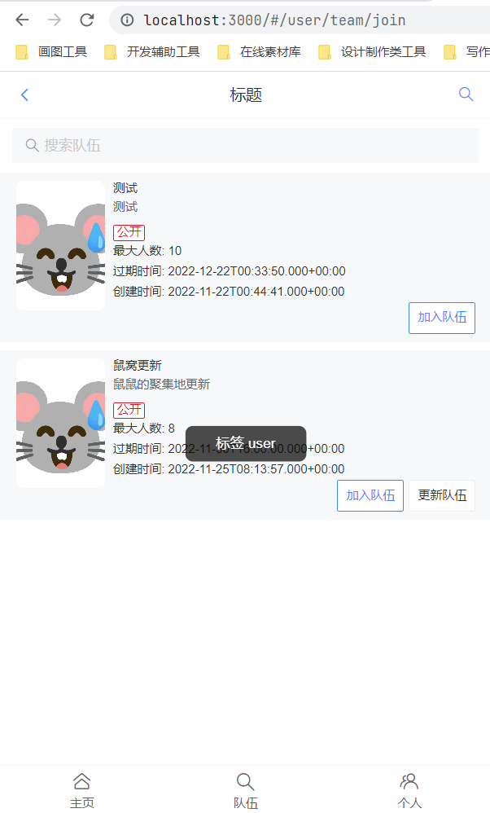


> **PS：这里我觉得是有bug的，发送的请求是不带参数的,即status的默认状态是为null,会被定义成公共的，这样的话，如果我们创建的队伍是私人或者默认的就不会展现（我觉得应该是复用teamList的缘故，在teamLIst的逻辑里，我们不带参数请求就直接查询所有公开的），解决办法是带个status的参数再发送请求。但是我在knife4j里测试了一下，只能传一个状态参数，类型为整型，这代表了我们不能同查询多个状态的队伍，回到前端由于知识浅薄无法解决传参问题，只能显示公开状态的队伍。拉了鱼皮完整的代码（好像也没解决），不知道有无大佬能够解决这个问题！**
>


### 4.退出和解散队伍


#### 1.在TeamCardList添加两个按钮来实现这两个功能


#### 2.在js里写入按钮的方法


```javascript
/**
 * 退出队伍
 * @param id
 */
const doQuitTeam = async (id: number) => {
  const res = await myAxios.post('/team/quit', {
    teamId: id
  });
  if (res?.code === 0) {
    Toast.success('操作成功');
  } else {
    Toast.fail('操作失败' + (res.description ? `，${res.description}` : ''));
  }
}

/**
 * 解散队伍
 * @param id
 */
const doDeleteTeam = async (id: number) => {
  const res = await myAxios.post('/team/delete', {
    id,
  });
  if (res?.code === 0) {
    Toast.success('操作成功');
  } else {
    Toast.fail('操作失败' + (res.description ? `，${res.description}` : ''));
  }
}
```


(4).运行测试  
1.退出队伍（这里我退出了名为测试的队伍）  
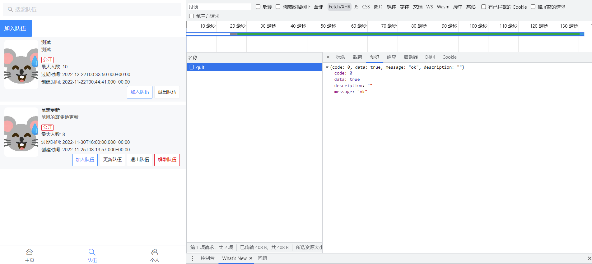  
查看数据库，也成功删除了  
2.解散队伍  
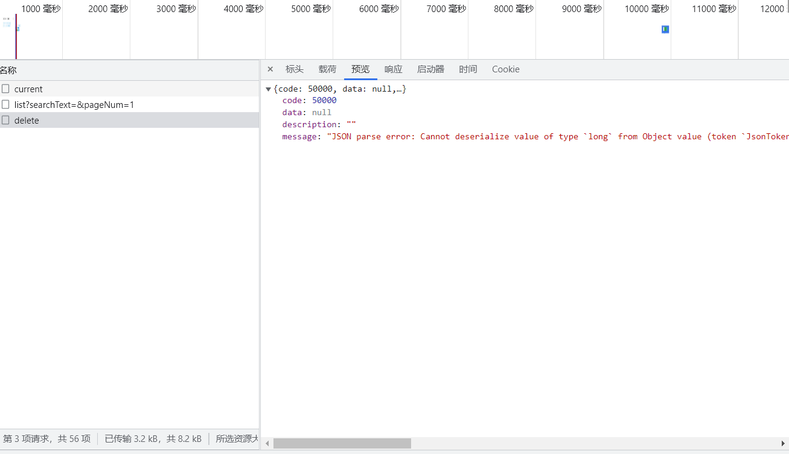  
报错，这是因为我们后端接口没有封装对象（偷懒），所以我们封装一个删除请求DeleteRequest


```java
/**
 * 通用删除请求
 *
 * @author yupi
 */
@Data 
public class DeleteRequest implements Serializable {

    private static final long serialVersionUID = 1787902631969457554L;

    private long id;
}
```


并且修改删除接口


```java
    @PostMapping("/delete")
    public BaseResponse<Boolean> deleteTeam(@RequestBody DeleteRequest deleteRequest, HttpServletRequest request) {
        if (deleteRequest == null || deleteRequest.getId() <= 0) {
            throw new BusinessException(ErrorCode.PARAMS_ERROR);
        }
        long id = deleteRequest.getId();
        User loginUser = userService.getLoginUser(request);
        boolean result = teamService.deleteTeam(id, loginUser);
        if (!result) {
            throw new BusinessException(ErrorCode.SYSTEM_ERROR, "删除失败");
        }
        return ResultUtils.success(true);
    }
```


再次测试（这里我们解散名为鼠窝更新的队伍）  
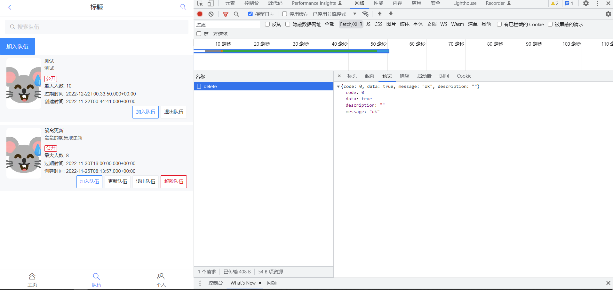


刷新一下（队伍不在被找到）  
  
**功能我们在后端去写，更加方便**


## 二、随机匹配


编辑距离算法：[https://blog.csdn.net/DBC_121/article/details/104198838](https://blog.csdn.net/DBC_121/article/details/104198838)


> 最小编辑距离：字符串 str1 通过最少多少次增删改字符的操作可以变成字符串str2
>


余弦相似度算法：https://blog.csdn.net/m0_55613022/article/details/125683937（如果需要带权重计算，比如学什么方向最重要，性别相对次要）


### 1.匹配用户后端编写


这里我们使用了编辑距离算法  
把这个方法放在工具类（新建一个utils包）里面，并写一个测试类测试  
我们推荐是通过标签类（所以我们传的参数应该是字符型的列表），修改整理为：


```java
/**
* 算法工具类
*
* @author yupi
*/
public class AlgorithmUtils {

/**
* 编辑距离算法（用于计算最相似的两组标签）
*
* @param tagList1
* @param tagList2
* @return
*/
    public static int minDistance(List<String> tagList1, List<String> tagList2) {
        int n = tagList1.size();
        int m = tagList2.size();

        if (n * m == 0) {
            return n + m;
        }

        int[][] d = new int[n + 1][m + 1];
        for (int i = 0; i < n + 1; i++) {
            d[i][0] = i;
        }

        for (int j = 0; j < m + 1; j++) {
            d[0][j] = j;
        }

        for (int i = 1; i < n + 1; i++) {
            for (int j = 1; j < m + 1; j++) {
                int left = d[i - 1][j] + 1;
                int down = d[i][j - 1] + 1;
                int left_down = d[i - 1][j - 1];
                if (!Objects.equals(tagList1.get(i - 1), tagList2.get(j - 1))) {
                    left_down += 1;
                }
                d[i][j] = Math.min(left, Math.min(down, left_down));
            }
        }
        return d[n][m];
    }

/**
* 编辑距离算法（用于计算最相似的两个字符串）
* 原理：https://blog.csdn.net/DBC_121/article/details/104198838
*
* @param word1
* @param word2
* @return
*/
    public static int minDistance(String word1, String word2) {
        int n = word1.length();
        int m = word2.length();

        if (n * m == 0) {
            return n + m;
        }

        int[][] d = new int[n + 1][m + 1];
        for (int i = 0; i < n + 1; i++) {
            d[i][0] = i;
        }

        for (int j = 0; j < m + 1; j++) {
            d[0][j] = j;
        }

        for (int i = 1; i < n + 1; i++) {
            for (int j = 1; j < m + 1; j++) {
                int left = d[i - 1][j] + 1;
                int down = d[i][j - 1] + 1;
                int left_down = d[i - 1][j - 1];
                if (word1.charAt(i - 1) != word2.charAt(j - 1)) {
                    left_down += 1;
                }
                d[i][j] = Math.min(left, Math.min(down, left_down));
            }
        }
        return d[n][m];
    }
}
```


测试方法


```java
/**
* 算法工具类测试
*/
public class AlgorithmUtilsTest {

    @Test
    void test() {
        String str1 = "鱼皮是狗";
        String str2 = "鱼皮不是狗";
        String str3 = "鱼皮是鱼不是狗";
        //        String str4 = "鱼皮是猫";
        // 1
        int score1 = AlgorithmUtils.minDistance(str1, str2);
        // 3
        int score2 = AlgorithmUtils.minDistance(str1, str3);
        System.out.println(score1);
        System.out.println(score2);
    }

    @Test
    void testCompareTags() {
        List<String> tagList1 = Arrays.asList("Java", "大一", "男");
        List<String> tagList2 = Arrays.asList("Java", "大一", "女");
        List<String> tagList3 = Arrays.asList("Python", "大二", "女");
        // 1
        int score1 = AlgorithmUtils.minDistance(tagList1, tagList2);
        // 3
        int score2 = AlgorithmUtils.minDistance(tagList1, tagList3);
        System.out.println(score1);
        System.out.println(score2);
    }
}
```


在UserCOntroller里写入获取最匹配的用户的接口


```java
    /**
     * 获取最匹配的用户
     *
     * @param num
     * @param request
     * @return
     */
    @GetMapping("/match")
    public BaseResponse<List<User>> matchUsers(long num, HttpServletRequest request) {
        if (num <= 0 || num > 20) {
            throw new BusinessException(ErrorCode.PARAMS_ERROR);
        }
        User user = userService.getLoginUser(request);
        return ResultUtils.success(userService.matchUsers(num, user));
    }
```


在USerService里写入matchUsers方法并实现  


具体的实现方法本期直播并未完美的完成（遗留bug），所以结合13期的内容，修复了排序的问题  
下面就是具体的代码:  (这里由于鱼皮踩坑过多，同时自己也没有完全理解，过程就省略)


```java
 @Override
    public List<User> matchUsers(long num, User loginUser) {
        QueryWrapper<User> queryWrapper = new QueryWrapper<>();
        queryWrapper.select("id", "tags");
        queryWrapper.isNotNull("tags");
        List<User> userList = this.list(queryWrapper);
        String tags = loginUser.getTags();
        Gson gson = new Gson();
        List<String> tagList = gson.fromJson(tags, new TypeToken<List<String>>() {
        }.getType());
        // 用户列表的下标 => 相似度
        List<Pair<User, Long>> list = new ArrayList<>();
        // 依次计算所有用户和当前用户的相似度
        for (int i = 0; i < userList.size(); i++) {
            User user = userList.get(i);
            String userTags = user.getTags();
            // 无标签或者为当前用户自己
            if (StringUtils.isBlank(userTags) || user.getId() == loginUser.getId()) {
                continue;
            }
            List<String> userTagList = gson.fromJson(userTags, new TypeToken<List<String>>() {
            }.getType());
            // 计算分数
            long distance = AlgorithmUtils.minDistance(tagList, userTagList);
            list.add(new Pair<>(user, distance));
        }
        // 按编辑距离由小到大排序
        List<Pair<User, Long>> topUserPairList = list.stream()
                .sorted((a, b) -> (int) (a.getValue() - b.getValue()))
                .limit(num)
                .collect(Collectors.toList());
        // 原本顺序的 userId 列表
        List<Long> userIdList = topUserPairList.stream().map(pair -> pair.getKey().getId()).collect(Collectors.toList());
        QueryWrapper<User> userQueryWrapper = new QueryWrapper<>();
        userQueryWrapper.in("id", userIdList);
        // 1, 3, 2
        // User1、User2、User3
        // 1 => User1, 2 => User2, 3 => User3
        Map<Long, List<User>> userIdUserListMap = this.list(userQueryWrapper)
                .stream()
                .map(user -> getSafetyUser(user))
                .collect(Collectors.groupingBy(User::getId));
        List<User> finalUserList = new ArrayList<>();
        for (Long userId : userIdList) {
            finalUserList.add(userIdUserListMap.get(userId).get(0));
        }
        return finalUserList;
    }
```


### 2.测试


在数据库里插入标签假数据  
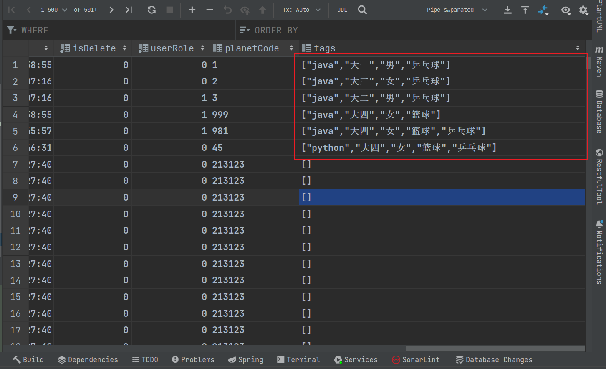


根据最小编辑距离算法，结果排序（排除自己)应该是id：32456  
启动后端，在knife4j接口文档里测试matchUsers，正确用户排序也是32456


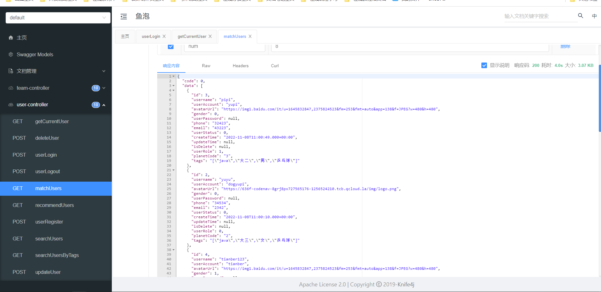


> 踩坑处：  
1.一定要把redis的缓存清除**，重新登录，再matchUsers，否则推荐的用户不是通过最小编辑距离算法获得的**  
2.我这里好像又有bug如下处
>


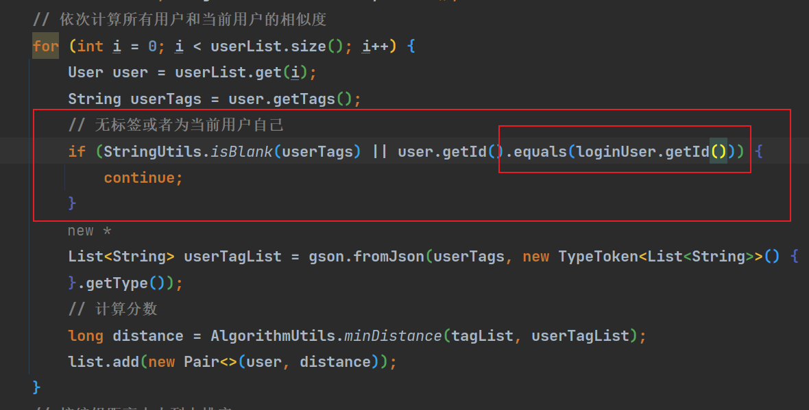


> 这里鱼皮使用，我使用会依旧查到自己，debug发现值也是相同的，考虑到上次的踩坑处，应该是对象类型的问题，换成equals可行（球友们可自行根据情况编写代码)
>


## 第十三期完结🎉🎉🎉🎉🎉🎉🎉🎉🎉🎉🎉🎉


> 更新: 2023-02-10 10:07:15  
> 原文: <https://www.yuque.com/shierkcs/catstudy/fduqxhca7lntax7f>