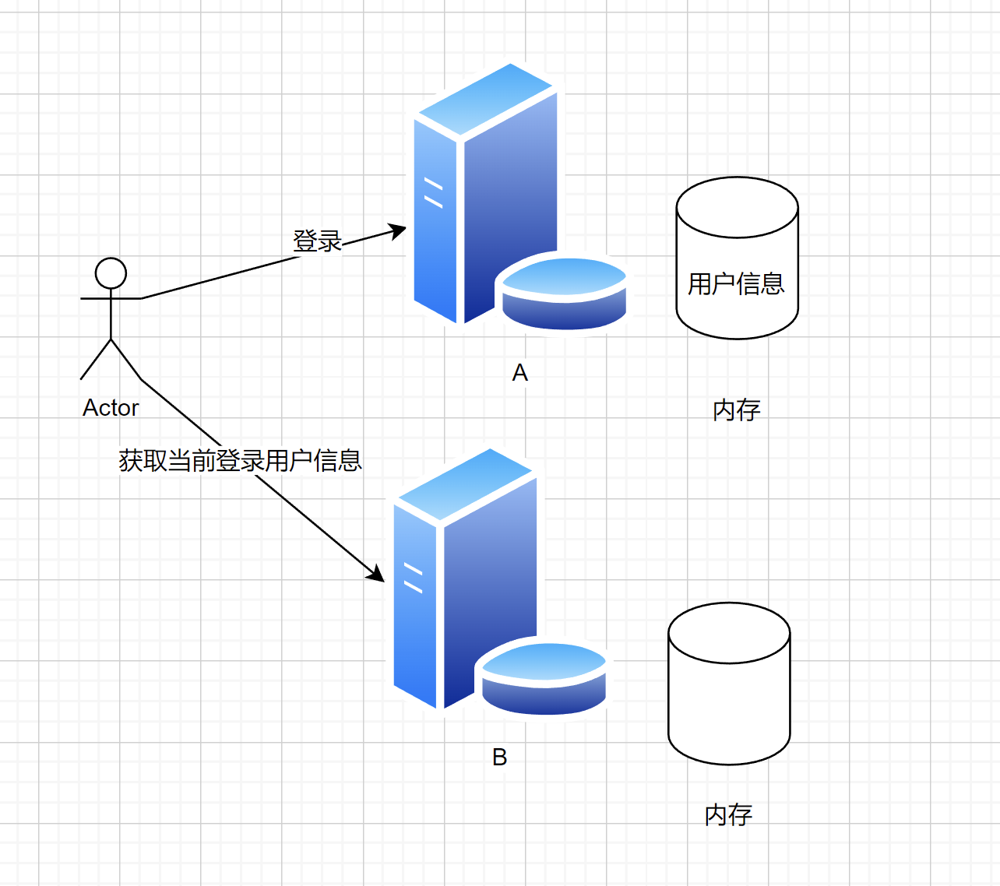

# 伙伴匹配系统重要知识点总结


> 下面的是我在项目中根据鱼皮说的重要知识点做一些总结：主要总结的是后端
>


# 后端
## 1. 分布式 Session 登录
### 问题引入
种 session 的时候注意范围，cookie.domain


比如我现在有一下两个域名：  
A.com

B.com

如果我的cookie是在了A.com 上，如果B.com想访问A.com种的cookie能不能访问得到？

> cookie：就是前端用来存储一部分数据，通过Path就能向后台发送请求。
>


+ 答案：不能访问到的
+ 因为我们的cookie种在的A.com 的域名上，即使B.com通过前台发送请求给后台，因为B.com向后台发送请求时是不会待上A.com这个cookie的。


如果要共享 cookie，可以种一个更高层的公共域名，比如 shier.com   ，那么在子层的域名就能共享到cookie，A.com和B.com这两个域名就能具有同一个cookie


### 那么问题来了：为什么服务器 A 登录后，请求发到服务器 B，不认识该用户？


用户在 A 登录，所以 session（用户登录信息）存在了 A 上。


当用户去请求 B服务器时，B服务器种并没有存储到改用户信息，所以不认识。  



#### 解决方案：实现共享存储


用户a登录之后，在a服务器登陆之后，往这个地方写入用户信息，然后用户B他就去读这个用户信息，这样就能访问到同一个存储内容


就是将用户的信息存储到一个公共的服务器内存中，不要将信息存储到单台服务器的内存中


### 如何共享数据存储？实现方式：


1. Redis（基于内存的 K / V 数据库） 
    - 因为用户信息读取 / 是否登录的判断极其 **频繁** ，Redis 基于内存，读写性能很高，简单的数据单机 qps 5w - 10w
    - QPS：意思是每秒查询率。指一台服务器每秒能够响应的查询次数，用于衡量特定的查询服务器在规定时间内所处理流量多少，主要针对专门用于查询的服务器的性能指标
2. MySQL
3. 文件服务器 ceph


### Redis 实现 Session 共享


官网：[https://redis.io/](https://redis.io/)


Redis 5.0.14 下载：


链接：[https://pan.baidu.com/s/1XcsAIrdeesQAyQU2lE3cOg](https://pan.baidu.com/s/1XcsAIrdeesQAyQU2lE3cOg)


提取码：vkoi


redis 管理工具 quick redis：[https://quick123.net/](https://quick123.net/)


1. 引入 redis，能够操作 redis：


```xml
<!-- https://mvnrepository.com/artifact/org.springframework.boot/spring-boot-starter-data-redis -->
<dependency>
    <groupId>org.springframework.boot</groupId>
    <artifactId>spring-boot-starter-data-redis</artifactId>
    <version>2.6.4</version>
</dependency>
```


2. 引入 spring-session 和 redis 的整合，使得自动将 session 存储到 redis 中：


```xml
<!-- https://mvnrepository.com/artifact/org.springframework.session/spring-session-data-redis -->
<dependency>
    <groupId>org.springframework.session</groupId>
    <artifactId>spring-session-data-redis</artifactId>
    <version>2.6.3</version>
</dependency>
```


3. 修改 spring-session 存储配置 `spring.session.store-type`


+  默认是 none，表示存储在单台服务器 
+  store-type: redis，表示从 redis 读写 session 

```yaml
# session 失效时间
session:
  timeout: 86400
  store-type: redis
```

 


JWT也能实现Session共享数据，但是存在缺点：[https://zhuanlan.zhihu.com/p/108999941](https://zhuanlan.zhihu.com/p/108999941)


## 2. 分布式锁（基于 redisson）


[分布式锁介绍](https://blog.csdn.net/m0_67645544/article/details/124768505)

单机锁：用于**一台**服务器的同步执行

分布式锁：用于**多台**服务器之间的同步执行

### 2.1锁介绍
有限资源的情况下，控制同一时间（段）只有某些线程（用户 / 服务器）能访问到资源。  
Java 实现锁：synchronized 关键字、并发包的类  
Java synchronized 实现锁存在问题：只对单个 JVM 有效


### 2.2 什么是分布式锁
分布式锁，即[分布式系统](https://so.csdn.net/so/search?q=%E5%88%86%E5%B8%83%E5%BC%8F%E7%B3%BB%E7%BB%9F&spm=1001.2101.3001.7020)中的锁。

在单体应用中我们通过锁解决的是**控制共享资源访问**的问题，而分布式锁，就是解决了**分布式系统中控制共享资源访问**的问题。与单体应用不同的是，分布式系统中竞争共享资源的最小粒度从线程升级成了进程。


### 2.3 为什么需要分布式锁🌟🌟🌟（面试考点）


1. 有限资源的情况下，控制同一时间（段）只有某些线程（用户 / 服务器）能访问到资源。
2. 单个锁只对单个 JVM 有效
3. 在分布式系统环境下，一个方法在同一时间只能被一个机器的一个线程执行
4. 高可用的获取锁与释放锁
5. 高性能的获取锁与释放锁
6. 具备可重入特性（可理解为重新进入，由多于一个任务并发使用，而不必担心数据错误）
7. 具备锁失效机制，即自动解锁，防止死锁
8. 具备非阻塞锁特性，即没有获取到锁将直接返回获取锁失败


### 2.4 分布式锁实现
怎么保证同一时间只有 1 个服务器能抢到锁？

**核心思想** 就是：先来的人先把数据改成自己的标识（服务器 ip），后来的人发现标识已存在，就抢锁失败，继续等待。等先来的人执行方法结束，把标识清空，其他的人继续抢锁。


#### 实现方式
[三种实现方式](https://mp.weixin.qq.com/s?__biz=MzU0OTE4MzYzMw==&mid=2247534770&idx=3&sn=397788f05d0a664495e23959701ab703&chksm=fbb1c14cccc6485aeed1311213f7c06ddb4d15073e8d0c638ea423ea68954fd4c703afb8023e&scene=27)

1. MySQL 数据库：select for update 行级锁（最简单）
2. ✔ Redis 实现：内存数据库，**读写速度快** 。支持 **setnx**、lua 脚本，比较方便我们实现分布式锁。
3. setnx：set if not exists 如果不存在，则设置；只有设置成功才会返回 true，否则返回 false


### 2.4 分布式锁注意事项
1.  用完锁要释放（不能占着茅坑不拉屎） 
2.  **锁一定要加过期时间 ** 
3.  如果方法执行时间过长，锁提前过期了，问题： 
    1. 连锁效应：释放掉别人的锁
    2. 这样还是会存在多个方法同时执行的情况

解决方案：续期 


```plain
boolean end = false;
new Thread(() -> {
    if (!end)}{
    续期
})
end = true;
```


4.  释放锁的时候，有可能先判断出是自己的锁，但这时锁过期了，最后还是释放了别人的锁 
5.  Redis 如果是集群（而不是只有一个 Redis），如果分布式锁的数据不同步怎么办？ 


```plain
// 原子操作
if(get lock == A) {
    // set lock B
    del lock
}
```


#### 看门狗机制


> redisson 中提供的续期机制
>


开一个监听线程，如果方法还没执行完，就帮你重置 redis 锁的过期时间。


原理：


1. 监听当前线程，默认过期时间是 30 秒，每 10 秒续期一次（补到 30 秒）
2. 如果线程挂掉（注意 debug 模式也会被它当成服务器宕机），则不会续期


### 2.5 Redisson 实现分布式锁
Redisson-具有内存数据网格功能的Redis Java客户端。超过50个基于Redis的Java对象和服务：Set、Multimap、SortedSet、Map、List、Queue、Deque、Semaphore、Lock、AtomicLong、MapReduce、Publish/Subscribe、Bloom filter、Spring Cache、Tomcat、Scheduler、JCache API、Hibernate、MyBatis、RPC、本地缓存。。。


Redisson 是一个 java 操作 Redis 的客户端，**提供了大量的分布式数据集来简化对 Redis 的操作和使用，可以让开发者像使用本地集合一样使用 Redis，完全感知不到 Redis 的存在。**


### 伙伴匹配系统中的分布式锁实现过程


1.  引入依赖 

```xml
<dependency>
    <groupId>org.redisson</groupId>
    <artifactId>redisson</artifactId>
    <version>3.19.1</version>
</dependency>
```

 

2.  配置 

```yaml
# redis 配置
spring:
  redis:
    port: 6379
    host: localhost
    database: 1
```

 

3.  RedisConfig类型 

```java
import lombok.Data;
import org.redisson.Redisson;
import org.redisson.api.RedissonClient;
import org.redisson.config.Config;
import org.springframework.boot.context.properties.ConfigurationProperties;
import org.springframework.context.annotation.Bean;
import org.springframework.context.annotation.Configuration;

/**
 * redisson 配置类
 * @author daqi
 * @date 2023/1/22
 */
@Configuration
@ConfigurationProperties("spring.redis")
@Data
public class RedissonConfig {

    private String host;

    private String port; 
    @Bean
    public RedissonClient redissonClient() {
        // 1. Create config object
        Config config = new Config();
        String redisAddress = String.format("redis://%s:%s",host,port);
        config.useSingleServer().setAddress(redisAddress).setDatabase(3);
        RedissonClient redissonClient = Redisson.create(config);
        return redissonClient;

    }
}
```

 

4.  使用 

```java
// 项目：类：方法：锁
RLock lock = redissonClient.getLock("yupao:precachejob:doCache:lock");
try {
    // tryLock （最长取锁时间，超时 false；过期时间，执行时间超过过期时间，锁将释放；时间单位）
    // 过期时间使用 -1 可以续期；第一个参数是人走了，下个人进来的时间，0 表示只执行一次
    if(lock.tryLock(0,-1,TimeUnit.MILLISECONDS)){
        System.out.println("currentLock:" + Thread.currentThread().getId());
        // 例子 --------------
        for (Long userId : userIds) {
                    ValueOperations<String, Object> redisOps = redisTemplate.opsForValue();
                    String redisKey = String.format("yupao:user:recommend:%s",userId);
                    QueryWrapper<User> queryWrapper = new QueryWrapper<>();
                    Page<User> userPage = userService.page(new Page<>(1, 20), queryWrapper)
       
            // 存入缓存
            try {
                redisOps.set(redisKey,userPage,1, TimeUnit.MINUTES);
            } catch (Exception e) {
                log.error("redis set key error",e);
            }
        }
    }
    // 要加锁的逻辑代码 -----------------
} catch (InterruptedException e) {
    log.error("PreCacheJob error",e);
} finally {
    if (lock.isHeldByCurrentThread()) {
        System.out.println("unlock:" + Thread.currentThread().getId());
        lock.unlock();
    }
}
```

 


## 3. 缓存（Redis实现）


### 3.1 为什么要用缓存
用户数量很大，导致数据查询慢，导致页面加载的时间过长

### 3.2 缓存的实现


1. Redis：分布式缓存
2. memcached：分布式
3. Etcd：云原生架构的一个分布式存储，**存储配置**，扩容能力
4. ehcache：单机
5. 本地缓存：Java 内存 Map
6. Caffeine：Java 内存缓存，高性能
7. Google Guava


单机缓存存在的问题：


1. 得到的数据不一致
2. 获取不到资源


分布式缓存：


1. 用户访问不同的服务器能获得到相同的资源数据
2. 也就是在一个公共的服务器上存储数据，其他的服务器都讲数据读写在这个服务器上


### 3.3 什么是Redis缓存


1. NoSQL 数据库
2. key - value 存储系统（区别于 MySQL，他存储的是键值对） 
    - 不是存那种表格之类的数据，不像数据库存储一行一行的数据，而是存储键值对的数据

### 3.4 Redis数据结构🌟🌟🌟（面试高频考点）
> 存储键值对
>


基本数据结构


1. String 字符串类型： name: "shier"
2. List 列表：names: ["shier", "xiaoshier", "shier1"]：长度动态的、可变的 数组的是固定的
3. Set 集合：names: ["shier", "dogshier"]： 值不能重复
4. Hash 哈希：nameAge: { "shier": 1, "dogshier": 2 }
5. Zset 集合：names: { shier- 9, dogshier - 12 }（适合做排行榜）Zset的值会一个关联分数


高级数据结构


1. bloomfilter：布隆过滤器，主要从大量的数据中快速过滤值，比如邮件黑名单拦截
2. geo：计算地理位置
3. hyperloglog：pv / uv
4. pub / sub：发布订阅，类似消息队列
5. BitMap ：1001010101010101010101010101 二进制数据


### 3.5Java里Redis的实现方式
#### Spring Data Redis（推荐）
Spring Data：通用的数据访问框架，定义了一组 **增删改查** 的接口

#### Jedis
独立于 Spring 操作 Redis 的 Java 客户端  
要配合 Jedis Pool 使用

#### Lettuce
**高阶** 的操作 Redis 的 Java 客户端  
异步、连接池

#### Redisson
分布式操作 Redis 的 Java 客户端，让你像在使用本地的集合一样操作 Redis（分布式 Redis 数据网格）

#### JetCache
实现方式对比

1. 如果你用的是 Spring，并且没有过多的定制化要求，可以用 Spring Data Redis，最方便
2. 如果你用的不是 SPring，并且追求简单，并且没有过高的性能要求，可以用 Jedis + Jedis Pool
3. 如果你的项目不是 Spring，并且追求高性能、高定制化，可以用 Lettuce，支持异步、连接池
4. 如果你的项目是分布式的，需要用到一些分布式的特性（比如分布式锁、分布式集合），推荐用 redisson


### 3.6 实现定时预热缓存
#### 什么是热缓存


+ 数据量大时，可以提前将数据提前写入缓存，提高第一次访问的数据
+ 解决第一次访问时间过长，太长时间加载不出来页面，但是后面的访问页面就不会存在访问页面时间过长
+ 提前将相关的缓存数据直接加载到缓存系统。避免在用户请求的时候，先查询数据库，然后再将数据缓存的问题！用户直接查询事先被预热的缓存数据！

#### 什么时候用缓存预热
1. 第一次访问时间比较长，但是后面的访问时间就很快一点。
2. 第一次进入系统的加载时间过长

#### 缓存预热带来的问题
1. 增加开发成本（你要额外的开发、设计）
2. 预热的时机和时间如果错了，有可能你缓存的数据不对或者太老
3. 需要占用额外空间

#### 怎么实现缓存预热
1. 直接写个缓存刷新页面，上线时手工操作下。
2. 数据量不大，可以在项目启动的时候自动进行加载。
3. 定时任务，定时刷新缓存

#### 预热缓存的注意点
1. 缓存预热的意义（新增少、总用户多）
2. 缓存的空间不能太大，要预留给其他缓存空间
3. 缓存数据的周期（此处每天一次）


#### 缓存预热 - 定时任务
1. 在启动类上加注解


```java
@EnableScheduling
public class UserCenterApplication {
    public static void main(String[] args) {
        SpringApplication.run(UserCenterApplication.class, args);
    }
}
```


2.  在方法上添加注解 

```java
// cron 秒 分 时 日 月 年（每天这一刻执行）
@Scheduled(cron = "0 26 22 * * *")
public void doPreCacheRecommendUser() {}
```

 


### 伙伴匹配系统项目中Redis使用说明


> 使用 spring-boot-starter-data-redis 操作 redis
>


1. 引入依赖


```xml

<!-- https://mvnrepository.com/artifact/org.springframework.boot/spring-boot-starter-data-redis -->
<dependency>
    <groupId>org.springframework.boot</groupId>
    <artifactId>spring-boot-starter-data-redis</artifactId>
    <version>2.6.4</version>
</dependency>
```


2.  使用 

```java
// 存值
redisTemplate.opsForValue().set("yupiInt",1);
// 取值
String yupiString = (String) redisTemplate.opsForValue().get("yupiString");
```

 

3.  其他配置（使支持 RedisTemplate<String,Object>） 

```java
import org.springframework.context.annotation.Bean;
import org.springframework.context.annotation.Configuration;
import org.springframework.data.redis.connection.RedisConnectionFactory;
import org.springframework.data.redis.core.RedisTemplate;
import org.springframework.data.redis.serializer.RedisSerializer;

@Configuration
public class RedisTemplateConfig {

    @Bean
    public RedisTemplate<String,Object> redisTemplate(RedisConnectionFactory redisConnectionFactory) {
        RedisTemplate<String, Object> redisTemplate = new RedisTemplate<>();
        redisTemplate.setConnectionFactory(redisConnectionFactory);
        redisTemplate.setKeySerializer(RedisSerializer.string());
        return redisTemplate;
    }
}
```

 


> 使用 spring-session-data-redis **自动同步** session 数据到 redis 中，实现 **session 共享**
>


1. 依赖


```xml
<!-- https://mvnrepository.com/artifact/org.springframework.session/spring-session-data-redis -->
<dependency>
    <groupId>org.springframework.session</groupId>
    <artifactId>spring-session-data-redis</artifactId>
    <version>2.6.3</version>
</dependency>
```


2.  配置 

```yaml
spring:
  # session 配置，过期时间（分钟）
  session:
    timeout: 86400
    store-type: redis
```

 

3.  使用 

```java
request.getSession().setAttribute(USER_LOGIN_STATE, safetyUser);
```

 


## 4. Swagger + knife4j 接口文档
> 个人感觉还是Knife4j接口文档看起来更加清晰一点，看起来舒服一点，和postmant差不多，功能不同
>

### 4.1 接口文档介绍：
#### 什么是接口文档
写接口信息的文档，其中每条接口包括一下的参数信息：

+ 请求参数
+ 响应参数 
    - 错误码
+ 接口地址
+ 接口名称
+ 请求类型
+ 请求格式
+ 备注等等


> 一般是后端或者负责人来提供，后端和前端都要使用
>


#### 为什么需要接口文档？


+ 有个书面内容（背书或者归档），便于大家参考和查阅，便于 **沉淀和维护** ，拒绝口口相传
+ 接口文档便于前端和后端开发对接，前后端联调的 **介质** 。后端 => 接口文档 <= 前端
+ 好的接口文档支持在线调试、在线测试，可以作为工具提高我们的开发测试效率

#### 怎么做接口文档？
+ 手写（比如腾讯文档、Markdown 笔记）
+ 自动化接口文档生成：自动根据项目代码生成完整的文档或在线调试的网页。Swagger，Postman（侧重接口管理）（国外）；apifox、apipost、eolink（国产）

#### 接口文档有哪些技巧？
Swagger 原理：


1. 引入依赖（Swagger 或 Knife4j：https://doc.xiaominfo.com/knife4j/documentation/get_start.html）
2. 自定义 Swagger 配置类
3. 定义需要生成接口文档的代码位置（Controller）
4. 千万注意：线上环境不要把接口暴露出去！！！可以通过在 SwaggerConfig 配置文件开头加上 `@Profile({"dev", "test"})` 限定配置仅在部分环境开启
5. 启动即可
6. 可以通过在 controller 方法上添加 [@Api、@ApiImplicitParam(name ](/Api、@ApiImplicitParam(name ) = "name",value = "姓名",required = true)    [@ApiOperation(value ](/ApiOperation(value ) = "向客人问好") 等注解来自定义生成的接口描述信息 


### 实现步骤


1.  依赖 

```xml
<dependency>
    <groupId>com.github.xiaoymin</groupId>
    <artifactId>knife4j-openapi2-spring-boot-starter</artifactId>
    <version>4.0.0</version>
</dependency>
```

 

2.  通过application进行配置  
预览：http://localhost:8080/api/doc.html（例子中端口要更改，/api/ 是项目中加的路径） 

```yaml
knife4j:
  enable: true
  # 开启生产环境屏蔽
#  production: true
  openapi:
    title: 鱼皮用户中心管理
    description: 用户中心
    # aaa"
    email: xiaoymin@foxmail.com
    concat: 八一菜刀
    url: https://cymgc.top
    version: v4.0
    license: Apache 2.0
    license-url: https://stackoverflow.com/
    terms-of-service-url: https://stackoverflow.com/
    group:
      test1:
        group-name: 用户中心 api
        api-rule: package
        api-rule-resources:
          - com.yupi.usercenter.controller
```

3.  通过Java写Config类来实现（第二和第三有一种即可） 

```java
package com.shier.partner.config;

import org.springframework.context.annotation.Bean;
import org.springframework.context.annotation.Configuration;
import org.springframework.context.annotation.Profile;
import springfox.documentation.builders.ApiInfoBuilder;
import springfox.documentation.builders.PathSelectors;
import springfox.documentation.builders.RequestHandlerSelectors;
import springfox.documentation.service.ApiInfo;
import springfox.documentation.service.Contact;
import springfox.documentation.spi.DocumentationType;
import springfox.documentation.spring.web.plugins.Docket;
import springfox.documentation.swagger2.annotations.EnableSwagger2WebMvc;

/**
 * @author Shier
 * @date 2023/02/02
 * 自定义 Swagger 接口文档的配置
 */

@Configuration
@EnableSwagger2WebMvc
@Profile({"dev", "test"})   //版本控制访问
public class SwaggerConfig {

    @Bean(value = "defaultApi2")
    public Docket defaultApi2() {
        return new Docket(DocumentationType.SWAGGER_2)
                .apiInfo(apiInfo())
                .select()
                // 这里一定要标注你控制器的位置
                .apis(RequestHandlerSelectors.basePackage("com.shier.partner.controller"))
                .paths(PathSelectors.any())
                .build();
    }

    /**
     * api 信息
     * @return
     */
    private ApiInfo apiInfo() {
        return new ApiInfoBuilder()
                .title("用户中心-伙伴匹配系统") // 接口文档的标题
                .description("用户中心接口文档-伙伴匹配系统") // 接口文档的描述信息
                .termsOfServiceUrl("https://github.com/kongshier") // 提供服务的是谁？可以填写你自己的地址因为是你自己提供的服务
                .contact(new Contact("shier", "https://blog.csdn.net/qq_56098191?spm=1000.2115.3001.5343", "2927527234@qq.com"))
                .version("1.0") // 版本
                .build(); // 构建
    }
}
```


## 5. Json 序列化 （Gson）
解析 JSON 字符串：

+  序列化：java对象转成 json 
+  反序列化：把 json 转为 java 对象 


Javajson 序列化库有很多：


1.  **gson**（google 的） 
2.  fastjson alibaba（ali 出品，快，但是漏洞太多） 
3.  jackson 
4.  kryo 


```java
Gson gson = new Gson();
int[] ints = {1, 2, 3, 4, 5};
String[] strings = {"abc", "def", "ghi"};

// 序列化后
gson.toJson(ints);     //  [1,2,3,4,5]
gson.toJson(strings);  //  ["abc", "def", "ghi"]
```


1.  依赖 

```xml
<!-- https://mvnrepository.com/artifact/com.google.code.gson/gson -->
<dependency>
    <groupId>com.google.code.gson</groupId>
    <artifactId>gson</artifactId>
    <version>2.9.0</version>
</dependency>
```

 

2.  使用 

```java
Gson gson = new Gson();
// 3. 标签列表转为 java 对象，遍历用户传过来的标签名字，判断是否包含在标签列表中
Set<String> tempTagSet = gson.fromJson(tagJsonStr, new TypeToken<Set<String>>() {
}.getType());
tempTagSet = Optional.ofNullable(tempTagSet).orElse(new HashSet<>())
```

 

## 6. 跨域问题
> 一般是在后端解决跨域问题好一点
>
>  
>
> + JSONP
> + CORS
>


### 6.1 前端解决跨域
详情看文档https://blog.csdn.net/qq_56098191/article/details/128473269?spm=1001.2014.3001.5501

### 6.2 后端解决跨域


在控制器（Controller）类上添加 [@CrossOrigin ](/CrossOrigin ) 注解，并允许 cookie 传递 


```java
@RestController
@RequestMapping("/user")
@CrossOrigin(origins = {"http://localhost:3000"},allowCredentials = "true")
public class UserController {}
```


## 9. 编辑距离算法
编辑距离算法代码，可以判断与目标最相似的值，返回需要通过增删改操作后变成目标值的最小步骤


> 最小编辑距离：字符串1 通过最少多少次增删改字符的操作可以变成 字符串2
>
>  
>
> 1. ["Java","男","大一","篮球"]
> 2. ["Python","女","大四","足球","跑步"]	5次
> 3. ["Java","女","大三","乒乓球"]   3次
> 4. ["Java","男","大二","乒乓球"]  2次
> 5. ["Python","女","大四","乒乓球"]  4次
> 6. ["Java","男","大二","篮球"] 1次
>
>  
>
> 在第一条改变到其他五条（不包括第一条），改变次数最小的在前面，最后的顺序(序号排序)是：6=>4=>3=>5=>2
>
>  
>
> 操作次数越小，越靠近。
>


```java
import java.util.List;
import java.util.Objects;

/**
 * @author daqi
 * @date 2023/1/25
 */
public class AlgorithmUtils {

    public static int minDistance(List<String> tagList1, List<String> tagList2){
        int n = tagList1.size();
        int m = tagList2.size();

        if(n * m == 0)
            return n + m;

        int[][] d = new int[n + 1][m + 1];
        for (int i = 0; i < n + 1; i++){
            d[i][0] = i;
        }

        for (int j = 0; j < m + 1; j++){
            d[0][j] = j;
        }

        for (int i = 1; i < n + 1; i++){
            for (int j = 1; j < m + 1; j++){
                int left = d[i - 1][j] + 1;
                int down = d[i][j - 1] + 1;
                int left_down = d[i - 1][j - 1];
                if (!Objects.equals(tagList1.get(i - 1), tagList2.get(j - 1)))
                    left_down += 1;
                d[i][j] = Math.min(left, Math.min(down, left_down));
            }
        }
        return d[n][m];
    }

    /**
     * 编辑算法，判断相似字符串
     * @param word1
     * @param word2
     * @return
     */
    public static int minDistance(String word1, String word2){
        int n = word1.length();
        int m = word2.length();

        if(n * m == 0)
            return n + m;

        int[][] d = new int[n + 1][m + 1];
        for (int i = 0; i < n + 1; i++){
            d[i][0] = i;
        }

        for (int j = 0; j < m + 1; j++){
            d[0][j] = j;
        }

        for (int i = 1; i < n + 1; i++){
            for (int j = 1; j < m + 1; j++){
                int left = d[i - 1][j] + 1;
                int down = d[i][j - 1] + 1;
                int left_down = d[i - 1][j - 1];
                if (word1.charAt(i - 1) != word2.charAt(j - 1))
                    left_down += 1;
                d[i][j] = Math.min(left, Math.min(down, left_down));
            }
        }
        return d[n][m];
    }
}
```


## 10. 事务
在方法上添加注解 @Transactional，rollbackFor 为发生指定的异常就回滚

```java
@Transactional(rollbackFor = Exception.class)
public long addTeam(Team team, User userLogin) {}
```

# 前端
Vant组件库： [https://vant-contrib.gitee.io/vant/#/zh-CN/home](https://vant-contrib.gitee.io/vant/#/zh-CN/home)

Vite打包工具：[https://cn.vitejs.dev/](https://cn.vitejs.dev/)

## 1. 写 css 代码
可以在浏览器使用开发者模式（F12）写样式，然后粘贴到代码中

## 2. 路由
1. router：负责转发路由，页面之间的跳转
2. route：负责获取路由传递的数据，页面之间的数据

## 3. 开启携带 cookie
myAxios 是对 axios 的自定义封装

```javascript
// 设置超时时间
myAxios.defaults.timeout = 50000
// 开启携带 cookie
myAxios.defaults.withCredentials = true
```

## 4. 部署
### 前端部署
Vercel（免费）

[https://vercel.com/](https://vercel.com/)

### 后端部署
微信云托管（部署容器的平台，付费）

[https://cloud.weixin.qq.com/cloudrun/service](https://cloud.weixin.qq.com/cloudrun/service)

（免备案！！！）


> 更新: 2023-02-10 09:29:42  
> 原文: <https://www.yuque.com/shierkcs/catstudy/rg6bx2u8nxkr1ts5>