# 01 项目介绍+前后端初始化

直播回放：[从 0 到 1 开发找伙伴系统（1）](https://t.zsxq.com/03EAIU7mQ)（项目介绍和前后端初始化）

## 鱼皮的笔记

介绍：帮助大家找到志同道合的伙伴，移动端 H5 网页（尽量兼容 PC 端）


### 需求分析


1. 用户去添加标签，标签的分类（要有哪些标签、怎么把标签进行分类）学习方向 java / c++，工作 / 大学
2. 主动搜索：允许用户根据标签去搜索其他用户 
   1. Redis 缓存
3. 组队 
   1. 创建队伍
   2. 加入队伍
   3. 根据标签查询队伍
   4. 邀请其他人
4. 允许用户去修改标签
5. 推荐 
   1. 相似度计算算法 + 本地分布式计算


## 技术栈

### 前端

1. Vue 3
2. Vant UI 组件库
3. Vite 脚手架
4. Axios 请求库

### 后端

1. Java SpringBoot 2.7.x 框架
2. MySQL 数据库
3. MyBatis-Plus
4. MyBatis X 自动生成
5. Redis 缓存（Spring Data Redis 等多种实现方式）
6. Redisson 分布式锁
7. Easy Excel 数据导入
8. Spring Scheduler 定时任务
9. Swagger + Knife4j 接口文档
10. Gson：JSON 序列化库
11. 相似度匹配算法

## 项目大纲

1. 项目简介和计划
2. 需求分析
3. 技术选型（各技术作用讲解）
4. 前端项目初始化
5. 脚手架
6. 组件 / 类库引入
7. 前端页面设计及通用布局开发
8. 后端数据库表设计
9. 按标签搜索用户功能
10. 前端开发
11. 后端开发
12. 性能分析
13. 接口调试
14. Swagger + Knife4j 接口文档整合
15. 后端分布式登录改造（Session 共享）
16. 用户登录功能开发
17. 修改个人信息功能开发
18. 主页开发（抽象通用列表组件）
19. 批量导入数据功能
20. 几种方案介绍及对比
21. 测试及性能优化（并发编程）
22. 主页性能优化
23. 缓存和分布式缓存讲解
24. Redis 讲解
25. 缓存开发和注意事项
26. 缓存预热设计与实现
27. 定时任务介绍和实现
28. 锁 / 分布式锁介绍
29. 分布式锁注意事项讲解
30. Redisson 分布式锁实战
31. 控制定时任务执行的几种方案介绍及对比
32. 组队功能
33. 需求分析
34. 系统设计
35. 多个接口开发及测试
36. 前端多页面开发
37. 权限控制
38. 随机匹配功能
39. 匹配算法介绍及实现
40. 性能优化及测试
41. 项目优化及完善
42. 免备案方式上线前后端


### 第一期计划


1. 前端项目初始化 15 min
2. 前端主页 + 组件概览 15 min
3. 数据库表设计 15 min 
   1. 标签表
   2. 用户表
4. 初始化后端项目
5. 开发后端 - 根据标签搜索用户 30 min
6. 开发前端 - 根据标签搜索用户 20 min


## 项目开始


### 一、前端项目初始化

#### 1.创建项目

命令：

```plain
npm create vite@latest
```

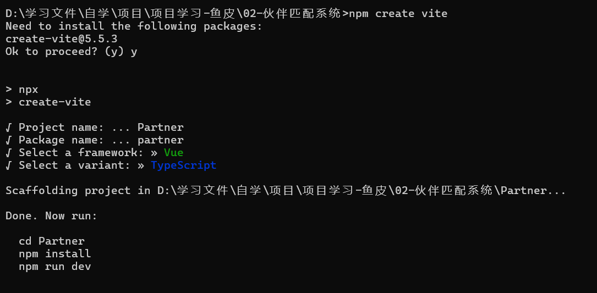

#### 2. 引入Vant并安装Vant插件

##### 安装Vant

根据官网文档：在项目目录下运行`npm i vant`

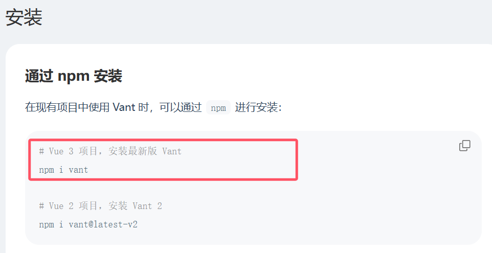

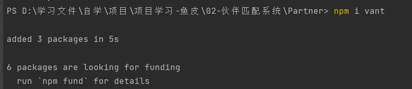

##### 安装插件

根据官网文档：安装按需引入组件插件

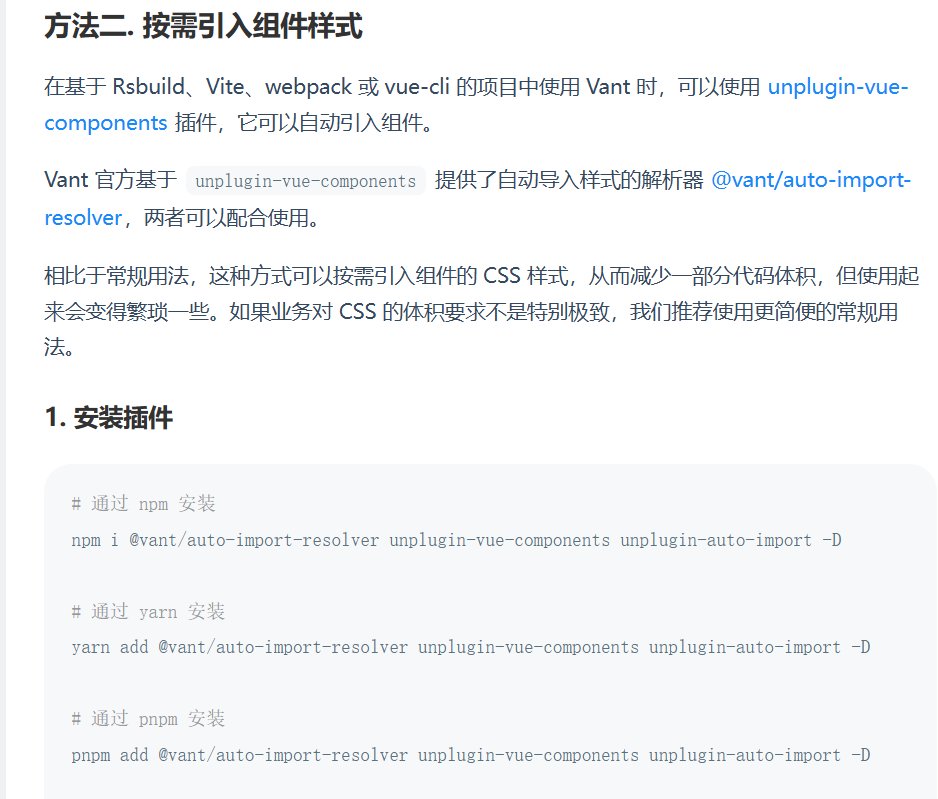

安装插件：

`npm i @vant/auto-import-resolver unplugin-vue-components unplugin-auto-import -D`

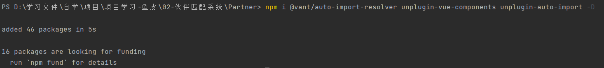

##### 配置插件

根据官网文档：配置插件

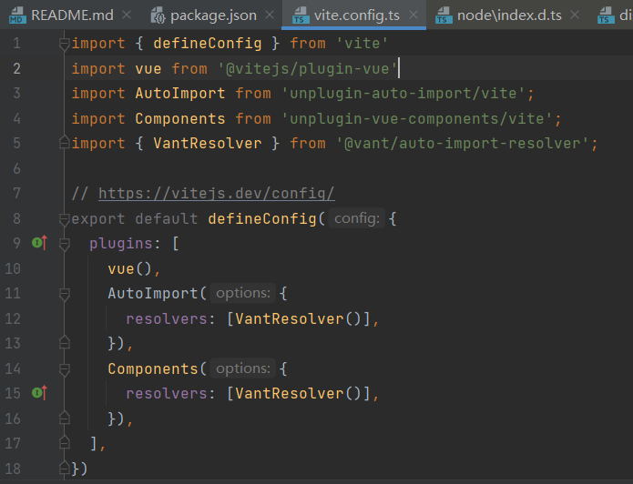


#### 3.测试Vant组件

根据官网：

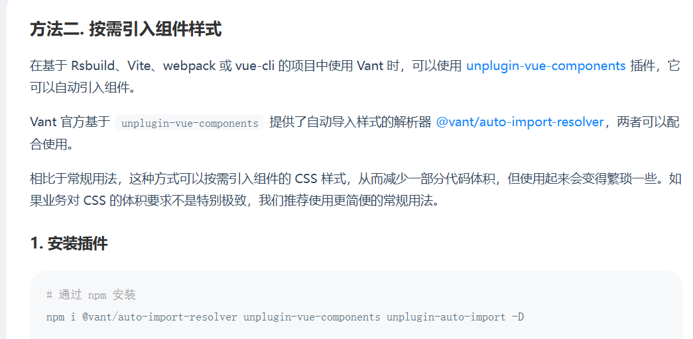

由于已经安装了插件，无需在main.ts中引入组件样式

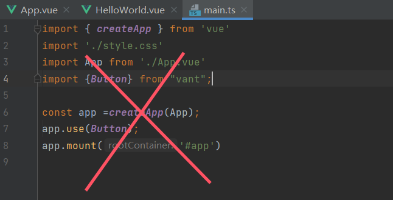

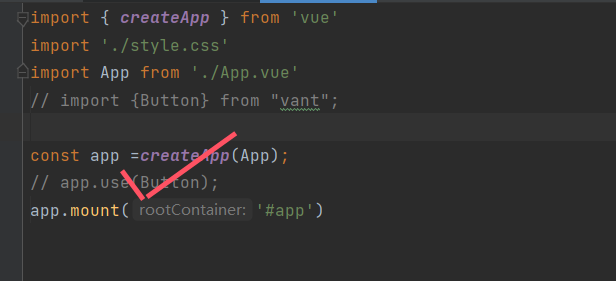

在App.vue文件中使用button组件，并启动项目查看样式：


### 二、前端主页 + 组件概览

**设计**：  
导航条：展示当前页面名称  
主页搜索框 => 搜索页 => 搜索结果页（标签筛选页）  
内容  
tab 栏：

+ 主页（推荐页 + **广告** ） 
  - 搜索框
  - banner
  - 推荐信息流
+ 队伍页
+ 用户页（消息 - 暂时考虑发邮件）


**开发**：  
很多页面要复用组件 / 样式，重复写很麻烦、不利于维护，所以抽象一个通用的布局（Layout）  
组件化


#### 1.搭建基本框架


复制官网navbar模块的代码如下，插入到layouts目录下的BasicLayouts.vue文件中

```javascript
<template>
  <van-nav-bar
      title="标题"
      left-text="返回"
      right-text="按钮"
      left-arrow
      @click-left="onClickLeft"
      @click-right="onClickRight"
  />
</template>

<script setup>
const onClickLeft = () => alert("左按钮");
const onClickRight = () => alert("右按钮");
</script>

<style scoped>

</style>
```

### 三、后端开发

####  搜索标签

> 1. 允许用户传入多个标签，多个标签都存在才搜索出来 and。like '%Java%' and like '%C++%'。
>
> 2. 允许用户传入多个标签，有任何一个标签存在就能搜索出来 or。like '%Java%' or like '%C++%'
>
> 两种方式：
>
> 1. SQL 查询（实现简单，可以通过拆分查询进一步优化）
>
> 2. 内存查询（灵活，可以通过并发进一步优化）
>
> - 如果参数可以分析，根据用户的参数去选择查询方式，比如标签数
>
> - 如果参数不可分析，并且数据库连接足够、内存空间足够，可以并发同时查询，谁先返回用谁。
>
> - 还可以 SQL 查询与内存计算相结合，比如先用 SQL 过滤掉部分 tag
>
> 建议通过实际测试来分析哪种查询比较快，数据量大的时候验证效果更明显！
>
> 解析 JSON 字符串：
>
> 序列化：java对象转成 json
>
> 反序列化：把 json 转为 java 对象
>
> java  json 序列化库有很多：
>
> 1. **gson**（google 的）
>
> 2. fastjson alibaba（ali 出品，快，但是漏洞太多）
>
> 3. jackson
>
> 4. kryo

#### 后端构建用户中心后端[http://gitlab.code-nav.cn/root/user-center-backend](http://gitlab.code-nav.cn/root/user-center-backend)

<font style="color:rgb(47, 48, 52);">鱼泡伙伴系统后端：</font>[http://gitlab.code-nav.cn/root/yupao-backend](http://gitlab.code-nav.cn/root/yupao-backend)

我这里用的是用户中心后端的代码，在依赖中Ctrl+shift+r 全局替换。修改部分文件名称。

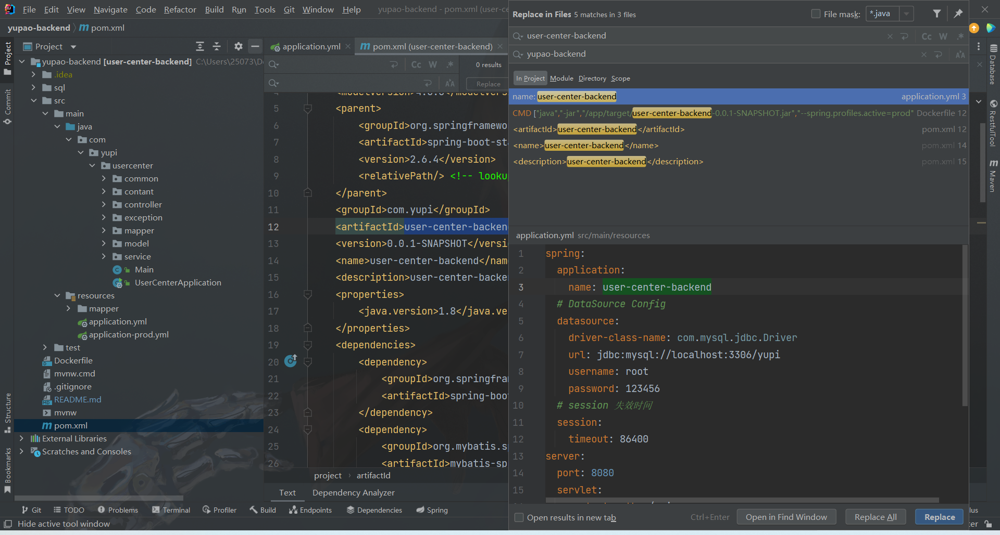

### 搜索标签的接口

根据标签搜索用户。service类和Impl实现类。


```java
    @Override
    public List<UserVO> searchUserByTagsWithSQL(List<String> tags) {
        if(CollectionUtils.isEmpty(tags)){
            throw new BusinessException(ErrorCode.PARAMS_ERROR);
        }
        QueryWrapper<User> qw = new QueryWrapper<>();
        for (String tag : tags) {
            qw.like("tags", tag);
        }
        List<User> users = userMapper.selectList(qw);
        List<UserVO> safeUsers = this.getUserVO(users);
        return  safeUsers;
    }
```


#### 添加测试类


注意修改数据库地址，数据库数据，SQL日志打印，实体类字段对应，取敏方法修改。

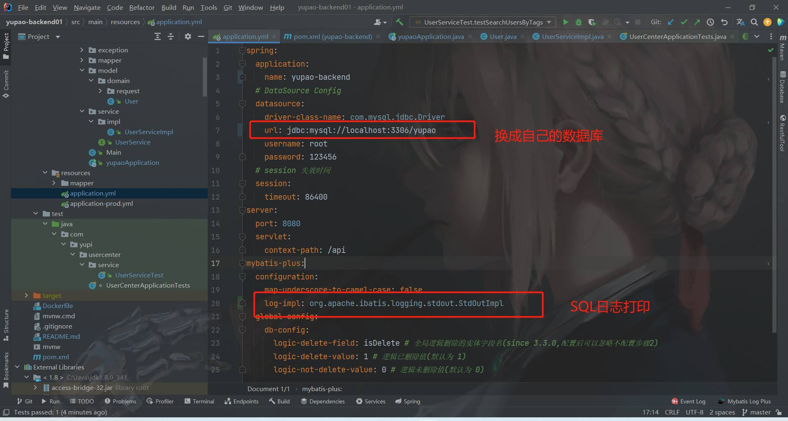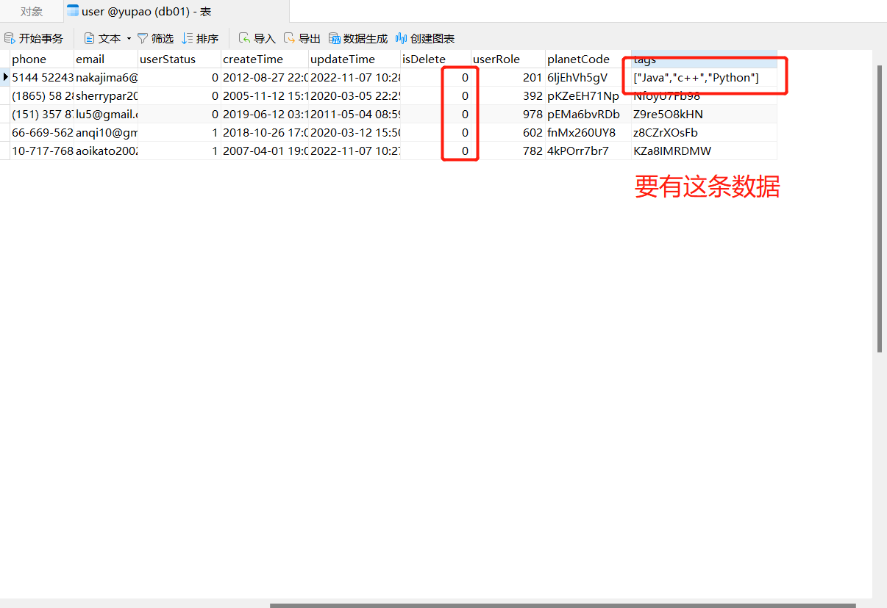

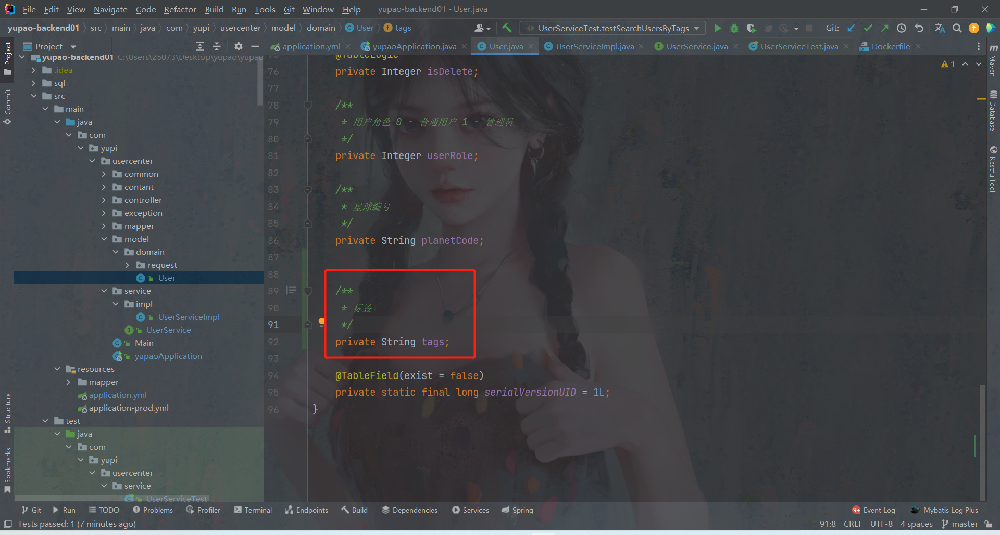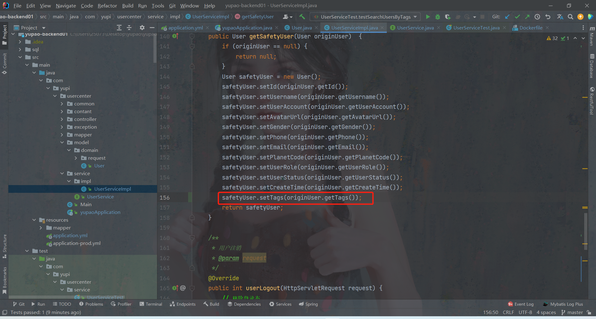

运行测试。

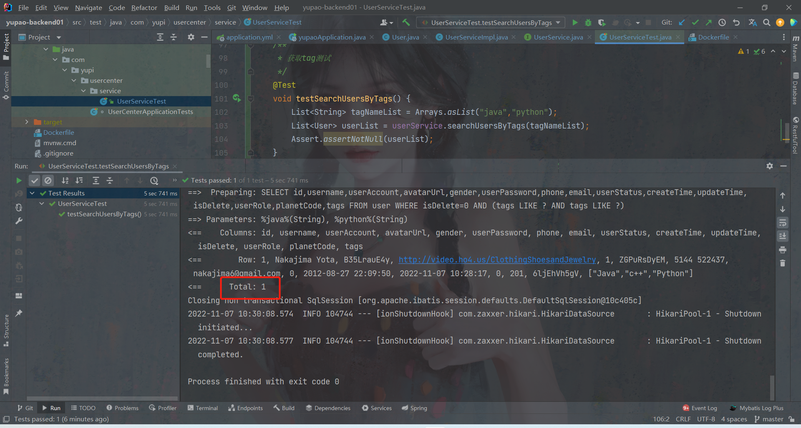


### 第二种查询

info

1. SQL 查询（实现简单，可以通过拆分查询进一步优化）

2. 内存查询（灵活，可以通过并发进一步优化）

tags字段 解析 JSON 字符串 （上面有介绍）


首先添加gson序列化依赖

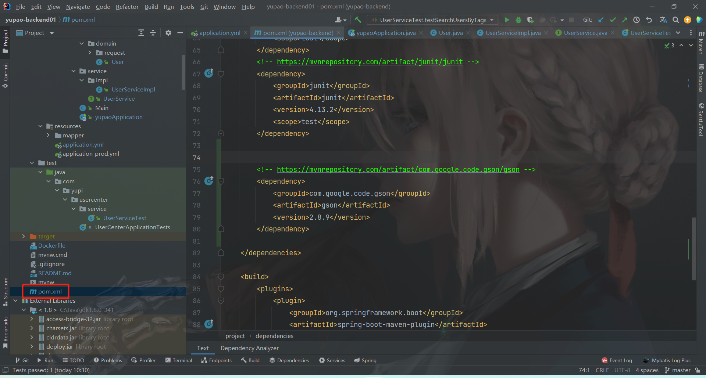


```java
<!-- https://mvnrepository.com/artifact/com.google.code.gson/gson -->
<dependency>
    <groupId>com.google.code.gson</groupId>
    <artifactId>gson</artifactId>
    <version>2.8.9</version>
</dependency>

```

info
内存查询，先查询所有用户再判断内存中是否包含要求的标签


```java
  /**
     *   根据标签搜索用户。
     * @param tagNameList  用户要搜索的标签
     * @return
     */
    @Override
    public List<User> searchUsersByTags(List<String> tagNameList){
        if (CollectionUtils.isEmpty(tagNameList)){
            throw new BusinessException(ErrorCode.PARAMS_ERROR);
        }
//        QueryWrapper<User> queryWrapper = new QueryWrapper<>();
//        //拼接tag
//        // like '%Java%' and like '%Python%'
//        for (String tagList : tagNameList) {
//            queryWrapper = queryWrapper.like("tags", tagList);
//        }
//        List<User> userList = userMapper.selectList(queryWrapper);
//        return  userList.stream().map(this::getSafetyUser).collect(Collectors.toList());

        //1.先查询所有用户
        QueryWrapper queryWrapper = new QueryWrapper<>();
        List<User> userList = userMapper.selectList(queryWrapper);
        Gson gson = new Gson();
        //2.判断内存中是否包含要求的标签
        return userList.stream().filter(user -> {
            String tagstr = user.getTags();
            if (StringUtils.isBlank(tagstr)){
                return false;
            }
            Set<String> tempTagNameSet =  gson.fromJson(tagstr,new TypeToken<Set<String>>(){}.getType());
            for (String tagName : tagNameList){
                if (!tempTagNameSet.contains(tagName)){
                    return false;
                }
            }
            return true;
        }).map(this::getSafetyUser).collect(Collectors.toList());
    }
```

### 比较运行速度

info
我自己把这俩个提出来了，清楚一下。(可以试试，我这里应该是包括了数据库的连接时间。)


```java
 /**
     *   根据标签搜索用户。
     * @param tagNameList  用户要搜索的标签
     * @return
     */
    @Override
    public List<User> searchUsersByTags(List<String> tagNameList){
        if (CollectionUtils.isEmpty(tagNameList)){
            throw new BusinessException(ErrorCode.PARAMS_ERROR);
        }
        return sqlSearch(tagNameList);   //先 sql query time = 5982 后 memory query time = 5606
//        return memorySearch(tagNameList);    // 先 memory query time = 5938 后 sql query time = 5956 （清过缓存）
    }

    /**
     *     sql运行查询
     * @param tagNameList
     * @return
     */
    public List<User> sqlSearch(List<String> tagNameList){
        QueryWrapper<User> queryWrapper = new QueryWrapper<>();
        long starTime = System.currentTimeMillis();
        //拼接tag
        // like '%Java%' and like '%Python%'
        for (String tagList : tagNameList) {
            queryWrapper = queryWrapper.like("tags", tagList);
        }
        List<User> userList = userMapper.selectList(queryWrapper);
        log.info("sql query time = " + (System.currentTimeMillis() - starTime));
        return  userList.stream().map(this::getSafetyUser).collect(Collectors.toList());
    }

    /**
     *     查询，内存运行筛选
     * @param tagNameList
     * @return
     */
    public List<User> memorySearch(List<String> tagNameList){

        //1.先查询所有用户
        QueryWrapper queryWrapper = new QueryWrapper<>();
        long starTime = System.currentTimeMillis();
        List<User> userList = userMapper.selectList(queryWrapper);
        Gson gson = new Gson();
        //2.判断内存中是否包含要求的标签
        userList.stream().filter(user -> {
            String tagstr = user.getTags();
            if (StringUtils.isBlank(tagstr)){
                return false;
            }
            Set<String> tempTagNameSet =  gson.fromJson(tagstr,new TypeToken<Set<String>>(){}.getType());
            for (String tagName : tagNameList){
                if (!tempTagNameSet.contains(tagName)){
                    return false;
                }
            }
            return true;
        }).map(this::getSafetyUser).collect(Collectors.toList());
        log.info("memory query time = " + (System.currentTimeMillis() - starTime));
        return  userList;
    }

```


## 拓展

### gson使用方法
