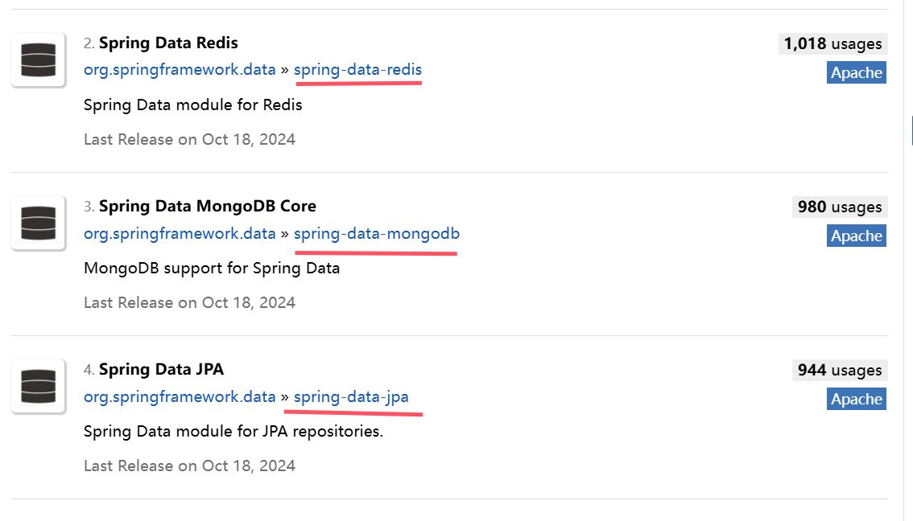
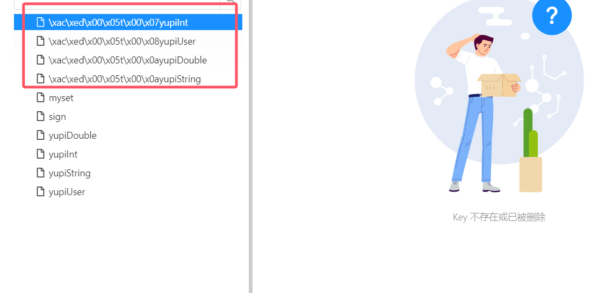
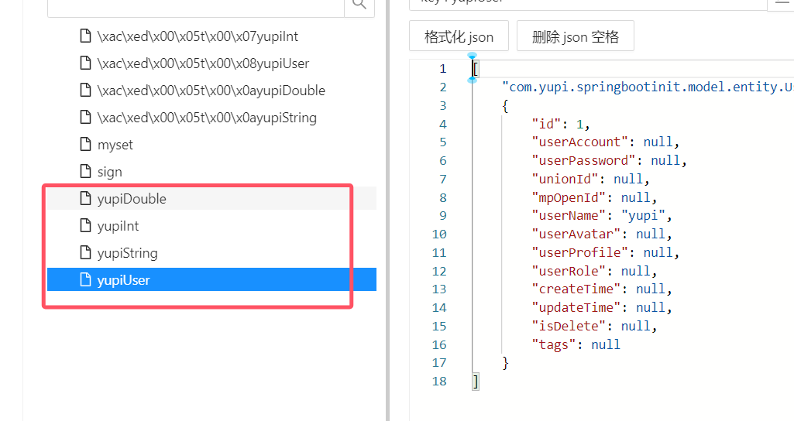

# 07 数据缓存+缓存预热+用户推荐

<font style="color:rgb(51, 51, 51);">在线回放：</font>[https://meeting.tencent.com/v2/cloud-record/share?...](https://meeting.tencent.com/v2/cloud-record/share?id=cbf47b3d-7215-4d4c-9808-8b832a0b1521&from=3)<font style="color:rgb(51, 51, 51);">（访问密码：4x4z）</font>

## 鱼皮笔记
### 1.数据查询慢怎么办？

> 数据库读取的是磁盘，数据越多读取速度越慢


用缓存：提前把数据取出来保存好（通常保存到读写更快的介质，比如内存），就可以更快地读写。


### 2.缓存的实现

> 都是分布式缓存 


+ Redis（分布式缓存）
+ memcached（分布式）
+ Etcd（云原生架构的一个分布式存储，**存储配置**，扩容能力）

---

> 这些偏向于Java的进程缓存
>
> 单机缓存存在的问题：如果有多台服务器，每台服务器都有一个单机缓存，那么会导致数据不一致。

+ ehcache（单机，老牌）


+ 本地缓存（Java 内存 Map）
+ Caffeine（Java 内存缓存，高性能，号称Java缓存之王，可学）
+ Google Guava （和Apache提供的Common包类似，提供了各种工具类，包括缓存、字符串处理）


#### Redis


> NoSQL 数据库  
key - value 存储系统（区别于 MySQL，他存储的是键值对）

#### Redis在JavaSpring项目里的实现方式

##### Spring Data Redis（推荐）

SpringData:通用的数据访问接口，定义了一组**增删改查**接口。可以通过SpringData操作MySQL、Redis、jpa。
而SpringDataRedis是SpringData的具体实现，相当于实现类与接口的关系。
想要操作什么数据库，就需要使用对应的包	



##### Jedis

##### Redission

#### Redis 数据结构🌟🌟🌟🌟🌟（面试高频考点）

String 字符串类型： name: "shier"  
List 列表：names: ["shier", "xiaoshier", "shier1"]，长度可变  
Set 集合：names: ["shier", "dogshier"]（值不能重复）  
Hash 哈希：nameAge: { "yupi": 1, "dogyupi": 2 }：  
Zset 集合：names: { yupi - 9, dogyupi - 12 }（适合做排行榜）Zset值会关联分数

---

bloomfilter（布隆过滤器，主要从大量的数据中快速过滤值，比如邮件黑名单拦截）  
geo（计算地理位置）  
hyperloglog（pv / uv）  
pub / sub（发布订阅，类似消息队列）  
BitMap （1001010101010101010101010101）


### 3.自定义序列化

> 在spring data redis中，如果不指定序列化器，就会使用默认的序列化器--jdk序列化器。
> jdk序列化器的效率很低，应该更换为其它的序列化器

因为java自带的redistemplate只能查询字符串类型，不够全面，所以我们需要自定义序列化，在config包里创建如下配置类

>  根据Redis源码可知，如果不指定序列化器，redis会默认设置为jdk原生序列化器
>
> 

```java
package com.shier.usercenter.config;

import org.springframework.context.annotation.Bean;
import org.springframework.context.annotation.Configuration;
import org.springframework.data.redis.connection.RedisConnectionFactory;
import org.springframework.data.redis.core.RedisTemplate;
import org.springframework.data.redis.serializer.GenericJackson2JsonRedisSerializer;
import org.springframework.data.redis.serializer.RedisSerializer;

/**
 * @author Shier
 * 自定义Redis序列化
 */
@Configuration
public class RedisTemplateConfig {

    @Bean
    public RedisTemplate<String, Object> redisTemplate(RedisConnectionFactory connectionFactory) {
        // 创建RedisTemplate对象
        RedisTemplate<String, Object> redisTemplate = new RedisTemplate<>();
        //设置连接工厂
        redisTemplate.setConnectionFactory(connectionFactory);
        //设置Key的序列化
        redisTemplate.setKeySerializer(RedisSerializer.string());

        //创建Json序列化工具
        GenericJackson2JsonRedisSerializer jsonRedisSerializer = new GenericJackson2JsonRedisSerializer();
        //设置Value的序列化
        redisTemplate.setValueSerializer(jsonRedisSerializer);

        return redisTemplate;
    }
}
```


### 狂神的通用序列化配置

> 狂神的序列化和鱼皮的序列化配置方式基本一致：
>
> 都是用new RedisTemplate<String, Object>();初始化RedisTemplate。即用String存键，Object存值
> 并且都用String序列化器序列化Key，使用Json序列化器序列化Value

```java
package com.yupi.springbootinit.config;

import com.fasterxml.jackson.annotation.JsonAutoDetect;
import com.fasterxml.jackson.annotation.PropertyAccessor;
import com.fasterxml.jackson.databind.ObjectMapper;
import org.springframework.context.annotation.Bean;
import org.springframework.context.annotation.Configuration;
import org.springframework.data.redis.connection.RedisConnectionFactory;
import org.springframework.data.redis.core.RedisTemplate;
import org.springframework.data.redis.serializer.Jackson2JsonRedisSerializer;
import org.springframework.data.redis.serializer.StringRedisSerializer;

@Configuration
public class RedisConfig {
    // 这是我给大家写好的一个固定模板，大家在企业中，拿去就可以直接使用！
    // 自己定义了一个 RedisTemplate
    @Bean
    @SuppressWarnings("all")
    public RedisTemplate<String, Object> redisTemplate(RedisConnectionFactory factory) {
        // 我们为了自己开发方便，一般直接使用 <String, Object>
        RedisTemplate<String, Object> template = new RedisTemplate<String, Object>();
        template.setConnectionFactory(factory);

        // Json序列化配置
        Jackson2JsonRedisSerializer jackson2JsonRedisSerializer = new
                Jackson2JsonRedisSerializer(Object.class);
        ObjectMapper om = new ObjectMapper();
        om.setVisibility(PropertyAccessor.ALL, JsonAutoDetect.Visibility.ANY);
        om.enableDefaultTyping(ObjectMapper.DefaultTyping.NON_FINAL);
        jackson2JsonRedisSerializer.setObjectMapper(om);
        // String 的序列化
        StringRedisSerializer stringRedisSerializer = new StringRedisSerializer();

        // key采用String的序列化方式
        template.setKeySerializer(stringRedisSerializer);
        // hash的key也采用String的序列化方式
        template.setHashKeySerializer(stringRedisSerializer);
        // value序列化方式采用jackson
        template.setValueSerializer(jackson2JsonRedisSerializer);
        // hash的value序列化方式采用jackson
        template.setHashValueSerializer(jackson2JsonRedisSerializer);
        template.afterPropertiesSet();

        return template;
    }
}
```


引入一个库时，先写测试类


### 4.Java 里的实现方式


#### Spring Data Redis（推荐）

Spring Data：通用的数据访问框架，定义了一组 **增删改查** 的接口  
mysql、redis、jpa  
[spring-data-redis](https://mvnrepository.com/artifact/org.springframework.data/spring-data-redis)  
1）引入

```xml
<dependency>
    <groupId>org.springframework.boot</groupId>
    <artifactId>spring-boot-starter-data-redis</artifactId>
    <version>2.6.4</version>
</dependency>
```

2）配置 Redis 地址

```yaml
spring:
  # redis 配置
  redis:
    port: 6379
    host: localhost
    database: 0
```

#### Jedis

独立于 Spring 操作 Redis 的 Java 客户端  
Jedis是线程不安全的、要配合 Jedis Pool 使用

#### Lettuce

**高阶** 的操作 Redis 的 Java 客户端  
异步、连接池

#### Redisson


分布式操作 Redis 的 Java 客户端，让你像在使用本地的集合一样操作 Redis（分布式 Redis 数据网格）


对比

1. 如果你用的是 Spring，并且没有过多的定制化要求，可以用 Spring Data Redis，最方便
2. 如果你用的不是 SPring，并且追求简单，并且没有过高的性能要求，可以用 Jedis + Jedis Pool
3. 如果你的项目不是 Spring，并且追求高性能、高定制化，可以用 Lettuce，支持异步、连接池

---

+ 如果你的项目是分布式的，需要用到一些分布式的特性（比如分布式锁、分布式集合），推荐用 redisson

### 5.设计缓存 key

不同用户看到的数据不同  
systemId:moduleId:func:options（不要和别人冲突）  
yupao:user:recommed:userId  
**redis 内存不能无限增加，一定要设置过期时间！！！**

### 6.缓存预热

问题：第一个用户访问还是很慢（加入第一个老板），也能一定程度上保护数据库  
缓存预热的优点：

1. 解决上面的问题，可以让用户始终访问很快

缺点：

1. 增加开发成本（你要额外的开发、设计）
2. 预热的时机和时间如果错了，有可能你缓存的数据不对或者太老
3. 需要占用额外空间

#### 怎么缓存预热？


1. 定时
2. 模拟触发（手动触发）

#### 实现

用定时任务，每天刷新所有用户的推荐列表  
注意点：

1. 缓存预热的意义（新增少、总用户多）
2. 缓存的空间不能太大，要预留给其他缓存空间
3. 缓存数据的周期（此处每天一次）

分析优缺点的时候，要打开思路，从整个项目从 0 到 1 的链路上去分析

### 7.定时任务实现


1. **Spring Scheduler（spring boot 默认整合了）**
2. Quartz（独立于 Spring 存在的定时任务框架）
3. XXL-Job 之类的分布式任务调度平台（界面 + sdk）(非常值得学习，干货很多)

第一种方式：

1. 主类开启 [@EnableScheduling ](/EnableScheduling ) 
2. 给要定时执行的方法添加 [@Scheduling ](/Scheduling ) 注解，指定 cron 表达式或者执行频率 

不要去背 cron 表达式！！！！！

+ [https://cron.qqe2.com/](https://cron.qqe2.com/)
+ [https://www.matools.com/crontab/](https://www.matools.com/crontab/)

## 一、测试redis

因为java自带的redistemplate只能查询字符串类型，不够全面，所以我们需要自定义序列化，在config包里创建如下配置类

>  根据Redis源码可知，如果不指定序列化器，redis会默认设置为jdk原生序列化器
>
> 

```java
package com.shier.usercenter.config;

import org.springframework.context.annotation.Bean;
import org.springframework.context.annotation.Configuration;
import org.springframework.data.redis.connection.RedisConnectionFactory;
import org.springframework.data.redis.core.RedisTemplate;
import org.springframework.data.redis.serializer.GenericJackson2JsonRedisSerializer;
import org.springframework.data.redis.serializer.RedisSerializer;

/**
 * @author Shier
 * 自定义Redis序列化
 */
@Configuration
public class RedisTemplateConfig {

    @Bean
    public RedisTemplate<String, Object> redisTemplate(RedisConnectionFactory connectionFactory) {
        // 创建RedisTemplate对象
        RedisTemplate<String, Object> redisTemplate = new RedisTemplate<>();
        //设置连接工厂
        redisTemplate.setConnectionFactory(connectionFactory);
        //设置Key的序列化
        redisTemplate.setKeySerializer(RedisSerializer.string());

        //创建Json序列化工具
        GenericJackson2JsonRedisSerializer jsonRedisSerializer = new GenericJackson2JsonRedisSerializer();
        //设置Value的序列化
        redisTemplate.setValueSerializer(jsonRedisSerializer);

        return redisTemplate;
    }
}
```


### 狂神的通用序列化配置

> 狂神的序列化和鱼皮的序列化配置方式基本一致：
>
> 都是用new RedisTemplate<String, Object>();初始化RedisTemplate。即用String存键，Object存值
> 并且都用String序列化器序列化Key，使用Json序列化器序列化Value

```java
package com.yupi.springbootinit.config;

import com.fasterxml.jackson.annotation.JsonAutoDetect;
import com.fasterxml.jackson.annotation.PropertyAccessor;
import com.fasterxml.jackson.databind.ObjectMapper;
import org.springframework.context.annotation.Bean;
import org.springframework.context.annotation.Configuration;
import org.springframework.data.redis.connection.RedisConnectionFactory;
import org.springframework.data.redis.core.RedisTemplate;
import org.springframework.data.redis.serializer.Jackson2JsonRedisSerializer;
import org.springframework.data.redis.serializer.StringRedisSerializer;

@Configuration
public class RedisConfig {
    // 这是我给大家写好的一个固定模板，大家在企业中，拿去就可以直接使用！
    // 自己定义了一个 RedisTemplate
    @Bean
    @SuppressWarnings("all")
    public RedisTemplate<String, Object> redisTemplate(RedisConnectionFactory factory) {
        // 我们为了自己开发方便，一般直接使用 <String, Object>
        RedisTemplate<String, Object> template = new RedisTemplate<String, Object>();
        template.setConnectionFactory(factory);

        // Json序列化配置
        Jackson2JsonRedisSerializer jackson2JsonRedisSerializer = new
                Jackson2JsonRedisSerializer(Object.class);
        ObjectMapper om = new ObjectMapper();
        om.setVisibility(PropertyAccessor.ALL, JsonAutoDetect.Visibility.ANY);
        om.enableDefaultTyping(ObjectMapper.DefaultTyping.NON_FINAL);
        jackson2JsonRedisSerializer.setObjectMapper(om);
        // String 的序列化
        StringRedisSerializer stringRedisSerializer = new StringRedisSerializer();

        // key采用String的序列化方式
        template.setKeySerializer(stringRedisSerializer);
        // hash的key也采用String的序列化方式
        template.setHashKeySerializer(stringRedisSerializer);
        // value序列化方式采用jackson
        template.setValueSerializer(jackson2JsonRedisSerializer);
        // hash的value序列化方式采用jackson
        template.setHashValueSerializer(jackson2JsonRedisSerializer);
        template.afterPropertiesSet();

        return template;
    }
}
```


在测试包里创建测试类RedisTest，测试代码如下

```java
@SpringBootTest
public class RedisTest {
    //
    @Resource
    private RedisTemplate redisTemplate;
    @Test
    void test(){
        ValueOperations valueOperations = redisTemplate.opsForValue();
        //增
        valueOperations.set("yupiString","dog");
        valueOperations.set("yupiInt",1);
        valueOperations.set("yupiDouble",2.0);
        User user = new User();
        user.setId(1L);
        user.setUsername("yupi");
        valueOperations.set("yupiUser",user);
        //查
        Object yupi = valueOperations.get("yupiString");
        Assertions.assertTrue("dog".equals((String)yupi));
        yupi = valueOperations.get("yupiInt");
        Assertions.assertTrue(1==((Integer)yupi));
        yupi = valueOperations.get("yupiDouble");
        Assertions.assertTrue(2.0==((Double)yupi));
        System.out.println(valueOperations.get("yupiUser"));
//        valueOperations.set("yupiString","dog");
//        redisTemplate.delete("yupiString");
    }
}
```


redis中可查询到缓存的数据  

JDK序列化后的结果。key被序列化，value无法查询

自定义序列化结果




## 二、根据用户开发个性推荐页

### 1.修改推荐页面的接口，整理如下：

UserServiceImpl:

> 一定要为Redis缓存设置过期时间!!!


```java
    /**
     * 查询缓存中的推荐用户，缓存中没有就从数据库中查询。
     * @param userId
     * @param pageNum
     * @param pageSize
     * @return 分页后的用户列表
     */
    @Override
    public Page<User> getCachedUser(long userId, long pageNum, long pageSize) {
        String redisKey = "partner:user:recommend:" +  userId;
        ValueOperations<String, Object> valueOperations = redisTemplate.opsForValue();
        //如果有缓存，直接读缓存
        Page<User> userList = (Page<User>) valueOperations.get(redisKey);
        if(userList != null){
            return userList;
        }
        //如果没有缓存，查数据库
        QueryWrapper<User> qw = new QueryWrapper<>();
        userList = page(new Page<>(pageNum, pageSize), qw);
        //写入缓存，并设置缓存过期时间30s
        try {
            valueOperations.set(redisKey, userList, 3_0000L, TimeUnit.MILLISECONDS);
        } catch (Exception e) {
            e.printStackTrace();
        }
        return userList;
    }
```

UserController:

```java
    @GetMapping("/recommend")
    public BaseResponse<Page<User>> recommendUsers(int pageNum, int pageSize, HttpServletRequest request){
        User loginUser = userService.getLoginUser(request);
        Page<User> userList = userService.getCachedUser(loginUser.getId(), pageNum, pageSize);
        return ResultUtils.success(userList);
    }
```

刷新页面，有了缓存之后查询速度变快，只有20多毫秒


### 2.定时任务


> 但是还存在一个问题：第一个用户访问还是很慢（加入第一个老板），要实现缓存预热这里我们使用了定时的方法
>


新建一个job包，写入下面代码实现定时预热缓存

```java
package com.yupi.springbootinit.job;

import com.baomidou.mybatisplus.core.conditions.query.QueryWrapper;
import com.baomidou.mybatisplus.extension.plugins.pagination.Page;
import com.yupi.springbootinit.model.entity.User;
import com.yupi.springbootinit.service.UserService;
import lombok.extern.slf4j.Slf4j;
import org.springframework.data.redis.core.RedisTemplate;
import org.springframework.data.redis.core.ValueOperations;
import org.springframework.scheduling.annotation.Scheduled;
import org.springframework.stereotype.Component;

import javax.annotation.Resource;
import java.util.Arrays;
import java.util.List;
import java.util.concurrent.TimeUnit;

@Slf4j
@Component // 加载成bean
public class PreCacheJob {
    @Resource
    private UserService userService;

    @Resource
    private RedisTemplate<String,Object> redisTemplate;

    //重点用户
    private List<Long> mainUserList = Arrays.asList(1844262784502628353L);

    //每天执行，预热推荐用户 秒-分-时-日-月-年
    @Scheduled(cron = "0 09 17 * * *")
    public void doCacheRecommendUser(){
        for (Long userId: mainUserList){
            QueryWrapper<User> queryWrapper = new QueryWrapper<>();
            Page<User> userPage = userService.page(new Page<>(1, 20), queryWrapper);
            String redisKey = "partner:user:recommend:" +  userId;
            ValueOperations<String,Object> valueOperations = redisTemplate.opsForValue();
            //写缓存
            try {
                valueOperations.set(redisKey,userPage,30000, TimeUnit.MILLISECONDS);
            }catch (Exception e){
                log.error("redis set key error",e);
            }
        }
    }
}


```

定时任务执行成功


注意:要在UserCenterApplication添加@EnableScheduling注解，允许定时任务

## 第七期完结🎉🎉🎉🎉🎉🎉🎉


> 更新: 2023-02-10 10:05:16  
> 原文: <https://www.yuque.com/shierkcs/catstudy/qpctxhy6civ4334q>