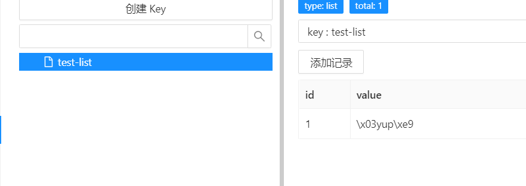
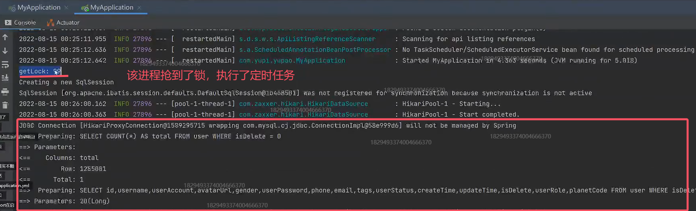
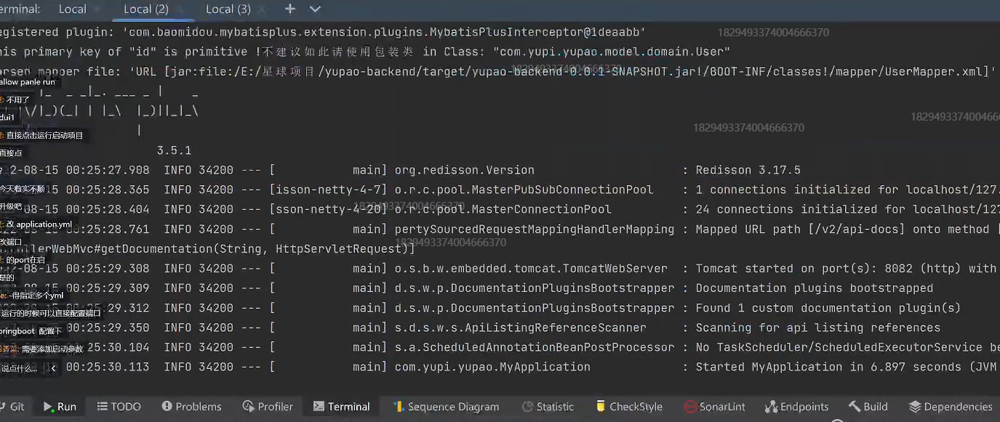
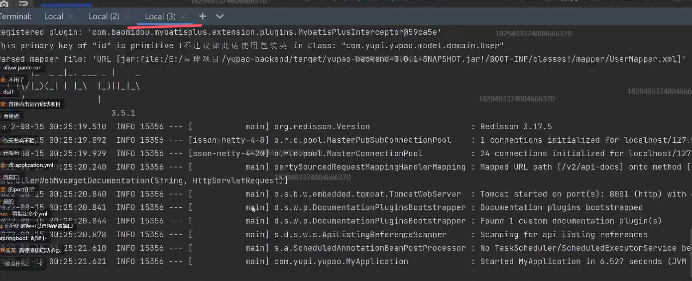

# 08 控制定时任务 + Redission分布式锁

<font style="color:rgb(51, 51, 51);">在线回放：</font>[https://meeting.tencent.com/v2/cloud-record/share?...](https://meeting.tencent.com/v2/cloud-record/share?id=8a8667dc-f061-4972-86e9-1b9d7e27aac5&from=3)<font style="color:rgb(51, 51, 51);">（访问密码：QzER）</font>

## 鱼皮笔记
### 1.控制定时任务的执行 

1. 浪费资源，想象 10000 台服务器同时 “打鸣”
2. 脏数据，比如重复插入

**要控制定时任务在同一时间只有 1 个服务器能执行。**  


怎么做？

1. 分离定时任务程序和主程序，只在 1 个服务器运行定时任务。成本太大
2. 写死配置，每个服务器都执行定时任务，但是只有 ip 符合配置的服务器才真实执行业务逻辑，其他的直接返回。成本最低；但是我们的 IP 可能是不固定的，把 IP 写的太死了
3. 动态配置，配置是可以轻松的、很方便地更新的（**代码无需重启**），但是只有 ip 符合配置的服务器才真实执行业务逻辑。问题：服务器多了、IP 不可控还是很麻烦，还是要人工修改 
    - 数据库
    - Redis
    - 配置中心（Nacos、Apollo、Spring Cloud Config）
4. 分布式锁，只有抢到锁的服务器才能执行业务逻辑。坏处：增加成本；好处：不用手动配置，多少个服务器都一样。


**单机就会存在单点故障。**


### 2.锁

有限资源的情况下，控制同一时间（段）只有某些线程（用户 / 服务器）能访问到资源。  
Java 实现锁：synchronized 关键字、并发包的类  
问题：单个Synchronized关键字只对单个 JVM 有效


### 3.分布式锁


为啥需要分布式锁？

1. 有限资源的情况下，控制同一时间（段）只有某些线程（用户 / 服务器）能访问到资源。
2. 锁只对单个 JVM 有效


### 4.分布式锁实现的关键


#### 抢锁机制

怎么保证同一时间只有 1 个服务器能抢到锁？  
**核心思想** 就是：先来的人先把数据改成自己的标识（服务器 ip），后来的人发现标识已存在，就抢锁失败，继续等待。  
等先来的人执行方法结束，把标识清空，其他的人继续抢锁。  
MySQL 数据库：select for update 行级锁（最简单）  
（乐观锁）  
✔ Redis 实现：内存数据库，**读写速度快** 。支持 **set   nx**、lua 脚本，比较方便我们实现分布式锁。  
set   nx：set if not exists 如果不存在，则设置；只有设置成功才会返回 true，否则返回 false

Zookeeper实现:企业中很少用，不推荐使用


### 5.注意事项


1.  用完锁要手动释放（腾地方）√ 
2.  **锁一定要加过期时间 √** 
3.  如果方法执行时间过长，锁提前过期了？问题： 
    1. 连锁效应：释放掉别人的锁
    2. 这样还是会存在多个方法同时执行的情况

解决方案：续期 

```java
boolean end = false;

new Thread(() -> {
    if (!end)}{
    续期
})

end = true;
```

1. 释放锁的时候，有可能刚判断出是自己的锁，锁就过期了，别人这是抢到了锁，最后还是释放了别人的锁
2. Redis 如果是集群（而不是只有一个 Redis），如果分布式锁的数据不同步怎么办？

```java
// 原子操作
if(get lock == A) {
    // set lock B
    del lock
}
```

可以通过Redis + lua 脚本实现 原子操作
[https://blog.csdn.net/feiying0canglang/article/details/113258494](https://blog.csdn.net/feiying0canglang/article/details/113258494)


#### 拒绝自己写！！！


### 6.Redisson 实现分布式锁

Redis Java 客户端，数据网格  
实现了很多 Java 里支持的接口和数据结构  
Redisson 是一个 java 操作 Redis 的客户端，**提供了大量的分布式数据集来简化对 Redis 的操作和使用，可以让开发者像使用本地集合一样使用 Redis，完全感知不到 Redis 的存在。**

 

#### 2 种引入方式


1. spring boot starter 引入（不推荐，版本迭代太快，容易冲突）
   [https://github.com/redisson/redisson/tree/master/redisson-spring-boot-starter](https://github.com/redisson/redisson/tree/master/redisson-spring-boot-starter)
2. 直接引入：[https://github.com/redisson/redisson#quick-start](https://github.com/redisson/redisson#quick-start)


#### 示例代码

Redisson配置：

```java
package com.yupi.springbootinit.config;

import lombok.Data;
import org.redisson.Redisson;
import org.redisson.api.RedissonClient;
import org.redisson.config.Config;
import org.springframework.boot.context.properties.ConfigurationProperties;
import org.springframework.context.annotation.Bean;
import org.springframework.context.annotation.Configuration;

@Configuration
@ConfigurationProperties(prefix = "spring.redis")
@Data
public class RedissonConfig {

    private String host;
    private String port;

    @Bean
    public RedissonClient redissonClient(){
        // 1.创建配置
        Config config = new Config();
        //动态读取Redis的地址
        String redisAddress = String.format("redis://%s:%s", host, port);
        config.useSingleServer().setAddress(redisAddress).setDatabase(3);
        // 2.创建实例
        RedissonClient redisson = Redisson.create(config);
        return redisson;
    }
}
```


```java
package com.yupi.springbootinit.test;

import org.junit.jupiter.api.Test;
import org.redisson.api.RList;
import org.redisson.api.RedissonClient;
import org.springframework.beans.factory.annotation.Autowired;
import org.springframework.boot.test.context.SpringBootTest;

import javax.annotation.Resource;
import java.util.ArrayList;
import java.util.List;

@SpringBootTest
public class RedissonTest {

    @Resource
    private RedissonClient redissonClient;

    @Test
    public void test(){
        // list，数据存在本地 JVM 内存中
        List<String> list = new ArrayList<>();
        list.add("yupi");
        System.out.println("list:" + list.get(0));
        //list.remove(0);

		// 数据存在 redis 的内存中
        RList<String> rList = redissonClient.getList("test-list");
        rList.add("yupi");
        System.out.println("rlist:" + rList.get(0));
        //rList.remove(0);
    }

}

```

rlist最终将结果存入到redis中



### 7.定时任务 + 锁


1. waitTime 设置为 0，只抢一次，抢不到就放弃
2. 注意释放锁要写在 finally 中


**实现代码**

```java
void testWatchDog() {
    RLock lock = redissonClient.getLock("yupao:precachejob:docache:lock");
    try {
        // 只有一个线程能获取到锁
        if (lock.tryLock(0, -1, TimeUnit.MILLISECONDS)) {
            // todo 实际要执行的方法
            doSomeThings();
            System.out.println("getLock: " + Thread.currentThread().getId());
        }
    } catch (InterruptedException e) {
        System.out.println(e.getMessage());
    } finally {
        // 只能释放自己的锁
        if (lock.isHeldByCurrentThread()) {
            System.out.println("unLock: " + Thread.currentThread().getId());
            lock.unlock();
        }
    }
}
```


### 8.看门狗机制

redisson 中提供的续期机制  
开一个监听线程，如果方法还没执行完，就帮你重置 redis 锁的过期时间。  
原理：


1. 监听当前线程，默认过期时间是 30 秒，每 10 秒续期一次（补到 30 秒）
2. 如果线程挂掉（注意 debug 模式也会被它当成服务器宕机），则不会续期


[https://blog.csdn.net/qq_26222859/article/details/79645203](https://blog.csdn.net/qq_26222859/article/details/79645203)

---

Zookeeper 实现（不推荐）


## 一、redission实现分布式锁


### 1.引入依赖


[https://github.com/redisson/redisson#quick-start](https://github.com/redisson/redisson#quick-start)


```xml
<dependency>
   <groupId>org.redisson</groupId>
   <artifactId>redisson</artifactId>
   <version>3.18.0</version>
</dependency>
```


注意踩坑处：我这边开了梯子，下载依赖，会有io.netty:netty-codec-dns:jar:4.1.74.Final依赖安装失败，  
解决办法：删除maven仓库里redission和netty-codec-dns。然后关闭梯子重新安装依赖


### 2.写redisson配置


```java
package com.shier.usercenter.config;

import lombok.Data;
import org.redisson.Redisson;
import org.redisson.api.RedissonClient;
import org.redisson.config.Config;
import org.springframework.boot.context.properties.ConfigurationProperties;
import org.springframework.context.annotation.Bean;
import org.springframework.context.annotation.Configuration;

/**
 * Redisson 配置
 */
@Configuration
@ConfigurationProperties(prefix = "spring.redis")
@Data
public class RedissonConfig {

    private String host;

    private String port;

    @Bean
    public RedissonClient redissonClient() {
        // 1. 创建配置
        Config config = new Config();
        String redisAddress = String.format("redis://%s:%s", host, port);
        //  使用单个Redis，没有开集群 useClusterServers()  设置地址和使用库
        config.useSingleServer().setAddress(redisAddress).setDatabase(3);
        // 2. 创建实例
        RedissonClient redisson = Redisson.create(config);
        return redisson;
    }
}
```


编写测试类来使用edisson 实现分布式锁


```java
package com.shier.usercenter.service;

import org.junit.jupiter.api.Test;
import org.redisson.api.RList;
import org.redisson.api.RMap;
import org.redisson.api.RedissonClient;
import org.springframework.boot.test.context.SpringBootTest;

import javax.annotation.Resource;
import java.util.ArrayList;
import java.util.HashMap;
import java.util.List;
import java.util.Map;

@SpringBootTest
public class RedissonTest {

    @Resource
    private RedissonClient redissonClient;

    @Test
    void test() {
        // list，数据存在本地 JVM 内存中
        List<String> list = new ArrayList<>();
        list.add("shier");
        System.out.println("list:" + list.get(0));

        // list.remove(0);

        // 数据存在 redis 的内存中
        RList<String> rList = redissonClient.getList("test-list");
        rList.add("shier");
        System.out.println("rlist:" + rList.get(0));
        // rList.remove(0);

        // map
        Map<String, Integer> map = new HashMap<>();
        map.put("shier", 10);
        map.get("shier");

        RMap<Object, Object> map1 = redissonClient.getMap("test-map");
    }
}
```


## 二、定时任务 + 锁


1.修改定时任务


1. waitTime 设置为 0，只抢一次，抢不到就放弃
2. 注意释放锁要写在 finally 中


```java
@Slf4j
@Component
public class PreCacheJob {
    @Resource
    private UserService userService;

    @Resource
    private RedissonClient redissonClient;

    @Resource
    private RedisTemplate<String,Object> redisTemplate;

    //重点用户
    private List<Long> mainUserList = Arrays.asList(1l);

    //每天执行，预热推荐用户
    @Scheduled(cron = "0 24 18 * * *")
    public void doCacheRecommendUser(){
        RLock lock = redissonClient.getLock("yupao:precachejob:docache:lock");
        try{
            //只有一个线程能获取到锁
            if (lock.tryLock(0,30000L,TimeUnit.MILLISECONDS)){
                System.out.println("getLock: "+Thread.currentThread().getId());
                for (Long userId: mainUserList){
                    QueryWrapper<User> queryWrapper = new QueryWrapper<>();
                    Page<User> userPage = userService.page(new Page<>(1, 20), queryWrapper);
                    String redisKey = String.format("yupao:user:recommend:%s", userId);
                    ValueOperations<String,Object> valueOperations = redisTemplate.opsForValue();
                    //写缓存
                    try {
                        valueOperations.set(redisKey,userPage,30000, TimeUnit.MILLISECONDS);
                    }catch (Exception e){
                        log.error("redis set key error",e);
                    }
                }
            }
        }catch(InterruptedException e){
            log.error("doCacheRecommendUser error ",e);
        }finally {
            //只能释放自己的锁
            if (lock.isHeldByCurrentThread()){
                System.out.println("unlock: "+Thread.currentThread().getId());
                lock.unlock();
            }
        }
    }
}
```


打包项目，在终端打开两个，主程序启动（由于定时任务太过于麻烦，所以我们提取出来写一个测试）


```plain
java -jar .\yupao-backend-0.0.1-SNAPSHOT.jar --server.port=8081
```


```java
    @Test
    void testWatchDog(){
        RLock lock = redissonClient.getLock("shier:precachejob:docache:lock");
        try{
            //只有一个线程能获取到锁
            if (lock.tryLock(0,-1, TimeUnit.MILLISECONDS)){
                Thread.sleep(300000);
                System.out.println("getLock: "+Thread.currentThread().getId());
            }
        }catch(InterruptedException e){
            System.out.println(e.getMessage());
        }finally {
            //只能释放自己的锁
            if (lock.isHeldByCurrentThread()){
                System.out.println("unlock: "+Thread.currentThread().getId());
                lock.unlock();
            }
        }
    }
```


注意锁的存在时间要设置为-1（开启开门狗），默认锁的过期时间是30秒，通过sleep实现  
运行，通过quickredis观察，可以发现  每 10 秒续期一次（补到 30 秒）  
**踩坑处：不要用debug启动，会被认为是宕机**



其余jar包没有抢到锁，没有任何反应。





## 第八期完结🎉🎉🎉🎉🎉🎉🎉🎉


> 更新: 2023-02-10 10:05:41  
> 原文: <https://www.yuque.com/shierkcs/catstudy/groeheda6uuuhps7>