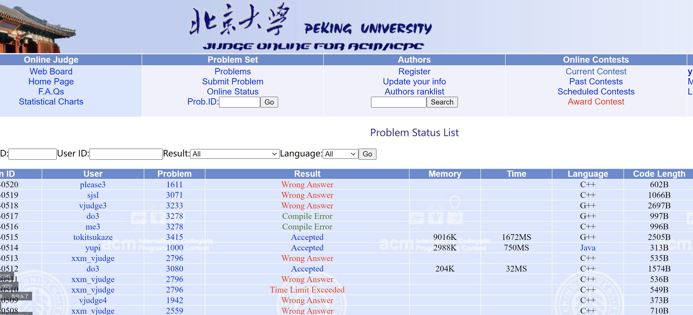
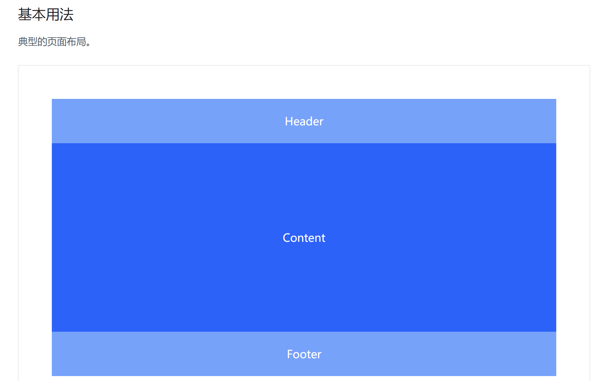
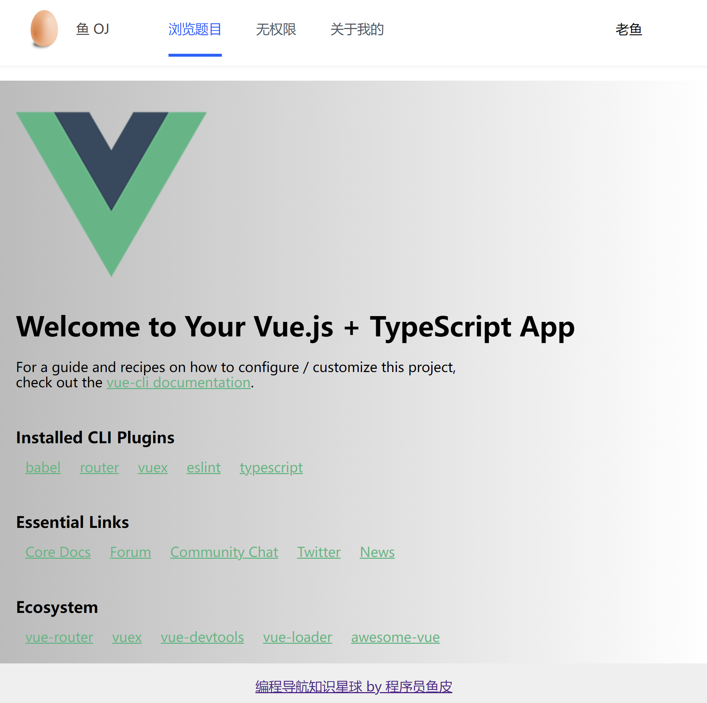
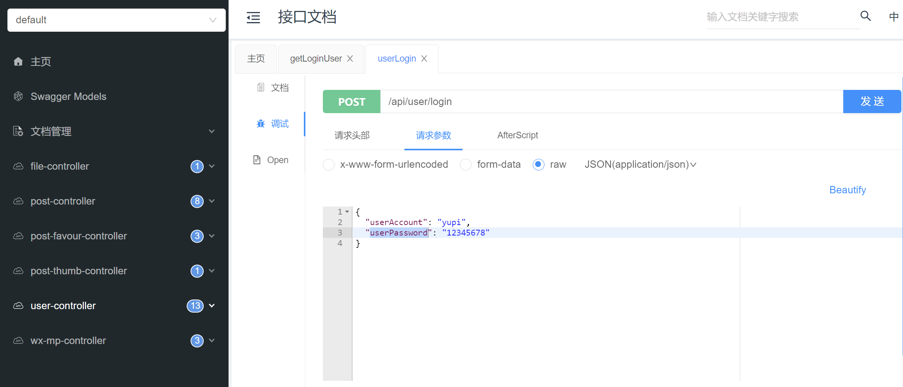

## 项目介绍

OJ = Online Judge 在线判题评测系统

用户可以选择题目，在线做题，编写代码并且提交代码；系统会对用户提交的代码，根据我们出题人设置的答案，来判断用户的提交结果是否正确。

ACM（程序设计竞赛），也是需要依赖判题系统来检测参赛者的答案是否合理



OJ 系统最大的难点在于 **判题系统**

用于在线评测编程题目代码的系统，能够根据用户提交的代码、出题人预先设置的题目输入和输出用例，进行编译代码、运行代码、判断代码运行结果是否正确。

判题系统作为一个开放 API 提供给大家，便于开发者开发自己的 OJ 系统。

## OJ 系统的常用概念

ac 表示你的题目通过，结果正确

题目限制：时间限制、内存限制

题目介绍

题目输入

题目输出

题目输入用例

题目输出用例

普通测评：管理员设置题目的输入和输出用例，比如我输入 1，你要输出 2 才是正确的；交给判题机去执行用户的代码，给用户的代码喂输入用例，比如 1，看用户程序的执行结果是否和标准答案的输出一致。

（比对用例文件）

特殊测评（SPJ）：管理员设置题目的输入和输出，比如我输入 1，用户的答案只要是 > 0 或 < 2 都是正确的；特判程序，不是通过对比用例文件是否一致这种死板的程序来检验，而是要专门根据这道题目写一个特殊的判断程序，程序接收题目的输入（1）、标准输出用例（2）、用户的结果（1.5） ，特判程序根据这些值来比较是否正确。

交互测评：让用户输入一个例子，就给一个输出结果，交互比较灵活，没办法通过简单的、死板的输入输出文件来搞定

------


不能让用户随便引入包、随便遍历、暴力破解，需要使用正确的算法。 => 安全性

判题过程是异步的 => 异步化

提交之后，会生成一个提交记录，有运行的结果以及运行信息（时间限制、内存限制）

## 为什么带大家做这个项目？

1. 这个项目网上教程很少，基本上找不到教程
2. 比较新颖，写在简历上会有区分度、有亮点（人家写外卖，你写 OJ）
3. 能学到东西，相比于传统的 CRUD 来讲，这个项目的 CRUD 成分很少，更多的在于一些编程思想、计算机基础、架构设计方面的知识
4. 复杂度 “高”，很多同学觉得 OJ 很难做，一起来攻克它
5. 可扩展性非常强

## 复习做项目的流程

1. 项目介绍、项目调研、需求分析
2. 核心业务流程
3. 项目要做的功能（功能模块）
4. 技术选型（技术预研）
5. 项目初始化
6. 项目开发
7. 测试
8. 优化
9. 代码提交、代码审核
10. 产品验收
11. 上线

写文档、持续调研、持续记录总结

## 现有系统调研

https://github.com/HimitZH/HOJ（适合学习）

https://github.com/QingdaoU/OnlineJudge（python，不好学，很成熟）

https://github.com/hzxie/voj（星星没那么多，没那么成熟，但相对好学）

https://github.com/vfleaking/uoj（php 实现的）

https://github.com/zhblue/hustoj（成熟，但是 php）

https://github.com/hydro-dev/Hydro（功能强大，Node.js 实现）

## 实现核心

1）权限校验

谁能提代码，谁不能提代码

**2）代码沙箱（安全沙箱）**

用户代码藏毒：写个木马文件、修改系统权限

沙箱：隔离的、安全的环境，用户的代码不会影响到沙箱之外的系统的运行

资源分配：系统的内存就 2 个 G，用户疯狂占用资源占满你的内存，其他人就用不了了。所以要限制用户程序的占用资源。

3）判题规则

题目用例的比对，结果的验证

4）任务调度

服务器资源有限，用户要排队，按照顺序去依次执行判题，而不是直接拒绝

## 核心业务流程


> 为啥要编译？ 因为有些语言不编译不能运行


判题服务：获取题目信息、预计的输入输出结果，返回给主业务后端：用户的答案是否正确

代码沙箱：只负责运行代码，给出结果，不管什么结果是正确的。

**实现了解耦**

## 功能

1. 题目模块

   1. 创建题目（管理员）
   2. 删除题目（管理员）
   3. 修改题目（管理员）
   4. 搜索题目（用户）
   5. 在线做题
   6. 提交题目代码
   7. 

2. 用户模块

   1. 注册
   2. 登录
   3. 

3. 判题模块

   1. 提交判题（结果是否正确与错误）
   2. 错误处理（内存溢出、安全性、超时）
   3. **自主实现** 代码沙箱（安全沙箱）
   4. 开放接口（提供一个独立的新服务）
   5. 

   

## 项目扩展思路

1. 支持多种语言
2. Remote Judge
3. 完善的评测功能：普通测评、特殊测评、交互测评、在线自测、子任务分组评测、文件IO
4. 统计分析用户判题记录
5. 权限校验

## 技术选型

前后端全栈，所有都有，每行代码都是直播

前端：Vue3、Arco Design 组件库、手撸项目模板、在线代码编辑器、在线文档浏览

Java 进程控制、Java 安全管理器、部分 JVM 知识点

虚拟机（云服务器）、Docker（代码沙箱实现）

Spring Cloud 微服务 、消息队列、多种设计模式

## 架构设计


## 直播计划

1. 介绍 OJ 系统概念、介绍 OJ 原理、介绍做项目流程、介绍需求分析、技术选型、架构设计、主流实现方案、前后端项目初始化、前端通用项目模板的搭建
2. 主业务流程的前后端开发（争取把代码沙箱之外的全部搞定）
3. 专攻代码沙箱（自主实现，不止一种实现方案，层层递进，通过实战用例来进行安全优化）
4. 系统优化（微服务改造、系统扩展思路）

**9 月前一定搞定！**

## 主流的 OJ 系统实现方案

开发原则：能用别人现成的，就不要自己写

### 1、用现成的 OJ 系统

网上有很多开源的 OJ 项目，比如青岛 OJ、HustOJ 等，可以直接下载开源代码自己部署。

比较推荐的是 judge0，这是一个非常成熟的商业 OJ 项目，支持 60 多种编程语言！

> 代码：https://github.com/judge0/judge0

### 2、用现成的服务

如果你不希望完整部署一套大而全的代码，只是想复用他人已经实现的、最复杂的判题逻辑，那么可以直接使用现成的 **判题 API** 、或者现成的 **代码沙箱** 等服务。

比如 judge0 提供的判题 API，非常方便易用。只需要通过 HTTP 调用 submissions 判题接口，把用户的代码、输入值、预期的执行结果作为请求参数发送给 judge0 的服务器，它就能自动帮你编译执行程序，并且返回程序的运行结果。

如下图，发送了一段打印 "hello world" 的程序，得到了程序执行的时间、状态等：


> API 的作用：接受代码、返回执行结果

Judge0 API 地址：https://rapidapi.com/judge0-official/api/judge0-ce

官方文档：https://ce.judge0.com/#submissions-submission-post

#### 流程

1. 先注册
2. 再开通订阅
3. 然后测试 language 接口
4. 测试执行代码接口 submissions

示例接口参数：

```json
{
  "source_code": "#include <stdio.h>\n\nint main(void) {\n  char name[10];\n  scanf(\"%s\", name);\n  printf(\"hello, %s\n\", name);\n  return 0;\n}",
  "language_id": "4",
  "stdin": "Judge0",
  "expected_output": "hello, Judge0"
}
```

预期返回：

```json
{
  "source_code": "includestdiohintmainvoidcharname10scanfsnameprintfhellosname\nreturn0=\n",
  "language_id": 76,
  "stdin": "Judgew==\n",
  "expected_output": "helloJudge0=\n",
  "stdout": null,
  "status_id": 6,
  "created_at": "2023-07-27T13:50:30.433Z",
  "finished_at": "2023-07-27T13:50:31.022Z",
  "time": null,
  "memory": null,
  "stderr": null,
  "token": "8be000ad-2edb-4262-b367-7095a694e028",
  "number_of_runs": 1,
  "cpu_time_limit": "5.0",
  "cpu_extra_time": "1.0",
  "wall_time_limit": "10.0",
  "memory_limit": 128000,
  "stack_limit": 64000,
  "max_processes_and_or_threads": 60,
  "enable_per_process_and_thread_time_limit": false,
  "enable_per_process_and_thread_memory_limit": false,
  "max_file_size": 1024,
  "compile_output": "bWFpbi5jcHA6MToxOiBlcnJvcjogc291cmNlIGZpbGUgaXMgbm90IHZhbGlk\nIFVURi04Cjw4QT53JTxCOT48VSswNUVDPjxCNT7YqDw4Nj4p7ZmoPEE3PjxC\nRT48ODg+PDlEPnI8VSswMDE2PjxBQj48OUQ+PEE5Pjw5RT48RDc+SzxVKzAw\nMUM+anfsnak8OUU+PEE2PjxCOD48QTc+PEI1PjxGOD5ePDk2PlosPDlEPjxB\nOT48OUU+PEFEPjxFQj5uPEFFPn0KXgptYWluLmNwcDoxOjI6IGVycm9yOiB1\nbmtub3duIHR5cGUgbmFtZSAndycKPDhBPnclPEI5PjxVKzA1RUM+PEI1Ptio\nPDg2Pintmag8QTc+PEJFPjw4OD48OUQ+cjxVKzAwMTY+PEFCPjw5RD48QTk+\nPDlFPjxENz5LPFUrMDAxQz5qd+ydqTw5RT48QTY+PEI4PjxBNz48QjU+PEY4\nPl48OTY+Wiw8OUQ+PEE5Pjw5RT48QUQ+PEVCPm48QUU+fQogICAgXgptYWlu\nLmNwcDoxOjM6IGVycm9yOiBleHBlY3RlZCB1bnF1YWxpZmllZC1pZAo8OEE+\ndyU8Qjk+PFUrMDVFQz48QjU+2Kg8ODY+Ke2ZqDxBNz48QkU+PDg4Pjw5RD5y\nPFUrMDAxNj48QUI+PDlEPjxBOT48OUU+PEQ3Pks8VSswMDFDPmp37J2pPDlF\nPjxBNj48Qjg+PEE3PjxCNT48Rjg+Xjw5Nj5aLDw5RD48QTk+PDlFPjxBRD48\nRUI+bjxBRT59CiAgICAgXgptYWluLmNwcDoxOjQ6IGVycm9yOiBzb3VyY2Ug\nZmlsZSBpcyBub3QgdmFsaWQgVVRGLTgKPDhBPnclPEI5PjxVKzA1RUM+PEI1\nPtioPDg2Pintmag8QTc+PEJFPjw4OD48OUQ+cjxVKzAwMTY+PEFCPjw5RD48\nQTk+PDlFPjxENz5LPFUrMDAxQz5qd+ydqTw5RT48QTY+PEI4PjxBNz48QjU+\nPEY4Pl48OTY+Wiw8OUQ+PEE5Pjw5RT48QUQ+PEVCPm48QUU+fQogICAgICBe\nCm1haW4uY3BwOjE6NzogZXJyb3I6IHNvdXJjZSBmaWxlIGlzIG5vdCB2YWxp\nZCBVVEYtOAo8OEE+dyU8Qjk+PFUrMDVFQz48QjU+2Kg8ODY+Ke2ZqDxBNz48\nQkU+PDg4Pjw5RD5yPFUrMDAxNj48QUI+PDlEPjxBOT48OUU+PEQ3Pks8VSsw\nMDFDPmp37J2pPDlFPjxBNj48Qjg+PEE3PjxCNT48Rjg+Xjw5Nj5aLDw5RD48\nQTk+PDlFPjxBRD48RUI+bjxBRT59CiAgICAgICAgICAgICAgICAgIF4KbWFp\nbi5jcHA6MToxMDogZXJyb3I6IHNvdXJjZSBmaWxlIGlzIG5vdCB2YWxpZCBV\nVEYtOAo8OEE+dyU8Qjk+PFUrMDVFQz48QjU+2Kg8ODY+Ke2ZqDxBNz48QkU+\nPDg4Pjw5RD5yPFUrMDAxNj48QUI+PDlEPjxBOT48OUU+PEQ3Pks8VSswMDFD\nPmp37J2pPDlFPjxBNj48Qjg+PEE3PjxCNT48Rjg+Xjw5Nj5aLDw5RD48QTk+\nPDlFPjxBRD48RUI+bjxBRT59CiAgICAgICAgICAgICAgICAgICAgICAgXgpt\nYWluLmNwcDoxOjE1OiBlcnJvcjogc291cmNlIGZpbGUgaXMgbm90IHZhbGlk\nIFVURi04Cjw4QT53JTxCOT48VSswNUVDPjxCNT7YqDw4Nj4p7ZmoPEE3PjxC\nRT48ODg+PDlEPnI8VSswMDE2PjxBQj48OUQ+PEE5Pjw5RT48RDc+SzxVKzAw\nMUM+anfsnak8OUU+PEE2PjxCOD48QTc+PEI1PjxGOD5ePDk2PlosPDlEPjxB\nOT48OUU+PEFEPjxFQj5uPEFFPn0KICAgICAgICAgICAgICAgICAgICAgICAg\nICAgICAgXgptYWluLmNwcDoxOjE2OiBlcnJvcjogc291cmNlIGZpbGUgaXMg\nbm90IHZhbGlkIFVURi04Cjw4QT53JTxCOT48VSswNUVDPjxCNT7YqDw4Nj4p\n7ZmoPEE3PjxCRT48ODg+PDlEPnI8VSswMDE2PjxBQj48OUQ+PEE5Pjw5RT48\nRDc+SzxVKzAwMUM+anfsnak8OUU+PEE2PjxCOD48QTc+PEI1PjxGOD5ePDk2\nPlosPDlEPjxBOT48OUU+PEFEPjxFQj5uPEFFPn0KICAgICAgICAgICAgICAg\nICAgICAgICAgICAgICAgICAgIF4KbWFpbi5jcHA6MToxNzogZXJyb3I6IHNv\ndXJjZSBmaWxlIGlzIG5vdCB2YWxpZCBVVEYtOAo8OEE+dyU8Qjk+PFUrMDVF\nQz48QjU+2Kg8ODY+Ke2ZqDxBNz48QkU+PDg4Pjw5RD5yPFUrMDAxNj48QUI+\nPDlEPjxBOT48OUU+PEQ3Pks8VSswMDFDPmp37J2pPDlFPjxBNj48Qjg+PEE3\nPjxCNT48Rjg+Xjw5Nj5aLDw5RD48QTk+PDlFPjxBRD48RUI+bjxBRT59CiAg\nICAgICAgICAgICAgICAgICAgICAgICAgICAgICAgICAgICAgXgptYWluLmNw\ncDoxOjE4OiBlcnJvcjogc291cmNlIGZpbGUgaXMgbm90IHZhbGlkIFVURi04\nCjw4QT53JTxCOT48VSswNUVDPjxCNT7YqDw4Nj4p7ZmoPEE3PjxCRT48ODg+\nPDlEPnI8VSswMDE2PjxBQj48OUQ+PEE5Pjw5RT48RDc+SzxVKzAwMUM+anfs\nnak8OUU+PEE2PjxCOD48QTc+PEI1PjxGOD5ePDk2PlosPDlEPjxBOT48OUU+\nPEFEPjxFQj5uPEFFPn0KICAgICAgICAgICAgICAgICAgICAgICAgICAgICAg\nICAgICAgICAgICAgXgptYWluLmNwcDoxOjIxOiBlcnJvcjogc291cmNlIGZp\nbGUgaXMgbm90IHZhbGlkIFVURi04Cjw4QT53JTxCOT48VSswNUVDPjxCNT7Y\nqDw4Nj4p7ZmoPEE3PjxCRT48ODg+PDlEPnI8VSswMDE2PjxBQj48OUQ+PEE5\nPjw5RT48RDc+SzxVKzAwMUM+anfsnak8OUU+PEE2PjxCOD48QTc+PEI1PjxG\nOD5ePDk2PlosPDlEPjxBOT48OUU+PEFEPjxFQj5uPEFFPn0KICAgICAgICAg\nICAgICAgICAgICAgICAgICAgICAgICAgICAgICAgICAgICAgICAgICAgICAg\nIF4KbWFpbi5jcHA6MToyMjogZXJyb3I6IHNvdXJjZSBmaWxlIGlzIG5vdCB2\nYWxpZCBVVEYtOAo8OEE+dyU8Qjk+PFUrMDVFQz48QjU+2Kg8ODY+Ke2ZqDxB\nNz48QkU+PDg4Pjw5RD5yPFUrMDAxNj48QUI+PDlEPjxBOT48OUU+PEQ3Pks8\nVSswMDFDPmp37J2pPDlFPjxBNj48Qjg+PEE3PjxCNT48Rjg+Xjw5Nj5aLDw5\nRD48QTk+PDlFPjxBRD48RUI+bjxBRT59CiAgICAgICAgICAgICAgICAgICAg\nICAgICAgICAgICAgICAgICAgICAgICAgICAgICAgICAgICAgICAgXgptYWlu\nLmNwcDoxOjIzOiBlcnJvcjogc291cmNlIGZpbGUgaXMgbm90IHZhbGlkIFVU\nRi04Cjw4QT53JTxCOT48VSswNUVDPjxCNT7YqDw4Nj4p7ZmoPEE3PjxCRT48\nODg+PDlEPnI8VSswMDE2PjxBQj48OUQ+PEE5Pjw5RT48RDc+SzxVKzAwMUM+\nanfsnak8OUU+PEE2PjxCOD48QTc+PEI1PjxGOD5ePDk2PlosPDlEPjxBOT48\nOUU+PEFEPjxFQj5uPEFFPn0KICAgICAgICAgICAgICAgICAgICAgICAgICAg\nICAgICAgICAgICAgICAgICAgICAgICAgICAgICAgICAgICAgXgptYWluLmNw\ncDoxOjI0OiBlcnJvcjogc291cmNlIGZpbGUgaXMgbm90IHZhbGlkIFVURi04\nCjw4QT53JTxCOT48VSswNUVDPjxCNT7YqDw4Nj4p7ZmoPEE3PjxCRT48ODg+\nPDlEPnI8VSswMDE2PjxBQj48OUQ+PEE5Pjw5RT48RDc+SzxVKzAwMUM+anfs\nnak8OUU+PEE2PjxCOD48QTc+PEI1PjxGOD5ePDk2PlosPDlEPjxBOT48OUU+\nPEFEPjxFQj5uPEFFPn0KICAgICAgICAgICAgICAgICAgICAgICAgICAgICAg\nICAgICAgICAgICAgICAgICAgICAgICAgICAgICAgICAgICAgIF4KbWFpbi5j\ncHA6MToyNTogZXJyb3I6IHNvdXJjZSBmaWxlIGlzIG5vdCB2YWxpZCBVVEYt\nOAo8OEE+dyU8Qjk+PFUrMDVFQz48QjU+2Kg8ODY+Ke2ZqDxBNz48QkU+PDg4\nPjw5RD5yPFUrMDAxNj48QUI+PDlEPjxBOT48OUU+PEQ3Pks8VSswMDFDPmp3\n7J2pPDlFPjxBNj48Qjg+PEE3PjxCNT48Rjg+Xjw5Nj5aLDw5RD48QTk+PDlF\nPjxBRD48RUI+bjxBRT59CiAgICAgICAgICAgICAgICAgICAgICAgICAgICAg\nICAgICAgICAgICAgICAgICAgICAgICAgICAgICAgICAgICAgICAgICAgXgpt\nYWluLmNwcDoxOjMzOiBlcnJvcjogc291cmNlIGZpbGUgaXMgbm90IHZhbGlk\nIFVURi04Cjw4QT53JTxCOT48VSswNUVDPjxCNT7YqDw4Nj4p7ZmoPEE3PjxC\nRT48ODg+PDlEPnI8VSswMDE2PjxBQj48OUQ+PEE5Pjw5RT48RDc+SzxVKzAw\nMUM+anfsnak8OUU+PEE2PjxCOD48QTc+PEI1PjxGOD5ePDk2PlosPDlEPjxB\nOT48OUU+PEFEPjxFQj5uPEFFPn0KICAgICAgICAgICAgICAgICAgICAgICAg\nICAgICAgICAgICAgICAgICAgICAgICAgICAgICAgICAgICAgICAgICAgICAg\nICAgICAgICAgICAgICAgICAgIF4KbWFpbi5jcHA6MTozNDogZXJyb3I6IHNv\ndXJjZSBmaWxlIGlzIG5vdCB2YWxpZCBVVEYtOAo8OEE+dyU8Qjk+PFUrMDVF\nQz48QjU+2Kg8ODY+Ke2ZqDxBNz48QkU+PDg4Pjw5RD5yPFUrMDAxNj48QUI+\nPDlEPjxBOT48OUU+PEQ3Pks8VSswMDFDPmp37J2pPDlFPjxBNj48Qjg+PEE3\nPjxCNT48Rjg+Xjw5Nj5aLDw5RD48QTk+PDlFPjxBRD48RUI+bjxBRT59CiAg\nICAgICAgICAgICAgICAgICAgICAgICAgICAgICAgICAgICAgICAgICAgICAg\nICAgICAgICAgICAgICAgICAgICAgICAgICAgICAgICAgICAgICAgICAgICAg\nXgptYWluLmNwcDoxOjM1OiBlcnJvcjogc291cmNlIGZpbGUgaXMgbm90IHZh\nbGlkIFVURi04Cjw4QT53JTxCOT48VSswNUVDPjxCNT7YqDw4Nj4p7ZmoPEE3\nPjxCRT48ODg+PDlEPnI8VSswMDE2PjxBQj48OUQ+PEE5Pjw5RT48RDc+SzxV\nKzAwMUM+anfsnak8OUU+PEE2PjxCOD48QTc+PEI1PjxGOD5ePDk2PlosPDlE\nPjxBOT48OUU+PEFEPjxFQj5uPEFFPn0KICAgICAgICAgICAgICAgICAgICAg\nICAgICAgICAgICAgICAgICAgICAgICAgICAgICAgICAgICAgICAgICAgICAg\nICAgICAgICAgICAgICAgICAgICAgICAgICAgICAgXgptYWluLmNwcDoxOjM2\nOiBlcnJvcjogc291cmNlIGZpbGUgaXMgbm90IHZhbGlkIFVURi04Cjw4QT53\nJTxCOT48VSswNUVDPjxCNT7YqDw4Nj4p7ZmoPEE3PjxCRT48ODg+PDlEPnI8\nVSswMDE2PjxBQj48OUQ+PEE5Pjw5RT48RDc+SzxVKzAwMUM+anfsnak8OUU+\nPEE2PjxCOD48QTc+PEI1PjxGOD5ePDk2PlosPDlEPjxBOT48OUU+PEFEPjxF\nQj5uPEFFPn0KICAgICAgICAgICAgICAgICAgICAgICAgICAgICAgICAgICAg\nICAgICAgICAgICAgICAgICAgICAgICAgICAgICAgICAgICAgICAgICAgICAg\nICAgICAgICAgICAgICAgICAgIF4KZmF0YWwgZXJyb3I6IHRvbyBtYW55IGVy\ncm9ycyBlbWl0dGVkLCBzdG9wcGluZyBub3cgWy1mZXJyb3ItbGltaXQ9XQoy\nMCBlcnJvcnMgZ2VuZXJhdGVkLgo=\n",
  "exit_code": null,
  "exit_signal": null,
  "message": null,
  "wall_time": null,
  "compiler_options": null,
  "command_line_arguments": null,
  "redirect_stderr_to_stdout": false,
  "callback_url": null,
  "additional_files": null,
  "enable_network": false,
  "status": {
    "id": 6,
    "description": "Compilation Error"
  },
  "language": {
    "id": 76,
    "name": "C++ (Clang 7.0.1)"
  }
}
```

### 3、自主开发

这种方式就不多说了，判题服务和代码沙箱都要自己实现，适合学习，但不适用于商业项目。我这次带大家做的 OJ 系统，就选择了自主开发，主打一个学习。

### 4、把 AI 来当做代码沙箱

现在 AI 的能力已经十分强大了，我们可以把各种本来很复杂的功能直接交给 AI 来实现。

比如把 AI 当做代码沙箱，我们直接扔给他一段代码、输入参数，问他能否得到预期的结果，就实现了在线判题逻辑！

如下图：


之前带大家做的 [智能 BI 项目](https://www.code-nav.cn/course/1790980531403927553) ，就是把 AI 当做了智能数据分析师，来生成图表和分析结论。

只要你脑洞够大，AI + 编程 = 无限的可能~

### 5、移花接木

这种方式最有意思、也最 “缺德”。很多同学估计想不到。

那就是可以通过让程序来操作模拟浏览器的方式，用别人已经开发好的 OJ 系统来帮咱们判题。

比如使用 Puppeteer + 无头浏览器，把咱们系统用户提交的代码，像人一样输入到别人的 OJ 网页中，让程序点击提交按钮，并且等别人的 OJ 系统返回判题结果后，再把这个结果返回给我们自己的用户。

这种方式的缺点就是把核心流程交给了别人，如果别人服务挂了，你的服务也就挂了；而且别人 OJ 系统不支持的题目，可能你也支持不了。

## 前端项目初始化 - 通用模板实现

> 自主打造一套前端开发项目模板！

### 确认环境！！！

nodeJS 版本：v18.16.0 或 16

检测命令：

```shell
node -v
```

切换和管理 node 版本的工具：https://github.com/nvm-sh/nvm

npm 版本：9.5.1

```shell
npm -v
```

### 初始化

使用 vue-cli 脚手架：https://cli.vuejs.org/zh/

安装脚手架工具：

```shell
npm install -g @vue/cli
```

检测是否安装成功：

```shell
vue -V
```

如果找不到命令，那么建议去重新到安装 npm，重新帮你配置环境变量。

创建项目：

```shell
vue create yuoj-frontend
```

运行项目，能运行就成功了

### 前端工程化配置

脚手架已经帮我们配置了代码美化、自动校验、格式化插件等，无需再自行配置

但是需要在 webstorm 里开启代码美化插件：


在 vue 文件中执行格式化快捷键，不报错，表示配置工程化成功

脚手架自动整合了 vue-router

#### 自己整合

代码规范：https://eslint.org/docs/latest/use/getting-started

代码美化：https://prettier.io/docs/en/install.html

直接整合：https://github.com/prettier/eslint-plugin-prettier#recommended-configuration（包括了 https://github.com/prettier/eslint-config-prettier#installation）

### 引入组件

> Vue Router 路由组件已自动引入，无需再引入：https://router.vuejs.org/zh/introduction.html

组件库：https://arco.design/vue

快速上手：https://arco.design/vue/docs/start

执行安装：

```shell
npm install --save-dev @arco-design/web-vue
```

改变 main.ts：

```typescript
▼typescriptimport { createApp } from "vue";
import App from "./App.vue";
import ArcoVue from "@arco-design/web-vue";
import "@arco-design/web-vue/dist/arco.css";
import router from "./router";
import store from "./store";

createApp(App).use(ArcoVue).use(store).use(router).mount("#app");
```

引入一个组件，如果显示出来，就表示引入成功

### 项目通用布局

新建一个布局， 在 app.vue 中引入

app.vue 代码如下：

```vue
<div id="app">
  <BasicLayout />
</div>
```

选用 arco design 的 layout 组件（https://arco.design/vue/component/layout）

先把上中下布局编排好，然后再填充内容：



#### 实现通用路由菜单

菜单组件：https://arco.design/vue/component/menu

目标：根据路由配置信息，自动生成菜单内容。实现更通用、更自动的菜单配置。

步骤：

1）提取通用路由文件

2）菜单组件读取路由，动态渲染菜单项

3）绑定跳转事件

4）同步路由的更新到菜单项高亮

同步高亮原理：首先点击菜单项 => 触发点击事件，跳转更新路由 => 更新路由后，同步去更新菜单栏的高亮状态。

使用 Vue Router 的 afterEach 路由钩子实现：

```javascript
const router = useRouter();

// 默认主页
const selectedKeys = ref(["/"]);

// 路由跳转后，更新选中的菜单项
router.afterEach((to, from, failure) => {
  selectedKeys.value = [to.path];
});
```

### 全局状态管理

vuex：https://vuex.vuejs.org/zh/guide/（vue-cli 脚手架已自动引入）

什么是全局状态管理？

所有页面全局共享的变量，而不是局限在某一个页面中。

适合作为全局状态的数据：已登录用户信息（每个页面几乎都要用）

Vuex 的本质：给你提供了一套增删改查全局变量的 API，只不过可能多了一些功能（比如时间旅行）


可以直接参考购物车示例：https://github.com/vuejs/vuex/tree/main/examples/classic/shopping-cart

state：存储的状态信息，比如用户信息

mutation（尽量同步）：定义了对变量进行增删改（更新）的方法

actions（支持异步）：执行异步操作，并且触发 mutation 的更改（actions 调用 mutation）

modules（模块）：把一个大的 state（全局变量）划分为多个小模块，比如 user 专门存用户的状态信息

#### 实现

先在 store 目录下定义 user 模块，存储用户信息：

```typescript
▼typescript// initial state
import { StoreOptions } from "vuex";

export default {
  namespaced: true,
  state: () => ({
    loginUser: {
      userName: "未登录",
    },
  }),
  actions: {
    getLoginUser({ commit, state }, payload) {
      commit("updateUser", { userName: "鱼皮" });
    },
  },
  mutations: {
    updateUser(state, payload) {
      state.loginUser = payload;
    },
  },
} as StoreOptions<any>;
```

然后在 store 目录下定义 index.ts 文件，导入 user 模块：

```typescript
▼typescriptimport { createStore } from "vuex";
import user from "./user";

export default createStore({
  mutations: {},
  actions: {},
  modules: {
    user,
  },
});
```

在 Vue 页面中可以获取已存储的状态变量：

```tsx
▼tsxconst store = useStore();
store.state.user?.loginUser
```

在 Vue 页面中可以修改状态变量：

> 使用 dispatch 来调用之前定义好的 actions

```typescript
▼typescriptstore.dispatch("user/getLoginUser", {
  userName: "鱼皮",
});
```

### 全局权限管理

目标：能够直接以一套通用的机制，去定义哪个页面需要那些权限。而不用每个页面独立去判断权限，提高效率。

思路：

1. 在路由配置文件， 定义某个路由的访问权限
2. 在全局页面组件 app.vue 中，绑定一个全局路由监听。每次访问页面时，根据用户要访问页面的路由信息，先判断用户是否有对应的访问权限。
3. 如果有，跳转到原页面；如果没有，拦截或跳转到 401 鉴权或登录页

示例代码如下：

```typescript
▼typescriptconst router = useRouter();
const store = useStore();

router.beforeEach((to, from, next) => {
  // 仅管理员可见，判断当前用户是否有权限
  if (to.meta?.access === "canAdmin") {
    if (store.state.user.loginUser?.role !== "admin") {
      next("/noAuth");
      return;
    }
  }
  next();
});
```

### 优化页面布局

1、底部 footer 布局优化

2、优化 content、globalHeader 的样式

3、优化导航栏用户名称的换行

### 通用导航栏组件 - 根据配置控制菜单的显隐

1）routes.ts 给路由新增一个标志位，用于判断路由是否显隐

```javascript
  {
    path: "/hide",
    name: "隐藏页面",
    component: HomeView,
    meta: {
      hideInMenu: true,
    },
  },
```

2）不要用 v-for + v-if 去条件渲染元素，这样会先循环所有的元素，导致性能的浪费

推荐：先过滤只需要展示的元素数组

```typescript
▼typescript// 展示在菜单的路由数组
const visibleRoutes = routes.filter((item, index) => {
  if (item.meta?.hideInMenu) {
    return false;
  }
  return true;
});
```

### 根据权限隐藏菜单

需求：只有具有权限的菜单，才对用户可见

原理：类似上面的控制路由显示隐藏，只要判断用户没有这个权限，就直接过滤掉

1）新建 access 目录，专门用一个文件来定义权限

```typescript
▼typescript/**
 * 权限定义
 */
const ACCESS_ENUM = {
  NOT_LOGIN: "notLogin",
  USER: "user",
  ADMIN: "admin",
};

export default ACCESS_ENUM;
```

2）定义一个公用的权限校验方法

为什么？因为菜单组件中要判断权限、权限拦截也要用到权限判断功能，所以抽离成公共方法

创建 checkAccess.ts 文件，专门定义检测权限的函数：

```typescript
▼typescriptimport ACCESS_ENUM from "@/access/accessEnum";

/**
 * 检查权限（判断当前登录用户是否具有某个权限）
 * @param loginUser 当前登录用户
 * @param needAccess 需要有的权限
 * @return boolean 有无权限
 */
const checkAccess = (loginUser: any, needAccess = ACCESS_ENUM.NOT_LOGIN) => {
  // 获取当前登录用户具有的权限（如果没有 loginUser，则表示未登录）
  const loginUserAccess = loginUser?.userRole ?? ACCESS_ENUM.NOT_LOGIN;
  if (needAccess === ACCESS_ENUM.NOT_LOGIN) {
    return true;
  }
  // 如果用户登录才能访问
  if (needAccess === ACCESS_ENUM.USER) {
    // 如果用户没登录，那么表示无权限
    if (loginUserAccess === ACCESS_ENUM.NOT_LOGIN) {
      return false;
    }
  }
  // 如果需要管理员权限
  if (needAccess === ACCESS_ENUM.ADMIN) {
    // 如果不为管理员，表示无权限
    if (loginUserAccess !== ACCESS_ENUM.ADMIN) {
      return false;
    }
  }
  return true;
};

export default checkAccess;
```

3）修改 GlobalHeader 动态菜单组件，根据权限来过滤菜单

注意，这里使用计算属性，是为了当登录用户信息发生变更时，触发菜单栏的重新渲染，展示新增权限的菜单项

```typescript
▼typescriptconst visibleRoutes = computed(() => {
  return routes.filter((item, index) => {
    if (item.meta?.hideInMenu) {
      return false;
    }
    // 根据权限过滤菜单
    if (
      !checkAccess(store.state.user.loginUser, item?.meta?.access as string)
    ) {
      return false;
    }
    return true;
  });
});
```

### 全局项目入口

app.vue 中预留一个可以编写全局初始化逻辑的代码：

```typescript
▼typescript/**
 * 全局初始化函数，有全局单次调用的代码，都可以写到这里
 */
const doInit = () => {
  console.log("hello 欢迎来到我的项目");
};

onMounted(() => {
  doInit();
});
```

## 后端项目初始化

先把通用的后端框架跑起来。

1）从星球代码库下载 springboot-init 万用模板（已经在本地的话直接复制）

2）`ctrl+shift+R`全局替换 springboot-init 为项目名（yuoj-backend）

3）全局替换springbootinit 包名为新的包名（yuoj）

4）修改 springbootinit 文件夹的名称为新的包名对应的名称（yuoj）

5）本地新建数据库，直接执行 sql/create_table.sql 脚本，修改库名为 yuoj，执行即可

6）改 application.yml 配置，修改 MySQL 数据库的连接库名、账号密码，端口号（8121）

### 初始化模板讲解

1）先阅读 README.md

2）sql/create_table.sql 定义了数据库的初始化建库建表语句

3）sql/post_es_mapping.json 帖子表在 ES 中的建表语句

4）aop：用于全局权限校验、全局日志记录

5）common：万用的类，比如通用响应类

6）config：用于接收 application.yml 中的参数，初始化一些客户端的配置类（比如对象存储客户端）

7）constant：定义常量

8）controller：接受请求

9）esdao：类似 mybatis 的 mapper，用于操作 ES

10）exception：异常处理相关

11）job：任务相关（定时任务、单次任务）

12）manager：服务层（一般是定义一些公用的服务、对接第三方 API 等）

13）mapper：mybatis 的数据访问层，用于操作数据库

14）model：数据模型、实体类、包装类、枚举值

15）service：服务层，用于编写业务逻辑

16）utils：工具类，各种各样公用的方法

17）wxmp：公众号相关的包

18）test：单元测试

19）MainApplication：项目启动入口

20）Dockerfile：用于构建 Docker 镜像

## 前后端联调

问：前端和后端怎么连接起来的？ 接口 / 请求

答：前端发送请求调用后端接口

1）安装请求工具类 Axios

官方文档：https://axios-http.com/docs/intro

代码：

```shell
npm install axios
```

2）编写调用后端的代码

传统情况下，每个请求都要单独编写代码。至少得写一个请求路径

完全不用！！！

直接自动生成即可：https://github.com/ferdikoomen/openapi-typescript-codegen

首先安装：

```shell
npm install openapi-typescript-codegen --save-dev
```

然后执行命令生成代码：

```shell
openapi --input http://localhost:8121/api/v2/api-docs --output ./generated --client axios
```

3）直接使用生成的 Service 代码，直接调用函数发送请求即可，比如获取登录信息

```typescript
▼typescript// 从远程请求获取登录信息
const res = await UserControllerService.getLoginUserUsingGet();
if (res.code === 0) {
  commit("updateUser", res.data);
} else {
  commit("updateUser", {
    ...state.loginUser,
    userRole: ACCESS_ENUM.NOT_LOGIN,
  });
}
```

如果想要自定义请求参数，怎么办？

1）使用代码生成器提供的全局参数修改对象：

```javascript
export const OpenAPI: OpenAPIConfig = {
    BASE: 'http://localhost:3000/api',
    VERSION: '2.0',
    WITH_CREDENTIALS: false,
    CREDENTIALS: 'include',
    TOKEN: undefined,
    USERNAME: undefined,
    PASSWORD: undefined,
    HEADERS: undefined,
    ENCODE_PATH: undefined,
};
```

文档：https://github.com/ferdikoomen/openapi-typescript-codegen/blob/master/docs/openapi-object.md

2）直接定义 axios 请求库的全局参数，比如全局请求响应拦截器

文档：https://axios-http.com/docs/interceptors

示例代码：

```typescript
▼typescript// Add a request interceptor
import axios from "axios";

axios.interceptors.request.use(
  function (config) {
    // Do something before request is sent
    return config;
  },
  function (error) {
    // Do something with request error
    return Promise.reject(error);
  }
);

// Add a response interceptor
axios.interceptors.response.use(
  function (response) {
    console.log("响应", response);
    // Any status code that lie within the range of 2xx cause this function to trigger
    // Do something with response data
    return response;
  },
  function (error) {
    // Any status codes that falls outside the range of 2xx cause this function to trigger
    // Do something with response error
    return Promise.reject(error);
  }
);
```

### 用户登录功能

#### 自动登录

1）在 store\user.ts 编写获取远程登陆用户信息的代码：

```typescript
▼typescript  actions: {
    async getLoginUser({ commit, state }, payload) {
      // 从远程请求获取登录信息
      const res = await UserControllerService.getLoginUserUsingGet();
      if (res.code === 0) {
        commit("updateUser", res.data);
      } else {
        commit("updateUser", {
          ...state.loginUser,
          userRole: ACCESS_ENUM.NOT_LOGIN,
        });
      }
    },
  },
```

2）在哪里去触发 getLoginUser 函数的执行？应当在一个全局的位置

有很多选择：

1. 路由拦截 ✔
2. 全局页面入口 app.vue
3. 全局通用布局（所有页面都共享的组件）
4. 

此处选择第一种方案，可以直接在全局权限管理的路由拦截中判断用户是否已经登录了。

### 全局权限管理优化

1）新建 access\index.ts 文件，把原有的路由拦截、权限校验逻辑放在独立的文件中

优势：只要不引入、就不会开启、不会对项目有影响

2）编写权限管理和自动登录逻辑

如果没登陆过，自动登录：

```typescript
▼typescript
  const loginUser = store.state.user.loginUser;
  // 如果之前没登陆过，自动登录
  if (!loginUser || !loginUser.userRole) {
    // 加 await 是为了等用户登录成功之后，再执行后续的代码
    await store.dispatch("user/getLoginUser");
  }
```

如果用户访问的页面不需要登录，是否需要强制跳转到登录页？

答：不需要

access\index.ts 示例代码：

```typescript
▼typescriptimport router from "@/router";
import store from "@/store";
import ACCESS_ENUM from "@/access/accessEnum";
import checkAccess from "@/access/checkAccess";

router.beforeEach(async (to, from, next) => {
  console.log("登陆用户信息", store.state.user.loginUser);
  const loginUser = store.state.user.loginUser;
  // // 如果之前没登陆过，自动登录
  if (!loginUser || !loginUser.userRole) {
    // 加 await 是为了等用户登录成功之后，再执行后续的代码
    await store.dispatch("user/getLoginUser");
  }
  const needAccess = (to.meta?.access as string) ?? ACCESS_ENUM.NOT_LOGIN;
  // 要跳转的页面必须要登陆
  if (needAccess !== ACCESS_ENUM.NOT_LOGIN) {
    // 如果没登陆，跳转到登录页面
    if (!loginUser || !loginUser.userRole) {
      next(`/user/login?redirect=${to.fullPath}`);
      return;
    }
    // 如果已经登陆了，但是权限不足，那么跳转到无权限页面
    if (!checkAccess(loginUser, needAccess)) {
      next("/noAuth");
      return;
    }
  }
  next();
});
```

### 支持多套布局

1）在 routes 路由文件中新建一套用户路由，使用 vue-router 自带的子路由机制，实现布局和嵌套路由

```typescript
▼typescriptexport const routes: Array<RouteRecordRaw> = [
  {
    path: "/user",
    name: "用户",
    component: UserLayout,
    children: [
      {
        path: "/user/login",
        name: "用户登录",
        component: UserLoginView,
      },
      {
        path: "/user/register",
        name: "用户注册",
        component: UserRegisterView,
      },
    ],
  },
]
```

2）新建 UserLayout、UserLoginView、UserRegisterView 页面，并且在 routes 中引入

3）在 app.vue 根页面文件，根据路由去区分多套布局

```typescript
▼typescript    <template v-if="route.path.startsWith('/user')">
      <router-view />
    </template>
    <template v-else>
      <BasicLayout />
    </template>
```

注意，当前这种 app.vue 中通过 if else 区分布局的方式，不是最优雅的，理想情况下是直接读取 routes.ts，在这个文件中定义多套布局，然后自动使用页面布局。

小扩展：你可以尝试实现上面的思路，并且根据嵌套路由生成嵌套的子菜单。

如下图：


### 登陆页面开发

登陆页面的核心是表单，只需要从组件库中找到表单组件，修改表单字段名称和后端完全匹配就足够了。

界面示例代码：

```html
▼html<a-form
  style="max-width: 480px; margin: 0 auto"
  label-align="left"
  auto-label-width
  :model="form"
  @submit="handleSubmit"
>
  <a-form-item field="userAccount" label="账号">
    <a-input v-model="form.userAccount" placeholder="请输入账号" />
  </a-form-item>
  <a-form-item field="userPassword" tooltip="密码不少于 8 位" label="密码">
    <a-input-password
      v-model="form.userPassword"
      placeholder="请输入密码"
    />
  </a-form-item>
  <a-form-item>
    <a-button type="primary" html-type="submit" style="width: 120px"
      >登录</a-button
    >
  </a-form-item>
</a-form>
```

## 本期成果

前端通用页面布局：



登陆页面：


后端接口文档：



## 本期作业

1. 理解 OJ 系统的概念以及核心流程
2. 开发完成前端初始化项目模板
3. 完成后端项目初始化
4. 实现用户登录功能
5. 自行实现用户注册页面