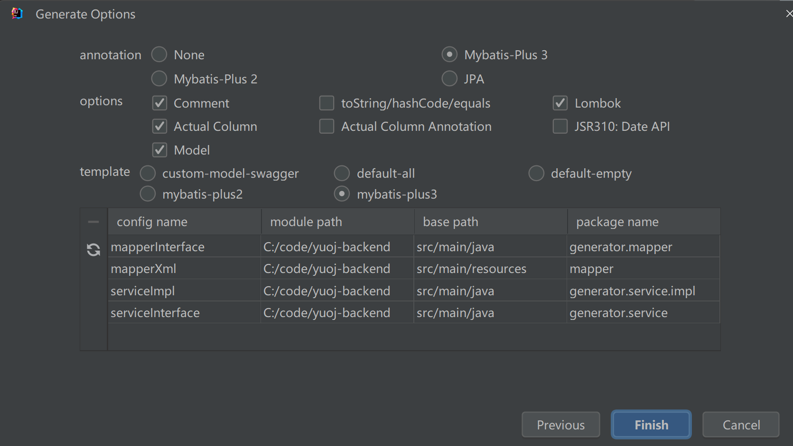
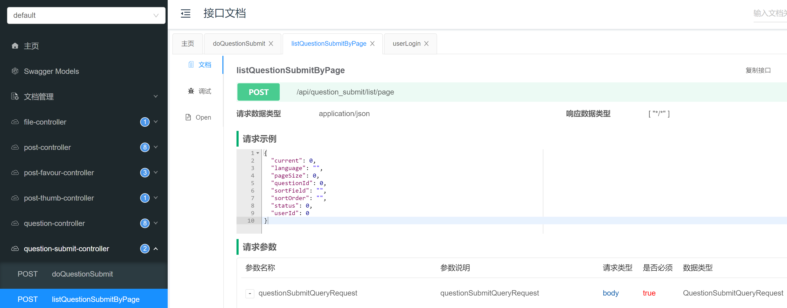

## 友情提示

如果 windows 系统拉取前端代码后报错，请按照此文修改：https://blog.csdn.net/CSDN_YYD_997/article/details/129673984

## 计划

> 本期主打写代码

1. 系统功能的梳理
2. 库表设计（后端）
3. 后端接口开发

## 系统功能的梳理

1. 用户模块

   1. 注册（后端已实现）
   2. 登录（后端已实现，前端已实现）
   3. 

2. 题目模块

   1. 创建题目（管理员）
   2. 删除题目（管理员）
   3. 修改题目（管理员）
   4. 搜索题目（用户）
   5. 在线做题（题目详情页）
   6. 

3. 判题模块

   1. 提交判题（结果是否正确与错误）
   2. 错误处理（内存溢出、安全性、超时）
   3. **自主实现** 代码沙箱（安全沙箱）
   4. 开放接口（提供一个独立的新服务）
   5. 

   

4. 

## 库表设计

### 用户表

只有管理员才能发布和管理题目，普通用户只能看题

```sql
-- 用户表
create table if not exists user
(
    id           bigint auto_increment comment 'id' primary key,
    userAccount  varchar(256)                           not null comment '账号',
    userPassword varchar(512)                           not null comment '密码',
    unionId      varchar(256)                           null comment '微信开放平台id',
    mpOpenId     varchar(256)                           null comment '公众号openId',
    userName     varchar(256)                           null comment '用户昵称',
    userAvatar   varchar(1024)                          null comment '用户头像',
    userProfile  varchar(512)                           null comment '用户简介',
    userRole     varchar(256) default 'user'            not null comment '用户角色：user/admin/ban',
    createTime   datetime     default CURRENT_TIMESTAMP not null comment '创建时间',
    updateTime   datetime     default CURRENT_TIMESTAMP not null on update CURRENT_TIMESTAMP comment '更新时间',
    isDelete     tinyint      default 0                 not null comment '是否删除',
    index idx_unionId (unionId)
) comment '用户' collate = utf8mb4_unicode_ci;
```

### 题目表

题目标题

题目内容：存放题目的介绍、输入输出提示、描述、具体的详情

题目标签（json 数组字符串）：栈、队列、链表、简单、中等、困难

题目答案：管理员 / 用户设置的标准答案

提交数、通过题目的人数等：便于分析统计（可以考虑根据通过率自动给题目打难易度标签）

判题相关字段：

> 如果说题目不是很复杂，用例文件大小不大的话，可以直接存在数据库表里 但是如果用例文件比较大，> 512 KB 建议单独存放在一个文件中，数据库中只保存文件 url（类似存储用户头像）

- 输入用例：1、2
- 输出用例：3、4
- 时间限制
- 内存限制

judgeConfig 判题配置（json 对象）：

- 时间限制 timeLimit
- 内存限制 memoryLimit
- 

judgeCase 判题用例（json 数组）

- 每一个元素是：一个输入用例对应一个输出用例

```json
[
  {
    "input": "1 2",
    "output": "3 4"
  },
  {
    "input": "1 3",
    "output": "2 4"
  }
]
```

------

存 json 的好处：便于扩展，只需要改变对象内部的字段，而不用修改数据库表（可能会影响数据库）

```json
{
  "timeLimit": 1000,
  "memoryLimit": 1000,
  "stackLimit": 1000
}
```

存 json 的前提：

1. 你不需要根据某个字段去倒查这条数据
2. 你的字段含义相关，属于同一类的值
3. 你的字段存储空间占用不能太大

------


其他扩展字段：

- 通过率
- 判题类型

代码：

```sql
-- 题目表
create table if not exists question
(
    id         bigint auto_increment comment 'id' primary key,
    title      varchar(512)                       null comment '标题',
    content    text                               null comment '内容',
    tags       varchar(1024)                      null comment '标签列表（json 数组）',
    answer     text                               null comment '题目答案',
    submitNum  int  default 0 not null comment '题目提交数',
    acceptedNum  int  default 0 not null comment '题目通过数',
    judgeCase text null comment '判题用例（json 数组）',
    judgeConfig text null comment '判题配置（json 对象）',
    thumbNum   int      default 0                 not null comment '点赞数',
    favourNum  int      default 0                 not null comment '收藏数',
    userId     bigint                             not null comment '创建用户 id',
    createTime datetime default CURRENT_TIMESTAMP not null comment '创建时间',
    updateTime datetime default CURRENT_TIMESTAMP not null on update CURRENT_TIMESTAMP comment '更新时间',
    isDelete   tinyint  default 0                 not null comment '是否删除',
    index idx_userId (userId)
) comment '题目' collate = utf8mb4_unicode_ci;
```

### 题目提交表

哪个用户提交了哪道题目，存放判题结果等

提交用户 id：userId

题目 id：questionId

语言：language

用户的代码：code

判题状态：status（0 - 待判题、1 - 判题中、2 - 成功、3 - 失败）

判题信息（判题过程中得到的一些信息，比如程序的失败原因、程序执行消耗的时间、空间）：

judgeInfo（json 对象）

```json
{
  "message": "程序执行信息",
  "time": 1000, // 单位为 ms
  "memory": 1000, // 单位为 kb
}
```

判题信息枚举值：

- Accepted 成功
- Wrong Answer 答案错误
- [Compile Error](http://poj.org/showcompileinfo?solution_id=24259830) 编译错误
- Memory Limit Exceeded 内存溢出
- Time Limit Exceeded 超时
- Presentation Error 展示错误
- Output Limit Exceeded 输出溢出
- Waiting 等待中
- Dangerous Operation 危险操作
- Runtime Error 运行错误（用户程序的问题）
- System Error 系统错误（做系统人的问题）

```sql
-- 题目提交表
create table if not exists question_submit
(
    id         bigint auto_increment comment 'id' primary key,
    language   varchar(128)                       not null comment '编程语言',
    code       text                               not null comment '用户代码',
    judgeInfo  text                               null comment '判题信息（json 对象）',
    status     int      default 0                 not null comment '判题状态（0 - 待判题、1 - 判题中、2 - 成功、3 - 失败）',
    questionId bigint                             not null comment '题目 id',
    userId     bigint                             not null comment '创建用户 id',
    createTime datetime default CURRENT_TIMESTAMP not null comment '创建时间',
    updateTime datetime default CURRENT_TIMESTAMP not null on update CURRENT_TIMESTAMP comment '更新时间',
    isDelete   tinyint  default 0                 not null comment '是否删除',
    index idx_questionId (questionId),
    index idx_userId (userId)
) comment '题目提交';
```

#### 小知识 - 数据库索引

什么情况下适合加索引？如何选择给哪个字段加索引？

答：首先从业务出发，无论是单个索引、还是联合索引，都要从你实际的查询语句、字段枚举值的区分度、字段的类型考虑（where 条件指定的字段）

比如：where userId = 1 and questionId = 2

可以选择根据 userId 和 questionId 分别建立索引（需要分别根据这两个字段单独查询）；也可以选择给这两个字段建立联合索引（所查询的字段是绑定在一起的）。

原则上：能不用索引就不用索引；能用单个索引就别用联合 / 多个索引；不要给没区分度的字段加索引（比如性别，就男 / 女）。因为索引也是要占用空间的。

## 后端接口开发

### 后端开发流程

1）根据功能设计库表

2）自动生成对数据库基本的增删改查（mapper 和 service 层的基本功能）

3）编写 Controller 层，实现基本的增删改查和权限校验（复制粘贴）

4）去根据业务定制开发新的功能 / 编写新的代码

更好地方法，编写自己的代码生成器（https://github.com/liyupi/sql-father-frontend-public）

### 代码生成方法

1）安装 MyBatisX 插件

2）根据项目去调整生成配置，建议生成代码到独立的包，不要影响老的项目



3）把代码从生成包中移到实际项目对应目录中

4）找相似的代码去复制 Controller

- 单表去复制单表 Controller（比如 question => post）
- 关联表去复制关联表（比如 question_submit => post_thumb ）

5）复制实体类相关的 DTO、VO、枚举值字段（用于接受前端请求、或者业务间传递信息）

复制之后，调整需要的字段

updateRequest 和 editRequest 的区别：前者是给管理员更新用的，可以指定更多字段；后者是给普通用户试用的，只能指定部分字段。

6）为了更方便地处理 json 字段中的某个字段，需要给对应的 json 字段编写独立的类，比如 judgeConfig、judgeInfo、judgeCase。

示例代码：

```java
/**
 * 题目用例
 */
@Data
public class JudgeCase {

    /**
     * 输入用例
     */
    private String input;

    /**
     * 输出用例
     */
    private String output;
}
```

小知识：什么情况下要加业务前缀？什么情况下不加？

加业务前缀的好处，防止多个表都有类似的类，产生冲突；不加的前提，因为可能这个类是多个业务之间共享的，能够复用的。

定义 VO 类：作用是专门给前端返回对象，可以节约网络传输大小、或者过滤字段（脱敏）、保证安全性。

比如 judgeCase、answer 字段，一定要删，不能直接给用户答案。

7）校验 Controller 层的代码，看看除了要调用的方法缺失外，还有无报错

8）实现 Service 层的代码，从对应的已经编写好的实现类复制粘贴，全局替换（比如 question => post）

9）编写 QuestionVO 的 json / 对象转换工具类

10）用同样的方法，编写 questionSubmit 提交类，这次参考 postThumb 相关文件

10）编写枚举类

参考代码：

```java
package com.yupi.yuoj.model.enums;

import org.apache.commons.lang3.ObjectUtils;

import java.util.Arrays;
import java.util.List;
import java.util.stream.Collectors;

/**
 * 题目提交编程语言枚举
 *
 * @author <a href="https://github.com/liyupi">程序员鱼皮</a>
 * @from <a href="https://yupi.icu">编程导航知识星球</a>
 */
public enum QuestionSubmitLanguageEnum {

    JAVA("java", "java"),
    CPLUSPLUS("c++", "c++"),
    GOLANG("golang", "golang");

    private final String text;

    private final String value;

    QuestionSubmitLanguageEnum(String text, String value) {
        this.text = text;
        this.value = value;
    }

    /**
     * 获取值列表
     *
     * @return
     */
    public static List<String> getValues() {
        return Arrays.stream(values()).map(item -> item.value).collect(Collectors.toList());
    }

    /**
     * 根据 value 获取枚举
     *
     * @param value
     * @return
     */
    public static QuestionSubmitLanguageEnum getEnumByValue(String value) {
        if (ObjectUtils.isEmpty(value)) {
            return null;
        }
        for (QuestionSubmitLanguageEnum anEnum : QuestionSubmitLanguageEnum.values()) {
            if (anEnum.value.equals(value)) {
                return anEnum;
            }
        }
        return null;
    }

    public String getValue() {
        return value;
    }

    public String getText() {
        return text;
    }
}
```

编写好基本代码后，记得通过 Swagger 或者编写单元测试去验证。

#### 小知识

为了防止用户按照 id 顺序爬取题目，建议把 id 的生成规则改为 ASSIGN_ID 而不是从 1 开始自增，示例代码如下：

```java
/**
* id
*/
@TableId(type = IdType.ASSIGN_ID)
private Long id;
```

### 查询提交信息接口

功能：能够根据用户 id、或者题目 id、编程语言、题目状态，去查询提交记录

注意事项：

仅本人和管理员能看见自己（提交 userId 和登录用户 id 不同）提交的代码

实现方案：先查询，再根据权限去脱敏

核心代码：

```java
@Override
public QuestionSubmitVO getQuestionSubmitVO(QuestionSubmit questionSubmit, User loginUser) {
    QuestionSubmitVO questionSubmitVO = QuestionSubmitVO.objToVo(questionSubmit);
    // 脱敏：仅本人和管理员能看见自己（提交 userId 和登录用户 id 不同）提交的代码
    long userId = loginUser.getId();
    // 处理脱敏
    if (userId != questionSubmit.getUserId() && !userService.isAdmin(loginUser)) {
        questionSubmitVO.setCode(null);
    }
    return questionSubmitVO;
}
```

## 本期成果

后端题目、题目提交相关接口



## 本期作业

1. 熟悉快速增删改查的开发方法，可以试着自己完成题目表、题目提交表的编写
2. 可以根据自己之前写过的一些代码，完善通用的 Controller、Service 代码