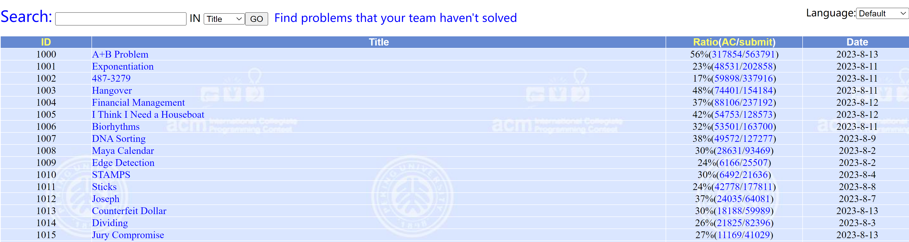
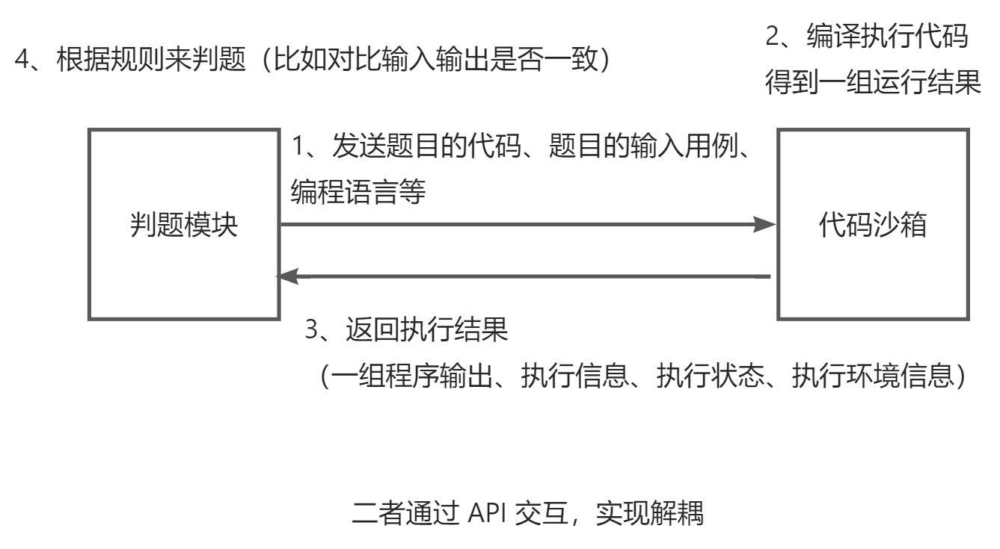

## 前端页面开发

### 当前代码优化

1）先处理菜单项的权限控制和显示隐藏

通过 meta.hideInMenu 和 meta.access 属性控制

2）管理页面分页问题的修复

可以参考聚合搜索项目的搜索条件改变和 url 状态同步

核心原理：在分页页号改变时，触发 @page-change 事件，通过改变 searchParams 的值，并且通过 watchEffect 监听 searchParams 的改变（然后执行 loadData 重新加载速度），实现了页号变化时触发数据的重新加载。

3）修复刷新页面未登录问题

修改 access\index.ts 中的获取登录用户信息，把登录后的信息更新到 loginUser 变量上

```typescript
▼typescriptif (!loginUser || !loginUser.userRole) {
  // 加 await 是为了等用户登录成功之后，再执行后续的代码
  await store.dispatch("user/getLoginUser");
  loginUser = store.state.user.loginUser;
}
```

### 题目列表搜索页

核心实现：表格组件



1）复制管理题目页的表格

2）只保留需要的 columns 字段

3）自定义表格列的渲染

标签：使用 tag 组件

通过率：自行计算

创建时间：使用 moment 库进行格式化（https://momentjs.com/docs/#/displaying/format/）

操作按钮：补充跳转到做题页的按钮

4）编写搜索表单，使用 form 的 layout = inline 布局，让用户的输入和 searchParams 同步，并且给提交按钮绑定修改 searchParams，从而被 watchEffect 监听到，触发查询

### 题目浏览页

1）先定义动态参数路由，开启 props 为 true，可以在页面的 props 中直接获取到动态参数（题目 id）

```typescript
▼typescript  {
    path: "/view/question/:id",
    name: "在线做题",
    component: ViewQuestionView,
    props: true,
    meta: {
      access: ACCESS_ENUM.USER,
      hideInMenu: true,
    },
  },
```

2）定义布局：左侧是题目信息，右侧是代码编辑器

3）左侧题目信息：

- tabs 切换展示的内容
- 定义 MdViewer 组件展示题目内容
- 使用descriptions 组件展示判题配置 https://arco.design/vue/component/descriptions
- 

4）使用 select 组件让用户选择编程语言

在代码编辑器中监听属性的变化，注意监听 props 要使用箭头函数

https://blog.csdn.net/wuyxinu/article/details/124477647

> todo：代码编辑器没有更改语言

## 判题机模块架构

> 目的：先跑通完整的业务流程，再进行代码沙箱复杂的实现

### 判题模块和代码沙箱的关系

判题模块：调用代码沙箱，把代码和输入交给代码沙箱去执行

代码沙箱：只负责接受代码和输入，返回编译运行的结果，不负责判题（可以作为独立的项目 / 服务，提供给其他的需要执行代码的项目去使用）

这两个模块完全解耦：



#### 思考：为什么代码沙箱要接受和输出一组运行用例？

前提：我们的每道题目有多组测试用例

如果是每个用例单独调用一次代码沙箱，会调用多次接口、需要多次网络传输、程序要多次编译、记录程序的执行状态（重复的代码不重复编译）

> 这是一种很常见的性能优化方法！（批处理）

### 代码沙箱架构开发

1）定义代码沙箱的接口，提高通用性

之后我们的项目代码只调用接口，不调用具体的实现类，这样在你使用其他的代码沙箱实现类时，就不用去修改名称了， 便于扩展。

> 代码沙箱的请求接口中，timeLimit 可加可不加，可自行扩展，即时中断程序

扩展思路：增加一个查看代码沙箱状态的接口

2）定义多种不同的代码沙箱实现

示例代码沙箱：仅为了跑通业务流程

远程代码沙箱：实际调用接口的沙箱

第三方代码沙箱：调用网上现成的代码沙箱，https://github.com/criyle/go-judge

3）编写单元测试，验证单个代码沙箱的执行

```java
@SpringBootTest
class CodeSandboxTest {

    @Test
    void executeCode() {
        CodeSandbox codeSandbox = new RemoteCodeSandbox();
        String code = "int main() { }";
        String language = QuestionSubmitLanguageEnum.JAVA.getValue();
        List<String> inputList = Arrays.asList("1 2", "3 4");
        ExecuteCodeRequest executeCodeRequest = ExecuteCodeRequest.builder()
                .code(code)
                .language(language)
                .inputList(inputList)
                .build();
        ExecuteCodeResponse executeCodeResponse = codeSandbox.executeCode(executeCodeRequest);
        Assertions.assertNotNull(executeCodeResponse);
    }
}
```

但是现在的问题是，我们把 new 某个沙箱的代码写死了，如果后面项目要改用其他沙箱，可能要改很多地方的代码。

4）使用工厂模式，根据用户传入的字符串参数（沙箱类别），来生成对应的代码沙箱实现类

此处使用静态工厂模式，实现比较简单，符合我们的需求。

```java
/**
 * 代码沙箱工厂（根据字符串参数创建指定的代码沙箱实例）
 */
public class CodeSandboxFactory {

    /**
     * 创建代码沙箱示例
     *
     * @param type 沙箱类型
     * @return
     */
    public static CodeSandbox newInstance(String type) {
        switch (type) {
            case "example":
                return new ExampleCodeSandbox();
            case "remote":
                return new RemoteCodeSandbox();
            case "thirdParty":
                return new ThirdPartyCodeSandbox();
            default:
                return new ExampleCodeSandbox();
        }
    }
}
```

> 扩展思路：如果确定代码沙箱示例不会出现线程安全问题、可复用，那么可以使用单例工厂模式 聚合搜索项目中有讲过

由此，我们可以根据字符串动态生成实例，提高了通用性：

```java
public static void main(String[] args) {
    Scanner scanner = new Scanner(System.in);
    while (scanner.hasNext()) {
        String type = scanner.next();
        CodeSandbox codeSandbox = CodeSandboxFactory.newInstance(type);
        String code = "int main() { }";
        String language = QuestionSubmitLanguageEnum.JAVA.getValue();
        List<String> inputList = Arrays.asList("1 2", "3 4");
        ExecuteCodeRequest executeCodeRequest = ExecuteCodeRequest.builder()
        .code(code)
        .language(language)
        .inputList(inputList)
        .build();
        ExecuteCodeResponse executeCodeResponse = codeSandbox.executeCode(executeCodeRequest);
    }
}
```

5）参数配置化，把项目中的一些可以交给用户去自定义的选项或字符串，写到配置文件中。这样开发者只需要改配置文件，而不需要去看你的项目代码，就能够自定义使用你项目的更多功能。

application.yml 配置文件中指定变量：

```yaml
▼yaml# 代码沙箱配置
codesandbox:
  type: example
```

在 Spring 的 Bean 中通过 @Value 注解读取：

```java
@Value("${codesandbox.type:example}")
private String type;
```

6）代码沙箱能力增强

比如：我们需要在调用代码沙箱前，输出请求参数日志；在代码沙箱调用后，输出响应结果日志，便于管理员去分析。

每个代码沙箱类都写一遍 log.info？难道每次调用代码沙箱前后都执行 log？

使用代理模式，提供一个 Proxy，来增强代码沙箱的能力（代理模式的作用就是增强能力）

原本：需要用户自己去调用多次


使用代理后：不仅不用改变原本的代码沙箱实现类，而且对调用者来说，调用方式几乎没有改变，也不需要在每个调用沙箱的地方去写统计代码。


代理模式的实现原理：

1. 实现被代理的接口
2. 通过构造函数接受一个被代理的接口实现类
3. 调用被代理的接口实现类，在调用前后增加对应的操作
4. 

CodeSandboxProxy 示例代码：

```java
@Slf4j
public class CodeSandboxProxy implements CodeSandbox {

    private final CodeSandbox codeSandbox;


    public CodeSandboxProxy(CodeSandbox codeSandbox) {
        this.codeSandbox = codeSandbox;
    }

    @Override
    public ExecuteCodeResponse executeCode(ExecuteCodeRequest executeCodeRequest) {
        log.info("代码沙箱请求信息：" + executeCodeRequest.toString());
        ExecuteCodeResponse executeCodeResponse = codeSandbox.executeCode(executeCodeRequest);
        log.info("代码沙箱响应信息：" + executeCodeResponse.toString());
        return executeCodeResponse;
    }
}
```

使用方式：

```java
CodeSandbox codeSandbox = CodeSandboxFactory.newInstance(type);
codeSandbox = new CodeSandboxProxy(codeSandbox);
```

7）实现示例的代码沙箱

```java
/**
 * 示例代码沙箱（仅为了跑通业务流程）
 */
@Slf4j
public class ExampleCodeSandbox implements CodeSandbox {
    @Override
    public ExecuteCodeResponse executeCode(ExecuteCodeRequest executeCodeRequest) {
        List<String> inputList = executeCodeRequest.getInputList();
        ExecuteCodeResponse executeCodeResponse = new ExecuteCodeResponse();
        executeCodeResponse.setOutputList(inputList);
        executeCodeResponse.setMessage("测试执行成功");
        executeCodeResponse.setStatus(QuestionSubmitStatusEnum.SUCCEED.getValue());
        JudgeInfo judgeInfo = new JudgeInfo();
        judgeInfo.setMessage(JudgeInfoMessageEnum.ACCEPTED.getText());
        judgeInfo.setMemory(100L);
        judgeInfo.setTime(100L);
        executeCodeResponse.setJudgeInfo(judgeInfo);
        return executeCodeResponse;
    }
}
```

#### 小知识 - Lombok Builder 注解

以前我们是使用 new 对象后，再逐行执行 set 方法的方式来给对象赋值的。

还有另外一种可能更方便的方式 builder。

1）实体类加上 @Builder 等注解：

```java
@Data
@Builder
@NoArgsConstructor
@AllArgsConstructor
public class ExecuteCodeRequest {

    private List<String> inputList;

    private String code;

    private String language;
}
```

2）可以使用链式的方式更方便地给对象赋值：

```java
ExecuteCodeRequest executeCodeRequest = ExecuteCodeRequest.builder()
    .code(code)
    .language(language)
    .inputList(inputList)
    .build();
```

## 判题服务开发

定义单独的 judgeService 类，而不是把所有判题相关的代码写到 questionSubmitService 里，有利于后续的模块抽离、微服务改造。

### 判题服务业务流程

1）传入题目的提交 id，获取到对应的题目、提交信息（包含代码、编程语言等）

2）如果题目提交状态不为等待中，就不用重复执行了

3）更改判题（题目提交）的状态为 “判题中”，防止重复执行，也能让用户即时看到状态

4）调用沙箱，获取到执行结果

5）根据沙箱的执行结果，设置题目的判题状态和信息

### 判断逻辑

1. 先判断沙箱执行的结果输出数量是否和预期输出数量相等
2. 依次判断每一项输出和预期输出是否相等
3. 判题题目的限制是否符合要求
4. 可能还有其他的异常情况

### 策略模式优化

我们的判题策略可能会有很多种，比如：我们的代码沙箱本身执行程序需要消耗时间，这个时间可能不同的编程语言是不同的，比如沙箱执行 Java 要额外花 10 秒。

我们可以采用策略模式，针对不同的情况，定义独立的策略，便于分别修改策略和维护。而不是把所有的判题逻辑、if ... else ... 代码全部混在一起写。

实现步骤如下：

1）定义判题策略接口，让代码更加通用化：

```java
public interface JudgeStrategy {

    /**
     * 执行判题
     * @param judgeContext
     * @return
     */
    JudgeInfo doJudge(JudgeContext judgeContext);
}
```

2）定义判题上下文对象，用于定义在策略中传递的参数（可以理解为一种 DTO）：

```java
@Data
public class JudgeContext {

    private JudgeInfo judgeInfo;

    private List<String> inputList;

    private List<String> outputList;

    private List<JudgeCase> judgeCaseList;

    private Question question;

    private QuestionSubmit questionSubmit;

}
```

3）实现默认判题策略，先把 judgeService 中的代码搬运过来

4）再新增一种判题策略，通过 if ... else ... 的方式选择使用哪种策略：

```java
JudgeStrategy judgeStrategy = new DefaultJudgeStrategy();
if (language.equals("java")) {
    judgeStrategy = new JavaLanguageJudgeStrategy();
}
JudgeInfo judgeInfo = judgeStrategy.doJudge(judgeContext);
```

但是，如果选择某种判题策略的过程比较复杂，如果都写在调用判题服务的代码中，代码会越来越复杂，会有大量 if ... else ...，所以建议单独编写一个判断策略的类。

5）定义 JudgeManager，目的是尽量简化对判题功能的调用，让调用方写最少的代码、调用最简单。对于判题策略的选取，也是在 JudgeManager 里处理的。

示例代码如下：

```java
/**
 * 判题管理（简化调用）
 */
@Service
public class JudgeManager {

    /**
     * 执行判题
     *
     * @param judgeContext
     * @return
     */
    JudgeInfo doJudge(JudgeContext judgeContext) {
        QuestionSubmit questionSubmit = judgeContext.getQuestionSubmit();
        String language = questionSubmit.getLanguage();
        JudgeStrategy judgeStrategy = new DefaultJudgeStrategy();
        if ("java".equals(language)) {
            judgeStrategy = new JavaLanguageJudgeStrategy();
        }
        return judgeStrategy.doJudge(judgeContext);
    }

}
```

## 本期成果

完成前端题目列表页、在线做题页面开发：


完成后端代码沙箱的架构和判题服务的开发。

## 本期作业

1. 完成前端题目列表页、在线做题页面开发
2. 理解代码沙箱架构的实现，掌握工厂模式、策略模式、代理模式
3. 实现判题服务的完整流程
4. 