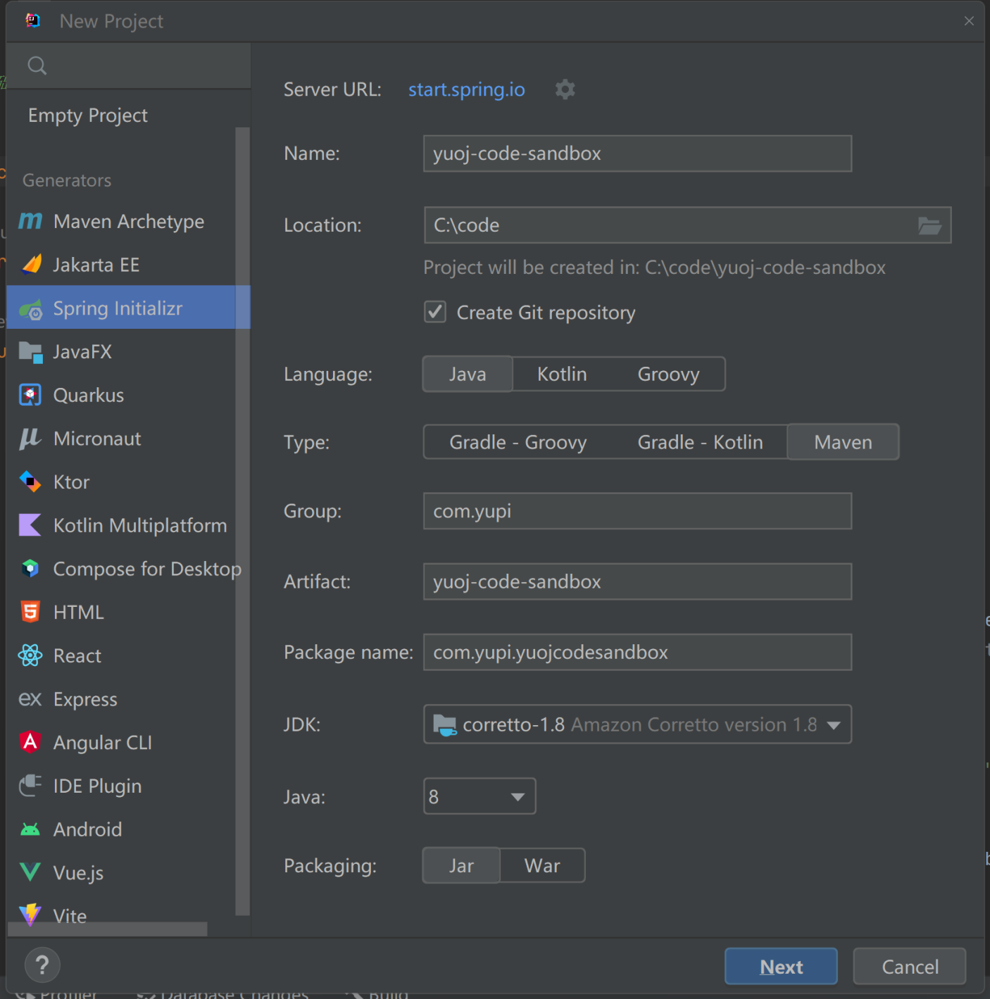
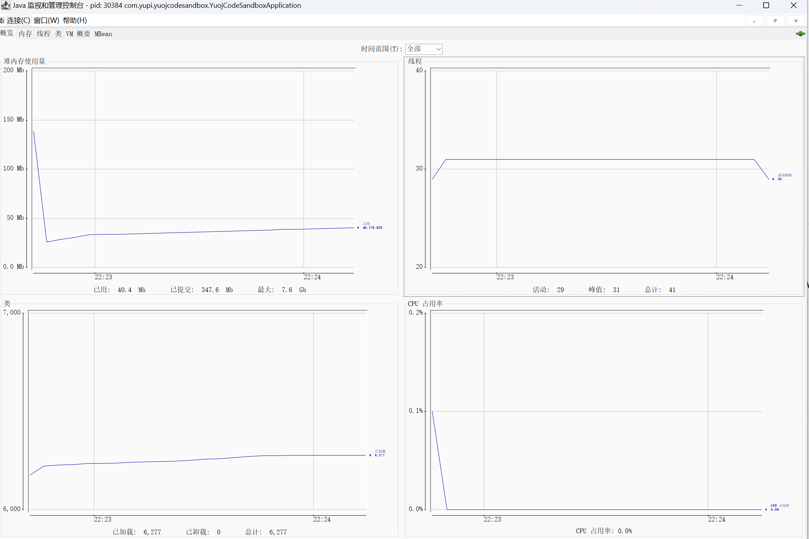
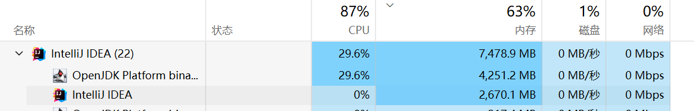
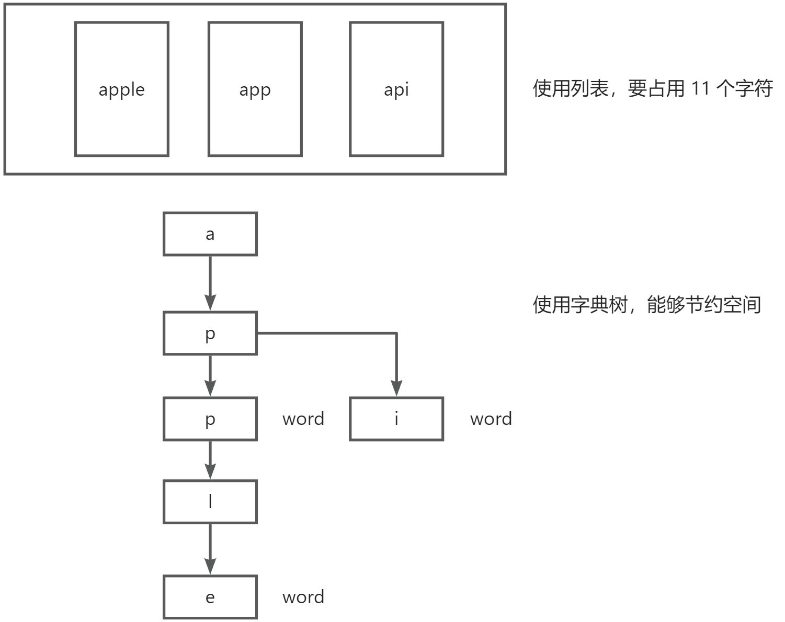

## 历史问题修复

代码编辑器切换语言失败问题

解决方案：监听 language 属性，动态更改编辑器的语言

代码如下：

```js
watch(
  () => props.language,
  () => {
    if (codeEditor.value) {
      monaco.editor.setModelLanguage(
        toRaw(codeEditor.value).getModel(),
        props.language
      );
    }
  }
);
```

## 代码沙箱项目初始化

代码沙箱的定位：只负责接受代码和输入，返回编译运行的结果，不负责判题（可以作为独立的项目 / 服务，提供给其他的需要执行代码的项目去使用）

以 Java 编程语言为主，带大家实现代码沙箱，重要的是 **学思想、学关键流程** 。

> 扩展：可以自行实现 C++ 语言的代码沙箱

由于代码沙箱是能够通过 API 调用的独立服务，所以新建一个 Spring Boot Web 项目。最终这个项目要提供一个能够执行代码、操作代码沙箱的接口。

使用 IDEA 的 Spring Boot 项目初始化工具，一定要选择 Java 8、Spring Boot 2.7 版本！！！



编写启动配置：

```yaml
▼yamlserver:
  port: 8090
```

编写测试接口，验证能否访问：

```java
package com.yupi.yuojcodesandbox.controller;

import org.springframework.web.bind.annotation.GetMapping;
import org.springframework.web.bind.annotation.RestController;

@RestController("/")
public class MainController {

    @GetMapping("/health")
    public String healthCheck() {
        return "ok";
    }
}
```

将 yuoj-backend 项目的 JudgeInfo 类移到 model 目录下，然后复制 model 包和 CodeSandbox 接口到该沙箱项目，便于字段的统一。

## Java 原生实现代码沙箱

原生：尽可能不借助第三方库和依赖，用最干净、最原始的方式实现代码沙箱

### 通过命令行执行

#### Java 程序执行流程

接收代码 => 编译代码（javac） => 执行代码（java）

先编写示例代码，注意要去掉包名，放到 resources 目录下：

```java
public class SimpleCompute {
    public static void main(String[] args) {
        int a = Integer.parseInt(args[0]);
        int b = Integer.parseInt(args[1]);
        System.out.println("结果:" + (a + b));
    }
}
```

用 javac 命令编译代码：

```java

javac {Java代码路径}
```

用 java 命令执行代码：

```shell
java -cp {编译后的class文件所在路径} SimpleCompute 1 2
```

#### 程序中文乱码问题

为什么编译后的 class 文件出现中文乱码呢？

原因：命令行终端的编码是 GBK，和 java 代码文件本身的编码 UTF-8 不一致，导致乱码。

通过 `chcp` 命令查看命令行编码，GBK 是 936，UTF-8 是 65001。

但是 **不建议** 大家改变终端编码来解决编译乱码，因为其他运行你代码的人也要改变环境，兼容性很差。

推荐的 javac 编译命令，用 `-encoding utf-8` 参数解决：

```shell
javac -encoding utf-8 .\SimpleCompute.java
```

java 执行：

```shell
java -cp C:\code\yuoj-code-sandbox\src\main\java\com\yupi\yuojcodesandbox SimpleCompute
```

#### 统一类名

实际的 OJ 系统中，对用户输入的代码会有一定的要求。便于系统进行统一处理和判题。

此处我们把用户输入代码的类名限制为 Main（参考 Poj），可以减少编译时类名不一致的风险；而且不用从用户代码中提取类名，更方便。

文件名 Main.java，示例代码如下：

```java
public class Main {
    public static void main(String[] args) {
        int a = Integer.parseInt(args[0]);
        int b = Integer.parseInt(args[1]);
        System.out.println("结果:" + (a + b));
    }
}
```

实际执行命令时，可以统一使用 Main 类名：

```shell
javac -encoding utf-8 .\Main.java
java -cp . Main 1 2
```

### 核心流程实现

核心实现思路：用程序代替人工，用程序来操作命令行，去编译执行代码

核心依赖：Java 进程类 Process

1. 把用户的代码保存为文件
2. 编译代码，得到 class 文件
3. 执行代码，得到输出结果
4. 收集整理输出结果
5. 文件清理，释放空间
6. 错误处理，提升程序健壮性

#### 1、保存代码文件

引入 Hutool 工具类，提高操作文件效率：

```xml
<!-- https://hutool.cn/docs/index.html#/-->
<dependency>
    <groupId>cn.hutool</groupId>
    <artifactId>hutool-all</artifactId>
    <version>5.8.8</version>
</dependency>
```

新建目录，将每个用户的代码都存放在独立目录下，通过 UUID 随机生成目录名，便于隔离和维护：

```java
String userDir = System.getProperty("user.dir");
String globalCodePathName = userDir + File.separator + GLOBAL_CODE_DIR_NAME;
// 判断全局代码目录是否存在，没有则新建
if (!FileUtil.exist(globalCodePathName)) {
    FileUtil.mkdir(globalCodePathName);
}

// 把用户的代码隔离存放
String userCodeParentPath = globalCodePathName + File.separator + UUID.randomUUID();
String userCodePath = userCodeParentPath + File.separator + GLOBAL_JAVA_CLASS_NAME;
File userCodeFile = FileUtil.writeString(code, userCodePath, StandardCharsets.UTF_8);
```

#### 2、编译代码

使用 Process 类在终端执行命令：

```java
String compileCmd = String.format("javac -encoding utf-8%s", userCodeFile.getAbsolutePath());
Process process = Runtime.getRuntime().exec(compileCmd)
```

执行 process.waitFor 等待程序执行完成，并通过返回的 exitValue 判断程序是否正常返回，然后从 Process 的输入流 inputStream 和错误流 errorStream 获取控制台输出。

示例代码如下：

```java
// 等待程序执行，获取错误码
int // 等待程序执行，获取错误码
int exitValue = compileProcess.waitFor();
// 正常退出
if (exitValue == 0) {
    System.out.println("编译成功");
    // 分批获取进程的正常输出
    BufferedReader bufferedReader = new BufferedReader(new InputStreamReader(compileProcess.getInputStream()));
    StringBuilder compileOutputStringBuilder = new StringBuilder();
    // 逐行读取
    String compileOutputLine;
    while ((compileOutputLine = bufferedReader.readLine()) != null) {
        compileOutputStringBuilder.append(compileOutputLine);
    }
    System.out.println(compileOutputStringBuilder);
} else {
    // 异常退出
    System.out.println("编译失败，错误码： " + exitValue);
    // 分批获取进程的正常输出
    BufferedReader bufferedReader = new BufferedReader(new InputStreamReader(compileProcess.getInputStream()));
    StringBuilder compileOutputStringBuilder = new StringBuilder();
    // 逐行读取
    String compileOutputLine;
    while ((compileOutputLine = bufferedReader.readLine()) != null) {
        compileOutputStringBuilder.append(compileOutputLine);
    }
    // 分批获取进程的错误输出
    BufferedReader errorBufferedReader = new BufferedReader(new InputStreamReader(compileProcess.getErrorStream()));
    StringBuilder errorCompileOutputStringBuilder = new StringBuilder();

    // 逐行读取
    String errorCompileOutputLine;
    while ((errorCompileOutputLine = errorBufferedReader.readLine()) != null) {
        errorCompileOutputStringBuilder.append(errorCompileOutputLine);
    }
    System.out.println(compileOutputStringBuilder);
}
```

可以把上述代码提取为工具类 ProcessUtils，执行进程并获取输出，并且使用 StringBuilder 拼接控制台输出信息：

```java
package com.yupi.yuojcodesandbox.utils;

import com.yupi.yuojcodesandbox.model.ExecuteMessage;

import java.io.BufferedReader;
import java.io.InputStreamReader;

/**
 * 进程工具类
 */
public class ProcessUtils {

    /**
     * 执行进程并获取信息
     *
     * @param runProcess
     * @param opName
     * @return
     */
    public static ExecuteMessage runProcessAndGetMessage(Process runProcess, String opName) {
        ExecuteMessage executeMessage = new ExecuteMessage();

        try {
            // 等待程序执行，获取错误码
            int exitValue = runProcess.waitFor();
            executeMessage.setExitValue(exitValue);
            // 正常退出
            if (exitValue == 0) {
                System.out.println(opName + "成功");
                // 分批获取进程的正常输出
                BufferedReader bufferedReader = new BufferedReader(new InputStreamReader(runProcess.getInputStream()));
                StringBuilder compileOutputStringBuilder = new StringBuilder();
                // 逐行读取
                String compileOutputLine;
                while ((compileOutputLine = bufferedReader.readLine()) != null) {
                    compileOutputStringBuilder.append(compileOutputLine);
                }
                    executeMessage.setMessage(compileOutputStringBuilder.toString());
            } else {
                // 异常退出
                System.out.println(opName + "失败，错误码： " + exitValue);
                // 分批获取进程的正常输出
                BufferedReader bufferedReader = new BufferedReader(new InputStreamReader(runProcess.getInputStream()));
                StringBuilder compileOutputStringBuilder = new StringBuilder();
                // 逐行读取
                String compileOutputLine;
                while ((compileOutputLine = bufferedReader.readLine()) != null) {
                    compileOutputStringBuilder.append(compileOutputLine);
                }
                executeMessage.setMessage(compileOutputStringBuilder.toString());

                // 分批获取进程的错误输出
                BufferedReader errorBufferedReader = new BufferedReader(new InputStreamReader(runProcess.getErrorStream()));
                StringBuilder errorCompileOutputStringBuilder = new StringBuilder();

                // 逐行读取
                String errorCompileOutputLine;
                while ((errorCompileOutputLine = errorBufferedReader.readLine()) != null) {
                    errorCompileOutputStringBuilder.append(errorCompileOutputLine);
                }
                executeMessage.setErrorMessage(errorCompileOutputStringBuilder.toString());
            }
        } catch (Exception e) {
            e.printStackTrace();
        }
        return executeMessage;
    }
}
```

#### 3、执行程序

同样是使用 Process 类运行 java 命令，命令中记得增加 `-Dfile.encoding=UTF-8` 参数，解决中文乱码：

```java

String runCmd = String.format("java -Dfile.encoding=UTF-8 -cp %s Main %s", userCodeParentPath, inputArgs);
```

上述命令适用于执行从输入参数（args）中获取值的代码。

很多 OJ 都是 ACM 模式，需要和用户交互，让用户不断输入内容并获取输出，比如：

```java
import java.io.*;
import java.util.*;

public class Main
{
    public static void main(String args[]) throws Exception
    {
        Scanner cin=new Scanner(System.in);
        int a=cin.nextInt(),b=cin.nextInt();
        System.out.println(a+b);
    }
}
```

对于此类程序，我们需要使用 OutputStream 向程序终端发送参数，并及时获取结果，注意最后要关闭流释放资源。

示例代码如下：

```java
/**
 * 执行交互式进程并获取信息
 *
 * @param runProcess
 * @param args
 * @return
 */
public static ExecuteMessage runInteractProcessAndGetMessage(Process runProcess, String args) {
    ExecuteMessage executeMessage = new ExecuteMessage();

    try {
        // 向控制台输入程序
        OutputStream outputStream = runProcess.getOutputStream();
        OutputStreamWriter outputStreamWriter = new OutputStreamWriter(outputStream);
        String[] s = args.split(" ");
        String join = StrUtil.join("\n", s) + "\n";
        outputStreamWriter.write(join);
        // 相当于按了回车，执行输入的发送
        outputStreamWriter.flush();

        // 分批获取进程的正常输出
        InputStream inputStream = runProcess.getInputStream();
        BufferedReader bufferedReader = new BufferedReader(new InputStreamReader(inputStream));
        StringBuilder compileOutputStringBuilder = new StringBuilder();
        // 逐行读取
        String compileOutputLine;
        while ((compileOutputLine = bufferedReader.readLine()) != null) {
            compileOutputStringBuilder.append(compileOutputLine);
        }
        executeMessage.setMessage(compileOutputStringBuilder.toString());
        // 记得资源的释放，否则会卡死
        outputStreamWriter.close();
        outputStream.close();
        inputStream.close();
        runProcess.destroy();
    } catch (Exception e) {
        e.printStackTrace();
    }
    return executeMessage;
}
```

#### 4、整理输出

1）通过 for 循环遍历执行结果，从中获取输出列表

2）获取程序执行时间

可以使用 Spring 的 StopWatch 获取一段程序的执行时间：

```java
StopWatch stopWatch = new StopWatch();
stopWatch.start();
... 程序执行
stopWatch.stop();
stopWatch.getLastTaskTimeMillis(); // 获取时间
```

此处我们使用最大值来统计时间，便于后续判题服务计算程序是否超时：

```java
// 取用时最大值，便于判断是否超时
long maxTime = 0;
for (ExecuteMessage executeMessage : executeMessageList) {
    ...
    Long time = executeMessage.getTime();
    if (time != null) {
        maxTime = Math.max(maxTime, time);
    }
}
```

> 扩展：可以每个测试用例都有一个独立的内存、时间占用的统计

3）获取内存信息

实现比较复杂，因为无法从 Process 对象中获取到子进程号，也不推荐在 Java 原生实现代码沙箱的过程中获取。

#### 5、文件清理

防止服务器空间不足，删除代码目录：

```pgsql
▼textif (userCodeFile.getParentFile() != null) {
    boolean del = FileUtil.del(userCodeParentPath);
    System.out.println("删除" + (del ? "成功" : "失败"));
}
```

#### 6、错误处理

封装一个错误处理方法，当程序抛出异常时，直接返回错误响应。

示例代码如下：

```java
private ExecuteCodeResponse getErrorResponse(Throwable e) {
    ExecuteCodeResponse executeCodeResponse = new ExecuteCodeResponse();
    executeCodeResponse.setOutputList(new ArrayList<>());
    executeCodeResponse.setMessage(e.getMessage());
    // 表示代码沙箱错误
    executeCodeResponse.setStatus(2);
    executeCodeResponse.setJudgeInfo(new JudgeInfo());
    return executeCodeResponse;
}
```

## Java 程序异常情况

到目前为止，核心流程已经实现，但是想要上线的话，安全么？

用户提交恶意代码，怎么办？

### 1、执行超时

占用时间资源，导致程序卡死，不释放资源：

```java
/**
 * 无限睡眠（阻塞程序执行）
 */
public class Main {

    public static void main(String[] args) throws InterruptedException {
        long ONE_HOUR = 60 * 60 * 1000L;
        Thread.sleep(ONE_HOUR);
        System.out.println("睡完了");
    }
}
```

要把写好的代码复制到 resources 中，并且一定要把类名改为 Main！包名一定要去掉！

### 2、占用内存

占用内存资源，导致空间浪费：

```java
import java.util.ArrayList;
import java.util.List;

/**
 * 无限占用空间（浪费系统内存）
 */
public class Main {

    public static void main(String[] args) throws InterruptedException {
        List<byte[]> bytes = new ArrayList<>();
        while (true) {
            bytes.add(new byte[10000]);
        }
    }
}
```

实际运行上述程序时，我们会发现，内存占用到达一定空间后，程序就自动报错：`java.lang.OutOfMemoryError: Java heap space`，而不是无限增加内存占用，直到系统死机。

这是 JVM 的一个保护机制。

可以使用 JVisualVM 或 JConsole 工具，连接到 JVM 虚拟机上来可视化查看运行状态。

如图：



### 3、读文件，信息泄露

比如直接通过相对路径获取项目配置文件，获取到密码：

```java
import java.io.File;
import java.io.IOException;
import java.nio.file.Files;
import java.nio.file.Paths;
import java.util.List;

/**
 * 读取服务器文件（文件信息泄露）
 */
public class Main {

    public static void main(String[] args) throws InterruptedException, IOException {
        String userDir = System.getProperty("user.dir");
        String filePath = userDir + File.separator + "src/main/resources/application.yml";
        List<String> allLines = Files.readAllLines(Paths.get(filePath));
        System.out.println(String.join("\n", allLines));
    }
}
```

### 4、写文件，植入木马

可以直接向服务器上写入文件，比如一个木马程序：`java -version 2>&1`（示例命令）

> 1. java -version 用于显示 Java 版本信息。这会将版本信息输出到标准错误流（stderr）而不是标准输出流（stdout）。
> 2. 2>&1 将标准错误流重定向到标准输出流。这样，Java 版本信息就会被发送到标准输出流。

代码如下：

```java
import java.io.File;
import java.io.IOException;
import java.nio.file.Files;
import java.nio.file.Paths;
import java.util.Arrays;

/**
 * 向服务器写文件（植入危险程序）
 */
public class Main {

    public static void main(String[] args) throws InterruptedException, IOException {
        String userDir = System.getProperty("user.dir");
        String filePath = userDir + File.separator + "src/main/resources/木马程序.bat";
        String errorProgram = "java -version 2>&1";
        Files.write(Paths.get(filePath), Arrays.asList(errorProgram));
        System.out.println("写木马成功，你完了哈哈");
    }
}
```

### 5、运行其他程序

直接通过 Process 执行危险程序，或者电脑上的其他程序：

```java
import java.io.BufferedReader;
import java.io.File;
import java.io.IOException;
import java.io.InputStreamReader;

/**
 * 运行其他程序（比如危险木马）
 */
public class Main {

    public static void main(String[] args) throws InterruptedException, IOException {
        String userDir = System.getProperty("user.dir");
        String filePath = userDir + File.separator + "src/main/resources/木马程序.bat";
        Process process = Runtime.getRuntime().exec(filePath);
        process.waitFor();
        // 分批获取进程的正常输出
        BufferedReader bufferedReader = new BufferedReader(new InputStreamReader(process.getInputStream()));
        // 逐行读取
        String compileOutputLine;
        while ((compileOutputLine = bufferedReader.readLine()) != null) {
            System.out.println(compileOutputLine);
        }
        System.out.println("执行异常程序成功");
    }
}
```

### 6、执行高危操作

甚至都不用写木马文件，直接执行系统自带的危险命令！

- 比如删除服务器的所有文件（太残暴、不演示）
- 比如执行 dir（windows）、ls（linux） 获取你系统上的所有文件信息
- 

## Java 程序安全控制

针对上面的异常情况，分别有如下方案，可以提高程序安全性。

1. 超时控制
2. 限制给用户程序分配的资源
3. 限制代码 - 黑白名单
4. 限制用户的操作权限
5. 运行环境隔离
6. 

### 1、超时控制

通过创建一个守护线程，超时后自动中断 Process 实现。

代码如下：

```java
// 超时控制
new Thread(() -> {
    try {
        Thread.sleep(TIME_OUT);
        System.out.println("超时了，中断");
        runProcess.destroy();
    } catch (InterruptedException e) {
        throw new RuntimeException(e);
    }
}).start();
```

### 2、限制资源分配

我们不能让每个 java 进程的执行占用的 JVM 最大堆内存空间都和系统默认的一致（鱼皮的 JVM 默认最大占用 8G 内存），实际上应该更小（执行用户的题目代码也不需要这么多），比如说 256MB。

在启动 Java 程序时，可以指定 JVM 的参数：-Xmx256m（最大堆空间大小）

示例命令如下：

```bash
java -Xmx256m
```

注意！-Xmx 参数、JVM 的堆内存限制，不等同于系统实际占用的最大资源，可能会超出。



如果需要更严格的内存限制，要在系统层面去限制，而不是 JVM 层面的限制。

如果是 Linux 系统，可以使用 cgroup 来实现对某个进程的 CPU、内存等资源的分配。

#### 小知识 - 什么是 cgroup？

`cgroup` 是 Linux 内核提供的一种机制，可以用来限制进程组（包括子进程）的资源使用，例如内存、CPU、磁盘 I/O 等。通过将 Java 进程放置在特定的 `cgroup` 中，你可以实现限制其使用的内存和 CPU 数。

#### 小知识 - 常用 JVM 启动参数

1. 内存相关参数：

○ -Xms: 设置 JVM 的初始堆内存大小。

○ -Xmx: 设置 JVM 的最大堆内存大小。

○ -Xss: 设置线程的栈大小。

○ -XX:MaxMetaspaceSize: 设置 Metaspace（元空间）的最大大小。

○ -XX:MaxDirectMemorySize: 设置直接内存（Direct Memory）的最大大小。 2. 垃圾回收相关参数：

○ -XX:+UseSerialGC: 使用串行垃圾回收器。

○ -XX:+UseParallelGC: 使用并行垃圾回收器。

○ -XX:+UseConcMarkSweepGC: 使用 CMS 垃圾回收器。

○ -XX:+UseG1GC: 使用 G1 垃圾回收器。 3. 线程相关参数：

○ -XX:ParallelGCThreads: 设置并行垃圾回收的线程数。

○ -XX:ConcGCThreads: 设置并发垃圾回收的线程数。

○ -XX:ThreadStackSize: 设置线程的栈大小。 4. JIT 编译器相关参数：

○ -XX:TieredStopAtLevel: 设置 JIT 编译器停止编译的层次。 5. 其他资源限制参数：

○ -XX:MaxRAM: 设置 JVM 使用的最大内存。

### 3、限制代码 - 黑白名单

#### 实现

先定义一个黑白名单，比如哪些操作是禁止的，可以就是一个列表：

```java

private static final List<String> blackList = Arrays.asList("Files", "exec");
```

还可以使用字典树代替列表存储单词，用 **更少的空间** 存储更多的敏感词汇，并且实现 **更高效** 的敏感词查找。

字典树的原理：



> 字典树相关的应用可以写在简历上

此处使用 HuTool 工具库的字典树工具类：WordTree，不用自己写字典树！

1）先初始化字典树，插入禁用词：

```java
private static final WordTree WORD_TREE;

static {
    // 初始化字典树
    WORD_TREE = new WordTree();
    WORD_TREE.addWords(blackList);
}
```

2）校验用户代码是否包含禁用词：

```java
//  校验代码中是否包含黑名单中的禁用词
FoundWord foundWord = WORD_TREE.matchWord(code);
if (foundWord != null) {
    System.out.println("包含禁止词：" + foundWord.getFoundWord());
    return null;
}
```

#### 本方案缺点

1）你无法遍历所有的黑名单

2）不同的编程语言，你对应的领域、关键词都不一样，限制人工成本很大

### 4、限制权限 - Java 安全管理器

目标：限制用户对文件、内存、CPU、网络等资源的操作和访问。

#### Java 安全管理器使用

Java 安全管理器（Security Manager）是 Java 提供的保护 JVM、Java 安全的机制，可以实现更严格的资源和操作限制。

编写安全管理器，只需要继承 Security Manager。

1）所有权限放开：

```java
package com.yupi.yuojcodesandbox.security;

import java.security.Permission;

/**
 * 默认安全管理器
 */
public class DefaultSecurityManager extends SecurityManager {

    // 检查所有的权限
    @Override
    public void checkPermission(Permission perm) {
        System.out.println("默认不做任何限制");
        System.out.println(perm);
        // super.checkPermission(perm);
    }
}
```

2）所有权限拒绝：

```java
package com.yupi.yuojcodesandbox.security;

import java.security.Permission;

/**
 * 禁用所有权限安全管理器
 */
public class DenySecurityManager extends SecurityManager {

    // 检查所有的权限
    @Override
    public void checkPermission(Permission perm) {
        throw new SecurityException("权限异常：" + perm.toString());
    }
}
```

3）限制读权限：

```java
@Override
public void checkRead(String file) {
    throw new SecurityException("checkRead 权限异常：" + file);
}
```

4）限制写文件权限：

```java
@Override
public void checkWrite(String file) {
    throw new SecurityException("checkWrite 权限异常：" + file);
}
```

5）限制执行文件权限：

```java
@Override
public void checkExec(String cmd) {
	throw new SecurityException("checkExec 权限异常：" + cmd);
}
```

6）限制网络连接权限：

```java
@Override
public void checkConnect(String host, int port) {
    throw new SecurityException("checkConnect 权限异常：" + host + ":" + port);
}
```

#### 结合项目运用

实际情况下，不应该在主类（开发者自己写的程序）中做限制，只需要限制子程序的权限即可。

启动子进程执行命令时，设置安全管理器，而不是在外层设置（会限制住测试用例的读写和子命令的执行）。

具体操作如下：

1）根据需要开发自定义的安全管理器（比如 MySecurityManager）

2）复制 MySecurityManager 类到 `resources/security` 目录下， **移除类的包名**

3）手动输入命令编译 MySecurityManager 类，得到 class 文件

4）在运行 java 程序时，指定安全管理器 class 文件的路径、安全管理器的名称。

命令如下：

> 注意，windows 下要用分号间隔多个类路径！

```java

java -Dfile.encoding=UTF-8 -cp %s;%s -Djava.security.manager=MySecurityManager Main
```

依次执行之前的所有测试用例，发现资源成功被限制。

#### 安全管理器优点

1. 权限控制很灵活
2. 实现简单
3. 

#### 安全管理器缺点

1. 如果要做比较严格的权限限制，需要自己去判断哪些文件、包名需要允许读写。粒度太细了，难以精细化控制。
2. 安全管理器本身也是 Java 代码，也有可能存在漏洞。本质上还是程序层面的限制，没深入系统的层面。

### 5、运行环境隔离

原理：操作系统层面上，把用户程序封装到沙箱里，和宿主机（我们的电脑 / 服务器）隔离开，使得用户的程序无法影响宿主机。

实现方式：Docker 容器技术（底层是用 cgroup、namespace 等方式实现的），也可以直接使用 cgroup 实现。

## 本期成果

实现了 Java 原生代码沙箱：http://gitlab.code-nav.cn/root/yuoj-code-sandbox

## 本期作业

1. 理解 Java 的编译执行过程，能通过程序实现
2. 理解 Java 程序常见的安全漏洞和解决方案
3. 实践 Java 安全管理器
4. 提前安装虚拟机和远程开发环境：https://www.bilibili.com/video/BV1h94y1k7Jf
5. 