## 计划

1、模板方法优化代码沙箱

2、代码沙箱提供 API

3、跑通完整的单机项目流程

- 补充前端提交列表页面

4、单机项目改造成微服务

5、把项目的模块调用改为消息队列的解耦

------

## 模板方法优化代码沙箱

模板方法：定义一套通用的执行流程，让子类负责每个执行步骤的具体实现

模板方法的适用场景：适用于有规范的流程，且执行流程可以复用

作用：大幅节省重复代码量，便于项目扩展、更好维护

### 1、抽象出具体的流程

定义一个模板方法抽象类。

先复制具体的实现类，把代码从完整的方法抽离成一个一个子写法

```java
    public ExecuteCodeResponse executeCode(ExecuteCodeRequest executeCodeRequest) {
        List<String> inputList = executeCodeRequest.getInputList();
        String code = executeCodeRequest.getCode();
        String language = executeCodeRequest.getLanguage();

//        1. 把用户的代码保存为文件
        File userCodeFile = saveCodeToFile(code);

//        2. 编译代码，得到 class 文件
        ExecuteMessage compileFileExecuteMessage = compileFile(userCodeFile);
        System.out.println(compileFileExecuteMessage);

        // 3. 执行代码，得到输出结果
        List<ExecuteMessage> executeMessageList = runFile(userCodeFile, inputList);

//        4. 收集整理输出结果
        ExecuteCodeResponse outputResponse = getOutputResponse(executeMessageList);

//        5. 文件清理
        boolean b = deleteFile(userCodeFile);
        if (!b) {
            log.error("deleteFile error, userCodeFilePath = {}", userCodeFile.getAbsolutePath());
        }
        return outputResponse;
    }
```

### 2、定义子类的具体实现

Java 原生代码沙箱实现，直接复用模板方法定义好的方法实现：

```java
/**
 * Java 原生代码沙箱实现（直接复用模板方法）
 */
public class JavaNativeCodeSandbox extends JavaCodeSandboxTemplate {

    @Override
    public ExecuteCodeResponse executeCode(ExecuteCodeRequest executeCodeRequest) {
        return super.executeCode(executeCodeRequest);
    }
}
```

Docker 代码沙箱实现，需要自行重写 RunFile：

```java
    /**
     * 3、创建容器，把文件复制到容器内
     * @param userCodeFile
     * @param inputList
     * @return
     */
    @Override
    public List<ExecuteMessage> runFile(File userCodeFile, List<String> inputList) {
        String userCodeParentPath = userCodeFile.getParentFile().getAbsolutePath();
        // 获取默认的 Docker Client
        DockerClient dockerClient = DockerClientBuilder.getInstance().build();

        // 拉取镜像
        String image = "openjdk:8-alpine";
        if (FIRST_INIT) {
            PullImageCmd pullImageCmd = dockerClient.pullImageCmd(image);
            PullImageResultCallback pullImageResultCallback = new PullImageResultCallback() {
                @Override
                public void onNext(PullResponseItem item) {
                    System.out.println("下载镜像：" + item.getStatus());
                    super.onNext(item);
                }
            };
            try {
                pullImageCmd
                        .exec(pullImageResultCallback)
                        .awaitCompletion();
            } catch (InterruptedException e) {
                System.out.println("拉取镜像异常");
                throw new RuntimeException(e);
            }
        }

        System.out.println("下载完成");

        // 创建容器

        CreateContainerCmd containerCmd = dockerClient.createContainerCmd(image);
        HostConfig hostConfig = new HostConfig();
        hostConfig.withMemory(100 * 1000 * 1000L);
        hostConfig.withMemorySwap(0L);
        hostConfig.withCpuCount(1L);
        hostConfig.withSecurityOpts(Arrays.asList("seccomp=安全管理配置字符串"));
        hostConfig.setBinds(new Bind(userCodeParentPath, new Volume("/app")));
        CreateContainerResponse createContainerResponse = containerCmd
                .withHostConfig(hostConfig)
                .withNetworkDisabled(true)
                .withReadonlyRootfs(true)
                .withAttachStdin(true)
                .withAttachStderr(true)
                .withAttachStdout(true)
                .withTty(true)
                .exec();
        System.out.println(createContainerResponse);
        String containerId = createContainerResponse.getId();

        // 启动容器
        dockerClient.startContainerCmd(containerId).exec();

        // docker exec keen_blackwell java -cp /app Main 1 3
        // 执行命令并获取结果
        List<ExecuteMessage> executeMessageList = new ArrayList<>();
        for (String inputArgs : inputList) {
            StopWatch stopWatch = new StopWatch();
            String[] inputArgsArray = inputArgs.split(" ");
            String[] cmdArray = ArrayUtil.append(new String[]{"java", "-cp", "/app", "Main"}, inputArgsArray);
            ExecCreateCmdResponse execCreateCmdResponse = dockerClient.execCreateCmd(containerId)
                    .withCmd(cmdArray)
                    .withAttachStderr(true)
                    .withAttachStdin(true)
                    .withAttachStdout(true)
                    .exec();
            System.out.println("创建执行命令：" + execCreateCmdResponse);

            ExecuteMessage executeMessage = new ExecuteMessage();
            final String[] message = {null};
            final String[] errorMessage = {null};
            long time = 0L;
            // 判断是否超时
            final boolean[] timeout = {true};
            String execId = execCreateCmdResponse.getId();
            ExecStartResultCallback execStartResultCallback = new ExecStartResultCallback() {
                @Override
                public void onComplete() {
                    // 如果执行完成，则表示没超时
                    timeout[0] = false;
                    super.onComplete();
                }

                @Override
                public void onNext(Frame frame) {
                    StreamType streamType = frame.getStreamType();
                    if (StreamType.STDERR.equals(streamType)) {
                        errorMessage[0] = new String(frame.getPayload());
                        System.out.println("输出错误结果：" + errorMessage[0]);
                    } else {
                        message[0] = new String(frame.getPayload());
                        System.out.println("输出结果：" + message[0]);
                    }
                    super.onNext(frame);
                }
            };

            final long[] maxMemory = {0L};

            // 获取占用的内存
            StatsCmd statsCmd = dockerClient.statsCmd(containerId);
            ResultCallback<Statistics> statisticsResultCallback = statsCmd.exec(new ResultCallback<Statistics>() {

                @Override
                public void onNext(Statistics statistics) {
                    System.out.println("内存占用：" + statistics.getMemoryStats().getUsage());
                    maxMemory[0] = Math.max(statistics.getMemoryStats().getUsage(), maxMemory[0]);
                }

                @Override
                public void close() throws IOException {

                }

                @Override
                public void onStart(Closeable closeable) {

                }

                @Override
                public void onError(Throwable throwable) {

                }

                @Override
                public void onComplete() {

                }
            });
            statsCmd.exec(statisticsResultCallback);
            try {
                stopWatch.start();
                dockerClient.execStartCmd(execId)
                        .exec(execStartResultCallback)
                        .awaitCompletion(TIME_OUT, TimeUnit.MICROSECONDS);
                stopWatch.stop();
                time = stopWatch.getLastTaskTimeMillis();
                statsCmd.close();
            } catch (InterruptedException e) {
                System.out.println("程序执行异常");
                throw new RuntimeException(e);
            }
            executeMessage.setMessage(message[0]);
            executeMessage.setErrorMessage(errorMessage[0]);
            executeMessage.setTime(time);
            executeMessage.setMemory(maxMemory[0]);
            executeMessageList.add(executeMessage);
        }
        return executeMessageList;
    }
```

## 给代码沙箱提供开放 API

直接在 controller 暴露 CodeSandbox 定义的接口：

```java
    /**
     * 执行代码
     *
     * @param executeCodeRequest
     * @return
     */
    @PostMapping("/executeCode")
    ExecuteCodeResponse executeCode(@RequestBody ExecuteCodeRequest executeCodeRequest) {
        if (executeCodeRequest == null) {
            throw new RuntimeException("请求参数为空");
        }
        return javaNativeCodeSandbox.executeCode(executeCodeRequest);
    }
```

### 调用安全性

如果将服务不做任何的权限校验，直接发到公网，是不安全的。

1）调用方与服务提供方之间约定一个字符串 **（最好加密）**

优点：实现最简单，比较适合内部系统之间相互调用（相对可信的环境内部调用）

缺点：不够灵活，如果 key 泄露或变更，需要重启代码

代码沙箱服务，先定义约定的字符串：

```java
    // 定义鉴权请求头和密钥
    private static final String AUTH_REQUEST_HEADER = "auth";

    private static final String AUTH_REQUEST_SECRET = "secretKey";
```

改造请求，从请求头中获取认证信息，并校验：

```java
    @PostMapping("/executeCode")
    ExecuteCodeResponse executeCode(@RequestBody ExecuteCodeRequest executeCodeRequest, HttpServletRequest request,
                                    HttpServletResponse response) {
        // 基本的认证
        String authHeader = request.getHeader(AUTH_REQUEST_HEADER);
        if (!AUTH_REQUEST_SECRET.equals(authHeader)) {
            response.setStatus(403);
            return null;
        }
        if (executeCodeRequest == null) {
            throw new RuntimeException("请求参数为空");
        }
        return javaNativeCodeSandbox.executeCode(executeCodeRequest);
    }
```

调用方，在调用时补充请求头：

```java
    @Override
    public ExecuteCodeResponse executeCode(ExecuteCodeRequest executeCodeRequest) {
        System.out.println("远程代码沙箱");
        String url = "http://localhost:8090/executeCode";
        String json = JSONUtil.toJsonStr(executeCodeRequest);
        String responseStr = HttpUtil.createPost(url)
                .header(AUTH_REQUEST_HEADER, AUTH_REQUEST_SECRET)
                .body(json)
                .execute()
                .body();
        if (StringUtils.isBlank(responseStr)) {
            throw new BusinessException(ErrorCode.API_REQUEST_ERROR, "executeCode remoteSandbox error, message = " + responseStr);
        }
        return JSONUtil.toBean(responseStr, ExecuteCodeResponse.class);
    }
```

2）API 签名认证

给允许调用的人员分配 accessKey、secretKey，然后校验这两组 key 是否匹配

详细请见 API 开放平台项目。

## 跑通整个项目流程

1）移动 questionSubmitController 代码到 questionController 中

2）由于后端改了接口地址，前端需要重新生成接口调用代码

```shell
openapi --input http://localhost:8121/api/v2/api-docs --output ./generated --client axios
```

还需要更改前端调用的 Controller

3）后端调试

4）开发提交列表页面

> 扩展：每隔一段时间刷新一下提交状态，因为后端是异步判题的

## 单体项目改造为微服务

新建一个项目

### 什么是微服务？

服务：提供某类功能的代码

微服务：专注于提供某类特定功能的代码，而不是把所有的代码全部放到同一个项目里。会把整个大的项目按照一定的功能、逻辑进行拆分，拆分为多个子模块，每个子模块可以独立运行、独立负责一类功能，子模块之间相互调用、互不影响。

一个公司：一个人干活，这个人 icu 了，公司直接倒闭

一个公司有多个不同类的岗位，多个人干活，一个组跨了还有其他组可以正常工作，不会说公司直接倒闭。各组之间可能需要交互，来完成大的目标。

微服务的几个重要的实现因素：服务管理、服务调用、服务拆分

### 微服务实现技术？

Spring Cloud

**Spring Cloud Alibaba（本项目采用）**

Dubbo（DubboX）

RPC（GRPC、TRPC）

本质上是通过 HTTP、或者其他的网络协议进行通讯来实现的。

### Spring Cloud Alibaba

https://github.com/alibaba/spring-cloud-alibaba

推荐参考中文文档来学习：https://sca.aliyun.com/zh-cn/

本质：是在 Spring Cloud 的基础上，进行了增强，补充了一些额外的能力，根据阿里多年的业务沉淀做了一些定制化的开发

1. Spring Cloud Gateway：网关

2. Nacos：服务注册和配置中心

3. Sentinel：熔断限流

   

4. Seata：分布式事务

5. RocketMQ：消息队列，削峰填谷

6. Docker：使用Docker进行容器化部署

   

7. Kubernetes：使用k8s进行容器化部署

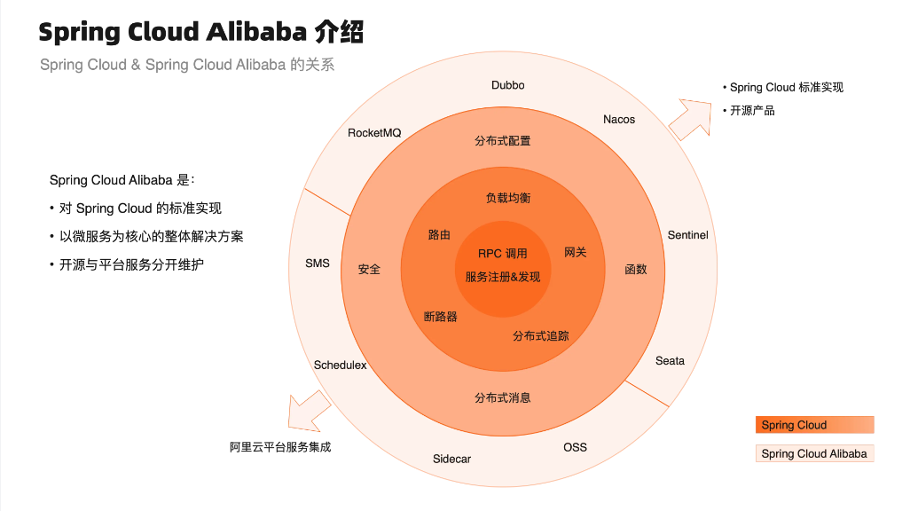

注意，一定要选择对应的版本：https://sca.aliyun.com/zh-cn/docs/2021.0.5.0/overview/version-explain

此处选择 2021.0.5.0：

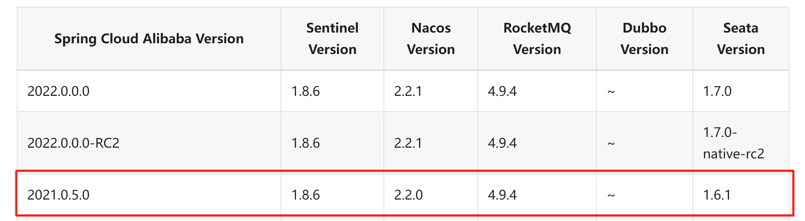

Nacos：集中存管项目中所有服务的信息，便于服务之间找到彼此；同时，还支持集中存储整个项目中的配置。

整个微服务请求流程：

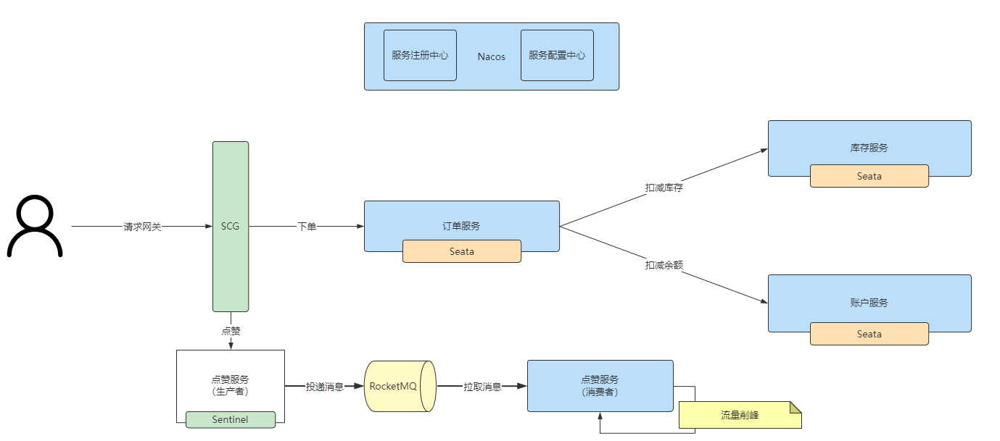

> 扩展：感兴趣可以了解另一个分布式微服务框架 https://github.com/Nepxion/Discovery

### 改造前思考

从业务需求出发，思考单机和分布式的区别。

用户登录功能：需要改造为分布式登录

其他内容：

- 有没有用到单机的锁？改造为分布式锁（伙伴匹配系统讲过）
- 有么有用到本地缓存？改造为分布式缓存（Redis）
- 需不需要用到分布式事务？比如操作多个库

#### 改造分布式登录

1）application.yml 增加 redis 配置

2）补充依赖：

```xml
        <!-- redis -->
        <dependency>
            <groupId>org.springframework.boot</groupId>
            <artifactId>spring-boot-starter-data-redis</artifactId>
        </dependency>
        <dependency>
            <groupId>org.springframework.session</groupId>
            <artifactId>spring-session-data-redis</artifactId>
        </dependency>
```

3）主类取消 Redis 自动配置的移除

4）修改 session 存储方式：

```yaml
spring.session.store-type: redis
```

5）使用 redis-cli 或者 redis 管理工具，查看是否有登录后的信息

#### 微服务的划分

从业务出发，想一下哪些功能 / 职责是一起的？

> 公司老板给员工分工

依赖服务：

- 注册中心：Nacos
- 微服务网关（yuoj-backend-gateway）：Gateway 聚合所有的接口，统一接受处理前端的请求

公共模块：

- common 公共模块（yuoj-backend-common）：全局异常处理器、请求响应封装类、公用的工具类等
- model 模型模块（yuoj-backend-model）：很多服务公用的实体类
- 公用接口模块（yuoj-backend-service-client）：只存放接口，不存放实现（多个服务之间要共享）

业务功能：

1. 用户服务（yuoj-backend-user-service：8102 端口）：

   1. 注册（后端已实现）
   2. 登录（后端已实现，前端已实现）
   3. 用户管理
2. 题目服务（yuoj-backend-question-service：8103）

   1. 创建题目（管理员）
   2. 删除题目（管理员）
   3. 修改题目（管理员）
   4. 搜索题目（用户）
   5. 在线做题（题目详情页）
   6. **题目提交**
3. 判题服务（yuoj-backend-judge-service，8104 端口，较重的操作）

   1. 执行判题逻辑
   2. 错误处理（内存溢出、安全性、超时）
   3. **自主实现** 代码沙箱（安全沙箱）
   4. 开放接口（提供一个独立的新服务）
   

> 代码沙箱服务本身就是独立的，不用纳入 Spring Cloud 的管理

#### 路由划分

用 springboot 的 context-path 统一修改各项目的接口前缀，比如：

用户服务：

- /api/user
- /api/user/inner（内部调用，网关层面要做限制）
- 

题目服务：

- /api/question（也包括题目提交信息）
- /api/question/inner（内部调用，网关层面要做限制）

判题服务：

- /api/judge
- /api/judge/inner（内部调用，网关层面要做限制）

### Nacos 注册中心启动

一定要选择 2.2.0 版本！！！

教程：https://sca.aliyun.com/zh-cn/docs/2021.0.5.0/user-guide/nacos/overview

Nacos 官网教程：https://nacos.io/zh-cn/docs/quick-start.html

到官网下载 Nacos：https://github.com/alibaba/nacos/releases/tag/2.2.0

安装好后，进入 bin 目录启动：

```shell
startup.cmd -m standalone
```

### 新建工程

Spring Cloud 有相当多的依赖，参差不齐，不建议大家随意找一套配置、或者自己写。

建议用脚手架创建项目：https://start.aliyun.com/

给项目增加全局依赖配置文件。

创建完初始项目后，补充 Spring Cloud 依赖：

```xml
        <dependency>
            <groupId>org.springframework.cloud</groupId>
            <artifactId>spring-cloud-dependencies</artifactId>
            <version>2021.0.5</version>
            <type>pom</type>
            <scope>import</scope>
        </dependency>
```

依次使用 new modules 和 spring boot Initializr 创建各模块：

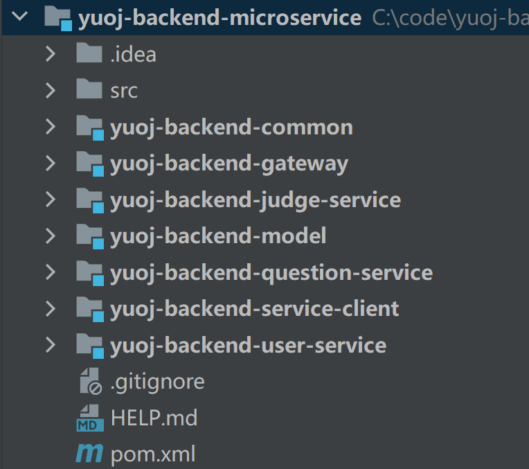

需要给各模块之间绑定子父依赖关系，效果如下：

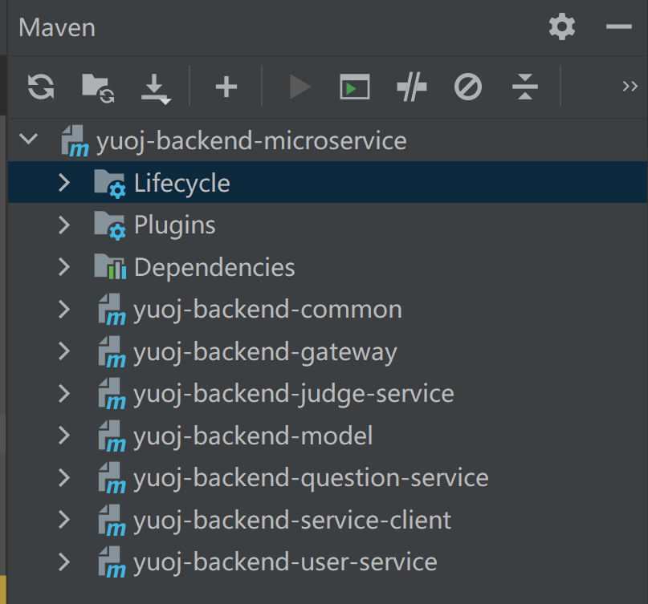

父模块定义 modules，子模块引入 parent 语法，可以通过继承父模块配置，统一项目的定义和版本号。

### 同步代码和依赖

1）common 公共模块（yuoj-backend-common）：全局异常处理器、请求响应封装类、公用的工具类等

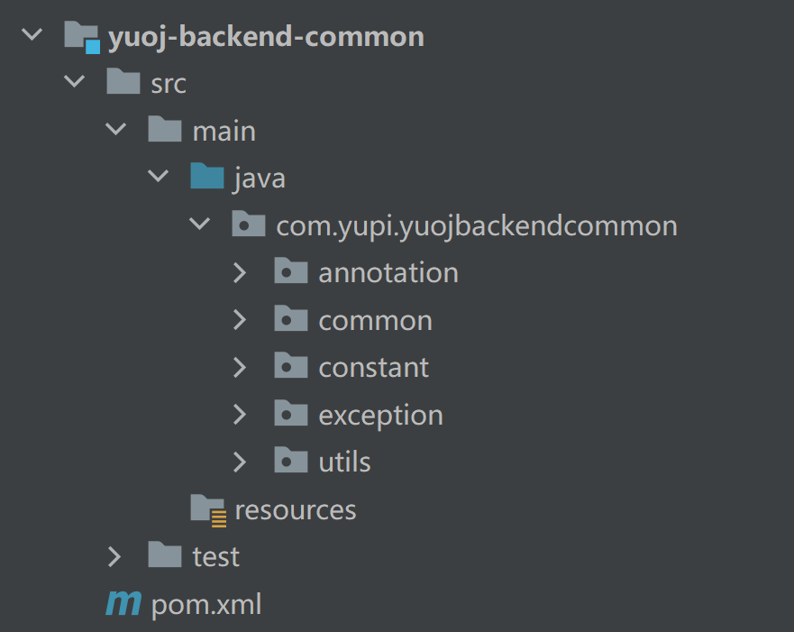

在外层的 pom.xml 中引入公共类：

```xml
        <!-- https://mvnrepository.com/artifact/org.apache.commons/commons-lang3 -->
        <dependency>
            <groupId>org.apache.commons</groupId>
            <artifactId>commons-lang3</artifactId>
        </dependency>
        <!-- https://mvnrepository.com/artifact/com.google.code.gson/gson -->
        <dependency>
            <groupId>com.google.code.gson</groupId>
            <artifactId>gson</artifactId>
            <version>2.9.1</version>
        </dependency>
        <!-- https://github.com/alibaba/easyexcel -->
        <dependency>
            <groupId>com.alibaba</groupId>
            <artifactId>easyexcel</artifactId>
            <version>3.1.1</version>
        </dependency>
        <!-- https://hutool.cn/docs/index.html#/-->
        <dependency>
            <groupId>cn.hutool</groupId>
            <artifactId>hutool-all</artifactId>
            <version>5.8.8</version>
        </dependency>
        <!-- https://mvnrepository.com/artifact/org.apache.commons/commons-collections4 -->
        <dependency>
            <groupId>org.apache.commons</groupId>
            <artifactId>commons-collections4</artifactId>
            <version>4.4</version>
        </dependency>
        <!-- https://mvnrepository.com/artifact/com.baomidou/mybatis-plus-boot-starter -->
        <dependency>
            <groupId>com.baomidou</groupId>
            <artifactId>mybatis-plus-boot-starter</artifactId>
            <version>3.5.2</version>
        </dependency>
```

2）model 模型模块（yuoj-backend-model）：很多服务公用的实体类

直接复制 model 包，注意代码沙箱 model 的引入

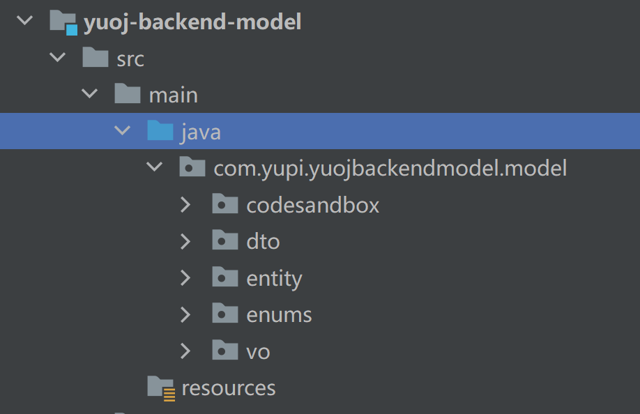

3）公用接口模块（yuoj-backend-service-client）：只存放接口，不存放实现（多个服务之间要共享）

先无脑搬运所有的 service，judgeService 也需要搬运

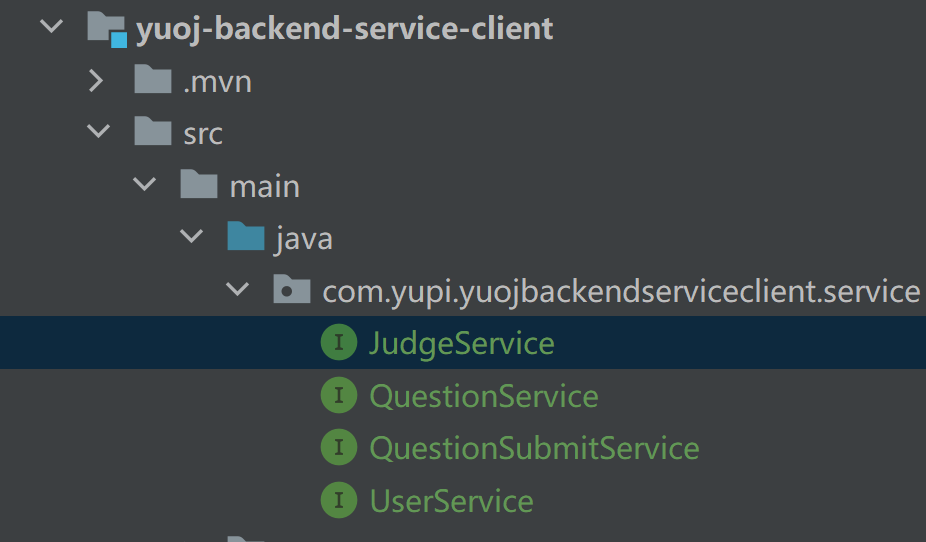

需要指定 openfeign（客户端调用工具）的版本：

```xml
        <dependency>
            <groupId>org.springframework.cloud</groupId>
            <artifactId>spring-cloud-starter-openfeign</artifactId>
            <version>3.1.5</version>
        </dependency>
```

4）具体业务服务实现

给所有业务服务引入公共依赖：

```xml
        <dependency>
            <groupId>com.yupi</groupId>
            <artifactId>yuoj-backend-common</artifactId>
            <version>0.0.1-SNAPSHOT</version>
        </dependency>
        <dependency>
            <groupId>com.yupi</groupId>
            <artifactId>yuoj-backend-model</artifactId>
            <version>0.0.1-SNAPSHOT</version>
        </dependency>
        <dependency>
            <groupId>com.yupi</groupId>
            <artifactId>yuoj-backend-service-client</artifactId>
            <version>0.0.1-SNAPSHOT</version>
        </dependency>
```

主类引入注解

引入 application.yml 配置

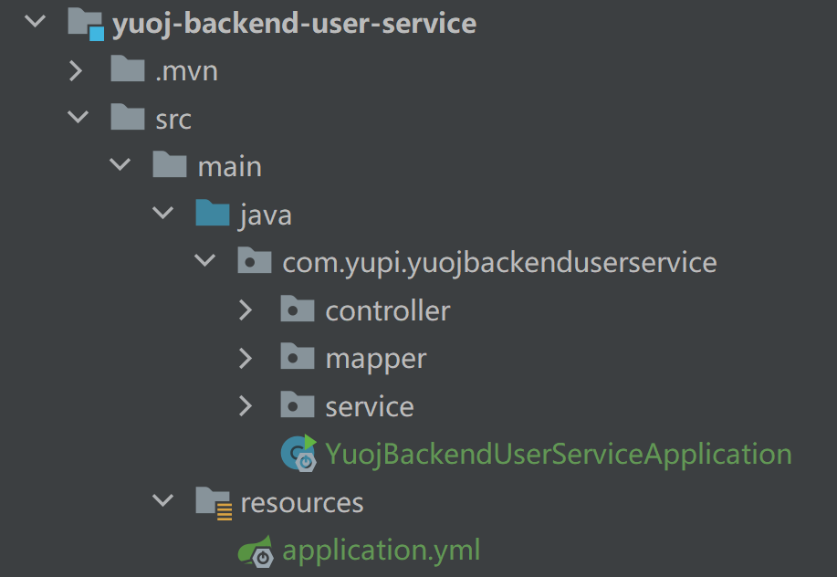

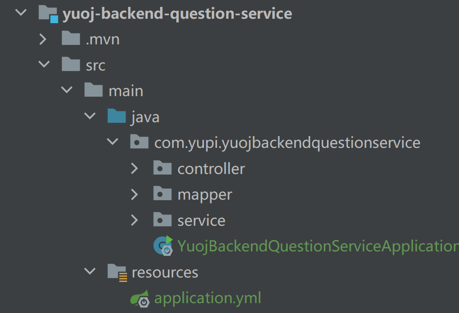

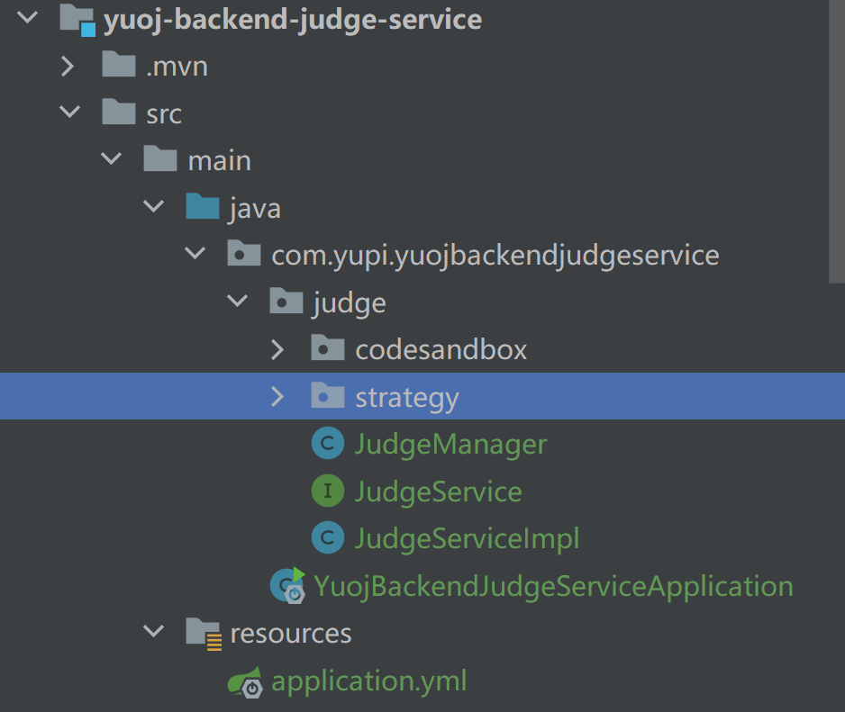

### 服务内部调用

现在的问题是，题目服务依赖用户服务，但是代码已经分到不同的包，找不到对应的 Bean。

可以使用 Open Feign 组件实现跨服务的远程调用。

Open Feign：Http 调用客户端，提供了更方便的方式来让你远程调用其他服务，不用关心服务的调用地址

Nacos 注册中心获取服务调用地址

1）梳理服务的调用关系，确定哪些服务（接口）需要给内部调用

用户服务：没有其他的依赖

题目服务：

userService.getById(userId)

userService.getUserVO(user)

userService.listByIds(userIdSet)

userService.isAdmin(loginUser)

userService.getLoginUser(request)

judgeService.doJudge(questionSubmitId)

判题服务：

questionService.getById(questionId)

questionSubmitService.getById(questionSubmitId)

questionSubmitService.updateById(questionSubmitUpdate)

2）确认要提供哪些服务

用户服务：没有其他的依赖

userService.getById(userId)

userService.getUserVO(user)

userService.listByIds(userIdSet)

userService.isAdmin(loginUser)

userService.getLoginUser(request)

题目服务：

questionService.getById(questionId)

questionSubmitService.getById(questionSubmitId)

questionSubmitService.updateById(questionSubmitUpdate)

判题服务：

judgeService.doJudge(questionSubmitId)

3）实现 client 接口

对于用户服务，有一些不利于远程调用参数传递、或者实现起来非常简单（工具类），可以直接用默认方法，无需远程调用，节约性能

开启 openfeign 的支持，把我们的接口暴露出去（服务注册到注册中心上），作为 API 给其他服务调用（其他服务从注册中心寻找）

需要修改每个服务提供者的 context-path 全局请求路径

服务提供者：理解为接口的实现类，实际提供服务的模块（服务注册到注册中心上）

服务消费者：理解为接口的调用方，需要去找到服务提供者，然后调用。（其他服务从注册中心寻找）

```yaml
server:
  address: 0.0.0.0
  port: 8104
  servlet:
    context-path: /api/judge
```

注意事项：

1. 要给接口的每个方法打上请求注解，注意区分 Get、Post
2. 要给请求参数打上注解，比如 RequestParam、RequestBody
3. FeignClient 定义的请求路径一定要和服务提供方实际的请求路径保持一致

示例代码：

```java
/**
 * 用户服务
 *
 * @author <a href="https://github.com/liyupi">程序员鱼皮</a>
 * @from <a href="https://yupi.icu">编程导航知识星球</a>
 */
@FeignClient(name = "yuoj-backend-user-service", path = "/api/user/inner")
public interface UserFeignClient {

    /**
     * 根据 id 获取用户
     * @param userId
     * @return
     */
    @GetMapping("/get/id")
    User getById(@RequestParam("userId") long userId);

    /**
     * 根据 id 获取用户列表
     * @param idList
     * @return
     */
    @GetMapping("/get/ids")
    List<User> listByIds(@RequestParam("idList") Collection<Long> idList);

    /**
     * 获取当前登录用户
     *
     * @param request
     * @return
     */
    default User getLoginUser(HttpServletRequest request) {
        // 先判断是否已登录
        Object userObj = request.getSession().getAttribute(USER_LOGIN_STATE);
        User currentUser = (User) userObj;
        if (currentUser == null || currentUser.getId() == null) {
            throw new BusinessException(ErrorCode.NOT_LOGIN_ERROR);
        }
        return currentUser;
    }

    /**
     * 是否为管理员
     *
     * @param user
     * @return
     */
    default boolean isAdmin(User user) {
        return user != null && UserRoleEnum.ADMIN.getValue().equals(user.getUserRole());
    }

    /**
     * 获取脱敏的用户信息
     *
     * @param user
     * @return
     */
    default UserVO getUserVO(User user) {
        if (user == null) {
            return null;
        }
        UserVO userVO = new UserVO();
        BeanUtils.copyProperties(user, userVO);
        return userVO;
    }

}
```

4）修改各业务服务的调用代码为 feignClient

5）编写 feignClient 服务的实现类，注意要和之前定义的客户端保持一致

```java
@RestController
@RequestMapping("/inner")
public class UserInnerController implements UserFeignClient {

    @Resource
    private UserService userService;

    /**
     * 根据 id 获取用户
     * @param userId
     * @return
     */
    @Override
    @GetMapping("/get/id")
    public User getById(@RequestParam("userId") long userId) {
        return userService.getById(userId);
    }

    /**
     * 根据 id 获取用户列表
     * @param idList
     * @return
     */
    @Override
    @GetMapping("/get/ids")
    public List<User> listByIds(@RequestParam("idList") Collection<Long> idList) {
        return userService.listByIds(idList);
    }

}
```

6）开启 Nacos 的配置，让服务之间能够互相发现

所有模块引入 Nacos 依赖，然后给业务服务（包括网关）增加配置：

```yaml
spring:
    cloud:
        nacos:
          discovery:
            server-addr: 127.0.0.1:8848  
```

给业务服务项目启动类打上注解，开启服务发现、找到对应的客户端 Bean 的位置：

```java
@EnableDiscoveryClient
@EnableFeignClients(basePackages = {"com.yupi.yuojbackendserviceclient.service"})
```

全局引入负载均衡器依赖：

```xml
        <dependency>
            <groupId>org.springframework.cloud</groupId>
            <artifactId>spring-cloud-loadbalancer</artifactId>
            <version>3.1.5</version>
        </dependency>
```

7）启动项目，测试依赖能否注入，能否完成相互调用

### 微服务网关

微服务网关（yuoj-backend-gateway）：Gateway 聚合所有的接口，统一接受处理前端的请求

为什么要用？

- 所有的服务端口不同，增大了前端调用成本
- 所有服务是分散的，你可需要集中进行管理、操作，比如集中解决跨域、鉴权、接口文档、服务的路由、接口安全性、流量染色、限流

> Gateway：想自定义一些功能，需要对这个技术有比较深的理解

Gateway 是应用层网关：会有一定的业务逻辑（比如根据用户信息判断权限）

Nginx 是接入层网关：比如每个请求的日志，通常没有业务逻辑

#### 接口路由

统一地接受前端的请求，转发请求到对应的服务

如何找到路由？可以编写一套路由配置，通过 api 地址前缀来找到对应的服务

```yaml
spring:
  cloud:
    nacos:
      discovery:
        server-addr: 127.0.0.1:8848
    gateway:
      routes:
        - id: yuoj-backend-user-service
          uri: lb://yuoj-backend-user-service
          predicates:
            - Path=/api/user/**
        - id: yuoj-backend-question-service
          uri: lb://yuoj-backend-question-service
          predicates:
            - Path=/api/question/**
        - id: yuoj-backend-judge-service
          uri: lb://yuoj-backend-judge-service
          predicates:
            - Path=/api/judge/**
  application:
    name: yuoj-backend-gateway
  main:
    web-application-type: reactive
server:
  port: 8101
```

#### 聚合文档

以一个全局的视角集中查看管理接口文档

使用 Knife4j 接口文档生成器，非常方便：https://doc.xiaominfo.com/docs/middleware-sources/spring-cloud-gateway/spring-gateway-introduction

1）先给所有业务服务引入依赖，同时开启接口文档的配置

[https://doc.xiaominfo.com/docs/middleware-sources/spring-cloud-gateway/spring-gateway-introduction#%E6%89%8B%E5%8A%A8%E9%85%8D%E7%BD%AE%E8%81%9A%E5%90%88manual](https://doc.xiaominfo.com/docs/middleware-sources/spring-cloud-gateway/spring-gateway-introduction#手动配置聚合manual)

```xml
<dependency>
    <groupId>com.github.xiaoymin</groupId>
    <artifactId>knife4j-openapi2-spring-boot-starter</artifactId>
    <version>4.3.0</version>
</dependency>

knife4j:
  enable: true
```

2）给网关配置集中管理接口文档

网关项目引入依赖：

```xml
<dependency>
    <groupId>com.github.xiaoymin</groupId>
    <artifactId>knife4j-gateway-spring-boot-starter</artifactId>
    <version>4.3.0</version>
</dependency>
```

引入配置：

```yaml
knife4j:
  gateway:
    # ① 第一个配置，开启gateway聚合组件
    enabled: true
    # ② 第二行配置，设置聚合模式采用discover服务发现的模式
    strategy: discover
    discover:
      # ③ 第三行配置，开启discover模式
      enabled: true
      # ④ 第四行配置，聚合子服务全部为Swagger2规范的文档
      version: swagger2
```

3）访问地址即可查看聚合接口文档：http://localhost:8101/doc.html#/home

#### 分布式 Session 登录

必须引入 spring data redis 依赖：

```xml
        <!-- redis -->
        <dependency>
            <groupId>org.springframework.boot</groupId>
            <artifactId>spring-boot-starter-data-redis</artifactId>
        </dependency>
        <dependency>
            <groupId>org.springframework.session</groupId>
            <artifactId>spring-session-data-redis</artifactId>
        </dependency>
```

解决 cookie 跨路径问题：

```yaml
server:
  address: 0.0.0.0
  port: 8104
  servlet:
    context-path: /api/judge
    # cookie 30 天过期
    session:
      cookie:
        max-age: 2592000
        path: /api
```

#### 跨域解决

全局解决跨域配置：

```java
// 处理跨域
@Configuration
public class CorsConfig {

    @Bean
    public CorsWebFilter corsFilter() {
        CorsConfiguration config = new CorsConfiguration();
        config.addAllowedMethod("*");
        config.setAllowCredentials(true);
        // todo 实际改为线上真实域名、本地域名
        config.setAllowedOriginPatterns(Arrays.asList("*"));
        config.addAllowedHeader("*");
        UrlBasedCorsConfigurationSource source = new UrlBasedCorsConfigurationSource(new PathPatternParser());
        source.registerCorsConfiguration("/**", config);
        return new CorsWebFilter(source);
    }
}
```

#### 权限校验

可以使用 Spring Cloud Gateway 的 Filter 请求拦截器，接受到请求后根据请求的路径判断能否访问。

```java
@Component
public class GlobalAuthFilter implements GlobalFilter, Ordered {

    private AntPathMatcher antPathMatcher = new AntPathMatcher();

    @Override
    public Mono<Void> filter(ServerWebExchange exchange, GatewayFilterChain chain) {
        ServerHttpRequest serverHttpRequest = exchange.getRequest();
        String path = serverHttpRequest.getURI().getPath();
        // 判断路径中是否包含 inner，只允许内部调用
        if (antPathMatcher.match("/ **/inner/** ", path)) {
            ServerHttpResponse response = exchange.getResponse();
            response.setStatusCode(HttpStatus.FORBIDDEN);
            DataBufferFactory dataBufferFactory = response.bufferFactory();
            DataBuffer dataBuffer = dataBufferFactory.wrap("无权限".getBytes(StandardCharsets.UTF_8));
            return response.writeWith(Mono.just(dataBuffer));
        }
        // todo 统一权限校验，通过 JWT 获取登录用户信息
        return chain.filter(exchange);
    }

    /**
     * 优先级提到最高
     * @return
     */
    @Override
    public int getOrder() {
        return 0;
    }
}
```

> 扩展：可以在网关实现 Sentinel 接口限流降级，参考教程https://sca.aliyun.com/zh-cn/docs/2021.0.5.0/user-guide/sentinel/overview 扩展：可以使用 JWT Token 实现用户登录，在网关层面通过 token 获取登录信息，实现鉴权

Redisson RateLimiter 也可以实现限流，智能 BI 项目讲过。

### 思考

真的有必要用微服务么？

真的有必要用 Spring Cloud 实现微服务么？

企业内部一般使用 API（RPC、HTTP）实现跨部门、跨服务的调用，数据格式和调用代码全部自动生成，保持统一，同时解耦。

## 消息队列解耦

此处选用 RabbitMQ 消息队列改造项目，解耦判题服务和题目服务，题目服务只需要向消息队列发消息，判题服务从消息队列中取消息去执行判题，然后异步更新数据库即可

> 智能 BI 项目有对这部分知识点的详细讲解

### 基本代码引入

1）引入依赖

注意，使用的版本一定要和你的 springboot 版本一致！！！！！！！

```xml
<!-- https://mvnrepository.com/artifact/org.springframework.boot/spring-boot-starter-amqp -->
<dependency>
    <groupId>org.springframework.boot</groupId>
    <artifactId>spring-boot-starter-amqp</artifactId>
    <version>2.7.2</version>
</dependency>
```

2）在 yml 中引入配置：

```java
spring:
    rabbitmq:
        host: localhost
        port: 5672
        password: guest
        username: guest
```

3）创建交换机和队列

```java
/**
 * 用于创建测试程序用到的交换机和队列（只用在程序启动前执行一次）
 */
public class MqInitMain {

    public static void main(String[] args) {
        try {
            ConnectionFactory factory = new ConnectionFactory();
            factory.setHost("localhost");
            Connection connection = factory.newConnection();
            Channel channel = connection.createChannel();
            String EXCHANGE_NAME = "code_exchange";
            channel.exchangeDeclare(EXCHANGE_NAME, "direct");

            // 创建队列，随机分配一个队列名称
            String queueName = "code_queue";
            channel.queueDeclare(queueName, true, false, false, null);
            channel.queueBind(queueName, EXCHANGE_NAME, "my_routingKey");
        } catch (Exception e) {

        }

    }
}
```

4）生产者代码

```java
@Component
public class MyMessageProducer {

    @Resource
    private RabbitTemplate rabbitTemplate;

    public void sendMessage(String exchange, String routingKey, String message) {
        rabbitTemplate.convertAndSend(exchange, routingKey, message);
    }

}
```

5）消费者代码

```java
@Component
@Slf4j
public class MyMessageConsumer {

    // 指定程序监听的消息队列和确认机制
    @SneakyThrows
    @RabbitListener(queues = {"code_queue"}, ackMode = "MANUAL")
    public void receiveMessage(String message, Channel channel, @Header(AmqpHeaders.DELIVERY_TAG) long deliveryTag) {
        log.info("receiveMessage message = {}", message);
        channel.basicAck(deliveryTag, false);
    }

}
```

6）单元测试执行

```java
@SpringBootTest
class MyMessageProducerTest {

    @Resource
    private MyMessageProducer myMessageProducer;

    @Test
    void sendMessage() {
        myMessageProducer.sendMessage("code_exchange", "my_routingKey", "你好呀");
    }
}
```

### 项目异步化改造

要传递的消息是什么？题目提交 id

题目服务中，把原本的本地异步执行改为向消息队列发送消息：

```java
// 发送消息
myMessageProducer.sendMessage("code_exchange", "my_routingKey", String.valueOf(questionSubmitId));
// 执行判题服务
//        CompletableFuture.runAsync(() -> {
//            judgeFeignClient.doJudge(questionSubmitId);
//        });
```

判题服务中，监听消息，执行判题：

```java
@Component
@Slf4j
public class MyMessageConsumer {

    @Resource
    private JudgeService judgeService;

    // 指定程序监听的消息队列和确认机制
    @SneakyThrows
    @RabbitListener(queues = {"code_queue"}, ackMode = "MANUAL")
    public void receiveMessage(String message, Channel channel, @Header(AmqpHeaders.DELIVERY_TAG) long deliveryTag) {
        log.info("receiveMessage message = {}", message);
        long questionSubmitId = Long.parseLong(message);
        try {
            judgeService.doJudge(questionSubmitId);
            channel.basicAck(deliveryTag, false);
        } catch (Exception e) {
            channel.basicNack(deliveryTag, false, false);
        }
    }

}
```

> 扩展：处理消息重试，避免消息积压 扩展：压力测试，验证

## 本期成果

1. 完成微服务项目改造
2. 浏览题目提交列表页面

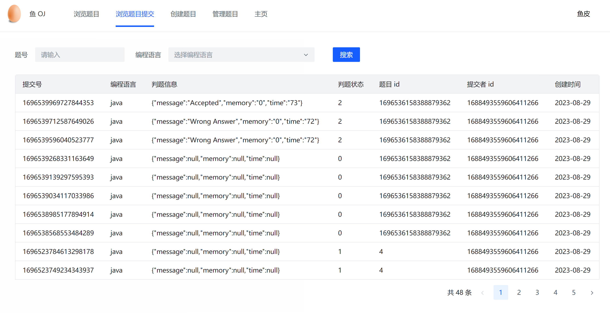

## 本期作业

1. 完成单体项目的微服务改造：http://gitlab.code-nav.cn/root/yuoj-backend-microservice
2. 整理属于自己的微服务模板配置

## 项目上线

[如何快速部署微服务项目？保姆级教程](https://www.code-nav.cn/course/1788871761736998913/section/1789186997333499906?type=)


