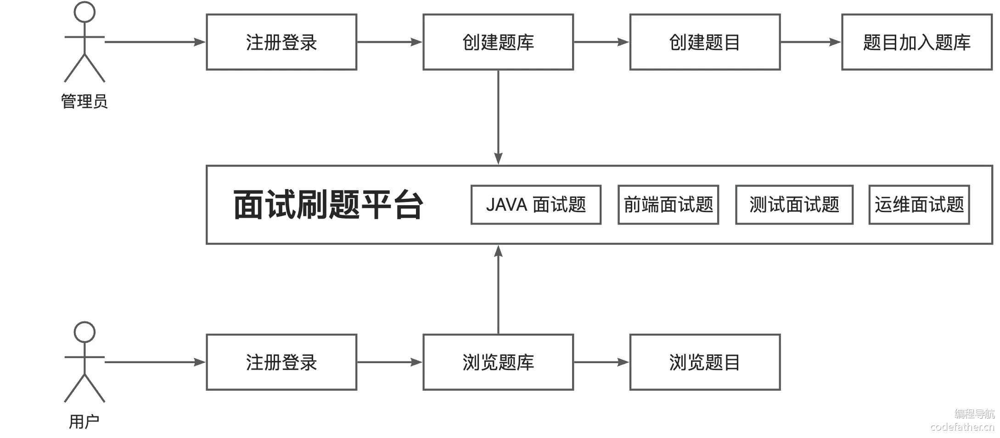
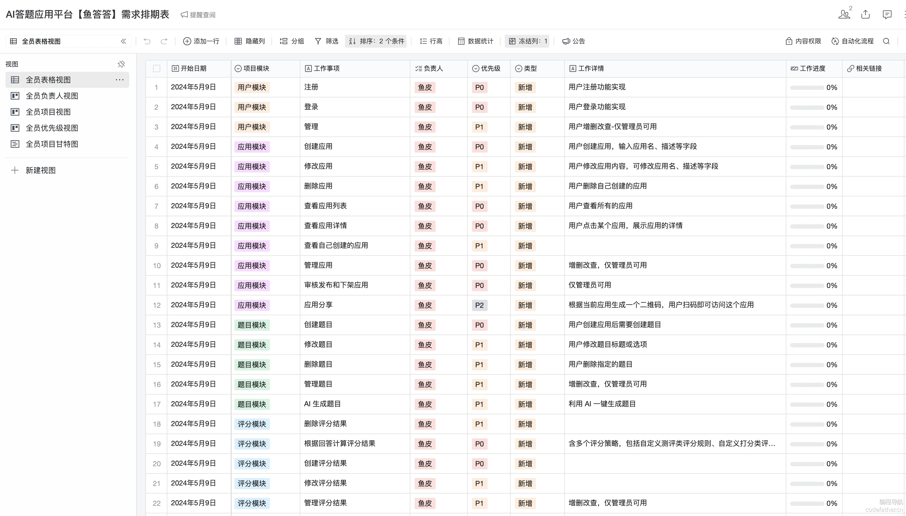
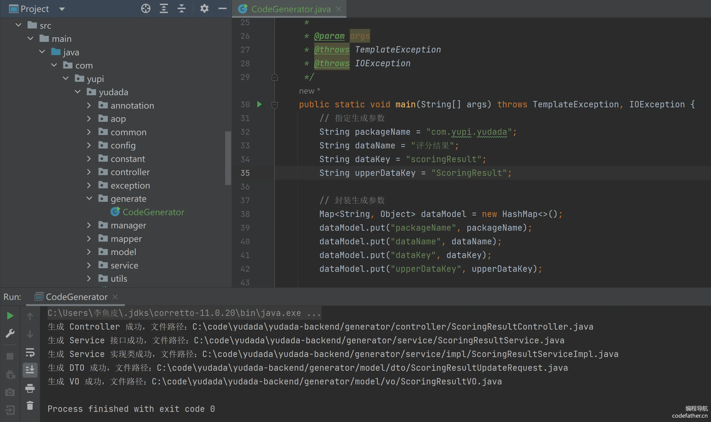
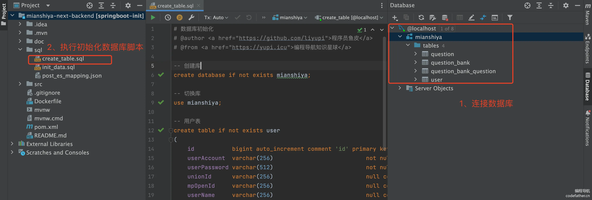
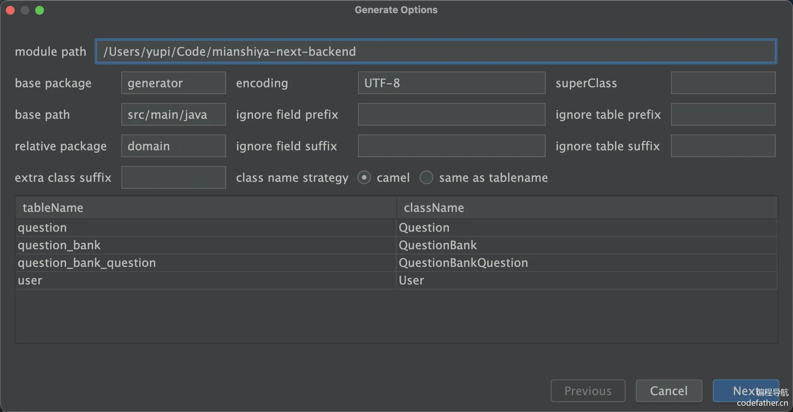
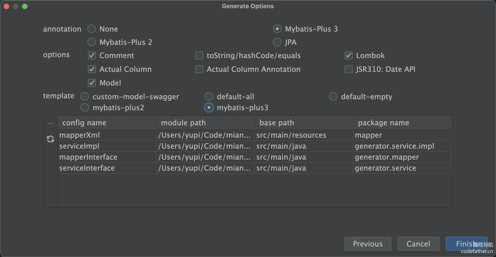

## 本节重点

开发面试刷题平台后端，包括：

- 需求分析
- 库表设计
- 后端项目初始化（万用模板讲解）
- 后端基础功能开发（增删改查）
- 后端核心业务流程开发

## 一、需求分析

目标是明确要做的需求，并且给需求设置优先级，从而明确开发计划。

### 项目功能梳理

#### 基础功能

- 用户模块
- - 用户注册
  - 用户登录（账号密码）
  - 【管理员】管理用户 - 增删改查
- 题库模块
- - 查看题库列表
  - 查看题库详情（展示题库下的题目）
  - 【管理员】管理题库 - 增删改查
- 题目模块
- - 题目搜索
  - 查看题目详情（进入刷题页面）
  - 【管理员】管理题目 - 增删改查（比如按照题库查询题目、修改题目所属题库等）

#### 高级功能

- 题目批量管理
- - 【管理员】批量向题库添加题目
  - 【管理员】批量从题库移除题目
  - 【管理员】批量删除题目
- 分词题目搜索
- 用户刷题记录日历图
- 自动缓存热门题目
- 网站流量控制和熔断
- 动态 IP 黑白名单过滤
- 同端登录冲突检测
- 分级题目反爬虫策略

### 核心业务流程

如下图：



### 需求优先级

根据核心业务业务流程，明确需求开发的优先级。

- P0 为核心，非做不可
- P1 为重点功能，最好做
- P2 为实用功能，有空就做
- P3 可做可不做，时间充裕再做

排好优先级的需求列表如下，其实用表格的形式整理更好：

#### 基础功能（均为 P0）

- 用户模块
- - 用户注册
  - 用户登录（账号密码）
  - 【管理员】管理用户 - 增删改查
- 题库模块
- - 查看题库列表
  - 查看题库详情（展示题库下的题目）
  - 【管理员】管理题库 - 增删改查
- 题目模块
- - 题目搜索
  - 查看题目详情（进入刷题页面）
  - 【管理员】管理题目 - 增删改查（比如按照题库查询题目、修改题目所属题库等）

#### 高级功能（均为 P1 ~ P2）

- 题目批量管理 P1
- - 【管理员】批量向题库添加题目
  - 【管理员】批量从题库移除题目
  - 【管理员】批量删除题目
- 分词题目搜索 P1
- 用户刷题记录日历图 P1
- 自动缓存热门题目 P2
- 网站流量控制和熔断 P2
- 动态 IP 黑白名单过滤 P2
- 同端登录冲突检测 P2
- 分级题目反爬虫策略 P2

排好优先级后，后端和前端同学就可以根据优先级去设计接口和页面了。

企业中一般使用专业的系统或者表格来管理需求。下图仅为示例，使用腾讯文档的智能表实现：



## 二、库表设计

对应需求分析中的功能梳理的模块，有 4 张核心表。

库名：mianshiya

数据库初始化文件：见下方

每个表鱼皮都给出了基础版和可扩展字段，便于大家学习。

### 1、用户表

#### 核心设计

用户表的核心是用户登录凭证（账号密码）和个人信息，SQL 如下：

```sql
-- 用户表
create table if not exists user
(
    id           bigint auto_increment comment 'id' primary key,
    userAccount  varchar(256)                           not null comment '账号',
    userPassword varchar(512)                           not null comment '密码',
    unionId      varchar(256)                           null comment '微信开放平台id',
    mpOpenId     varchar(256)                           null comment '公众号openId',
    userName     varchar(256)                           null comment '用户昵称',
    userAvatar   varchar(1024)                          null comment '用户头像',
    userProfile  varchar(512)                           null comment '用户简介',
    userRole     varchar(256) default 'user'            not null comment '用户角色：user/admin/ban',
    editTime     datetime     default CURRENT_TIMESTAMP not null comment '编辑时间',
    createTime   datetime     default CURRENT_TIMESTAMP not null comment '创建时间',
    updateTime   datetime     default CURRENT_TIMESTAMP not null on update CURRENT_TIMESTAMP comment '更新时间',
    isDelete     tinyint      default 0                 not null comment '是否删除',
    index idx_unionId (unionId)
) comment '用户' collate = utf8mb4_unicode_ci;
```

其中，unionId、mpOpenId 是为了实现公众号登录的，也可以省略。每个微信用户在同一家公司（主体）的 unionId 是唯一的，在同一个公众号的 mpOpenId 是唯一的。

editTime 和 updateTime 的区别是：editTime 表示用户编辑个人信息的时间（需要业务代码来更新），而 updateTime 表示这条用户记录任何字段发生修改的时间（由数据库自动更新）。

#### 扩展设计

1）如果要实现会员功能，可以对表进行如下扩展：

1. 给 userRole 字段新增枚举值 `vip`，表示会员用户，可根据该值判断用户权限
2. 新增会员过期时间字段，可用于记录会员有效期
3. 新增会员兑换码字段，可用于记录会员的开通方式
4. 新增会员编号字段，可便于定位用户并提供额外服务，并增加会员归属感

对应的 SQL 如下：

```sql
vipExpireTime datetime     null comment '会员过期时间',
vipCode       varchar(128) null comment '会员兑换码',
vipNumber     bigint       null comment '会员编号'
```

2）如果要实现用户邀请功能，可以对表进行如下扩展：

1. 新增 shareCode 分享码字段，用于记录每个用户的唯一邀请标识，可拼接到邀请网址后面，比如 https://mianshiya.com/?shareCode=xxx
2. 新增 inviteUser 字段，用于记录该用户被哪个用户邀请了，可通过这个字段查询某用户邀请的用户列表。

对应的 SQL 如下：

```sql
shareCode     varchar(20)  DEFAULT NULL COMMENT '分享码',
inviteUser    bigint       DEFAULT NULL COMMENT '邀请用户 id'
```

### 2、题库表

#### 核心设计

题库表的核心是题库信息（标题、描述、图片），SQL 如下：

```sql
-- 题库表
create table if not exists question_bank
(
    id          bigint auto_increment comment 'id' primary key,
    title       varchar(256)                       null comment '标题',
    description text                               null comment '描述',
    picture     varchar(2048)                      null comment '图片',
    userId      bigint                             not null comment '创建用户 id',
    editTime    datetime default CURRENT_TIMESTAMP not null comment '编辑时间',
    createTime  datetime default CURRENT_TIMESTAMP not null comment '创建时间',
    updateTime  datetime default CURRENT_TIMESTAMP not null on update CURRENT_TIMESTAMP comment '更新时间',
    isDelete    tinyint  default 0                 not null comment '是否删除',
    index idx_title (title)
) comment '题库' collate = utf8mb4_unicode_ci;
```

其中，picture 存储的是图片的 url 地址，而不是完整图片文件。通过 userId 和用户表关联，在本项目中只有管理员才能创建题库。

由于用户很可能按照标题搜索题库，所以给 title 字段增加索引。

#### 扩展设计

1）如果要实现题库审核功能，可以对表进行如下扩展：

1. 新增审核状态字段，用枚举值表示待审核、通过和拒绝
2. 新增审核信息字段，用于记录未过审的原因等
3. 新增审核人 id 字段，便于审计操作。比如出现了违规内容过审的情况，可以追责到审核人。
4. 新增审核时间字段，也是便于审计。

对应的 SQL 如下：

```sql
reviewStatus  int      default 0  not null comment '状态：0-待审核, 1-通过, 2-拒绝',
reviewMessage varchar(512)        null comment '审核信息',
reviewerId    bigint              null comment '审核人 id',
reviewTime    datetime            null comment '审核时间'
```

2）如果要实现题库排序功能，可以新增整型的优先级字段，并且根据该字段排序。

该字段还可以用于快速实现题库精选和置顶功能，比如优先级 = 1000 的题库表示精选，优先级 = 10000 的题库表示置顶。

对应的 SQL 如下：

```sql
priority  int  default 0  not null comment '优先级'
```

3）如果要实现题库浏览功能，可以新增题库浏览数字段，每次进入题目详情页时该字段的值 +1，还可以根据该字段对题库进行排序。

对应的 SQL 如下：

```sql
viewNum  int  default 0  not null comment '浏览量'
```

如果要实现用户浏览数（同一个用户浏览数最多 +1），还需要额外的题库浏览记录表。

### 3、题目表

题目表的核心是题目信息（标题、详细内容、标签），SQL 如下：

```sql
-- 题目表
create table if not exists question
(
    id         bigint auto_increment comment 'id' primary key,
    title      varchar(256)                       null comment '标题',
    content    text                               null comment '内容',
    tags       varchar(1024)                      null comment '标签列表（json 数组）',
    answer     text                               null comment '推荐答案',
    userId     bigint                             not null comment '创建用户 id',
    editTime   datetime default CURRENT_TIMESTAMP not null comment '编辑时间',
    createTime datetime default CURRENT_TIMESTAMP not null comment '创建时间',
    updateTime datetime default CURRENT_TIMESTAMP not null on update CURRENT_TIMESTAMP comment '更新时间',
    isDelete   tinyint  default 0                 not null comment '是否删除',
    index idx_title (title),
    index idx_userId (userId)
) comment '题目' collate = utf8mb4_unicode_ci;
```

几个重点：

1. 题目标题 title 和题目创建人 userId 是常用的题目搜索条件，所以添加索引提升查询性能。
2. 题目可能有多个标签，为了简化设计，没有采用关联表，而是以 JSON 数组字符串的方式存储，比如 `["Java", "Python"]`。
3. 题目内容（详情）和题目答案可能很长，所以使用 text 类型。

#### 扩展设计

题目表有很多可以扩展的方法，下面举一些例子。

1）如果要实现题目审核功能，可以参考上述题库审核功能，新增 4 个字段即可：

```sql
reviewStatus  int      default 0  not null comment '状态：0-待审核, 1-通过, 2-拒绝',
reviewMessage varchar(512)        null comment '审核信息',
reviewerId    bigint              null comment '审核人 id',
reviewTime    datetime            null comment '审核时间'
```

2）可能有很多评价题目的指标，比如浏览数、点赞数、收藏数，参考字段如下：

```sql
viewNum       int      default 0    not null comment '浏览量',
thumbNum      int      default 0    not null comment '点赞数',
favourNum     int      default 0    not null comment '收藏数'
```

3）如果要实现题目排序、精选和置顶功能，可以参考上述题库表的设计，新增整型的优先级字段，并且根据该字段排序。对应的 SQL 如下：

```sql
priority  int  default 0  not null comment '优先级'
```

4）如果题目是从其他网站或途径获取到的，担心有版权风险，可以增加题目来源字段。最简单的实现方式就是直接存来源名称：

```sql
source   varchar(512)  null comment '题目来源'
```

5）如果想设置部分题目仅会员可见，可以给题目表加上一个 “是否仅会员可见” 的字段，本质上是个布尔类型，用 1 表示仅会员可见。参考 SQL 如下：

```sql
needVip  tinyint  default 0  not null comment '仅会员可见（1 表示仅会员可见）'
```

### 4、题库题目关系表

#### 核心设计

由于一个题库可以有多个题目，一个题目可以属于多个题库，所以需要关联表来实现。

实现基础功能的 SQL 如下：

```sql
-- 题库题目表（硬删除）
create table if not exists question_bank_question
(
    id             bigint auto_increment comment 'id' primary key,
    questionBankId bigint                             not null comment '题库 id',
    questionId     bigint                             not null comment '题目 id',
    userId         bigint                             not null comment '创建用户 id',
    createTime     datetime default CURRENT_TIMESTAMP not null comment '创建时间',
    updateTime     datetime default CURRENT_TIMESTAMP not null on update CURRENT_TIMESTAMP comment '更新时间',
    UNIQUE (questionBankId, questionId)
) comment '题库题目' collate = utf8mb4_unicode_ci;
```

几个重点：

1. 上述代码中的 userId 表示添加题目到题库的用户 id，仅管理员可操作
2. 由于关联表中的数据记录并没有那么重要（一般由管理员维护），所以直接采用硬删除的方式，如果将题目移出题库，直接删掉对应的数据即可。按照这种设计，createTime 就是题目加入到题库的时间。
3. 通过给题库 id 和题目 id 添加 **联合唯一索引** ，防止题目被重复添加到同一个题库中。而且要注意，将 questionBankId 放到前面，因为数据库中的查询大多是基于 `questionBankId` 进行的，比如查找某个题库中的所有问题，或者在一个题库中查找特定问题，将 `questionBankId` 放在前面符合查询模式，会使得这些查询更加高效（索引的最左前缀原则）。

#### 扩展设计

1）如果要对题库内的题目进行排序，可以增加题目顺序字段（整型）。对应的 SQL 如下：

```sql
questionOrder  int  default 0  not null comment '题目顺序（题号）'
```

需要注意，如果要实现任意移动题目顺序的功能，可能每次要更新多条记录的顺序，比较影响性能。如果追求更高性能的话，可以先在内存中计算出要变更的题目顺序，以减少更新的记录数。比如将第 100 题移动到第 98 题，只需要修改几条记录的顺序，不影响前面的题目。



## 三、后端项目初始化

1）后端万用模板介绍，核心能力讲解

可以参考万用模板项目的 READMD.md 文件来了解模板的功能和启动方法。

后端万用模板介绍和源码下载：https://www.code-nav.cn/course/1826803928691945473/section/1826872096558985217?contentType=text&type=

2）准备依赖

- MySQL 必须准备 8.x 版本
- Redis 默认不开启（后续教程会用到）
- Elasticsearch 默认不开启（后续教程会用到）
- COS 对象存储，不影响运行

3）执行模板的初始化 SQL 脚本，创建数据库表：



然后可以尝试运行项目。

4）模板改造

1. 全局替换模块名，由 springboot-init 改为 mianshiya-next-backend（或者自定义）
2. 全局修改包名，重构 `com.yupi.springbootinit` + 全局替换 `springbootinit` 为 `mianshiya`
3. 按需移除不必要的模块，比如 Elasticsearch、微信开发、表格处理、定时任务相关代码。不移除也不影响项目运行。
4. 执行本项目的数据库初始化文件，修改 `application.yml` 配置，更改数据库等配置为自己的（比如将 my_db 改为 mianshiya）

自己做项目的话，一定要用 Git 进行托管，可以看到改动的文件记录。而且修改代码后可以提交一下代码，万一改错了也可以很方便地回滚。

5）启动项目，执行 MainApplication 主类文件即可。

推荐用 Debug 来启动项目，启动成功后，可以通过内置的 Swagger 接口文档来分析接口的请求参数和响应。

地址：http://localhost:8101/api/doc.html#/home

## 四、后端基础开发 - 增删改查

根据需求分析阶段整理好的项目功能，基础开发就是完成几张核心数据库表的增删改查，**先不包含任何复杂的业务逻辑**。

每个模块都要遵循如下的开发流程：

### 1、数据访问层代码生成

使用 MyBatisX 代码生成插件快速得到 mapper 和数据库实体类，生成后移动到项目对应位置（mapper 和 model.entity 包）。



然后更改生成的数据库实体类的字段配置，指定主键策略和逻辑删除。

比如题目表，id 默认是连续生成的，容易被爬虫抓取，所以更换策略为 `ASSIGN_ID` 雪花算法生成。示例代码：

```java
public class Question implements Serializable {
    /**
     * id（要指定主键策略）
     */
    @TableId(type = IdType.ASSIGN_ID)
    private Long id;

    // ...
    
    /**
     * 是否删除（逻辑删除）
     */
    @TableLogic
    private Integer isDelete;
}
```

使用框架的过程中，有任何疑问，都可以在官方文档查阅，比如了解 MyBatis Plus 的主键生成注解：https://baomidou.com/reference/annotation/#tableid

### 2、业务逻辑代码生成

使用万用模板的代码生成器工具（CodeGenerator）生成代码，包括：Controller、Service 接口和实现类、数据模型包装类。

修改生成参数即可使用（用户表可以不生成，因为万用模板已经自带了用户业务逻辑代码）：


比如修改配置代码如下，生成题库相关的业务逻辑代码：

```java
// 指定生成参数
String packageName = "com.yupi.mianshiya";
String dataName = "题库";
String dataKey = "questionBank";
// 注意，这里需要保持首字母大写
String upperDataKey = "QuestionBank";
```

生成之后，将生成的文件从 generator 包移动到对应的位置即可，包括 controller、service、model.dto、model.vo。

想了解生成代码的原理，自己也做一个生成器，可以学习鱼皮编程导航的 [代码生成器共享平台项目](https://www.code-nav.cn/course/1790980795074654209) 。

### 3、数据模型开发

需要编写数据模型包装类（dto 包的请求类和 vo 包的视图类）、JSON 结构对应的类、枚举类。

**其中，包装类需要根据前端实际传递的请求参数或需要的响应结果自行修改。**

以创建题目请求包装类 QuestionAddRequest 为例，需要保留前端需要的字段，并且将 JSON 字符串字段转换为前端更好理解的数据类型（比如 tags 由 String 转为 List），还有一些由后端自动生成的字段（比如 userId、createTime）就不用写到类里了。代码如下：

```java
@Data
public class QuestionAddRequest implements Serializable {

    /**
     * 标题
     */
    private String title;

    /**
     * 内容
     */
    private String content;

    /**
     * 标签列表
     */
    private List<String> tags;

    /**
     * 推荐答案
     */
    private String answer;

    private static final long serialVersionUID = 1L;
}
```

其他的请求包装类同理，目前我们只实现基本的增删改查包装类，需要仔细地依次过一遍生成的代码，不需要用到的请求类可以移除。比如移除 QuestionBankQuestionEditRequest 类，因为不需要让用户编辑题库和题目的关系。

💡 小技巧：可以结合具体的业务、实体类（比如 Question）、以及创建表的 DDL 语句去编写请求包装类。

#### 扩展

目前的表设计不涉及枚举字段的编写。

如果需要给题目增加审核功能，那么审核状态就是一个枚举字段。作为示例，给大家提供审核状态枚举类代码：

```java
package com.yupi.yudada.model.enums;

import cn.hutool.core.util.ObjectUtil;

import java.util.Arrays;
import java.util.List;
import java.util.stream.Collectors;

/**
 * 审核状态枚举
 *
 * @author <a href="https://github.com/liyupi">程序员鱼皮</a>
 * @from <a href="https://www.code-nav.cn">编程导航学习圈</a>
 */
public enum ReviewStatusEnum {

    REVIEWING("待审核", 0),
    PASS("通过", 1),
    REJECT("拒绝", 2);

    private final String text;

    private final int value;

    ReviewStatusEnum(String text, int value) {
        this.text = text;
        this.value = value;
    }

    /**
     * 根据 value 获取枚举
     *
     * @param value
     * @return
     */
    public static ReviewStatusEnum getEnumByValue(Integer value) {
        if (ObjectUtil.isEmpty(value)) {
            return null;
        }
        for (ReviewStatusEnum anEnum : ReviewStatusEnum.values()) {
            if (anEnum.value == value) {
                return anEnum;
            }
        }
        return null;
    }

    /**
     * 获取值列表
     *
     * @return
     */
    public static List<Integer> getValues() {
        return Arrays.stream(values()).map(item -> item.value).collect(Collectors.toList());
    }

    public int getValue() {
        return value;
    }

    public String getText() {
        return text;
    }
}
```

其中，getEnumByValue 是通过循环找到枚举值，可以用 Map 缓存所有枚举值来加速查找。

### 4、接口开发

修改生成的 Controller 接口，不需要包含业务逻辑，处理字段不一致的问题、并且将无用的接口移除掉，能跑通就行。

生成的 Controller 接口结构都是一致的，只需要理解一个 Controller，其他的都很简单。

### 5、服务开发

修改生成的 Service 接口和实现类，处理字段不一致的问题，略微调整数据校验、查询条件等代码，能跑通就行。

生成的 Service 结构都是一致的，只需要理解一个，其他的都很简单。

### 6、Swagger 接口文档测试

运行项目，通过访问 Swagger 接口文档来测试增删改查接口能否正常执行。

地址：http://localhost:8101/api/doc.html#/home

## 五、后端核心业务流程开发

### 核心业务接口梳理

根据之前整理的功能列表，分析核心业务流程需要调用的接口：

1）用户模块

- 用户注册：已完成 ✅ 万用模板自带
- 用户登录（账号密码）：已完成 ✅ 万用模板自带
- 【管理员】管理用户 - 增删改查：已完成 ✅ 万用模板自带

2）题库模块

- 查看题库列表：分页获取题库接口，⏰ 已通过生成器生成，需要确认
- 查看题库详情（展示题库下的题目）：⏰ 根据 id 获取题库详情接口，需要开发
- 【管理员】管理题库 - 增删改查：⏰ 已通过生成器生成，需要确认

3）题目模块

- 题目搜索：分页获取题目接口，⏰ 已通过生成器生成，需要确认
- 查看题目详情（进入刷题页面）：⏰ 根据 id 获取题目详情接口，需要确认
- 【管理员】管理题目 - 增删改查：⏰ 已通过生成器生成，需要确认
- 【管理员】按照题库查询题目：⏰ 根据题库 id 获取题目列表，需要开发
- 【管理员】修改题目所属题库等：⏰ 修改题目所属题库接口，需要开发

然后通过接口文档来完整测试一遍业务流程即可。

### 1、确认和完善接口

1）查看题库列表：分页获取题库接口

需要修改题库的校验规则（validQuestionBank）和查询条件（getQueryWrapper）

2）题目搜索：分页获取题目接口

需要修改题库的校验规则（validQuestion）和查询条件（getQueryWrapper）

3）【管理员】管理题库 - 增删改查

创建、删除、编辑接口需要补充仅管理员可用的注解

```java
@AuthCheck(mustRole = UserConstant.ADMIN_ROLE)
```

4）【管理员】管理题目 - 增删改查

创建、删除、编辑接口需要补充仅管理员可用的注解

5）查看题目详情（进入刷题页面）：根据 id 获取题目详情接口

该接口正常，不用修改

### 2、根据题库查询题目列表接口

#### 分析

需求：根据题库 id 查询题目列表

分析：由于同一个题库内的题目不会很多，为了简化实现，可以直接获取全部题目。注意，这个功能要抽象成 service 方法，便于后续的获取题库详情接口复用。

由于题目和题库是通过关联表维护关系的，所以在查询时，要先通过查询关联表得到题目 id，再根据 id 从题目表查询到题目的完整信息。

有 2 种实现方式：

1）通过 SQL 的 join 联表查询

示例 SQL 如下：

```sql
SELECT 
    q.id,
    q.title,
    q.content,
    q.tags,
    q.answer,
    q.userId,
    q.createTime,
    q.updateTime
FROM 
    question_bank_question qbq
JOIN 
    question q 
ON 
    qbq.questionId = q.id
WHERE 
    qbq.questionBankId = ?;  -- 在这里替换 ? 为具体的题库 id
```

2）业务层分步查询

要先通过查询关联表得到题目 id，再把 id 放到集合中，根据 id 使用 in 查询从题目表查询到题目的完整信息。

此处选择第二种方式，因为关联逻辑并不复杂、数据量也不大，业务层实现更灵活，也便于组合其他条件去过滤题目列表。

注意，如果要对题目题库关联表和题目表同时进行过滤和分页查询，那么考虑使用 SQL 的 join 实现，因为业务层处理多表分页比较麻烦。

#### 开发

1）请求参数为 questionBankId，直接补充到题目查询请求类 QuestionQueryRequest：

```java
public class QuestionQueryRequest extends PageRequest implements Serializable {

    // 省略其他字段。。。
    
    /**
     * 题库 id
     */
    private Long questionBankId;
}
```

2）该接口本质上还是查询题目列表，可以把题库 id 当做一个过滤题目的查询条件，所以应该在 QuestionService 中编写一个通用的分页获取题目列表的方法。

代码如下：

```java
public Page<Question> listQuestionByPage(QuestionQueryRequest questionQueryRequest) {
    long current = questionQueryRequest.getCurrent();
    long size = questionQueryRequest.getPageSize();
    // 题目表的查询条件
    QueryWrapper<Question> queryWrapper = this.getQueryWrapper(questionQueryRequest);
    // 根据题库查询题目列表接口
    Long questionBankId = questionQueryRequest.getQuestionBankId();
    if (questionBankId != null) {
        // 查询题库内的题目 id
        LambdaQueryWrapper<QuestionBankQuestion> lambdaQueryWrapper = Wrappers.lambdaQuery(QuestionBankQuestion.class)
                .select(QuestionBankQuestion::getQuestionId)
                .eq(QuestionBankQuestion::getQuestionBankId, questionBankId);
        List<QuestionBankQuestion> questionList = questionBankQuestionService.list(lambdaQueryWrapper);
        if (CollUtil.isNotEmpty(questionList)) {
            // 取出题目 id 集合
            Set<Long> questionIdSet = questionList.stream()
                    .map(QuestionBankQuestion::getQuestionId)
                    .collect(Collectors.toSet());
            // 复用原有题目表的查询条件
            queryWrapper.in("id", questionIdSet);
        }
    }
    // 查询数据库
    Page<Question> questionPage = this.page(new Page<>(current, size), queryWrapper);
    return questionPage;
}
```

上述代码中，有几个学习重点：

1. 查询关联表的时候，不要 select 所有字段，只取 questionId 就够了，可以提升性能。
2. 注意判断通过关联表查询到的题目数量，如果为空，不用再作为查询条件。
3. 从关联表查到的虽然只有一个字段，但返回的还是对象，所以需要使用 Lambda 表达式转换成题目 id 集合。
4. 把题库 id 通过关联表转换为了多个题目 id，巧妙地复用了原有的题目过滤条件（QueryWrapper），可以同时支持按照题库 id 和标题等其他条件来搜索题目。

### 3、获取题库详情接口

#### 分析

需求：根据题库 id 获取题库详情，同时可能需要查询到题库内的题目列表。

分析：可以用一个字段来控制是否要关联查询题目列表，前端可以根据不同的场景，给该字段传入不同的值。这样一来，对于有些不需要关联查询题目列表的页面，就能减少性能损耗。

实现过程比较简单，先从题库表查询出题库信息，然后复用上一步中已开发好的“根据题库 id 获取题目列表”的 Service 获取到题目列表，再封装返回值即可。

#### 开发

1）因为获取题库详情接口其实也是对题库的查询，所以可以给 QuestionBankQueryRequest 增加字段 needQueryQuestionList，用于控制是否要关联查询题目列表。默认为 false，表示不查询。

代码如下：

```java
public class QuestionBankQueryRequest extends PageRequest implements Serializable {
    // 省略其他字段...
    
    /**
     * 是否要关联查询题目列表
     */
    private boolean needQueryQuestionList;

    private static final long serialVersionUID = 1L;
}
```

2）封装题库详情响应类，补充题目列表分页。代码如下：

```java
public class QuestionBankVO implements Serializable {
    // 省略其他字段...
    
    /**
     * 题库里的题目列表（分页）
     */
    Page<Question> questionPage;
}
```

此处也可以改为补充列表而不是分页，根据自己后续的实际需求调整即可。

3）在 QuestionBankController 中修改“根据 id 获取题库”封装类的接口，代码如下：

```java
@GetMapping("/get/vo")
public BaseResponse<QuestionBankVO> getQuestionBankVOById(QuestionBankQueryRequest questionBankQueryRequest, HttpServletRequest request) {
    ThrowUtils.throwIf(questionBankQueryRequest == null, ErrorCode.PARAMS_ERROR);
    Long id = questionBankQueryRequest.getId();
    ThrowUtils.throwIf(id <= 0, ErrorCode.PARAMS_ERROR);
    // 查询数据库
    QuestionBank questionBank = questionBankService.getById(id);
    ThrowUtils.throwIf(questionBank == null, ErrorCode.NOT_FOUND_ERROR);
    // 查询题库封装类
    QuestionBankVO questionBankVO = questionBankService.getQuestionBankVO(questionBank, request);
    // 是否要关联查询题库下的题目列表
    boolean needQueryQuestionList = questionBankQueryRequest.isNeedQueryQuestionList();
    if (needQueryQuestionList) {
        QuestionQueryRequest questionQueryRequest = new QuestionQueryRequest();
        questionQueryRequest.setQuestionBankId(id);
        Page<Question> questionPage = questionService.listQuestionByPage(questionQueryRequest);
        questionBankVO.setQuestionPage(questionPage);
    }
    // 获取封装类
    return ResultUtils.success(questionBankVO);
}
```

注意，这段逻辑如果觉得过于复杂，也可以考虑封装到 getQuestionBankVO 方法中。

### 4、修改题目所属题库接口

#### 分析

需求：根据题目 id 和题库 id，修改题目所属题库。

分析：修改的本质是添加和删除，是两个动作。

- 如果题目未加入到该题库，则管理员可以添加题目到题库，在题库题目关联表中加一条记录。
- 如果题目已加入到该题库，则管理员可以从题库移除题目，需要将关联表已有的记录删除。

所以需要分别开发 2 个接口：创建题库题目关联、移除题库题目关联。

由于题库题目关联表已经添加了 `题库 id、题目 id` 的唯一性约束，不用担心重复添加脏数据，做好异常处理即可。

#### 创建题库题目关联

1）之前已经通过生成器得到了创建关联的 Controller 接口代码，只需要补充数据不存在的校验。修改 QuestionBankQuestionServiceImpl 的 validQuestionBankQuestion 方法，进行校验。代码如下：

```java
@Override
public void validQuestionBankQuestion(QuestionBankQuestion questionBankQuestion, boolean add) {
    ThrowUtils.throwIf(questionBankQuestion == null, ErrorCode.PARAMS_ERROR);
    // 题目和题库必须存在
    Long questionId = questionBankQuestion.getQuestionId();
    if (questionId != null) {
        Question question = questionService.getById(questionId);
        ThrowUtils.throwIf(question == null, ErrorCode.NOT_FOUND_ERROR, "题目不存在");
    }
    Long questionBankId = questionBankQuestion.getQuestionBankId();
    if (questionBankId != null) {
        QuestionBank questionBank = questionBankService.getById(questionBankId);
        ThrowUtils.throwIf(questionBank == null, ErrorCode.NOT_FOUND_ERROR, "题库不存在");
    }
}
```

因为 QuestionService 和 QuestionBankQuestionService 互相引用，会导致循环依赖问题，让项目无法启动。可以通过给 QuestionBankQuestionServiceImpl 中引用 QuestionService 的位置加上 `@Lazy` 注解解决。

```java
@Resource
@Lazy
private QuestionService questionService;
```

2）注意，需要给创建关联接口补充“仅管理员”的权限：

```java
@PostMapping("/add")
@AuthCheck(mustRole = UserConstant.ADMIN_ROLE)
public BaseResponse<Long> addQuestionBankQuestion(
    @RequestBody QuestionBankQuestionAddRequest questionBankQuestionAddRequest,
    HttpServletRequest request) {}
```

#### 移除题库题目关联

1）编写请求类：

```java
/**
 * 删除题目题库关系请求
 */
@Data
public class QuestionBankQuestionRemoveRequest implements Serializable {
    /**
     * 题库 id
     */
    private Long questionBankId;

    /**
     * 题目 id
     */
    private Long questionId;

    private static final long serialVersionUID = 1L;
}
```

2）编写接口：

```java
@PostMapping("/remove")
@AuthCheck(mustRole = UserConstant.ADMIN_ROLE)
public BaseResponse<Boolean> removeQuestionBankQuestion(
        @RequestBody QuestionBankQuestionRemoveRequest questionBankQuestionRemoveRequest
) {
    // 参数校验
    ThrowUtils.throwIf(questionBankQuestionRemoveRequest == null, ErrorCode.PARAMS_ERROR);
    Long questionBankId = questionBankQuestionRemoveRequest.getQuestionBankId();
    Long questionId = questionBankQuestionRemoveRequest.getQuestionId();
    ThrowUtils.throwIf(questionBankId == null || questionId == null, ErrorCode.PARAMS_ERROR);
    // 构造查询
    LambdaQueryWrapper<QuestionBankQuestion> lambdaQueryWrapper = Wrappers.lambdaQuery(QuestionBankQuestion.class)
            .eq(QuestionBankQuestion::getQuestionId, questionId)
            .eq(QuestionBankQuestion::getQuestionBankId, questionBankId);
    boolean result = questionBankQuestionService.remove(lambdaQueryWrapper);
    return ResultUtils.success(result);
}
```

逻辑并不复杂，所以就直接在 Controller 编写了。有时间的话，可以再移动到 Service 中。

#### 扩展

1）如果用同样的参数多次调用“创建题库题目关联接口”，会因为数据库的唯一性约束导致 `org.springframework.dao.DuplicateKeyException` 异常，然后会被全局异常处理器处理返回“系统错误”。可以针对这种情况进行异常捕获，并优化报错文案，比如“不能重复加入”。

2）如果给题库表增加题目总数字段，则修改题目所属题库时，要同时更新题库表的题目总数，涉及多表操作，需要使用事务实现。

------

开发完所有接口后，使用 Swagger 对整个流程进行测试即可。