## 本节重点

前端页面开发，跑通前后端核心业务流程，主要包括：

- 基础页面开发
- - 用户模块
  - 题库管理页面
  - 题目管理页面
- 核心页面开发
- - 主页
  - 题库列表页
  - 题目搜索页
  - 题库详情页
  - 题目详情页
- 题目题库绑定（管理员）
- - 按照题库查询题目
  - 修改题目所属题库

## 准备工作

在本章开始之前，可以先准备一些示例数据，便于前端开发时查看效果。

```scilab
-- 初始数据
use mianshiya;

-- 用户表初始数据（密码是 12345678）
INSERT INTO user (id, userAccount, userPassword, unionId, mpOpenId, userName, userAvatar, userProfile, userRole)
VALUES (1, 'user1', 'b0dd3697a192885d7c055db46155b26a', 'unionId1', 'mpOpenId1', 'user1',
        'https://www.code-nav.cn/logo.png', '喜欢编程的小白', 'user'),
       (2, 'user2', 'b0dd3697a192885d7c055db46155b26a', 'unionId2', 'mpOpenId2', 'user2',
        'https://www.code-nav.cn/logo.png', '全栈开发工程师', 'user'),
       (3, 'user3', 'b0dd3697a192885d7c055db46155b26a', 'unionId3', 'mpOpenId3', 'user3',
        'https://www.code-nav.cn/logo.png', '前端爱好者', 'user'),
       (4, 'user4', 'b0dd3697a192885d7c055db46155b26a', 'unionId4', 'mpOpenId4', 'user4',
        'https://www.code-nav.cn/logo.png', '后端开发工程师', 'user'),
       (5, 'yupi', 'b0dd3697a192885d7c055db46155b26a', NULL, NULL, '程序员鱼皮', 'https://www.code-nav.cn/logo.png',
        '系统管理员', 'admin');

-- 题库表初始数据
INSERT INTO question_bank (title, description, picture, userId)
VALUES ('JavaScript 基础', '包含 JavaScript 的基础知识题目',
        'https://pic.code-nav.cn/mianshiya/question_bank_picture/1777886594896760834/JldkWf9w_JavaScript.png', 1),
       ('CSS 样式', '包含 CSS 相关的样式问题',
        'https://pic.code-nav.cn/mianshiya/question_bank_picture/1777886594896760834/QatnFmEN_CSS.png', 2),
       ('HTML 基础', 'HTML 标记语言的基本知识', 'https://www.mianshiya.com/logo.png', 3),
       ('前端框架', 'React, Vue, Angular 等框架相关的题目', 'https://www.mianshiya.com/logo.png', 1),
       ('算法与数据结构', '数据结构和算法题目', 'https://www.mianshiya.com/logo.png', 2),
       ('数据库原理', 'SQL 语句和数据库设计', 'https://www.mianshiya.com/logo.png', 3),
       ('操作系统', '操作系统的基本概念', 'https://www.mianshiya.com/logo.png', 1),
       ('网络协议', 'HTTP, TCP/IP 等网络协议题目', 'https://www.mianshiya.com/logo.png', 2),
       ('设计模式', '常见设计模式及其应用', 'https://www.mianshiya.com/logo.png', 3),
       ('编程语言概述', '多种编程语言的基础知识', 'https://www.mianshiya.com/logo.png', 1),
       ('版本控制', 'Git 和 SVN 的使用', 'https://www.mianshiya.com/logo.png', 2),
       ('安全与加密', '网络安全和加密技术', 'https://www.mianshiya.com/logo.png', 3),
       ('云计算', '云服务和架构', 'https://www.mianshiya.com/logo.png', 1),
       ('微服务架构', '微服务的设计与实现', 'https://www.mianshiya.com/logo.png', 2),
       ('容器技术', 'Docker 和 Kubernetes 相关知识', 'https://www.mianshiya.com/logo.png', 3),
       ('DevOps 实践', '持续集成与持续交付', 'https://www.mianshiya.com/logo.png', 1),
       ('数据分析', '数据分析和可视化', 'https://www.mianshiya.com/logo.png', 2),
       ('人工智能', '机器学习与深度学习基础', 'https://www.mianshiya.com/logo.png', 3),
       ('区块链技术', '区块链的基本原理和应用', 'https://www.mianshiya.com/logo.png', 1),
       ('项目管理', '软件开发项目的管理和执行', 'https://www.mianshiya.com/logo.png', 2);

-- 题目表初始数据
INSERT INTO question (title, content, tags, answer, userId)
VALUES ('JavaScript 变量提升', '请解释 JavaScript 中的变量提升现象。', '["JavaScript", "基础"]',
        '变量提升是指在 JavaScript 中，变量声明会被提升到作用域的顶部。', 1),
       ('CSS Flexbox 布局', '如何使用 CSS 实现一个水平居中的盒子？', '["CSS", "布局"]',
        '可以使用 Flexbox 布局，通过设置父容器 display 为 flex，并使用 justify-content: center; 对齐子元素。', 2),
       ('HTML 中的语义化', '什么是 HTML 的语义化？为什么重要？', '["HTML", "语义化"]',
        'HTML 语义化是使用正确的标签来描述内容的意义，能够提高可访问性和 SEO 效果。', 3),
       ('React 中的状态管理', '如何在 React 中管理组件状态？', '["React", "状态管理"]',
        '可以使用 React 的 useState 或 useReducer 钩子来管理组件状态，或使用 Redux 进行全局状态管理。', 1),
       ('算法：二分查找', '请实现一个二分查找算法。', '["算法", "数据结构"]',
        '二分查找是一种在有序数组中查找特定元素的算法，通过不断折半的方式缩小查找范围。', 2),
       ('数据库索引的作用', '什么是数据库索引？它的作用是什么？', '["数据库", "索引"]',
        '数据库索引是用于加快查询速度的数据结构，它通过优化查找路径减少查询时间。', 3),
       ('HTTP 与 HTTPS 的区别', '请解释 HTTP 和 HTTPS 之间的主要区别。', '["网络", "协议"]',
        'HTTPS 是加密的 HTTP，通过 SSL/TLS 提供更安全的数据传输。', 1),
       ('设计模式：单例模式', '请解释单例模式的实现及应用场景。', '["设计模式", "单例"]',
        '单例模式确保一个类只有一个实例，并提供全局访问点。常用于配置类等只需一个实例的场景。', 2),
       ('Git 中的分支管理', '如何在 Git 中管理分支？', '["版本控制", "Git"]',
        'Git 中通过 branch 命令创建分支，使用 checkout 切换分支，使用 merge 合并分支。', 3),
       ('Docker 的基本命令', '列举并解释几个常用的 Docker 命令。', '["容器技术", "Docker"]',
        '常用命令包括 docker run, docker build, docker ps, docker stop 等。', 1),
       ('前端性能优化', '列举几个前端性能优化的手段。', '["前端", "性能优化"]',
        '包括代码分割、资源压缩、缓存策略、懒加载等。', 2),
       ('JavaScript 闭包的应用', '什么是闭包？举例说明闭包的实际应用。', '["JavaScript", "高级"]',
        '闭包是指函数能够记住创建时的上下文环境，常用于数据隐藏和模块化编程。', 3),
       ('数据库事务的特性', '请解释数据库事务的 ACID 特性。', '["数据库", "事务"]',
        'ACID 代表原子性、一致性、隔离性和持久性，是事务处理的四大特性。', 1),
       ('CSS 的 BEM 命名规范', '什么是 BEM？如何使用 BEM 进行 CSS 命名？', '["CSS", "命名规范"]',
        'BEM 代表块（Block）、元素（Element）和修饰符（Modifier），是一种 CSS 命名规范。', 2),
       ('JavaScript 原型链', '请解释 JavaScript 中的原型链机制。', '["JavaScript", "原型链"]',
        '原型链是 JavaScript 实现继承的机制，对象通过原型链可以继承其他对象的属性和方法。', 3),
       ('React 生命周期', '请说明 React 组件的生命周期方法。', '["React", "生命周期"]',
        'React 组件的生命周期包括初始化、更新和卸载三个阶段，各阶段有不同的生命周期方法。', 1),
       ('HTTP 状态码 404 与 500 的区别', '请解释 HTTP 状态码 404 和 500 的含义。', '["网络", "HTTP"]',
        '404 表示未找到资源，500 表示服务器内部错误。', 2),
       ('Python 与 Java 的区别', '比较 Python 和 Java 的主要区别。', '["编程语言", "Python", "Java"]',
        'Python 是动态类型语言，语法简洁，而 Java 是静态类型语言，注重严谨性和性能。', 3),
       ('Vue 的双向数据绑定', '请解释 Vue.js 是如何实现双向数据绑定的。', '["Vue", "数据绑定"]',
        'Vue.js 通过数据劫持和发布-订阅模式实现了双向数据绑定。', 1),
       ('前端工程化的意义', '为什么需要前端工程化？', '["前端", "工程化"]',
        '前端工程化能够提高开发效率、代码质量和可维护性，规范开发流程。', 2);

-- 题库题目关联初始数据
INSERT INTO question_bank_question (questionBankId, questionId, userId)
VALUES (1, 1, 1),
       (1, 2, 1),
       (1, 3, 1),
       (1, 4, 1),
       (1, 5, 1),
       (1, 6, 1),
       (1, 7, 1),
       (1, 8, 1),
       (1, 9, 1),
       (1, 10, 1),
       (2, 2, 2),
       (2, 14, 2),
       (3, 3, 3),
       (3, 13, 3),
       (4, 4, 1),
       (4, 16, 1),
       (5, 5, 2),
       (5, 18, 2),
       (6, 6, 3),
       (6, 19, 3),
       (7, 7, 1),
       (7, 11, 1),
       (8, 8, 2),
       (8, 10, 2),
       (9, 9, 3),
       (9, 17, 3),
       (10, 12, 1),
       (10, 20, 1);
```

如果需要更多图标，可以在 [IconFont](https://www.iconfont.cn/) 获取。

## 一、基础页面开发

### 用户模块

各项目通用

在 app 下新建用户相关页面的目录，Next.js 会自动映射成路由：

- 用户登录页：/user/login
- 用户注册页：/user/register

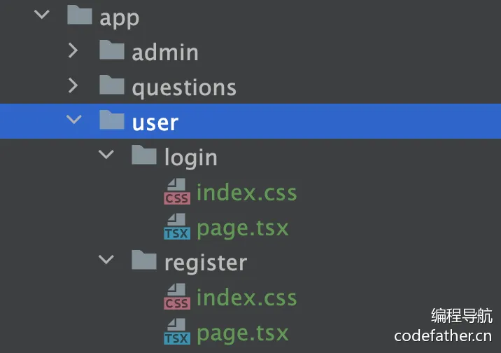

#### 1、用户登录页面

该页面没有展示类内容，不需要 SEO，而且以动态交互（输入表单）为主，所以使用客户端渲染，跟开发传统的 React 项目一样。

可以使用 Ant Design ProComponents 的 ProForm 表单组件，先安装：

```vue
npm i @ant-design/pro-form
```

安装失败的话使用：

```vue
npm i @ant-design/pro-form --force
```

页面代码如下：

```vue
"use client";

import React from "react";
import { LoginForm, ProForm, ProFormText } from "@ant-design/pro-form";
import { message } from "antd";
import { LockOutlined, UserOutlined } from "@ant-design/icons";
import { userLoginUsingPost } from "@/api/userController";
import { useRouter } from "next/navigation";
import Link from "next/link";
import Image from "next/image";
import { AppDispatch } from "@/stores";
import { setLoginUser } from "@/stores/loginUser";
import { useDispatch } from "react-redux";
import "./index.css";

/**
 * 用户登录页面
 * @param props
 */
const UserLoginPage: React.FC = (props) => {
  const [form] = ProForm.useForm();
  const router = useRouter();
  const dispatch = useDispatch<AppDispatch>();

  /**
   * 提交
   * @param values
   */
  const doSubmit = async (values: any) => {
    try {
      const res = await userLoginUsingPost(values);
      if (res.data) {
        message.success("登录成功！");
        // 保存用户登录态
        dispatch(setLoginUser(res.data));
        router.replace("/");
        form.resetFields();
      }
    } catch (e: any) {
      message.error('登录失败，' + e.message);
    }
  };

  return (
    <div id="userLoginPage">
      <LoginForm<API.UserAddRequest>
        form={form}
        logo={
          <Image src="/assets/logo.png" alt="面试鸭" width={44} height={44} />
        }
        title="面试鸭 - 用户登录"
        subTitle="程序员面试刷题网站"
        onFinish={doSubmit}
        submitter={{
          searchConfig: {
            submitText: "登录",
          },
        }}
      >
        <ProFormText
          name="userAccount"
          fieldProps={{
            size: "large",
            prefix: <UserOutlined />,
          }}
          placeholder={"请输入用户账号"}
          rules={[
            {
              required: true,
              message: "请输入用户账号!",
            },
          ]}
        />
        <ProFormText.Password
          name="userPassword"
          fieldProps={{
            size: "large",
            prefix: <LockOutlined />,
          }}
          placeholder={"请输入密码"}
          rules={[
            {
              required: true,
              message: "请输入密码！",
            },
          ]}
        />
        <div
          style={{
            marginBlockEnd: 24,
            textAlign: "end",
          }}
        >
          还没有账号？
          <Link prefetch={false} href={"/user/register"}>
            去注册
          </Link>
        </div>
      </LoginForm>
    </div>
  );
};

export default UserLoginPage;
```

上述代码中，当用户登录成功后，会将信息存放到全局状态管理中。

效果如图：

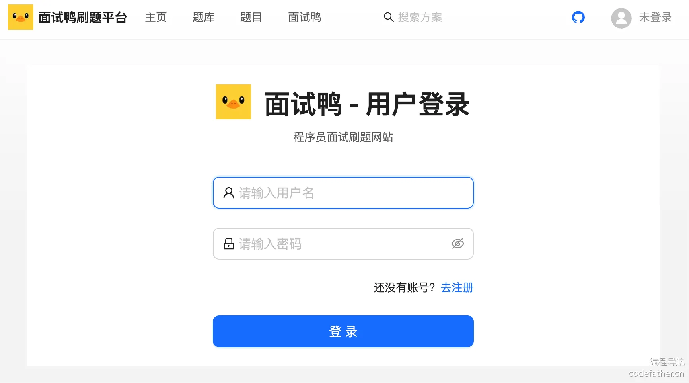

我们每次应用初始化（页面刷新）时，都需要调用后端获取当前登录用户信息，并且注意更新全局用户状态。

确保 InitLayout 的代码如下：

```tsx
// 初始化全局用户状态
const doInitLoginUser = useCallback(async () => {
  const res = await getLoginUserUsingGet();
  if (res.data) {
    // 更新全局用户状态
    dispatch(setLoginUser(res.data));
  }
}, []);
```

点击右上角导航栏的 “未登录” 时，应该要自动跳转到登录页。修改 BasicLayout 如下，根据用户 id 区分用户是否登录，展示出不同的内容：

```tsx
const loginUser = useSelector((state: RootState) => state.loginUser);
const router = useRouter();

avatarProps={{
  src: loginUser.userAvatar || "/assets/logo.png",
  size: "small",
  title: loginUser.userName || "鱼皮鸭",
  render: (props, dom) => {
    return loginUser.id ? (
      <Dropdown
        menu={{
          items: [
            {
              key: "logout",
              icon: <LogoutOutlined />,
              label: "退出登录",
            },
          ],
        }}
        >
        {dom}
      </Dropdown>
    ) : (
      <div onClick={() => router.push("/user/login")}>{dom}</div>
    );
  },
}}
```

#### 2、用户注册页面

参考用户登录页面，也是客户端渲染，同样使用高级表单组件。注意，需要让注册和登录这两个页面之间能够相互跳转。

页面代码如下：

```tsx
"use client";

import React from "react";
import { LoginForm, ProForm, ProFormText } from "@ant-design/pro-form";
import { message } from "antd";
import { LockOutlined, UserOutlined } from "@ant-design/icons";
import { userRegisterUsingPost } from "@/api/userController";
import Link from "next/link";
import { useRouter } from "next/navigation";
import Image from "next/image";
import "./index.css";

/**
 * 用户注册页面
 * @param props
 */
const UserRegisterPage: React.FC = (props) => {
  const [form] = ProForm.useForm();
  const router = useRouter();

  /**
   * 提交
   * @param values
   */
  const doSubmit = async (values: any) => {
    try {
      const res = await userRegisterUsingPost(values);
      if (res.data) {
        message.success("注册成功，请登录");
        // 前往登录页
        router.push("/user/login");
      }
    } catch (e) {
      message.error("注册失败，" + e.message);
    }
  };

  return (
    <div id="userRegisterPage">
      <LoginForm<API.UserAddRequest>
        form={form}
        logo={
          <Image src="/assets/logo.png" alt="面试鸭" width={44} height={44} />
        }
        title="面试鸭 - 用户注册"
        subTitle="程序员面试刷题网站"
        onFinish={doSubmit}
        submitter={{
          searchConfig: {
            submitText: "注册",
          },
        }}
      >
        <ProFormText
          fieldProps={{
            size: "large",
            prefix: <UserOutlined />,
          }}
          name="userAccount"
          placeholder={"请输入用户名"}
          rules={[
            {
              required: true,
              message: "请输入用户名！",
            },
          ]}
        />
        <ProFormText.Password
          name="userPassword"
          fieldProps={{
            size: "large",
            prefix: <LockOutlined />,
          }}
          placeholder={"请输入密码"}
          rules={[
            {
              required: true,
              message: "请输入密码！",
            },
          ]}
        />
        <ProFormText.Password
          name="checkPassword"
          fieldProps={{
            size: "large",
            prefix: <LockOutlined />,
          }}
          placeholder={"确认密码"}
          rules={[
            {
              required: true,
              message: "请再次输入密码！",
            },
          ]}
        />
        <div
          style={{
            marginBlockEnd: 24,
            textAlign: "end",
          }}
        >
          已有账号？
          <Link prefetch={false} href={"/user/login"}>
            去登录
          </Link>
        </div>
      </LoginForm>
    </div>
  );
};

export default UserRegisterPage;
```

效果如图：

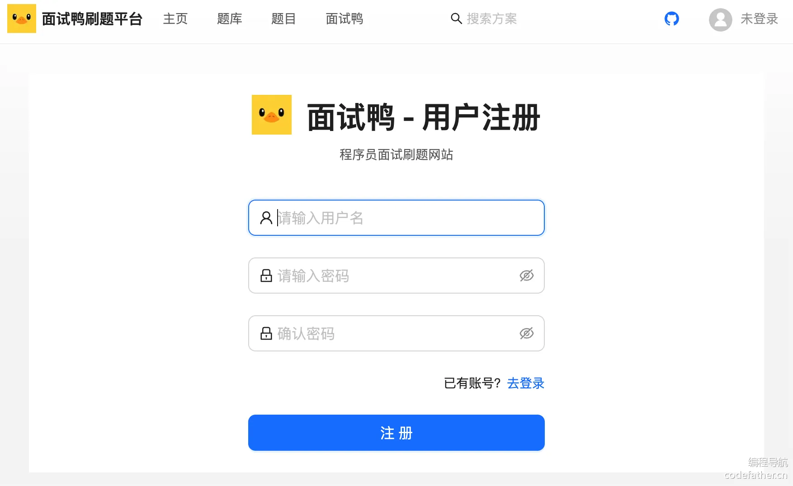

#### 3、用户注销

编写退出登录逻辑，退出登录成功时，应该将全局状态重置为 “默认用户”，代码如下：

```tsx
/**
 * 用户注销
 */
const userLogout = async () => {
  try {
    await userLogoutUsingPost();
    message.success("已退出登录");
    dispatch(setLoginUser(DEFAULT_USER));
    router.push("/user/login");
  } catch (e) {
    message.error("操作失败，" + e.message);
  }
  return;
}
```

由于默认用户在多个位置使用，可以定义为常量，放在 `src/constants/user.ts` 中：

```tsx
import AccessEnum from "@/access/accessEnum";

export const DEFAULT_USER: API.LoginUserVO = {
    userName: "未登录",
    userProfile: "暂无简介",
    userAvatar: "/assets/notLoginUser.png",
    userRole: AccessEnum.NOT_LOGIN,
};
```

给用户头像下拉菜单绑定点击事件：

```tsx
<Dropdown
  menu={{
    items: [
      {
        key: "logout",
        icon: <LogoutOutlined />,
        label: "退出登录",
      },
    ],
    onClick: async (event: { key: React.Key }) => {
      const { key } = event;
      // 退出登录
      if (key === "logout") {
        userLogout();
      }
    },
  }}
>
  {dom}
</Dropdown>
```

#### 4、用户管理页面

需求：管理用户 - 增删改查（仅管理员可用）P1

页面预期效果：上方搜索栏，下方表格，是一个很标准的管理页面布局。如图：

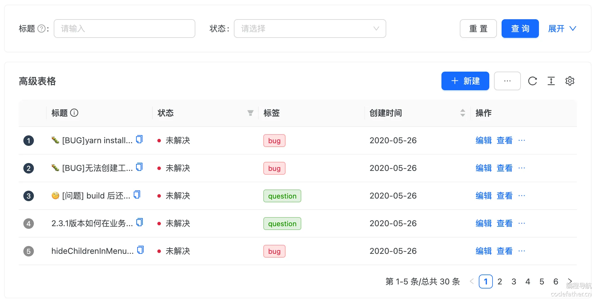

当用户点击新建和修改按钮时，能够打开弹窗，让用户填写信息。

为了简化开发，可以使用 Ant Design ProComponents 的高级表格组件实现。参考文档：https://procomponents.ant.design/components/table

[编程导航](https://www.code-nav.cn/) 的万用前端模板也提供了现成的管理页面，可以直接在此基础上进行修改，效率会更高一些，没必要重复从 0 开发。

前端万用模板：https://www.code-nav.cn/course/1826803928691945473/section/1826872004326240257?type=

注意，管理员页面不需要 SEO、对性能也没有特别高的要求，使用客户端渲染就行，开发限制会少一些。

1）创建页面时，先新增路由：

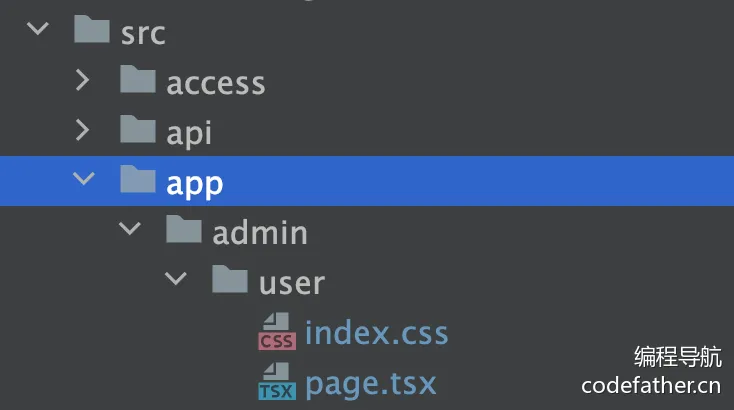

新建菜单项配置，有管理员权限才可访问：

```typescript
{
  path: "/admin",
  name: "管理",
  icon: <CrownOutlined />,
  access: ACCESS_ENUM.ADMIN,
  children: [
    {
      path: "/admin/user",
      name: "用户管理",
      access: ACCESS_ENUM.ADMIN,
    },
  ],
}
```

2）安装表格组件依赖：

```typescript
npm i @ant-design/pro-table
```

安装失败的话，就在命令后加 `--force`：

```typescript
npm i @ant-design/pro-table --force
```

3）开发页面。先在页面开头增加 "use client" 声明，表示客户端渲染。

基于表格组件的开发规范，先定义要展示哪些表格列，可参考官方文档：[https://procomponents.ant.design/components/table#columns-%E5%88%97%E5%AE%9A%E4%B9%89](https://procomponents.ant.design/components/table#columns-列定义)

示例代码如下：

```typescript
const columns: ProColumns<API.User>[] = [
  {
    title: "id",
    dataIndex: "id",
    valueType: "text",
    hideInForm: true,
  },
  {
    title: "账号",
    dataIndex: "userAccount",
    valueType: "text",
  },
  {
    title: "用户名",
    dataIndex: "userName",
    valueType: "text",
  },
  {
    title: "头像",
    dataIndex: "userAvatar",
    valueType: "image",
    fieldProps: {
      width: 64,
    },
    hideInSearch: true,
  },
  {
    title: "简介",
    dataIndex: "userProfile",
    valueType: "textarea",
  },
  {
    title: "权限",
    dataIndex: "userRole",
    valueEnum: {
      user: {
        text: "用户",
      },
      admin: {
        text: "管理员",
      },
    },
  },
  {
    title: "创建时间",
    sorter: true,
    dataIndex: "createTime",
    valueType: "dateTime",
    hideInSearch: true,
    hideInForm: true,
  },
  {
    title: "更新时间",
    sorter: true,
    dataIndex: "updateTime",
    valueType: "dateTime",
    hideInSearch: true,
    hideInForm: true,
  },
  {
    title: "操作",
    dataIndex: "option",
    valueType: "option",
    render: (_, record) => (
      <Space size="middle">
        <Typography.Link
          onClick={() => {
            setCurrentRow(record);
            setUpdateModalVisible(true);
          }}
        >
          修改
        </Typography.Link>
        <Typography.Link type="danger" onClick={() => handleDelete(record)}>
          删除
        </Typography.Link>
      </Space>
    ),
  },
];
```

其中，我们自定义了操作列，提供修改和删除两个按钮。对于修改操作，我们需要 currentRow 变量来记录用户要修改哪条数据，便于修改的时候展示老数据。

```typescript
// 当前用户点击的数据
const [currentRow, setCurrentRow] = useState<API.User>();
```

4）使用高级表格组件，编写请求函数、新建操作工具栏等。

示例代码如下：

```typescript
<ProTable<API.User>
  headerTitle={"查询表格"}
  actionRef={actionRef}
  toolBarRender={() => [
    <Button
      type="primary"
      key="primary"
      onClick={() => {
        setCreateModalVisible(true);
      }}
    >
      <PlusOutlined /> 新建
    </Button>,
  ]}
  request={async (params, sort, filter) => {
    const sortField = Object.keys(sort)?.[0];
    const sortOrder = sort?.[sortField];

    const { data, code } = await listUserByPageUsingPost({
      ...params,
      sortField,
      sortOrder,
      ...filter,
    } as API.UserQueryRequest);

    return {
      success: code === 0,
      data: data.records || [],
      total: Number(data.total) || 0,
    };
  }}
  columns={columns}
/>
```

5）实现删除功能。主要是编写删除函数：

```tsx
const handleDelete = async (row: API.User) => {
  const hide = message.loading("正在删除");
  if (!row) return true;
  try {
    await deleteUserUsingPost({
      id: row.id as any,
    });
    hide();
    message.success("删除成功");
    // 删除成功后刷新表格
    actionRef?.current?.reload();
    return true;
  } catch (error: any) {
    hide();
    message.error("删除失败，" + error.message);
    return false;
  }
};
```

给删除按钮添加点击事件：

```tsx
<Typography.Link type="danger" onClick={() => handleDelete(record)}>
  删除
</Typography.Link>
```

效果如图：

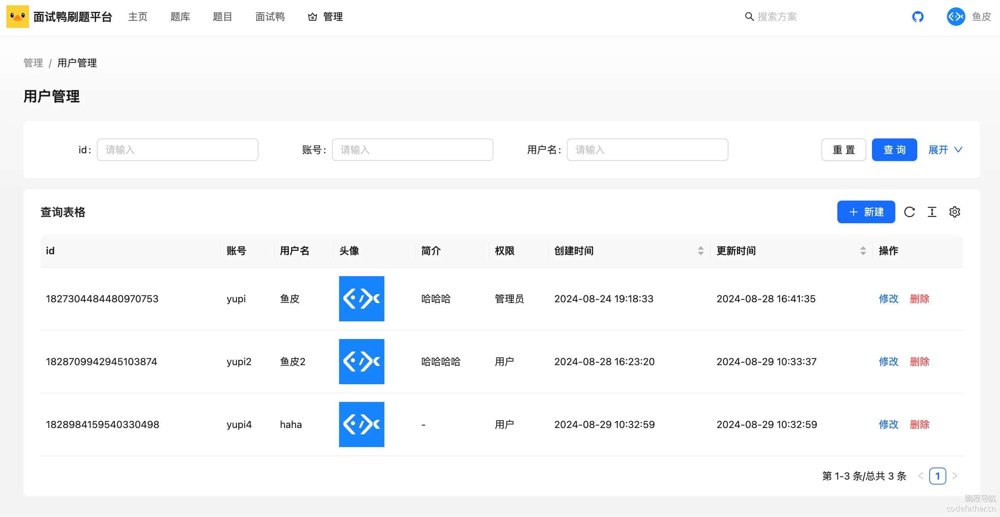

6）开发创建数据弹窗组件。

💡 该组件由于只被用户管理页面使用，不用作为全局组件，而是放在 `admin/user` 目录下的 components 目录中即可：

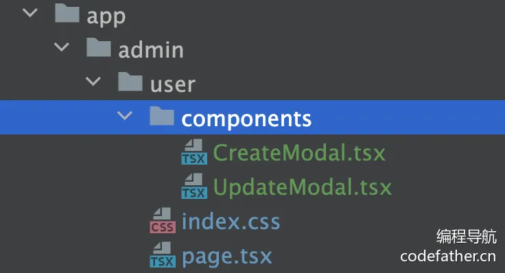

首先定义属性，用于控制弹窗的显隐、以及成功提交或取消弹窗事件：

```tsx
interface Props {
  visible: boolean;
  columns: ProColumns<API.User>[];
  onSubmit: (values: API.UserAddRequest) => void;
  onCancel: () => void;
}
```

基于高级表格自带的表单类型，传入管理表格页面已经定义好的 columns，能够自动生成表单项。

```tsx
<Modal
  destroyOnClose
  title={"创建"}
  open={visible}
  footer={null}
  onCancel={() => {
    onCancel?.();
  }}
>
  <ProTable
    type="form"
    columns={columns}
    onSubmit={async (values: API.UserAddRequest) => {
      const success = await handleAdd(values);
      if (success) {
        onSubmit?.(values);
      }
    }}
  />
</Modal>
```

最后编写提交函数，调用后端实现数据创建：

```tsx
const handleAdd = async (fields: API.UserAddRequest) => {
  const hide = message.loading("正在添加");
  try {
    await addUserUsingPost(fields);
    hide();
    message.success("创建成功");
    return true;
  } catch (error: any) {
    hide();
    message.error("创建失败，" + error.message);
    return false;
  }
};
```

在用户管理页面引入该组件，通过定义 visible 状态来控制弹窗的显隐：

```tsx
// 是否显示新建窗口
const [createModalVisible, setCreateModalVisible] = useState<boolean>(false);
const actionRef = useRef<ActionType>();

<CreateModal
  visible={createModalVisible}
  columns={columns}
  onSubmit={() => {
    setCreateModalVisible(false);
    actionRef.current?.reload();
  }}
  onCancel={() => {
    setCreateModalVisible(false);
  }}
/>
```

点击工具栏上的新建按钮时，会打开弹窗（设置 visible 状态为 true）：

```tsx
<Button
  type="primary"
  key="primary"
  onClick={() => {
    setCreateModalVisible(true);
  }}
>
  <PlusOutlined /> 新建
</Button>
```

效果如图：

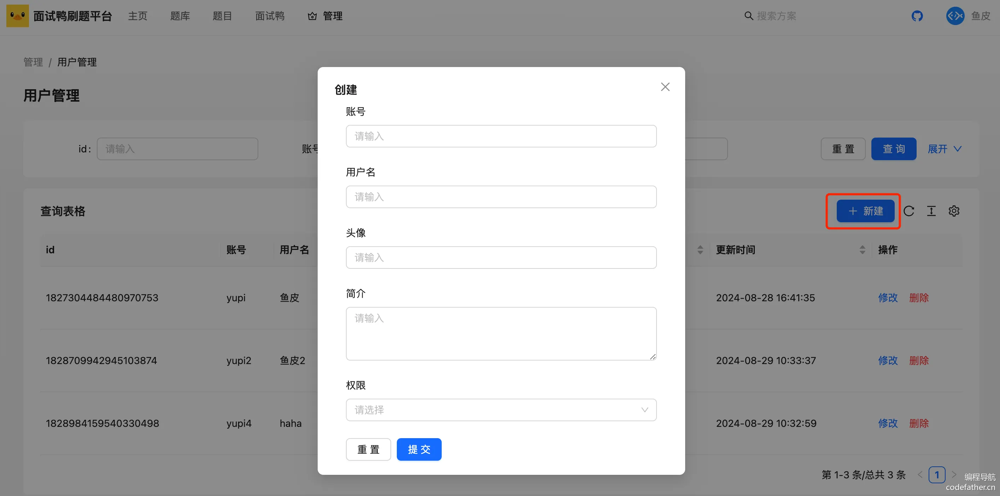

7）开发修改数据弹窗组件。

过程跟上一步类似，区别在于需要给组件多传入 “老数据”：

```tsx
interface Props {
  oldData?: API.User;
  visible: boolean;
  columns: ProColumns<API.User>[];
  onSubmit: (values: API.UserUpdateRequest) => void;
  onCancel: () => void;
}
```

需要给表单补充初始数据，并且在提交时，需要校验老数据是否存在：

```tsx
<ProTable
  type="form"
  columns={columns}
  form={{
    initialValues: oldData,
  }}
  onSubmit={async (values: API.UserUpdateRequest) => {
    if (!oldData?.id || !onSubmit) {
      return;
    }
    const success = await handleUpdate({
      ...values,
      id: oldData.id,
    });
    if (success) {
      onSubmit(values);
    }
  }}
/>
```

至此，用户模块开发完成。

#### 扩展

1）用户管理页面可以通过给删除增加二次确认，减少误操作概率。

使用 Popconfirm 组件可轻松实现：https://ant-design.antgroup.com/components/popconfirm-cn

2）用户管理页面实现多列排序功能

前端 ProTable 已经默认支持了，通过 request 函数的 sort 参数可以获取到排序条件，需要让后端支持处理多列排序。

### 题库管理页面

对应需求：【管理员】管理题库 - 增删改查

其他管理页面跟用户管理页面极其相似，没什么技术要点，复制用户管理页面后略做修改即可，请大家自行开发。

添加菜单项配置：

```tsx
{
  path: "/admin",
  name: "管理",
  icon: <CrownOutlined />,
  access: ACCESS_ENUM.ADMIN,
  children: [
    {
      path: "/admin/user",
      name: "用户管理",
      access: ACCESS_ENUM.ADMIN,
    },
    {
      path: "/admin/bank",
      name: "题库管理",
      access: ACCESS_ENUM.ADMIN,
    }
  ],
},
```

开发页面，关键是 columns 表格列配置：

```tsx
const columns: ProColumns<API.QuestionBank>[] = [
  {
    title: "id",
    dataIndex: "id",
    valueType: "text",
    hideInForm: true,
  },
  {
    title: "标题",
    dataIndex: "title",
    valueType: "text",
  },
  {
    title: "描述",
    dataIndex: "description",
    valueType: "text",
  },
  {
    title: "图片",
    dataIndex: "picture",
    valueType: "image",
    fieldProps: {
      width: 64,
    },
    hideInSearch: true,
  },
  {
    title: "创建时间",
    sorter: true,
    dataIndex: "createTime",
    valueType: "dateTime",
    hideInSearch: true,
    hideInForm: true,
  },
  {
    title: "编辑时间",
    sorter: true,
    dataIndex: "editTime",
    valueType: "dateTime",
    hideInSearch: true,
    hideInForm: true,
  },
  {
    title: "更新时间",
    sorter: true,
    dataIndex: "updateTime",
    valueType: "dateTime",
    hideInSearch: true,
    hideInForm: true,
  },
  {
    title: "操作",
    dataIndex: "option",
    valueType: "option",
    render: (_, record) => (
      <Space size="middle">
        <Typography.Link
          onClick={() => {
            setCurrentRow(record);
            setUpdateModalVisible(true);
          }}
        >
          修改
        </Typography.Link>
        <Typography.Link type="danger" onClick={() => handleDelete(record)}>
          删除
        </Typography.Link>
      </Space>
    ),
  },
];
```

效果如图：

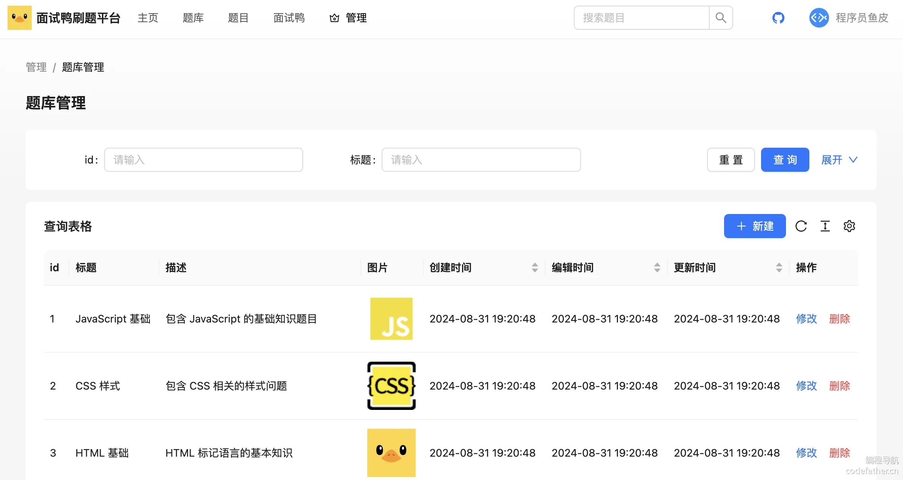

### 题目管理页面

对应需求：【管理员】管理题目 - 增删改查

#### 1、基础表格开发

添加菜单项配置：

```javascript
{
  path: "/admin",
  name: "管理",
  icon: <CrownOutlined />,
  access: ACCESS_ENUM.ADMIN,
  children: [
    {
      path: "/admin/user",
      name: "用户管理",
      access: ACCESS_ENUM.ADMIN,
    },
    {
      path: "/admin/bank",
      name: "题库管理",
      access: ACCESS_ENUM.ADMIN,
    },
    {
      path: "/admin/question",
      name: "题目管理",
      access: ACCESS_ENUM.ADMIN,
    },
  ],
}
```

表格列配置：

```tsx
const columns: ProColumns<API.Question>[] = [
  {
    title: "id",
    dataIndex: "id",
    valueType: "text",
    hideInForm: true,
  },
  {
    title: "标题",
    dataIndex: "title",
    valueType: "text",
  },
  {
    title: "内容",
    dataIndex: "content",
    valueType: "text",
    hideInSearch: true,
    width: 240,
  },
  {
    title: "答案",
    dataIndex: "answer",
    valueType: "text",
    hideInSearch: true,
    width: 640,
  },
  {
    title: "标签",
    dataIndex: "tags",
    valueType: "select",
    fieldProps: {
      mode: "tags",
    }
  },
  {
    title: "创建用户",
    dataIndex: "userId",
    valueType: "text",
    hideInForm: true,
  },

  {
    title: "创建时间",
    sorter: true,
    dataIndex: "createTime",
    valueType: "dateTime",
    hideInSearch: true,
    hideInForm: true,
  },
  {
    title: "编辑时间",
    sorter: true,
    dataIndex: "editTime",
    valueType: "dateTime",
    hideInSearch: true,
    hideInForm: true,
  },
  {
    title: "更新时间",
    sorter: true,
    dataIndex: "updateTime",
    valueType: "dateTime",
    hideInSearch: true,
    hideInForm: true,
  },
  {
    title: "操作",
    dataIndex: "option",
    valueType: "option",
    render: (_, record) => (
      <Space size="middle">
        <Typography.Link
          onClick={() => {
            setCurrentRow(record);
            setUpdateModalVisible(true);
          }}
          >
          修改
        </Typography.Link>
        <Typography.Link type="danger" onClick={() => handleDelete(record)}>
          删除
        </Typography.Link>
      </Space>
    ),
  },
];
```

#### 2、处理特殊逻辑

1）自定义标签渲染，把字符串转为标签列表：

```tsx
{
  title: "标签",
  dataIndex: "tags",
  valueType: "select",
  fieldProps: {
    mode: "tags",
  },
  render: (_, record) => {
    const tagList = JSON.parse(record.tags || "[]");
    return <TagList tagList={tagList} />;
  },
},
```

TagList 是用于渲染标签列表的组件：

```tsx
import { Tag } from "antd";
import "./index.css";

interface Props {
  tagList?: string[];
}

/**
 * 标签列表组件
 * @param props
 * @constructor
 */
const TagList = (props: Props) => {
  const { tagList = [] } = props;

  return (
    <div className="tag-list">
      {tagList.map((tag) => {
        return <Tag key={tag}>{tag}</Tag>;
      })}
    </div>
  );
};

export default TagList;
```

2）需要修改题目内容和答案的输入框为我们封装的 MdEditor 编辑器，可参考 ProTable 官方文档的 [自定义表单项渲染](https://procomponents.ant.design/components/table?tab=api&current=1&pageSize=5#搜索表单自定义)。

```tsx
{
  title: "内容",
  dataIndex: "content",
  valueType: "text",
  hideInSearch: true,
  width: 240,
  renderFormItem: (
    _,
    { type, defaultRender, formItemProps, fieldProps, ...rest },
    form,
  ) => {
    return (
      // value 和 onchange 会通过 form 自动注入。
      <MdEditor
        // 组件的配置
        {...fieldProps}
      />
    );
  },
},
```

#### 3、问题修复（完善接口）

测试时，发现创建和更新题目的标签失败，这是因为后端接口没有补充 tags 字符串到 tagList 列表的转换，需要给 addQuestion 和 updateQuestion 接口补充转换逻辑。示例代码如下：

```java
Question question = new Question();
BeanUtils.copyProperties(questionAddRequest, question);
List<String> tags = questionAddRequest.getTags();
if (tags != null) {
    question.setTags(JSONUtil.toJsonStr(tags));
}
```

注意，更新数据时，需要将 tags 转换成数组后作为表单初始值，否则无法正常同步到表单。可以在 UpdateModal 中自己定义初始值对象：

```typescript
// 表单转换
let initValues = { ...oldData };
if (oldData.tags) {
  initValues.tags = JSON.parse(oldData.tags) || [];
}
```

然后在 ProTable 组件中使用初始值对象：

```tsx
<ProTable
  type="form"
  columns={columns}
  form={{
    initialValues: initValues,
  }}
/>
```

页面最终效果如图：

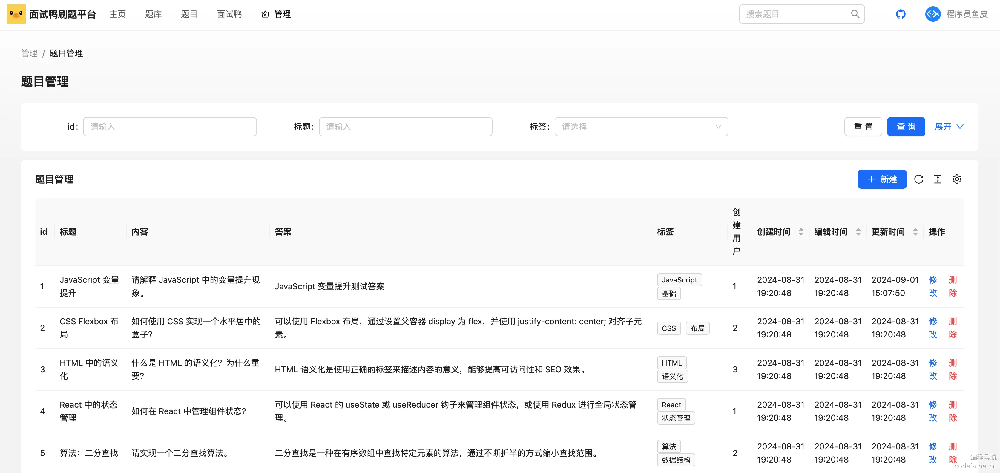

页面完整代码如下，仅供参考：

```tsx
"use client";

import CreateModal from "./components/CreateModal";
import UpdateModal from "./components/UpdateModal";
import {
  deleteQuestionUsingPost,
  listQuestionByPageUsingPost,
} from "@/api/questionController";
import { PlusOutlined } from "@ant-design/icons";
import type { ActionType, ProColumns } from "@ant-design/pro-components";
import { PageContainer, ProTable } from "@ant-design/pro-components";
import { Button, message, Space, Typography } from "antd";
import React, { useRef, useState } from "react";
import TagList from "@/components/TagList";
import MdEditor from "@/components/MdEditor";

/**
 * 题目管理页面
 *
 * @constructor
 */
const QuestionAdminPage: React.FC = () => {
  // 是否显示新建窗口
  const [createModalVisible, setCreateModalVisible] = useState<boolean>(false);
  // 是否显示更新窗口
  const [updateModalVisible, setUpdateModalVisible] = useState<boolean>(false);
  const actionRef = useRef<ActionType>();
  // 当前点击的数据
  const [currentRow, setCurrentRow] = useState<API.Question>();

  /**
   * 删除节点
   *
   * @param row
   */
  const handleDelete = async (row: API.Question) => {
    const hide = message.loading("正在删除");
    if (!row) return true;
    try {
      await deleteQuestionUsingPost({
        id: row.id as any,
      });
      hide();
      message.success("删除成功");
      actionRef?.current?.reload();
      return true;
    } catch (error: any) {
      hide();
      message.error("删除失败，" + error.message);
      return false;
    }
  };

  /**
   * 表格列配置
   */
  const columns: ProColumns<API.Question>[] = [
    {
      title: "id",
      dataIndex: "id",
      valueType: "text",
      hideInForm: true,
    },
    {
      title: "标题",
      dataIndex: "title",
      valueType: "text",
    },
    {
      title: "内容",
      dataIndex: "content",
      valueType: "text",
      hideInSearch: true,
      width: 240,
      renderFormItem: (
        _,
        { type, defaultRender, formItemProps, fieldProps, ...rest },
        form,
      ) => {
        return (
          // value 和 onchange 会通过 form 自动注入。
          <MdEditor
            // 组件的配置
            {...fieldProps}
          />
        );
      },
    },
    {
      title: "答案",
      dataIndex: "answer",
      valueType: "text",
      hideInSearch: true,
      width: 640,
      renderFormItem: (
        _,
        { type, defaultRender, formItemProps, fieldProps, ...rest },
        form,
      ) => {
        return (
          // value 和 onchange 会通过 form 自动注入。
          <MdEditor
            // 组件的配置
            {...fieldProps}
          />
        );
      },
    },
    {
      title: "标签",
      dataIndex: "tags",
      valueType: "select",
      fieldProps: {
        mode: "tags",
      },
      render: (_, record) => {
        const tagList = JSON.parse(record.tags || "[]");
        return <TagList tagList={tagList} />;
      },
    },
    {
      title: "创建用户",
      dataIndex: "userId",
      valueType: "text",
      hideInForm: true,
    },

    {
      title: "创建时间",
      sorter: true,
      dataIndex: "createTime",
      valueType: "dateTime",
      hideInSearch: true,
      hideInForm: true,
    },
    {
      title: "编辑时间",
      sorter: true,
      dataIndex: "editTime",
      valueType: "dateTime",
      hideInSearch: true,
      hideInForm: true,
    },
    {
      title: "更新时间",
      sorter: true,
      dataIndex: "updateTime",
      valueType: "dateTime",
      hideInSearch: true,
      hideInForm: true,
    },
    {
      title: "操作",
      dataIndex: "option",
      valueType: "option",
      render: (_, record) => (
        <Space size="middle">
          <Typography.Link
            onClick={() => {
              setCurrentRow(record);
              setUpdateModalVisible(true);
            }}
          >
            修改
          </Typography.Link>
          <Typography.Link type="danger" onClick={() => handleDelete(record)}>
            删除
          </Typography.Link>
        </Space>
      ),
    },
  ];

  return (
    <PageContainer>
      <ProTable<API.Question>
        headerTitle={"题目管理"}
        actionRef={actionRef}
        toolBarRender={() => [
          <Button
            type="primary"
            key="primary"
            onClick={() => {
              setCreateModalVisible(true);
            }}
          >
            <PlusOutlined /> 新建
          </Button>,
        ]}
        request={async (params, sort, filter) => {
          const sortField = Object.keys(sort)?.[0];
          const sortOrder = sort?.[sortField];

          const { data, code } = await listQuestionByPageUsingPost({
            ...params,
            sortField,
            sortOrder,
            ...filter,
          } as API.QuestionQueryRequest);

          return {
            success: code === 0,
            data: data.records || [],
            total: Number(data.total) || 0,
          };
        }}
        columns={columns}
      />
      <CreateModal
        visible={createModalVisible}
        columns={columns}
        onSubmit={() => {
          setCreateModalVisible(false);
          actionRef.current?.reload();
        }}
        onCancel={() => {
          setCreateModalVisible(false);
        }}
      />
      <UpdateModal
        visible={updateModalVisible}
        columns={columns}
        oldData={currentRow}
        onSubmit={() => {
          setUpdateModalVisible(false);
          setCurrentRow(undefined);
          actionRef.current?.reload();
        }}
        onCancel={() => {
          setUpdateModalVisible(false);
        }}
      />
    </PageContainer>
  );
};
export default QuestionAdminPage;
```

## 二、核心页面开发

### 主页

需求：展示有吸引力的内容，比如展示部分最新题库、部分最新题目

页面结构：从上到下，依次是最新题库和最新题目板块，每个版块展示 12 条数据。

💡 分页条数尽量是 3、4 的倍数，比如 12 和 24，可以同时兼容 3 列、4 列。

#### 1、页面整体结构开发

1）先编写页面结构：

```tsx
"use server";
import Title from "antd/es/typography/Title";
import { Divider } from "antd";
import "./index.css";

/**
 * 主页
 * @constructor
 */
export default async function HomePage() {
  return <div id="homePage">
    <Title level={3}>
      最新题库
    </Title>
    <div>
      题库列表
    </div>
    <Divider />
    <Title level={3}>
      最新题目
    </Title>
    <div>
      题目列表
    </div>
  </div>;
}
```

2）使用 [Ant Design 的 Flex 组件](https://ant-design.antgroup.com/components/flex-cn#flex-demo-basic)，在标题右侧补充 “查看更多” 到题库列表页的跳转：

```tsx
<Flex justify="space-between" align="center">
  <Title level={3}>最新题库</Title>
  <Link href={"/banks"}>查看更多</Link>
</Flex>
```

3）请求题库和题目列表数据并展示：

```tsx
export default async function HomePage() {

  let questionBankList = [];
  let questionList = [];

  try {
    const questionBankRes = await listQuestionBankVoByPageUsingPost({
      pageSize: 12,
      sortField: 'createTime',
      sortOrder: 'descend',
    })
    questionBankList = questionBankRes.data.records ?? [];
  } catch (e) {
    console.error('获取题库列表失败，' + e.message);
  }

  try {
    const questionListRes = await listQuestionVoByPageUsingPost({
      pageSize: 12,
      sortField: 'createTime',
      sortOrder: 'descend',
    })
    questionList = questionListRes.data.records ?? [];
  } catch (e) {
    console.error('获取题目列表失败，' + e.message);
  }
}
```

可以先在页面中展示获取到的数据，确保调用正常：

```tsx
{JSON.stringify(questionBankList)}
{JSON.stringify(questionList)}
```

#### 2、题目列表组件

新建题库列表和题目列表 2 个组件，展示获取到的数据，便于复用。

💡 注意，组件要使用客户端渲染，不然会报错：

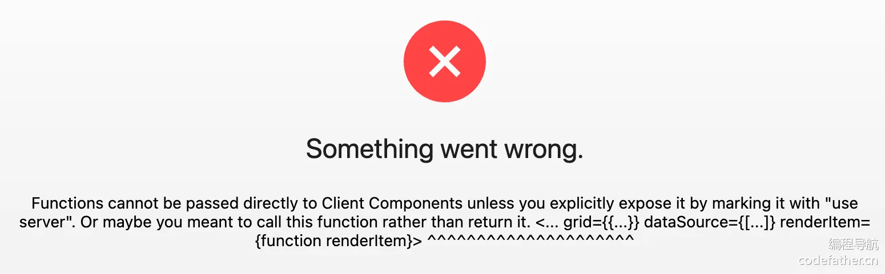

开发题库列表组件的注意事项：

1. 使用 Ant Design 的 Card.Meta 展示单个题库，[参考文档](https://ant-design.antgroup.com/components/card-cn#card-demo-meta)
2. 由于题库有图片，名称不长，适合使用响应式栅格列表组件 List，通过编写 grid 实现响应式布局，[参考文档](https://ant-design.antgroup.com/components/list-cn#list-demo-grid)
3. 使用文本省略组件，让描述显示不超过一行，[参考文档](https://ant-design.antgroup.com/components/typography-cn#typography-demo-ellipsis，)
4. 点击题库后，可以跳转到题库详情页，使用 Next.js 的 Link 组件即可

代码如下：

```tsx
"use client";
import { Avatar, Card, List, Typography } from "antd";
import "./index.css";
import Link from "next/link";

interface Props {
  questionBankList: API.QuestionBankVO[];
}

/**
 * 题库列表组件
 * @param props
 * @constructor
 */
const QuestionBankList = (props: Props) => {
  const { questionBankList = [] } = props;

  return (
    <div className="question-bank-list">
      <List
        grid={{
          gutter: 16,
          column: 4,
          xs: 1,
          sm: 2,
          md: 3,
          lg: 3,
        }}
        dataSource={questionBankList}
        renderItem={(item: API.QuestionBankVO) => (
          <List.Item>
            <Card>
              <Link href={`/bank/${item.id}`}>
                <Card.Meta
                  avatar={<Avatar src={item.picture} />}
                  title={item.title}
                  description={
                    <Typography.Paragraph
                      type="secondary"
                      ellipsis={{ rows: 1 }}
                      style={{ marginBottom: 0 }}
                    >
                      {item.description}
                    </Typography.Paragraph>
                  }
                />
              </Link>
            </Card>
          </List.Item>
        )}
      />
    </div>
  );
};

export default QuestionBankList;
```

#### 3、题目列表组件

开发题目列表组件的注意事项：

1. 题目没有图片，名称较长，适合使用水平基础列表组件 List，[参考文档](https://ant-design.antgroup.com/components/list-cn#list-demo-basic)
2. 点击题目后，可以跳转到题目详情页

代码如下：

```tsx
"use client";
import { Card, List, Tag } from "antd";
import "./index.css";
import Link from "next/link";

interface Props {
  questionList: API.QuestionVO[];
}

/**
 * 题目列表组件
 * @param props
 * @constructor
 */
const QuestionList = (props: Props) => {
  const { questionList = [] } = props;

  const tagList = (tags: string[] = []) => {
    return tags.map((tag) => {
      return <Tag key={tag}>{tag}</Tag>;
    });
  };

  return (
    <Card className="question-list">
      <List
        dataSource={questionList}
        renderItem={(item: API.QuestionVO) => (
          <List.Item extra={tagList(item.tagList)}>
            <List.Item.Meta
              title={<Link href={`/question/${item.id}`}>{item.title}</Link>}
            />
          </List.Item>
        )}
      />
    </Card>
  );
};

export default QuestionList;
```

其中，TagList 可以单独封装为一个组件，便于复用（题目详情页也要用）。代码如下：

```tsx
import { Tag } from "antd";
import "./index.css";

interface Props {
  tagList?: string[];
}

/**
 * 标签列表组件
 * @param props
 * @constructor
 */
const TagList = (props: Props) => {
  const { tagList = [] } = props;

  return (
    <div className="tag-list">
      {tagList.map((tag) => {
        return <Tag key={tag}>{tag}</Tag>;
      })}
    </div>
  );
};

export default TagList;
```

#### 4、其他优化

由于页面可视区域过宽，会让用户的视野过于分散：

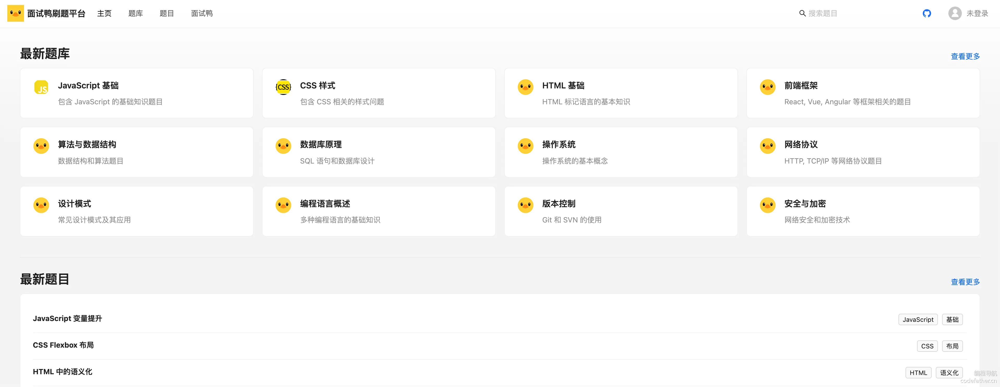

可以限制下页面最大宽度，在 `app/globals.css` 中写一个限制宽度的通用类名：

```css
.max-width-content {
  max-width: 1200px;
  margin: 0 auto;
}
```

给需要限制宽度的页面增加该类名即可：

```tsx
<div id="homePage" className="max-width-content">
  ...
</div>
```

最终，主页效果如图：

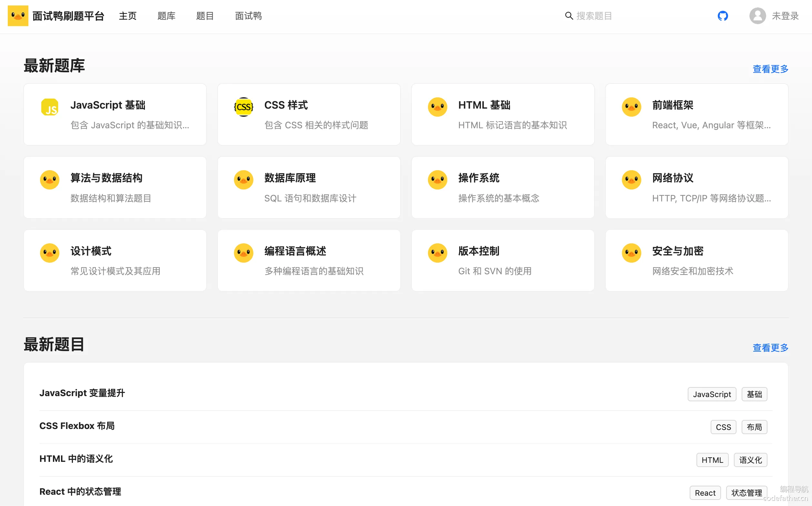

#### 扩展

1）当题库和题目较多时，可以允许用户按照最新、热度、精选等方式对题库和题目进行排序。

2）可以给主页增加吸引人的 banner 图片，或者添加公告栏来通知用户活动信息

### 题库列表页

需求：展示所有题库列表

页面结构：跟主页的题库列表类似，复用题库列表组件即可轻松完成开发。

因为考虑到系统题库数量不多，可以不需要分页实现，减少开发成本，让后端支持返回更多题库即可。

1）修改后端获取题库列表接口，提升允许抓取的页面大小为 200：

```java
@PostMapping("/list/page/vo")
public BaseResponse<Page<QuestionBankVO>> listQuestionBankVOByPage(
    @RequestBody QuestionBankQueryRequest questionBankQueryRequest,
    HttpServletRequest request) {
    long current = questionBankQueryRequest.getCurrent();
    long size = questionBankQueryRequest.getPageSize();
    // 限制爬虫
    ThrowUtils.throwIf(size > 200, ErrorCode.PARAMS_ERROR);
    // ...
}
```

2）开发页面，基本直接复制主页代码就能完成。代码如下：

```tsx
"use server";
import Title from "antd/es/typography/Title";
import { listQuestionBankVoByPageUsingPost } from "@/api/questionBankController";
import QuestionBankList from "@/components/QuestionBankList";
import "./index.css";

/**
 * 题库列表页面
 * @constructor
 */
export default async function BanksPage() {
  let questionBankList = [];
  // 题库数量不多，直接全量获取
  const pageSize = 200;

  try {
    const questionBankRes = await listQuestionBankVoByPageUsingPost({
      pageSize,
      sortField: "createTime",
      sortOrder: "descend",
    });
    questionBankList = questionBankRes.data.records ?? [];
  } catch (e) {
    console.error("获取题库列表失败，" + e.message);
  }

  return (
    <div id="banksPage" className="max-width-content">
      <Title level={3}>题库大全</Title>
      <QuestionBankList questionBankList={questionBankList} />
    </div>
  );
}
```

题库列表页的效果如图：

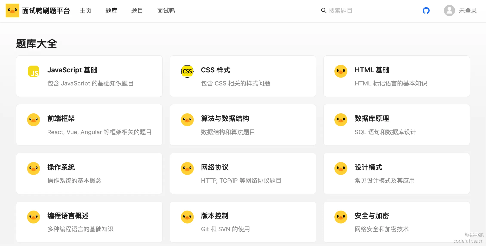

### 题目搜索页

需求：题目搜索页和题目大全页本质上是同一个页面，都是能让用户通过各种条件搜索题目。为了降低开发成本，可以统一。

结构：可以用表格的形式展示题目列表，由于题目数较多，需要支持分页。

需要支持的搜索条件：

- 题目名称
- 标签

#### 1、页面整体结构开发

参考主页，开发基础页面结构，并获取到题目列表数据：

```tsx
import Title from "antd/es/typography/Title";
import QuestionTable from "@/components/QuestionTable";
import { listQuestionVoByPageUsingPost } from "@/api/questionController";
import "./index.css";

/**
 * 题目列表页面
 * @constructor
 */
export default async function QuestionsPage() {
  let questionList = [];
  let total = 0;

  try {
    const questionRes = await listQuestionVoByPageUsingPost({
      pageSize: 12,
      sortField: "createTime",
      sortOrder: "descend",
    });
    questionList = questionRes.data.records ?? [];
    total = questionRes.data.total ?? 0;
  } catch (e) {
    console.error("获取题目列表失败，" + e.message);
  }

  return (
    <div id="questionsPage" className="max-width-content">
      <Title level={3}>题目大全</Title>
      <div>题目内容</div>
    </div>
  );
}
```

#### 2、题目表格组件

可以封装 QuestionTable 题目表格组件，作为公共组件，便于后续复用。

跟管理页面开发类似，使用 [Ant Design ProComponents 的高级表格组件](https://procomponents.ant.design/components/table)，可以轻松完成。

首先要执行命令安装组件：

```shell
npm i @ant-design/pro-table --force
```

由于该组件涉及到分页（客户端交互），要使用客户端渲染，开发体验跟使用普通的 Vue、React 框架类似。

1）通过高级表单组件自己的规则，改写 request 请求函数，即可实现请求条件改变时自动触发查询，自动支持分页和筛选。代码如下：

```tsx
"use client";

interface Props {
}

/**
 * 题目表格组件
 * @constructor
 */
export default function QuestionTable(props: Props) {
  const actionRef = useRef<ActionType>();

  /**
   * 表格列配置
   */
  const columns: ProColumns<API.QuestionVO>[] = [
    {
      title: "题目",
      dataIndex: "title",
      render(_, record) {
        return <Link href={`/question/${record.id}`}>{record.title}</Link>;
      },
    },
    {
      title: "标签",
      dataIndex: "tagList",
      valueType: "select",
      fieldProps: {
        mode: "tags"
      },
      render: (_, record) => <TagList tagList={record.tagList} />,
    },
  ];

  return (
    <div className="question-table">
      <ProTable
        actionRef={actionRef}
        columns={columns}
        size="large"
        search={{
          labelWidth: "auto",
        }}
        pagination={
          {
            pageSize: 12,
            showTotal: (total) => `总共 ${total} 条`,
            showSizeChanger: false,
          } as TablePaginationConfig
        }
        request={async (params, sort, filter) => {
          const sortField = Object.keys(sort)?.[0];
          const sortOrder = sort?.[sortField];
          // 请求
          const { data, code } = await listQuestionVoByPageUsingPost({
            ...params,
            sortField,
            sortOrder,
            ...filter,
          } as API.UserQueryRequest);
          // 更新结果
          const newTotal = Number(data.total) || 0;
          const newData = data.records || [];
          return {
            success: code === 0,
            data: newData,
            total: newTotal,
          };
        }}
        />
    </div>
  );
}
```

#### 3、使用表格组件

在题目列表页引入组件：

```css
<QuestionTable />
```

需要将页面宽度调整为 100%，否则表格宽度会动态变化。代码如下：

```css
#questionsPage {
  width: 100%;
}
```

效果如图：

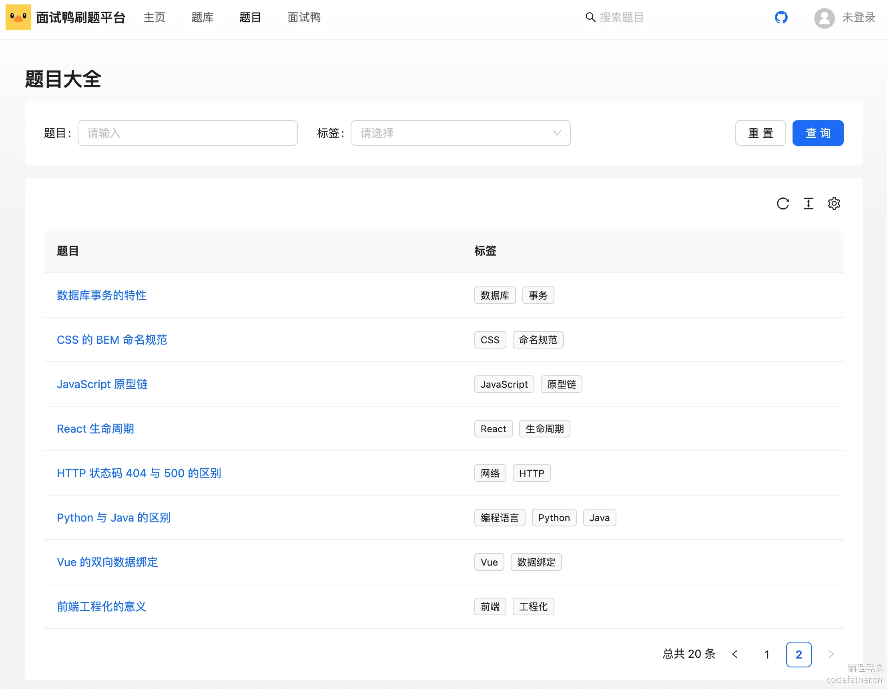

#### 4、支持服务端渲染

需要支持服务端渲染，外层页面如果已经在服务端取得了数据，可以直接展示，而不用等到客户端渲染时再发起请求。

解决方案很简单，给题目表格组件新增默认题目列表、默认总数这 2 个属性，外层页面传递已获取到的数据，作为表格组件的初始数据状态即可。

```css
interface Props {
  defaultQuestionList?: API.QuestionVO[];
  defaultTotal?: number;
}
```

在表格组件中，将 questionList 和 total 定义为状态，然后在 request 函数中改变状态，相当于将 ProTable 作为受控组件使用。

修改的代码如下：

```tsx
interface Props {
  defaultQuestionList?: API.QuestionVO[];
  defaultTotal?: number;
}

/**
 * 题目表格组件
 * @constructor
 */
export default function QuestionTable(props: Props) {
  const { defaultQuestionList, defaultTotal } = props;
  const [questionList, setQuestionList] = useState<API.QuestionVO[]>(
    defaultQuestionList || [],
  );
  const [total, setTotal] = useState<number>(defaultTotal || 0);

  return (
    <div className="question-table">
      <ProTable
        dataSource={questionList}
        pagination={
          {
            pageSize: 12,
            showTotal: (total) => `总共 ${total} 条`,
            showSizeChanger: false,
            total,
          } as TablePaginationConfig
        }
        request={async (params, sort, filter) => {
          // 更新结果
          const newTotal = Number(data.total) || 0;
          setTotal(newTotal);
          const newData = data.records || [];
          setQuestionList(newData);
          return {
            success: code === 0,
            data: newData,
            total: newTotal,
          };
        }}
      />
    </div>
  );
}
```

但还有个问题，首次服务端已经获得了数据，客户端就没必要再请求一次了，可以新增 init 变量进行判断。

代码如下：

```tsx
const [init, setInit] = useState<boolean>(true);
```

在 request 函数开头添加判断逻辑：

```tsx
// 首次请求
if (init) {
  setInit(false);
  // 如果已有外层传来的默认数据，无需再次查询
  if (defaultQuestionList && defaultTotal) {
    return;
  }
}
```

#### 5、和上方搜索条联动

1）修改 BasicLayout 的搜索输入框，搜索时携带搜索文本跳转到题目搜索页：

```tsx
/**
 * 搜索条
 * @constructor
 */
const SearchInput = () => {
  const router = useRouter();

  return (
    <div
      key="SearchOutlined"
      aria-hidden
      style={{
        display: "flex",
        alignItems: "center",
        marginInlineEnd: 24,
      }}
    >
      <Input.Search
        style={{
          borderRadius: 4,
          marginInlineEnd: 12,
        }}
        placeholder="搜索题目"
        onSearch={(value) => {
          router.push(`/questions?q=${value}`);
        }}
      />
    </div>
  );
};
```

可以将搜索输入框抽象为独立组件，在 BasicLayout 下新建 components，因为该搜索组件目前只有该布局用到。

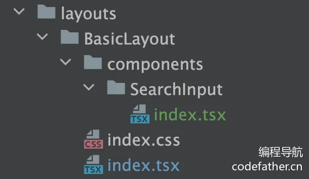

2）题目大全页面需要获取查询文本，进行操作。

在 Next.js 中，可以通过 searchParams 轻松获取到 url 的查询参数：

```tsx
export default async function QuestionsPage({ searchParams }) {
  const { q: searchText } = searchParams;
  // ...
}
```

然后要在 2 个地方使用搜索文本参数，一方面是根据搜索文本在服务端时查询到初始数据：

```tsx
try {
  const questionRes = await listQuestionVoByPageUsingPost({
    title: searchText,
    pageSize: 12,
    sortField: "createTime",
    sortOrder: "descend",
  });
  questionList = questionRes.data.records ?? [];
  total = questionRes.data.total ?? 0;
} catch (e) {
  console.error("获取题目列表失败，" + e.message);
}
```

另一方面需要将其传递给题目表格组件，作为默认搜索条件。为了通用性，定义 defaultSearchParams 对象类型的属性，可传递多个默认搜索条件字段。

题目表格组件的属性新增字段：

```tsx
interface Props {
  // ...
  // 默认搜索条件
  defaultSearchParams?: API.QuestionQueryRequest;
}
```

利用 ProTable 的初始值属性 initialValues，可以将默认搜索条件作为初始值传递给搜索表单：

```tsx
<ProTable
  actionRef={actionRef}
  columns={columns}
  form={{
    initialValues: defaultSearchParams,
  }}
/>
```

3）题目列表页面传入搜索条件：

```tsx
<QuestionTable defaultQuestionList={questionList} defaultTotal={total} defaultSearchParams={{
  title: searchText,
}} />
```

### 题库详情页

需求：从上到下展示题库信息、以及题库内的题目列表

#### 1、基础页面开发

新建动态路由页面：

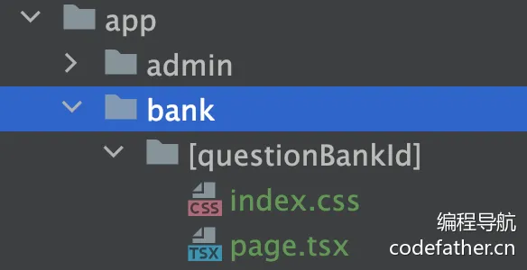

在页面中可以通过 params 获取到动态参数：

```tsx
export default async function BankPage({ params }) {
  const { questionBankId } = params;
}
```

先请求题库详情数据，如果没有找到对应的数据，直接返回一段文案作为错误处理结果。

💡 也可以使用 Next.js 支持的全局错误处理 ErrorBoundary。

代码如下：

```tsx
let bank = undefined;

try {
  const bankRes = await getQuestionBankVoByIdUsingGet({
    id: questionBankId,
    needQueryQuestionList: true,
    pageSize: 200,
  });
  bank = bankRes.data;
} catch (e) {
  console.error("获取题库详情失败，" + e.message);
}

if (!bank) {
  return <div>获取题库详情失败，请刷新重试</div>;
}
```

💡 注意，服务端渲染无法使用 <AA.BB> 引入子包的组件，可以直接引入

有了数据后，就可以开发页面了，主要有以下几个注意事项：

1. 页面上方复用 Ant Design 的 Card.Meta 组件展示题库信息
2. 页面下方复用 QuestionList 题目列表组件，展示题目列表

此处是考虑到同一题库内的题目数量不多，所以暂时不需要分页，可以将 pageSize 调整大一些，直接使用题目列表组件即可。如果需要实现分页，可以使用之前封装的 QuestionTable 题目表格组件。

页面代码如下：

```tsx
import Title from "antd/es/typography/Title";
import { getQuestionBankVoByIdUsingGet } from "@/api/questionBankController";
import QuestionList from "@/components/QuestionList";
import { Avatar, Button, Card } from "antd";
import Meta from "antd/es/card/Meta";
import Paragraph from "antd/es/typography/Paragraph";
import "./index.css";

/**
 * 题库详情页面
 * @constructor
 */
export default async function BankPage({ params }) {
  const { questionBankId } = params;

  let bank = undefined;

  try {
    const bankRes = await getQuestionBankVoByIdUsingGet({
      id: questionBankId,
      needQueryQuestionList: true,
      pageSize: 200,
    });
    bank = bankRes.data;
  } catch (e) {
    console.error("获取题库详情失败，" + e.message);
  }

  if (!bank) {
    return <div>获取题库详情失败，请刷新重试</div>;
  }

  return (
    <div id="bankPage" className="max-width-content">
      <Card>
        <Meta
          avatar={<Avatar src={bank.picture} size={72} />}
          title={
            <Title level={3} style={{ marginBottom: 0 }}>
              {bank.title}
            </Title>
          }
          description={
            <Paragraph type="secondary">{bank.description}</Paragraph>
          }
        ></Meta>
      </Card>
      <div style={{ marginBottom: 16 }} />
      <QuestionList
        questionList={bank.questionPage?.records || []}
      />
    </div>
  );
}
```

#### 2、问题修复和优化

调试过程中，可能会发现一些问题。

1）需要修复接口问题：在 getQuestionBankVOById 接口中，没有把查询请求的分页条件和其他过滤条件传递给 questionService.listQuestionByPage 方法，可以按需调整。

还要将该接口返回值的 questionPage 类型从 Question 改为 QuestionVO，跟主页获取题目分页列表接口保持一致。

修改后的接口代码如下：

```java
@GetMapping("/get/vo")
public BaseResponse<QuestionBankVO> getQuestionBankVOById(QuestionBankQueryRequest questionBankQueryRequest, HttpServletRequest request) {
    ThrowUtils.throwIf(questionBankQueryRequest == null, ErrorCode.PARAMS_ERROR);
    Long id = questionBankQueryRequest.getId();
    ThrowUtils.throwIf(id <= 0, ErrorCode.PARAMS_ERROR);
    // 查询数据库
    QuestionBank questionBank = questionBankService.getById(id);
    ThrowUtils.throwIf(questionBank == null, ErrorCode.NOT_FOUND_ERROR);
    // 查询题库封装类
    QuestionBankVO questionBankVO = questionBankService.getQuestionBankVO(questionBank, request);
    // 是否要关联查询题库下的题目列表
    boolean needQueryQuestionList = questionBankQueryRequest.isNeedQueryQuestionList();
    if (needQueryQuestionList) {
        QuestionQueryRequest questionQueryRequest = new QuestionQueryRequest();
        questionQueryRequest.setQuestionBankId(id);
        // 可以按需传递更多参数
        questionQueryRequest.setPageSize(questionBankQueryRequest.getPageSize());
        questionQueryRequest.setCurrent(questionBankQueryRequest.getCurrent());
        // 封装 question => questionVO
        Page<Question> questionPage = questionService.listQuestionByPage(questionQueryRequest);
        questionBankVO.setQuestionPage(questionService.getQuestionVOPage(questionPage, request));
    }
    // 获取封装类
    return ResultUtils.success(questionBankVO);
}
```

2） 给 QuestionList 题目列表组件补充 cardTitle 属性，更优雅地展示标题。

```tsx
interface Props {
  cardTitle?: React.ReactNode;
  questionList: API.QuestionVO[];
}
```

应用到组件内 Card 的 title 属性：

```tsx
<Card className="question-list" title={cardTitle}>
```

然后可以在页面中使用属性，展示 “题目列表” 4 个字和当前题库下的题目总数：

```tsx
<QuestionList
  questionList={bank.questionPage?.records || []}
  cardTitle={`题目列表（${bank.questionPage?.total || 0}）`}
  questionBankId={questionBankId}
/>
```

3）如果题库为空，接口还是会返回所有题目数据。这是因为之前后端 service 中分页获取题目列表的 listQuestionByPage 方法有误。当查询不到题库题目关系时，应该直接返回空页面，而不是不限定 questionId in 的条件，导致了全量查询。

修改代码如下：

```java
if (CollUtil.isNotEmpty(questionList)) {
    // 取出题目 id 集合
    Set<Long> questionIdSet = questionList.stream()
            .map(QuestionBankQuestion::getQuestionId)
            .collect(Collectors.toSet());
    // 复用原有题目表的查询条件
    queryWrapper.in("id", questionIdSet);
} else {
    // 题库为空，则返回空列表
    return new Page<>(current, size, 0);
}
```

#### 3、超链接跳转

提供 2 种跳转到题目详情页进行刷题的方式。

1）补充开始刷题按钮，默认跳转到第一道题目，没有题目则禁用：

```tsx
// 获取第一道题目，用于 “开始刷题” 按钮跳转
let firstQuestionId;
if (bank.questionPage?.records && bank.questionPage.records.length > 0) {
  firstQuestionId = bank.questionPage.records[0].id;
}
```

按钮代码如下：

```tsx
<Button
  type="primary"
  shape="round"
  disabled={!firstQuestionId}
  href={`/bank/${questionBankId}/question/${firstQuestionId}`}
  target="_blank"
>
  开始刷题
</Button>
```

2）之前的题目列表页跳转到的是单个题目详情，而从题库点开的题目应该是进到题库题目详情页，会额外在左侧展示题库内的其他题目。所以需要区分题库详情页中题目列表项的点击跳转地址。

给题目列表组件增加 questionBankId 属性：

```tsx
interface Props {
  questionBankId?: number;
  cardTitle?: React.ReactNode;
  questionList: API.QuestionVO[];
}
```

可以根据题库 id 是否存在，来区分跳转地址：

```tsx
<Link
  href={
    questionBankId
      ? `/bank/${questionBankId}/question/${item.id}`
      : `/question/${item.id}`
  }
>
  {item.title}
</Link>
```

题库详情页的效果如图：

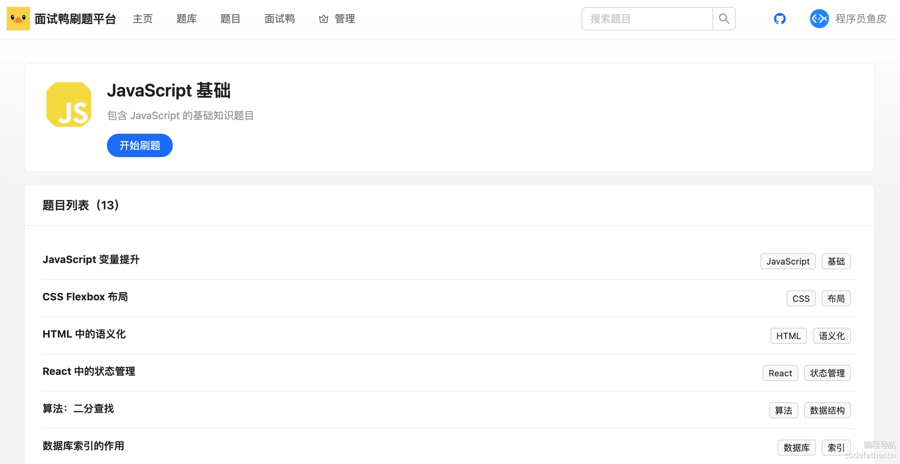

#### 扩展

当题库过多时，可以采用滚动下拉分页加载。React 有现成的无限滚动加载组件。

### 题目详情页

需求：有两种不同的题目详情页

1. 从题库进入的题目详情页：左侧需要展示题库内的题目列表。路由：/bank/[bankId]/question/[questionId]
2. 从其他位置（比如主页、搜索页）进入的题目详情页，不需要展示题库列表。路由：/question/[questionId]

这两个页面极为相似，可以直接开发额外展示题目列表的题目详情页，另一个页面复制并删减即可。

#### 1、页面整体结构开发

1）选择 Flex 一行两列布局，左边 Sider 侧边栏展示题目列表、右边 Content 展示内容，可以 [参考官方文档](https://ant-design.antgroup.com/components/layout-cn#layout-demo-top-side-2) 实现布局。

```tsx
<div id="bankQuestionPage">
  <Flex gap={24}>
    <Sider width={240} theme="light" style={{ padding: "24px 0" }}>
      <Title level={4} style={{ padding: "0 20px" }}>
        题库标题
      </Title>
      <Menu />
    </Sider>
    <Content>
      题目详情
    </Content>
  </Flex>
</div>
```

2）从 url 中获取题库 id 和题目 id，然后请求详情数据：

```tsx
export default async function BankQuestionPage({ params }) {
  const { questionBankId, questionId } = params;

  let bank = undefined;
  try {
    const bankRes = await getQuestionBankVoByIdUsingGet({
      id: questionBankId,
      needQueryQuestionList: true,
      pageSize: 200,
    });
    bank = bankRes.data;
  } catch (e) {
    console.error("获取题库详情失败，" + e.message);
  }
  if (!bank) {
    return <div>获取题库详情失败，请刷新重试</div>;
  }

  let question = undefined;
  try {
    const questionRes = await getQuestionVoByIdUsingGet({
      id: questionId,
    });
    question = questionRes.data;
  } catch (e) {
    console.error("获取题目详情失败，" + e.message);
  }
  if (!question) {
    return <div>获取题目详情失败，请刷新重试</div>;
  }
}
```

接下来就可以依次实现左侧菜单和右侧内容的展示了。

#### 2、题目列表菜单

菜单需要支持点击和高亮，可以使用 Ant Design 的 Menu 组件，参考 [官方文档](https://ant-design.antgroup.com/components/menu-cn)。

首先获取题目菜单列表，将题目列表数据转为 Menu 接受的数据格式即可：

```tsx
// 题目菜单列表
const questionMenuItemList = (bank.questionPage?.records || []).map(
  (q) => {
    return {
      label: q.title,
      key: q.id,
    };
  },
);
```

然后传递给 Menu 组件：

```tsx
<Menu items={questionMenuItemList} />
```

#### 3、题目详情组件

由于两种题目详情页都需要展示题目详情，所以封装为独立组件。

从上到下展示题目信息即可，注意展示题目内容和答案时使用 MdViewer 组件，代码如下：

```tsx
"use client";
import { Card } from "antd";
import Title from "antd/es/typography/Title";
import MdViewer from "@/components/MdViewer";
import "./index.css";
import TagList from "@/components/TagList";

interface Props {
  question: API.QuestionVO;
}

/**
 * 题目卡片组件
 * @param props
 * @constructor
 */
const QuestionCard = (props: Props) => {
  const { question } = props;

  return (
    <div className="question-card">
      <Card bordered={false}>
        <Title level={1} style={{ fontSize: 24 }}>
          {question.title}
        </Title>
        <TagList tagList={question.tagList} />
        <div style={{ marginBottom: 16 }} />
        <MdViewer value={question.content} />
      </Card>
      <div style={{ marginBottom: 16 }} />
      <Card title="推荐答案" bordered={false}>
        <MdViewer value={question.answer} />
      </Card>
    </div>
  );
};

export default QuestionCard;
```

#### 4、切换和高亮题目

点击菜单时，需要切换题目，给菜单组件增加超链接即可：

```tsx
// 题目菜单列表
const questionMenuItemList = (bank.questionPage?.records || []).map(
  (question) => {
    return {
      label: <Link href={`/bank/${bank.id}/question/${question.id}`} prefetch={false}>{question.title}</Link>,
      key: question.id,
    };
  },
);
```

还需要在菜单中高亮当前题目，可以通过 Menu 组件的 selectedKeys 属性实现选中高亮。根据 questionId 进行匹配，代码如下：

```tsx
<Menu items={questionMenuItemList} selectedKeys={[questionId]} />
```

#### 5、优化 MdViewer 展示效果

目前编辑器的展示效果不佳，可以参考 ByteMD 组件的指引，下载第三方主题，比如 GitHub 的主题：https://github.com/sindresorhus/github-markdown-css

参考上方文档安装之后，在 MdViewer 和 MdEditor 中引入样式文件：

```tsx
import 'github-markdown-css/github-markdown-light.css';
```

效果如图：

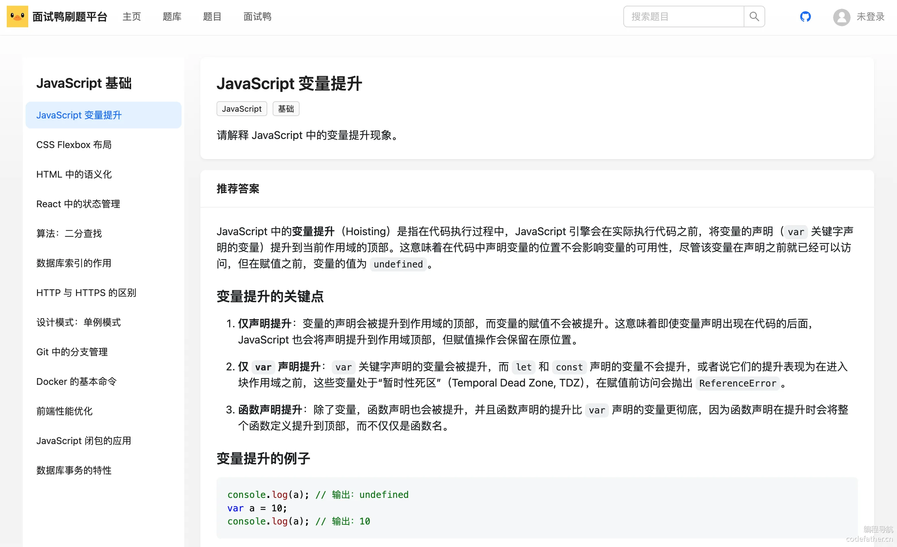

直接把开发好的 question 目录复制到 app 目录下，删除菜单栏和题库获取逻辑，即可得到单个题目详情页，代码如下：

```tsx
import { getQuestionBankVoByIdUsingGet } from "@/api/questionBankController";
import { Flex } from "antd";
import React from "react";
import { getQuestionVoByIdUsingGet } from "@/api/questionController";
import QuestionCard from "@/components/QuestionCard";
import "./index.css";

/**
 * 题目详情页面
 * @constructor
 */
export default async function QuestionPage({ params }) {
  const { questionId } = params;

  let question = undefined;
  try {
    const questionRes = await getQuestionVoByIdUsingGet({
      id: questionId,
    });
    question = questionRes.data;
  } catch (e) {
    console.error("获取题目详情失败，" + e.message);
  }
  if (!question) {
    return <div>获取题目详情失败，请刷新重试</div>;
  }

  return (
    <div id="questionPage" className="max-width-content">
      <QuestionCard question={question} />
    </div>
  );
}
```

效果如图：

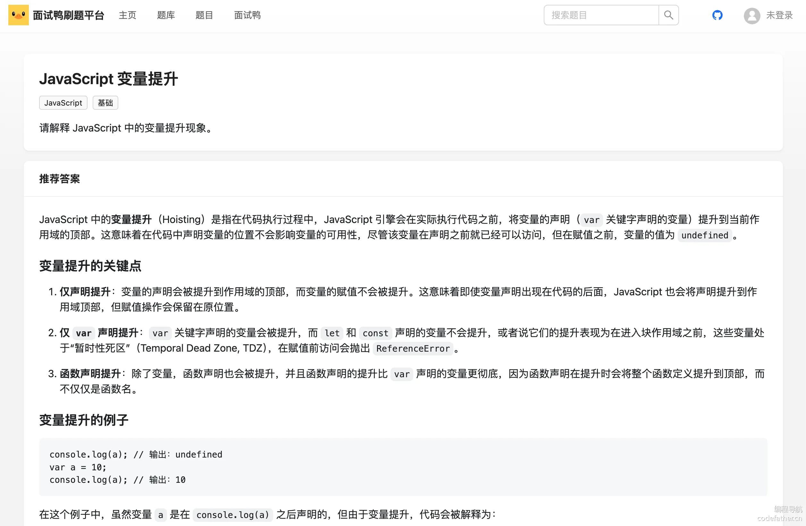

#### 扩展

1）支持折叠题目列表菜单：Ant Design 的 Menu 组件支持自定义菜单折叠触发器，[参考文档](https://ant-design.antgroup.com/components/menu-cn#menu-demo-inline-collapsed)。

2）题库和题目详情页的右侧可以展示目录、内容推荐等

3）题目详情页可以增加上一题、下一题的跳转

## 三、题目题库绑定

业务流程：直接复用已有的题目管理页面，管理员可以在该页面查询题目列表（比如根据题库查询），然后对这些题目进行操作，比如修改题目所属题库（添加或移除题目题库绑定关系）。

### 按照题库查询题目

在题目管理页面的 columns 中新增字段，要求表格中不可见，仅用于表单查询：

```tsx
{
  title: "所属题库",
  dataIndex: "questionBankId",
  hideInTable: true,
  hideInForm: true,
},
```

效果如图：

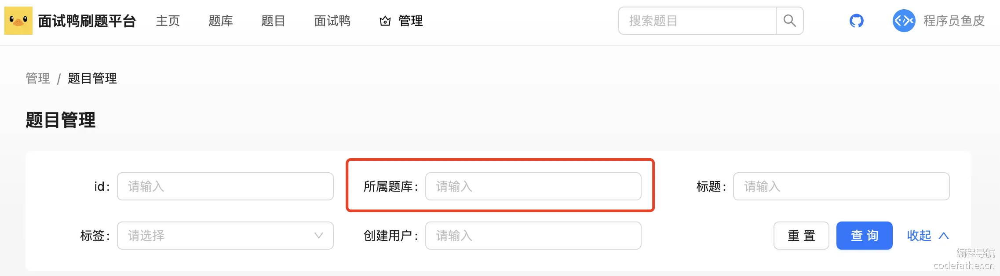

### 修改题目所属题库

可以参考修改题目信息的做法，在题目管理页面的目录下，新增一个弹窗表单组件。

#### 1、修改题库弹窗组件

直接复制题目修改弹窗组件，在此基础上进行修改即可。

应该如何让用户添加或移除题目绑定的题库呢？可以使用 [Ant Design 的 Select 多选组件](https://ant-design.antgroup.com/components/select-cn#select-methods)，来从题库列表中选择题库。选中时调用加入题库接口，取消选中时调用从题库移除接口。

💡 还有其他的实现方式，比如多选所属题库列表后，点击提交按钮，才提交到后端，由后端计算应该如何处理题库题目绑定关系。

组件属性如下：

```tsx
interface Props {
  questionId?: number;
  visible: boolean;
  onCancel: () => void;
}
```

表单代码如下：

```tsx
<Form style={{ marginTop: 24 }}>
  <Form.Item label="所属题库">
    <Select
      mode="multiple"
      style={{ width: "100%" }}
      defaultValue={["a10", "c12"]}
      onSelect={(value) => {
        alert("选中：" + value);
      }}
      onDeselect={(value) => {
        alert("取消选中：" + value);
      }}
      options={[]}
    />
  </Form.Item>
</Form>
```

#### 2、使用弹窗组件

1）在题目管理页面新增 visible 变量，用于控制弹窗是否显示：

```tsx
// 是否显示更新所属题库的弹窗
const [updateBankModalVisible, setUpdateBankModalVisible] = useState<boolean>(false);
```

2）新增操作按钮，触发打开弹窗：

```tsx
<Typography.Link
  onClick={() => {
    setCurrentRow(record);
    setUpdateBankModalVisible(true);
  }}
>
  修改所属题库
</Typography.Link>
```

3）引入弹窗组件，并传递属性：

```tsx
<UpdateBankModal
    visible={updateBankModalVisible}
    questionId={currentRow?.id}
    onCancel={() => {
      setCurrentRow(undefined);
      setUpdateBankModalVisible(false);
    }}
/>
```

#### 3、填充默认值 - 获取所属题库列表

如果题目已有所属题库，应该在修改表单中展示。

可以通过获取题库题目关系接口，获取到当前题目所属的题库列表，仅需获取一次，然后填充到表单中作为初始值。代码如下：

```tsx
const [form] = Form.useForm();

// 获取所属题库列表
const getCurrentQuestionBankIdList = async () => {
  try {
    const res = await listQuestionBankQuestionByPageUsingPost({
      questionId,
      pageSize: 20,
    });
    const list = (res.data.records ?? []).map((item) => item.questionBankId);
    form.setFieldValue("questionBankIdList" as any, list);
  } catch (e) {
    console.error("获取题目所属题库列表失败，" + e.message);
  }
};

useEffect(() => {
  if (questionId) {
    getCurrentQuestionBankIdList();
  }
}, [questionId]);
```

给表单组件添加 form 引用：

```tsx
<Form form={form} style={{ marginTop: 24 }}>
</Form>
```

#### 4、获取可选题库

题库很多，不可能让管理员手动输入 id 来选题库，应该显示可选题库列表和题库名称，提高选择效率。

由于题库数量不多，直接全量获取到题库列表即可：

```tsx
const [questionBankList, setQuestionBankList] = useState<
  API.QuestionBankVO[]
>([]);

// 获取题库列表
const getQuestionBankList = async () => {
  // 题库数量不多，直接全量获取
  const pageSize = 200;
  try {
    const questionBankRes = await listQuestionBankVoByPageUsingPost({
      pageSize,
      sortField: "createTime",
      sortOrder: "descend",
    });
    setQuestionBankList(questionBankRes.data.records ?? []);
  } catch (e) {
    console.error("获取题库列表失败，" + e.message);
  }
};

useEffect(() => {
  getQuestionBankList();
}, []);
```

然后计算出 Select 组件需要的选项：

```tsx
<Select
  mode="multiple"
  style={{ width: "100%" }}
  defaultValue={currentQuestionBankIdList}
  onSelect={(value) => {
    alert("选中：" + value);
  }}
  onDeselect={(value) => {
    alert("取消选中：" + value);
  }}
  options={questionBankList.map((questionBank) => {
    return {
      label: questionBank.title,
      value: questionBank.id,
    };
  })}
/>
```

#### 5、选中或取消选中题库

利用 Select 的选中和取消选中事件，调用接口实现题库绑定 / 解绑：

```tsx
onSelect={async (value) => {
  const hide = message.loading("正在更新");
  try {
    await addQuestionBankQuestionUsingPost({
      questionId,
      questionBankId: value,
    });
    hide();
    message.success("绑定题库成功");
  } catch (error: any) {
    hide();
    message.error("绑定题库失败，" + error.message);
  }
}}
onDeselect={async (value) => {
  const hide = message.loading("正在更新");
  try {
    await removeQuestionBankQuestionUsingPost({
      questionId,
      questionBankId: value,
    });
    hide();
    message.success("取消绑定题库成功");
  } catch (error: any) {
    hide();
    message.error("取消绑定题库失败，" + error.message);
  }
}}
```

效果如图：

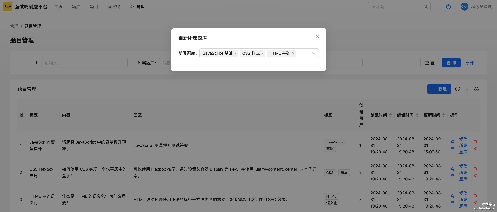

#### 扩展

1）支持在题库管理页面直接搜索和添加题目到题库中，实现方式和上面类似。

2）题库数量较多时，可以根据用户的输入进行防抖搜索，而不是全量将题库列表加载到可选项。可参考 [官方文档](https://ant-design.antgroup.com/components/select-cn#select-demo-select-users)。

## 四、扩展思路

以下内容前端同学全都可写到简历上：

#### 1、预渲染

通过 [官方文档](https://nextjs.org/docs/app/api-reference/components/link#prefetch) 了解 Next.js 的 prefetch 预渲染机制，进行性能优化。

比如页面内的链接过多时，预渲染次数会很多，可以将 prefetch 关闭来减少预渲染：

```tsx
<Link href={`/question/${question.id}`} prefetch={false}>{question.title}</Link>
```

#### 2、Metadata

Next.js 支持通过 Metadata 设置页面的 TDK（标题、描述、关键词）等网页元信息。可参考官方文档：https://nextjs.org/docs/app/building-your-application/optimizing/metadata

```tsx
import type { Metadata } from 'next'
 
export const metadata: Metadata = {
  title: '...',
  description: '...',
}
 
export default function Page() {}
```

#### 3、请求缓存

Next.js 扩展了原生的 fetch，支持请求数据的服务端缓存，是提升性能、减少资源占用的好方法。

可以参考官方获取数据的文档：https://nextjs.org/docs/app/building-your-application/data-fetching

但是，我们项目中使用的 Axios 库是不支持缓存的！有其他的方式来实现缓存：

1）可以在 getStaticProps 或 getServerSideProps 中使用 Axios 来获取数据，然后通过 Next.js 的 revalidate 选项来控制页面或数据的重新生成时间。

参考代码如下：

```javascript
export async function getStaticProps() {
  const response = await axios.get('https://mianshiya.com/data', {
    headers: {
      'Cache-Control': 'no-store',
    },
  });

  return {
    props: {
      data: response.data,
    },
    revalidate: 10000, // 在 10,000 秒后重新生成页面
  };
}
```

2）切换其他请求库，比如原生的 fetch，或者官方推荐的请求库：https://swr.vercel.app/zh-CN

#### 4、并发请求

如果同一个页面要多次请求后端，串行可能会很慢，导致页面迟迟不返回。因此可以并发调用多个接口来获取数据，使用 promise.all 语法即可。