## 本节重点

面向管理的扩展功能

- 题目批量管理：需求分析 + 方案设计 + 前后端开发 + 功能优化
- 自动缓存热门题库：需求分析 + 方案设计 + 开发实现

## 一、题目批量管理

### 需求分析

为了提高管理效率，管理端需要提供批量操作功能，例如：

- 【管理员】批量向题库添加题目
- 【管理员】批量从题库移除题目
- 【管理员】批量删除题目

### 基础方案设计

上述功能的基本实现并不难，本质上都是批量操作。

#### 前端设计

前端需要允许用户多选内容，并且向后端传递要批量操作的数据 id 列表。

前端具体交互流程：

1）批量向题库添加题目：在题目管理页，选中多条题目后，点击操作按钮，弹窗让用户选择要添加的题库。

2）批量从题库移除题目：在题目管理页，选中多条题目后，点击操作按钮，弹窗让用户选择要移除的题库。

3）批量删除题目：在题目管理页，选中多条题目后，点击操作按钮，触发二次确认，并执行删除。

#### 后端设计

后端通过 **循环** 依次调用数据库完成操作。注意，由于是批量操作，需要使用事务，有任何失败都会抛出异常并回滚。

### 基础后端开发

#### 1、批量向题库添加题目

添加前需要校验题目和题库是否存在，只添加合法的题目：

```java
@Override
@Transactional(rollbackFor = Exception.class)
public void batchAddQuestionsToBank(List<Long> questionIdList, Long questionBankId, User loginUser) {
    // 参数校验
    ThrowUtils.throwIf(CollUtil.isEmpty(questionIdList), ErrorCode.PARAMS_ERROR, "题目列表为空");
    ThrowUtils.throwIf(questionBankId == null || questionBankId <= 0, ErrorCode.PARAMS_ERROR, "题库非法");
    ThrowUtils.throwIf(loginUser == null, ErrorCode.NOT_LOGIN_ERROR);
    // 检查题目 id 是否存在
    List<Question> questionList = questionService.listByIds(questionIdList);
    // 合法的题目 id
    List<Long> validQuestionIdList = questionList.stream()
            .map(Question::getId)
            .collect(Collectors.toList());
    ThrowUtils.throwIf(CollUtil.isEmpty(validQuestionIdList), ErrorCode.PARAMS_ERROR, "合法的题目列表为空");
    // 检查题库 id 是否存在
    QuestionBank questionBank = questionBankService.getById(questionBankId);
    ThrowUtils.throwIf(questionBank == null, ErrorCode.NOT_FOUND_ERROR, "题库不存在");
    // 执行插入
    for (Long questionId : validQuestionIdList) {
        QuestionBankQuestion questionBankQuestion = new QuestionBankQuestion();
        questionBankQuestion.setQuestionBankId(questionBankId);
        questionBankQuestion.setQuestionId(questionId);
        questionBankQuestion.setUserId(loginUser.getId());
        boolean result = this.save(questionBankQuestion);
        if (!result) {
            throw new BusinessException(ErrorCode.OPERATION_ERROR, "向题库添加题目失败");
        }
    }
}
```

请求对象：

```java
@Data
public class QuestionBankQuestionBatchAddRequest implements Serializable {

    /**
     * 题库 id
     */
    private Long questionBankId;

    /**
     * 题目 id 列表
     */
    private List<Long> questionIdList;

    private static final long serialVersionUID = 1L;
}
```

QuestionController 新增接口：

```java
@PostMapping("/add/batch")
@AuthCheck(mustRole = UserConstant.ADMIN_ROLE)
public BaseResponse<Boolean> batchAddQuestionsToBank(
        @RequestBody QuestionBankQuestionBatchAddRequest questionBankQuestionBatchAddRequest,
        HttpServletRequest request
) {
    // 参数校验
    ThrowUtils.throwIf(questionBankQuestionBatchAddRequest == null, ErrorCode.PARAMS_ERROR);
    User loginUser = userService.getLoginUser(request);
    Long questionBankId = questionBankQuestionBatchAddRequest.getQuestionBankId();
    List<Long> questionIdList = questionBankQuestionBatchAddRequest.getQuestionIdList();
    questionBankQuestionService.batchAddQuestionsToBank(questionIdList, questionBankId, loginUser);
    return ResultUtils.success(true);
}
```

#### 2、批量从题库移除题目

删除时的校验可以相对宽松一些，直接执行删除操作即可。代码如下：

```java
@Override
@Transactional(rollbackFor = Exception.class)
public void batchRemoveQuestionsFromBank(List<Long> questionIdList, Long questionBankId) {
    // 参数校验
    ThrowUtils.throwIf(CollUtil.isEmpty(questionIdList), ErrorCode.PARAMS_ERROR, "题目列表为空");
    ThrowUtils.throwIf(questionBankId == null || questionBankId <= 0, ErrorCode.PARAMS_ERROR, "题库非法");
    // 执行删除关联
    for (Long questionId : questionIdList) {
        // 构造查询
        LambdaQueryWrapper<QuestionBankQuestion> lambdaQueryWrapper = Wrappers.lambdaQuery(QuestionBankQuestion.class)
                .eq(QuestionBankQuestion::getQuestionId, questionId)
                .eq(QuestionBankQuestion::getQuestionBankId, questionBankId);
        boolean result = this.remove(lambdaQueryWrapper);
        if (!result) {
            throw new BusinessException(ErrorCode.OPERATION_ERROR, "从题库移除题目失败");
        }
    }
}
```

请求对象：

```java
@Data
public class QuestionBankQuestionBatchRemoveRequest implements Serializable {

    /**
     * 题库 id
     */
    private Long questionBankId;

    /**
     * 题目 id 列表
     */
    private List<Long> questionIdList;

    private static final long serialVersionUID = 1L;
}
```

QuestionBankQuestionController 新增接口：

```java
@PostMapping("/remove/batch")
@AuthCheck(mustRole = UserConstant.ADMIN_ROLE)
public BaseResponse<Boolean> batchRemoveQuestionsFromBank(
        @RequestBody QuestionBankQuestionBatchRemoveRequest questionBankQuestionBatchRemoveRequest,
        HttpServletRequest request
) {
    // 参数校验
    ThrowUtils.throwIf(questionBankQuestionBatchRemoveRequest == null, ErrorCode.PARAMS_ERROR);
    Long questionBankId = questionBankQuestionBatchRemoveRequest.getQuestionBankId();
    List<Long> questionIdList = questionBankQuestionBatchRemoveRequest.getQuestionIdList();
    questionBankQuestionService.batchRemoveQuestionsFromBank(questionIdList, questionBankId);
    return ResultUtils.success(true);
}
```

#### 3、批量删除题目

对于批量删除题目功能，需要在删除题目时，移除题目题库关系。代码如下：

```java
@Override
@Transactional(rollbackFor = Exception.class)
public void batchDeleteQuestions(List<Long> questionIdList) {
    if (CollUtil.isEmpty(questionIdList)) {
        throw new BusinessException(ErrorCode.PARAMS_ERROR, "要删除的题目列表为空");
    }
    for (Long questionId : questionIdList) {
        boolean result = this.removeById(questionId);
        if (!result) {
            throw new BusinessException(ErrorCode.OPERATION_ERROR, "删除题目失败");
        }
        // 移除题目题库关系
        LambdaQueryWrapper<QuestionBankQuestion> lambdaQueryWrapper = Wrappers.lambdaQuery(QuestionBankQuestion.class)
                .eq(QuestionBankQuestion::getQuestionId, questionId);
        result = questionBankQuestionService.remove(lambdaQueryWrapper);
        if (!result) {
            throw new BusinessException(ErrorCode.OPERATION_ERROR, "删除题目题库关联失败");
        }
    }
}
```

请求对象：

```java
@Data
public class QuestionBatchDeleteRequest implements Serializable {

    /**
     * 题目 id 列表
     */
    private List<Long> questionIdList;

    private static final long serialVersionUID = 1L;
}
```

QuestionBankQuestionController 新增接口：

```java
@PostMapping("/delete/batch")
@AuthCheck(mustRole = UserConstant.ADMIN_ROLE)
public BaseResponse<Boolean> batchDeleteQuestions(@RequestBody QuestionBatchDeleteRequest questionBatchDeleteRequest,
                                                  HttpServletRequest request) {
    ThrowUtils.throwIf(questionBatchDeleteRequest == null, ErrorCode.PARAMS_ERROR);
    questionService.batchDeleteQuestions(questionBatchDeleteRequest.getQuestionIdList());
    return ResultUtils.success(true);
}
```

### 前端开发

主要是修改题目管理页面，增加批量操作能力。

#### 1、批量操作

Ant Design ProComponents 的 ProTable 组件自带批量操作功能，可以参考 [官方文档](https://procomponents.ant.design/components/table?tab=api&current=1&pageSize=5#packages-table-src-components-table-tab-api-demo-batchoption) 。

给 ProTable 组件增加如下属性，要重点注意修改 ProTable 组件的 rowKey="id"，作为多选行的唯一标识。

```tsx
<ProTable<API.Question>
  rowKey="id"
  rowSelection={{
    // 自定义选择项参考: https://ant.design/components/table-cn/#components-table-demo-row-selection-custom
    // 注释该行则默认不显示下拉选项
    selections: [Table.SELECTION_ALL, Table.SELECTION_INVERT],
  }}
  tableAlertRender={({
    selectedRowKeys,
    selectedRows,
    onCleanSelected,
  }) => {
    return (
      <Space size={24}>
        <span>
          已选 {selectedRowKeys.length} 项
          <a style={{ marginInlineStart: 8 }} onClick={onCleanSelected}>
            取消选择
          </a>
        </span>
      </Space>
    );
  }}
  tableAlertOptionRender={({
    selectedRowKeys,
    selectedRows,
    onCleanSelected,
  }) => {
    return (
      <Space size={16}>
        <Button
          onClick={() => {
            // 打开弹窗
          }}
        >
          批量向题库添加题目
        </Button>
        <Button
          onClick={() => {
            // 打开弹窗
          }}
        >
          批量从题库移除题目
        </Button>
        <Popconfirm
          title="确认删除"
          description="你确定要删除这些题目么？"
          onConfirm={() => {
            // 批量删除题目
          }}
          okText="Yes"
          cancelText="No"
        >
          <Button danger>批量删除题目</Button>
        </Popconfirm>
      </Space>
    );
  }}
/>
```

注意，上述代码中，考虑到批量删除题目需要二次确认，使用 [Popconfirm 组件](https://ant-design.antgroup.com/components/popconfirm-cn)。

#### 2、操作弹窗

参考更新题目所属题库弹窗组件 UpdateBankModal，编写批量向题库添加题目弹窗、批量从题库移除题目弹窗。二者写法基本一致，都接受 questionIdList 选中的题目 id 列表参数、都需要获取到题库列表供选择。

1）批量向题库添加题目弹窗：

```tsx
import { Button, Form, message, Modal, Select } from "antd";
import React, { useEffect, useState } from "react";
import { batchAddQuestionsToBankUsingPost } from "@/api/questionBankQuestionController";
import { listQuestionBankVoByPageUsingPost } from "@/api/questionBankController";

interface Props {
  questionIdList?: number[];
  visible: boolean;
  onSubmit: () => void;
  onCancel: () => void;
}

/**
 * 批量向题库添加题目弹窗
 * @param props
 * @constructor
 */
const BatchAddQuestionsToBankModal: React.FC<Props> = (props) => {
  const { questionIdList = [], visible, onSubmit, onCancel } = props;
  const [form] = Form.useForm();
  const [questionBankList, setQuestionBankList] = useState<
    API.QuestionBankVO[]
    >([]);

  // 获取题库列表
  const getQuestionBankList = async () => {
    // 题库数量不多，直接全量获取
    const pageSize = 200;

    try {
      const res = await listQuestionBankVoByPageUsingPost({
        pageSize,
        sortField: "createTime",
        sortOrder: "descend",
      });
      setQuestionBankList(res.data?.records ?? []);
    } catch (e) {
      message.error("获取题库列表失败，" + e.message);
    }
  };

  useEffect(() => {
    getQuestionBankList();
  }, []);

  /**
   * 提交
   * @param fields
   */
  const doSubmit = async (fields: API.QuestionBankQuestionBatchAddRequest) => {
    const hide = message.loading("正在操作");
    const questionBankId = fields.questionBankId;
    try {
      await batchAddQuestionsToBankUsingPost({
        questionIdList,
        questionBankId,
      });
      hide();
      message.success("操作成功");
      onSubmit?.();
    } catch (error: any) {
      hide();
      message.error("操作失败，" + error.message);
    }
  };

  return (
    <Modal
      destroyOnClose
      title={"批量向题库添加题目"}
      open={visible}
      footer={null}
      onCancel={() => {
        onCancel?.();
      }}
      >
      <Form
        form={form}
        style={{ marginTop: 24 }}
        onFinish={doSubmit}
        >
        <Form.Item label="选择题库" name="questionBankId">
          <Select
            style={{ width: "100%" }}
            options={questionBankList.map((questionBank) => {
              return {
                label: questionBank.title,
                value: questionBank.id,
              };
            })}
            />
        </Form.Item>
        <Form.Item>
          <Button type="primary" htmlType="submit">
            提交
          </Button>
        </Form.Item>
      </Form>
    </Modal>
  );
};

export default BatchAddQuestionsToBankModal;
```

2）批量从题库移除题目弹窗：

```tsx
import { Button, Form, message, Modal, Select } from "antd";
import React, { useEffect, useState } from "react";
import { listQuestionBankVoByPageUsingPost } from "@/api/questionBankController";
import {
  batchRemoveQuestionsFromBankUsingPost,
} from "@/api/questionBankQuestionController";

interface Props {
  questionIdList?: number[];
  visible: boolean;
  onSubmit: () => void;
  onCancel: () => void;
}

/**
 * 批量从题库移除题目弹窗
 * @param props
 * @constructor
 */
const BatchRemoveQuestionsToBankModal: React.FC<Props> = (props) => {
  const { questionIdList = [], visible, onCancel, onSubmit } = props;
  const [form] = Form.useForm();
  const [questionBankList, setQuestionBankList] = useState<
    API.QuestionBankVO[]
  >([]);

  /**
   * 提交
   *
   * @param values
   */
  const doSubmit = async (
    values: API.QuestionBankQuestionBatchRemoveRequest,
  ) => {
    const hide = message.loading("正在操作");
    const questionBankId = values.questionBankId;
    if (!questionBankId) {
      return;
    }
    try {
      await batchRemoveQuestionsFromBankUsingPost({
        questionBankId,
        questionIdList,
      });
      hide();
      message.success("操作成功");
      onSubmit?.();
    } catch (error: any) {
      hide();
      message.error("操作失败，" + error.message);
    }
  };

  // 获取题库列表
  const getQuestionBankList = async () => {
    // 题库数量不多，直接全量获取
    const pageSize = 200;

    try {
      const res = await listQuestionBankVoByPageUsingPost({
        pageSize,
        sortField: "createTime",
        sortOrder: "descend",
      });
      setQuestionBankList(res.data?.records ?? []);
    } catch (e) {
      message.error("获取题库列表失败，" + e.message);
    }
  };

  useEffect(() => {
    getQuestionBankList();
  }, []);

  return (
    <Modal
      destroyOnClose
      title={"批量从题库移除题目"}
      open={visible}
      footer={null}
      onCancel={() => {
        onCancel?.();
      }}
    >
      <Form form={form} style={{ marginTop: 24 }} onFinish={doSubmit}>
        <Form.Item label="选择题库" name="questionBankId">
          <Select
            style={{ width: "100%" }}
            options={questionBankList.map((questionBank) => {
              return {
                label: questionBank.title,
                value: questionBank.id,
              };
            })}
          />
        </Form.Item>
        <Form.Item>
          <Button type="primary" htmlType="submit">
            提交
          </Button>
        </Form.Item>
      </Form>
    </Modal>
  );
};
export default BatchRemoveQuestionsToBankModal;
```

#### 3、题目管理页面使用弹窗

1）需要在题目管理页面定义一些变量，包括弹窗是否可见、选中的题目 id 列表。代码如下：

```tsx
// 是否显示批量向题库添加题目弹窗
const [
  batchAddQuestionsToBankModalVisible,
  setBatchAddQuestionsToBankModalVisible,
] = useState<boolean>(false);
// 是否显示批量从题库移除题目弹窗
const [
  batchRemoveQuestionsFromBankModalVisible,
  setBatchRemoveQuestionsFromBankModalVisible,
] = useState<boolean>(false);
// 当前选中的题目 id 列表
const [selectedQuestionIdList, setSelectedQuestionIdList] = useState<
  number[]
>([]);
```

2）给批量操作按钮绑定事件，点击时触发弹窗打开：

```tsx
<Button
  onClick={() => {
    // 打开弹窗
    setSelectedQuestionIdList(selectedRowKeys as number[]);
    setBatchAddQuestionsToBankModalVisible(true);
  }}
  >
  批量向题库添加题目
</Button>
<Button
onClick={() => {
  // 打开弹窗
  setSelectedQuestionIdList(selectedRowKeys as number[]);
  setBatchRemoveQuestionsFromBankModalVisible(true);
}}
>
批量从题库移除题目
</Button>
```

3）引入弹窗组件，并且绑定事件，弹窗内的操作成功或取消时，都需要关闭弹窗：

```tsx
<BatchAddQuestionsToBankModal
  visible={batchAddQuestionsToBankModalVisible}
  questionIdList={selectedQuestionIdList}
  onSubmit={() => {
    setBatchAddQuestionsToBankModalVisible(false);
  }}
  onCancel={() => {
    setBatchAddQuestionsToBankModalVisible(false);
  }}
/>
<BatchRemoveQuestionsFromBankModal
  visible={batchRemoveQuestionsFromBankModalVisible}
  questionIdList={selectedQuestionIdList}
  onSubmit={() => {
    setBatchRemoveQuestionsFromBankModalVisible(false);
  }}
  onCancel={() => {
    setBatchRemoveQuestionsFromBankModalVisible(false);
  }}
/>
```

#### 4、批量删除题目

先定义批量删除函数：

```tsx
/**
 * 批量删除
 * @param questionIdList
 */
const handleBatchDelete = async (questionIdList: number[]) => {
  const hide = message.loading("正在操作");
  try {
    await batchDeleteQuestionsUsingPost({
      questionIdList,
    });
    hide();
    message.success("操作成功");
    actionRef?.current?.reload();
  } catch (error: any) {
    hide();
    message.error("操作失败，" + error.message);
  }
};
```

然后给批量删除按钮绑定事件：

```tsx
<Popconfirm
  title="确认删除"
  description="你确定要删除这些题目么？"
  onConfirm={() => {
    // 批量删除题目
    handleBatchDelete(selectedRowKeys as number[]);
  }}
  okText="Yes"
  cancelText="No"
>
  <Button danger>批量删除题目</Button>
</Popconfirm>
```

------

几个功能的开发就完成了，效果如图：

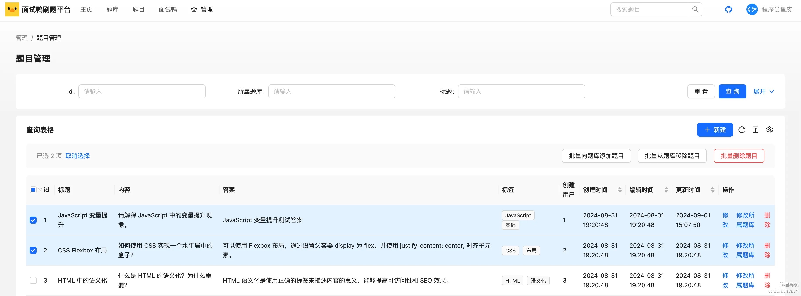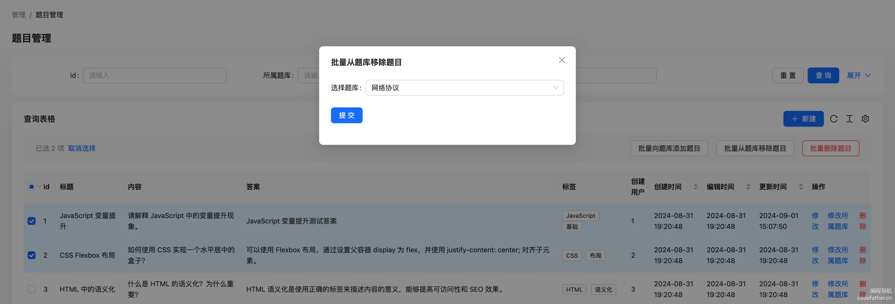

### 测试验证（发现问题）

通过测试，可以发现一些明显的功能问题，比如：

1）已添加到题库的题目，重复添加就会报错

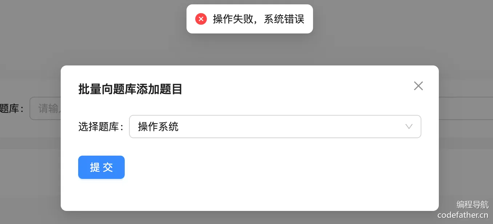

查看后端日志，因为重复添加了记录：


2）未添加到题库的题目，解除绑定关系失败就会报错

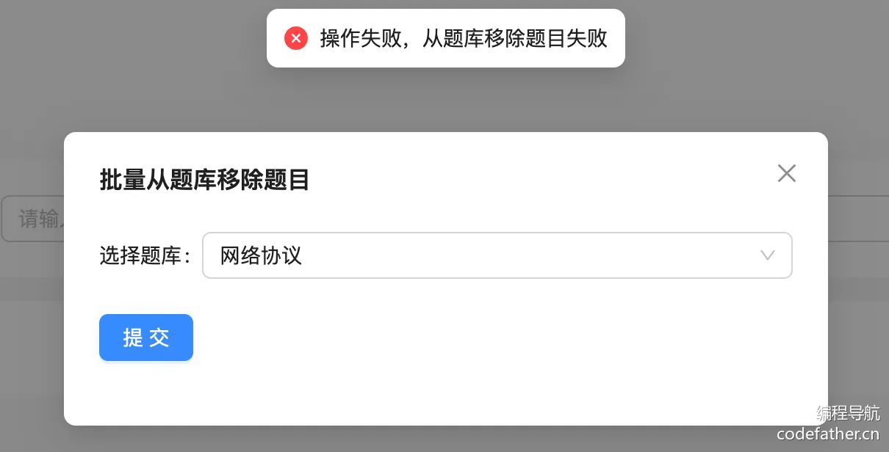

因为不存在题目关联，抛出我们自定义的业务异常：


3）删除题目时，如果没有关联，也会报错。因为不存在题目关联，抛出我们自定义的业务异常。


此外，我们上述的代码还有一些其他的问题，比如：

- 稳定性低，有一道题目报错，就全部出错了
- 性能较低，同时操作的题目较多时，执行时间会很长

下面我们以这些功能为例，来学习一些通用的 **批处理操作** 的优化方案。

## 二、批处理操作优化

一般情况下，我们可以从以下多个角度对批处理任务进行优化。

- 健壮性
- 稳定性
- 性能
- 数据一致性
- 可观测性

### 健壮性

健壮性是指系统在面对 **异常情况或不合法输入** 时仍能表现出合理的行为。一个健壮的系统能够 **预见和处理异常**，并且即使发生错误，也不会崩溃或产生不可预期的行为。

#### 1、参数校验提前

可以在调用数据库之前就对参数进行校验，这样可以减少不必要的数据库操作开销，不用等到数据库操作时再抛出异常。

在现有的添加题目到题库的代码中，我们已经提前对参数进行了非空校验，并且会提前检查题目和题库是否存在，这是很好的。但是我们还没有校验哪些题目已经添加到题库中，对于这些题目，不必再执行插入关联记录的数据库操作。

需要补充的代码如下：

```java
// 检查题库 id 是否存在
// ...

// 检查哪些题目还不存在于题库中，避免重复插入
LambdaQueryWrapper<QuestionBankQuestion> lambdaQueryWrapper = Wrappers.lambdaQuery(QuestionBankQuestion.class)
        .eq(QuestionBankQuestion::getQuestionBankId, questionBankId)
        .in(QuestionBankQuestion::getQuestionId, validQuestionIdList);
List<QuestionBankQuestion> existQuestionList = this.list(lambdaQueryWrapper);
// 已存在于题库中的题目 id
Set<Long> existQuestionIdSet = existQuestionList.stream()
        .map(QuestionBankQuestion::getId)
        .collect(Collectors.toSet());
// 已存在于题库中的题目 id，不需要再次添加
validQuestionIdList = validQuestionIdList.stream().filter(questionId -> {
    return !existQuestionIdSet.contains(questionId);
}).collect(Collectors.toList());
ThrowUtils.throwIf(CollUtil.isEmpty(validQuestionIdList), ErrorCode.PARAMS_ERROR, "所有题目都已存在于题库中");

// 执行插入
// ...
```

#### 2、异常处理

目前虽然已经对每一次插入操作的结果都进行了判断，并且抛出自定义异常，但是有些特殊的异常并没有被捕获。

可以进一步细化异常处理策略，考虑更细粒度的异常分类，不同的异常类型可以通过不同的方式处理，例如：

- 数据唯一键重复插入问题，会抛出 `DataIntegrityViolationException`。
- 数据库连接问题、事务问题等导致操作失败时抛出 `DataAccessException`。
- 其他的异常可以通过日志记录详细错误信息，便于后期追踪（全局异常处理器也有这个能力）。

示例代码如下：

```java
try {
    boolean result = this.save(questionBankQuestion);
    if (!result) {
        throw new BusinessException(ErrorCode.OPERATION_ERROR, "向题库添加题目失败");
    }
} catch (DataIntegrityViolationException e) {
    log.error("数据库唯一键冲突或违反其他完整性约束，题目 id: {}, 题库 id: {}, 错误信息: {}",
            questionId, questionBankId, e.getMessage());
    throw new BusinessException(ErrorCode.OPERATION_ERROR, "题目已存在于该题库，无法重复添加");
} catch (DataAccessException e) {
    log.error("数据库连接问题、事务问题等导致操作失败，题目 id: {}, 题库 id: {}, 错误信息: {}",
            questionId, questionBankId, e.getMessage());
    throw new BusinessException(ErrorCode.OPERATION_ERROR, "数据库操作失败");
} catch (Exception e) {
    // 捕获其他异常，做通用处理
    log.error("添加题目到题库时发生未知错误，题目 id: {}, 题库 id: {}, 错误信息: {}",
            questionId, questionBankId, e.getMessage());
    throw new BusinessException(ErrorCode.OPERATION_ERROR, "向题库添加题目失败");
}
```

### 稳定性

#### 1、避免长事务问题

批量操作中，一次性处理过多数据会导致事务过长，影响数据库性能。可以通过 分批处理 来避免长事务问题，确保部分数据异常不会影响整个批次的数据保存。

假设操作 10w 条数据，其中有 1 条数据操作异常，如果是长事务，那么修改的 10w 条数据都需要回滚，而分批事务仅需回滚一批既可，降低长事务带来的资源消耗，同时也提升了稳定性。

编写一个新的方法，用于对某一批操作进行事务管理：

```java
@Override
@Transactional(rollbackFor = Exception.class)
public void batchAddQuestionsToBankInner(List<QuestionBankQuestion> questionBankQuestions) {
    for (QuestionBankQuestion questionBankQuestion : questionBankQuestions) {
        long questionId = questionBankQuestion.getQuestionId();
        long questionBankId = questionBankQuestion.getQuestionBankId();
        try {
            boolean result = this.save(questionBankQuestion);
            ThrowUtils.throwIf(!result, ErrorCode.OPERATION_ERROR, "向题库添加题目失败");
        } catch (DataIntegrityViolationException e) {
            log.error("数据库唯一键冲突或违反其他完整性约束，题目 id: {}, 题库 id: {}, 错误信息: {}",
                    questionId, questionBankId, e.getMessage());
            throw new BusinessException(ErrorCode.OPERATION_ERROR, "题目已存在于该题库，无法重复添加");
        } catch (DataAccessException e) {
            log.error("数据库连接问题、事务问题等导致操作失败，题目 id: {}, 题库 id: {}, 错误信息: {}",
                    questionId, questionBankId, e.getMessage());
            throw new BusinessException(ErrorCode.OPERATION_ERROR, "数据库操作失败");
        } catch (Exception e) {
            // 捕获其他异常，做通用处理
            log.error("添加题目到题库时发生未知错误，题目 id: {}, 题库 id: {}, 错误信息: {}",
                    questionId, questionBankId, e.getMessage());
            throw new BusinessException(ErrorCode.OPERATION_ERROR, "向题库添加题目失败");
        }
    }
}
```

在原方法中批量生成题目，并且调用上述事务方法：

```java
// 分批处理避免长事务，假设每次处理 1000 条数据
int batchSize = 1000;
int totalQuestionListSize = validQuestionIdList.size();
for (int i = 0; i < totalQuestionListSize; i += batchSize) {
    // 生成每批次的数据
    List<Long> subList = validQuestionIdList.subList(i, Math.min(i + batchSize, totalQuestionListSize));
    List<QuestionBankQuestion> questionBankQuestions = subList.stream().map(questionId -> {
        QuestionBankQuestion questionBankQuestion = new QuestionBankQuestion();
        questionBankQuestion.setQuestionBankId(questionBankId);
        questionBankQuestion.setQuestionId(questionId);
        questionBankQuestion.setUserId(loginUser.getId());
        return questionBankQuestion;
    }).collect(Collectors.toList());
    // 使用事务处理每批数据
    QuestionBankQuestionService questionBankQuestionService = (QuestionBankQuestionServiceImpl) AopContext.currentProxy();
    questionBankQuestionService.batchAddQuestionsToBankInner(questionBankQuestions);
}
```

需要注意的是，上述代码中，我们通过 `AopContext.currentProxy()` 方法获取到了当前实现类的代理对象，来调用事务方法。

为什么要这么做呢？ 因为 **Spring 事务依赖于代理机制**，而内部调用通过 `this` 直接调用方法，不会通过 Spring 的代理，因此不会触发事务。

注意，使用 `AopContext.currentProxy()` 方法时必须要在启动类添加下面的注解开启切面自动代理：

```java
@EnableAspectJAutoProxy(proxyTargetClass = true, exposeProxy = true)
```

#### 2、重试

对于可能由于网络不稳定等临时原因偶发失败的操作，可以设计 **重试机制** 提高系统的稳定性，适用于执行时间很长的任务。

注意，重试的过程中要记录日志，**并且重试次数要有一个上限** 。示例代码如下：

```java
int retryCount = 3;
for (int i = 0; i < retryCount; i++) {
    try {
        // 执行插入操作
        // 成功则跳出重试循环
        break; 
    } catch (Exception e) {
        log.warn("插入失败，重试次数: {}", i + 1);
        if (i == retryCount - 1) {
            throw new BusinessException(ErrorCode.OPERATION_ERROR, "多次重试后操作仍然失败");
        }
    }
}
```

💡当然，除了手动编写重试代码外，我会更推荐 Guava Retrying 库，可以看 [鱼皮的这篇文章](https://cloud.tencent.com/developer/article/1752086) 学习。

但对于我们目前的题目管理功能，执行时间不会特别长，增加重试反而一定程度上增加了系统的不确定性和复杂度，可以不用添加。

#### 3、中断恢复

如果在批量插入过程中由于某种原因（如数据库宕机、服务器重启）导致批处理中断，建议设计一种机制来进行 **增量恢复**。比如可以为每次操作打上批次标记，在操作未完成时记录操作状态（如部分题目成功添加），并在恢复时继续执行未完成的操作。

可以设计一个数据库表存储批次的状态：

```sql
create table question_batch_status (
  batch_id bigint primary key,
  question_bank_id bigint,
  total_questions int,
  processed_questions int,
  status varchar(20) -- running, completed, failed
);
```

通过该表可以跟踪每次批处理的进度，并在失败时根据批次继续处理。

但对于我们的题目管理功能，不用那么复杂，可以直接通过判断数据是否已经满足要求来对要新处理的数据进行过滤。比如添加题目到题库前，先查一下是否已经添加到题库里了，如果已添加就不用重复添加了。（前面 `参数校验提前` 就已经实现了这个功能）

### 性能优化

#### 1、批量操作

当前代码中，每个题目是单独插入数据库的，这会产生频繁的数据库交互。

大多数 ORM 框架和数据库驱动都支持批量插入，可以通过批量插入来优化性能，比如 MyBatis Plus 提供了 saveBatch 方法。

优化后的代码如下：

```java
@Override
@Transactional(rollbackFor = Exception.class)
public void batchAddQuestionsToBankInner(List<QuestionBankQuestion> questionBankQuestions) {
    try {
        boolean result = this.saveBatch(questionBankQuestions);
        ThrowUtils.throwIf(!result, ErrorCode.OPERATION_ERROR, "向题库添加题目失败");
    } catch (DataIntegrityViolationException e) {
        log.error("数据库唯一键冲突或违反其他完整性约束, 错误信息: {}", e.getMessage());
        throw new BusinessException(ErrorCode.OPERATION_ERROR, "题目已存在于该题库，无法重复添加");
    } catch (DataAccessException e) {
        log.error("数据库连接问题、事务问题等导致操作失败, 错误信息: {}", e.getMessage());
        throw new BusinessException(ErrorCode.OPERATION_ERROR, "数据库操作失败");
    } catch (Exception e) {
        // 捕获其他异常，做通用处理
        log.error("添加题目到题库时发生未知错误，错误信息: {}", e.getMessage());
        throw new BusinessException(ErrorCode.OPERATION_ERROR, "向题库添加题目失败");
    }
}
```

批量操作的好处：

- 降低了数据库连接和提交的频率。
- 避免频繁的数据库交互，减少 I/O 操作，显著提高性能。

💡类似的，Redis 也提供了批处理方法，比如 Pipeline。

#### 2、SQL 优化

我们在操作数据库时，可以使用一些 SQL 优化的技巧。

如何优化 SQL？这也是一道经典的面试题，可以 [看文章](https://www.mianshiya.com/question/1780933295521951745) 了解。

其中，有一个最基本的 SQL 优化原则，不要使用 `select *` 来查询数据，只查出需要的字段即可。由于框架封装地太好了，可能大多数同学都不会注意这点，其实我们上述的代码就需要对此进行优化，来减少查询的数据量。

比如：

```java
// 检查题目 id 是否存在
LambdaQueryWrapper<Question> questionLambdaQueryWrapper = Wrappers.lambdaQuery(Question.class)
        .select(Question::getId)
        .in(Question::getId, questionIdList);
List<Question> questionList = questionService.list(questionLambdaQueryWrapper);
```

由于返回的值只有 id 一列，还可以直接转为 Long 列表，不需要让框架封装结果为 Question 对象了，减少内存占用：

```java
// 合法的题目 id
List<Long> validQuestionIdList = questionService.listObjs(questionLambdaQueryWrapper, obj -> (Long) obj);
ThrowUtils.throwIf(CollUtil.isEmpty(validQuestionIdList), ErrorCode.PARAMS_ERROR, "合法的题目列表为空");
```

#### 3、并发编程

由于我们已经将操作分批处理，在操作较多、追求处理时间的情况下，可以通过并发编程让每批操作同时执行，而不是一批处理完再执行下一批，能够大幅提升性能。

Java 中，可以利用并发包中的 **CompletableFuture + 线程池** 来并发处理多个任务。

CompletableFuture 是 Java 8 中引入的一个类，用于表示异步操作的结果。它是 Future 的增强版本，不仅可以表示一个异步计算，还可以对异步计算的结果进行组合、转换和处理，**实现异步任务的编排**。

比如下列代码，将任务拆分为多个子任务，并发执行，最后通过 `CompletableFuture.allOf` 方法阻塞等待，只有所有的子任务都完成，才会执行后续代码：

```java
List<CompletableFuture<Void>> futures = new ArrayList<>();

for (List<Long> subList : splitList(validQuestionIdList, 1000)) {
    CompletableFuture<Void> future = CompletableFuture.runAsync(() -> {
        processBatch(subList, questionBankId, loginUser);
    });
    futures.add(future);
}

// 等待所有任务完成
CompletableFuture.allOf(futures.toArray(new CompletableFuture[0])).join();
```

CompletableFuture 默认使用 Java 7 引入的 ForkJoinPool 线程池来并发执行任务。该线程池特别适合需要分治法来处理的大量并发任务，支持递归任务拆分。Java 8 中的并行流默认也是使用了 ForkJoinPool 进行并发处理

ForkJoinPool 的主要特性：

- 工作窃取算法（Work-Stealing）：线程可以从其他线程的工作队列中“窃取”任务，以提高 CPU 的使用率和程序的并行性。
- 递归任务处理：支持将大任务拆分为多个小任务并行执行，然后再将结果合并。

💡 但是要注意，CompletableFuture 默认使用的是 `ForkJoinPool.commonPool()` 方法得到的线程池，这是一个全局共享的线程池，如果有多种不同的任务都依赖该线程池进行处理，可能会导致资源争抢、代码阻塞等不确定的问题。**所以建议针对每种任务，自定义线程池来处理，实现线程池资源的隔离。**

Java 内置了很多种不同的线程池，比如单线程的线程池、固定线程的线程池、自定义线程池等等，一般情况下我们会根据业务和资源情况 **自定义线程池**。下面是一个示例：

```java
// 自定义线程池
ThreadPoolExecutor customExecutor = new ThreadPoolExecutor(
        4,                         // 核心线程数
        10,                        // 最大线程数
        60L,                       // 线程空闲存活时间
        TimeUnit.SECONDS,           // 存活时间单位
        new LinkedBlockingQueue<>(1000),  // 阻塞队列容量
        new ThreadPoolExecutor.CallerRunsPolicy() // 拒绝策略：由调用线程处理任务
);
```

自定义线程池里有那么多参数，应该如何设置呢？

这也是一道经典的面试题，可以看 [这篇文章](https://www.mianshiya.com/question/1771004113190924290) 学习。

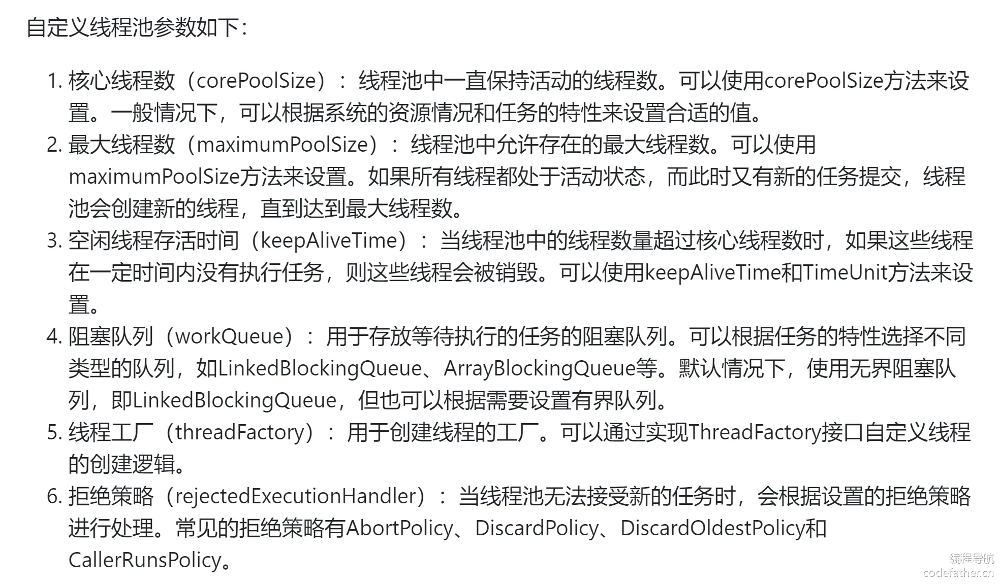

此处画个重点，大家只要记住一个公式：

1. 对于计算密集型任务（消耗 CPU 资源）， 设置核心线程数为 `n+1` 或者 `n`（n 是 CPU 核心数），可以充分利用 CPU， 多一个线程是为了可以在某些线程短暂阻塞或执行调度时，确保有足够的线程保持 CPU 繁忙，最大化 CPU 的利用率。
2. 对于 IO 密集型任务（消耗 IO 资源），可以增大核心线程数为 CPU 核心数的 2 - 4 倍，可以提升并发执行任务的数量。

对于批量添加题目功能，和数据库交互频繁，属于 IO 密集型任务，可以给自定义线程池更大的核心线程数。引入并发编程后的代码：

```java
// 自定义线程池
ThreadPoolExecutor customExecutor = new ThreadPoolExecutor(
        20,                         // 核心线程数
        50,                        // 最大线程数
        60L,                       // 线程空闲存活时间
        TimeUnit.SECONDS,           // 存活时间单位
        new LinkedBlockingQueue<>(10000),  // 阻塞队列容量
        new ThreadPoolExecutor.CallerRunsPolicy() // 拒绝策略：由调用线程处理任务
);

// 用于保存所有批次的 CompletableFuture
List<CompletableFuture<Void>> futures = new ArrayList<>();

// 分批处理避免长事务，假设每次处理 1000 条数据
int batchSize = 1000;
int totalQuestionListSize = validQuestionIdList.size();
for (int i = 0; i < totalQuestionListSize; i += batchSize) {
    // 生成每批次的数据
    List<Long> subList = validQuestionIdList.subList(i, Math.min(i + batchSize, totalQuestionListSize));
    List<QuestionBankQuestion> questionBankQuestions = subList.stream().map(questionId -> {
        QuestionBankQuestion questionBankQuestion = new QuestionBankQuestion();
        questionBankQuestion.setQuestionBankId(questionBankId);
        questionBankQuestion.setQuestionId(questionId);
        questionBankQuestion.setUserId(loginUser.getId());
        return questionBankQuestion;
    }).collect(Collectors.toList());

    QuestionBankQuestionService questionBankQuestionService = (QuestionBankQuestionServiceImpl) AopContext.currentProxy();
    // 异步处理每批数据并添加到 futures 列表
    CompletableFuture<Void> future = CompletableFuture.runAsync(() -> {
        questionBankQuestionService.batchAddQuestionsToBankInner(questionBankQuestions);
    }, customExecutor);
    futures.add(future);
}

// 等待所有批次操作完成
CompletableFuture.allOf(futures.toArray(new CompletableFuture[0])).join();

// 关闭线程池
customExecutor.shutdown();
```

注意，虽然并发编程能够提升性能，但也会占用更多的资源，并且给系统引入更多的不确定性。比如某个任务出现异常时，其他任务可能正在执行，产生不确定的影响。对此，可以根据情况给异步任务补充异常处理行为，通过 `exceptionally` 方法就能实现，示例代码如下：

```java
CompletableFuture<Void> future = CompletableFuture.runAsync(() -> {
    questionBankQuestionService.batchAddQuestionsToBankInner(questionBankQuestions);
}, customExecutor).exceptionally(ex -> {
    log.error("批处理任务执行失败", ex);
    return null;
});
```

#### 4、异步任务优化

将批量操作的处理变成提交一个后台任务，提交后台任务后，接口可以直接给前端返回已提交的任务 id。后台可以根据情况选择时机去执行之前提交的后台任务（比如通过定时任务或者消息队列）。

业务流程对应的示例代码如下：

```java
@PostMapping("/start")
public String startTask() {
    // 生成唯一任务 id
    String taskId = UUID.randomUUID().toString();
    
    // 异步提交或执行任务
    executeLongRunningTask(taskId);
    
    // 返回任务 id
    return taskId;
}
```

前端可以通过轮询调用接口、WebSocket、SSE 等方式得知任务的执行进度。比如后端提供一个根据任务 id 查询状态的接口：

```java
// 查询任务状态
public TaskStatus queryTaskStatus(String taskId) {
    return taskService.getTaskStatus(taskId);
}
```

注意，这种方案相当于改造了业务流程，成本较大，适合需要较长执行时间、或者需要对任务状态进行记录复盘的场景。

**怎么实现异步任务呢？**

1）立即执行异步任务

可以直接给要异步执行的方法加上 Spring 提供的 `@Async` 注解，或者手动使用 `CompletableFuture` 来异步执行任务。

```java
@Async
@Override
@Transactional(rollbackFor = Exception.class)
public void batchAddQuestionsToBankInner(List<QuestionBankQuestion> questionBankQuestions) {
    // ...
}
```

2）定时执行

可以将任务信息保存到数据库中，通过 Spring Scheduler 定时任务持续扫描数据库中 **未执行的任务** 来执行。

3）通过消息队列进行任务分发

对于长时间的批量任务，还可以考虑使用 **消息队列**（如 RabbitMQ、Kafka）来异步处理任务。将任务放入消息队列，由消费者（后台服务）异步执行任务。

示例任务提交代码：

```java
@PostMapping("/start")
public String startTask() {
    // 生成唯一任务 id
    String taskId = UUID.randomUUID().toString();
    
    // 将任务发送到消息队列
    messageQueueService.sendMessage(new TaskMessage(taskId));

    // 返回任务 id
    return taskId;
}
```

后台消费者接收到消息后处理任务：

```java
@RabbitListener(queues = "batch-task-queue")
public void processBatchTask(TaskMessage taskMessage) {
    Long taskId = taskMessage.getTaskId();

    // 查询数据库，根据 taskId 获取任务信息
    Task task = getById(taskId);

    // 执行任务
    doSomething(task);

    // 执行完成后，记得更新任务的状态
}
```

💡[编程导航的智能 BI 项目](https://www.code-nav.cn/course/1790980531403927553) 中，就是通过 RabbitMQ 消息队列实现了异步任务，感兴趣的同学可以学习。

#### **5、数据库连接池调优**

数据库连接池是用于管理与数据库之间连接的资源池，它能够 **复用** 现有的数据库连接，而不是在每次请求时都新建和销毁连接，从而提升系统的性能和响应速度。

常见的数据库连接池有 2 种：

1）HikariCP：被认为是市场上最快的数据库连接池之一，具有非常低的延迟和高效的性能。它以其轻量级和简洁的设计闻名，占用较少的内存和 CPU 资源。

Spring Boot 2.x 版本及以上默认使用 HikariCP 作为数据库连接池。

2）[Druid](https://github.com/alibaba/druid)：由阿里巴巴开发的开源数据库连接池，提供了丰富的监控和管理功能，包括 SQL 分析、性能监控和慢查询日志等。适合需要深度定制和监控的企业级应用。

在使用 Spring Boot 2.x 的情况下，默认 HikariCP 连接池大小是 10，当前请求量大起来之后，如果数据库执行的不够快，那么请求都会被阻塞等待获取连接池的连接上。

比如鱼皮自己业务中出现的情况，获取数据库连接等待时间花了 17.43s，这就是典型的数据库连接不够用。如果项目的数据库连接池较小，此时应该调大数据库连接池的大小：

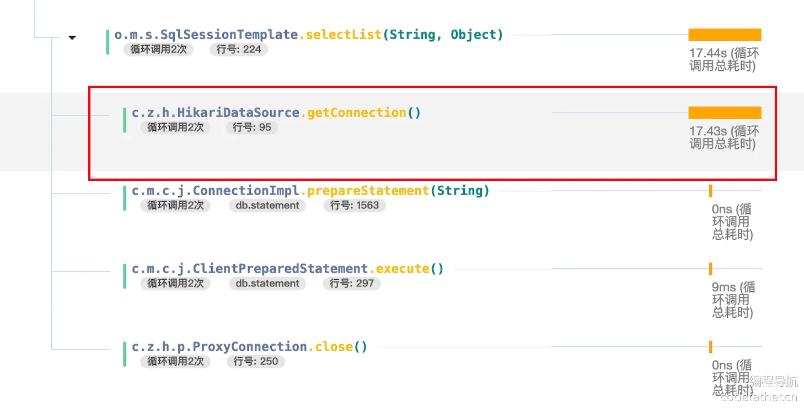

如何进行数据库连接池调优呢？肯定不是凭感觉猜测，而是要通过监控或测试进行分析。

所以本项目会带大家使用 Druid 来做数据库连接池，因为它提供了丰富的监控和管理功能，更适合学习上手数据库连接池调优。

##### 引入 Druid 连接池

可以参考 [官方文档](https://github.com/alibaba/druid/wiki) 引入（虽然也没什么好参考的）。

1）通过 Maven 引入 Druid，并且排除默认引入的 HikariCP：

```xml
<dependency>
    <groupId>com.alibaba</groupId>
    <artifactId>druid-spring-boot-starter</artifactId>
    <version>1.2.23</version>
</dependency>

<dependency>
    <groupId>org.mybatis.spring.boot</groupId>
    <artifactId>mybatis-spring-boot-starter</artifactId>
    <version>2.2.2</version>
    <exclusions>
        <!-- 排除默认的 HikariCP -->
        <exclusion>
            <groupId>com.zaxxer</groupId>
            <artifactId>HikariCP</artifactId>
        </exclusion>
    </exclusions>
</dependency>
```

2）修改 application.yml 文件配置。

由于参数较多，建议直接拷贝以下配置即可，部分参数可以根据注释自行调整：

```yaml
spring:
  # 数据源配置
  datasource:
    driver-class-name: com.mysql.cj.jdbc.Driver
    url: jdbc:mysql://localhost:3306/mianshiya
    username: root
    password: 123456
    # 指定数据源类型
    type: com.alibaba.druid.pool.DruidDataSource
    # Druid 配置
    druid:
      # 配置初始化大小、最小、最大
      initial-size: 10
      minIdle: 10
      max-active: 10
      # 配置获取连接等待超时的时间(单位：毫秒)
      max-wait: 60000
      # 配置间隔多久才进行一次检测，检测需要关闭的空闲连接，单位是毫秒
      time-between-eviction-runs-millis: 2000
      # 配置一个连接在池中最小生存的时间，单位是毫秒
      min-evictable-idle-time-millis: 600000
      max-evictable-idle-time-millis: 900000
      # 用来测试连接是否可用的SQL语句,默认值每种数据库都不相同,这是mysql
      validationQuery: select 1
      # 应用向连接池申请连接，并且testOnBorrow为false时，连接池将会判断连接是否处于空闲状态，如果是，则验证这条连接是否可用
      testWhileIdle: true
      # 如果为true，默认是false，应用向连接池申请连接时，连接池会判断这条连接是否是可用的
      testOnBorrow: false
      # 如果为true（默认false），当应用使用完连接，连接池回收连接的时候会判断该连接是否还可用
      testOnReturn: false
      # 是否缓存preparedStatement，也就是PSCache。PSCache对支持游标的数据库性能提升巨大，比如说oracle
      poolPreparedStatements: true
      # 要启用PSCache，必须配置大于0，当大于0时， poolPreparedStatements自动触发修改为true，
      # 在Druid中，不会存在Oracle下PSCache占用内存过多的问题，
      # 可以把这个数值配置大一些，比如说100
      maxOpenPreparedStatements: 20
      # 连接池中的minIdle数量以内的连接，空闲时间超过minEvictableIdleTimeMillis，则会执行keepAlive操作
      keepAlive: true
      # Spring 监控，利用aop 对指定接口的执行时间，jdbc数进行记录
      aop-patterns: "com.springboot.template.dao.*"
      ########### 启用内置过滤器（第一个 stat 必须，否则监控不到SQL）##########
      filters: stat,wall,log4j2
      # 自己配置监控统计拦截的filter
      filter:
        # 开启druiddatasource的状态监控
        stat:
          enabled: true
          db-type: mysql
          # 开启慢sql监控，超过2s 就认为是慢sql，记录到日志中
          log-slow-sql: true
          slow-sql-millis: 2000
        # 日志监控，使用slf4j 进行日志输出
        slf4j:
          enabled: true
          statement-log-error-enabled: true
          statement-create-after-log-enabled: false
          statement-close-after-log-enabled: false
          result-set-open-after-log-enabled: false
          result-set-close-after-log-enabled: false
      ########## 配置WebStatFilter，用于采集web关联监控的数据 ##########
      web-stat-filter:
        enabled: true                   # 启动 StatFilter
        url-pattern: /* # 过滤所有url
        exclusions: "*.js,*.gif,*.jpg,*.png,*.css,*.ico,/druid/*" # 排除一些不必要的url
        session-stat-enable: true       # 开启session统计功能
        session-stat-max-count: 1000 # session的最大个数,默认100
      ########## 配置StatViewServlet（监控页面），用于展示Druid的统计信息 ##########
      stat-view-servlet:
        enabled: true                   # 启用StatViewServlet
        url-pattern: /druid/* # 访问内置监控页面的路径，内置监控页面的首页是/druid/index.html
        reset-enable: false              # 不允许清空统计数据,重新计算
        login-username: root # 配置监控页面访问密码
        login-password: 123
        allow: 127.0.0.1 # 允许访问的地址，如果allow没有配置或者为空，则允许所有访问
        deny: # 拒绝访问的地址，deny优先于allow，如果在deny列表中，就算在allow列表中，也会被拒绝
```

3）启动后访问监控面板：http://localhost:8101/api/druid/index.html

输入上述配置中的用户名和密码登录：

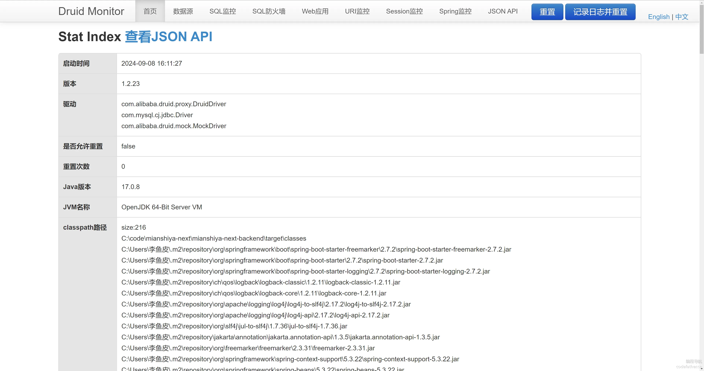

💡扩展知识：想去除底部广告，可以在项目中添加下面的代码：

```java
import com.alibaba.druid.spring.boot.autoconfigure.DruidDataSourceAutoConfigure;
import com.alibaba.druid.spring.boot.autoconfigure.properties.DruidStatProperties;
import com.alibaba.druid.util.Utils;
import org.springframework.boot.autoconfigure.AutoConfigureAfter;
import org.springframework.boot.autoconfigure.condition.ConditionalOnProperty;
import org.springframework.boot.autoconfigure.condition.ConditionalOnWebApplication;
import org.springframework.boot.web.servlet.FilterRegistrationBean;
import org.springframework.context.annotation.Bean;
import org.springframework.context.annotation.Configuration;

import javax.servlet.*;
import java.io.IOException;

@Configuration
@ConditionalOnWebApplication
@AutoConfigureAfter(DruidDataSourceAutoConfigure.class)
@ConditionalOnProperty(name = "spring.datasource.druid.stat-view-servlet.enabled",
        havingValue = "true", matchIfMissing = true)
public class RemoveDruidAdConfig {

    /**
     * 方法名: removeDruidAdFilterRegistrationBean
     * 方法描述 除去页面底部的广告
     * @param properties com.alibaba.druid.spring.boot.autoconfigure.properties.DruidStatProperties
     * @return org.springframework.boot.web.servlet.FilterRegistrationBean
     */
    @Bean
    public FilterRegistrationBean removeDruidAdFilterRegistrationBean(DruidStatProperties properties) {

        // 获取web监控页面的参数
        DruidStatProperties.StatViewServlet config = properties.getStatViewServlet();
        // 提取common.js的配置路径
        String pattern = config.getUrlPattern() != null ? config.getUrlPattern() : "/druid/*";
        String commonJsPattern = pattern.replaceAll("\\*", "js/common.js");

        final String filePath = "support/http/resources/js/common.js";

        //创建filter进行过滤
        Filter filter = new Filter() {
            @Override
            public void init(FilterConfig filterConfig) throws ServletException {}

            @Override
            public void doFilter(ServletRequest request, ServletResponse response, FilterChain chain) throws IOException, ServletException {
                chain.doFilter(request, response);
                // 重置缓冲区，响应头不会被重置
                response.resetBuffer();
                // 获取common.js
                String text = Utils.readFromResource(filePath);
                // 正则替换banner, 除去底部的广告信息
                text = text.replaceAll("<a.*?banner\"></a><br/>", "");
                text = text.replaceAll("powered.*?shrek.wang</a>", "");
                response.getWriter().write(text);
            }

            @Override
            public void destroy() {}
        };

        FilterRegistrationBean registrationBean = new FilterRegistrationBean();
        registrationBean.setFilter(filter);
        registrationBean.addUrlPatterns(commonJsPattern);
        return registrationBean;
    }
}
```

##### 使用 Druid 监控

下面我们测试一下因为数据库连接池不足导致的性能问题，并借此带大家熟悉 Druid 监控的使用。

1）将配置中的连接池大小改为 1，且获取连接等待时间超时为 2s：

```yaml
druid:
  # 配置初始化大小、最小、最大
  initial-size: 1
  minIdle: 1
  max-active: 1
  # 配置获取连接等待超时的时间(单位：毫秒)
  max-wait: 2000
```

然后任意执行一次对数据库的批量操作，比如插入 20 条数据，每批 2 条，一共 10 批，会随机报错：


查看 Druid 监控，可以看到最大并发为 1，因为连接池的连接数量只有 1：


除了 SQL 的监控，还有 URI 的监控，可以看到是哪个接口调用了数据库，执行了多少时间。以后出现线上数据库卡死的问题时，很快就能定位到是哪个接口、哪个 SQL 出现了问题（或者访问频率过高）。


💡 Druid 的 URI 监控是怎么实现的？

核心实现方法如下：

1. 通过基于 Servlet 的过滤器 `WebStatFilter` 来拦截请求，该过滤器会收集关于请求的相关信息，比如请求的 URI、执行时长、请求期间执行的 SQL 语句数等。
2. 统计 URI 和 SQL 执行情况是怎么关联起来的呢？ 每次执行 SQL 时，Druid 会在内部统计该 SQL 的执行情况，而 `WebStatFilter` 会把 SQL 执行信息与当前的 HTTP 请求 URI 关联起来。

2）将配置中的连接池大小改为 10，且获取连接等待时间超时为 2s：

```yaml
druid:
  # 配置初始化大小、最小、最大
  initial-size: 10
  minIdle: 10
  max-active: 10
  # 配置获取连接等待超时的时间(单位：毫秒)
  max-wait: 2000
```

可以看到，SQL 的并发直接变成了 10：


URI 接口调用的耗时，直接缩小的 10 倍，符合我们提升了 10 倍并发的优化情况：


有的时候，即使我们服务器 JVM 的内存和 CPU 占用都非常低，其他的中间件比如 MySQL 和 Redis 的占用也非常低，但系统依然会出现响应慢、卡死的情况。这可能就是因为一些配置错误，所以了解这些知识还是非常有必要的。

### **数据一致性**

#### 1、事务管理

我们目前已经使用了 `@Transactional(rollbackFor = Exception.class)` 来保证数据一致性。如果任意一步操作失败，整个事务会回滚，确保数据一致性。

#### 2、并发管理

在高并发场景下，如果多个管理员同时向同一个题库添加题目，可能会导致冲突或性能问题。为了解决并发问题，确保数据一致性和稳定性，可以有 2 种常见的策略：

1）增加 **分布式锁** 来防止同一个接口（或方法）在同一时间被多个管理员同时操作，比如使用 Redis + Redisson 实现分布式锁。

2）如果要精细地对某个数据进行并发控制，可以选用 **乐观锁**。比如通过给 `QuestionBank` 表增加一个 `version` 字段，在更新时检查版本号是否一致，确保对同一个题库的并发操作不会相互干扰。

伪代码示例：

```java
// 更新题库前，先查询版本号
QuestionBank questionBank = questionBankService.getById(questionBankId);
Long currentVersion = questionBank.getVersion();

// 更新时，检查版本号是否一致
int rowsAffected = questionBankService.updateVersionById(questionBankId, currentVersion);
if (rowsAffected == 0) {
    throw new BusinessException(ErrorCode.CONCURRENT_MODIFICATION, "数据已被其他用户修改");
}
```

💡 在 MySQL 中，还可以采用 `SELECT ... FOR UPDATE` 来强行锁定某一行数据，直到当前事务提交或回滚之前，防止其他事务对这行数据进行修改。

本项目中，由于关联表有唯一键约束，保证不会重复，所以不需要用这种方案。

### 可观测性

可观测性的关键在于以下三个方面：

1. 可见性：系统需要能够报告它的内部状态。这个优化方案通过返回 `BatchAddResult` 提供了丰富的状态反馈。
2. 追踪性：通过详细的错误原因和具体失败项，可以轻松地追踪问题源头。
3. 诊断性：明确的反馈信息有助于快速诊断问题，而不仅仅是提供一个简单的 "成功" 或 "失败"。

#### 1、日志记录

在高并发场景下，批量操作可能会出现一些难以预料的问题，建议多记录操作日志：包括成功、失败的题目，便于排查问题。

比如：

```java
log.error("数据库唯一键冲突或违反其他完整性约束, 错误信息: {}", e.getMessage());
```

#### 2、监控

监控是实现可观测性的主流手段，你可以对服务器、JVM、请求、以及项目中引入的各种组件进行监控。

常用的监控工具有 Grafana，如果你给项目引入了某个技术组件，一般都会自带监控，比如项目调用数据库的情况可以通过 Druid 监控、Elasticsearch 可以通过 Kibana 监控等等、Spring Boot 内置了 Spring Boot Actuator 来监控应用运行状态等。

💡 如果你使用的是第三方云服务，比如 XX 云的云数据库，一般都会自带成熟的监控面板，有时间建议大家多去逛逛云服务平台，能看到很多业界成熟的监控方案。

#### 3、返回值优化

目前我们的方法返回的是 `void`，这意味着在执行过程中没有明确反馈操作的结果。为了提升可观测性，我们可以根据任务的执行状态返回更加详细的结果，帮助调用者了解任务的执行情况。

可以定义一个返回结果对象，包含每个题目的处理状态、成功和失败的数量，以及失败的原因。

```java
public class BatchAddResult {
    private int total;
    private int successCount;
    private int failureCount;
    private List<String> failureReasons;
}
```

在批量操作中出现问题时，可以不抛出异常并中断其他的操作，只是记录部分失败的操作情况。这样一来，管理员可以知道哪些题目操作成功、哪些失败，更好地进行后续处理。

以下为示例代码：

```java
public BatchAddResult batchAddQuestionsToBank(List<Long> questionIdList, Long questionBankId, User loginUser) {
    BatchAddResult result = new BatchAddResult();
    result.setTotal(questionIdList.size());

    // 执行批量插入逻辑
    for (Long questionId : questionIdList) {
        try {
            // 插入操作
            saveQuestionToBank(questionId, questionBankId, loginUser);
            result.setSuccessCount(result.getSuccessCount() + 1);
        } catch (Exception e) {
            result.setFailureCount(result.getFailureCount() + 1);
            result.getFailureReasons().add("题目ID " + questionId + " 插入失败：" + e.getMessage());
        }
    }

    return result; // 返回批量处理的结果
}
```

------

OK，学到了这么多优化方法，大家可以自己根据情况选用。

## 扩展

1）按照上述优化方法，自主完善管理员批处理操作接口。

2）可以通过 Apache JMeter 压测一下使用并发编程后的性能提升效果。

## 三、自动缓存热门题库

### 需求分析

对于线上项目，用户的访问量日益增长，对系统性能和稳定性的要求也越来越高。

对于我们的面试刷题平台，为了减少用户加载网页和题目的时间，可以对经常访问的数据（比如首页数据和题目）进行缓存，而不是每次都从数据库进行查询。

常用的缓存就是分布式缓存 Redis 和本地缓存 Caffeine（适用于 Java 项目），由于它们将数据存储在内存中，读写效率都比数据库更高，能够让系统支持更大的并发，并且减小数据库的压力。

相信很多同学之前学过 Redis 缓存，[编程导航的伙伴匹配系统](https://www.code-nav.cn/course) 等项目中有过讲解。

但是，怎么知道哪些数据该缓存呢？

对于我们的面试刷题平台，鱼皮推广的时候可能会重点宣传某一个题库或题目，大家可以直接点链接进入特定的内容，这个内容就会成为 **热点数据** 。我们如果能够预判到热点数据，可以提前人工给数据加缓存，也就是 **缓存预热** 。

但是有些时候，我们无法预料到哪些数据是热点。如果某个数据没来得及缓存，突然被大量访问，系统不就故障了么？

这里我们就要引出一个新的概念：热点问题。

很多企业级项目都会有热点问题，例如微博，一个明星出了某些花边新闻，那么这条微博就会成为热点，此时系统需要 **自动发现** 这个热点，将其做多级缓存来顶住大流量访问的压力。

面试刷题平台场景也有热点问题，例如默认面试题都是从数据库访问，如果一道面试题访问的频率特别高（可能是被其他人推广、也可能是被攻击了），此时可以将其自动缓存在本地或者 Redis 中，提高访问性能的同时，降低数据库的压力，也减轻后端服务的压力。

为什么需要 **自动发现** 热点？

因为热点的瞬时流量大，需要及时发现与缓存。如果靠人为来手动设置，可能刚打开后台页面，系统就已经崩溃了，一般要求秒级发现热点且自动缓存。

------

那么回归到本项目的需求，我们希望自动为频繁访问的题库增加缓存。

具体的规则是：对于获取题库详情的请求，如果 5 秒内访问 >= 10 次，就要使用本地缓存将题库详情缓存 10 分钟，之后都从本地缓存读取。

### 方案设计

自动缓存热门题库需要以下五个步骤：

1、记录访问：用户每访问一次题库，统计次数 +1

2、访问统计：统计一段时间内题库的访问次数。**这是最难实现的一部分。**

3、阈值判断：访问频率超过一定的阈值，变为热点数据。

4、缓存数据：缓存热点数据

5、获取数据：后续访问时，从缓存中获取数据

当然，还有很多注意事项，比如热点数据如何更新？如何恢复为正常数据等等。

让你自己实现的话，你能搞定么？

反正我是不太行，或者说完全没必要自己实现。本期我们不自己重复造轮子，而是基于一个企业级热点 key 探测框架 `京东 hotkey` 来实现自动缓存热门题库。

### hotkey 入门

京东提供了一个轻量级通用的热 key 探测中间件 [hotkey](https://gitee.com/jd-platform-opensource/hotkey)。

根据官方仓库描述：hotkey 是京东APP后台热数据探测框架，历经多次高压压测和京东 618、双 11 大促考验。

在上线运行的这段时间内，**每天探测的 key 数量数十亿计**，精准捕获了大量爬虫、刷子用户，另准确探测大量热门商品并毫秒级推送到各个服务端内存，大幅降低了热数据对数据层的查询压力，提升了应用性能。**在大促期间，hotkey 的 worker 集群秒级吞吐量达到 1500 万级别。**

根据官方压测：一台 8 核 8G 的机器，每秒可以处理来自于数千台服务器发来的高达 16 万个的待测 key，8 核单机吞吐量在 16 万，16 核机器每秒可达 30 万以上探测量，所以仅采用 10 台机器，即可完成每秒近 300 万次的 key 探测任务。

这是一个真正经历过实战的高性能热点 key 探测框架，整体架构如下：


#### 核心组件

它的主要核心组件如下：

1）Etcd 集群

Etcd 作为一个高性能的配置中心，可以以极小的资源占用，提供高效的监听订阅服务。主要用于存放规则配置，各 worker 的 ip 地址，以及探测出的热 key、手工添加的热 key 等。

Etcd 常用于配置中心和注册中心，鱼皮在 [编程导航的手写 RPC 项目](https://www.code-nav.cn/course/1768543954720022530) 中讲解过。

2）client 端 jar 包

就是在服务中添加的引用 jar，引入后，就可以便捷地去判断某 key 是否热 key。同时，该 jar 完成了 key 上报、监听 Etcd 里的 rule 变化、worker 信息变化、热 key 变化，对热 key 进行本地 Caffeine 缓存等。

3）worker 端集群

worker 端是一个独立部署的 Java 程序，启动后会连接 Etcd，并定期上报自己的 ip 信息，供 client 端获取地址并进行长连接。之后，主要就是对各个 client 发来的待测 key 进行 **累加计算**，当达到 Etcd 里设定的 rule 阈值后，将热 key 推送到各个 client。

4）dashboard 控制台

控制台是一个带可视化界面的 Java 程序，也是连接到 Etcd，之后在控制台设置各个 APP 的 key 规则，譬如 2 秒出现 20 次算热 key。然后当 worker 探测出来热 key 后，会将 key 发往 etcd，dashboard 也会监听热 key 信息，进行入库保存记录。同时，dashboard 也可以手工添加、删除热 key，供各个 client 端监听。

更详细的内容，可见京东技术团队 [官方的文章](https://mp.weixin.qq.com/s/xOzEj5HtCeh_ezHDPHw6Jw)，最具可信度。

### 后端开发（hotkey 实战）

hotkey 搭建可以直接参考 [官方的安装教程](https://gitee.com/jd-platform-opensource/hotkey#安装教程)。

#### 1、安装 Etcd

直接从[ github](https://github.com/etcd-io/etcd/releases) 上下载最新版本的 Etcd 即可，选择对应的操作系统版本：


或直接通过本教程提供的软件包下载：https://pan.baidu.com/s/1u73-Nlolrs8Rzb1_b6X6HA

提取码：c2sd

下载后解压压缩包，会得到 3 个脚本：

- etcd：etcd 服务本身
- etcdctl：客户端，用于操作 etcd，比如读写数据
- etcdutl：备份恢复工具


执行 etcd 脚本后，可以启动 etcd 服务，服务默认占用 2379 和 2380 端口，作用分别如下：

- 2379：提供 HTTP API 服务，和 etcdctl 交互
- 2380：集群中节点间通讯


#### 2、安装 hotkey worker

从 [hotkey 官方仓库](https://gitee.com/jd-platform-opensource/hotkey) 下载源码，注意，本教程使用的是 hotkey v0.0.4 版本，**JDK 的版本必须小于 17！否则会报找不到类的错误！**

项目导入 IDEA 后，打开 worker 模块。worker 是一个 Spring Boot 项目，启动前需要先修改 applicaiton.yml 中的配置。比如端口配置（本教程使用 8111）：

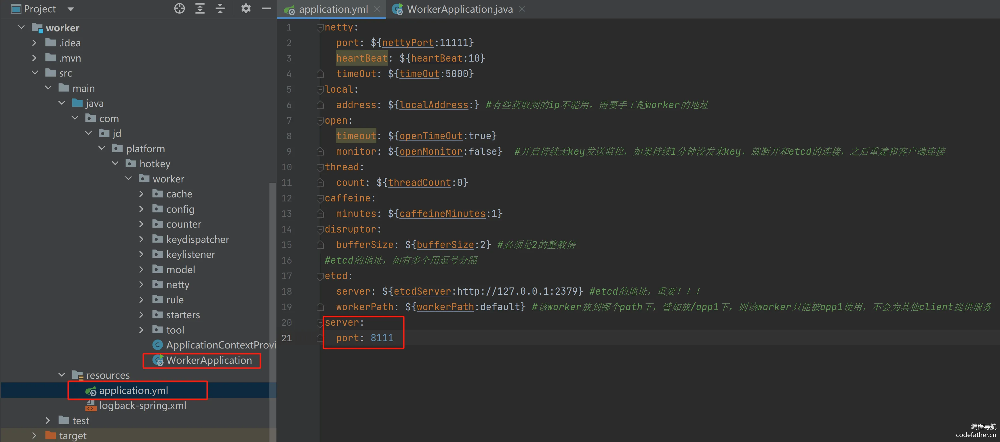

修改完配置后，直接点击 WorkerApplication 启动即可。

如下图，此时 worker 就已经正常启动，并且连接上 Etcd 了：


后续如果要打包部署，可以通过 Maven 打包得到 worker 的 jar 包，比如在整个 hotkey 项目根目录执行 mvn package，会依次对各模块打包。

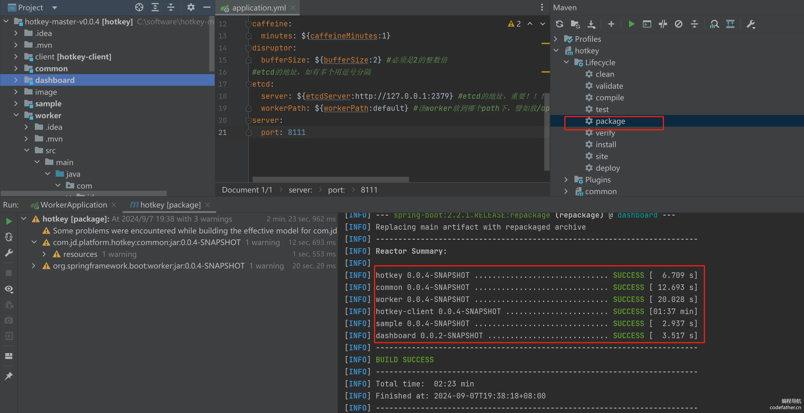

也可以直接下载已经打包好的 jar，本教程为大家提供了软件包：https://pan.baidu.com/s/1u73-Nlolrs8Rzb1_b6X6HA ，提取码：c2sd

然后可以通过命令启动 worker，可以携带参数来修改配置：

```shell
java -jar worker-0.0.4-SNAPSHOT.jar --etcd.server=127.0.0.1:2379
```

#### 3、启动 hotkey 控制台

接着打开 dashboard 项目，执行 resource 目录下的 db.sql 文件，创建 dashboard 所需的库表。hotkey 依赖 MySQL 来存储用户账号信息、热点阈值规则等。

在执行脚本前，记得先配置好 MySQL 连接，并且在 SQL 脚本文件中创建和指定数据库：

```sql
create database hotkey_db;
use hotkey_db;
```

执行脚本过程如图：


从 db.sql 中可以看到内置了 admin 账号， 密码为 123456


然后修改下 application.yml 配置文件，包括 dashboard 占用端口号（本教程使用 8121）、数据库配置和 etcdServer 地址等：

```yaml
server:
  port: 8121
spring:
  datasource:
    username: ${MYSQL_USER:root}
    password: ${MYSQL_PASS:123456}
    url: jdbc:mysql://${MYSQL_HOST:localhost}:3306/hotkey_db?useUnicode=true&characterEncoding=utf-8&useSSL=true&serverTimezone=UTC&useTimezone=true&serverTimezone=GMT
    driver-class-name: com.mysql.cj.jdbc.Driver
etcd:
  server: ${etcdServer:http://127.0.0.1:2379}
```

dashboard 也是一个 SpringBoot 项目，直接在 IDEA 内执行 DashboardApplication 启动即可。

访问 [http://127.0.0.1:8121，即可看到界面：](http://127.0.0.1:8121，即可看到界面：/)


输入管理员的账号密码（admin，123456）后，即可成功登录：

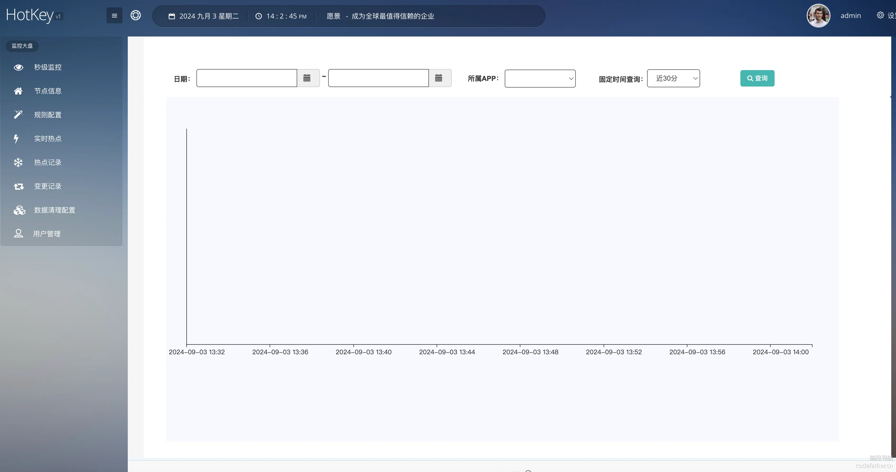

初次使用时需要先添加 APP。建议先在用户管理菜单中，添加一个新用户，设置昵称为 APP 名称、并填写所属 APP，如 mianshiya，密码此处就设置为 123456。之后就可以登录这个新建的用户来给应用设置规则了 (当然也可以使用 admin 账户添加)，而且系统会自动创建一个 APP。


随后，在规则配置中，选择对应的 APP，新增对应的热点探测规则：


如下图就是一组规则：

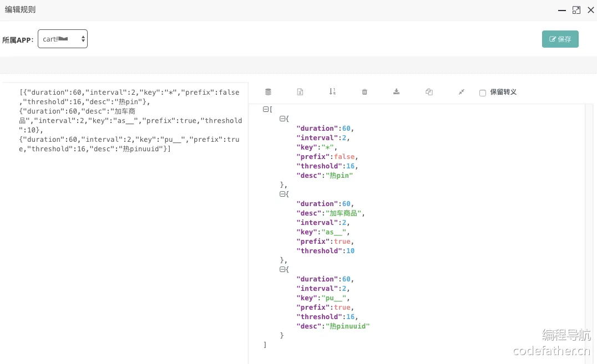

我们解析下其中的第二条 rule： as__ 开头的热 key 的规则就是 interval-2 秒内出现了 threshold-10 次就认为它是热 key，它就会被推送到 jvm 内存中，并缓存 60 秒，prefix-true 代表前缀匹配。那么在应用中，就可以把一组 key，都用 as__ 开头，用来探测。

#### 4、引入 hotkey client

有 2 种引入 hotkey client 的方式：

1. 手动源码打包
2. 通过 [Maven 远程仓库](https://mvnrepository.com/artifact/io.github.ck-jesse/jd-hotkey-client) 引入

由于 Maven 远程仓库的包引用量过少，而且不具备官方权威性，所以更推荐通过 hotkey 源码手动打包。（经过鱼皮踩坑测试，果然引入远程仓库的包后出现了客户端和 worker 之间心跳失败的问题）

所以选择方式 1，手动将 hotkey 源码中的 client 模块通过 Maven 打成 jar 包：

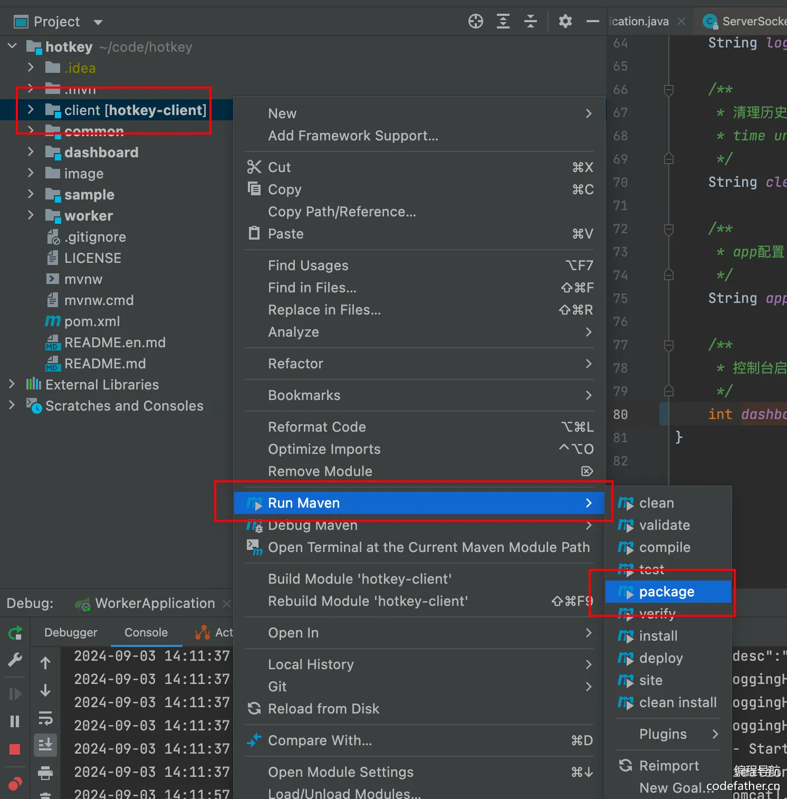

从生成的 target 中找到 `with-dependencies` 的 jar 包，可以修改名称为 `hotkey-client-0.0.4-SNAPSHOT.jar`：


也可以直接下载已经打包好的 jar，本教程为大家提供了软件包：https://pan.baidu.com/s/1u73-Nlolrs8Rzb1_b6X6HA ，提取码：c2sd

接着在要引入 hotkey client 的项目中创建 lib 文件夹，放入 client 的 jar 包。注意要把该 jar 包添加到 Git 仓库中，否则其他人无法正常运行你的项目。


然后通过 Maven 引入即可：

```xml
<dependency>
  <artifactId>hotkey-client</artifactId>
  <groupId>com.jd.platform.hotkey</groupId>
  <version>0.0.4-SNAPSHOT</version>
  <scope>system</scope>
  <systemPath>${project.basedir}/lib/hotkey-client-0.0.4-SNAPSHOT.jar</systemPath>
</dependency>
```

但是在本项目中引入该依赖后，项目无法运行，因为 Hutool 依赖库版本冲突了。

💡 注意，使用 `system` 作用域并不是最佳实践，原因是 `system` 作用域的依赖具有 **最高优先级**。它会跳过 Maven 的依赖解析机制，直接使用你指定的本地 JAR 文件，因此它的优先级会高于其他任何来自依赖树中的传递依赖或外层依赖声明。

具体来说：

1. 跳过依赖管理：`system` 作用域会跳过 Maven 的依赖管理和版本解析。你必须手动管理依赖版本和路径，Maven 无法帮你解析冲突、升级版本或使用传递依赖。
2. 无法排除依赖：由于 `system` 作用域是强制性的，任何试图通过 `exclusions` 排除这个依赖的尝试都会失败。其他模块或依赖项中的冲突问题也无法通过正常的 `dependencyManagement` 或 `exclusions` 机制来解决。
3. 不可传递：`system` 作用域的依赖不会传递给其他模块。也就是说，如果你的项目被其他项目依赖，`system` 作用域的依赖不会自动传递给依赖你的项目。这可能导致构建或运行时的依赖问题。
4. 路径硬编码：`system` 作用域的依赖路径是硬编码的，并且指定为本地文件系统的绝对路径或相对路径。这使得项目在不同开发环境中变得难以移植，也不符合 Maven 的通用依赖管理原则。

所以一般建议将依赖包通过 Maven 安装（install）到本地仓库，或者上传包到 Maven 官方库，或者在团队内部使用 Maven 私服来管理依赖。

但这里我们不这么做，考虑到教程项目，要让开发者更容易地使用项目。所以还是直接拷贝 jar，开发者就不用自己 mvn install 来安装包了，否则还可能出现报错。

其实还有更粗暴的方法，直接爆改源码中使用的 hutool 版本，但是一般不建议这么做，毕竟你不了解别人的项目，还是该自己的方便一些。

所以我们的做法是，降低项目的 hutool 版本，改动点也不多，所以还好。

比如：

```java
if (StrUtil.isNotBlank(tagsStr)) {
    questionEsDTO.setTags(JSONUtil.toList(JSONUtil.parseArray(tagsStr), String.class));
}
String fileSuffix = FileNameUtil.getSuffix(multipartFile.getOriginalFilename());
```

引入依赖后，在代码中编写初始化 client 的配置类，会读取配置文件并执行初始化逻辑：

```java
@Configuration
@ConfigurationProperties(prefix = "hotkey")
@Data
public class HotKeyConfig {

    /**
     * Etcd 服务器完整地址
     */
    private String etcdServer = "http://127.0.0.1:2379";

    /**
     * 应用名称
     */
    private String appName = "app";

    /**
     * 本地缓存最大数量
     */
    private int caffeineSize = 10000;

    /**
     * 批量推送 key 的间隔时间
     */
    private long pushPeriod = 1000L;

    /**
     * 初始化 hotkey
     */
    @Bean
    public void initHotkey() {
        ClientStarter.Builder builder = new ClientStarter.Builder();
        ClientStarter starter = builder.setAppName(appName)
                .setCaffeineSize(caffeineSize)
                .setPushPeriod(pushPeriod)
                .setEtcdServer(etcdServer)
                .build();
        starter.startPipeline();
    }
}
```

💡 如何在 Spring Boot 启动时执行初始化代码？可以参考这道面试题：https://www.mianshiya.com/question/1800329866123747329

更改 application.yml 配置，注意应用名称必须和控制台创建的一致：

```yaml
# 热 key 探测
hotkey:
  app-name: mianshiya
  caffeine-size: 10000
  push-period: 1000
  etcd-server: http://localhost:2379
```

启动，能够看到 1 个客户端连接：

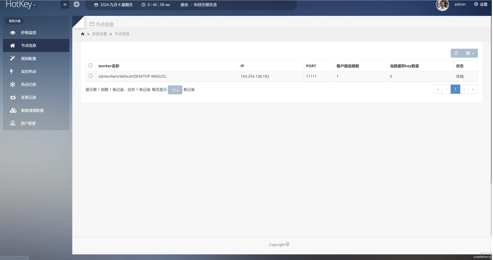

这样在项目中就能正常使用了。

#### 5、了解开发模式

只要使用 JdHotKeyStore 这个类即可非常方便地判断 key 是否成为热点和获取热点 key 对应的本地缓存。

这个类主要有如下 4 个方法可供使用：

```java
boolean JdHotKeyStore.isHotKey(String key)
Object JdHotKeyStore.get(String key)
void JdHotKeyStore.smartSet(String key, Object value)
Object JdHotKeyStore.getValue(String key)
```

1）boolean isHotKey(String key)

该方法会返回该 key 是否是热 key，如果是返回 true，如果不是返回 false，并且会将 key 上报到探测集群进行数量计算。该方法通常用于判断只需要判断 key 是否热、不需要缓存 value 的场景，如刷子用户、接口访问频率等。

2）Object get(String key)

该方法返回该 key 本地缓存的 value 值，可用于判断是热 key 后，再去获取本地缓存的 value 值，通常用于 redis 热 key 缓存。

3）void smartSet(String key, Object value)

方法给热 key 赋值 value，如果是热 key，该方法才会赋值，非热 key，什么也不做

4）Object getValue(String key)

该方法是一个整合方法，相当于 isHotKey 和 get 两个方法的整合，该方法直接返回本地缓存的 value。 如果是热 key，则存在两种情况

1. 是返回 value
2. 是返回 null

返回 null 是因为尚未给它 set 真正的 value，返回非 null 说明已经调用过 set 方法了，本地缓存 value 有值了。 如果不是热 key，则返回 null，并且将 key 上报到探测集群进行数量探测。

**官方推荐的最佳实践**

1）判断用户是否是刷子：

```java
if (JdHotKeyStore.isHotKey(“pin__” + thePin)) {
    // 进行限流
}
```

2）判断商品 id 是否是热点：

```java
Object skuInfo = JdHotKeyStore.getValue("skuId__" + skuId);
if(skuInfo == null) {
    JdHotKeyStore.smartSet("skuId__" + skuId, theSkuInfo);
} else {
    // 使用缓存好的 value 即可
}
```

个人更推荐这种写法，更加清晰：

```java
if (JdHotKeyStore.isHotKey(key)) {
    //注意是get，不是getValue。getValue会获取并上报，get是纯粹的本地获取
    Object skuInfo = JdHotKeyStore.get("skuId__" + skuId);
    if(skuInfo == null) {
        JdHotKeyStore.smartSet("skuId__" + skuId, theSkuInfo);
    } else {
        //使用缓存好的value即可
    }
}
```

#### 6、配置 hotkey 规则

根据我们的需求，判断 `bank_detail_` 开头的 key，如果 5 秒访问 10 次，就会被推送到 jvm 内存中，将这个热 key 缓存 10 分钟。

对应的规则配置如下：

```json
[
    {
        "duration": 600,
        "key": "bank_detail_",
        "prefix": true,
        "interval": 5,
        "threshold": 10,
        "desc": "热门题库缓存"
    }
]
```

在控制台新增规则：


#### 7、项目应用 hotkey

获取题库接口 getQuestionBankVOById，先通过 isHotKey 判断当前题目是否是热点题目，如果是，则从数据库获取后放入本地缓存；之后直接从本地缓存获取即可。

```java
@GetMapping("/get/vo")
public BaseResponse<QuestionBankVO> getQuestionBankVOById(QuestionBankQueryRequest questionBankQueryRequest, HttpServletRequest request) {
    ThrowUtils.throwIf(questionBankQueryRequest == null, ErrorCode.PARAMS_ERROR);
    Long id = questionBankQueryRequest.getId();
    ThrowUtils.throwIf(id <= 0, ErrorCode.PARAMS_ERROR);

    // 生成 key
    String key = "bank_detail_" + id;
    // 如果是热 key
    if (JdHotKeyStore.isHotKey(key)) {
        // 从本地缓存中获取缓存值
        Object cachedQuestionBankVO = JdHotKeyStore.get(key);
        if (cachedQuestionBankVO != null) {
            // 如果缓存中有值，直接返回缓存的值
            return ResultUtils.success((QuestionBankVO) cachedQuestionBankVO);
        }
    }

    // 原本查询数据的逻辑（查数据库）

    // 设置本地缓存
    JdHotKeyStore.smartSet(key, questionBankVO);
    
    // 获取封装类
    return ResultUtils.success(questionBankVO);
}
```

#### 8、测试验证

不设置规则的话，是不会判断为热 key 的：


通过接口文档 5 秒内先访问 10 次，能够看到实时热点：

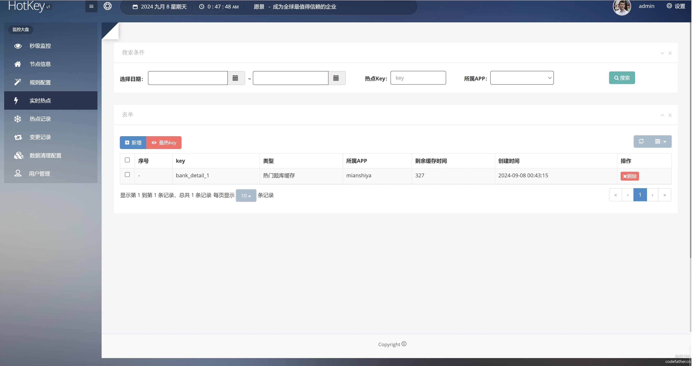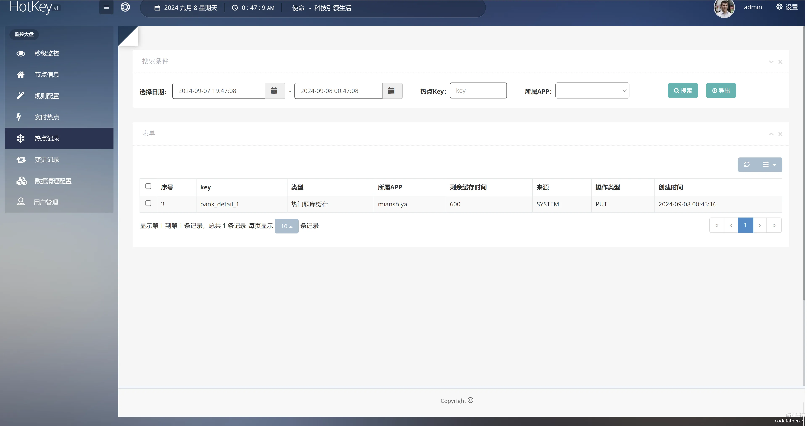

debug 程序，第 11 次请求的时候虽然会判断为 hotkey，但还是不会走缓存，本次请求会设置缓存。后续就能查询缓存了。

### 扩展知识

#### 1、如何更新本地缓存

需要有一个入口让缓存失效，进行人工干预。

hotkey 提供了 `JdHotKeyStore.remove()` 方法，可以手动删除本地缓存并移除热点 key。

还可以利用控制台手动删除：


不过一般情况下，热点信息一般都是不太会变更的数据，过期时间设置短一点即可。

#### 2、是否能够和 redis 分布式缓存结合？

当然可以，热 key 探测 = 热 key 发现 + 本地缓存。可以只利用热 key 的判断方法，不利用热 key 的存储方法即可。

1. 不是热 key，就查数据库。对于热 key，写缓存时，再判断一下是否为热 key，是热 key 才设置 Redis 分布式缓存。后续的热 key 就可以从分布式缓存中获取值。（缓存存储的技术或者位置变了）
2. 利用热 key 探测的本地缓存，将原本查数据库的逻辑改为查 Redis，Redis 查不到才查询数据库，形成多级缓存。（获取原始数据的方法改变了）

#### 3、热 key 会自动续期么？否则可能出现缓存雪崩的问题？

可以先自己测试一下。比如针对某个热点 key 再多次发送请求查询缓存，发现在热 key 生效（缓存生效）期间，如果该 key 仍然被不断访问，并不会刷新缓存时间，直到过期。

然后看下源码，就知道为什么了。源码中的逻辑是，如果已经是热 key 则不会再 push，离过期还有 2 秒内的时候，会再次 push，这样这个 key 可能被继续设置为热 key。

```java
public static boolean isHotKey(String key) {
    try {
        if (!inRule(key)) {
            return false;
        } else {
            boolean isHot = isHot(key);
            if (!isHot) {
                HotKeyPusher.push(key, (KeyType)null);
            } else {
                ValueModel valueModel = getValueSimple(key);
                if (isNearExpire(valueModel)) {
                    HotKeyPusher.push(key, (KeyType)null);
                }
            }

            KeyHandlerFactory.getCounter().collect(new KeyHotModel(key, isHot));
            return isHot;
        }
    } catch (Exception var3) {
        return false;
    }
}

private static boolean isNearExpire(ValueModel valueModel) {
    if (valueModel == null) {
        return true;
    } else {
        return valueModel.getCreateTime() + (long)valueModel.getDuration() - System.currentTimeMillis() <= 2000L;
    }
}
```

也就是说，如果一个 key 持续被访问，很有可能在过期前一直被设置为热点，减少了出现雪崩问题的可能性。

### 扩展

1）热点题目增加自动缓存

思路：跟本教程演示的热点题库完全一致。

2）编写一个注解，自动对该方法进行热 key 探测，并将返回值作为本地缓存

思路：参考 Spring Data Redis 提供的 @Cacheable 注解，可以利用 AOP 扫描注解实现。