## 本节重点

流量安全性优化

- 网站流量控制和熔断（基于 Sentinel）
- 动态 IP 黑白名单过滤（基于 Nacos）

## 一、网站流量控制和熔断

流量安全优化的目标可以简单概括为：确保数据在传输过程中的机密性、完整性和可用性，防止未经授权的访问、篡改、泄露和攻击，同时提升网络传输效率与性能。

而从流量控制和熔断的角度来看，流量安全优化的目标又可以概括为：防止系统过载、保障服务可用性、抵御恶意流量，并确保系统能够快速从故障中恢复。这也是本期教程中我们追求的目标。

### 核心概念

随着网站的发展，用户量逐渐增大，特别是互联网公司，用户量更是呈指数型增长，此时一旦出现促销活动，网站的流量会大大超越平均水平，在高并发请求下系统很可能会崩溃。

对应到我们的面试刷题平台，在金三银四或金九银十面试高峰期，网站流量会变大，还可能会有各种爬虫和恶意攻击。为了避免系统崩溃和保护服务稳定性，我们需要对网站做一定的防护措施。

常见的防护措施就是 **流量控制**：限制系统进入的请求数量，防止过载。

除此之外，为了进一步隔离和保护系统，防止某些组件异常时影响系统的稳定性，还会采用 **熔断机制 + 降级策略** 进行兜底处理，提升系统的健壮性和可用性。

下面分别对流量控制、熔断和降级进行解释：

#### 1、流量控制

流量控制是为了 **防止系统被过多的请求压垮**，确保资源合理分配并保持服务的可用性，比如对请求数量的限制。

流量控制的 3 个主要优势：

1. 防止过载：当瞬间涌入的请求量超出系统处理能力时，会导致资源枯竭，如 CPU 和内存耗尽。流量控制通过限制系统能处理的请求数，确保不会发生过载。
2. 避免雪崩效应：高负载下某个服务崩溃可能引发其他依赖服务的崩溃，形成连锁反应。流量控制可以有效预防这种连锁故障，避免系统雪崩。
3. 优化用户体验：即便部分请求被拒绝或延迟处理，流量控制也能确保大部分用户的请求能够正常响应，避免全局响应时间过长的情况。

常见的实现流量控制方法有 2 种：

- 限流：通过固定窗口、令牌桶或漏桶等算法限制单位时间内的请求数量。
- 排队：当请求量超出处理能力时，部分请求进入等待队列，防止立即超载。

如果大家使用过一些云服务，会更容易理解流量控制，主要有以下常见的流量控制类型：

1）请求频率限制：限制单位时间内单用户、单 IP 的请求数（如每秒最多 100 次请求）。


2）带宽限制：控制访问系统时消耗的带宽量或者下载速度。


3）总流量限制：限制用户或系统整体的数据传输量。


4）细粒度控制：根据接口、用户等特定维度进行组合限流。比如限制访问特定接口时，每个用户每分钟只能访问 60 次。

#### 2、熔断机制

可以参考：https://sentinelguard.io/zh-cn/docs/circuit-breaking.html

熔断机制的目的是 **避免当下游服务发生异常时，整个系统继续耗费资源重复发起失败请求**，从而防止连锁故障。

这类似于电路中的断路器，当检测到异常情况时，熔断器会自动切断对故障服务的调用，防止问题扩大。

工作机制：

1. 监控服务健康状态：系统会实时监控服务的调用情况，例如请求成功率、响应时间等，判断服务的健康状况。
2. 进入熔断状态：当某个服务的错误率达到设定阈值（如响应时间过长或出错率过高）时，系统会 **激活熔断器**，暂时停止对该服务的调用，避免消耗不必要的资源和让错误进一步扩散。
3. 快速失败：在熔断状态下，系统不会再等待超时，而是直接返回失败响应，减少系统资源占用，并避免因长时间等待导致用户体验的恶化。（也可以降级处理）
4. 熔断恢复机制：熔断并非永久状态。在一段时间后，熔断器会进入 **半开状态**，允许少量请求测试服务的健康情况。如果恢复正常，熔断器将关闭，恢复正常服务调用；如果仍有问题，则继续保持熔断。

熔断流程：

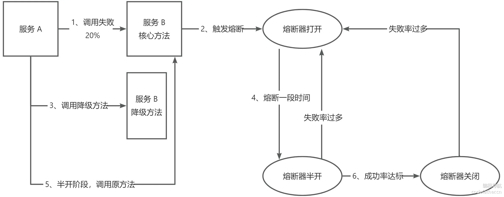

举个例子，一个支付服务由于高负载频繁超时，此时熔断器会检测到支付服务的健康状况恶化，暂时切断对它的调用，防止前端系统继续发出请求。如果不采取熔断措施，支付服务的异常可能会拖垮整个系统，甚至影响其他依赖的服务模块或系统资源（比如请求连接）。

#### 3、降级机制

降级的目的是在某个服务的响应能力下降、或该服务不可用时，提供简化版的功能或返回默认值作为 **兜底**，保持系统的部分功能可用，确保用户体验的连续性，避免系统频繁报错。

降级可以是手动配置，也可以根据系统负载自动触发。系统可能由于多种原因（如高负载、外部依赖不可用等）触发降级，返回简化的响应或默认值。

降级机制的好处：

1. 优雅地处理故障：在降级状态下，系统不会直接返回错误信息，而是提供一个替代方案。例如，某个数据查询服务不可用时，系统可以返回缓存数据，确保用户看到的是有效信息，而非错误页面。
2. 降低服务压力：降级有助于减轻系统对非核心服务的依赖，确保核心功能的稳定运行。例如，当推荐系统或广告服务出现故障时，降级可以减少对这些服务的调用，保护系统的整体稳定性。

举个例子，在一个电商网站上，如果商品推荐系统由于外部服务故障无法正常运行，可以触发降级机制，显示一组静态的推荐商品列表。这确保用户仍然能够顺利浏览商品页面，而不是直接看到错误信息。

是不是有点 try...catch... 的感觉？但降级这个概念显然比异常处理要更“高大上”一些，不一定是出了异常才降级，响应较慢或者受到其他服务影响可能也会触发降级。

#### 4、熔断和降级的区别

初学者很容易把这两个概念搞混，二者是完全不同的概念，只不过经常结合使用罢了。

熔断不一定要降级，只是切断调用；降级也不一定需要熔断，单次调用失败也可以降级（比如数据库查询失败返回内存的数据）。

具体来说：

- 熔断是当服务健康状况恶化时，通过 **切断调用** 避免系统资源浪费或服务间故障扩散。
- 降级是在系统压力过大或某个服务不可用时，通过 **提供简化的替代方案** ，保持系统的可用性和用户体验。

两者经常结合使用，先触发熔断后再进行降级。

#### 扩展知识 - 有损服务

有损服务指的是在系统资源有限或负载较高的情况下，系统 **有意识地** 舍弃部分非核心服务或数据，来保证系统整体的稳定性和核心功能的可用性。简单来说，就是“丢车保帅”。

举些例子：

- 视频流媒体：在网络带宽不足时，流媒体平台会动态降低视频质量（如从高清降到标清），以避免中断视频播放。这就是典型的“有损”策略，牺牲画质来保证视频的流畅播放。
- 实时数据采集：在高并发环境下，系统可以通过丢弃部分非重要的日志或监控数据，减少数据处理压力，优先保证核心业务流程。

什么时候使用有损服务和降级？

- 有损服务：适用于需要在性能和质量之间做出平衡的场景，特别是 **当系统资源不足** 时，选择牺牲某些服务的质量来保证整体稳定。
- 降级：适用于需要保证系统核心功能在高负载或部分服务不可用的情况下仍能继续提供的场景。降级更多是 **在功能层面进行简化** ，而非直接丢弃数据或服务。

可以这么理解：有损服务更倾向于 **整体视角** 上资源的取舍，降级更倾向于保证 **某个功能** 的可用。

### 需求分析（限流熔断规则）

回归到本项目的具体需求：要对什么资源进行限流熔断？规则是怎么样的？

我们来完成两个有代表性的需求：

1. 对单个接口整体限流
2. 对单个 IP 访问单个接口限流

#### 1、查看题库列表接口限流熔断

资源：listQuestionBankVOByPage 接口

目的：控制对耗时较长的、经常访问的接口的请求频率，防止过多请求导致系统过载。

限流规则：

- 策略：整个接口每秒钟不超过 10 次请求
- 阻塞操作：提示“系统压力过大，请耐心等待”

熔断规则：

- 熔断条件：如果接口异常率超过 10%，或者慢调用（响应时长 > 3 秒）的比例大于 20%，触发 60 秒熔断。
- 熔断操作：直接返回本地数据（缓存或空数据）

#### **2、单 IP 查看题目列表限流熔断**

资源：listQuestionVoByPage 接口

限流规则：

- 策略：每个 IP 地址每分钟允许查看题目列表的次数不能超过 60 次。
- 阻塞操作：提示“访问过于频繁，请稍后再试”

熔断规则：

- 熔断条件：如果接口异常率超过 10%，或者慢调用（响应时长 > 3 秒）的比例大于 20%，触发 60 秒熔断。
- 熔断操作：直接返回本地数据（缓存或空数据）

#### 扩展知识 - 更多规则

以下规则感兴趣的同学可自主实现：

1）题目搜索

限流规则：每个 IP 地址每分钟允许进行的题目搜索次数，例如 100 次。

熔断操作：直接返回本地数据（缓存或空数据）

2）用户注册

限流规则：每个 IP 地址每分钟允许注册的次数，例如 5 次。超过阈值则返回用户注册频繁的错误提示，防止恶意注册。

熔断规则：如果用户注册服务出现异常率高于 5%（例如连续 5 分钟内的失败请求占总请求的比例），则触发熔断，给用户一个友好的错误提示。

3）用户登录

限流规则：每个 IP 地址每分钟允许尝试登录的次数，例如 10 次。对于频繁的失败登录尝试，可以限制登录尝试次数，防止暴力破解攻击。

熔断规则：如果登录服务的失败率超过 10% 或登录尝试次数过多（例如每分钟超过 1000 次），则触发熔断，给用户一个友好的错误提示。

### 实现方案（技术选型）

除了网关层（Nginx 等）实现的限流，在 Java 项目中常用来实现限流熔断相关的技术主要有以下几种：

#### 1、Sentinel

[Sentinel](https://sentinelguard.io/zh-cn/index.html) 是阿里巴巴开源的限流、熔断、降级组件，旨在为分布式系统提供可靠的保护机制。它设计用于解决高并发流量下的稳定性问题，并且支持与 Dubbo、Spring Cloud 等多种框架集成。

它的功能：

- 限流：支持基于 QPS、并发数量等条件的限流，支持滑动窗口、预热、漏桶等算法。
- 熔断降级：支持失败率、慢调用比例等指标触发熔断，并提供自动恢复机制。
- 热点参数限流：可以基于特定的参数进行限流，如限制特定用户 ID 的请求频率。
- 系统负载保护：可以根据系统的实际负载（如 CPU、内存）动态调整流量。
- 丰富的规则配置：通过配置中心或控制台动态调整限流和熔断规则。

优势：功能丰富、提供控制台、更新较频繁、社区活跃、文档清晰，能够快速入门上手。

#### 2、Hystrix

[Hystrix](https://github.com/Netflix/Hystrix) 是 Netflix 开源的一个限流、熔断和降级库。它通过熔断器模式在检测到下游服务失败率过高时中断请求，以防止系统资源耗尽。

它的功能：

- 熔断：当调用失败或响应超时时，触发熔断，停止调用失败的服务。
- 降级：在触发熔断后，调用备用逻辑或默认返回值。
- 隔离：Hystrix 使用线程池或信号量来隔离服务调用，防止单个服务的资源消耗影响全局。
- 熔断恢复：当下游服务恢复时，逐步恢复调用。

还提供了丰富的监控和告警功能，可以通过 Hystrix Dashboard 进行实时监控。

但是 **它目前已经进入维护状态，不再进行新的功能更新**，所以新项目就没必要使用了：


#### 3、Resilience4j

[Resilience4j](https://github.com/resilience4j/resilience4j) 是一个轻量级的熔断、限流、隔离、重试库，它设计灵感来源于 Netflix 的 Hystrix 框架，专门设计为响应式编程和 Java 8+ 风格下的熔断库。

优点：它很轻量级，没有外部依赖，特别适合响应式编程风格。

缺点：相比 Sentinel，功能相对较少，尤其在限流功能上不够丰富。

#### 4、Guava RateLimiter

RateLimiter 是 [Guava](https://github.com/google/guava) 提供的一个限流工具，基于令牌桶算法实现，主要用于对系统的流量进行控制。

缺点：它仅支持限流，且功能相对单一，不能处理熔断等复杂场景。适合不需要复杂熔断或隔离功能的小型项目，主要用于 **单机系统** 的流量控制。

示例代码如下：

```java
// 每秒允许 2 个请求
RateLimiter rateLimiter = RateLimiter.create(2.0);

for (int i = 0; i < 10; i++) {
    // 阻塞直到可以获取到许可
    rateLimiter.acquire();
    System.out.println("请求 " + i + " 在 " + System.currentTimeMillis() + " 执行");
}
```

#### 5、Redisson RRateLimiter

Redisson 是一个基于 Redis 的 Java 驱动程序，它提供了丰富的分布式工具和数据结构，其中包括分布式锁、计数器、队列、信号量，以及限流（Rate Limiter）等功能。

Redisson 提供了 `RRateLimiter` 接口来支持限流操作。你可以定义时间窗口内允许的最大请求数，超出限制的请求将被阻塞或拒绝。它的限流基于 Redis 的计数器来控制访问频率，确保即使在多台服务器之间，也能有效地限制请求速率。

示例代码如下：

```java
// 初始化Redisson客户端
RedissonClient redisson = Redisson.create(config);

// 获取限流器对象
RRateLimiter rateLimiter = redisson.getRateLimiter("myRateLimiter");

// 初始化限流器，设置速率：每1秒钟最多3个请求
rateLimiter.trySetRate(RRateLimiter.RateType.OVERALL, 3, 1, RRateLimiter.IntervalUnit.SECONDS);

// 请求限流器获取许可
for (int i = 0; i < 10; i++) {
    boolean acquired = rateLimiter.tryAcquire(1);
    System.out.println("Request " + (i + 1) + " is allowed: " + acquired);
}
```

💡[编程导航的智能 BI 项目](https://www.code-nav.cn/course/1790980531403927553) 中，就是通过 Redisson RRateLimiter 实现了限流，感兴趣的同学可以学习。

#### 选型策略

1）从功能全面、生态成熟角度：如果需要全面的熔断、限流、降级、监控功能，同时兼容 Spring Cloud、Spring Boot、Dubbo 等微服务架构，Sentinel 是最佳选择，在我们国内公司中有较广泛应用。

2）从轻量级、响应式编程角度：如果项目采用响应式编程模型，或希望使用轻量级的熔断限流组件，Resilience4j 是非常好的选择。

3）已有 Hystrix 集成的系统：如果现有系统已经集成了 Hystrix，可以继续使用，但需要考虑未来的技术更新，推荐逐渐过渡到 Sentinel。

4）单机限流需求：对于不需要复杂熔断功能的小型应用，Guava RateLimiter 可以快速实现简单的限流。

5）分布式限流需求：对于不需要复杂熔断功能的分布式应用，Redisson 的 RRateLimiter 可以快速实现简单的限流。

**本项目中，我们选择使用 Sentinel**，带大家学习一个功能强大，支持多种限流、熔断策略，支持多种框架集成的网站流量控制和熔断组件。

Sentinel 官方给出的组件对比：

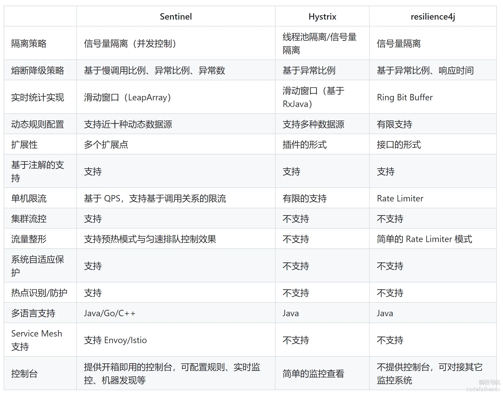

### Sentinel 入门

https://sentinelguard.io/zh-cn/index.html

#### 1、核心概念

1）资源：表示要保护的业务逻辑或代码块。我们说的资源，可以是任何东西，服务、服务里的方法、甚至是一段代码。

使用 Sentinel 来进行资源保护，主要分为几个步骤:

1. 定义资源
2. 定义规则
3. 检验规则是否生效

**先把可能需要保护的资源定义好，之后再配置规则。**也可以理解为，只要有了资源，我们就可以在任何时候灵活地定义各种流量控制规则。在编码的时候，只需要考虑这个代码是否需要保护，如果需要保护，就将之定义为一个资源。

有多种定义资源的方法，比如编程式和注解式，[参考官方文档](https://sentinelguard.io/zh-cn/docs/basic-api-resource-rule.html) 。

2）规则：Sentinel 使用规则来定义对资源的保护策略。

可以 [参考官方文档](https://sentinelguard.io/zh-cn/docs/basic-api-resource-rule.html) 来了解规则，比如：

- 限流规则：用于控制流量的规则，设置 QPS（每秒查询量）等参数，防止系统过载。
- 熔断规则：用于实现熔断降级的规则，当某个资源的异常比例或响应时间超过阈值时，触发熔断，短时间内不再访问该资源。
- 系统规则：根据系统的整体负载（如 CPU 使用率、内存使用率等）进行保护，适合在系统级别进行流量控制。
- 热点参数规则：用于限制某个方法的某些热点参数的访问频率，避免某些参数导致流量过大。
- 授权规则：用于定义黑白名单的授权规则，控制资源访问的权限。

3）控制台： Sentinel 控制台是一个可视化的管理工具，主要用于监控、管理和配置 Sentinel 的流控规则、熔断规则等。它提供了一个友好的界面，让用户可以轻松地操作。这是 Sentinel 的核心优势，可以提升可观测性，没有 Sentinel 控制台，感觉就失去了使用它的灵魂。

4）客户端：是指集成了 Sentinel 的应用程序，通常是通过引入 Sentinel 的依赖来接入。客户端负责在本地对资源进行监控、限流、熔断，并将 **数据上报** 给控制台。

#### 2、架构设计

[参考官方文档的基本原理](https://sentinelguard.io/zh-cn/docs/basic-implementation.html)，总体架构设计如下：


Sentinel 将 `ProcessorSlot` 作为 SPI 接口进行扩展，使得 Slot Chain 具备了扩展的能力。您可以自行加入自定义的 slot 并编排 slot 间的顺序，从而可以给 Sentinel 添加自定义的功能。


对于限流系统，指标的统计依然是实现关键，Sentinel 中使用高性能的环形计数器（滑动窗口）来实现：


下面我们来安装和使用 Sentinel。

#### 3、Sentinel 入门 Demo

可以 [参考官网编写入门 Demo](https://sentinelguard.io/zh-cn/docs/quick-start.html)，在本地通过 Main 方法运行一个 Sentinel 客户端程序。

运行成功后，可以在当前用户根目录下（~/logs/csp/${appName}-metrics.log.xxx）看到输出：


#### 4、下载并启动 Sentinel 控制台

可以 [参考官方文档](https://sentinelguard.io/zh-cn/docs/dashboard.html) 进行安装。

1）下载控制台 jar 包并在本地启动，可以访问从 [github](https://github.com/alibaba/Sentinel/releases) 上下载 release的 jar 包。

本教程为大家提供了软件包：https://pan.baidu.com/s/1u73-Nlolrs8Rzb1_b6X6HA ，提取码：c2sd

2）直接在命令行窗口启动 Sentinel 控制台：

注意：启动 Sentinel 控制台需要 JDK 版本为 1.8 及以上版本。

命令：

```java
java -Dserver.port=8131 -jar sentinel-dashboard-1.8.6.jar	
```

启动成功：


本地访问 http://localhost:8131/（你填的端口），即可访问控制台，**默认账号和密码都是 sentinel**


4）客户端接入控制台

引入 Maven 依赖，用于和 Sentinel 控制台通讯：

```xml
<dependency>
  <groupId>com.alibaba.csp</groupId>
  <artifactId>sentinel-transport-simple-http</artifactId>
  <version>1.8.6</version>
</dependency>
```

程序启动时需要加入 JVM 参数 `-Dcsp.sentinel.dashboard.server=consoleIp:port` 指定控制台地址和端口。若启动多个应用，则需要通过 `-Dcsp.sentinel.api.port=xxxx` 指定客户端监控 API 的端口（默认是 8719）。

Sentinel 非常贴心，提供了很多框架整合的依赖，便于开发，比如 Spring Web 项目支持将所有的接口自动识别为资源：


可以根据使用的框架引入适配依赖，[参考官方文档](https://sentinelguard.io/zh-cn/docs/open-source-framework-integrations.html)。

此处直接运行 Main 方法来演示效果，JVM 参数为：`-Dcsp.sentinel.dashboard.server=localhost:8131`


还有更多的配置，比如更改日志目录等，可以看 [官方文档](https://sentinelguard.io/zh-cn/docs/startup-configuration.html) 了解。

**确保客户端有访问量**，Sentinel 会在 **客户端首次调用的时候** 进行初始化，开始向控制台发送心跳包。通过控制台可以查看到实时访问情况：


查看机器列表和健康情况：

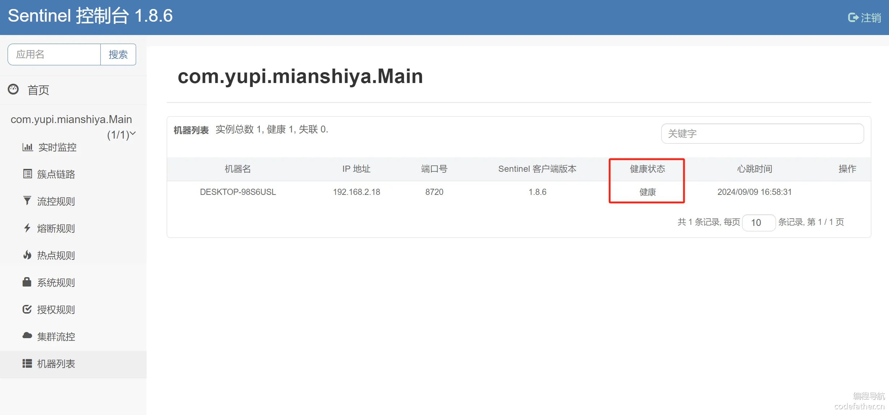

簇点链路（单机调用链路）页面实时的去拉取指定客户端资源的运行情况。它一共提供两种展示模式：一种用树状结构展示资源的调用链路，另外一种则不区分调用链路展示资源的运行情况。如图：

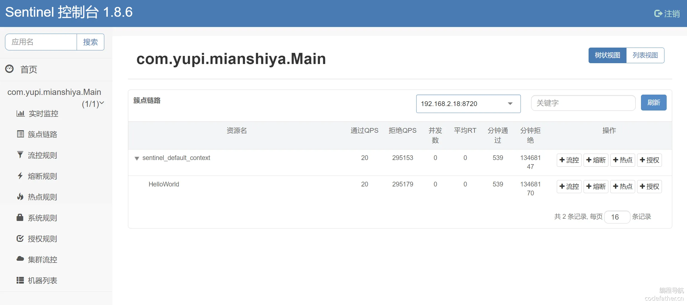

#### 5、规则管理和推送

问题：Sentinel 的规则存储在哪里呢？又是如何通过控制台修改规则之后，将规则同步给客户端进行限流熔断的呢？

[官方文档](https://sentinelguard.io/zh-cn/docs/dashboard.html) 有详细地介绍：Sentinel 控制台同时提供简单的规则管理以及推送的功能。规则推送分为 3 种模式，包括 "原始模式"、"Pull 模式" 和 "Push 模式"。

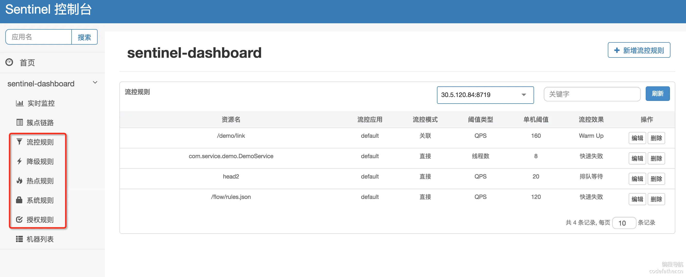

目前控制台的规则推送也是通过 [规则查询更改 HTTP API](https://github.com/alibaba/Sentinel/wiki/如何使用#查询更改规则) 来更改规则。**这也意味着这些规则仅在内存态生效，应用重启之后，该规则会丢失。**

以上是原始模式。当了解了原始模式之后，官方建议通过 [动态规则](https://sentinelguard.io/zh-cn/docs/dynamic-rule-configuration.html) 并结合各种外部存储来定制自己的规则源。我们推荐通过动态配置源的控制台来进行规则写入和推送，而不是通过 Sentinel 客户端直接写入到动态配置源中。

在生产环境中，官方推荐 push 模式，支持自定义存储规则的配置中心，控制台改变规则后，会 push 到配置中心。


更多规则管理和推送规则可以阅读：[在生产环境使用 Sentinel](https://github.com/alibaba/Sentinel/wiki/在生产环境中使用-Sentinel)。


#### 6、整合 Spring Boot

基于 Spring Boot Starter + 注解模式开发 + 原始规则推送模式开发

Spring Boot 项目可以轻松和 Sentinel 集成，直接引入一个 starter，使用 [Spring Cloud Alibaba Sentinel](https://github.com/alibaba/spring-cloud-alibaba/wiki/Sentinel) 即可。

**在引入整合依赖时，一定要注意版本号！**

建议 [参考官方文档选择版本](https://github.com/alibaba/spring-cloud-alibaba/wiki/版本说明)。由于 Spring Boot 3.0，Spring Boot 2.7~2.4 和 2.4 以下版本之间变化较大，目前企业级客户老项目相关 Spring Boot 版本仍停留在 Spring Boot 2.4 以下，为了同时满足存量用户和新用户不同需求，社区以 Spring Boot 3.0 和 2.4 分别为分界线，同时维护 2022.x、2021.x、2.2.x 三个分支迭代。

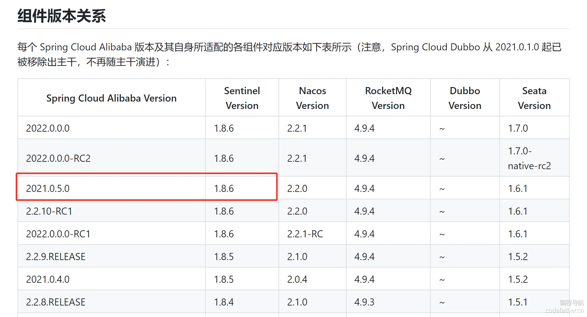

本项目 Spring Boot 用的是 2.7，因此使用 Sentinel Starter 的版本 2021.0.5.0。在项目中引入依赖：

```xml
<!-- https://mvnrepository.com/artifact/com.alibaba.cloud/spring-cloud-starter-alibaba-sentinel -->
<dependency>
    <groupId>com.alibaba.cloud</groupId>
    <artifactId>spring-cloud-starter-alibaba-sentinel</artifactId>
    <version>2021.0.5.0</version>
</dependency>
```

可以看到，该依赖自动整合了 Sentinel 的 core 包、客户端通讯包、注解开发包、webmvc 适配包、热点参数限流包等：


整合包支持自动将所有的接口根据 url 路径识别为资源。启动项目后，通过接口文档测试就能看到监控效果：

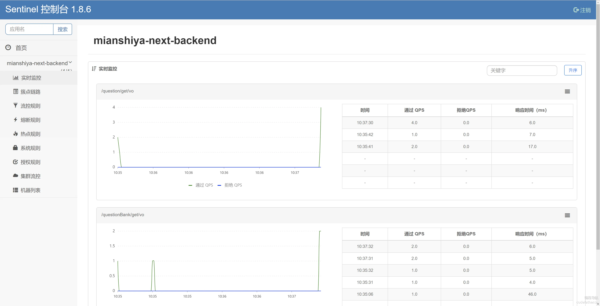

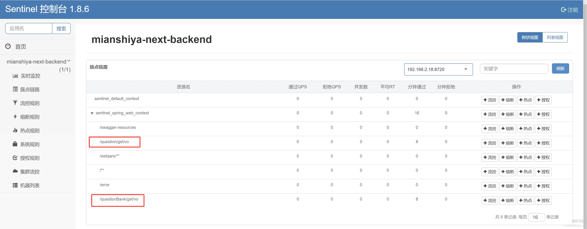

#### 7、开发模式

Sentinel 的开发主要包括定义资源和定义规则。

**1）定义资源**：支持通过代码、引入框架适配、[注解方式](https://sentinelguard.io/zh-cn/docs/annotation-support.html) 定义资源。

通过代码定义资源，更灵活：

```java
Entry entry = null;
// 务必保证finally会被执行
try {
  // 资源名可使用任意有业务语义的字符串
  entry = SphU.entry("自定义资源名");
  // 被保护的业务逻辑
  // do something...
} catch (BlockException e1) {
  // 资源访问阻止，被限流或被降级
  // 进行相应的处理操作
} finally {
  if (entry != null) {
    entry.exit();
  }
}
```

通过注解定义资源，更快捷可读：

```java
public class TestService {

    // 对应的 `handleException` 函数需要位于 `ExceptionUtil` 类中，并且必须为 static 函数.
    @SentinelResource(value = "test", blockHandler = "handleException", blockHandlerClass = {ExceptionUtil.class})
    public void test() {
        System.out.println("Test");
    }

    // 原函数
    @SentinelResource(value = "hello", blockHandler = "exceptionHandler", fallback = "helloFallback")
    public String hello(long s) {
        return String.format("Hello at %d", s);
    }
    
    // Fallback 函数，函数签名与原函数一致或加一个 Throwable 类型的参数.
    public String helloFallback(long s) {
        return String.format("Halooooo %d", s);
    }

    // Block 异常处理函数，参数最后多一个 BlockException，其余与原函数一致.
    public String exceptionHandler(long s, BlockException ex) {
        // Do some log here.
        ex.printStackTrace();
        return "Oops, error occurred at " + s;
    }
}
```

`@SentinelResource` 注解的配置优先于自动识别的配置。这意味着，如果注解中定义了特定的限流或熔断策略，这些策略将覆盖默认的或自动识别的配置。

推荐开发模式：优先使用适配包来自动识别资源，然后能运用注解尽量运用注解，最后再选择主动编码定义资源。

**2）定义规则：**支持通过代码、控制台（推荐）、配置文件来定义规则。

比如通过代码定义一个限流规则，更灵活：

```java
private static void initFlowQpsRule() {
    List<FlowRule> rules = new ArrayList<>();
    FlowRule rule1 = new FlowRule();
    rule1.setResource(resource);
    // Set max qps to 20
    rule1.setCount(20);
    rule1.setGrade(RuleConstant.FLOW_GRADE_QPS);
    rule1.setLimitApp("default");
    rules.add(rule1);
    FlowRuleManager.loadRules(rules);
}
```

通过控制台配置，更高效：

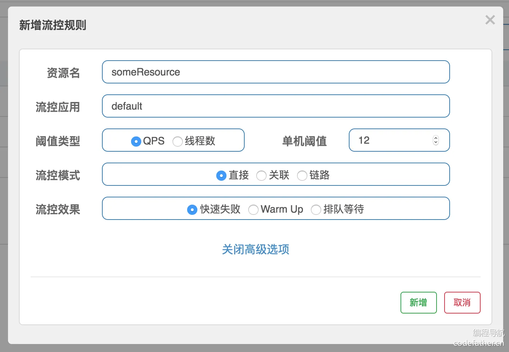

一般推荐使用控制台来配置规则，但如果希望开发者更快启动和学习项目，可以通过编码定义规则，这样不用搭建控制台、而且每次启动项目都会确保规则被创建。

#### 8、其他特性

除了限流外，Sentinel 还提供了多种规则，都可以通过官方文档来了解。

1. [熔断降级](https://sentinelguard.io/zh-cn/docs/circuit-breaking.html)：用于实现熔断降级的规则，当某个资源的异常比例或响应时间超过阈值时，触发熔断，短时间内不再访问该资源。
2. [系统自适应保护](https://sentinelguard.io/zh-cn/docs/system-adaptive-protection.html)：根据系统的整体负载（如 CPU 使用率、内存使用率等）进行保护，适合在系统级别进行流量控制。
3. [热点参数限流](https://sentinelguard.io/zh-cn/docs/parameter-flow-control.html)：用于限制某个方法的某些热点参数的访问频率，避免某些参数导致流量过大。
4. [来源访问控制](https://sentinelguard.io/zh-cn/docs/origin-authority-control.html)：用于定义黑白名单的授权规则，控制资源访问的权限。

接下来，我们通过本项目的需求实现，带大家实战 Sentinel 开发。

### 后端开发（Sentinel 实战）

#### 1、查看题库列表接口限流熔断

资源：listQuestionBankVOByPage 接口

目的：控制对耗时较长的、经常访问的接口的请求频率，防止过多请求导致系统过载。

限流规则：

- 策略：整个接口每秒钟不超过 10 次请求
- 阻塞操作：提示“系统压力过大，请耐心等待”

熔断规则：

- 熔断条件：如果接口异常率超过 10%，或者慢调用（响应时长 > 3 秒）的比例大于 20%，触发 60 秒熔断。
- 熔断操作：直接返回本地数据（缓存或空数据）

**开发模式：用注解定义资源 + 基于控制台定义规则**

1）定义资源。给需要限流的接口添加 @SentinelResource 注解：

```java
@PostMapping("/list/page/vo")
@SentinelResource(value = "listQuestionBankVOByPage",
        blockHandler = "handleBlockException",
        fallback = "handleFallback")
public BaseResponse<Page<QuestionBankVO>> listQuestionBankVOByPage(
    @RequestBody QuestionBankQueryRequest questionBankQueryRequest,
    HttpServletRequest request) {
}
```

上述代码中，参考 [注解使用官方文档](https://sentinelguard.io/zh-cn/docs/annotation-support.html) 指定了资源名称、阻塞处理器和降级处理器。

启动项目，注意需加入 JVM 参数 `-Dcsp.sentinel.dashboard.server=consoleIp:port` 指定控制台地址和端口。


启动项目成功并且访问接口后，可以在控制台看到刚定义的资源：

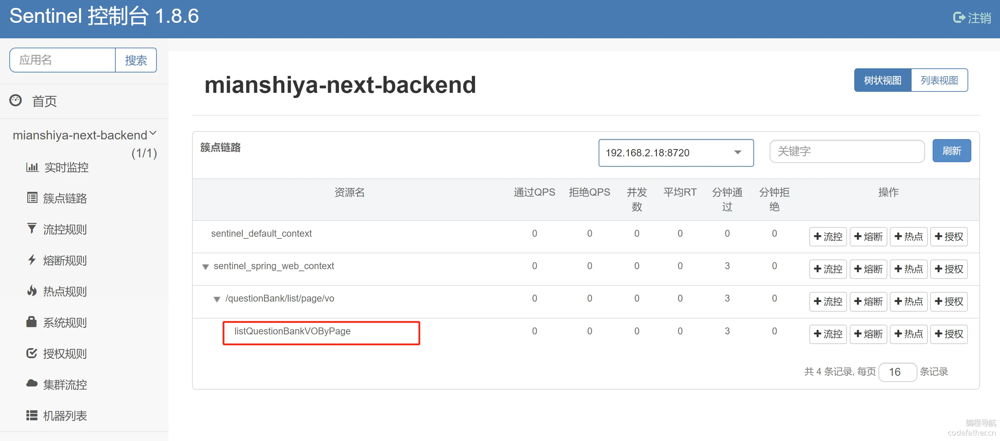

2）实现限流阻塞和熔断降级方法。注意遵循 [官方文档的方法定义规则](https://sentinelguard.io/zh-cn/docs/annotation-support.html)：


为了实现方便，尽快验证效果，我们先在接口相同的 Controller 中编写限流阻塞和降级方法：

```java
/**
 * listQuestionBankVOByPage 降级操作：直接返回本地数据
 */
public BaseResponse<Page<QuestionBankVO>> handleFallback(@RequestBody QuestionBankQueryRequest questionBankQueryRequest,
                                                         HttpServletRequest request, Throwable ex) {
    // 可以返回本地数据或空数据
    return ResultUtils.success(null);
}

/**
 * listQuestionBankVOByPage 流控操作
 * 限流：提示“系统压力过大，请耐心等待”
 */
public BaseResponse<Page<QuestionBankVO>> handleBlockException(@RequestBody QuestionBankQueryRequest questionBankQueryRequest,
                                                               HttpServletRequest request, BlockException ex) {
    // 限流操作
    return ResultUtils.error(ErrorCode.SYSTEM_ERROR, "系统压力过大，请耐心等待");
}
```

3）通过控制台定义规则

限流规则：根据需求配置即可

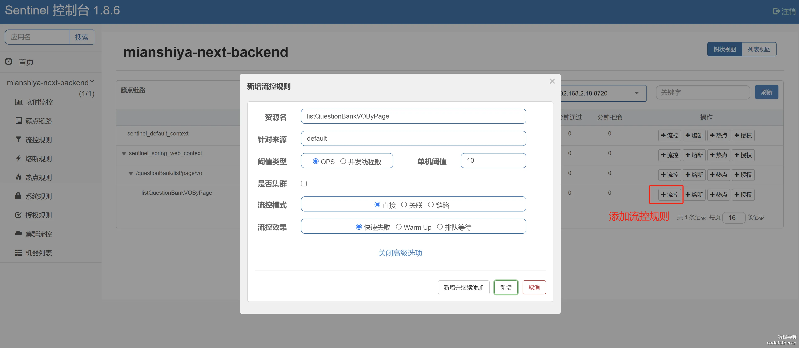


熔断规则：新增两条熔断规则，注意设置最小请求数、统计时长


4）测试

为便于测试，可以先将限流熔断规则调整到容易触发的值，然后通过接口文档测试调用，查看效果。

连续快速发送多次请求，触发限流，执行了 `blockHandler` 处理器的逻辑：


注意，只有业务异常（比如请求参数错误、或者数据库操作失败等问题），才会算到熔断条件中，限流熔断本身的异常 BlockException 是不计算的。

测试熔断的时候，可以故意给 sortField 请求参数传一个不存在的字段，触发业务异常。可以尝试下熔断的触发和恢复：

1. 先通过传错业务参数触发异常，导致熔断
2. 等待熔断结束后，再触发一次异常，还会继续熔断
3. 过一段时间，再触发一次正常请求，则熔断解除

测试发现，任何业务异常（不仅仅是被熔断了），都会触发 `fallbackHandler`，该方法可作为一个通用的降级逻辑处理器。

测试发现，如果 `blockHandler` 和 `fallbackHandler` 同时配置，当熔断器打开后，仍然会进入 `blockHandler` 进行处理，因此需要在该方法中处理因为熔断触发的降级逻辑：

```java
/**
 * listQuestionBankVOByPage 流控操作
 * 限流：提示“系统压力过大，请耐心等待”
 * 熔断：执行降级操作
 */
public BaseResponse<Page<QuestionBankVO>> handleBlockException(@RequestBody QuestionBankQueryRequest questionBankQueryRequest,
                                                               HttpServletRequest request, BlockException ex) {
    // 降级操作
    if (ex instanceof DegradeException) {
        return handleFallback(questionBankQueryRequest, request, ex);
    }
    // 限流操作
    return ResultUtils.error(ErrorCode.SYSTEM_ERROR, "系统压力过大，请耐心等待");
}
```

Sentinel 的 `blockHandler` 处理的是`BlockException`，该异常表示系统受到流量控制限制（如限流或熔断），这些不是业务逻辑中的异常，因此 `fallback` 不会处理这些异常。如果不配置 `blockHandler`，才会在熔断时，进入到 `fallbackHandler` 中进行兜底。


总结一下：

- `blockHandler` 处理 Sentinel 流量控制异常，如 `BlockException`。
- `fallback` 处理业务逻辑中的异常，比如我们自己的 `BusinessException`。

可以根据自己的实际情况配置。

#### **2、单 IP 查看题目列表限流熔断**

资源：listQuestionVoByPage 接口

限流规则：

- 策略：每个 IP 地址每分钟允许查看题目列表的次数不能超过 60 次。
- 阻塞操作：提示“访问过于频繁，请稍后再试”

熔断规则：

- 熔断条件：如果接口异常率超过 10%，或者慢调用（响应时长 > 3 秒）的比例大于 20%，触发 60 秒熔断。
- 熔断操作：直接返回本地数据（缓存或空数据）

由于需要针对每个用户进一步精细化限流，而不是整体接口限流，可以采用 [热点参数限流机制](https://sentinelguard.io/zh-cn/docs/parameter-flow-control.html)，允许根据参数控制限流触发条件。


对于我们的需求，可以将 IP 地址作为热点参数。

1）定义资源

对于 `@SentinelResource` 注解方式定义的资源，若注解作用的方法上有参数，Sentinel 会将它们作为参数传入 `SphU.entry(res, args)`。比如以下的方法里面 `uid` 和 `type` 会分别作为第一个和第二个参数传入 Sentinel API，从而可以用于热点规则判断：

```java
@SentinelResource("myMethod")
public Result doSomething(String uid, int type) {
  // some logic here...
}
```

由于 Controller 接口参数较杂乱，使用编程式定义资源的方法。

💡 这里建议新写一个接口，不要污染原有接口，等测试稳定后，再进行切换。

代码如下：

```java
// 基于 IP 限流
String remoteAddr = request.getRemoteAddr();
Entry entry = null;
try  {
    entry = SphU.entry("listQuestionVOByPage", EntryType.IN, 1, remoteAddr);
    // 被保护的业务逻辑
    // 查询数据库
    Page<Question> questionPage = questionService.listQuestionByPage(questionQueryRequest);
    // 获取封装类
    return ResultUtils.success(questionService.getQuestionVOPage(questionPage, request));
} catch (BlockException ex) {
    // 资源访问阻止，被限流或被降级
    if (ex instanceof DegradeException) {
        return handleFallback(questionQueryRequest, request, ex);
    }
    // 限流操作
    return ResultUtils.error(ErrorCode.SYSTEM_ERROR, "访问过于频繁，请稍后再试");
} finally {
    if (entry != null) {
        entry.exit(1, remoteAddr);
    }
}
```

💡需要特别注意！

1. 若 entry 的时候传入了热点参数，那么 exit 的时候也一定要带上对应的参数（`exit(count, args)`），否则可能会有统计错误。**这个时候不能使用 try-with-resources 的方式。**
2. `SphU.entry(xxx)` 需要与 `entry.exit()` 方法成对出现，匹配调用，否则会导致调用链记录异常，抛出 `ErrorEntryFreeException` 异常。

注意 Sentinel 的降级仅针对业务异常，对 Sentinel 限流降级本身的异常 `BlockException` 不生效。为了统计异常比例或异常数，需要手动通过 `Tracer.trace(ex)` 记录业务异常。示例：

```java
Entry entry = null;
try {
  entry = SphU.entry(resource);

  // Write your biz code here.
  // <<BIZ CODE>>
} catch (Throwable t) {
  if (!BlockException.isBlockException(t)) {
    Tracer.trace(t);
  }
} finally {
  if (entry != null) {
    entry.exit();
  }
}
```

注意，通过 `Tracer.trace(ex)` 来统计异常信息时，由于 try-with-resources 语法中 catch 调用顺序的问题，会导致无法正确统计异常数，因此统计异常信息时也不能在 try-with-resources 的 catch 块中调用 `Tracer.trace(ex)`。

💡 为什么上一个需求中，我们不用手动调用 Tracer 上报异常呢？因为使用 Sentinel 的开源整合模块，如 Sentinel Dubbo Adapter, Sentinel Web Servlet Filter 或 `@SentinelResource` 注解会自动统计业务异常，无需手动调用。

需要给我们的资源定义增加异常统计代码：

```java
catch (Throwable ex) {
    // 业务异常
    if (!BlockException.isBlockException(ex)) {
        Tracer.trace(ex);
        return ResultUtils.error(ErrorCode.SYSTEM_ERROR, "系统错误");
    }
    // 降级操作
    if (ex instanceof DegradeException) {
        return handleFallback(questionQueryRequest, request, ex);
    }
    // 限流操作
    return ResultUtils.error(ErrorCode.SYSTEM_ERROR, "访问过于频繁，请稍后再试");
}
```

2）编写阻塞和降级操作代码

```java
try {
    entry = SphU.entry("listQuestionVOByPage", EntryType.IN, 1, remoteAddr);
    // 被保护的业务逻辑
    // 查询数据库
    Page<Question> questionPage = questionService.listQuestionByPage(questionQueryRequest);
    // 获取封装类
    return ResultUtils.success(questionService.getQuestionVOPage(questionPage, request));
} catch (Throwable ex) {
    // 业务异常
    if (!BlockException.isBlockException(ex)) {
        Tracer.trace(ex);
        return ResultUtils.error(ErrorCode.SYSTEM_ERROR, "系统错误");
    }
    // 降级操作
    if (ex instanceof DegradeException) {
        return handleFallback(questionQueryRequest, request, ex);
    }
    // 限流操作
    return ResultUtils.error(ErrorCode.SYSTEM_ERROR, "访问过于频繁，请稍后再试");
} finally {
    if (entry != null) {
        entry.exit(1, remoteAddr);
    }
}

/**
 * listQuestionVOByPage 降级操作：直接返回本地数据
 */
public BaseResponse<Page<QuestionVO>> handleFallback(QuestionQueryRequest questionQueryRequest,
                                                         HttpServletRequest request, Throwable ex) {
    // 可以返回本地数据或空数据
    return ResultUtils.success(null);
}
```

3）通过编码方式定义规则。可以新建 `sentinel` 包并定义一个单独的 Manager 作为 Bean，利用 @PostConstruct 注解，在 Bean 加载后创建规则。代码如下：

```java
@Component
public class SentinelRulesManager {

    @PostConstruct
    public void initRules() {
        initFlowRules();
        initDegradeRules();
    }

    // 限流规则
    public void initFlowRules() {
        // 单 IP 查看题目列表限流规则
        ParamFlowRule rule = new ParamFlowRule("listQuestionVOByPage")
                .setParamIdx(0) // 对第 0 个参数限流，即 IP 地址
                .setCount(60) // 每分钟最多 60 次
                .setDurationInSec(60); // 规则的统计周期为 60 秒
        ParamFlowRuleManager.loadRules(Collections.singletonList(rule));
    }

    // 降级规则
    public void initDegradeRules() {
        // 单 IP 查看题目列表熔断规则
        DegradeRule slowCallRule = new DegradeRule("listQuestionVOByPage")
                .setGrade(CircuitBreakerStrategy.SLOW_REQUEST_RATIO.getType())
                .setCount(0.2) // 慢调用比例大于 20%
                .setTimeWindow(60) // 熔断持续时间 60 秒
                .setStatIntervalMs(30 * 1000) // 统计时长 30 秒
                .setMinRequestAmount(10) // 最小请求数
                .setSlowRatioThreshold(3); // 响应时间超过 3 秒

        DegradeRule errorRateRule = new DegradeRule("listQuestionVOByPage")
                .setGrade(CircuitBreakerStrategy.ERROR_RATIO.getType())
                .setCount(0.1) // 异常率大于 10%
                .setTimeWindow(60) // 熔断持续时间 60 秒
                .setStatIntervalMs(30 * 1000) // 统计时长 30 秒
                .setMinRequestAmount(10); // 最小请求数

        // 加载规则
        DegradeRuleManager.loadRules(Arrays.asList(slowCallRule, errorRateRule));
    }
}
```

4）测试

启动项目就能看到规则：

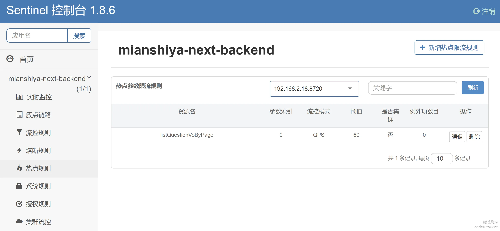

为了测试方便，可以先将规则的阈值调整小一点，然后通过接口文档验证效果。

限流效果：


测试降级效果的时候，可以故意将 sortField 传一个不存在的字段。效果如图，触发了 DegradeException：


### 扩展知识

#### 1、仅对部分 URL 进行统计（性能优化）

参考：[https://github.com/alibaba/spring-cloud-alibaba/wiki/Sentinel#%E9%85%8D%E7%BD%AE](https://github.com/alibaba/spring-cloud-alibaba/wiki/Sentinel#配置)‘

可以修改监听的 URL 规则配置：

```xml
spring.cloud.sentinel.filter.url-patterns=/*
```

#### 2、规则配置本地持久化

参考官方文档的配置：https://sentinelguard.io/zh-cn/docs/dynamic-rule-configuration.html

官方提供了 Demo，可以用文件来本地持久化配置，这样重启项目后配置就不会丢失了。

- [读写本地文件 Demo](https://github.com/alibaba/Sentinel/blob/master/sentinel-demo/sentinel-demo-dynamic-file-rule/src/main/java/com/alibaba/csp/sentinel/demo/file/rule/FileDataSourceInit.java)（先看这个）
- [读本地文件 Demo](https://github.com/alibaba/Sentinel/blob/master/sentinel-demo/sentinel-demo-dynamic-file-rule/src/main/java/com/alibaba/csp/sentinel/demo/file/rule/FileDataSourceDemo.java)


示例代码如下，可以在 SentinelManager 的初始化逻辑中调用：

```java
/**
 * 持久化配置为本地文件
 */
public void listenRules() throws Exception {
    // 获取项目根目录
    String rootPath = System.getProperty("user.dir");
    // sentinel 目录路径
    File sentinelDir = new File(rootPath, "sentinel");
    // 目录不存在则创建
    if (!FileUtil.exist(sentinelDir)) {
        FileUtil.mkdir(sentinelDir);
    }
    // 规则文件路径
    String flowRulePath = new File(sentinelDir, "FlowRule.json").getAbsolutePath();
    String degradeRulePath = new File(sentinelDir, "DegradeRule.json").getAbsolutePath();

    // Data source for FlowRule
    ReadableDataSource<String, List<FlowRule>> flowRuleDataSource = new FileRefreshableDataSource<>(flowRulePath, flowRuleListParser);
    // Register to flow rule manager.
    FlowRuleManager.register2Property(flowRuleDataSource.getProperty());
    WritableDataSource<List<FlowRule>> flowWds = new FileWritableDataSource<>(flowRulePath, this::encodeJson);
    // Register to writable data source registry so that rules can be updated to file
    WritableDataSourceRegistry.registerFlowDataSource(flowWds);

    // Data source for DegradeRule
    FileRefreshableDataSource<List<DegradeRule>> degradeRuleDataSource
            = new FileRefreshableDataSource<>(
            degradeRulePath, degradeRuleListParser);
    DegradeRuleManager.register2Property(degradeRuleDataSource.getProperty());
    WritableDataSource<List<DegradeRule>> degradeWds = new FileWritableDataSource<>(degradeRulePath, this::encodeJson);
    // Register to writable data source registry so that rules can be updated to file
    WritableDataSourceRegistry.registerDegradeDataSource(degradeWds);
}

private Converter<String, List<FlowRule>> flowRuleListParser = source -> JSON.parseObject(source,
        new TypeReference<List<FlowRule>>() {
        });
private Converter<String, List<DegradeRule>> degradeRuleListParser = source -> JSON.parseObject(source,
        new TypeReference<List<DegradeRule>>() {
        });

private <T> String encodeJson(T t) {
    return JSON.toJSONString(t);
}
```

然后可以测试读写效果。

#### 3、代码组织结构优化

限流阻塞和降级方法可以单独抽成独立的类，Sentinel 的资源名称也可以单独定义为常量，统一放到 sentinel 包中，更模块化。

常量类：

```java
/**
 * Sentinel 限流熔断常量
 */
public interface SentinelConstant {

    /**
     * 分页获取题库列表接口限流
     */
    String listQuestionBankVOByPage = "listQuestionBankVOByPage";

    /**
     * 分页获取题目列表接口限流
     */
    String listQuestionVOByPage = "listQuestionVOByPage";
}
```

#### 4、封装限流组件为 Spring Boot Starter

为了简化项目的配置和依赖管理，减少限流组件的接入成本，我们通过 Starter 封装限流组件，将多个相关的依赖打包成一个 Maven 依赖，用户只需引入一个依赖即可完成配置，而不需要手动引入每个模块的依赖。

1）创建一个 spring boot 项目

将无用的默认依赖都移除，例如默认的配置文件、启动文件、test 相关等。

2）引入需要的依赖。完整 pom 文件如下：

```xml
<?xml version="1.0" encoding="UTF-8"?>
<project xmlns="http://maven.apache.org/POM/4.0.0" xmlns:xsi="http://www.w3.org/2001/XMLSchema-instance"
         xsi:schemaLocation="http://maven.apache.org/POM/4.0.0 https://maven.apache.org/xsd/maven-4.0.0.xsd">
    <modelVersion>4.0.0</modelVersion>
    <parent>
        <groupId>org.springframework.boot</groupId>
        <artifactId>spring-boot-starter-parent</artifactId>
        <version>2.7.2</version>
        <relativePath/> <!-- lookup parent from repository -->
    </parent>
    <groupId>com.yupi</groupId>
    <artifactId>limit-spring-boot-starter</artifactId>
    <version>0.0.1-SNAPSHOT</version>
    <name>limit-spring-boot-starter</name>
    <description>limit-spring-boot-starter</description>
    <properties>
        <java.version>1.8</java.version>
    </properties>
    <dependencies>
        <dependency>
            <groupId>org.springframework.boot</groupId>
            <artifactId>spring-boot-starter</artifactId>
        </dependency>

        <dependency>
            <groupId>com.alibaba.csp</groupId>
            <artifactId>sentinel-core</artifactId>
            <version>1.8.6</version>
        </dependency>
        <dependency>
            <groupId>com.alibaba.csp</groupId>
            <artifactId>sentinel-transport-simple-http</artifactId>
            <version>1.8.6</version>
        </dependency>
        <dependency>
            <groupId>com.alibaba.csp</groupId>
            <artifactId>sentinel-annotation-aspectj</artifactId>
            <version>1.8.6</version>
        </dependency>
        <dependency>
            <groupId>com.alibaba.csp</groupId>
            <artifactId>sentinel-parameter-flow-control</artifactId>
            <version>1.8.6</version>
        </dependency>
    </dependencies>


</project>
```

3）创建配置文件

```java
@ConfigurationProperties(prefix = "spring")
public class LimitProperties {
    private String sentinelDashboard;
    private List<LimitRule> limitRules;

    public List<LimitRule> getLimitRules() {
        return limitRules;
    }

    public void setLimitRules(List<LimitRule> limitRules) {
        this.limitRules = limitRules;
    }

    public String getSentinelDashboard() {
        return sentinelDashboard;
    }

    public void setSentinelDashboard(String sentinelDashboard) {
        this.sentinelDashboard = sentinelDashboard;
    }

    public static class LimitRule {
        private String resource;
        private int grade;
        private int count;

        public String getResource() {
            return resource;
        }

        public void setResource(String resource) {
            this.resource = resource;
        }

        public int getGrade() {
            return grade;
        }

        public void setGrade(int grade) {
            this.grade = grade;
        }

        public int getCount() {
            return count;
        }

        public void setCount(int count) {
            this.count = count;
        }
    }

}
```

4）创建自动配置类

```java
@Configuration
@EnableConfigurationProperties(LimitProperties.class)
public class LimitAutoConfiguration {

    @Resource
    private LimitProperties properties;

    @Bean
    @ConditionalOnMissingBean
    public SentinelResourceAspect sentinelResourceAspect() {
        return new SentinelResourceAspect();
    }

    @PostConstruct
    public void initLimit() {
        initDefaultRule();
        initDashboard();
    }


    private void initDefaultRule() {
        List<LimitProperties.LimitRule> limitRules = properties.getLimitRules();
        if (CollectionUtils.isEmpty(limitRules)) {
            return;
        }

        List<FlowRule> rules = new ArrayList<>();
        for (LimitProperties.LimitRule limitRule : limitRules) {
            FlowRule rule = new FlowRule();
            rule.setResource(limitRule.getResource());
            rule.setGrade(limitRule.getGrade());
            rule.setCount(limitRule.getCount());
            rules.add(rule);
        }
        FlowRuleManager.loadRules(rules);
    }

    private void initDashboard() {
        SentinelConfig.setConfig("csp.sentinel.dashboard.server", properties.getSentinelDashboard());
    }
}
```

5）创建 spring.factories 文件。

在 src/main/resources/META-INF 目录下创建 spring.factories 文件，并在其中定义自动配置类。


文件内容：

```plain
org.springframework.boot.autoconfigure.EnableAutoConfiguration=\
  com.yupi.limitspringbootstarter.LimitAutoConfiguration
```

6）本地 install


这样本地仓库就有了当前的 starter。

7）使用。后端项目引入此 starter：

```xml
  <dependency>
      <artifactId>limit-spring-boot-starter</artifactId>
      <groupId>com.yupi</groupId>
      <version>0.0.1-SNAPSHOT</version>
  </dependency>
```

application.yml 文件中填写对应限流配置：

```yaml
spring:
  # sentinel 控制台地址
  sentinelDashboard: localhost:7878 
  # 限流规则
  limitRules:
    - resource: "QuestionBank"
      count: 5
      grade: 1
```

项目中同样还是使用 `@SentinelResource`注解，也可以通过控制台动态配置限流。

### 自主扩展

1）自主实现 push 规则推送模式，定义自己的持久化规则

参考文档：

- https://sentinelguard.io/zh-cn/docs/basic-api-resource-rule.html（结尾提到）
- https://sentinelguard.io/zh-cn/docs/dynamic-rule-configuration.html

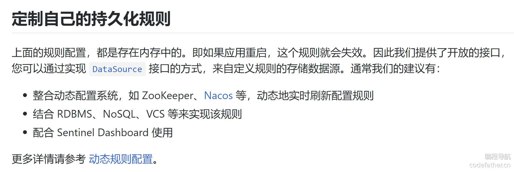

2）自主实现更多限流功能，比如本文需求分析部分提到的用户登录和用户注册的保护

## 二、动态 IP 黑名单过滤

### 需求分析

一些恶意用户（可能是黑客、爬虫、DDoS 攻击者）可能频繁请求服务器资源，导致资源占用过高。因此我们需要一定的手段实时阻止可疑或恶意的用户，减少攻击风险。

通过 IP 封禁，可以有效拉黑攻击者，防止资源被滥用，保障合法用户的正常访问。

对于我们的需求，不让拉进黑名单的 IP 访问任何接口。

### 方案设计

#### 1、设计过程

其实前面讲到的 Sentinel 本身就支持请求来源的 [黑白名单判断](https://github.com/alibaba/Sentinel/wiki/黑白名单控制)，但默认是对应用级别进行判断，需要改造来源的获取方式为获取请求客户端的 IP，可参考 [这篇文章](https://blog.csdn.net/qq_37128815/article/details/131942363) 自定义来源。

但其实引入 Sentinel 是需要一定成本的，本节主要分享更轻量的动态 IP 黑白名单过滤的常用设计和实现方法。

想要自主实现动态 IP 黑名单，主要考虑以下几点：

1. IP 黑名单存储在哪里？
2. 如何便捷地动态修改 IP 黑名单？
3. 黑白名单的判断逻辑应在哪里处理？
4. 使用何种数据结构保存黑名单？如何快速匹配用户请求的 IP 是否在黑名单中？

下面分别设计：

1）IP 黑名单存储在哪里？

最简单的方式就是存储在内存中，但一般 IP 黑名单是动态增加的、需要持久化保存。常见的持久化方式包括数据库、配置文件或分布式存储系统（如 Redis），可以根据需要选择。

2）如何便捷地动态修改 IP 黑名单？

为了方便动态修改 IP 黑名单，通常会提供一个管理页面，供管理员进行增删改查操作。

许多企业会将配置统一放入 **配置中心**，通过配置中心的管理页面，开发人员可以便捷地动态修改黑名单规则。Java 项目中，常用的配置中心是 Nacos。

3）黑白名单的判断逻辑应在哪里处理？

黑白名单逻辑通常部署在高性能的网关或 CDN 上，**能够更早地拦截非法请求**，减轻后端压力。在小型项目中，也可以直接在应用程序的过滤器中处理。

4）使用何种结构保存黑名单？如何快速匹配？

为了高效判断每个用户请求的 IP 是否在黑名单中，首先建议将 IP 黑名单从持久化存储同步到本地缓存中，避免频繁查询远程数据源。对于黑名单数据较小的场景，可以使用简单的 `Set` 数据结构存储。而对于大规模黑名单，推荐使用 **布隆过滤器或 DFA** 来存储和过滤黑名单，可以节约内存空间、提高检测效率。

#### 2、最终方案

总结一下最终方案：

1）使用 Nacos 配置中心存储和管理 IP 黑名单

2）后端服务利用 Web 过滤器判断每个用户请求的 IP

3）后端服务利用布隆过滤器过滤 IP 黑名单

#### 3、扩展知识 - 布隆过滤器

Bloom Filter 是一种高效的、基于概率的数据结构，用于判断一个元素是否存在于集合中。

原理是利用多个哈希函数将元素映射到固定的点位上（位数组中），因此面对海量数据它占据的空间也非常小。

例如某个 key 通过 hash-1 和 hash-2 两个哈希函数，定位到数组中的值都为 1，则说明它存在。

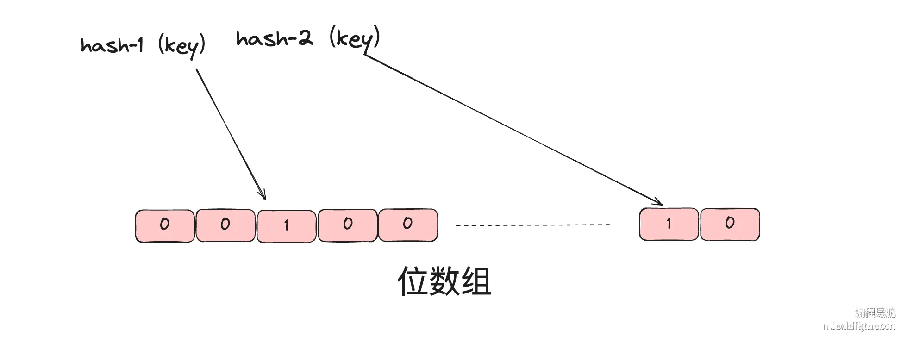

如果布隆过滤器判断一个元素不存在集合中，那么这个元素一定不在集合中，如果判断元素存在集合中则不一定是真的，因为哈希可能会存在冲突。因此布隆过滤器 **有误判的概率** 。

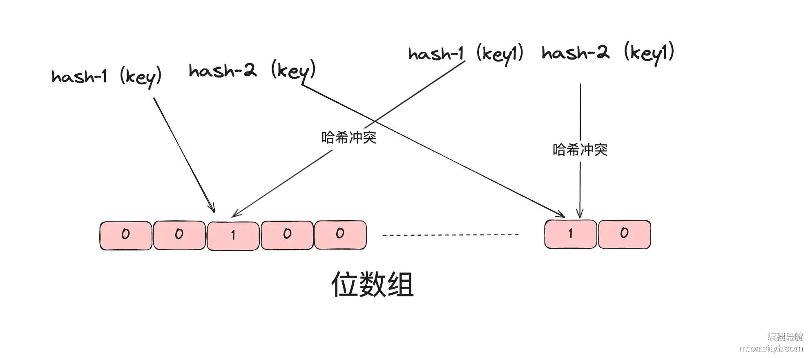

而且它不好删除元素，只能新增，如果想要删除，只能重建。

显然，它的主要特点包括：

1. 空间效率高：相比于传统的数据结构（如哈希表），Bloom Filter 能用较少的空间存储大量的数据。
2. 时间复杂度低：查询操作非常快速，通常是常数时间复杂度 `O(1)`。
3. 允许误判：Bloom Filter 允许假阳性，即有时候会错误地判断某个元素在集合中，而实际该元素并不在集合中。不过，它不允许假阴性，也就是说，如果 Bloom Filter 判断某个元素不存在，那么它一定是不存在的。比如对于我们的需求，Bloom Filter **可能错误地判断一个不在黑名单中的元素为在黑名单中**，导致误封。

Bloom Filter 的误判率与以下因素有关：

- 位数组的大小：位数组越大，误判率越低，但空间开销会增大。（值会更离散）
- 哈希函数的个数：哈希函数越多，误判率越低，但计算成本会增加。（Hash 一次冲突，那我就多 Hash 几次，减少冲突概率）
- 元素数量：存入的元素越多，误判率会增加。

通过 **合理设计位数组的大小和哈希函数的个数**，可以控制 Bloom Filter 的误判率在一个可接受的范围内。例如，在很多实际场景中，可以将误判率控制在 **1%** 或更低。

- 假设场景 1：存储 1000 个元素，位数组大小为 10000 位，哈希函数数量为 7。误判率大约为 0.8%。
- 假设场景 2：存储 100000 个元素，位数组大小为 1,000,000 位，哈希函数数量为 7。误判率大约为 1%。
- 假设场景 3：存储 1,000,000 个元素，位数组大小为 10,000,000 位，哈希函数数量为 7。误判率大约为 1%。

如果误判的代价较高，但仍想使用 Bloom Filter，可以采取一些补救措施：

- 双层验证：在 Bloom Filter 判断元素在黑名单中后，进一步查验实际的黑名单（例如，查数据库中的黑名单详细记录）。
- 结合其他数据结构：可以使用 Bloom Filter 进行初步筛选，如果 Bloom Filter 判断为在黑名单中，再用哈希表等精确的数据结构进行最终确认。

但这两种方式都无法处理攻击 IP 的大量请求，个人也不建议采用。

因此，布隆过滤器适用于对准确性要求不高的、大规模数据量匹配的场景，比如垃圾邮件过滤、爬虫 URL 去重、缓存穿透防护等。

### 配置中心

#### 为什么需要配置中心？

在分布式系统中，应用的配置管理变得越来越复杂，特别是当系统规模和组件数量增加时。传统的手动配置（写固定配置文件）往往难以应对这些复杂的需求。

而配置中心的出现就是为了实现分布式系统中配置的 **集中化管理，**还提供动态更新、配置分组、版本控制、灰度发布、安全管理，简化了多环境和多实例的配置运维，确保系统的灵活性和稳定性。

一句话，专业的技术做专业的事。

#### 配置中心支持的功能

1）集中化配置管理：所有服务的配置可以在一个地方集中管理，运维人员和开发人员可以通过统一的接口修改和获取配置，避免了在每个实例中重复配置。

2）动态配置：配置中心允许在不重启应用的情况下动态更新配置，应用可以实时收到配置的修改，进行运行时的调整。

3）多环境配置管理：配置中心，可以为不同的环境配置不同的配置集，按需加载相应的环境配置文件，避免了环境间配置的混淆和出错。

4）配置的版本控制：配置中心一般都会提供版本管理功能，可以查看和回滚到之前的配置版本，这提高了系统的容错性和可恢复性。

5）配置的安全管理：配置中心一般会提供加密存储和权限控制功能，可以对敏感信息（如数据库密码、API 密钥等）进行加密处理，并限制访问权限，确保敏感配置信息的安全性。

#### 常见的配置中心

1）Spring Cloud Config：Spring Cloud 提供的配置中心解决方案，支持 Git 等版本管理系统存储配置，适合与 Spring Cloud 系统集成使用。

2）Nacos：阿里巴巴开源的服务注册中心和配置中心，支持动态配置、服务治理，适合微服务架构和 Dubbo、Spring Cloud 的深度集成。

3）Apollo：由携程开源的配置中心，支持多环境、多集群的配置管理，配置实时生效且具有权限控制，适合大规模分布式系统。

4）Consul：由 HashiCorp 提供的服务注册与配置中心，具有强一致性和健康检查功能，适用于服务网格和容器化应用。

一般业务上，我们会选择使用 Nacos 或 Apollo 来作为配置中心，因为这两个提供了比较丰富的控制台管理页面，便于我们修改维护配置。

**本项目使用 Nacos 作为配置中心的实现。**

### Nacos 入门

#### 什么是 Nacos？

[Nacos](https://nacos.io/) 是 Dynamic Naming and Configuration Service 的首字母简称，一个更易于构建云原生应用的动态服务发现、配置管理和服务管理平台。

它提供了一组简单易用的特性集，帮助我们快速实现动态服务发现、服务配置、服务元数据及流量管理。

实际上，Nacos 不仅支持配置管理，它还支持服务发现（作为注册中心），以下是官网总结的 Nacos 地图：


我们当前的项目主要使用它的配置管理功能。

#### Nacos 配置管理的核心概念

1、Namespace（命名空间）

命名空间用于隔离不同的配置集。它允许在同一个 Nacos 集群中将不同的环境（如开发、测试、生产）或者不同的业务线的配置进行隔离。（默认提供了一个 public 命名空间） 使用场景：在多租户系统中，或者需要区分不同的环境时，可以使用命名空间。例如，开发环境的配置和生产环境的配置完全隔离，可以通过不同的命名空间来管理。

2、Group（组）

配置组是用于将多个相关的配置项进行分类管理的逻辑分组机制。每个配置项可以属于不同的组，以便于配置管理。 使用场景：当一个应用有多个模块，且不同模块之间共享部分配置时，可以用组来对这些模块的配置进行分类和管理。例如，一个系统中的“支付服务”和“订单服务”可能需要用不同的组来存储各自的配置。

3、Data ID

Data ID 是一个唯一的配置标识符，通常与具体的应用程序相关。通过 Data ID，Nacos 知道如何获取特定应用的某个具体配置。 使用场景：每个应用的配置都会有一个独特的 Data ID。例如，一个支付系统可能有一个配置文件叫 `com.payment.pay-service.yaml`，这就是它的 Data ID。

4、Config Listener（配置监听器）

配置监听器用于让客户端实时监听 Nacos 配置中心中的配置变化，可以自动感知配置的更新并做出相应的处理。 使用场景：在需要动态调整配置的场景下使用，例如调整缓存大小、切换不同的服务端点等，应用可以通过监听器及时感知这些变化并应用新的配置。

#### 推送和监听

推送方法：

1. Nacos 控制台（推荐）
2. 应用程序 SDK。Nacos 支持和 Spring Boot 快速整合，可以参考 [官方文档](https://nacos.io/zh-cn/docs/quick-start-spring-boot.html)
3. [Open API](https://nacos.io/zh-cn/docs/open-api.html)

监听方法：使用 SDK 配置 Config Listener，[参考官方文档](https://nacos.io/zh-cn/docs/sdk.html) 。示例代码如下：

```java
String serverAddr = "{serverAddr}";
String dataId = "{dataId}";
String group = "{group}";
Properties properties = new Properties();
properties.put("serverAddr", serverAddr);
ConfigService configService = NacosFactory.createConfigService(properties);
String content = configService.getConfig(dataId, group, 5000);
System.out.println(content);
configService.addListener(dataId, group, new Listener() {
	@Override
	public void receiveConfigInfo(String configInfo) {
		System.out.println("recieve1:" + configInfo);
	}
	@Override
	public Executor getExecutor() {
		return null;
	}
});

// 测试让主线程不退出，因为订阅配置是守护线程，主线程退出守护线程就会退出。 正式代码中无需下面代码
while (true) {
    try {
        Thread.sleep(1000);
    } catch (InterruptedException e) {
        e.printStackTrace();
    }
}
```

或者直接通过注解读取 value，能够实时获取到最新的配置值：

```java
@Controller
@RequestMapping("config")
public class ConfigController {

    @NacosValue(value = "${useLocalCache:false}", autoRefreshed = true)
    private boolean useLocalCache;

    @RequestMapping(value = "/get", method = GET)
    @ResponseBody
    public boolean get() {
        return useLocalCache;
    }
}
```

#### 扩展知识 - Nacos 性能

在企业中，做技术选型时，性能是必不可少的考虑因素。

可以参考 Nacos 的 [官方文档](https://nacos.io/zh-cn/docs/nacos-config-benchmark.html) 了解。

写性能：

BsIfCdbcOxfxcrAyHoNumjhUY27lclYvZBP3TWJ21Ak=NlM19jOpdzoohJcm/GrGw+nMEUUssmqVWxgqzhb7Yyk=19lREw9lV3H3I+rK7vjxERQeWUOy0kwqtJjqK+R58cE=BsIfCdbcOxfxcrAyHoNumjhUY27lclYvZBP3TWJ21Ak=

| **单机**wt4tVNmXm8QgLQdra6I0fKvSrV47aw99prVO/cGe5fU= | **3节点**NlM19jOpdzoohJcm/GrGw+nMEUUssmqVWxgqzhb7Yyk= | **10节点**Zd4vN1X+Mu+cpkGy31rZ96a82qN0fwdgpTBxAm0Vg+g=zMgxcF7XAuB3MSprAFa9ecyIqm65CrajO2ECbq0kShk= | **100节点**BsIfCdbcOxfxcrAyHoNumjhUY27lclYvZBP3TWJ21Ak= |
| ---------------------------------------------------- | ----------------------------------------------------- | ------------------------------------------------------------ | ------------------------------------------------------- |
| 1400                                                 | 4214                                                  | 6863Ob+rrfxihs8C6cKC1R8DHHHNAFb3lGV+4N1WAXF+guU=             | 8626                                                    |

读性能：

bn5Rnq7vBWxb4thvZrORiI5bvPL2bO1+RwjSlYEQ2h0=NlM19jOpdzoohJcm/GrGw+nMEUUssmqVWxgqzhb7Yyk=Zd4vN1X+Mu+cpkGy31rZ96a82qN0fwdgpTBxAm0Vg+g=bn5Rnq7vBWxb4thvZrORiI5bvPL2bO1+RwjSlYEQ2h0=bn5Rnq7vBWxb4thvZrORiI5bvPL2bO1+RwjSlYEQ2h0=

| **单机**yXZ+wplD/Z/TIlcCXWQJ7meUSnldS+OOOCauQaPvvSE= | **3节点**NlM19jOpdzoohJcm/GrGw+nMEUUssmqVWxgqzhb7Yyk= | **10节点**zMgxcF7XAuB3MSprAFa9ecyIqm65CrajO2ECbq0kShk=bn5Rnq7vBWxb4thvZrORiI5bvPL2bO1+RwjSlYEQ2h0= | **100节点**19lREw9lV3H3I+rK7vjxERQeWUOy0kwqtJjqK+R58cE= |
| ---------------------------------------------------- | ----------------------------------------------------- | ------------------------------------------------------------ | ------------------------------------------------------- |
| 15000                                                | 23013                                                 | 45000zMgxcF7XAuB3MSprAFa9ecyIqm65CrajO2ECbq0kShk=            | 161099                                                  |

对 Nacos 有初步了解后，下面我们基于 Nacos 实现 IP 黑名单需求。

### 后端开发

#### 1、下载 Nacos Server

可以在 Nacos 官网下载对应版本的 Nacos 应用包，**此处使用和 Sentinel 兼容的 2.2.0 版本，一定不要使用其他版本！否则除了问题不好解决！**

可以在官方下载：https://nacos.io/download/release-history/

本教程为大家提供了软件包：https://pan.baidu.com/s/1u73-Nlolrs8Rzb1_b6X6HA ，提取码：c2sd

#### 2、启动 Nacos Server

解压下载好的压缩包：


Linux/Unix/Mac 启动命令如下（standalone 代表着单机模式运行，非集群模式）：

```bash
sh startup.sh -m standalone
```

Windows 启动命令：

```bash
startup.cmd -m standalone
```

启动成功，如图：

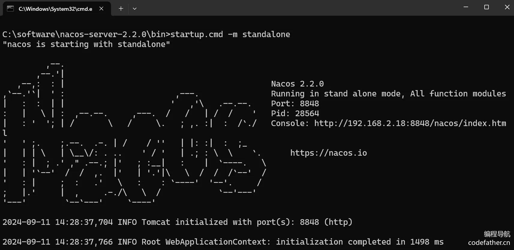

如果报找不到 Java，那就配置 JAVA_HOME、环境变量或者安装 Java：https://www.oracle.com/java/technologies/downloads/#java8

如何使用 Nacos 呢？其实比较简单，直接看教程和示例代码，拿来就能用！

- 文档：https://nacos.io/zh-cn/docs/quick-start.html
- 教程：https://sca.aliyun.com/zh-cn/docs/2021.0.5.0/user-guide/nacos/quick-start
- 示例代码：https://github.com/alibaba/spring-cloud-alibaba/tree/2022.x/spring-cloud-alibaba-examples/nacos-example

#### 3、通过 Nacos 控制台添加配置

1）访问：http://127.0.0.1:8848/nacos ，默认用户名和密码都是 nacos

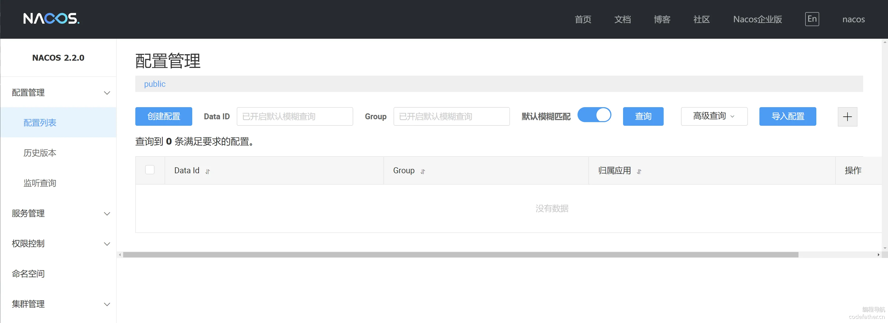

2）点击创建配置：


填写配置，推荐 yaml 格式：

```yaml
blackIpList:
    - "1.1.1.1"
    - "2.2.2.2"
```

如图：


#### 4、项目引入 Nacos 依赖

可以直接使用 Spring Boot Starter 快速引入 Nacos，[参考文档](https://nacos.io/zh-cn/docs/quick-start-spring-boot.html)。

1）在项目 pom.xml 文件中，引入以下依赖配置：

```xml
<dependency>
    <groupId>com.alibaba.boot</groupId>
    <artifactId>nacos-config-spring-boot-starter</artifactId>
    <version>0.2.12</version>
</dependency>
```

注意：版本 0.2.x.RELEASE 对应的是 Spring Boot 2.x 版本，版本 0.1.x.RELEASE 对应的是 Spring Boot 1.x 版本。（经测试，本项目可使用 0.2.12 版本）

2）修改 application.yml 配置文件，添加 Nacos Server 地址等配置：

```yaml
# 配置中心
nacos:
  config:
    server-addr: 127.0.0.1:8848  # nacos 地址
    bootstrap:
      enable: true  # 预加载
    data-id: mianshiya # 控制台填写的 Data ID
    group: DEFAULT_GROUP # 控制台填写的 group
    type: yaml  # 选择的文件格式
    auto-refresh: true # 开启自动刷新
```

#### 5、创建黑名单过滤工具类

新建 blackfilter 包，黑名单过滤相关的代码都放到该包下，模块化。

可以用 Hutool 或 Guava 库自带的 bloomfilter，[参考文章](https://blog.csdn.net/asd051377305/article/details/139684962)，如果是分布式，还可以考虑 Redisson。

此处由于项目已经使用了 Hutool 工具库，就用其自带的 BitMapBloomFilter 即可。

示例代码如下：

```java
@Slf4j
public class BlackIpUtils {

    private static BitMapBloomFilter bloomFilter;

    // 判断 ip 是否在黑名单内
    public static boolean isBlackIp(String ip) {
        return bloomFilter.contains(ip);
    }

    // 重建 ip 黑名单
    public static void rebuildBlackIp(String configInfo) {
        if (StrUtil.isBlank(configInfo)) {
            configInfo = "{}";
        }
        // 解析 yaml 文件
        Yaml yaml = new Yaml();
        Map map = yaml.loadAs(configInfo, Map.class);
        // 获取 ip 黑名单
        List<String> blackIpList = (List<String>) map.get("blackIpList");
        // 加锁防止并发
        synchronized (BlackIpUtils.class) {
            if (CollectionUtil.isNotEmpty(blackIpList)) {
                // 注意构造参数的设置
                BitMapBloomFilter bitMapBloomFilter = new BitMapBloomFilter(958506);
                for (String ip : blackIpList) {
                    bitMapBloomFilter.add(ip);
                }
                bloomFilter = bitMapBloomFilter;
            } else {
                bloomFilter = new BitMapBloomFilter(100);
            }
        }
    }
}
```

注意，BitMapBloomFilter 接受的参数比较特殊，关于如何计算 BloomFilter 参数值，鱼皮在 GitHub 找到了一个说法，可以自行测试：https://github.com/dromara/hutool/issues/3356。

💡 注意，因为 Nacos 配置文件的监听的粒度比较粗，只能知晓配置有变更，无法知晓是新增、删除还是修改，因此不论是选择布隆过滤器还是 HashSet 最方便的处理逻辑就是重建。

#### 6、创建 Nacos 配置监听类

可以直接通过 Nacos 控制台获取示例代码：

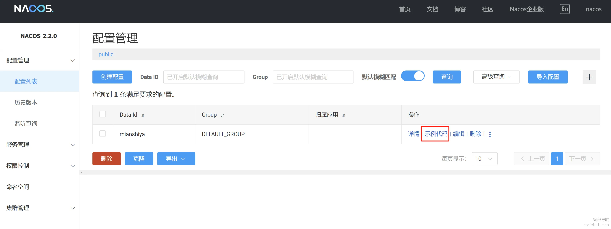

在 blackfilter 包中新增监听器代码，追求性能的话可以自定义线程池：

```java
@Slf4j
@Component
public class NacosListener implements InitializingBean {

    @NacosInjected
    private ConfigService configService;

    @Value("${nacos.config.data-id}")
    private String dataId;

    @Value("${nacos.config.group}")
    private String group;

    @Override
    public void afterPropertiesSet() throws Exception {
        log.info("nacos 监听器启动");

        String config = configService.getConfigAndSignListener(dataId, group, 3000L, new Listener() {
            final ThreadFactory threadFactory = new ThreadFactory() {
                private final AtomicInteger poolNumber = new AtomicInteger(1);
                @Override
                public Thread newThread(@NotNull Runnable r) {
                    Thread thread = new Thread(r);
                    thread.setName("refresh-ThreadPool" + poolNumber.getAndIncrement());
                    return thread;
                }
            };
            final ExecutorService executorService = Executors.newFixedThreadPool(1, threadFactory);

            // 通过线程池异步处理黑名单变化的逻辑
            @Override
            public Executor getExecutor() {
                return executorService;
            }

            // 监听后续黑名单变化
            @Override
            public void receiveConfigInfo(String configInfo) {
                log.info("监听到配置信息变化：{}", configInfo);
                BlackIpUtils.rebuildBlackIp(configInfo);
            }
        });
        // 初始化黑名单
        BlackIpUtils.rebuildBlackIp(config);
    }
}
```

#### 7、创建黑名单过滤器

黑名单应该对所有请求生效（不止是 Controller 的接口），所以基于 WebFilter 实现而不是 AOP 切面。WebFilter 的优先级高于 @Aspect 切面，因为它在整个 Web 请求生命周期中更早进行处理。

请求进入时的顺序：

- WebFilter：首先，WebFilter 拦截 HTTP 请求，并可以根据逻辑决定是否继续执行请求。
- Spring AOP 切面（@Aspect）：如果请求经过过滤器并进入 Spring 管理的 Bean（例如 Controller 层），此时切面生效，对匹配的 Bean 方法进行拦截。
- Controller 层：如果 @Aspect 没有阻止执行，最终请求到达 @Controller 或 @RestController 的方法。

代码如下：

```java
@WebFilter(urlPatterns = "/*", filterName = "blackIpFilter")
public class BlackIpFilter implements Filter {

    @Override
    public void doFilter(ServletRequest servletRequest, ServletResponse servletResponse, FilterChain filterChain) throws IOException, ServletException {

        String ipAddress = NetUtils.getIpAddress((HttpServletRequest) servletRequest);
        if (BlackIpUtils.isBlackIp(ipAddress)) {
            servletResponse.setContentType("text/json;charset=UTF-8");
            servletResponse.getWriter().write("{\"errorCode\":\"-1\",\"errorMsg\":\"黑名单IP，禁止访问\"}");
            return;
        }
        filterChain.doFilter(servletRequest, servletResponse);
    }

}
```

需要在启动类上加上 `@ServletComponentScan`，这样过滤器才会被扫描到。

```java
@SpringBootApplication(exclude = {RedisAutoConfiguration.class})
@MapperScan("com.yupi.mianshiya.mapper")
@EnableScheduling
@EnableAspectJAutoProxy(proxyTargetClass = true, exposeProxy = true)
@ServletComponentScan
public class MainApplication {

    public static void main(String[] args) {
        SpringApplication.run(MainApplication.class, args);
    }

}
```

#### 8、测试效果

通过 Nacos 控制台修改配置，本地测试的话直接加入本机 IP 即可：

```java
blackIpList:
    - "1.1.1.1"
    - "2.2.2.2"
    - "0:0:0:0:0:0:0:1"
```

如图：


Nacos 控制台能看到改动记录：

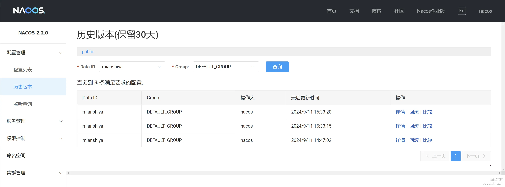

在应用中可以实时接受到配置的修改，使得黑名单实时生效：


通过 Swagger 测试黑名单效果：


### 扩展

1）基于 DFA 实现黑名单过滤

思路：可以自主了解 DFA 算法，通过 Hutool 工具类等现成的库轻松实现，不建议自己写算法。由于有多种黑名单过滤算法，还可以基于策略模式优化代码。

2）配置降级

思路：验证如果从 Nacos 获取配置失败后，应用程序会有什么表现？思考如何防止配置拉取失败的情况，提升应用的稳定性。