#### 本节重点

本节重点内容是项目部署上线，可以独立学习，希望大家能够掌握这种快速上线项目的方法。

包括：

1. 服务器初始化
2. 部署规划
3. 安装依赖
4. 后端部署
5. 前端部署
6. 测试验证
7. 更多扩展

**本项目部署分为核心功能版和扩展版。** 对于大多数同学，只需部署核心功能版，能够正常访问项目的核心功能即可；扩展版会涉及更多依赖的安装，建议是按需部署。

下面我们先讲解核心功能版，再讲解扩展版，循序渐进。

#### 一、服务器初始化

首先购买一台服务器，各大云服务商的新用户都有优惠，推荐先看 [最新活动](https://cloud.tencent.com/act) 页面。如图：

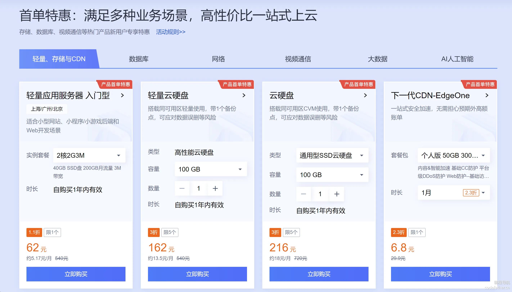

推荐购买轻量应用服务器，提供了很多开箱即用的模板，帮我们预装了环境和软件，省时省力。

鱼皮这里选择一台预装了宝塔 Linux 应用的轻量应用服务器，配置为 2 核 2 G，部署咱们的项目（核心功能版）足够了。**但一定要注意，操作系统如果是 CentOS，必须 >= 8，否则无法支持本项目的前端部署！** 一般选择最新版本就好了，如下图：

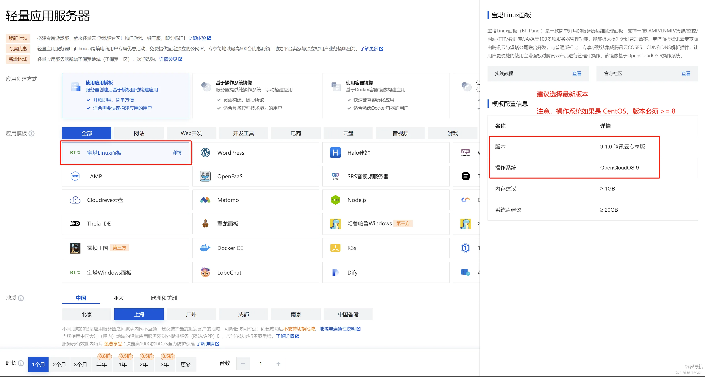

宝塔 Linux 是一个可视化 Linux 运维管理工具，提供了很多帮助我们管理服务器的功能，适合中小团队或者个人学习使用。

购买好服务器后，进入控制台，可以看到新增的服务器信息，注意不要主动对外暴露公网 IP！


点击服务器进入详情页，在防火墙标签页中放通 8888 宝塔面板端口，否则无法在自己的电脑上访问宝塔。


新增一条防火墙规则：


进入应用管理标签页，登录宝塔。

首次登录时，需要先登录服务器，通过输入命令的方式获取宝塔默认账号密码，如图：


点击登录后，进入到 web 终端，复制脚本并执行：

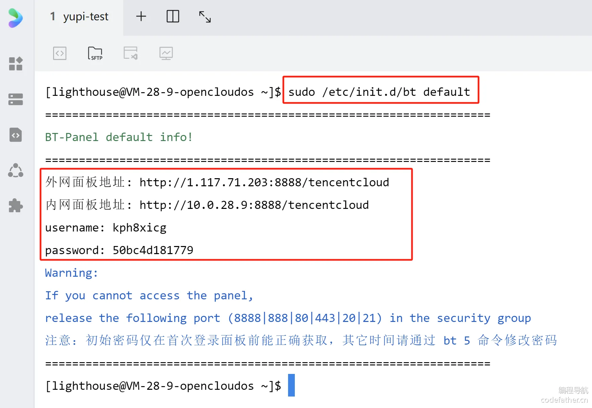

根据终端输出的信息，访问宝塔面板，输入初始用户名和密码：

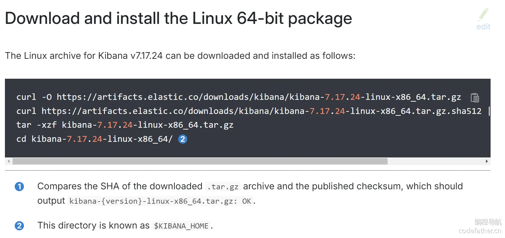

首次进入宝塔时，会提示我们安装环境，这里推荐安装 LNMP（包含 Nginx 服务器），适合部署前后端分离的项目：


首次进入宝塔面板时，记得修改面板账号密码（每次修改完都要重新登录）：


#### 二、部署规划

在正式操作前后端部署前，我们要先进行一个规划，比如要部署哪些项目和服务、需要哪些依赖、占用哪些端口等。

##### 1、获取源码

本项目代码开源：https://github.com/liyupi/mianshiya-next

鱼皮专门提供了一个便于上线部署的版本（核心功能版），建议从这里下载源码：https://github.com/liyupi/mianshiya-next/releases/tag/publish

##### 2、部署方案

为了方便，本项目前端和后端均使用宝塔面板进行部署，可以很方便地管理服务器。

涉及到具体的部署方式，前端要遵循 Next.js 服务端渲染的部署模式，基于 Node.js 运行；后端可以直接运行 jar 包。

在鱼皮编程导航的 [AI 答题应用平台项目](https://www.code-nav.cn/course/1790274408835506178) 中，讲解过 Vercel + Docker + 云托管平台的部署方式，感兴趣的同学可以学习。基本上学会这 2 种部署方式，能够应对绝大多数部署需求了。

##### 3、地址规划

前端：通过 Nginx 进行部署，访问地址为 `http://{域名}`。由于是 Node 服务，实际运行在 3000 端口。

后端：通过 Nginx 进行转发，访问地址为 `http://{域名}/api`。实际运行在 8101 端口。**JDK 建议选择 17 版本！**

为什么要用 Nginx 转发？

前端和后端域名一致，保证不会出现跨域问题。

Nginx：服务器 80 端口，默认已安装。

数据库：服务器 3306 端口，默认已安装。

Redis：服务器 6379 端口，需要手动安装。

##### 4、注意事项

做好规划后，我们需要在腾讯云控制台的防火墙中开通需要外网访问的服务端口：


#### 三、安装依赖

##### 1、Node 环境

进入宝塔面板 - 网站 - Node 项目，会提示安装 Node 版本管理器，点击安装：

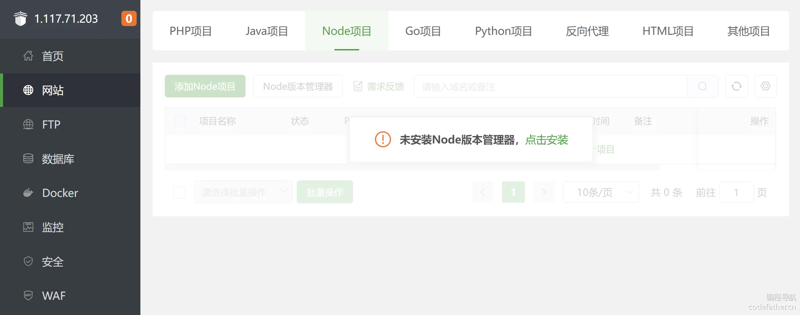

选择稳定版本：

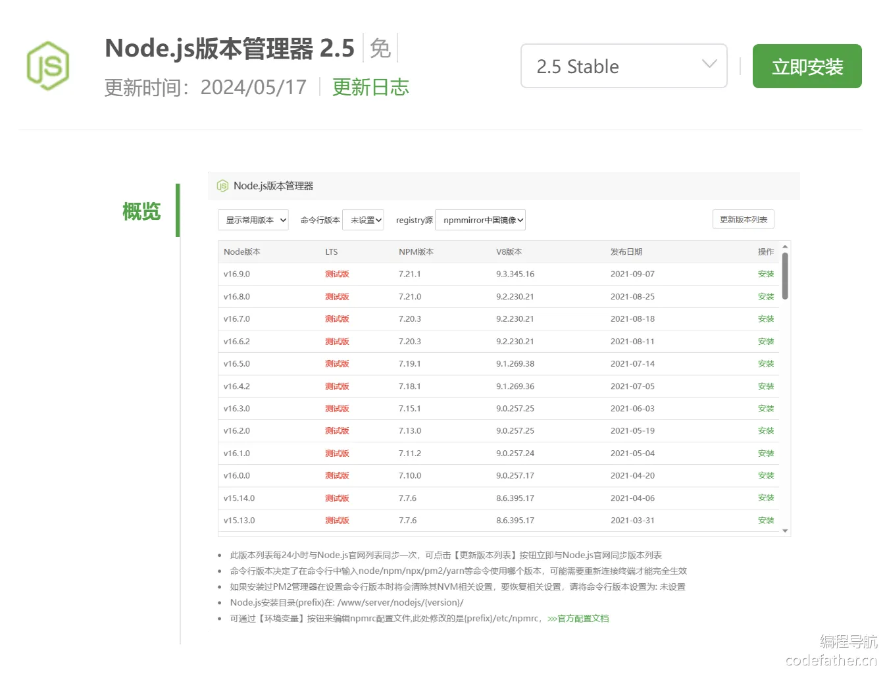

然后就可以用它来安装 Node.js 版本了，首先要更新版本列表，然后选择 > 18.18.x 的稳定版本，此处鱼皮选择 v20.17.0 安装：


##### 2、数据库

宝塔面板已经自动安装 MySQL 数据库，我们可以直接使用。

先为后端项目添加一个数据库。数据库名称和我们项目需要的数据库名称保持一致（此处为 mianshiya），注意用户名、密码和访问权限：

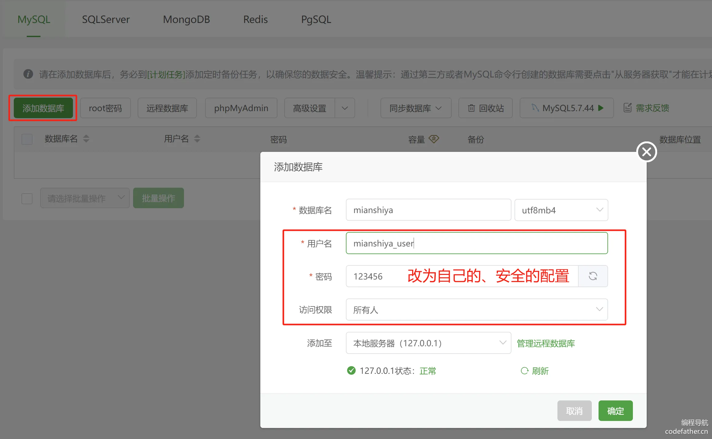

在 IDEA 中打开后端项目，通过数据库面板在本地检查连接是否正常：

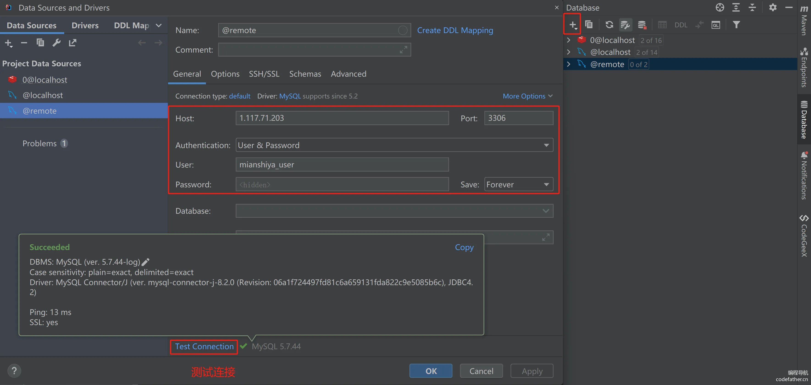

执行脚本，初始化库表：


还可以导入初始示例数据：


记得验证数据库表是否创建成功，如下图：

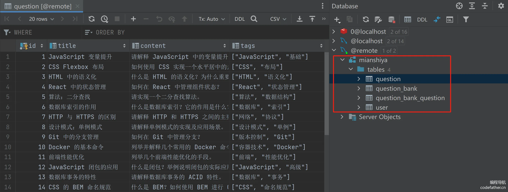

##### 3、Redis

在宝塔面板的软件商店中，搜索并安装 Redis：


版本选择默认的即可：


安装完成后，需要配置 Redis，开启远程访问并配置密码，否则我们自己的电脑是无法连接 Redis 的：


修改配置后，一定要重载配置：


最后，在 IDEA 数据库面板中验证本地能否连接远程 Redis：

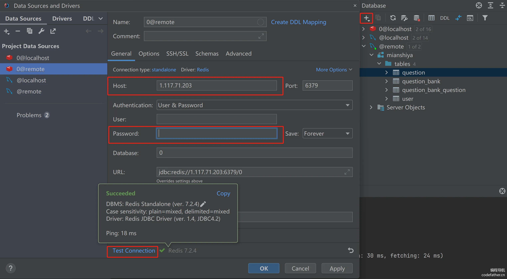

##### 4、Java 环境

要部署 Java 项目，必须安装 JDK。在宝塔面板中，可以通过下图的方式快速安装指定版本的 JDK。


建议多安装几个版本，比如 JDK 8、11、17，需要用哪个版本的时候可以随时切换。

------

接下来，我们分别进行后端和前端部署。**注意，由于前端 Next.js 服务端渲染项目部署时会调用后端接口，所以必须先部署后端。**

#### 四、后端部署

##### 1、修改配置和代码

修改 `application-prod` 生产环境配置，包括数据库、Redis 等，替换为上述安装依赖时指定的配置（如用户名、密码）。

参考配置如下：

```yaml
# 线上配置文件
# @author <a href="https://github.com/liyupi">程序员鱼皮</a>
# @from <a href="https://code-nav.cn">编程导航</a>
server:
  port: 8101
spring:
  # 数据库配置
  # todo 需替换配置
  datasource:
    driver-class-name: com.mysql.cj.jdbc.Driver
    url: jdbc:mysql://1.117.71.203:3306/mianshiya
    username: mianshiya_user
    password: 123456
  # Redis 配置
  # todo 需替换配置
  redis:
    database: 0
    host: 1.117.71.203
    port: 6379
    timeout: 5000
    password: 123456
mybatis-plus:
  configuration:
    # 生产环境关闭日志
    log-impl: ''
# 接口文档配置
knife4j:
  basic:
    enable: true
    username: root
    password: 123456
```

##### 2、打包部署

在 IDEA 中打开后端项目，忽略测试并打包：

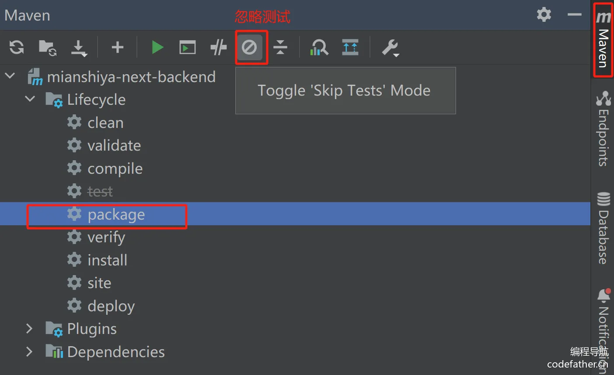

打包成功，得到 jar 包文件：

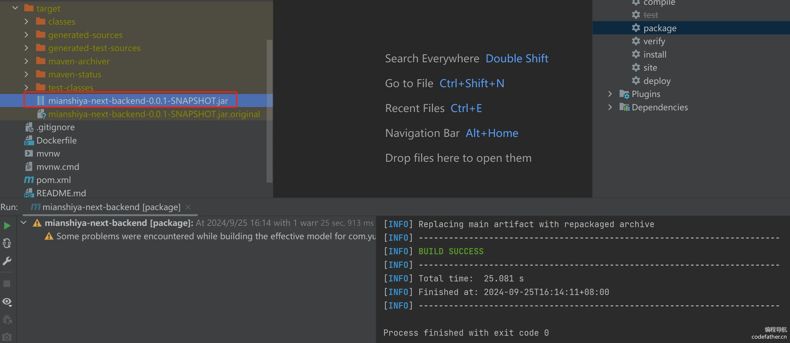

上传 jar 包到服务器：

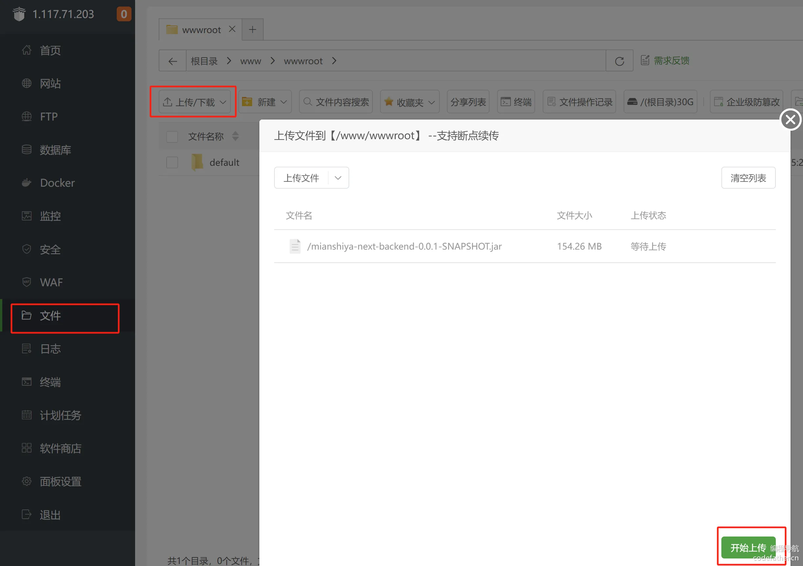

然后添加 Java 项目，**注意端口要和生产环境的配置保持一致，并且项目执行命令中，要指定生产环境的配置！**


启动成功后，能够看到状态和端口占用如图：


如果发现启动失败，需要先观察日志，下图仅为一个示例：

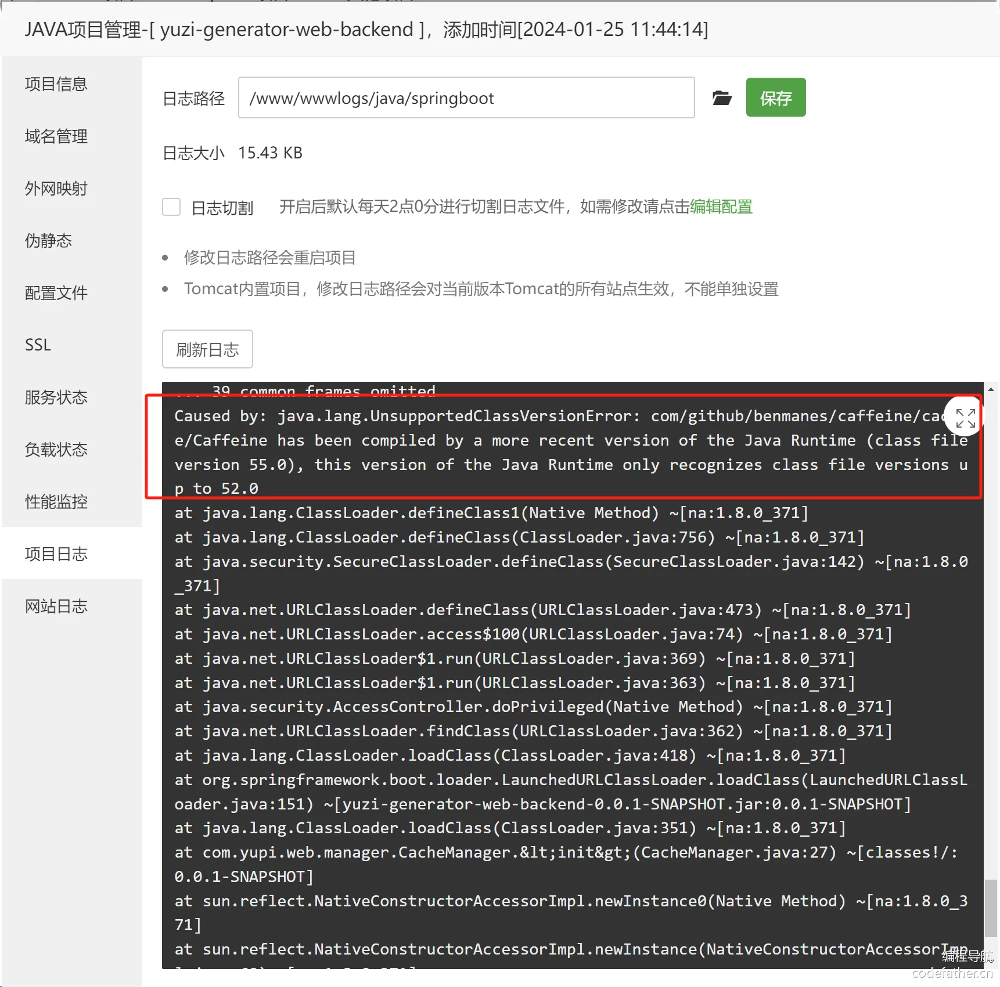

上述步骤中，我们使用 JDK 8，项目也能正常运行。但如果后续要部署更多扩展（比如 HotKey 等），可能就需要用 JDK 17 了。

但是，我们现在无法通过浏览器访问接口文档：http://1.117.71.203:8101/api/doc.html


这是因为我们的服务器防火墙没有放开 8101 端口。**这里我们故意不放开**，因为在之前的部署规划中，后端需要通过 Nginx 进行转发，从而解决跨域问题。

##### 3、Nginx 转发

新建一个站点（Nginx），域名填写当前服务器 IP 或者自己的域名，根目录随意填写即可。

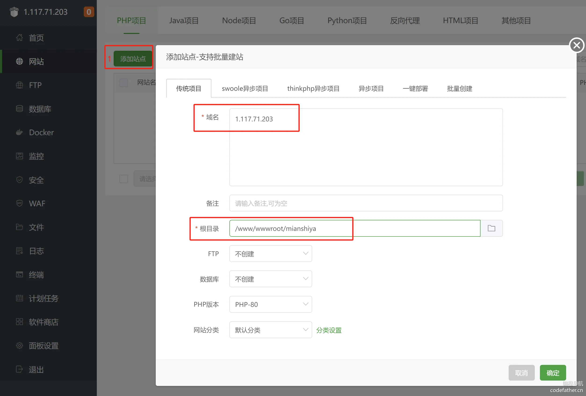

如果访问的是后端接口（地址有 `/api` 前缀），则 Nginx 将请求转发到后端服务，对应配置代码如下：

```nginx
location /api {
  proxy_pass  http://127.0.0.1:8101;
  proxy_set_header Host $proxy_host;
  proxy_set_header X-Real-IP $remote_addr;
  proxy_set_header X-Forwarded-For $proxy_add_x_forwarded_for;
  proxy_buffering off;
  proxy_set_header Connection "";
}
```

修改 Nginx 配置如图：

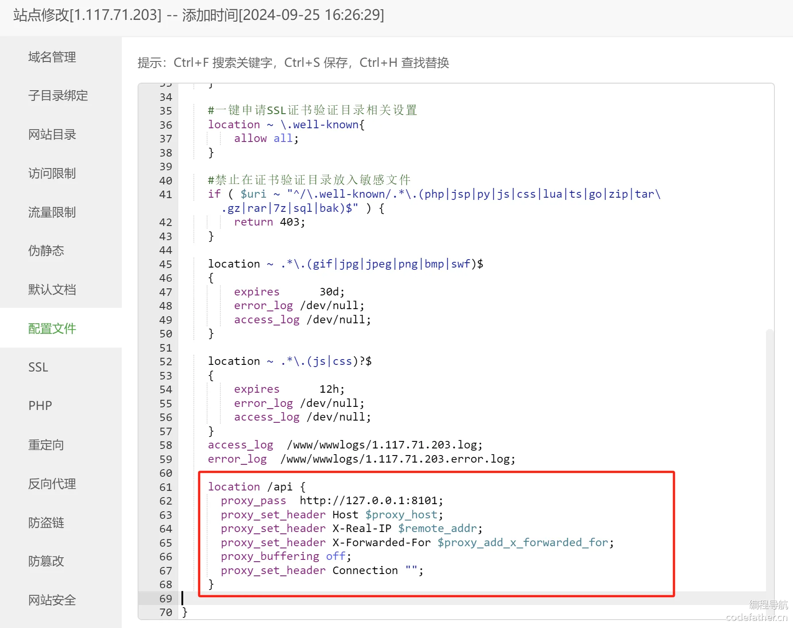

修改完后，就可以通过 80 端口（可以省略）访问到接口了。

**一定要注释掉下列配置！**否则访问接口文档时，静态资源的加载可能会出错：


#### 五、前端部署

前端部署可以参考 Next.js 官方文档：https://nextjs.org/docs/app/building-your-application/deploying

此处采用自部署的方案：https://nextjs.org/docs/app/building-your-application/deploying#nodejs-server

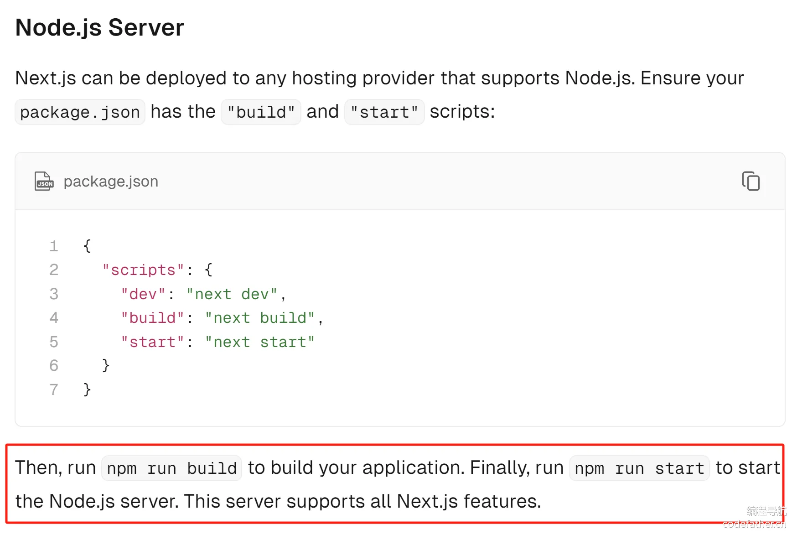

##### 1、修改配置

线上的前端需要请求线上的后端接口，所以需要修改 `request.ts` 文件中的请求地址为线上：

```typescript
// 创建 Axios 实例
// 区分开发和生产环境
const DEV_BASE_URL = "http://localhost:8101";
const PROD_BASE_URL = "http://1.117.71.203";
const myAxios = axios.create({
  baseURL: PROD_BASE_URL,
  timeout: 10000,
  withCredentials: true,
});
```

也可以采用配置文件区分开发环境和部署环境，参考官方文档：https://nextjs.org/docs/app/building-your-application/configuring/environment-variables

##### 2、打包部署

1）修改 Next.js 配置文件 `next.config.mjs`，使用 standalone 模式部署，这样上传到服务器的时候可以不用上传 node_modules 目录。

```nginx
/** @type {import('next').NextConfig} */
const nextConfig = {
    output: "standalone",
};

export default nextConfig;
```

2）执行 `package.json` 文件中定义的 `build` 命令，执行打包构建。

注意，如果 Node.js 版本较低，会构建失败，这时可以到 [官网](https://nodejs.org/zh-cn) 安装更新的版本，比如 v20.17.0 等长期支持版本。

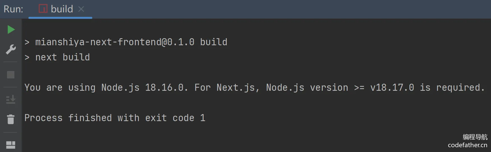

如果构建过程中出现其他错误，需要根据错误信息排查并处理。比如下面这个示例，显然是 TypeScript 类型错误：

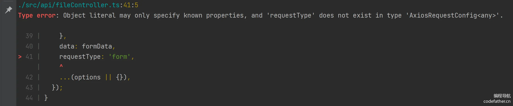

找到 fileController 文件，加个 `// @ts-ignore` 就好了：


可能还会遇到其他因为类型的错误，这类错误不影响运行，但是会在 Next.js 打包时被检测，可以根据实际情况修改。或者直接在打包时忽略 TypeScript 错误，参考官方文档：https://nextjs.org/docs/pages/building-your-application/configuring/typescript#ignoring-typescript-errors

修改 next.config.mjs 配置文件：

```nginx
/** @type {import('next').NextConfig} */
const nextConfig = {
    typescript: {
        // !! WARN !!
        // Dangerously allow production builds to successfully complete even if
        // your project has type errors.
        // !! WARN !!
        ignoreBuildErrors: true,
    },
};

export default nextConfig;
```

**注意，如果后端接口没启动，也可能会导致打包错误！**

打包成功后，看到下图信息，能够很直观地看到哪些页面用到了静态渲染和服务端渲染：

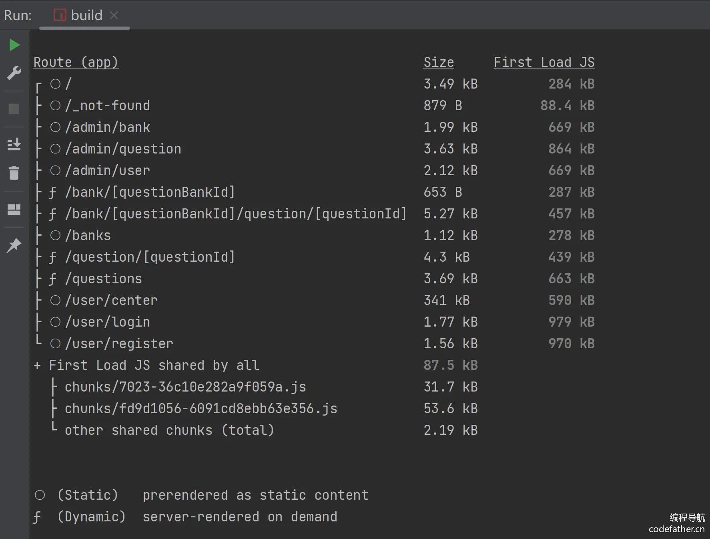

然后在 .next 目录下会生成 standalone 目录，该目录就是可以独立部署的前端包。**但是必须按照如下模式组织目录，一定不能有错！**

1. 将项目根目录下的 public 目录移动到 .next/standalone 内
2. 将 .next/static 目录移动到 .next/standalone/.next 内

组织好的目录结构如下：

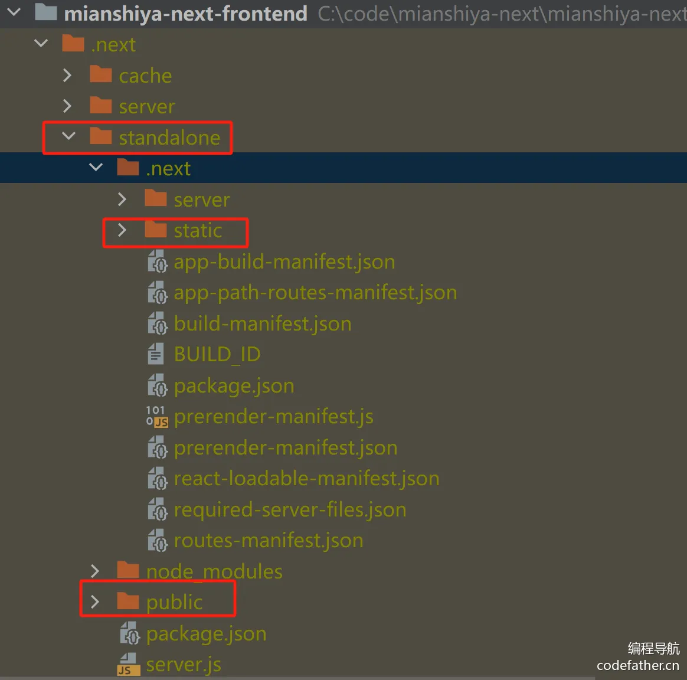

把 standalone 目录下的所有文件上传到服务器上（可以新建一个 mianshiya-frontend 目录），建议先在本地压缩，上传压缩包到服务器后再解压。解压之后再在该路径打开终端执行 `npm install` 如图：

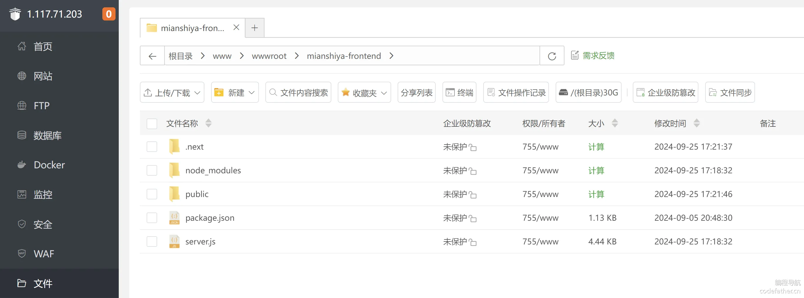


上传到服务器后，添加 Node 项目。注意修改启动选项（start 或者自定义命令 `node server.js`）和项目端口（3000）：

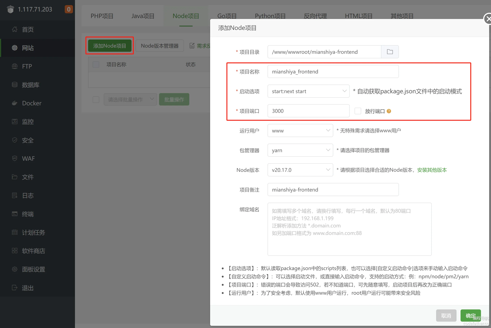

##### 3、Nginx 转发

修改 Nginx 配置，访问前端资源时，反向代理到 Node.js 服务：

```nginx
location / {
  proxy_pass  http://127.0.0.1:3000;
  proxy_set_header Host $proxy_host;
  proxy_set_header X-Real-IP $remote_addr;
  proxy_set_header X-Forwarded-For $proxy_add_x_forwarded_for;
  proxy_buffering off;
  proxy_set_header Connection "";
}
```

**一定要注释掉下列配置！让静态资源能够正确被反向代理。**否则访问页面时，静态资源的加载可能会出错：


#### 六、测试验证

最后，我们来对上线效果进行验证。

##### 1、页面验证

访问主页、题库大全页、题目大全页，都能正常访问：

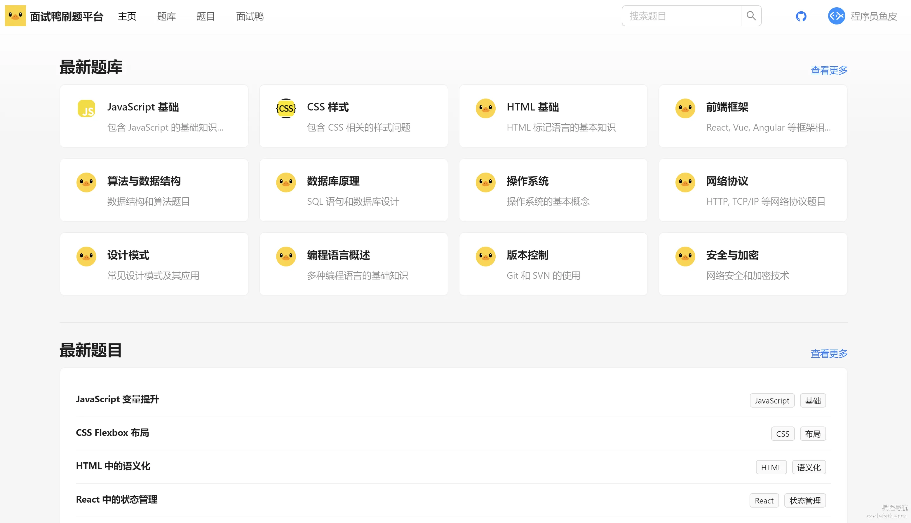

访问题库详情页，正常显示：

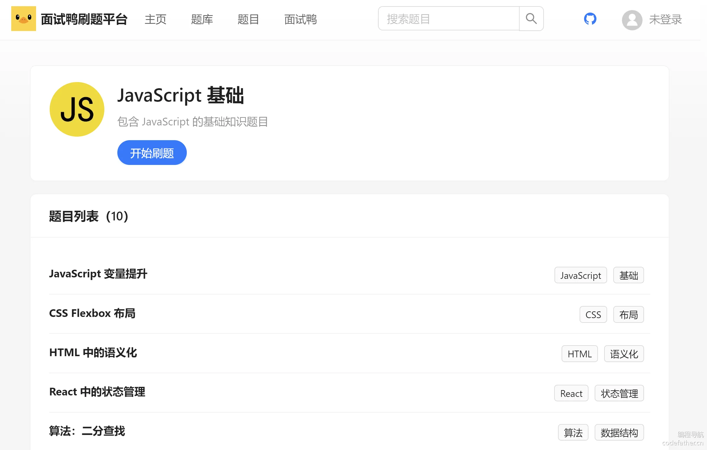

登录管理员账号，可以正常访问和使用管理能力：


但是我们会发现，访问题目详情页时，会出现服务端渲染错误：

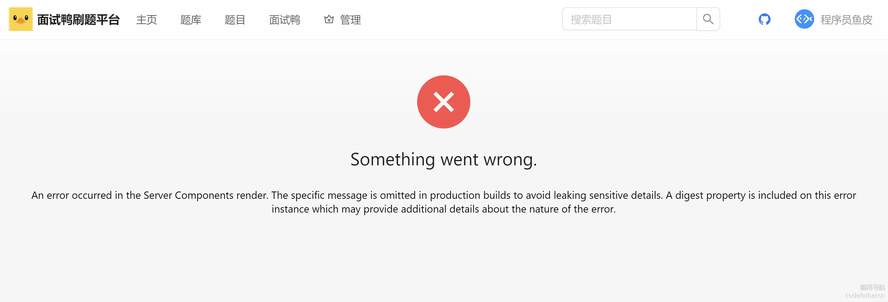

而且当你更新了主页展示的题库信息（比如图片）后，无论怎么刷新页面，展示的还是之前的内容。

下面我们依次解决这两个问题，也能进一步带大家了解服务端渲染。

##### 2、修复题目详情页加载错误

可以在宝塔 Node 项目管理器查看项目日志，不过由于我们在项目中并没有手动打印服务端日志，所以得不到什么有效信息，难以定位问题。


而且由于下列代码是在服务端执行的，但 message.error 调用是在客户端弹窗，所以会直接报“在服务端调用客户端函数”的错误，而不是触发我们自己的降级逻辑。

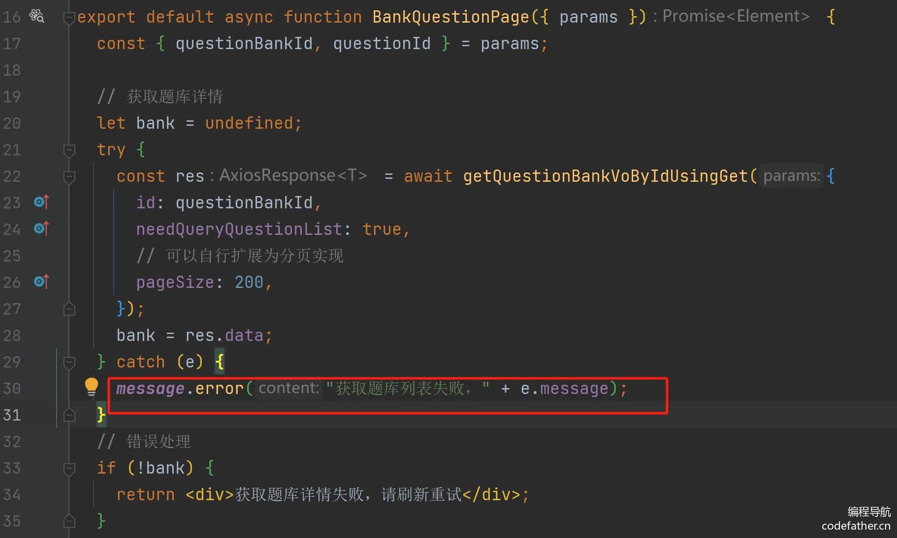

所以应该将项目中服务端渲染发送的请求对应的 catch 内的代码改为打印错误日志，如图：


再次部署，然后访问题目详情页，这次会显示我们自己的报错文案：


查看服务器的 Node 项目日志，发现调用获取题目详情接口失败了：

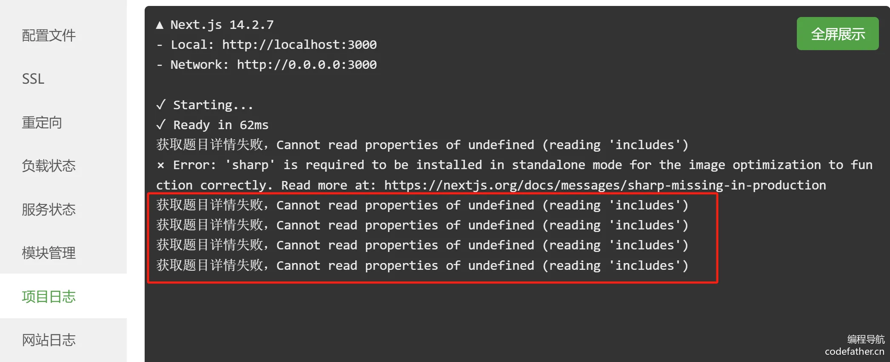

查看后端日志，发现抛了未登录异常：

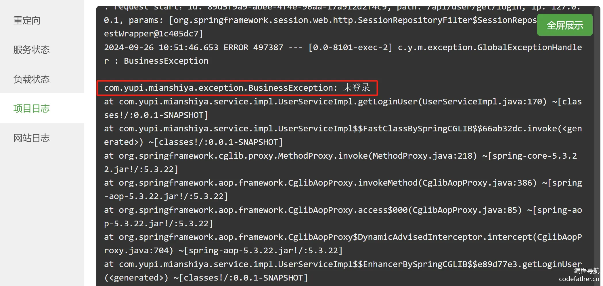

这是由于我们为了限制爬虫，要求获取题目详情接口必须要有登录权限才能调用。想解决这个问题，有 2 种方法：

1. 不再要求强制登录，仅对已登录用户进行反爬。
2. 整个接口都不再抛出未登录异常。如果未登录，允许获取部分题目内容（比如标题）并返回；仅登录用户才能获取答案。

这里我们先采用方法 1，最省事：

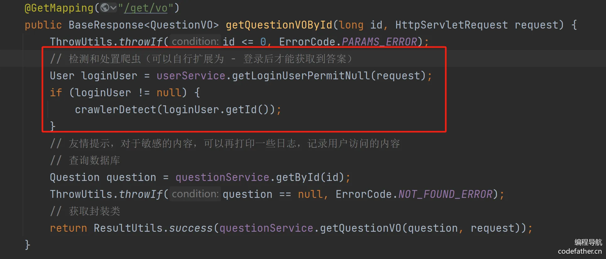

注意 getLoginUserPermitNull 方法中，即使用户未登录，也不会抛出异常，而是返回 null：


重新打包部署后端，然后访问题目详情页，这次不会出现报错：


但是大家会发现，这个页面转瞬即逝，会被重定向到登录页。这是因为之前我们开发过用户刷题记录功能，这个接口需要用户登录。如果要解决这个问题，可以在前端增加判断（仅登录才调用该接口），或者后端兼容未登录的情况，可自行修改。

##### 3、修复页面未更新问题

为什么修改了主页题库的图片后，页面不会发生更新呢？

还记得么，前端打包成功时，输出了一些信息：

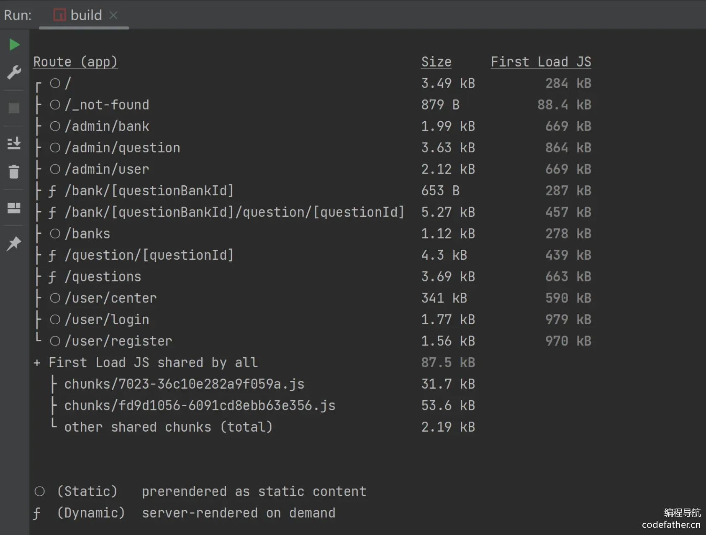

显然，主页、题库大全页都被渲染为了静态内容，无论接口返回的数据怎么修改，都不会影响静态文件。

为了解决这个问题，我们只需要将页面强行设置为服务端渲染（而不是静态生成）即可。

Next.js 提供了缓存控制机制，可以通过在页面文件内导出一些变量来控制缓存行为（比如禁止缓存、或者多久多期），参考官方文档：

- https://nextjs.org/docs/app/building-your-application/caching#segment-config-options
- https://nextjs.org/docs/app/building-your-application/caching#opting-out-2

我们只需要在不需要缓存的页面开头添加下列代码，就能强制要求每次请求时都从后端重新获取数据：

```javascript
export const dynamic = 'force-dynamic';
```

注意，加上这行代码后，页面开头就不能再写 `use server` 了，如图：


再次构建，主页被成功识别为了动态页面：


重新部署，并验证效果，会发现数据能够被正确更新。

💡注意，如果使用 Node 原生的 fetch 请求数据，就可以使用它内置的缓存机制。但我们项目中用的是 Axios，只能使用上述方式手动控制缓存了。

#### 七、更多扩展

对大家学习来说，其实没必要自己挨个去部署更多中间件了，但如果你是做企业真实项目，按需部署即可。

每个扩展的部署流程基本都是一样的：

1. 参考官方文档，在服务器上安装中间件
2. 在云服务器防火墙开启端口，支持远程访问
3. 修改项目配置文件，连接到服务器上安装的中间件
4. 开启相应的代码

下面给大家划一下部署重点，包括 Elasticsearch、HotKey、Sentinel 和 Nacos。

##### 1、Elasticsearch

对应第 5 节教程的分词题目搜索功能。影响范围：题目搜索接口、ES 定时同步任务


取消注释开启 ES：


部署 Elasticsearch 可参考官方文档：https://www.elastic.co/guide/en/elasticsearch/reference/7.17/targz.html

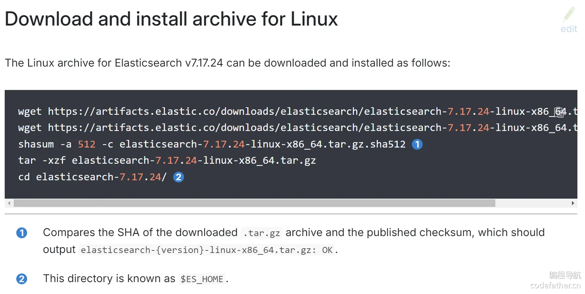

部署 Kibana 可参考官方文档：https://www.elastic.co/guide/en/kibana/7.17/targz.html


基本都是直接下载安装包后解压，修改下配置就能运行了。注意，最好修改下 Elasticsearch 和 Kibana 的配置文件，设置访问密码，否则别人直接就把你的数据偷光光了。[可以参考教程](https://www.jianshu.com/p/6f93fc27df48)

部署完成后，需要像之前讲解过的本地操作一样，在 ES 新建索引、首次启动时执行全量数据同步任务、之后只执行定时数据同步任务。

##### 2、HotKey

对应第 6 节教程的自动缓存热门题库功能。影响范围：HotKey 配置类、获取题库接口

由于 HotKey 的 jar 包是通过本地 lib 引入的，如果不进行一些额外的打包配置，生成的 jar 包不会包含 HotKey 依赖，所以核心功能版中要注释下列代码。

可以取消注释开启 HotKey：


取消注释开启 HotKey：


可以 [参考官方文档](https://gitee.com/jd-platform-opensource/hotkey#安装教程) 部署 HotKey，核心流程是先部署 Etcd、然后部署 HotKey Worker、最后部署 HotKey Dashboard，**注意打开服务器防火墙对应端口才能访问**。

HotKey Worker 大家如果自己无法打包成功，可以使用鱼皮给大家提供的，在本项目之前的教程中有资源包下载入口。

注意！由于我们的 HotKey 客户端是从本地 lib 目录引入的（system 方式引入），直接 `mvn package` 可能无法引入该依赖。需要修改 pom.xml 中的打包插件配置，追加一行 `includeSystemScope` 就可以了：

```xml
<build>
  <plugins>
    <plugin>
      <groupId>org.springframework.boot</groupId>
      <artifactId>spring-boot-maven-plugin</artifactId>
      <configuration>
        <includeSystemScope>true</includeSystemScope>
        <excludes>
          <exclude>
            <groupId>org.projectlombok</groupId>
            <artifactId>lombok</artifactId>
          </exclude>
        </excludes>
      </configuration>
    </plugin>
  </plugins>
</build>
```

##### 3、Sentinel

对应第 7 节教程的网站流量控制和熔断功能。影响范围：分页获取题库列表接口、分页获取题目列表限流接口


Sentinel 对项目的侵入性很小，无论是否启动 Sentinel，项目代码都可以正常运行。

部署 Sentinel 可参考官方文档：https://sentinelguard.io/zh-cn/docs/dashboard.html

##### 4、Nacos

对应第 7 节教程的动态 IP 黑名单过滤功能。影响范围：Nacos 监听类、全局黑名单过滤器

全局黑名单过滤器的代码如下，不需要的话注释掉 WebFilter 注解即可：

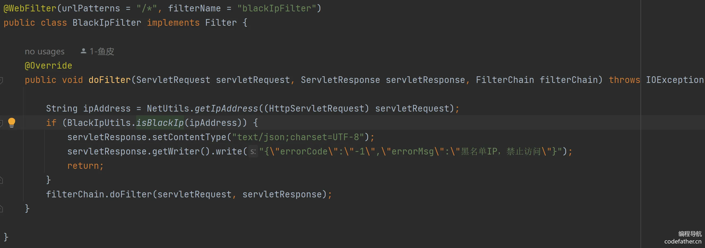

不启动 Nacos 时，项目代码应该也可以正常运行。如果因为未启动 Nacos 导致报错，可以注释掉 NacosListener 的 Component 注解：

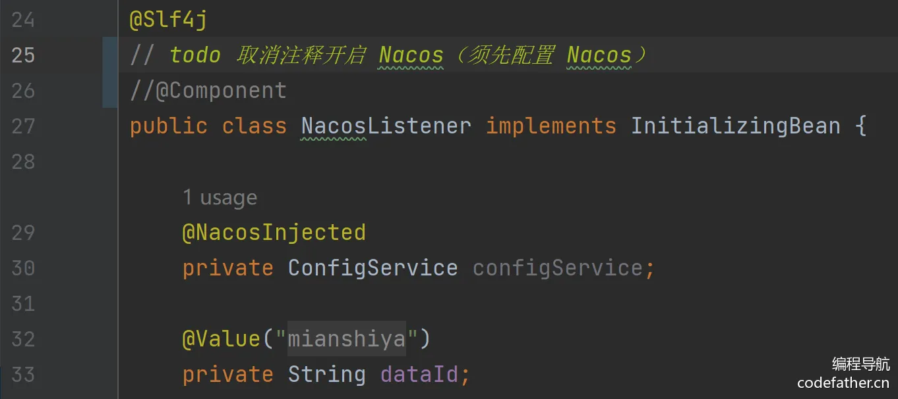

但是这样就不会执行初始化黑名单工具类中的 BloomFilter 实例了，所以需要给它一个默认值：


部署 Nacos 是比较简单的，但是需要注意版本跟项目依赖保持一致（本项目是 v2.2.0），可参考 [官方文档](https://nacos.io/docs/v2/quickstart/quick-start/) 。企业中一般会采用集群方式部署，可以 [参考这个文档](https://nacos.io/docs/v2/guide/admin/cluster-mode-quick-start/) 。

#### 最后

至此，整个项目已经完成上线，希望大家能通过这个项目掌握企业级项目的开发、优化和上线方法，得到全方面编程技能和程序员素养的提升。

#### 本期作业

1）完成项目的上线

2）尝试给项目绑定域名、或者申请 HTTPS 证书（通过自行查阅资料实现）

3）完成整个项目，并且自行增加 2 - 3 个扩展点，可以新增功能、也可以是某个优化、还可以将其他项目的知识点融合到本项目中。
