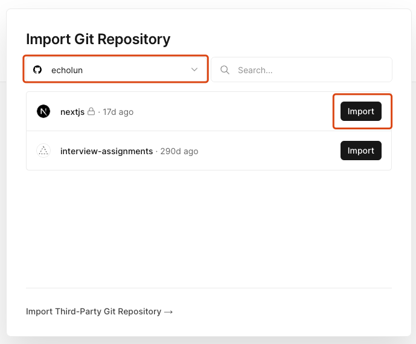
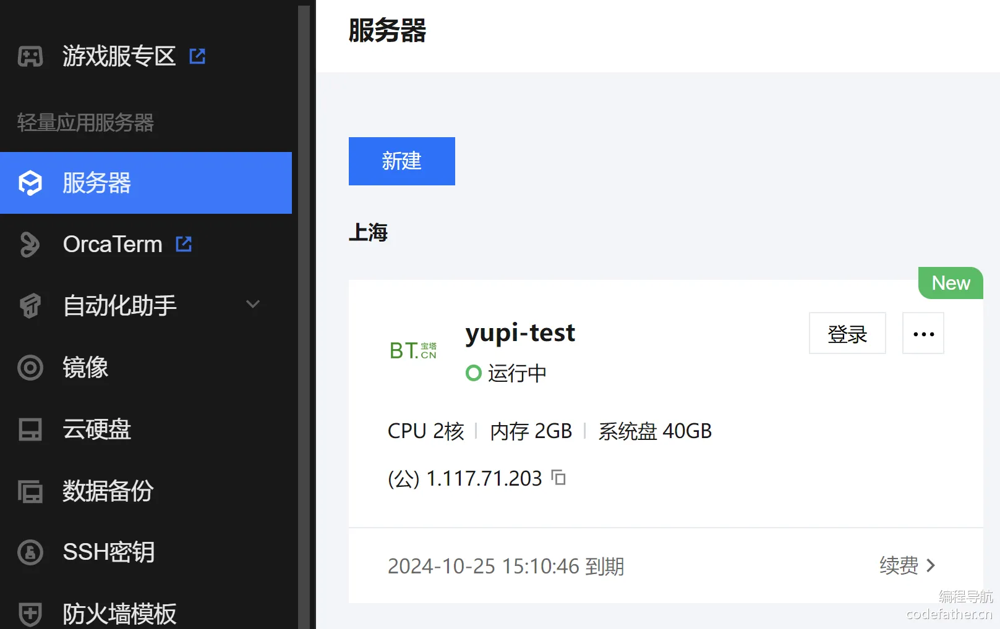
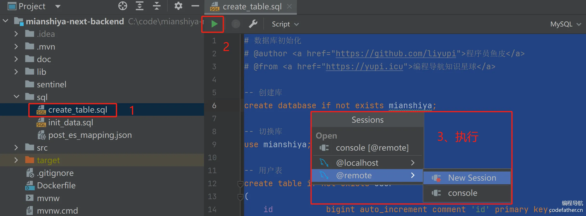
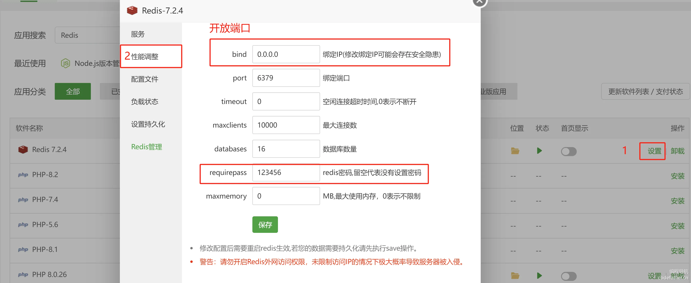
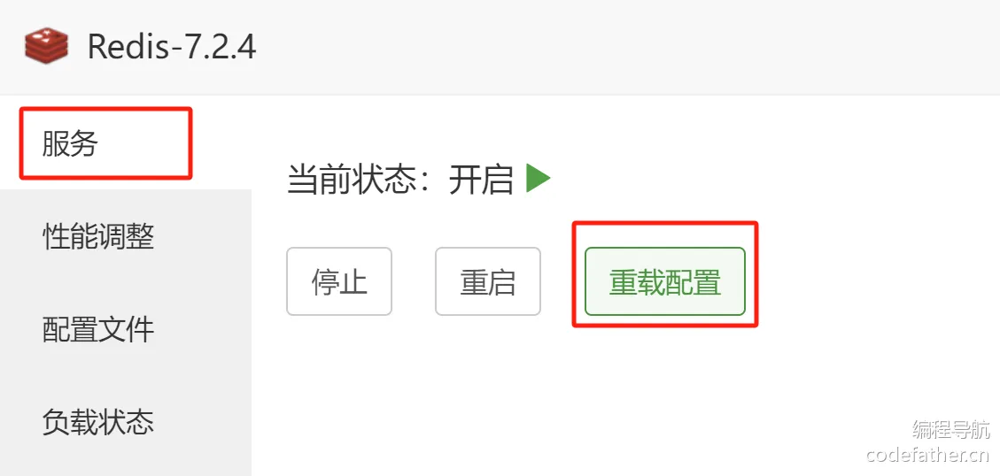
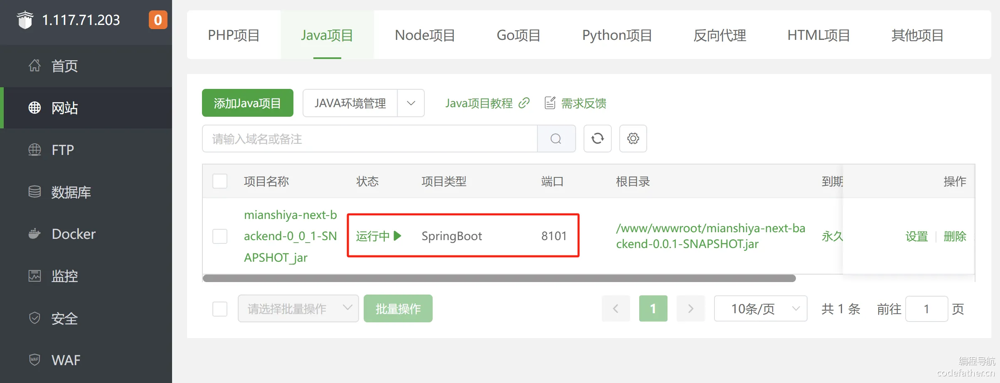
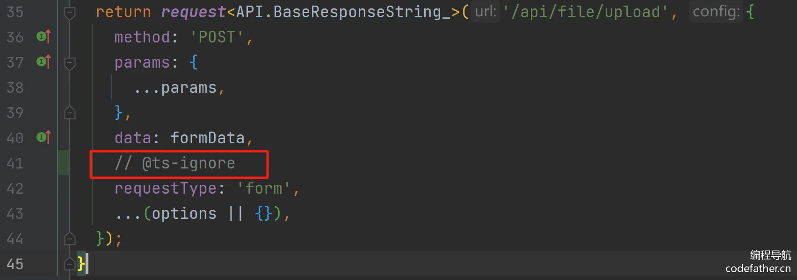
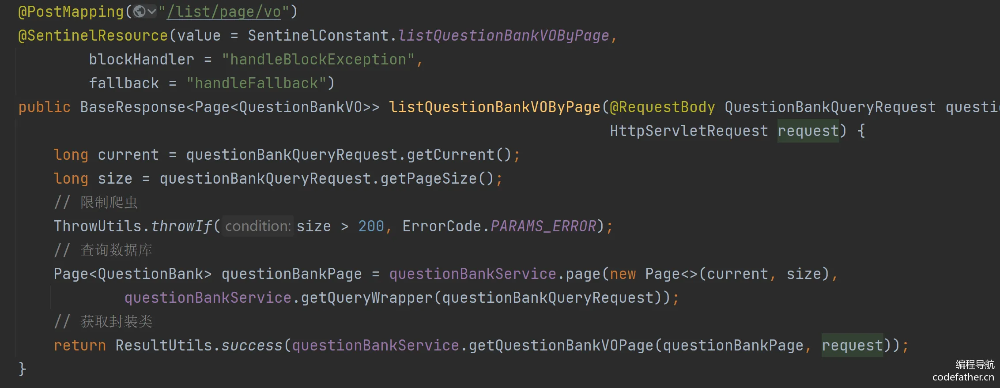
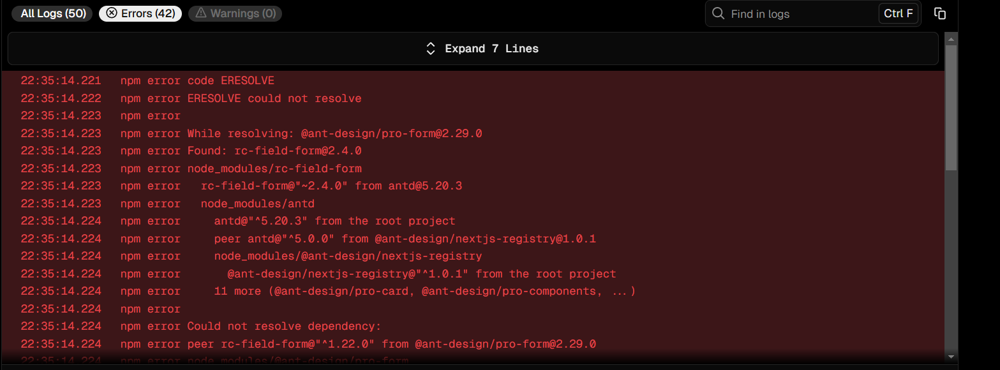

## Vercel

###  1.关于 vercel

Vercel 是一个云服务平台，支持静态网站和动态网站的应用部署、预览和上线。如果你用过 GitHub Pages ，那么心里可能不会太陌生，但你也能通过 vercel 集成 GitHub 后后，在 GitHub 项目进行代码推送，PR合并自动部署的目的，且你不需要考虑服务器问题。

与其说这是 vercel 可行性调研方案，不如说是 vercel 用法普及，因为 vercel 自身内置 CI CD，只要你将项目与 vercel 关联，你就能通过命令快速部署，这没什么难度，接下来给大家讲解 vercel 优势、部署方式、能力边界以及接下来工作可能要思考的点。

### 2.Vercel 优势（能带来什么）

使用 vercel 能为我们带来什么？关于 vercel 能力优势，这里我根据我个人使用体验简单罗列：

- 个人版永久免费，每个月 100G 带宽（别人访问你的项目所耗费的流量），个人项目部署完全够用，需要注意的是团队模式收费，所以要协作你只能付费。
- 内置 CI CD，你可以理解成一个黑盒，项目丢进去，只需要将项目导入 vercel ，一句命令自动部署。
- 因为内置构建流程，支持代码推送、PR 自动触发构建，不同分支唯一地址，方便测试。
- 支持本地、测试、生产三种环境部署，仅仅是命令区别，上手成本极低。
- 丰富的集成能力，项目部署自动监控，端到端自动化测试等等，当然这些并并属于 vercel 自身的能力，但它可以为你提供集成入口，让这些成为你自动部署中自动进行的一步，比如构建生产后自动完成性能指标输出，自动化测试，以及后续项目监控等等。

### 3.部署方式

将项目导入 vercel 后，vercel 会自动检测并为项目所用的框架设置最佳构建配置和部署配置，这也是为什么导入项目就能直接构建的一部分原因，我们先说两种导入项目到 vercel 平台的两种方式。

#### 3.1 GitHub部署

在 dashboard 点击 `Add New` 按钮选择 `Project`，这时会跳转到导入项目界面，选择你的 GitHub 账号（如果之前没绑定这里也可以绑定 GitHub 账号），然后点击导入按钮，这是会跳转到项目设置。





比如这里我提前把 vercel 官方的 next 模版项目克隆到了我的 GitHub 账户，并在这里尝试导入这个 next 项目，可以看到 vercel 自己识别到项目所用框架是 nextjs ，以及构建命令会自动识别成 `npm run build`，当然如果项目框架识别不准，你自己的项目可能后续使用了 `pnpm `等其它命令，所以这些配置在此时都可以根据实际情况修改，这里我们直接默认。

直接点击下面的 Deploy 进行部署，然后坐等构建就能看到 vercel 为我们部署后独一无二的预览地址了。

由于实际开发，我们本地肯定也会克隆 GitHub 项目，那么在后续只要我们修改项目代码，push 到仓库，GitHub 感知到代码变动，vercel 就会自动再次部署。

你可能会想，我 GitHub 项目拷贝下来会有主分支，以及我的开发分支，vercel 虽然能自动部署，它怎么知道我要部署到什么环境，事实上 vercel 也已经做了提前预设，假设你的代码变动发生在 `main` 或者 `master` 分支，那么 vercel 就会自动构建部署生产环境，除此之外的分支，vercel 都会更新预览（测试）环境。

关于 GitHub 主分支，你可以在 GitHub 进行设置，这个 vercel 无需感知，反正是主分支变动它会对应帮你部署就完事了。

另外，让远程仓库代码变动有两种方式，第一种是直接本地推送代码，第二种就是提 PR 后合并到目标分支触发变动。

假设你集成了 GitHub ，在你 PR 合并前，你甚至能在 GitHub PR 中直接看到你需要提 PR 的分支部署后的预览地址，直接看 vercel 帮你部署后的效果。


上图就是我基于主分支 `main` 切出了一个开发分支 `main-echo`，然后给 `main` 分支提了一个 PR，在 PR 合并页面你能看到 GitHub 这里直接给出了 `main-echo` 分支的部署预览地址，之后我们合并 PR ，由于 `main` 分支代码发生改变，vercel 会自动帮你构建部署 `main` 分支，好处就是能保证每次部署前，你能直接看每个分支效果是否符合你的预期。


可以看到 PR 合并后，vercel 这边已经帮我更新了生产环境，且提交记录与 GitHub 保持一致。

#### 3.2 本地部署

有时候，我们的项目可能并不在 GitHub 上，我如果需要上传 GitHub 还要做初始化一系列操作，比较麻烦，那么我们就可以通过本地初始化 vercel 让项目直接关联到 vercel，之后直接通过构建命令来达到不同环境的部署效果。

我们需要在本地安装 vercel，建议是全局安装：

```shell
npm install -g vercel
```

之后执行如下命令保证你本地登录了 vercel 账号：

```shell
vercel login
```

之后进入你的项目根路径，执行 vercel 即可：

```shell
vercel
```

之后你需要进行一些基础配置，比如你需要选择要部署的项目目录、构建命令和输出目录，如果直接回车就是执行默认配置，这些配置走完后项目就会进行部署，你可以直接等待终端部署完成后的预览地址，你可以回到 vercel 后台找到你刚才关联部署的项目，一样可以找到预览地址。

我们需要区分 GitHub 部署与本地部署的一些区别，集成 GitHub 后，vercel 会根据 GitHub 代码仓库分支变化，对应的自动部署匹配环境：

- 生产环境：假设 GitHub 主分支直接发生代码变动，比如 push，或者有 PR 合并到主分支都会导致生产环境重新部署，而主分支默认是 main 或者 master 分支，你可以在 GitHub 自定义你的主分支。
- 预览环境：除了主分支之外的其他分支如果发生代码变动，vercel 会自动构建属于这个分支的独一无二的预览地址。

我们也可以直接通过命令来进行本地部署，但如果我们集成 GitHub，还是建议走 GitHub 工作流，这样构建会更加规范。

因此构建命令更适用于本地部署，因为我们的项目并未集成 GitHub ，vercel 无处感知代码变化，这就需要开发来手动通过命令来达到不同环境部署更新的目的，接下来我们介绍不同环境的区别以及对应的命令。

### 4.构建命令与环境介绍

vercel 其实也分为开发环境，预览环境（测试环境）以及生产环境三个概念，在 vercel 团队版，你甚至能在预览环境直接进行评论（而且评论也能集成到 slack，挺符合目前我们的生态），比如 UI 觉得某些页面还原度不够他就能在预览环境进行评论，所以不同环境确实有本质上的区别以及作用。


我们可以通过如下三个命令分别构建不同环境，因为比较简单，就一笔带过：

1. `vercel dev`： 这个命令用于启动本地的开发环境。它会模拟 Vercel 的云环境，让你可以在本地进行开发和测试。使用这个命令，你可以实时看到你的更改效果，而不需要将它们部署到预览或生产环境。

   

2. `vercel`： 这个命令用于将你的项目部署到 Vercel 的预览环境。预览环境是一个为了测试和分享而设立的临时环境，你可以在里面看到你的更改会在生产环境中出现的样子。这个命令非常适用于团队合作的场景，你可以用它来分享你的更改，获取反馈，然后在推向生产环境之前进行进一步的调整。

3. `vercel --prod`： 这个命令会将你的应用部署到生产环境。生产环境通常代表了你的应用的正式发布版本，所部署的内容会对公众可见。这个命令就是将你的项目部署上线的最终步骤。

### 5.踩坑与 vercel 平台设置

单论 vercel 平台你会发现非常简单，导入项目，通过代码推送或者几句命令基本上能满足你的大部分需求，但事实上，我觉得困难的其实是将你个人的项目导入 vercel 并部署成功。

假设你使用 vercel 官方各框架的模版，因为这些模版比较纯粹简单，你确实不需要任何改动就能成功，但假设你是一个开发已久包含各种定制的项目，可能就没那么顺利，接下来介绍下我将个人项目部署到 vercel 所遇到的一些问题。

- vercel 部署对于文件大小写引用更为严格，比如我发现自己项目一些文件引用文件是小写，但引用某个字母大写，Jenkins部署这些非常正常，也不会报错，但vercel 会认为这是错误，并直接报错，如下图。

  

  这里其实就是因为实际的文件命为 `checkbox` 而非 `Checkbox`，所以如果遇到这样的错误，直接找到构建错误信息的文件去看看资源是否存在，或者资源命是否大小写匹配。

- vercel 在未来只支持 node 18 版本，且 vercel 平台默认就是 18 版本，一般如果你遇到了如下错误，那就是说明 node 版本过高，比如我们现在的项目使用的版本就是 16 ，然后走 vercel 部署 使用18 版本就会报错。

  

  我之前一直以为需要降低我本地的 node 版本，后来一想不对啊，vercel 部署走的是它的服务，跟我本地环境有啥关系，果然在项目设置中我们能找到 node 版本设置，将其修改为与项目 node 版本匹配的版本之后再构建就不会有上图的错误。

  

  但即便改成 16 避免了这个报错，vercel 还是会给出 node 版本的告警，它会告诉你在今年8月不再支持 node 14 以及 16 版本的部署，以及在官方博客也提到了这个问题。

  

  

- 你可能需要根据自身项目构建配置，对应的调整 vercel 平台的项目设置，比如在这里可以看到构建相关设置，在之前我们提到 vercel 会根据你的项目自动识别框架并初始化默认配置，比如我们项目的在上传后 vercel 成功识别成了 umi，且默认输出目录是 `dist`，但事实上我们的输出目录并不是这个名字，所以需要在这里修改。

  

- vercel 平台环境并不支持 zip，我在很长一段时间构建项目时 vercel 一直给我报找不到 zip 命令的错误，但我并未发现我的包依赖中有这个包名，同时保险起见，我甚至专门在项目中安装了 zip 这个包，但结果依旧不行，之后我尝试询问 GPT，也确实在 build 命令中发现了一小段利用 zip 来压缩打包产物的命令，在删除这段行为后构建正常。

  

  另外，如果大家看到类似上面的报错，一定不要去管两个错误，比如 `exited with 1`这种，这类错误都是属于构建失败的通用错误，就像接口 500 给了你一个通用 code 码一样，真正的错误一定就是第一句，你只用解决这个错误就完事了。

### 6.能力边界

以上是 vercel 平台部署以及一些使用上需要注意的点，考虑到未来项目发展，这里顺带普及下我注意到的能力边界。

#### 6.1 支持域名自定义

理论 vercel 在项目部署后会给我们生产独一无二的地址，但都带有 vercel 后缀，如果是生产环境对外，vercel 痕迹就太明显了，所以如果大家有购买域名，也可以在项目设置中自定义域名。


#### 6.2 支持部署 URL 私有化与预览地址自定义（要钱）

当我们部署预览环境或生产环境时，Vercel 将自动生成唯一的 URL 便于我们访问；默认情况下，该 URL 可以公开访问，但我们可以使用部署保护将其配置为私有地址，比如我们并不希望外界访问我们的测试地址。

关于 URL 这里先介绍几种地址结构：

生成环境生成的地址一般是项目名拼接 scope，结构为：

```javascript
<project-name>-<scope-slug>.vercel.app;
```

除此之外还有项目名拼项目唯一哈希的地址：

```javascript
<project-name>-<unique-hash>-<scope-slug>.vercel.app
```

当然有时候我们需要区分项目，所以 vercel 也提供了拼接了项目分支的地址：

```javascript
<project-name>-git-<branch-name>-<scope-slug>.vercel.app
```

除了分支，假设我们是团队版，vercel 还会提供项目名拼接用户名的地址，便于区分这个地址是谁构建，结构为：

```javascript
<project-name>-<author-name>-<scope-slug>.vercel.app;
```

我们在项目部署面板可以看到不同类型的地址类型，当然这些地址最终呈现的效果完全一致（这里我是个人版）


聊聊部署保护，vercel 支持单个部署添加密码保护或者直接将部署设置为私有化部署，前者需要输入预设的密码才能访问地址，后者可以直接大范围让所有部署地址变成私有化，你可能需要密码或者 vercel 身份效验才能访问，比如企业版中我们可能不希望团队外任何人访问测试地址。


但需要注意的是这项功能需要企业版或者 PRO 版本，简单来说无法白嫖。

#### 6.3 支持 next 项目与 Monorepos 仓库部署

比如未来我们项目仓库都需要迁移 Monorepos，可能一个项目下需要分别部署单个子项目，目前 vercel 能很好支持 Monorepos 仓库部署，官方也提供了 Monorepos 仓库的例子，因为比较简单大家可以自行尝试。除此之外 vercel 对于 next 项目支持也非常友好，的以及现有项目框架还要迁移

支持memorepo

#### 6.4 丰富的集成能力

除了前面提到的 GitHub 在集成上表现，vercel 其实提供了配套的对于项目部署中性能检测、项目安全、项目监控、端到端测试等一系列能力，当然现在我们的做法是分散了不同平台（比如 sentry），而非自动化部署一条线中的一部分。

## 部署案例

### Vercel + 微信云托管

**这种部署方式的优势：免备案** 

前端：Vercel（免费）

后端：微信云托管（部署容器的平台，付费）

域名用在前端的部署上。有域名就能用，不用备案域名。

后端也可以绑定域名：


前端绑定域名参考教程：

https://www.bilibili.com/video/BV1TV4y1j76t/?vd_source=8db8b96215ac8720b334f74129448c4c

绑定前端域名的前提是要买一个域名，比如买了一个腾讯云的域名，然后到腾讯云的DNS解析控制台中，把那个域名解析到Vercel的服务器，相当于Vercel是一个中转站，请求转发到Vercel之后，Vercel再解析到对应的前端项目。

### link-interview.site (Vercel + 腾讯云宝塔面板)

#### 本节重点

本节重点内容是项目部署上线，可以独立学习，希望大家能够掌握这种快速上线项目的方法。

包括：

1. 服务器初始化
2. 部署规划
3. 安装依赖
4. 后端部署
5. 前端部署
6. 测试验证
7. 更多扩展

**本项目部署分为核心功能版和扩展版。** 对于大多数同学，只需部署核心功能版，能够正常访问项目的核心功能即可；扩展版会涉及更多依赖的安装，建议是按需部署。

下面我们先讲解核心功能版，再讲解扩展版，循序渐进。

#### 一、服务器初始化

首先购买一台服务器，各大云服务商的新用户都有优惠，推荐先看 [最新活动](https://cloud.tencent.com/act) 页面。如图：


推荐购买轻量应用服务器，提供了很多开箱即用的模板，帮我们预装了环境和软件，省时省力。

鱼皮这里选择一台预装了宝塔 Linux 应用的轻量应用服务器，配置为 2 核 2 G，部署咱们的项目（核心功能版）足够了。**但一定要注意，操作系统如果是 CentOS，必须 >= 8，否则无法支持本项目的前端部署！** 一般选择最新版本就好了，如下图：


宝塔 Linux 是一个可视化 Linux 运维管理工具，提供了很多帮助我们管理服务器的功能，适合中小团队或者个人学习使用。

购买好服务器后，进入控制台，可以看到新增的服务器信息，注意不要主动对外暴露公网 IP！



点击服务器进入详情页，在防火墙标签页中放通 8888 宝塔面板端口，否则无法在自己的电脑上访问宝塔。


新增一条防火墙规则：


进入应用管理标签页，登录宝塔。

首次登录时，需要先登录服务器，通过输入命令的方式获取宝塔默认账号密码，如图：


点击登录后，进入到 web 终端，复制脚本并执行：


根据终端输出的信息，访问宝塔面板，输入初始用户名和密码：


首次进入宝塔时，会提示我们安装环境，这里推荐安装 LNMP（包含 Nginx 服务器），适合部署前后端分离的项目：


首次进入宝塔面板时，记得修改面板账号密码（每次修改完都要重新登录）：


#### 二、部署规划

在正式操作前后端部署前，我们要先进行一个规划，比如要部署哪些项目和服务、需要哪些依赖、占用哪些端口等。

##### 1、获取源码

本项目代码开源：https://github.com/liyupi/mianshiya-next

鱼皮专门提供了一个便于上线部署的版本（核心功能版），建议从这里下载源码：https://github.com/liyupi/mianshiya-next/releases/tag/publish

##### 2、部署方案

为了方便，本项目前端和后端均使用宝塔面板进行部署，可以很方便地管理服务器。

涉及到具体的部署方式，前端要遵循 Next.js 服务端渲染的部署模式，基于 Node.js 运行；后端可以直接运行 jar 包。

在鱼皮编程导航的 [AI 答题应用平台项目](https://www.code-nav.cn/course/1790274408835506178) 中，讲解过 Vercel + Docker + 云托管平台的部署方式，感兴趣的同学可以学习。基本上学会这 2 种部署方式，能够应对绝大多数部署需求了。

##### 3、地址规划

前端：通过 Nginx 进行部署，访问地址为 `http://{域名}`。由于是 Node 服务，实际运行在 3000 端口。

后端：通过 Nginx 进行转发，访问地址为 `http://{域名}/api`。实际运行在 8101 端口。**JDK 建议选择 17 版本！**

为什么要用 Nginx 转发？

前端和后端域名一致，保证不会出现跨域问题。

Nginx：服务器 80 端口，默认已安装。

数据库：服务器 3306 端口，默认已安装。

Redis：服务器 6379 端口，需要手动安装。

##### 4、注意事项

做好规划后，我们需要在腾讯云控制台的防火墙中开通需要外网访问的服务端口：


#### 三、安装依赖

##### 1、Node 环境

进入宝塔面板 - 网站 - Node 项目，会提示安装 Node 版本管理器，点击安装：


选择稳定版本：


然后就可以用它来安装 Node.js 版本了，首先要更新版本列表，然后选择 > 18.18.x 的稳定版本，此处鱼皮选择 v20.17.0 安装：


##### 2、数据库

宝塔面板已经自动安装 MySQL 数据库，我们可以直接使用。

先为后端项目添加一个数据库。数据库名称和我们项目需要的数据库名称保持一致（此处为 mianshiya），注意用户名、密码和访问权限：


在 IDEA 中打开后端项目，通过数据库面板在本地检查连接是否正常：


执行脚本，初始化库表：



还可以导入初始示例数据：


记得验证数据库表是否创建成功，如下图：


##### 3、Redis

在宝塔面板的软件商店中，搜索并安装 Redis：


版本选择默认的即可：


安装完成后，需要配置 Redis，开启远程访问并配置密码，否则我们自己的电脑是无法连接 Redis 的：



修改配置后，一定要重载配置：



最后，在 IDEA 数据库面板中验证本地能否连接远程 Redis：


##### 4、Java 环境

要部署 Java 项目，必须安装 JDK。在宝塔面板中，可以通过下图的方式快速安装指定版本的 JDK。


建议多安装几个版本，比如 JDK 8、11、17，需要用哪个版本的时候可以随时切换。

------

接下来，我们分别进行后端和前端部署。**注意，由于前端 Next.js 服务端渲染项目部署时会调用后端接口，所以必须先部署后端。**

#### 四、后端部署

##### 1、修改配置和代码

修改 `application-prod` 生产环境配置，包括数据库、Redis 等，替换为上述安装依赖时指定的配置（如用户名、密码）。

参考配置如下：

```yaml
# 线上配置文件
# @author <a href="https://github.com/liyupi">程序员鱼皮</a>
# @from <a href="https://code-nav.cn">编程导航</a>
server:
  port: 8101
spring:
  # 数据库配置
  # todo 需替换配置
  datasource:
    driver-class-name: com.mysql.cj.jdbc.Driver
    url: jdbc:mysql://1.117.71.203:3306/mianshiya
    username: mianshiya_user
    password: 123456
  # Redis 配置
  # todo 需替换配置
  redis:
    database: 0
    host: 1.117.71.203
    port: 6379
    timeout: 5000
    password: 123456
mybatis-plus:
  configuration:
    # 生产环境关闭日志
    log-impl: ''
# 接口文档配置
knife4j:
  basic:
    enable: true
    username: root
    password: 123456
```

##### 2、打包部署

在 IDEA 中打开后端项目，忽略测试并打包：


打包成功，得到 jar 包文件：


上传 jar 包到服务器：


然后添加 Java 项目，**注意端口要和生产环境的配置保持一致，并且项目执行命令中，要指定生产环境的配置！**


启动成功后，能够看到状态和端口占用如图：



如果发现启动失败，需要先观察日志，下图仅为一个示例：


上述步骤中，我们使用 JDK 8，项目也能正常运行。但如果后续要部署更多扩展（比如 HotKey 等），可能就需要用 JDK 17 了。

但是，我们现在无法通过浏览器访问接口文档：http://1.117.71.203:8101/api/doc.html


这是因为我们的服务器防火墙没有放开 8101 端口。**这里我们故意不放开**，因为在之前的部署规划中，后端需要通过 Nginx 进行转发，从而解决跨域问题。

##### 3、Nginx 转发

新建一个站点（Nginx），域名填写当前服务器 IP 或者自己的域名，根目录随意填写即可。


如果访问的是后端接口（地址有 `/api` 前缀），则 Nginx 将请求转发到后端服务，对应配置代码如下：

```nginx
location /api {
  proxy_pass  http://127.0.0.1:8101;
  proxy_set_header Host $proxy_host;
  proxy_set_header X-Real-IP $remote_addr;
  proxy_set_header X-Forwarded-For $proxy_add_x_forwarded_for;
  proxy_buffering off;
  proxy_set_header Connection "";
}
```

修改 Nginx 配置如图：


修改完后，就可以通过 80 端口（可以省略）访问到接口了。

**一定要注释掉下列配置！**否则访问接口文档时，静态资源的加载可能会出错：


#### 五、前端部署

##### 宝塔面板部署（需要备案）

前端部署可以参考 Next.js 官方文档：https://nextjs.org/docs/app/building-your-application/deploying

此处采用自部署的方案：https://nextjs.org/docs/app/building-your-application/deploying#nodejs-server


###### 1、修改配置

线上的前端需要请求线上的后端接口，所以需要修改 `request.ts` 文件中的请求地址为线上：

```typescript
// 创建 Axios 实例
// 区分开发和生产环境
const DEV_BASE_URL = "http://localhost:8101";
const PROD_BASE_URL = "http://1.117.71.203";
const myAxios = axios.create({
  baseURL: PROD_BASE_URL,
  timeout: 10000,
  withCredentials: true,
});
```

也可以采用配置文件区分开发环境和部署环境，参考官方文档：https://nextjs.org/docs/app/building-your-application/configuring/environment-variables

###### 2、打包部署

1）修改 Next.js 配置文件 `next.config.mjs`，使用 standalone 模式部署，这样上传到服务器的时候可以不用上传 node_modules 目录。

```nginx
/** @type {import('next').NextConfig} */
const nextConfig = {
    output: "standalone",
};

export default nextConfig;
```

2）执行 `package.json` 文件中定义的 `build` 命令，执行打包构建。

注意，如果 Node.js 版本较低，会构建失败，这时可以到 [官网](https://nodejs.org/zh-cn) 安装更新的版本，比如 v20.17.0 等长期支持版本。


如果构建过程中出现其他错误，需要根据错误信息排查并处理。比如下面这个示例，显然是 TypeScript 类型错误：


找到 fileController 文件，加个 `// @ts-ignore` 就好了：



可能还会遇到其他因为类型的错误，这类错误不影响运行，但是会在 Next.js 打包时被检测，可以根据实际情况修改。或者直接在打包时忽略 TypeScript 错误，参考官方文档：https://nextjs.org/docs/pages/building-your-application/configuring/typescript#ignoring-typescript-errors

修改 next.config.mjs 配置文件：

```nginx
/** @type {import('next').NextConfig} */
const nextConfig = {
    typescript: {
        // !! WARN !!
        // Dangerously allow production builds to successfully complete even if
        // your project has type errors.
        // !! WARN !!
        ignoreBuildErrors: true,
    },
};

export default nextConfig;
```

**注意，如果后端接口没启动，也可能会导致打包错误！**

打包成功后，看到下图信息，能够很直观地看到哪些页面用到了静态渲染和服务端渲染：


然后在 .next 目录下会生成 standalone 目录，该目录就是可以独立部署的前端包。**但是必须按照如下模式组织目录，一定不能有错！**

1. 将项目根目录下的 public 目录移动到 .next/standalone 内
2. 将 .next/static 目录移动到 .next/standalone/.next 内

组织好的目录结构如下：


把 standalone 目录下的所有文件上传到服务器上（可以新建一个 mianshiya-frontend 目录），建议先在本地压缩，上传压缩包到服务器后再解压。解压之后再在该路径打开终端执行 `npm install` 如图：


上传到服务器后，添加 Node 项目。注意修改启动选项（start 或者自定义命令 `node server.js`）和项目端口（3000）：


###### 3、Nginx 转发

修改 Nginx 配置，访问前端资源时，反向代理到 Node.js 服务：

```nginx
location / {
  proxy_pass  http://127.0.0.1:3000;
  proxy_set_header Host $proxy_host;
  proxy_set_header X-Real-IP $remote_addr;
  proxy_set_header X-Forwarded-For $proxy_add_x_forwarded_for;
  proxy_buffering off;
  proxy_set_header Connection "";
}
```

**一定要注释掉下列配置！让静态资源能够正确被反向代理。**否则访问页面时，静态资源的加载可能会出错：


##### Vercel部署（免备案）


#### 六、测试验证

最后，我们来对上线效果进行验证。

##### 1、页面验证

访问主页、题库大全页、题目大全页，都能正常访问：


访问题库详情页，正常显示：


登录管理员账号，可以正常访问和使用管理能力：


但是我们会发现，访问题目详情页时，会出现服务端渲染错误：


而且当你更新了主页展示的题库信息（比如图片）后，无论怎么刷新页面，展示的还是之前的内容。

下面我们依次解决这两个问题，也能进一步带大家了解服务端渲染。

##### 2、修复题目详情页加载错误

可以在宝塔 Node 项目管理器查看项目日志，不过由于我们在项目中并没有手动打印服务端日志，所以得不到什么有效信息，难以定位问题。


而且由于下列代码是在服务端执行的，但 message.error 调用是在客户端弹窗，所以会直接报“在服务端调用客户端函数”的错误，而不是触发我们自己的降级逻辑。


所以应该将项目中服务端渲染发送的请求对应的 catch 内的代码改为打印错误日志，如图：


再次部署，然后访问题目详情页，这次会显示我们自己的报错文案：


查看服务器的 Node 项目日志，发现调用获取题目详情接口失败了：


查看后端日志，发现抛了未登录异常：


这是由于我们为了限制爬虫，要求获取题目详情接口必须要有登录权限才能调用。想解决这个问题，有 2 种方法：

1. 不再要求强制登录，仅对已登录用户进行反爬。
2. 整个接口都不再抛出未登录异常。如果未登录，允许获取部分题目内容（比如标题）并返回；仅登录用户才能获取答案。

这里我们先采用方法 1，最省事：


注意 getLoginUserPermitNull 方法中，即使用户未登录，也不会抛出异常，而是返回 null：


重新打包部署后端，然后访问题目详情页，这次不会出现报错：


但是大家会发现，这个页面转瞬即逝，会被重定向到登录页。这是因为之前我们开发过用户刷题记录功能，这个接口需要用户登录。如果要解决这个问题，可以在前端增加判断（仅登录才调用该接口），或者后端兼容未登录的情况，可自行修改。

##### 3、修复页面未更新问题

为什么修改了主页题库的图片后，页面不会发生更新呢？

还记得么，前端打包成功时，输出了一些信息：


显然，主页、题库大全页都被渲染为了静态内容，无论接口返回的数据怎么修改，都不会影响静态文件。

为了解决这个问题，我们只需要将页面强行设置为服务端渲染（而不是静态生成）即可。

Next.js 提供了缓存控制机制，可以通过在页面文件内导出一些变量来控制缓存行为（比如禁止缓存、或者多久多期），参考官方文档：

- https://nextjs.org/docs/app/building-your-application/caching#segment-config-options
- https://nextjs.org/docs/app/building-your-application/caching#opting-out-2

我们只需要在不需要缓存的页面开头添加下列代码，就能强制要求每次请求时都从后端重新获取数据：

```javascript
export const dynamic = 'force-dynamic';
```

注意，加上这行代码后，页面开头就不能再写 `use server` 了，如图：


再次构建，主页被成功识别为了动态页面：


重新部署，并验证效果，会发现数据能够被正确更新。

💡注意，如果使用 Node 原生的 fetch 请求数据，就可以使用它内置的缓存机制。但我们项目中用的是 Axios，只能使用上述方式手动控制缓存了。

#### 七、更多扩展

对大家学习来说，其实没必要自己挨个去部署更多中间件了，但如果你是做企业真实项目，按需部署即可。

每个扩展的部署流程基本都是一样的：

1. 参考官方文档，在服务器上安装中间件
2. 在云服务器防火墙开启端口，支持远程访问
3. 修改项目配置文件，连接到服务器上安装的中间件
4. 开启相应的代码

下面给大家划一下部署重点，包括 Elasticsearch、HotKey、Sentinel 和 Nacos。

##### 1、Elasticsearch

对应第 5 节教程的分词题目搜索功能。影响范围：题目搜索接口、ES 定时同步任务


取消注释开启 ES：


部署 Elasticsearch 可参考官方文档：https://www.elastic.co/guide/en/elasticsearch/reference/7.17/targz.html


部署 Kibana 可参考官方文档：https://www.elastic.co/guide/en/kibana/7.17/targz.html


基本都是直接下载安装包后解压，修改下配置就能运行了。注意，最好修改下 Elasticsearch 和 Kibana 的配置文件，设置访问密码，否则别人直接就把你的数据偷光光了。[可以参考教程](https://www.jianshu.com/p/6f93fc27df48)

部署完成后，需要像之前讲解过的本地操作一样，在 ES 新建索引、首次启动时执行全量数据同步任务、之后只执行定时数据同步任务。

##### 2、HotKey

对应第 6 节教程的自动缓存热门题库功能。影响范围：HotKey 配置类、获取题库接口

由于 HotKey 的 jar 包是通过本地 lib 引入的，如果不进行一些额外的打包配置，生成的 jar 包不会包含 HotKey 依赖，所以核心功能版中要注释下列代码。

可以取消注释开启 HotKey：


取消注释开启 HotKey：


可以 [参考官方文档](https://gitee.com/jd-platform-opensource/hotkey#安装教程) 部署 HotKey，核心流程是先部署 Etcd、然后部署 HotKey Worker、最后部署 HotKey Dashboard，**注意打开服务器防火墙对应端口才能访问**。

HotKey Worker 大家如果自己无法打包成功，可以使用鱼皮给大家提供的，在本项目之前的教程中有资源包下载入口。

注意！由于我们的 HotKey 客户端是从本地 lib 目录引入的（system 方式引入），直接 `mvn package` 可能无法引入该依赖。需要修改 pom.xml 中的打包插件配置，追加一行 `includeSystemScope` 就可以了：

```xml
<build>
  <plugins>
    <plugin>
      <groupId>org.springframework.boot</groupId>
      <artifactId>spring-boot-maven-plugin</artifactId>
      <configuration>
        <includeSystemScope>true</includeSystemScope>
        <excludes>
          <exclude>
            <groupId>org.projectlombok</groupId>
            <artifactId>lombok</artifactId>
          </exclude>
        </excludes>
      </configuration>
    </plugin>
  </plugins>
</build>
```

##### 3、Sentinel

对应第 7 节教程的网站流量控制和熔断功能。影响范围：分页获取题库列表接口、分页获取题目列表限流接口



Sentinel 对项目的侵入性很小，无论是否启动 Sentinel，项目代码都可以正常运行。

部署 Sentinel 可参考官方文档：https://sentinelguard.io/zh-cn/docs/dashboard.html

##### 4、Nacos

对应第 7 节教程的动态 IP 黑名单过滤功能。影响范围：Nacos 监听类、全局黑名单过滤器

全局黑名单过滤器的代码如下，不需要的话注释掉 WebFilter 注解即可：


不启动 Nacos 时，项目代码应该也可以正常运行。如果因为未启动 Nacos 导致报错，可以注释掉 NacosListener 的 Component 注解：


但是这样就不会执行初始化黑名单工具类中的 BloomFilter 实例了，所以需要给它一个默认值：


部署 Nacos 是比较简单的，但是需要注意版本跟项目依赖保持一致（本项目是 v2.2.0），可参考 [官方文档](https://nacos.io/docs/v2/quickstart/quick-start/) 。企业中一般会采用集群方式部署，可以 [参考这个文档](https://nacos.io/docs/v2/guide/admin/cluster-mode-quick-start/) 。

#### 最后

至此，整个项目已经完成上线，希望大家能通过这个项目掌握企业级项目的开发、优化和上线方法，得到全方面编程技能和程序员素养的提升。

#### 本期作业

1）完成项目的上线

2）尝试给项目绑定域名、或者申请 HTTPS 证书（通过自行查阅资料实现）

3）完成整个项目，并且自行增加 2 - 3 个扩展点，可以新增功能、也可以是某个优化、还可以将其他项目的知识点融合到本项目中。

### link-online-judge.site（腾迅云）

####  项目介绍

这个项目的核心功能是让用户能够在线选题和做题，然后由系统自动判题：

项目用到的核心依赖包括：MySQL 数据库、Redis 缓存、RabbitMQ 消息队列、Nacos 注册中心

涉及的核心服务包括：用户服务、题目服务、判题服务（代码沙箱）、Gateway 网关服务

#### 传统部署

对于这样一个项目，如果我们还用传统单机项目的部署方式，一个个打 jar 包、用 Java 命令来启动，会有哪些问题呢？

1. 要一个个安装依赖，比如 MySQL 数据库、Redis、消息队列、Nacos，非常麻烦！
2. 要一个个打 jar 包、一个个手动运行 jar 包，非常麻烦！
3. 不方便集中观察所有服务的运行状态和资源占用情况

所以，为了解决这些问题，我们会选用一种更高效的微服务部署方式 —— Docker Compose。

#### Docker Compose 介绍

在介绍 Docker Compose 前，先简单介绍下 Docker。

Docker 是一种容器技术，允许开发者将应用程序和所有依赖项（如代码、库、配置等）制作为 `镜像`。可以把镜像简单理解为软件安装包，可以在不同的计算机上通过它快速安装和启动应用程序（容器），这些程序独立隔离地运行，不受外部环境的影响。


如果要部署微服务项目，可能要启动多个 Docker 容器，比如 MySQL 容器、用户服务容器等。这时就需要 Docker Compose 了。它是一个容器编排助手，用于集中管理多个 Docker 容器的启动和协同工作。可以在一个配置文件中集中定义所有容器以及它们的关系。然后，可以使用一行命令启动所有容器，而不需要手动运行多个命令。


需要注意的是，Docker Compose 通常适用于把所有微服务部署在同一台服务器的场景，在真实的企业级项目中，往往会使用 K8S 等更专业的容器编排和自动化部署工具，更方便地在多个服务器上部署容器。

#### 部署流程

了解了 Docker 和 Docker Compose 的作用后，我们来快速了解下部署流程，分为 2 大阶段 —— 本地部署和服务器部署。

一、本地部署

1. 梳理服务部署表格
2. Maven 子父模块打包
3. Dockerfile 编写
4. 编写环境依赖配置
5. 编写服务配置
6. 调整程序配置
7. 测试访问

二、服务端部署

1. 准备服务器
2. Docker Compose 安装
3. 同步文件
4. 获取 jar 包
5. 服务启动
6. 测试访问

#### 一、本地部署

第一阶段是本地部署，也可以叫做部署准备。

强烈建议大家，比起直接操作线上服务器，最好是先在本地把所有的流程跑通，风险更低、效率更高。

这里我使用的是 Mac 操作系统，已经安装了 [Docker Desktop](https://link.juejin.cn/?target=https%3A%2F%2Fdocs.docker.com%2Fdesktop%2F) 软件，管理 Docker 容器会更方便一些。


对于本地没有 Docker 环境的同学，这一阶段仔细看一遍有个印象就足够了。可以直接拿我调试好的配置文件在服务器上部署，而不用自己调试。

##### 1.1、梳理服务部署表格

在部署微服务项目前，首先要规划好要部署哪些服务、以及各服务的关键信息，比如服务名称、版本号、占用端口号、关键配置等。

对于我的在线判题项目，梳理好的服务表格如下：

| 服务名称 | 英文名                        | 端口号      | 版本号  | 服务类别 |
| -------- | ----------------------------- | ----------- | ------- | -------- |
| 数据库   | mysql                         | 3306        | v8      | 环境依赖 |
| 缓存     | redis                         | 6379        | v6      | 环境依赖 |
| 消息队列 | rabbitmq                      | 5672, 15672 | v3.12.6 | 环境依赖 |
| 注册中心 | nacos                         | 8848        | v2.2.0  | 环境依赖 |
| 网关服务 | gateway                       | 8101        | java 8  | 业务服务 |
| 用户服务 | yuoj-backend-user-service     | 8102        | java 8  | 业务服务 |
| 题目服务 | yuoj-backend-question-service | 8103        | java 8  | 业务服务 |
| 判题服务 | yuoj-backend-judge-service    | 8104        | java 8  | 业务服务 |


为什么这里我要划分服务类别为 “环境依赖” 和 “业务服务” 呢？

因为在启动服务时，必须要先启动环境依赖，才能启动业务服务，否则就会报类似 “无法连接数据库” 之类的错误。

##### 1.2、Maven 子父模块打包

对于微服务项目，我们通常是使用 Maven 的子父模块功能进行管理的。需要部署项目时，不用针对每个子服务单独执行 `mvn package` 命令进行打包，而是可以一键打包所有服务。

想要实现这个功能，需要给子父模块的依赖文件（pom.xml）进行一些配置，主要包括：

###### 1）父模块配置

在父模块的 pom.xml 文件中引入 `spring-boot-maven-plugin` 即可，注意一定不要配置 configuration 和 repackage！

示例代码如下：

```xml
<plugin>
    <groupId>org.springframework.boot</groupId>
    <artifactId>spring-boot-maven-plugin</artifactId>
    <version>${spring-boot.version}</version>
</plugin>
```

###### 2）子模块配置

修改所有需要启动 Spring Boot 的服务（用户服务、题目服务、判题服务、网关服务）的子模块 pom.xml 文件。

主要是增加 executions 配置，使用 spring-boot-maven-plugin 的 repackage 命令来构建子模块，从而自动在构建时将公共模块的依赖打入 jar 包。

示例代码如下：

```xml
<plugin>
    <groupId>org.springframework.boot</groupId>
    <artifactId>spring-boot-maven-plugin</artifactId>
    <executions>
        <execution>
            <id>repackage</id>
            <goals>
                <goal>repackage</goal>
            </goals>
        </execution>
    </executions>
</plugin>
```

##### 1.3、Dockerfile 编写

Dockerfile 是定义 Docker 容器镜像构建过程的文件，包括容器镜像使用的基础环境、容器内的依赖和文件、容器的配置、启动命令等。

有了 Dockerfile，我们就能很轻松地制作出自己的容器镜像。

虽然 Dockerfile 的写法并不复杂，但我还是建议大家尽量不要自己写，直接去网上找个差不多的项目，复制粘贴别人的 Dockerfile 就足够了！

这里鱼皮给大家提供 2 种常用的 Spring Boot 项目的 Dockerfile。

###### 1）复制 jar 包版

思路：在本地打好 jar 包后，复制 jar 包到容器中运行

示例代码如下：

```bash
# 基础镜像
FROM openjdk:8-jdk-alpine

# 指定工作目录
WORKDIR /app

# 将 jar 包添加到工作目录，比如 target/yuoj-backend-user-service-0.0.1-SNAPSHOT.jar
ADD {本地 jar 包路径} . 

# 暴露端口
EXPOSE {服务端口号}

# 启动命令
ENTRYPOINT ["java","-jar","/app/{jar 包名称}","--spring.profiles.active=prod"]

# 如果要限制JVM内存，请更换为下面的命令
#ENTRYPOINT ["java","-Xms128m", "-Xmx256m","-jar","/app/{jar 包名称}","--spring.profiles.active=prod"]
```

###### 2）Maven 打包版

思路：复制本地代码到容器中，在容器中使用 Maven 打包再运行

示例代码如下：

```bash
# 基础镜像
FROM maven:3.8.1-jdk-8-slim as builder

# 指定工作目录
WORKDIR /app

# 添加源码文件
COPY pom.xml .
COPY src ./src

# 构建 jar 包，跳过测试
RUN mvn package -DskipTests

# 启动命令
ENTRYPOINT ["java","-jar","/app/target/{jar 包名称}","--spring.profiles.active=prod"]

# 如果要限制JVM内存，请更换为下面的命令
#ENTRYPOINT ["java","-Xms128m", "-Xmx256m","-jar","/app/{jar 包名称}","--spring.profiles.active=prod"]
```

此处由于我们的微服务项目可以一键打好所有子服务的 jar 包，就没必要每个服务单独在容器中打包了，所以选择第一种方式的 Dockerfile。

我们需要给每个 Spring Boot 服务（用户服务、题目服务、判题服务、网关服务）都编写一个 Dockerfile，放到每个子服务的根目录下。


以用户服务为例，示例代码如下：

```bash
# 基础镜像
FROM openjdk:8-jdk-alpine

# 指定工作目录
WORKDIR /app

# 将 jar 包添加到工作目录，比如 target/yuoj-backend-user-service-0.0.1-SNAPSHOT.jar
ADD target/linkoj-backend-user-service-0.0.1-SNAPSHOT.jar .

# 暴露端口
EXPOSE 8102

# 启动命令
ENTRYPOINT ["java","-Xms128m", "-Xmx256m","-jar","/app/linkoj-backend-user-service-0.0.1-SNAPSHOT.jar","--spring.profiles.active=prod"]
```

建议先在本地利用 IDEA 开发工具调通镜像构建流程，确保每个 Dockerfile 都是可以成功制作镜像的：


查看容器的启动日志，发现能够启动服务、看到 Spring 图标即可：


##### 1.4、编写环境依赖配置

接下来，我们就要编写 Docker Compose 的配置文件了，可以根据配置文件快速启动多个服务。

之前我们已经梳理了服务部署表格，将服务划分为了 “环境依赖” 和 “业务服务”。

由于业务服务依赖 MySQL 等环境依赖，所以需要拆分 2 套 Docker Compose 的配置文件，分别为 `docker-compose.env.yml` 环境配置和 `docker-compose.service.yml` 业务服务配置，保证先成功启动依赖，再启动服务。

学过 Docker Compose 的同学可能听说过 depends_on 配置，也能决定服务的启动顺序。但是千万注意，depends_on 并不会等待服务完全就绪，只是确保它们在启动时的顺序，并不稳定。

如何编写 Docker Compose 文件呢？

和 Dockerfile 一样，直接去网上找现成的 Docker Compose file，复制粘贴过来略做修改就能使用了~

再配合以下 2 个网站，完全无需记忆 Docker Compose 的写法！

- Docker Compose file 官方文档：[docs.docker.com/compose/com…](https://link.juejin.cn/?target=https%3A%2F%2Fdocs.docker.com%2Fcompose%2Fcompose-file%2F)
- 搜索现成的 Docker 镜像：[hub.docker.com/](https://link.juejin.cn/?target=https%3A%2F%2Fhub.docker.com%2F)

当然，现在 AI 时代了，还有更简单的方式！

直接把我们整理好的服务部署需要喂给 GPT，让 AI 帮我们生成配置即可~

示例 prompt：

```yaml
现在我需要用 docker compose 来部署 mysql 8（3306 端口）username=root,password=123456
redis 6（无密码，6379端口）、rabbitmq v.3.12.6（ 5672 端口   password: guest，username: guest）、nacos 2.2.0（8848端口）；还有 4 个本地的 springboot 服务（名称分别为：yuoj-backend-user-service 8102端口、yuoj-backend-question-service 8103端口、yuoj-backend-judge-service 8104端口、yuoj-backend-gateway 8101 端口），每个服务本地目录都有一个 Dockerfile，请帮我自动生成 docker compose 的 yml 配置文件，要求这些服务网络能够连通
```

效果还是非常不错的，只要你描述地足够清楚，生成的配置完全可用！


由于这篇文章是教程嘛，我就带大家通过调试的方式一步步完成 Docker Compose 文件，最后会把完整的 Docker Compose 文件给大家分享出来，大家直接用就行了~

我们要分别在 Docker Compose 中定义 4 大基础依赖，包括 MySQL、Redis、RabbitMQ 和 Nacos。

###### 1）MySQL

我们不仅要创建一个 MySQL 服务，还要在创建服务后自动创建我们需要的库表结构。

所以需要先准备数据库 SQL 脚本文件，里面包含了建库、建表语句，我们把它放在微服务项目根目录的 `mysql-init` 文件夹中：

鱼皮带大家做的每个项目都提供了现成的建表语句，这是一个非常好的开发习惯，便于其他人快速启动你的项目。


由于要在本地启动 MySQL，还需要定义一个文件夹 `.mysql-data` 来存放 MySQL 的持久化数据，防止容器重启后数据丢失。

做好这两点后，就可以编写 `docker-compose.env.yml` 文件了，先只写一个 MySQL 服务，示例代码如下：

关键配置的含义我都写到注释里了

```yaml
version: '3'
services:
  mysql:
    image: mysql:8 # 使用的镜像
    container_name: yuoj-mysql # 启动的实例名称
    environment:
      MYSQL_ROOT_PASSWORD: 123456 # root 用户密码
    ports:
      - "3306:3306" # 端口映射
    volumes:
      - ./.mysql-data:/var/lib/mysql # 将数据目录挂载到本地目录以进行持久化
      - ./mysql-init:/docker-entrypoint-initdb.d # 自动执行启动脚本
    restart: always # 崩溃后自动重启
    networks:
      - mynetwork # 指定网络
networks:
  mynetwork: # 自定义网络，实现网络互通和隔离
```

写好配置文件后，可以直接在 IDEA 里执行 Docker Compose 文件，调试 MySQL 的运行：


运行成功后，我们可以在本地成功连接数据库：


###### 2）Redis

Redis 服务的定义和启动操作和 MySQL 服务几乎一致，Redis 的 Docker Compose 配置示例代码如下：

```yaml
version: '3'
services:
  redis:
    image: redis:6
    container_name: yuoj-redis
    ports:
      - "6379:6379"
    networks:
      - mynetwork
    volumes:
      - ./.redis-data:/data # 持久化
networks:
  mynetwork:
```

然后在本地执行 Docker Compose 文件，启动 Redis 服务，并且尝试进入 Terminal 来调试 Redis：


###### 3）RabbitMQ

同 MySQL 和 Redis，RabbitMQ 的 Docker Compose 配置示例代码如下：

```yaml
version: '3'
services:
  rabbitmq:
    image: rabbitmq:3.12.6-management # 支持管理面板的消息队列
    container_name: yuoj-rabbitmq
    environment:
      RABBITMQ_DEFAULT_USER: guest
      RABBITMQ_DEFAULT_PASS: guest
    ports:
      - "5672:5672"
      - "15672:15672" # RabbitMQ Dashboard 端口
    volumes:
      - ./.rabbitmq-data:/var/lib/rabbitmq # 持久化
    networks:
      - mynetwork
networks:
  mynetwork:
```

本地执行 Docker Compose 文件，启动 RabbitMQ 服务，然后可以访问 `localhost:15672` 查看到管理面板，就表示启动成功了~

账号密码都是 guest


###### 4）Nacos

和其他服务一样，Nacos 也需要编写 Docker Compose 配置。

但是在选择 Nacos 镜像时必须要注意，建议选择支持 linux/arm64 架构的镜像版本，比如 `v2.2.0-slim`，否则后面可能会无法运行：


Nacos 示例配置文件如下：

```yaml
version: '3'
services:
  nacos:
    image: nacos/nacos-server:v2.2.0-slim
    container_name: yuoj-nacos
    ports:
      - "8848:8848"
    volumes:
      - ./.nacos-data:/home/nacos/data
    networks:
      - mynetwork
    environment:
      - MODE=standalone # 单节点模式启动
      - PREFER_HOST_MODE=hostname # 支持 hostname
      - TZ=Asia/Shanghai # 控制时区
networks:
  mynetwork:
```

然后在本地执行 Docker Compose 启动 Nacos，访问 `localhost:8848/nacos` 能够看到管理页面，就表示运行成功了~

管理页面的账号和密码默认都是 nacos


###### 完整 Docker Compose 文件

分别调试完上述服务后，我们把所有的配置拼在一起，就得到了完整的文件，文件名为 `docker-compose.env.yml`。

完整代码如下：

```yaml
version: '3'
services:
  mysql:
    image: mysql:8 # 使用的镜像
    container_name: yuoj-mysql # 启动的实例名称
    environment:
      MYSQL_ROOT_PASSWORD: 123456 # root 用户密码
    ports:
      - "3306:3306" # 端口映射
    volumes:
      - ./.mysql-data:/var/lib/mysql # 将数据目录挂载到本地目录以进行持久化
      - ./mysql-init:/docker-entrypoint-initdb.d # 启动脚本
    restart: always # 崩溃后自动重启
    networks:
      - mynetwork # 指定网络
  redis:
    image: redis:6
    container_name: yuoj-redis
    ports:
      - "6379:6379"
    networks:
      - mynetwork
    volumes:
      - ./.redis-data:/data # 持久化
  rabbitmq:
    image: rabbitmq:3.12.6-management # 支持管理面板的消息队列
    container_name: yuoj-rabbitmq
    environment:
      RABBITMQ_DEFAULT_USER: guest
      RABBITMQ_DEFAULT_PASS: guest
    ports:
      - "5672:5672"
      - "15672:15672" # RabbitMQ Dashboard 端口
    volumes:
      - ./.rabbitmq-data:/var/lib/rabbitmq # 持久化
    networks:
      - mynetwork
  nacos:
    image: nacos/nacos-server:v2.2.0-slim
    container_name: yuoj-nacos
    ports:
      - "8848:8848"
    volumes:
      - ./.nacos-data:/home/nacos/data
    networks:
      - mynetwork
    environment:
      - MODE=standalone # 单节点模式启动
      - PREFER_HOST_MODE=hostname # 支持 hostname
      - TZ=Asia/Shanghai # 控制时区
networks:
  mynetwork:
```

##### 1.5、编写业务服务配置

用同样的方式，我们可以编写业务服务的 Docker Compose 文件，文件名称 `docker-compose.service.yml`。

示例代码如下，其中需要格外关注的配置是 build 和 depends_on：

```yaml
version: '3'
services:
  yuoj-backend-gateway:
    container_name: yuoj-backend-gateway
    build: # 服务的 Docker 构建文件位置
      context: ./yuoj-backend-gateway
      dockerfile: Dockerfile
    ports:
      - "8101:8101"
    networks:
      - mynetwork
  
  yuoj-backend-user-service:
    container_name: yuoj-backend-user-service
    build:
      context: ./yuoj-backend-user-service
      dockerfile: Dockerfile
    ports:
      - "8102:8102"
    networks:
      - mynetwork
    depends_on: # 本服务依赖的服务，控制启动先后顺序
      - yuoj-backend-gateway

  yuoj-backend-question-service:
    container_name: yuoj-backend-question-service
    build:
      context: ./yuoj-backend-question-service
      dockerfile: Dockerfile
    ports:
      - "8103:8103"
    networks:
      - mynetwork
    depends_on:
      - yuoj-backend-user-service
      - yuoj-backend-gateway

  yuoj-backend-judge-service:
    container_name: yuoj-backend-judge-service
    build:
      context: ./yuoj-backend-judge-service
      dockerfile: Dockerfile
    ports:
      - "8104:8104"
    networks:
      - mynetwork
    depends_on:
      - yuoj-backend-user-service
      - yuoj-backend-question-service
      - yuoj-backend-gateway

# 网络，不定义的话就是默认网络
networks:
  mynetwork:
```

##### 1.6、编写prod配置环境

编写好上述配置文件后，本地尝试运行 Docker Compose 业务服务，结果发现：报错啦！依赖服务的地址访问不通！

这是由于之前我们的项目访问依赖服务时，全部是使用了固定的 IP 地址（比如 localhost），而容器内部的 localhost（或 127.0.0.1）通常指向容器本身，而不是宿主主机。所以为了在容器内访问其他服务，程序中应该使用服务名称而不是 localhost。

我们给每个 Spring Boot 服务都增加一套 prod 上线配置，在配置中更改服务调用地址。

用户服务的 `application-prod.yml` 配置如下：

```yaml
# 公共配置文件

spring:
  application:
    name: linkoj-backend-user-service
#  # 默认 dev 环境
#    profiles:
#      active: dev
  # 支持 swagger3
  mvc:
    pathmatch:
      matching-strategy: ant_path_matcher
  # session 配置
  session:
    # todo 取消注释开启分布式 session（须先配置 Redis）
    store-type: redis
    # 30 天过期
    timeout: 2592000
  # 数据库配置
  # todo 需替换配置
  datasource:
    driver-class-name: com.mysql.cj.jdbc.Driver
    url: jdbc:mysql://mysql:3306/07_link_oj?serverTimezone=UTC&useUnicode=true&characterEncoding=utf-8
    username: root
    password: 123456
  # Redis 配置
  # todo 需替换配置，然后取消注释
  redis:
    database: 1
    host: redis
    port: 6379
    timeout: 5000
  #    password: 123456 # 我电脑上的redis未设置密码，请不要开启密码配置，否则会出现：Unable to connect to 127.0.0.1/<unresolved>:6379错误
  # Elasticsearch 配置
  # todo 需替换配置，然后取消注释
  # 文件上传
  servlet:
    multipart:
      # 大小限制
      max-file-size: 10MB
  cloud:
    nacos:
      discovery:
        server-addr: nacos:8848
server:
  address: 0.0.0.0
  port: 8102
  servlet:
    context-path: /api/user
    # cookie 30 天过期
    session:
      cookie:
        max-age: 2592000
        path: /api
mybatis-plus:
  configuration:
    map-underscore-to-camel-case: false
    log-impl: org.apache.ibatis.logging.stdout.StdOutImpl
  global-config:
    db-config:
      logic-delete-field: isDelete # 全局逻辑删除的实体字段名(加了这段配置，就不需要在实体类中的isDelete属性上加@TableLogic注解了)
      logic-delete-value: 1 # 逻辑已删除值（默认为 1）
      logic-not-delete-value: 0 # 逻辑未删除值（默认为 0）
#自定义配置：代码沙箱类型
codesandbox:
  type: remote
knife4j:
  enable: true

```

题目服务的 `application-prod.yml` 配置如下：

```yaml
# 公共配置文件

spring:
  application:
    name: linkoj-backend-question-service
#  # 默认 dev 环境
#  profiles:
#    active: dev
  # 支持 swagger3
  mvc:
    pathmatch:
      matching-strategy: ant_path_matcher
  # session 配置
  session:
    # todo 取消注释开启分布式 session（须先配置 Redis）
    store-type: redis
    # 30 天过期
    timeout: 2592000
  # 数据库配置
  # todo 需替换配置
  datasource:
    driver-class-name: com.mysql.cj.jdbc.Driver
    url: jdbc:mysql://mysql:3306/07_link_oj?serverTimezone=UTC&useUnicode=true&characterEncoding=utf-8
    username: root
    password: 123456
  # Redis 配置
  # todo 需替换配置，然后取消注释
  redis:
    database: 1
    host: redis
    port: 6379
    timeout: 5000
#    password: 123456 # 我电脑上的redis未设置密码，请不要开启密码配置，否则会出现：Unable to connect to 127.0.0.1/<unresolved>:6379错误
  # Elasticsearch 配置
  # todo 需替换配置，然后取消注释
  # 文件上传
  servlet:
    multipart:
      # 大小限制
      max-file-size: 10MB
  cloud:
    nacos:
      discovery:
        server-addr: nacos:8848
  rabbitmq:
    host: rabbitmq
    port: 5672
    password: guest
    username: guest
server:
  address: 0.0.0.0
  port: 8103
  servlet:
    context-path: /api/question
    # cookie 30 天过期
    session:
      cookie:
        max-age: 2592000
        path: /api
mybatis-plus:
  configuration:
    map-underscore-to-camel-case: false
    log-impl: org.apache.ibatis.logging.stdout.StdOutImpl
  global-config:
    db-config:
      logic-delete-field: isDelete # 全局逻辑删除的实体字段名(加了这段配置，就不需要在实体类中的isDelete属性上加@TableLogic注解了)
      logic-delete-value: 1 # 逻辑已删除值（默认为 1）
      logic-not-delete-value: 0 # 逻辑未删除值（默认为 0）
#自定义配置：代码沙箱类型
codesandbox:
  type: remote
knife4j:
  enable: true

```

判题服务的 `application-prod.yml` 配置如下：

```yaml
# 公共配置文件

spring:
  application:
    name: linkoj-backend-judge-service
#  # 默认 dev 环境
#  profiles:
#    active: dev
  # 支持 swagger3
  mvc:
    pathmatch:
      matching-strategy: ant_path_matcher
  # session 配置
  session:
    # todo 取消注释开启分布式 session（须先配置 Redis）
    store-type: redis
    # 30 天过期
    timeout: 2592000
  # 数据库配置
  # todo 需替换配置
  datasource:
    driver-class-name: com.mysql.cj.jdbc.Driver
    url: jdbc:mysql://mysql:3306/07_link_oj?serverTimezone=UTC&useUnicode=true&characterEncoding=utf-8
    username: root
    password: 123456
  # Redis 配置
  # todo 需替换配置，然后取消注释
  redis:
    database: 1
    host: redis
    port: 6379
    timeout: 5000
#    password: 123456 # 我电脑上的redis未设置密码，请不要开启密码配置，否则会出现：Unable to connect to 127.0.0.1/<unresolved>:6379错误
  # Elasticsearch 配置
  # todo 需替换配置，然后取消注释
  # 文件上传
  servlet:
    multipart:
      # 大小限制
      max-file-size: 10MB
  cloud:
    nacos:
      discovery:
        server-addr: nacos:8848
  rabbitmq:
    host: rabbitmq
    port: 5672
    password: guest
    username: guest
server:
  address: 0.0.0.0
  port: 8104
  servlet:
    context-path: /api/judge
    # cookie 30 天过期
    session:
      cookie:
        max-age: 2592000
        path: /api
mybatis-plus:
  configuration:
    map-underscore-to-camel-case: false
    log-impl: org.apache.ibatis.logging.stdout.StdOutImpl
  global-config:
    db-config:
      logic-delete-field: isDelete # 全局逻辑删除的实体字段名(加了这段配置，就不需要在实体类中的isDelete属性上加@TableLogic注解了)
      logic-delete-value: 1 # 逻辑已删除值（默认为 1）
      logic-not-delete-value: 0 # 逻辑未删除值（默认为 0）
#自定义配置：代码沙箱类型
codesandbox:
  type: remote
knife4j:
  enable: true

```


Gateway 网关服务的配置修改如下：

```yaml
spring:
  cloud:
    nacos:
      discovery:
        server-addr: nacos:8848
    gateway:
      routes:
        - id: linkoj-backend-user-service
          uri: lb://linkoj-backend-user-service
          predicates:
            - Path=/api/user/**
        - id: linkoj-backend-question-service
          uri: lb://linkoj-backend-question-service
          predicates:
            - Path=/api/question/**
        - id: linkoj-backend-judge-service
          uri: lb://linkoj-backend-judge-service
          predicates:
            - Path=/api/judge/**
  application:
    name: linkoj-backend-gateway
  main:
    web-application-type: reactive
server:
  port: 8101
knife4j:
  gateway:
    # ① 第一个配置，开启gateway聚合组件
    enabled: true
    # ② 第二行配置，设置聚合模式采用discover服务发现的模式
    strategy: discover
    discover:
      # ③ 第三行配置，开启discover模式
      enabled: true
      # ④ 第四行配置，聚合子服务全部为Swagger2规范的文档
      version: swagger2
```

然后执行 `mvn package` 命令重新打包、执行 Docker Compose。

结果发现大多数服务都启动了，但是判题服务还有报错。


这是因为程序在创建消息队列时存在硬编码的变量，指定了 host 为 "localhost"，示例代码如下：

```ini
ConnectionFactory factory = new ConnectionFactory();
factory.setHost("localhost");
Connection connection = factory.newConnection();
Channel channel = connection.createChannel();
String EXCHANGE_NAME = "code_exchange";
channel.exchangeDeclare(EXCHANGE_NAME, "direct");
```

举这个例子是为了告诉大家，在程序中尽量不要写固定 IP 或域名，全部改为动态读取配置文件，便于修改。

示例修改后的代码如下：

```java
/**
 * 用于创建测试程序用到的交换机和队列（只用在程序启动前执行一次）
 */
@Slf4j
@Component
public class InitRabbitMqBean {

    @Value("${spring.rabbitmq.host:localhost}")
    private String host;

    @PostConstruct
    public void init() {
        try {
            ConnectionFactory factory = new ConnectionFactory();
            factory.setHost(host);
            Connection connection = factory.newConnection();
            Channel channel = connection.createChannel();
            String EXCHANGE_NAME = "code_exchange";
            channel.exchangeDeclare(EXCHANGE_NAME, "direct");

            // 创建队列，随机分配一个队列名称
            String queueName = "code_queue";
            channel.queueDeclare(queueName, true, false, false, null);
            channel.queueBind(queueName, EXCHANGE_NAME, "my_routingKey");
            log.info("消息队列启动成功");
        } catch (Exception e) {
            log.error("消息队列启动失败");
        }
    }
}
```

##### 1.7、测试访问

修复上述问题后，所有服务都可以通过 Docker Compose 文件启动了。

然后我们访问 `localhost:8101/doc.html` 网关地址，能够看到 Swagger 聚合接口文档。


依次调用用户注册 => 登录 => 获取登录用户信息 => 创建题目接口，全部执行成功。

至此，第一阶段就完成啦。

#### 二、服务器部署

在第二阶段，我们的目标就是在真实的 Linux 服务器上部署微服务项目。有了第一阶段的准备，第二阶段简直可以说是易如反掌！

##### 2.1、准备服务器

首先，我们要有一台 Linux 服务器。

选择服务器前，我们必须要评估下微服务项目的内存占用，千万别把服务器的内存买小了！

可以使用 Docker Desktop 直接查看内存占用，虚拟机内存大概占用了 8 个 G、容器实际内存占用了 4 个 G：


那我们搞多少内存的服务器呢？

我猜很多同学会说 8 G，奈何我天生反骨，明知山有虎偏向虎山行（主要是想省 💰），我就搞一台 2 核 4 G 的服务器吧（发行版是 CentOS 7.9 Linux），咱们来猜一猜它够不够部署这套有 4 个业务服务的微服务项目呢？

咱们一起来见证下！

##### 2.2、Docker Compose 安装

有了服务器后，直接参考 Docker Compose 官方文档来安装。这里我们使用 Docker Compose V2 版本，相比 V1 版本统一了命令，使用更方便：

Docker Compose V2 地址：[docs.docker.com/compose/mig…](https://link.juejin.cn/?target=https%3A%2F%2Fdocs.docker.com%2Fcompose%2Fmigrate%2F)

Docker Compose Linux 安装：[docs.docker.com/compose/ins…](https://link.juejin.cn/?target=https%3A%2F%2Fdocs.docker.com%2Fcompose%2Finstall%2Flinux%2F%23install-using-the-repository)


安装过程很简单，跟着官方文档来就行了，主要包括以下几个步骤：

1）设定安装来源：

```arduino
sudo yum install -y yum-utils
sudo yum-config-manager --add-repo https://download.docker.com/linux/centos/docker-ce.repo
```

2）安装 Docker 和 Docker Compose：

```lua
sudo yum install docker-ce docker-ce-cli containerd.io docker-buildx-plugin docker-compose-plugin
```

3）启动 Docker：

```sql
sudo systemctl start docker
```

4）测试 Docker：

```arduino
systemctl status docker
sudo docker run hello-world
```

##### 2.3、同步文件

接下来，我们需要把本地折腾好的微服务项目源码上传到服务器上，可以选择用 FTP 或 SSH 连接文件手动上传文件。

我这里使用 JetBrains 开发工具的远程部署功能，可以配置文件自动上传，步骤如下：

1）进入远程部署配置


2）添加远程部署配置：

这里建议大家不要暴露自己的服务器 IP 啊，当你看到本文的时候，其实我已经把服务器的 IP 更换掉了哈哈哈哈哈哈哈哈！


3）指定连接的服务器配置：


4）配置本地文件和服务器文件路径映射：


5）开启自动上传：


6）首次需要手动上传文件。

上传前记得先删除无用的文件，然后右键项目根目录，点击部署上传代码：


上传成功，在服务器对应路径（/code/yuoj-backend-microservice）下能看到已上传的文件列表：


##### 2.4、获取 jar 包

光把代码上传到服务器还是不够的，因为我们构建 Docker 镜像需要 jar 包。

有 2 种方式得到 jar 包：

1. 本地执行 `mvn package` 打好 jar 包，然后再上传
2. 服务器上装 Maven，在服务器上打包

但是因为 jar 包比较大，频繁改动的话同步速度会比较慢，所以更建议第二种方式，步骤如下：

1）安装 Maven：

```
sudo yum install maven
```

2）安装好后，执行打包：

```go
sudo mvn package
```

打包成功：


##### 2.5、服务启动

所有一切准备就绪，接下来就是使用 Docker Compose 命令分别启动环境依赖和业务服务啦。

###### 1）启动环境依赖

先使用 docker compose 一行命令启动环境依赖：

```bash
docker compose -f docker-compose.env.yml up
```

注意：

1. 老版本使用 "docker-compose" 替代 "docker compose"
2. 如果没有权限，命令前加上 "sudo"

然后喝杯咖啡，等待启动即可~

启动成功后，我们可以通过公网 IP 来尝试访问服务。

先进入到云服务商的服务器配置页，修改服务器的防火墙配置，放通以下端口：


然后像访问本地服务一样分别去访问 MySQL、Redis、RabbitMQ、Nacos 即可，应该都是成功的。


由于进程在前台启动会影响我们的操作，所以先按 `ctrl + c` 退出，加上 `-d` 参数让容器在后台启动：

```
sudo docker compose -f docker-compose.env.yml up -d
```

试着查看下 docker 容器的状态：

```
sudo docker stats
```

能够查看到所有容器的资源占用情况：


实话说，我开始紧张了，不知道 4 G 的内存够不够撑。。。

###### 2）启动业务服务

确保环境依赖都启动成功后，接下来启动业务服务：

```bash
docker compose -f docker-compose.service.yml up
```

项目全部启动，看得很爽：


正常来说，应该会启动成功；但如果运气背，可能会有失败，比如我这的网关服务就启动失败了。

如果某个服务启动失败，可以再次单独只启动它，比如网关服务：

```bash
sudo docker compose -f docker-compose.service.yml up yuoj-backend-gateway
```

##### 2.6、测试访问

最后，像验证本地微服务项目部署一样，访问线上网关的接口文档（ [http://你的服务器 IP:8101/doc.html](https://link.juejin.cn/?target=http%3A%2F%2F43.128.30.164%3A8101%2Fdoc.html) ），依次调用用户注册 => 登录 => 获取登录用户信息 => 创建题目，全部成功~


最后使用 `docker stats` 命令查看 Docker 容器的状态，发现总共的内存占用大概 3 G，也就是说 4 G 内存的服务器是完全足够小型微服务项目的部署了~


至此，微服务项目部署教程就结束了。

#### 最后

最后我再问个问题，如果我只有一台 2 G 内存的服务器，能否成功部署这套有 4 个业务服务的项目呢？如果能的话，又应该怎么部署呢？欢迎大家讨论。

下图是个小提示：


## 问题汇总

