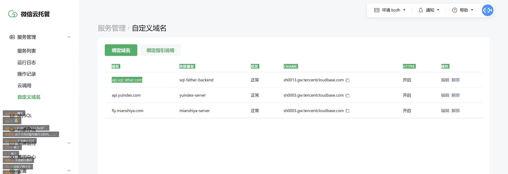

### Vercel + 微信云托管

**这种部署方式的优势：免备案** 

前端：Vercel（免费）

后端：微信云托管（部署容器的平台，付费）

域名用在前端的部署上。有域名就能用，不用备案域名。

后端也可以绑定域名：

前端绑定域名参考教程：

https://www.bilibili.com/video/BV1TV4y1j76t/?vd_source=8db8b96215ac8720b334f74129448c4c

绑定前端域名的前提是要买一个域名，比如买了一个腾讯云的域名，然后到腾讯云的DNS解析控制台中，把那个域名解析到Vercel的服务器，相当于Vercel是一个中转站，请求转发到Vercel之后，Vercel再解析到对应的前端项目。

### 宝塔面板（todo）